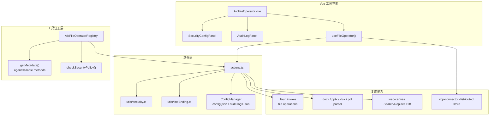
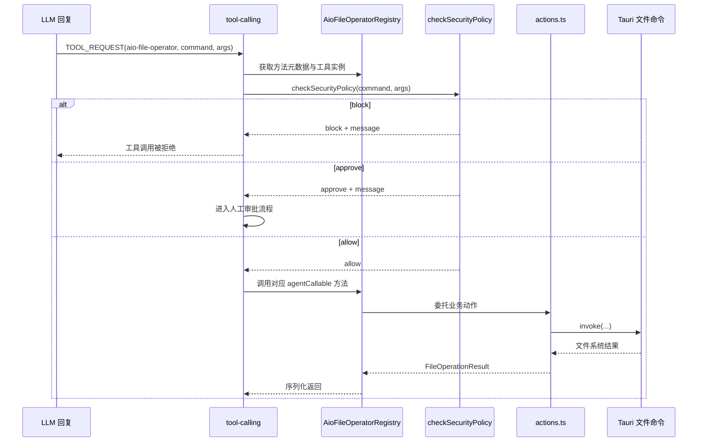
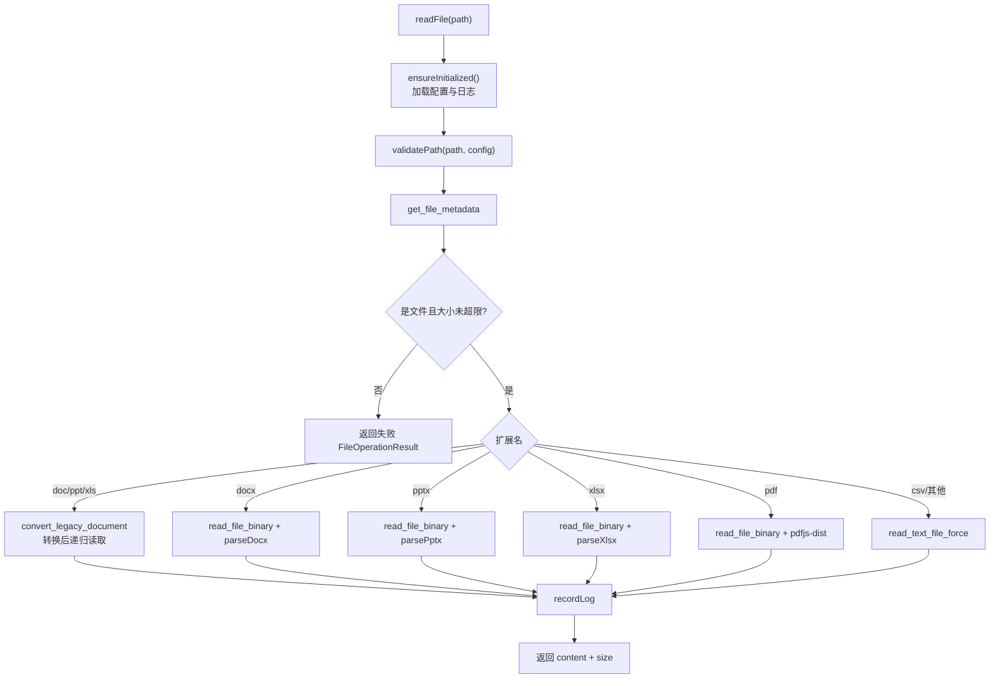

# Aio File Operator: 架构与开发者指南

> 更新日期：2026-06-30

本文档描述 `aio-file-operator` 的模块定位、调用链、安全边界和维护要点。该工具面向 Agent 暴露受控的本地文件读写能力，同时提供可视化配置与审计日志。

## 1. 模块定位

`aio-file-operator` 是 AIO Hub 的**本地文件操作工具桥**。它没有独立实现一套文件系统后端，只是在前端工具层做封装：

- Agent 可调用的方法元数据与执行入口
- 路径沙箱、审批区/死区规则和文件大小限制
- 通用 Tauri 文件命令、文档解析器和 Search/Replace Diff 引擎
- 用户可视化配置面板与最近操作审计日志

它的核心目标是让 LLM Agent 能在用户设定的安全边界内执行真实磁盘操作，并把每次操作的结果以稳定结构返回给工具调用系统。

## 2. 目录结构

```
src/tools/aio-file-operator/
├── AioFileOperator.vue                  # 主布局：安全配置面板 + 可折叠审计日志
├── aio-file-operator.registry.ts        # 工具注册、settings schema、Agent 方法暴露
├── actions.ts                           # 非响应式业务动作层：配置、日志、文件操作
├── config.ts                            # 默认配置与默认允许目录
├── types.ts                             # 参数、结果、配置和日志类型
├── ARCHITECTURE.md                      # 本文档
├── components/
│   ├── SecurityConfigPanel.vue          # 路径规则、文件大小、覆盖策略等配置 UI
│   └── AuditLogPanel.vue                # 操作审计日志 UI
├── composables/
│   └── useFileOperator.ts               # UI 状态编排、配置保存、VCP 分布式状态显示
├── utils/
│   ├── lineEnding.ts                    # apply_diff 的换行符归一化/还原
│   └── security.ts                      # 路径沙箱与安全策略判断
└── __tests__/
    └── aio-file-operator.test.ts        # Agent 方法、策略和 diff 行为单测
```

**Rust 后端**：复用 `src-tauri/src/commands/file_operations.rs` 与 `src-tauri/src/commands/document_converter.rs` 中的通用命令，无专属 Rust 模块。

## 3. 架构概览



## 4. Agent 调用集成

`aio-file-operator.registry.ts` 同时承担工具 UI 注册和 Agent 方法暴露：

- `toolConfig` 注册工具名称、路由、图标、组件和分类。
- `settingsSchema` 将常用配置接入全局设置渲染器。
- `getMetadata()` 暴露 8 个 `agentCallable` 方法，供 `tool-calling` 发现并生成 Prompt。
- `checkSecurityPolicy()` 为工具执行器提供前置安全检查，返回 `allow` / `approve` / `block`。
- 实例方法将 Agent 参数转换后委托给 `actions.ts`，例如 `write_file` 会用 `parseAgentBoolean()` 解析 `allowOverwrite`。

### 4.1. Agent 方法清单

| 方法               | 用途                               | 关键保护                             |
| ------------------ | ---------------------------------- | ------------------------------------ |
| `read_file`        | 读取文本、Office、PDF、CSV 等文件  | 路径沙箱、文件大小上限、文件类型校验 |
| `write_file`       | 写入文本文件                       | 路径沙箱、覆盖策略、父目录自动创建   |
| `append_file`      | 追加文本内容                       | 路径沙箱、审计日志                   |
| `delete_file`      | 删除文件到系统回收站               | 路径沙箱、非粉碎删除                 |
| `list_directory`   | 列出目录条目与元数据               | 路径沙箱、逐项元数据容错             |
| `apply_diff`       | 对文本文件应用 Search/Replace 修改 | 路径沙箱、换行符保持、diff 匹配策略  |
| `create_directory` | 递归创建目录                       | 路径沙箱                             |
| `path_exists`      | 检查路径是否存在                   | 路径沙箱                             |

## 5. 数据流

### 5.1. Agent 执行流程



### 5.2. 文件读取流程



### 5.3. 写入与覆盖策略

`writeFile()` 的覆盖行为由 `currentConfig.overwritePolicy` 和 Agent 参数 `allowOverwrite` 共同决定：

| 策略     | 行为                                                              |
| -------- | ----------------------------------------------------------------- |
| `follow` | 仅当 `allowOverwrite === true` 时覆盖，否则自动生成 `name(1).ext` |
| `always` | 文件存在时直接覆盖                                                |
| `never`  | 文件存在时始终自动累加序号                                        |

写入前会先检查目标路径是否存在，必要时通过 `create_dir_force` 创建父目录，再调用 `write_text_file_force` 写入。

### 5.4. Diff 修改流程

`applyDiff()` 复用 `web-canvas/utils/diff` 的 `applySearchReplaceDiff()`：

1. 读取原始文本：`read_text_file_force`
2. 检测原文件主要换行符：`createLineEndingHelper()`
3. 将原文、search、replace 统一归一化为 LF
4. 调用 Search/Replace Diff 引擎，支持 `startLine` 缩小匹配范围
5. 将结果恢复为原文件换行风格
6. 通过 `write_text_file_force` 写回
7. 返回匹配策略、置信度、命中行范围和警告

这保证 Windows CRLF 文件在局部修改后不会被整体转换成 LF。

## 6. 安全策略

安全策略集中在 `utils/security.ts`，执行时分两层：

### 6.1. 沙箱模式

| 模式        | 语义                                                           |
| ----------- | -------------------------------------------------------------- |
| `whitelist` | 仅允许访问 `allowedDirectories` 下的路径，其他路径直接 `block` |
| `blacklist` | 默认允许访问，但继续应用 `blackListRules`                      |

路径判断前会将反斜杠统一为正斜杠，并处理 `.` / `..`，降低路径穿越风险。

### 6.2. 细分规则

`blackListRules` 支持两种规则：

- `block`：死区，完全禁止访问，优先级最高。
- `approve`：审批区，返回 `approve`，由工具调用执行器触发人工审批，不被自动审批绕过。

`validatePath()` 只在动作层将 `block` 视为异常。`approve` 的前置拦截依赖 `AioFileOperatorRegistry.checkSecurityPolicy()` 被工具调用执行器调用；因此后续如果新增 Agent 方法，必须确保方法参数中的路径字段能被该策略识别。

### 6.3. 文件大小限制

`readFile()` 在实际读取前调用 `get_file_metadata` 并通过 `validateFileSize()` 校验 `maxFileSize`，默认 10MB，避免读取超大文件导致 IPC、解析器或 WebView 卡顿。

## 7. 配置与审计日志

`actions.ts` 使用两个 `createConfigManager()` 实例：

| 管理器          | moduleName          | fileName          | 内容                                            |
| --------------- | ------------------- | ----------------- | ----------------------------------------------- |
| `configManager` | `aio-file-operator` | `config.json`     | 沙箱目录、安全规则、文件大小、覆盖策略、UI 状态 |
| `logManager`    | `aio-file-operator` | `audit-logs.json` | 最近操作审计日志                                |

模块初始化时通过单例 `initPromise` 加载配置和日志，所有动作入口先 `ensureInitialized()`，避免未加载配置时执行文件操作。

审计日志策略：

- `enableAuditLog` 关闭时不记录。
- 每条日志包含时间戳、方法、参数摘要和结果。
- 内存中只保留最近 100 条。
- 保存使用 `saveDebounced()`，降低高频 Agent 调用时的 IPC 写入压力。

## 8. UI 结构

`AioFileOperator.vue` 是工具主容器：

- 左侧 `SecurityConfigPanel`：配置沙箱模式、白名单目录、死区/审批区规则、最大读取大小、覆盖策略和审计日志开关。
- 右侧 `AuditLogPanel`：展示最近调用记录，可清空、可折叠。
- 中间分割线支持调整日志面板宽度，鼠标释放时再保存配置。
- 顶部状态徽章读取 `useVcpDistributedStore()`，显示工具是否已通过 `vcp-connector` 的分布式节点暴露。

`useFileOperator()` 负责把 UI 状态与 `actions.ts` 串起来，并处理路径选择、拖放、规则新增删除、日志刷新等交互。

## 9. 复用的 Tauri 命令与前端解析器

### 9.1. Tauri 命令

| 命令                      | 用途                                   |
| ------------------------- | -------------------------------------- |
| `get_file_metadata`       | 获取大小、文件/目录类型、创建/修改时间 |
| `read_text_file_force`    | 读取文本文件                           |
| `read_file_binary`        | 读取二进制文件供文档解析               |
| `write_text_file_force`   | 写入文本文件                           |
| `append_file_force`       | 追加字节内容                           |
| `delete_file_to_trash`    | 移入系统回收站                         |
| `list_directory`          | 列出目录直接子项                       |
| `create_dir_force`        | 创建目录                               |
| `path_exists`             | 判断路径是否存在                       |
| `convert_legacy_document` | 将旧版 Office 文档转换为现代格式后读取 |

### 9.2. 前端解析器和共享逻辑

| 依赖                        | 用途                     |
| --------------------------- | ------------------------ |
| `@/utils/docxParser`        | DOCX 文本提取            |
| `@/utils/zipDocumentParser` | PPTX / XLSX 文本提取     |
| `pdfjs-dist`                | PDF 逐页文本提取         |
| `../web-canvas/utils/diff`  | Search/Replace Diff 引擎 |
| `@/utils/configManager`     | 配置和日志持久化         |
| `@/utils/errorHandler`      | 模块级错误处理           |

## 10. 类型系统

| 类型                        | 用途                                                           |
| --------------------------- | -------------------------------------------------------------- |
| `FileOperationResult`       | 所有 Agent 方法统一返回结构：`success`、`message`、可选 `data` |
| `FileEntry`                 | `list_directory` 返回的文件/目录条目                           |
| `OperationLogEntry`         | 审计日志条目                                                   |
| `SecurityRule`              | 死区/审批区规则                                                |
| `AioFileOperatorConfig`     | 工具配置和 UI 状态                                             |
| `ReadFileParams` 等参数类型 | 记录 Agent 方法的输入契约                                      |

## 11. 测试策略

`__tests__/aio-file-operator.test.ts` 通过 mock Tauri `invoke` 覆盖主要行为：

- 写入覆盖策略与自动重命名
- 文本读取、元数据校验和大文件保护
- 删除、追加、目录列表、创建目录、路径存在检查
- Search/Replace Diff 匹配与换行符保持
- 白名单、死区、审批区等安全策略
- `getMetadata()` 暴露的 Agent 方法清单

涉及真实 Tauri 文件系统行为时，应优先补 Rust 命令或集成测试；前端单测只验证工具层契约。

## 12. 扩展指南

新增 Agent 方法时需要同步检查：

1. 在 `getMetadata()` 中添加方法描述、参数和 `agentCallable: true`。
2. 在 registry 类上添加同名实例方法，并委托到 `actions.ts`。
3. 在 `actions.ts` 中先 `ensureInitialized()`，再执行 `validatePath()` 或更细的安全校验。
4. 如方法有多个路径参数，扩展 `checkSecurityPolicy()`，避免只校验 `args.path`。
5. 为成功和失败路径调用 `recordLog()` 或 `buildErrorResult()`。
6. 增补 `__tests__/aio-file-operator.test.ts`。

## 13. 已知边界与未来展望

- **多路径安全校验**：当前安全策略默认读取 `args.path`，如果未来支持复制/移动等双路径操作，需要同时校验源路径和目标路径。
- **读取类型扩展**：可补充 Markdown 表格、HTML、RTF 等格式的专用提取器。
- **更强的审计能力**：可增加按方法/路径过滤、导出日志、展示审批记录等能力。
- **后端级沙箱**：当前沙箱主要在前端工具层执行；如未来暴露给更广泛入口，可考虑在 Rust 命令层增加可复用的策略校验。

