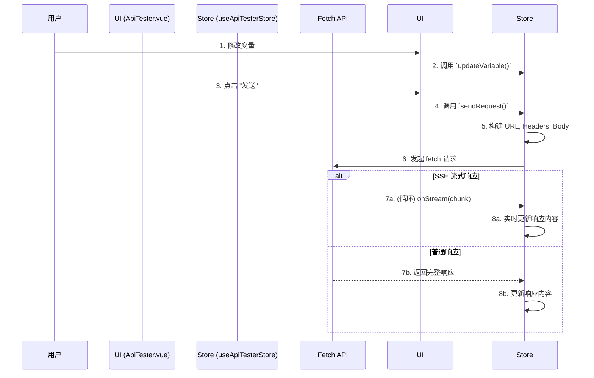

# API Tester: 架构与开发者指南

本文档旨在解析 API Tester 工具的内部架构、设计理念和数据流，为后续开发提供清晰的指引。

## 1. 核心概念

API Tester 的设计围绕三大核心概念，旨在提供一个灵活、高效且易于使用的 HTTP API 测试环境。

### 1.1. 预设驱动 (Preset-Driven)

预设是本工具的基石，它是一个包含了 **URL模板、变量定义、请求头和请求体模板** 的完整配置集。

- **核心优势**: 用户通过选择预设（如 "OpenAI Chat Completion"）即可自动填充所有字段，只需关注少量变量。
- **智能适配**: 系统会根据预设 ID 自动应用特定逻辑（如构建 `Authorization` 请求头），简化对不同 API 的测试流程。

### 1.2. 变量系统 (Variable System)

为了实现最大的灵活性，工具内置了一个采用 `{{variable}}` 占位符语法的模板变量系统。

- **应用范围**: 变量可同时应用于 **URL**、**请求头** 和 **请求体**。
- **动态构建**: 发送请求时，系统会使用当前变量字典动态替换所有占位符，生成最终请求。

### 1.3. 流式响应处理 (Streaming Response)

原生支持对 `text/event-stream` 内容类型的自动检测和处理，以适应现代 LLM API 的流式响应。

- **自动检测**: 检查响应头的 `Content-Type`。
- **实时渲染**: 流式响应内容被逐块解码并实时追加到响应面板。
- **请求中止**: 内置 `AbortController` 机制，允许用户随时中止请求。

## 2. 架构概览

工具采用基于 Pinia 的集中式状态管理模式，将 UI、状态和业务逻辑清晰分离。

- **State (`useApiTesterStore`)**: 作为所有状态的唯一真实来源 (Source of Truth)，管理当前预设、URL、变量、请求/响应内容等。
- **View (`ApiTester.vue`)**: 负责渲染 UI 界面，用户交互会触发 Store 中的 actions。
- **Logic (Store Actions)**: 封装了所有核心业务逻辑，包括构建请求、调用 Fetch API、处理响应和管理状态变更。

## 3. 数据流：发送一次请求

## 4. 数据持久化

常用的请求配置可以被保存为 **请求档案 (Request Profile)**，存储在 `localStorage` 中。

- **数据结构**: 每个档案包含名称、所基于的预设 ID、以及所有自定义的变量、请求头和请求体。

## 5. 未来展望

- **请求历史**: 增加记录历史请求的功能。
- **环境变量**: 支持在不同环境（如开发/生产）之间快速切换变量集。
