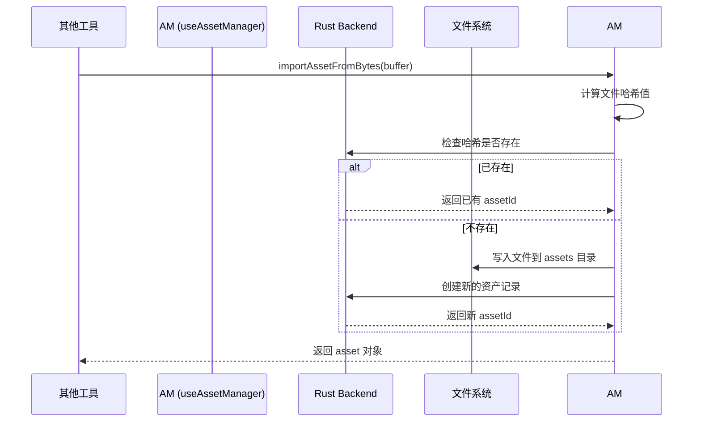

# Asset Manager: 架构与开发者指南

本文档旨在解析 Asset Manager 工具的内部架构、设计理念和数据流，为后续开发提供清晰的指引。

## 1. 核心概念

Asset Manager 是应用的**中央资产管理中心**，提供统一的资产存储、索引、查询和去重功能。

### 1.1. 统一资产管理 (Unified Asset Management)

通过全局单例 `useAssetManager` 管理所有资产，实现跨工具的资产复用。

- **统一存储**: 所有工具的资产都保存到 `$APPDATA/assets/` 目录。
- **自动去重**: 基于文件哈希值进行重复文件检测，相同文件只存储一次。
- **来源追踪**: 记录每个资产的来源模块（如 `llm-chat`）和来源类型（如 `local`, `clipboard`）。

### 1.2. Rust 后端索引 (Rust-powered Indexing)

所有查询、筛选和排序操作都通过 Rust 后端执行，以获得高性能。

- **核心优势**:
  - **高性能**: 利用 SQLite FTS 实现全文搜索，支持复杂筛选和分页加载。
  - **准确性**: 直接操作文件系统元数据，保证数据一致性。
- **查询接口**: 前端通过 `invoke` 调用 Rust 命令（如 `list_assets_paginated`）执行查询。

### 1.3. 多维度分组与筛选 (Multi-dimensional Grouping & Filtering)

支持灵活的数据组织方式，便于用户快速定位资产。

- **分组维度**: 支持按 **月份**、**类型**、**来源** 和 **来源模块** 对资产进行分组。
- **筛选条件**: 可按文件类型、来源模块、搜索关键词等进行精确筛选。

## 2. 架构概览

- **State (`useAssetManager`)**: 全局单例 Composable，管理资产列表、统计信息和用户偏好。
- **View (`AssetManager.vue`)**: 负责 UI 渲染，包括网格/列表视图、筛选器和分组器。
- **Engine (Rust Backend)**: 负责实际的文件存储、索引、查询和去重逻辑。

## 3. 数据流：导入一个新资产

## 4. 核心逻辑

- **无限滚动**: 使用 `useInfiniteScroll` 实现资产列表的懒加载，优化大规模数据集的性能。
- **重复文件扫描**: 通过 `find_duplicate_files` 命令扫描所有文件的哈希值，找出重复项并计算可节省的空间。
- **配置持久化**: 用户的视图偏好（如视图模式、分组方式、排序规则）会自动保存，并在下次启动时恢复。

## 5. 未来展望

- **性能优化**: 针对超过10万个资产的场景，优化后端查询性能。
- **视频处理**: 改进视频缩略图的生成速度和效率。
