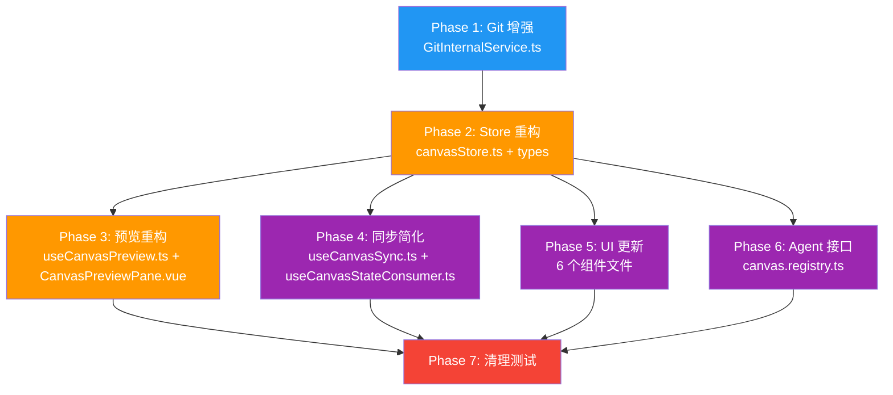

# Canvas 预览系统重构施工文档：Physical-First 架构

> **状态**: Implementing
> **前置文档**: [preview-resource-strategy.md](./preview-resource-strategy.md)
> **目标**: 将 Canvas 从"VFS 影子文件 + srcdoc 内联"架构迁移到"物理文件优先 + Git 版本控制 + asset:// 协议预览"架构
> **跳过 Phase 0**：不再注入 `<base>` 标签作为过渡方案，直接全面切换到 Physical-First

---

## 0. 调查报告：当前架构的致命问题

### 0.1 界面空白的根因

实际测试中，分离窗口的 `<iframe srcdoc="">` 是**空字符串**。追踪调用链：

```
CanvasWindow.vue
  → useCanvasStateConsumer()     // 获取 activeCanvasId + pendingUpdates
  → useCanvasPreview()           // 传入 canvasId, pendingUpdates, readPhysicalFile, basePath
  → watch(activeCanvasId)        // ID 变化时触发 refreshPreview()
  → refreshPreview()             // 检查 effectiveMode
  → buildSrcdoc()                // 构建内联 HTML
  → resolveFileContent("index.html")  // 先查 pendingUpdates，再读物理文件
```

**失败点**：

1. [`useCanvasStateConsumer`](../../composables/useCanvasStateConsumer.ts:12) 的 `activeCanvasId` 初始为 `null`，需要等主窗口推送
2. 即使 ID 到位，[`resolveFileContent`](../../composables/useCanvasPreview.ts:35) 读取物理文件时，`canvasId` 可能还没同步到位
3. [`readPhysicalFile`](../../composables/useCanvasStorage.ts:45) 被 `errorHandler.wrapAsync` 包裹，失败时**静默返回 `null`**
4. [`buildSrcdoc`](../../composables/useCanvasPreview.ts:47) 第 49 行：`if (!html) return ""` — 直接返回空字符串
5. 结果：`srcdoc.value = ""` → iframe 渲染空白

**即使文件读取成功**，`srcdoc` 模式还有以下问题：

- 所有相对路径资源（图片、字体、fetch）指向 `about:srcdoc`，全部 404
- CSS/JS 内联正则可能遗漏变体写法
- 注入的控制台捕获脚本增加了 HTML 解析复杂度

### 0.2 当前架构文件清单与职责

| 文件                                                                        | 行数 | 职责                                           | 重构影响     |
| --------------------------------------------------------------------------- | ---- | ---------------------------------------------- | ------------ |
| [`canvasStore.ts`](../../stores/canvasStore.ts)                             | 586  | 核心 Store：影子文件管理、Diff 应用、提交/丢弃 | **重写**     |
| [`useCanvasPreview.ts`](../../composables/useCanvasPreview.ts)              | 231  | 预览引擎：srcdoc 构建、CSS/JS 内联、热替换     | **重写**     |
| [`useCanvasSync.ts`](../../composables/useCanvasSync.ts)                    | 195  | 跨窗口同步：3 层同步引擎                       | **大幅简化** |
| [`useCanvasStateConsumer.ts`](../../composables/useCanvasStateConsumer.ts)  | 75   | 分离窗口状态消费                               | **大幅简化** |
| [`GitInternalService.ts`](../../services/GitInternalService.ts)             | 180  | Git 操作封装（init/add/commit/log）            | **增强**     |
| [`useCanvasStorage.ts`](../../composables/useCanvasStorage.ts)              | 215  | 物理文件读写、元数据管理                       | **无改动**   |
| [`canvas.registry.ts`](../../canvas.registry.ts)                            | 254  | Agent 接口 + 审批钩子                          | **重写**     |
| [`CanvasWindow.vue`](../../components/window/CanvasWindow.vue)              | 159  | 分离预览窗口                                   | **适配**     |
| [`CanvasPreviewPane.vue`](../../components/window/CanvasPreviewPane.vue)    | 100  | iframe 预览容器                                | **简化**     |
| [`CanvasFloatingBar.vue`](../../components/window/CanvasFloatingBar.vue)    | 211  | 悬浮工具栏                                     | **简化**     |
| [`CanvasStatusBar.vue`](../../components/window/CanvasStatusBar.vue)        | 88   | 底部状态栏                                     | **适配**     |
| [`CanvasEditorPanel.vue`](../../components/workbench/CanvasEditorPanel.vue) | 486  | 编辑器面板                                     | **适配**     |
| [`PendingChangesBar.vue`](../../components/shared/PendingChangesBar.vue)    | 179  | 待定更改列表                                   | **重写**     |
| [`types/index.ts`](../../types/index.ts)                                    | 80   | 类型定义                                       | **更新**     |
| [`types/canvas-metadata.ts`](../../types/canvas-metadata.ts)                | 25   | 元数据类型                                     | **无改动**   |
| [`templates.ts`](../../templates.ts)                                        | 83   | 内置模板                                       | **无改动**   |
| [`CanvasWorkbench.vue`](../../CanvasWorkbench.vue)                          | 179  | 主工作台入口                                   | **无改动**   |
| [`useCanvasWindowManager.ts`](../../composables/useCanvasWindowManager.ts)  | 93   | 窗口管理                                       | **无改动**   |

### 0.3 基础设施确认（已验证）

- ✅ Tauri `assetProtocol` 已启用，scope 包含 `$APPDATA/**`（Canvas 数据在 `appDataDir/canvases/`）
- ✅ CSP 已包含 `asset:` 和 `http://asset.localhost`（`index.html:7`）
- ✅ `convertFileSrc` 已在项目中广泛使用（`agentAssetUtils.ts`）
- ✅ `isomorphic-git` 已集成，[`GitInternalService`](../../services/GitInternalService.ts) 已有 `init`/`add`/`commit`/`log`
- ✅ [`useCanvasStorage`](../../composables/useCanvasStorage.ts) 的 `readPhysicalFile`/`writePhysicalFile` 工作正常
- ✅ iframe `sandbox="allow-scripts allow-same-origin allow-popups"` 已配置

---

## 1. 重构后的数据流

### 重构前（当前）

```
Agent write_canvas_file
  → canvasStore.writeFile()              // 写入 pendingUpdates (内存 reactive)
  → useCanvasSync watch                  // 检测 pendingUpdates 变化
  → bus.syncState('file-delta')          // 序列化传输到分离窗口
  → useCanvasStateConsumer               // 接收并写入本地 pendingUpdates
  → useCanvasPreview.buildSrcdoc()       // VFS 合并 + CSS/JS 内联 + 控制台注入
  → iframe.srcdoc = mergedHtml           // 渲染（资源路径 404，且经常为空）
```

### 重构后

```
Agent write_canvas_file
  → canvasStore.writeFilePhysical()      // 直接写入磁盘 (~5ms SSD)
  → emitFileChanged()                    // 触发内部事件
  → useCanvasSync                        // 广播 'file-changed' 通知到分离窗口
  → useCanvasStateConsumer               // 接收通知
  → useCanvasPreview.refreshPreview()    // 更新 iframe.src 时间戳
  → iframe 重新加载 asset:// URL         // 浏览器原生解析所有资源 ✅
```

### 关键收益

| 维度       | 重构前                          | 重构后                        |
| ---------- | ------------------------------- | ----------------------------- |
| 资源加载   | 静态资源 404，动态请求失败      | **全部天然支持**              |
| 预览模式   | 两种模式割裂（srcdoc/physical） | **统一为物理预览**            |
| 同步层数   | 3 层（内存→序列化→VFS合并）     | **1 层（文件变更通知）**      |
| 外部编辑   | VSCode 修改不可见               | **实时刷新**（需 FS Watcher） |
| 多页面应用 | 不支持                          | **天然支持**                  |

---

## 2. 分阶段施工计划

### 施工顺序依赖图



**关键路径**: P1 → P2 → P3/P4/P5/P6 (可并行) → P7

**最小可用版本**: 完成 P1 + P2 + P3 后即可获得核心收益（统一物理预览 + 资源全部可用）。

---

## Phase 1: GitInternalService 增强

> **目标**: 为 Git 驱动的审批/回退系统提供底层能力。

### 改动范围

| 文件                                                            | 改动                                 |
| --------------------------------------------------------------- | ------------------------------------ |
| [`GitInternalService.ts`](../../services/GitInternalService.ts) | 新增 `checkout`、`statusMatrix` 方法 |

### 1.1 `checkout` — 回退文件到上次提交

```typescript
/**
 * 将指定文件回退到 HEAD 版本
 * @param filepaths 要回退的文件路径数组，传空数组表示回退所有文件
 */
async checkout(filepaths: string[]): Promise<void> {
  // 使用 isomorphic-git 的 checkout API
  await git.checkout({
    fs: this.fs,
    dir: this.basePath,
    filepaths: filepaths.length > 0 ? filepaths : undefined,
    force: true,
  });
}
```

### 1.2 `statusMatrix` — 获取工作区状态矩阵

```typescript
/**
 * 获取工作区的文件状态矩阵
 * @returns 状态矩阵数组 [filepath, HEAD, WORKDIR, STAGE]
 */
async statusMatrix(): Promise<Array<[string, number, number, number]>> {
  return await git.statusMatrix({
    fs: this.fs,
    dir: this.basePath,
    filter: (f: string) => !f.startsWith('.canvas') && !f.startsWith('.git'),
  });
}
```

**状态码含义**（来自 isomorphic-git 文档）：

| HEAD | WORKDIR | STAGE | 含义               |
| ---- | ------- | ----- | ------------------ |
| 0    | 2       | 0     | new, untracked     |
| 1    | 1       | 1     | unmodified         |
| 1    | 2       | 1     | modified, unstaged |
| 1    | 0       | 1     | deleted, unstaged  |

---

## Phase 2: canvasStore 核心重构

> **目标**: 移除内存影子文件层，所有写入直接落盘，用 Git 替代内存快照。

### 改动范围

| 文件                                            | 改动类型 |
| ----------------------------------------------- | -------- |
| [`canvasStore.ts`](../../stores/canvasStore.ts) | **重写** |
| [`types/index.ts`](../../types/index.ts)        | 更新     |

### 2.1 要移除的状态和方法

从 [`canvasStore.ts`](../../stores/canvasStore.ts) 中移除：

| 状态/方法                      | 当前位置 | 移除原因                          |
| ------------------------------ | -------- | --------------------------------- |
| `pendingUpdates`               | :25      | 不再需要内存影子文件              |
| `undoStacks`                   | :27      | 用 Git checkout 替代              |
| `previewSnapshots`             | :29-38   | 用 `previewRequests` 替代         |
| `activePendingUpdates`         | :48-50   | 依赖 pendingUpdates               |
| `hasPendingChanges` (computed) | :53      | 改为基于 Git status               |
| `writeFile()`                  | :214-226 | 改为 `writeFilePhysical()`        |
| `writeFileAsPreview()`         | :198-209 | 用物理写入 + previewRequests 替代 |
| `applyDiffAsPreview()`         | :231-243 | 用物理写入 + previewRequests 替代 |
| `revertPreview()`              | :280-296 | 用 `git checkout` 替代            |
| `undoDiff()`                   | :301-308 | 用 `git checkout` 替代            |

### 2.2 要新增/重写的核心方法

#### 文件变更事件系统（新增）

```typescript
type FileChangeHandler = (canvasId: string, filepath: string) => void;
const fileChangeHandlers = new Set<FileChangeHandler>();

function onFileChanged(handler: FileChangeHandler) {
  fileChangeHandlers.add(handler);
  return () => fileChangeHandlers.delete(handler);
}

function emitFileChanged(canvasId: string, filepath: string) {
  fileChangeHandlers.forEach((handler) => handler(canvasId, filepath));
}
```

#### `writeFilePhysical` — 直接物理写入（替代 `writeFile`）

```typescript
async function writeFilePhysical(canvasId: string, filepath: string, content: string) {
  await storage.writePhysicalFile(canvasId, filepath, content);
  emitFileChanged(canvasId, filepath);
}
```

#### `applyDiff` — 重写为直接应用到物理文件

```typescript
async function applyDiff(canvasId: string, filepath: string, diff: string) {
  const originalContent = (await storage.readPhysicalFile(canvasId, filepath)) || "";
  const newContent = applySearchReplaceDiff(originalContent, diff);
  if (newContent === originalContent) {
    logger.warn("Diff 应用后内容无变化", { filepath });
    return;
  }
  await storage.writePhysicalFile(canvasId, filepath, newContent);
  emitFileChanged(canvasId, filepath);
}
```

> 注意：`applySearchReplaceDiff` 纯函数（:440-558）保持不变。

#### `dirtyFiles` + `hasPendingChanges` — 基于 Git status

```typescript
const dirtyFiles = ref<Map<string, string>>(new Map()); // filepath -> status

const hasPendingChanges = computed(() => dirtyFiles.value.size > 0);

async function refreshGitStatus(canvasId: string) {
  const basePath = await storage.getCanvasBasePath(canvasId);
  const gitService = new GitInternalService(basePath);
  const matrix = await gitService.statusMatrix();
  const dirty = new Map<string, string>();
  for (const [filepath, head, workdir] of matrix) {
    if (head !== workdir) {
      if (head === 0 && workdir === 2) dirty.set(filepath, "new");
      else if (head === 1 && workdir === 2) dirty.set(filepath, "modified");
      else if (head === 1 && workdir === 0) dirty.set(filepath, "deleted");
      else dirty.set(filepath, "modified");
    }
  }
  dirtyFiles.value = dirty;
}
```

#### `commitChanges` — 简化

```typescript
async function commitChanges(canvasId: string, message?: string) {
  const basePath = await storage.getCanvasBasePath(canvasId);
  const gitService = new GitInternalService(basePath);
  const matrix = await gitService.statusMatrix();
  const filesToAdd = matrix.filter(([_, head, workdir]) => head !== workdir).map(([filepath]) => filepath);
  if (filesToAdd.length === 0) return;
  await gitService.add(filesToAdd);
  await gitService.commit(message || `Update ${filesToAdd.length} files`);
  // 更新元数据
  const metadata = await storage.readCanvasMetadata(canvasId);
  if (metadata) {
    metadata.updatedAt = Date.now();
    await storage.writeCanvasMetadata(canvasId, metadata);
  }
  await refreshGitStatus(canvasId);
}
```

#### `discardChanges` — 用 Git checkout 替代

```typescript
async function discardChanges(canvasId: string) {
  const basePath = await storage.getCanvasBasePath(canvasId);
  const gitService = new GitInternalService(basePath);
  await gitService.checkout([]);
  await refreshGitStatus(canvasId);
  emitFileChanged(canvasId, "*");
}
```

#### `readCanvasFileAsync` — 简化为只读物理文件

```typescript
async function readCanvasFileAsync(canvasId: string, filepath: string): Promise<string | null> {
  return await storage.readPhysicalFile(canvasId, filepath);
}
```

#### `getFileTree` — 简化（移除影子文件合并）

```typescript
async function getFileTree(canvasId: string): Promise<CanvasFileNode[]> {
  const physicalTree = await storage.getCanvasFileTree(canvasId);
  const dirty = dirtyFiles.value;
  const markStatus = (nodes: CanvasFileNode[]): CanvasFileNode[] => {
    return nodes.map((node) => ({
      ...node,
      status: (dirty.get(node.path) as any) || "clean",
      children: node.children ? markStatus(node.children) : undefined,
    }));
  };
  return markStatus(physicalTree);
}
```

#### `previewRequests` — 审批系统轻量级映射（替代 `previewSnapshots`）

```typescript
const previewRequests = reactive<
  Record<
    string,
    {
      canvasId: string;
      affectedFiles: string[];
    }
  >
>();

function registerPreviewRequest(requestId: string, canvasId: string, files: string[]) {
  previewRequests[requestId] = { canvasId, affectedFiles: files };
}

function getPreviewRequest(requestId: string) {
  return previewRequests[requestId] || null;
}

function removePreviewRequest(requestId: string) {
  delete previewRequests[requestId];
}
```

### 2.3 类型更新

[`types/index.ts`](../../types/index.ts) 中的 `CanvasListItem`：

```typescript
// 重构前
export interface CanvasListItem {
  metadata: CanvasMetadata;
  status: "idle" | "open" | "pending" | "syncing";
  pendingFileCount: number;
}

// 重构后
export interface CanvasListItem {
  metadata: CanvasMetadata;
  status: "idle" | "open" | "dirty" | "syncing";
  dirtyFileCount: number;
}
```

---

## Phase 3: 预览系统重构

> **目标**: 移除 srcdoc 模式，统一为 asset:// 物理预览。

### 改动范围

| 文件                                                                     | 改动类型 |
| ------------------------------------------------------------------------ | -------- |
| [`useCanvasPreview.ts`](../../composables/useCanvasPreview.ts)           | **重写** |
| [`CanvasPreviewPane.vue`](../../components/window/CanvasPreviewPane.vue) | **简化** |

### 3.1 `useCanvasPreview.ts` — 重写

**移除的函数**（约 150 行）：

- [`buildSrcdoc()`](../../composables/useCanvasPreview.ts:47) — 整个 VFS 合并逻辑
- [`resolveFileContent()`](../../composables/useCanvasPreview.ts:35) — 影子文件优先读取
- [`inlineCssReferences()`](../../composables/useCanvasPreview.ts:62) — CSS 内联
- [`inlineJsReferences()`](../../composables/useCanvasPreview.ts:81) — JS 内联
- [`injectConsoleCapture()`](../../composables/useCanvasPreview.ts:95) — 控制台捕获注入
- [`hotReloadCss()`](../../composables/useCanvasPreview.ts:159) — CSS 热替换

**移除的状态**：

- `srcdoc` ref
- `physicalSrc` ref（改名为 `previewSrc`）
- `previewMode` ref
- `effectiveMode` computed

**新接口签名**：

```typescript
export function useCanvasPreview(options: {
  canvasId: () => string | null;
  basePath: () => string | null;
  entryFile?: () => string;
}) {
  const previewSrc = ref("");
  const isRefreshing = ref(false);
  const consoleMessages = ref<ConsoleMessage[]>([]);

  function buildPreviewUrl(): string {
    const path = options.basePath();
    const entry = options.entryFile?.() || "index.html";
    if (!path) return "";
    const normalizedPath = path.replace(/\\/g, "/");
    return convertFileSrc(`${normalizedPath}/${entry}`);
  }

  const refreshPreview = debounce(() => {
    const baseUrl = buildPreviewUrl();
    if (!baseUrl) return;
    const separator = baseUrl.includes("?") ? "&" : "?";
    previewSrc.value = `${baseUrl}${separator}_t=${Date.now()}`;
  }, 300);

  function forceRefresh() {
    const baseUrl = buildPreviewUrl();
    if (!baseUrl) return;
    const separator = baseUrl.includes("?") ? "&" : "?";
    previewSrc.value = `${baseUrl}${separator}_t=${Date.now()}`;
  }

  function clearConsole() {
    consoleMessages.value = [];
  }

  return {
    previewSrc,
    isRefreshing,
    consoleMessages,
    refreshPreview,
    forceRefresh,
    clearConsole,
  };
}
```

### 3.2 `CanvasPreviewPane.vue` — 简化

```vue
<template>
  <div class="canvas-preview-pane">
    <div v-if="isRefreshing" class="loading-overlay">
      <Loader2 class="animate-spin" :size="24" />
    </div>
    <iframe
      ref="iframeRef"
      class="preview-iframe"
      :src="previewSrc"
      sandbox="allow-scripts allow-same-origin allow-popups"
    ></iframe>
  </div>
</template>
```

**移除**：

- `srcdoc` prop
- `physicalSrc` prop
- `effectiveMode` prop
- `v-if` 双 iframe 分支

**新增**：

- `previewSrc` prop（单一来源）

### 3.3 控制台捕获方案

物理模式下无法修改 HTML 内容注入脚本。**推荐方案**：在 Canvas 项目创建时，自动生成 `.canvas-devtools.js` 文件并在模板 HTML 中引用。该文件加入 `.gitignore`。

此功能为**增强功能**，不阻塞核心重构。可在 Phase 7 或后续迭代中实现。

---

## Phase 4: 跨窗口同步简化

> **目标**: 移除影子文件同步通道，改为轻量级"文件变更通知"。

### 改动范围

| 文件                                                                       | 改动类型     |
| -------------------------------------------------------------------------- | ------------ |
| [`useCanvasSync.ts`](../../composables/useCanvasSync.ts)                   | **大幅简化** |
| [`useCanvasStateConsumer.ts`](../../composables/useCanvasStateConsumer.ts) | **大幅简化** |

### 4.1 `useCanvasSync.ts`

**移除**：

- `pendingUpdates` computed 同步引擎（:43-50）
- Layer 3 watch 增量推送逻辑（:67-94）
- `write-file` 和 `apply-diff` action 中的手动增量推送（:129-165）

**保留**：

- `activeCanvasId` 同步引擎（:63）
- `handleActionRequest` 中的 `open-window`、`open-canvas`、`commit-changes`、`discard-changes`

**新增**：

```typescript
// 监听 store 的文件变更事件，广播到分离窗口
store.onFileChanged((canvasId, filepath) => {
  const targetLabel = windowManager.getWindowLabel(canvasId);
  bus.syncState(
    "canvas:file-changed" as any,
    {
      canvasId,
      filepath,
      timestamp: Date.now(),
    },
    0,
    false,
    targetLabel,
  );
});
```

### 4.2 `useCanvasStateConsumer.ts`

**重写为**：

```typescript
export function useCanvasStateConsumer() {
  const bus = useWindowSyncBus();
  const activeCanvasId = ref<string | null>(null);
  const lastFileChangeTimestamp = ref(0);

  function initialize() {
    // 只同步 canvasId
    const idEngine = useStateSyncEngine(activeCanvasId, {
      stateKey: "canvas:active-id" as any,
      autoPush: false,
      autoReceive: true,
      enableDelta: true,
    });

    // 监听文件变更通知
    const unlisten = bus.onMessage("state-sync", (payload: any) => {
      if (payload.stateType === "canvas:file-changed") {
        lastFileChangeTimestamp.value = payload.data.timestamp;
      }
    });

    bus.requestInitialState();
    return unlisten;
  }

  return {
    activeCanvasId,
    lastFileChangeTimestamp,
    initialize,
  };
}
```

**移除**：

- `pendingUpdates` reactive（:13）
- `canvasMetadata` ref（:14）
- `canvas:file-delta` 监听（:30-31）
- `canvas:pending-updates` 全量同步监听（:33-48）

---

## Phase 5: UI 组件更新

> **目标**: 适配新的数据流，移除过时的 UI 元素。

### 5.1 [`CanvasWindow.vue`](../../components/window/CanvasWindow.vue)

**关键改动**：

```typescript
// 重构前
const { activeCanvasId, pendingUpdates } = useCanvasStateConsumer();

// 重构后
const { activeCanvasId, lastFileChangeTimestamp } = useCanvasStateConsumer();
```

```typescript
// 重构前：传入 pendingUpdates 给预览引擎
const { srcdoc, physicalSrc, effectiveMode, ... } = useCanvasPreview({
  canvasId: () => activeCanvasId.value,
  pendingUpdates: () => pendingUpdates,
  readPhysicalFile: (id, path) => storage.readPhysicalFile(id, path),
  basePath: () => canvasBasePath.value,
});

// 重构后：只需 canvasId 和 basePath
const { previewSrc, isRefreshing, ... } = useCanvasPreview({
  canvasId: () => activeCanvasId.value,
  basePath: () => canvasBasePath.value,
});
```

```typescript
// 重构前：监听影子文件变化
watch(
  () => ({ ...pendingUpdates }),
  () => {
    refreshPreview(previewPaneRef.value?.iframe);
  },
  { deep: true },
);

// 重构后：监听文件变更通知
watch(lastFileChangeTimestamp, () => {
  refreshPreview();
});
```

**模板改动**：

- `CanvasPreviewPane` 的 props 从 `srcdoc/physicalSrc/effectiveMode` 改为 `previewSrc`
- `CanvasFloatingBar` 移除 `effectiveMode` prop 和 `toggle-preview-mode` 事件
- `CanvasStatusBar` 的 `pendingCount` 改为从 store 的 `dirtyFiles.size` 获取（需要通过某种方式传递，或改为 prop）

### 5.2 [`CanvasFloatingBar.vue`](../../components/window/CanvasFloatingBar.vue)

**移除**：

- `effectiveMode` prop（:62）
- `toggle-preview-mode` emit（:68）
- 预览模式切换按钮（:27-38）
- `Monitor`、`Code` 图标导入（:57）

### 5.3 [`CanvasEditorPanel.vue`](../../components/workbench/CanvasEditorPanel.vue)

**关键改动**：

```typescript
// 重构前：写入影子文件
const debouncedWriteFile = debounce((content: string) => {
  if (activeTab.value) {
    store.writeFile(props.canvasId, activeTab.value, content); // :101
    loadFileTree();
  }
}, 300);

// 重构后：写入物理文件
const debouncedWriteFile = debounce(async (content: string) => {
  if (activeTab.value) {
    await store.writeFilePhysical(props.canvasId, activeTab.value, content);
    loadFileTree();
  }
}, 500); // 防抖延长，减少磁盘写入频率
```

```typescript
// 重构前：丢弃只是清内存
const handleDiscard = () => {
  store.discardChanges(props.canvasId);  // :119
  ...
};

// 重构后：丢弃用 git checkout
const handleDiscard = async () => {
  await store.discardChanges(props.canvasId);
  customMessage.info('已丢弃更改');
  loadFileTree();
  await loadActiveFileContent();
};
```

```typescript
// 重构前：监听 pendingUpdates 同步编辑器内容
watch(
  () => store.pendingUpdates[props.canvasId]?.[activeTab.value || ''],  // :151
  (newVal) => { ... }
);

// 重构后：监听文件变更事件
onMounted(() => {
  store.onFileChanged((canvasId, filepath) => {
    if (canvasId === props.canvasId && filepath === activeTab.value) {
      loadActiveFileContent();
    }
  });
});
```

**底部状态栏**（:253）：

```typescript
// 重构前
{
  {
    Object.keys(store.pendingUpdates[canvasId] || {}).length;
  }
}
个待定更改;

// 重构后
{
  {
    store.dirtyFiles.size;
  }
}
个未提交更改;
```

### 5.4 [`PendingChangesBar.vue`](../../components/shared/PendingChangesBar.vue)

**Props 改动**：

```typescript
// 重构前
defineProps<{
  canvasId: string;
  pendingFiles: Record<string, string>;
}>();

// 重构后
defineProps<{
  canvasId: string;
  dirtyFiles: Map<string, string>; // filepath -> status ('new'|'modified'|'deleted')
}>();
```

**文件列表改动**：使用 Git status 标签替代硬编码的 `'modified'`。

### 5.5 [`CanvasStatusBar.vue`](../../components/window/CanvasStatusBar.vue)

`pendingCount` prop 语义改为 `dirtyCount`（未提交文件数）。

---

## Phase 6: Agent 接口 + 审批系统重构

> **目标**: 工具调用直接写物理文件，审批系统用 Git 操作替代内存快照。

### 改动范围

| 文件                                             | 改动                     |
| ------------------------------------------------ | ------------------------ |
| [`canvas.registry.ts`](../../canvas.registry.ts) | Agent 方法和审批钩子重写 |

### 6.1 Agent 方法重写

#### `write_canvas_file`（:179-191）

```typescript
// 重构前：写入影子文件
canvasStore.writeFile(canvasId, args.path, args.content);

// 重构后：直接写入物理文件
await canvasStore.writeFilePhysical(canvasId, args.path, args.content);
```

#### `apply_canvas_diff`（:165-177）

```typescript
// 重构前：应用到影子文件
await canvasStore.applyDiff(canvasId, args.path, args.diff);

// 重构后：直接应用到物理文件（applyDiff 内部已改为物理写入）
await canvasStore.applyDiff(canvasId, args.path, args.diff);
```

#### `discard_changes`（:201-207）

```typescript
// 重构后：内部调用 git checkout
await canvasStore.discardChanges(canvasId);
```

#### `undo_canvas_diff`（:209-215）

```typescript
// 重构后：语义变更，引导使用 discard_changes
return "Use discard_changes to revert all changes, or manually revert specific files.";
```

#### `getExtraPromptContext`（:23-77）

```typescript
// 重构前
return `...
Uncommitted Changes: ${pendingFiles.length} files
(Agent notice: These changes are only in memory. Use 'commit_changes' to save them to disk.)`;

// 重构后
return `...
Uncommitted Changes: ${dirtyFiles.size} files
(Agent notice: All changes are immediately written to disk and visible in preview. Use 'commit_changes' to create a Git checkpoint.)`;
```

### 6.2 审批系统钩子重写

#### `onToolCallPreview`（:230-242）

```typescript
// 重构后：直接写入物理文件，预览窗口自动刷新
async onToolCallPreview(requestId: string, methodName: string, args: Record<string, any>) {
  const canvasStore = useCanvasStore();

  if (methodName === 'apply_canvas_diff' && args.path && args.diff) {
    const canvasId = await canvasStore.ensureActiveCanvas();
    await canvasStore.applyDiff(canvasId, args.path, args.diff);
    canvasStore.registerPreviewRequest(requestId, canvasId, [args.path]);
  }

  if (methodName === 'write_canvas_file' && args.path && args.content) {
    const canvasId = await canvasStore.ensureActiveCanvas();
    await canvasStore.writeFilePhysical(canvasId, args.path, args.content);
    canvasStore.registerPreviewRequest(requestId, canvasId, [args.path]);
  }
}
```

#### `onToolCallDiscarded`（:248-251）

```typescript
// 重构后：通过 git checkout 回退被拒绝的文件
async onToolCallDiscarded(requestId: string, _methodName: string, _args: Record<string, any>) {
  const canvasStore = useCanvasStore();
  const request = canvasStore.getPreviewRequest(requestId);
  if (!request) return;

  const basePath = await storage.getCanvasBasePath(request.canvasId);
  const gitService = new GitInternalService(basePath);

  // 特殊处理 untracked 文件（新文件需要手动删除，git checkout 不处理）
  const matrix = await gitService.statusMatrix();
  for (const filepath of request.affectedFiles) {
    const fileStatus = matrix.find(([f]) => f === filepath);
    if (fileStatus && fileStatus[1] === 0) {
      // HEAD=0 表示新文件，需要手动删除
      await storage.deletePhysicalFile(request.canvasId, filepath);
    } else {
      await gitService.checkout([filepath]);
    }
  }

  canvasStore.removePreviewRequest(requestId);
  request.affectedFiles.forEach(f => canvasStore.emitFileChanged(request.canvasId, f));
}
```

> **注意**：`useCanvasStorage` 需要新增 `deletePhysicalFile` 方法。

---

## Phase 7: 清理与测试

### 7.1 废弃代码移除清单

| 要移除的代码                                               | 文件                        | 行号参考    |
| ---------------------------------------------------------- | --------------------------- | ----------- |
| `buildSrcdoc()` 及所有内联函数                             | `useCanvasPreview.ts`       | :47-146     |
| `resolveFileContent()`                                     | `useCanvasPreview.ts`       | :35-44      |
| `hotReloadCss()`                                           | `useCanvasPreview.ts`       | :159-168    |
| `srcdoc` / `physicalSrc` / `previewMode` / `effectiveMode` | `useCanvasPreview.ts`       | :19-32      |
| `pendingUpdates` / `undoStacks` / `previewSnapshots`       | `canvasStore.ts`            | :25-38      |
| `activePendingUpdates`                                     | `canvasStore.ts`            | :48-50      |
| `writeFile()` (内存版)                                     | `canvasStore.ts`            | :214-226    |
| `writeFileAsPreview()` / `applyDiffAsPreview()`            | `canvasStore.ts`            | :198-243    |
| `revertPreview()` / `undoDiff()`                           | `canvasStore.ts`            | :280-308    |
| `getFileTree` 中的影子文件合并逻辑                         | `canvasStore.ts`            | :391-433    |
| Layer 2/3 同步逻辑                                         | `useCanvasSync.ts`          | :43-94      |
| `pendingUpdates` 接收逻辑                                  | `useCanvasStateConsumer.ts` | :13, :29-48 |
| `srcdoc` 分支 iframe                                       | `CanvasPreviewPane.vue`     | :8-12       |
| `effectiveMode` 相关逻辑                                   | `CanvasFloatingBar.vue`     | :27-38, :62 |

### 7.2 需要新增的辅助方法

| 方法                   | 文件                  | 说明                                     |
| ---------------------- | --------------------- | ---------------------------------------- |
| `deletePhysicalFile()` | `useCanvasStorage.ts` | 删除物理文件（用于审批拒绝时清理新文件） |

### 7.3 测试 Checklist

#### 资源加载测试

- [ ] `` — 相对路径图片
- [ ] `<link rel="stylesheet" href="style.css">` — 外部 CSS
- [ ] `<script src="script.js">` — 外部 JS
- [ ] CSS `url(bg.jpg)` — CSS 背景图
- [ ] `fetch('./data.json')` — JS 动态请求
- [ ] `<a href="page2.html">` — 多页面跳转

#### Agent 写入测试

- [ ] `write_canvas_file` 写入后预览立即更新
- [ ] `apply_canvas_diff` 应用后预览立即更新
- [ ] Agent 连续快速写入 10 次，预览防抖正常

#### 审批系统测试

- [ ] 审批通过：文件保持修改状态
- [ ] 审批拒绝：已有文件回退到修改前状态
- [ ] 审批拒绝：新文件被删除

#### Git 操作测试

- [ ] `commitChanges` — 提交后 dirty 文件列表清空
- [ ] `discardChanges` — 回退后文件内容恢复
- [ ] `statusMatrix` — 正确识别 new/modified/deleted

#### 跨窗口测试

- [ ] 主窗口编辑 → 分离窗口预览刷新
- [ ] Agent 写入 → 分离窗口预览刷新

---

## 附录 A: 风险评估

| 风险                                            | 概率 | 影响 | 缓解措施                                   |
| ----------------------------------------------- | ---- | ---- | ------------------------------------------ |
| `isomorphic-git checkout` 在 Windows 上路径问题 | 中   | 高   | Phase 1 优先测试 Windows                   |
| `asset://` 协议在 iframe 中的跨域限制           | 低   | 高   | CSP 已配置；如遇问题可回退到 Axum 微服务   |
| 编辑器防抖写入导致磁盘 IO 过高                  | 低   | 中   | 防抖 500ms + SSD 环境几乎无感              |
| 审批拒绝时 checkout 影响其他未提交文件          | 中   | 高   | `checkout` 传入精确的 `filepaths` 数组     |
| untracked 文件的 checkout 不会删除              | 中   | 中   | 审批拒绝时检查 HEAD status，手动删除新文件 |
