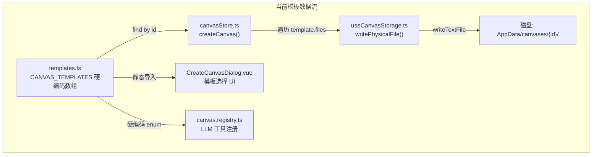
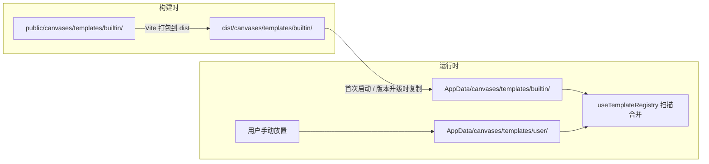
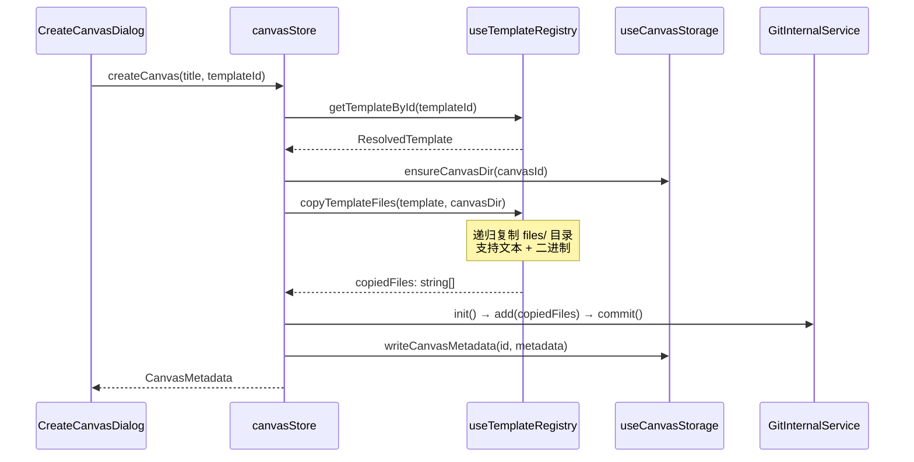

# 画布模板系统重设计方案

> **状态**: RFC (Request for Comments)  
> **日期**: 2025-04-15  
> **影响范围**: `src/tools/canvas/` 模块内部，`src-tauri/tauri.conf.json` 资源配置

---

## 一、现状调查

### 1.1 当前架构总览



### 1.2 关键文件与职责

| 层           | 文件                                                                               | 职责                                                                                                         |
| ------------ | ---------------------------------------------------------------------------------- | ------------------------------------------------------------------------------------------------------------ |
| **类型定义** | [`CanvasTemplate`](../../types/index.ts:36)                                        | `{ id, name, description, files: Record<string, string>, entryFile }`                                        |
| **数据源**   | [`CANVAS_TEMPLATES`](../../templates.ts:6)                                         | 2 个模板，内容为内联 TS 字符串                                                                               |
| **消费层**   | [`canvasStore.createCanvas()`](../../stores/canvasStore.ts:148)                    | 第 153 行 `CANVAS_TEMPLATES.find(t => t.id === templateId)` → 遍历 `template.files` 逐个 `writePhysicalFile` |
| **存储层**   | [`useCanvasStorage.writePhysicalFile()`](../../composables/useCanvasStorage.ts:59) | 调用 Tauri `writeTextFile` — **仅支持文本**                                                                  |
| **UI 层**    | [`CreateCanvasDialog.vue`](../../components/workbench/CreateCanvasDialog.vue:5)    | 静态导入 `CANVAS_TEMPLATES`，无分类、无预览、无外部来源                                                      |
| **LLM 层**   | [`canvas.registry.ts`](../../canvas.registry.ts:23)                                | 硬编码 `enum: ["blank", "blank-html"]`                                                                       |
| **Git 层**   | [`GitInternalService`](../../services/GitInternalService.ts:13)                    | 基于 `isomorphic-git` + Tauri FS 适配器，支持 `Uint8Array` 二进制写入                                        |
| **元数据**   | [`CanvasMetadata`](../../types/canvas-metadata.ts:4)                               | 已有 `template?: string` 字段记录来源模板 ID                                                                 |

### 1.3 核心痛点

1. **不支持二进制资源**：`files: Record<string, string>` 只能存文本内容，无法内嵌图片、字体、音视频等媒体文件。
2. **不支持外部扩展**：模板全部硬编码在 `templates.ts`，无法从磁盘目录动态加载第三方/用户自定义模板。
3. **无丰富元数据**：没有分类 (`category`)、标签 (`tags`)、缩略图 (`preview`)、作者等信息，无法构建丰富的模板市场 UI。
4. **存储层强耦合**：`createCanvas` 直接消费 `CanvasTemplate.files`，扩展类型会牵一发动全身。
5. **LLM Registry 硬编码**：新增/移除模板需要同步手动修改 `canvas.registry.ts` 中的 `enum`。

### 1.4 现有优势（可复用）

- **`GitInternalService`** 的 FS 适配器已经支持 `Uint8Array` 二进制写入（第 43-44 行），Git 层天然支持二进制文件。
- **`CanvasMetadata`** 已有 `template?: string` 字段，无需修改即可关联模板 ID。
- **Tauri `assetProtocol`** 已开启 `$APPDATA/**` 范围（`tauri.conf.json` 第 19 行），可直接通过协议访问 AppData 下的资源。
- 项目中已有 `public/agent-presets/` 的"预设包"模式可参考。

---

## 二、目标设计

### 2.1 核心概念：「模板包」(Template Bundle)

模板不再是"文件名 → 字符串"的简单映射，而是一个完整的**磁盘目录结构**——类似于 VSCode Extension Pack 的思路：

```
canvases/
├── templates/                        ← 统一存放模板
│   ├── builtin/                      ← 内置模板（随应用分发）
│   │   ├── blank/
│   │   ├── template.json             ← 模板清单（必须）
│   │   └── files/                    ← 项目文件（将被完整复制到新画布）
│   │       └── index.html
│   ├── blank-html/
│   │   ├── template.json
│   │   ├── preview.png               ← 缩略图（可选）
│   │   └── files/
│   │       ├── index.html
│   │       ├── style.css
│   │       └── script.js
│   └── three-js-starter/
│       ├── template.json
│       ├── preview.png
│       └── files/
│           ├── index.html
│           ├── style.css
│           └── assets/               ← 二进制资源也在 files/ 内
│               ├── hero.png
│               └── three.min.js
│   └── user/                         ← 用户扩展模板（同样结构）
│       └── my-custom-template/
        ├── template.json
        └── files/
            └── ...
```

**关键设计决策**：

- `files/` 目录的全部内容会被**递归复制**到新画布根目录，保持目录结构不变。
- 不再在 JSON 中列举文件内容，文件就是文件，二进制就是二进制。
- `template.json` 只描述元数据，不包含文件内容。

### 2.2 `template.json` 清单结构

```typescript
// src/tools/canvas/types/template.ts

/** 模板分类 */
export type TemplateCategory =
  | "basic" // 基础
  | "animation" // 动效
  | "data-viz" // 数据可视化
  | "game" // 游戏
  | "portfolio" // 作品集
  | "tool" // 工具
  | "custom"; // 用户自定义

/** 模板来源 */
export type TemplateSource = "builtin" | "user";

/** 模板清单定义（对应 template.json） */
export interface CanvasTemplateDef {
  /** 唯一标识，推荐 kebab-case，必须与目录名一致 */
  id: string;
  /** 显示名称 */
  name: string;
  /** 一句话描述 */
  description: string;
  /** 版本号 (SemVer) */
  version: string;
  /** 分类 */
  category: TemplateCategory;
  /** 标签（用于搜索和筛选） */
  tags?: string[];
  /** 入口文件（相对于 files/ 目录） */
  entryFile: string;
  /** 缩略图文件名（相对于模板包根，如 "preview.png"） */
  preview?: string;
  /** 作者 */
  author?: string;
  /** 图标 Emoji 或 SVG 路径 */
  icon?: string;
}

/** 运行时使用的模板对象（加载后附加来源信息） */
export interface ResolvedTemplate extends CanvasTemplateDef {
  /** 来源：builtin | user */
  source: TemplateSource;
  /** 模板包在磁盘上的绝对路径 */
  bundlePath: string;
  /** files/ 目录的绝对路径 */
  filesPath: string;
  /** 缩略图的绝对路径（如果有） */
  previewPath?: string;
}
```

示例 `template.json`：

```json
{
  "id": "three-js-starter",
  "name": "Three.js 入门",
  "description": "包含 Three.js 基础场景的 3D 项目模板，含旋转立方体示例",
  "version": "1.0.0",
  "category": "animation",
  "tags": ["3D", "WebGL", "Three.js"],
  "entryFile": "index.html",
  "preview": "preview.png",
  "icon": "🎲",
  "author": "AIO Hub"
}
```

### 2.3 存储位置策略



**为什么不用 Tauri `bundle.resources`？**

Tauri v2 的 `bundle.resources` 会将文件放到平台特定的资源目录（Windows 上是安装目录旁），路径获取需要 `resolveResource()`。但考虑到：

1. 内置模板需要在用户 AppData 中有可写副本（用户可能想基于内置模板修改）
2. `public/` 目录的内容会被 Vite 原样复制到 `dist/`，Tauri 的 `frontendDist` 指向 `../dist`
3. 通过 Tauri 的 `convertFileSrc()` + asset protocol 可以直接访问 AppData 下的文件

所以采用 **`public/` → 首次启动复制到 AppData** 的策略，与项目中已有的 `public/agent-presets/` 模式保持一致。

### 2.4 模板注册中心 `useTemplateRegistry`

新增核心 Composable，负责模板的发现、加载和管理：

```typescript
// src/tools/canvas/composables/useTemplateRegistry.ts

export function useTemplateRegistry() {
  /** 获取模板根目录 (AppData/canvases/templates/) */
  async function getTemplatesRootDir(): Promise<string>;

  /**
   * 初始化内置模板
   * 将 public/canvases/templates/builtin/ 同步到 AppData
   * 策略：比较 template.json 中的 version 字段，仅在版本更新时覆盖
   */
  async function initBuiltinTemplates(): Promise<void>;

  /**
   * 扫描并返回所有可用模板
   * 合并 builtin/ 和 user/ 两个来源
   */
  async function getAllTemplates(): Promise<ResolvedTemplate[]>;

  /**
   * 按 ID 获取单个模板
   */
  async function getTemplateById(id: string): Promise<ResolvedTemplate | null>;

  /**
   * 获取所有模板 ID 列表（供 LLM Registry 动态使用）
   */
  async function getTemplateIds(): Promise<string[]>;

  /**
   * 将模板的 files/ 目录递归复制到目标画布目录
   * 核心方法：使用 Tauri FS 的二进制复制 API
   */
  async function copyTemplateFiles(template: ResolvedTemplate, targetDir: string): Promise<string[]>;

  /**
   * 获取模板缩略图的可访问 URL
   * 通过 convertFileSrc() 转换为 asset:// 协议 URL
   */
  async function getPreviewUrl(template: ResolvedTemplate): Promise<string | null>;

  return {
    getTemplatesRootDir,
    initBuiltinTemplates,
    getAllTemplates,
    getTemplateById,
    getTemplateIds,
    copyTemplateFiles,
    getPreviewUrl,
  };
}
```

### 2.5 `canvasStore.createCanvas()` 改造



**关键变更点**（对比现有 [`canvasStore.ts`](../../stores/canvasStore.ts:148) 第 148-196 行）：

```diff
  async function createCanvas(title: string, templateId?: string) {
+   const registry = useTemplateRegistry();
    return await errorHandler.wrapAsync(async () => {
      const id = nanoid();
      const now = Date.now();
-     const template = CANVAS_TEMPLATES.find(t => t.id === templateId) || CANVAS_TEMPLATES[0];
+     const template = await registry.getTemplateById(templateId ?? 'blank-html');
+     if (!template) throw new Error(`模板不存在: ${templateId}`);

      const metadata: CanvasMetadata = {
        id,
        name: title,
        createdAt: now,
        updatedAt: now,
        basePath: id,
        entryFile: template.entryFile,
        template: template.id,
-       fileCount: Object.keys(template.files).length,
+       fileCount: 0, // 将在复制后更新
      };

      await storage.ensureCanvasDir(id);

-     for (const [path, content] of Object.entries(template.files)) {
-       await storage.writePhysicalFile(id, path, content);
-     }
+     const basePath = await storage.getCanvasBasePath(id);
+     const copiedFiles = await registry.copyTemplateFiles(template, basePath);
+     metadata.fileCount = copiedFiles.length;

      const gitService = new GitInternalService(basePath);
      // ... Git 初始化逻辑不变 ...
```

### 2.6 文件复制的关键实现

`copyTemplateFiles` 需要支持二进制文件。现有的 [`useCanvasStorage.writePhysicalFile()`](../../composables/useCanvasStorage.ts:59) 只支持 `writeTextFile`，需要新增二进制复制能力：

```typescript
// 方案：使用 Tauri invoke 调用 Rust 端的文件复制
// Rust 端已有文件操作能力，新增一个 copy_file 命令即可

// 或者使用 Tauri FS 插件的 readFile (返回 Uint8Array) + writeFile (接受 Uint8Array)
import { readFile, writeFile } from "@tauri-apps/plugin-fs";

async function copyFileBinary(src: string, dest: string) {
  const data = await readFile(src); // Uint8Array
  await writeFile(dest, data); // Uint8Array
}
```

**注意**：Tauri FS 插件的 `readFile` 返回 `Uint8Array`，`writeFile` 接受 `Uint8Array`，天然支持二进制。这比调用 Rust 命令更简单。

### 2.7 UI 改造：`CreateCanvasDialog.vue`

对话框需要扩展以适配新的模板结构：

#### 布局升级

```
┌─────────────────────────────────────────────────┐
│  新建画布                                    [×] │
├─────────────────────────────────────────────────┤
│  项目名称: [canvas_20250415_083000          ]   │
│                                                 │
│  选择模板                                       │
│  [全部] [基础] [动效] [数据可视化] [游戏] [用户] │
│                                                 │
│  ┌──────────────┐  ┌──────────────┐            │
│  │  [preview]   │  │  [preview]   │            │
│  │              │  │              │            │
│  │  空白 HTML   │  │  Three.js    │            │
│  │  基础页面... │  │  3D 入门...  │            │
│  │  🏷 内置     │  │  🏷 内置     │            │
│  └──────────────┘  └──────────────┘            │
│  ┌──────────────┐  ┌──────────────┐            │
│  │  📄          │  │  [preview]   │            │
│  │              │  │              │            │
│  │  空白项目    │  │  我的模板    │            │
│  │  最小化...   │  │  自定义...   │            │
│  │  🏷 内置     │  │  🏷 用户     │            │
│  └──────────────┘  └──────────────┘            │
│                                                 │
├─────────────────────────────────────────────────┤
│                        [取消]  [创建]           │
└─────────────────────────────────────────────────┘
```

#### 数据流变更

```diff
- import { CANVAS_TEMPLATES } from "../../templates";
+ import { useTemplateRegistry } from "../../composables/useTemplateRegistry";

+ const registry = useTemplateRegistry();
+ const templates = ref<ResolvedTemplate[]>([]);
+ const activeCategory = ref<TemplateCategory | 'all'>('all');

  const handleOpen = async () => {
    title.value = `canvas_${formatDateTime(new Date(), "yyyyMMdd_HHmmss")}`;
+   templates.value = await registry.getAllTemplates();
+   selectedTemplateId.value = templates.value[0]?.id ?? '';
  };

+ const filteredTemplates = computed(() => {
+   if (activeCategory.value === 'all') return templates.value;
+   return templates.value.filter(t => t.category === activeCategory.value);
+ });
```

### 2.8 `canvas.registry.ts` 动态化

```diff
  async executeTool(name: string, params: Record<string, unknown>) {
    if (name === "create_canvas") {
+     const { useTemplateRegistry } = await import("../composables/useTemplateRegistry");
+     const registry = useTemplateRegistry();
+     const templateIds = await registry.getTemplateIds();
      const { useCanvasStore } = await import("./stores/canvasStore");
      const store = useCanvasStore();
      const title = params.title as string;
-     const templateId = (params.templateId as string) || "blank-html";
+     const templateId = (params.templateId as string) || templateIds[0] || "blank-html";
      const metadata = await store.createCanvas(title, templateId);
      return { success: !!metadata, canvasId: metadata?.id };
    }
  }
```

`getCapabilities()` 中的 `enum` 也改为动态获取（或移除 enum 约束，改为 description 提示）。

---

## 三、内置模板迁移计划

### 3.1 现有模板迁移

将 [`templates.ts`](../../templates.ts) 中的 2 个模板迁移为磁盘目录结构：

#### `blank-html` 模板

```
public/canvases/templates/builtin/blank-html/
├── template.json
├── preview.png          ← 需要制作一张缩略图
└── files/
    ├── index.html       ← 从 templates.ts 第 13-28 行提取
    ├── style.css        ← 从 templates.ts 第 29-53 行提取
    └── script.js        ← 从 templates.ts 第 54-62 行提取
```

#### `blank` 模板

```
public/canvases/templates/builtin/blank/
├── template.json
└── files/
    └── index.html       ← 从 templates.ts 第 71-80 行提取
```

### 3.2 新增示例模板（展示媒体能力）

可以新增一个带图片资源的模板，验证二进制文件支持：

```
public/canvases/templates/builtin/landing-page/
├── template.json
├── preview.png
└── files/
    ├── index.html
    ├── style.css
    └── images/
        ├── hero-bg.jpg
        └── logo.svg
```

---

## 四、影响范围评估

| 文件                                          | 改动类型 | 风险   | 说明                                                         |
| --------------------------------------------- | -------- | ------ | ------------------------------------------------------------ |
| `types/index.ts`                              | 修改     | 低     | `CanvasTemplate` 接口标记废弃，新增 `CanvasTemplateDef` 导出 |
| `types/template.ts`                           | **新增** | 无     | 新类型定义文件                                               |
| `templates.ts`                                | **废弃** | 低     | 内容迁移到 `public/canvas-templates/`，文件删除              |
| `composables/useTemplateRegistry.ts`          | **新增** | 无     | 模板加载核心逻辑                                             |
| `composables/useCanvasStorage.ts`             | 不变     | 无     | 无需修改，复制逻辑在 Registry 中                             |
| `stores/canvasStore.ts`                       | 修改     | **中** | `createCanvas()` 方法重写，移除 `CANVAS_TEMPLATES` 依赖      |
| `components/workbench/CreateCanvasDialog.vue` | 修改     | 低     | 数据源替换 + UI 扩展（分类、缩略图）                         |
| `canvas.registry.ts`                          | 修改     | 低     | `enum` 改为动态查询                                          |
| `src-tauri/tauri.conf.json`                   | 不变     | 无     | `assetProtocol` 已配置 `$APPDATA/**`                         |
| `public/canvases/templates/`                  | **新增** | 无     | 内置模板资源目录                                             |

---

## 五、分阶段实施计划

### Phase 1：基础设施（无破坏性变更）

1. 新增 `src/tools/canvas/types/template.ts` — 定义 `CanvasTemplateDef`、`ResolvedTemplate` 等类型
2. 新增 `src/tools/canvas/composables/useTemplateRegistry.ts` — 实现扫描、加载、复制逻辑
3. 创建 `public/canvases/templates/builtin/blank-html/` 和 `blank/` 目录结构
4. 将 `templates.ts` 中的内联内容提取为独立文件

### Phase 2：核心切换

5. 修改 `canvasStore.ts` 的 `createCanvas()` — 切换到 Registry 数据源
6. 修改 `CreateCanvasDialog.vue` — 使用 Registry 加载模板列表
7. 修改 `canvas.registry.ts` — 动态获取模板 ID
8. 废弃 `templates.ts`

### Phase 3：UI 增强 + 媒体模板

9. `CreateCanvasDialog.vue` 增加分类标签栏、缩略图展示、来源徽章
10. 新增一个带媒体资源的示例模板（如 `landing-page`）
11. 添加"打开模板目录"按钮，方便用户放置自定义模板

### Phase 4：高级特性（可选）

12. 模板导入/导出（`.zip` 格式）
13. 模板在线市场（远程 JSON 索引 + 下载）
14. 模板版本管理和自动更新

---

## 六、用户扩展模板指南（预期）

用户只需在 `AppData/canvas-templates/user/` 下创建目录，放入 `template.json` 和 `files/` 即可：

```
AppData/
└── canvases/
    └── templates/
        └── user/
            └── my-portfolio/
            ├── template.json
            ├── preview.png
            └── files/
                ├── index.html
                ├── style.css
                └── images/
                    └── avatar.jpg
```

`template.json` 最小示例：

```json
{
  "id": "my-portfolio",
  "name": "我的作品集",
  "description": "个人作品展示页面",
  "version": "1.0.0",
  "category": "portfolio",
  "entryFile": "index.html"
}
```

应用会在下次打开"新建画布"对话框时自动发现并展示该模板。

---

## 七、技术细节备注

### 7.1 文件复制策略

- **文本文件**：使用 `readTextFile` + `writeTextFile`（保持现有行为）
- **二进制文件**：使用 `readFile` (返回 `Uint8Array`) + `writeFile` (接受 `Uint8Array`)
- **判断方式**：不做判断，统一使用二进制复制（`readFile` + `writeFile`），最安全

### 7.2 内置模板同步策略

- 应用启动时调用 `initBuiltinTemplates()`
- 对比 `template.json` 中的 `version` 字段
- 仅在版本号更高时覆盖（防止用户修改被覆盖）
- 用户目录的模板永远不会被覆盖

### 7.3 向后兼容

- 已有画布的 `CanvasMetadata.template` 字段存储的是旧模板 ID（`"blank"` 或 `"blank-html"`），新系统保持这些 ID 不变，确保兼容。
- 旧的 `CanvasTemplate` 接口在过渡期保留但标记 `@deprecated`。
