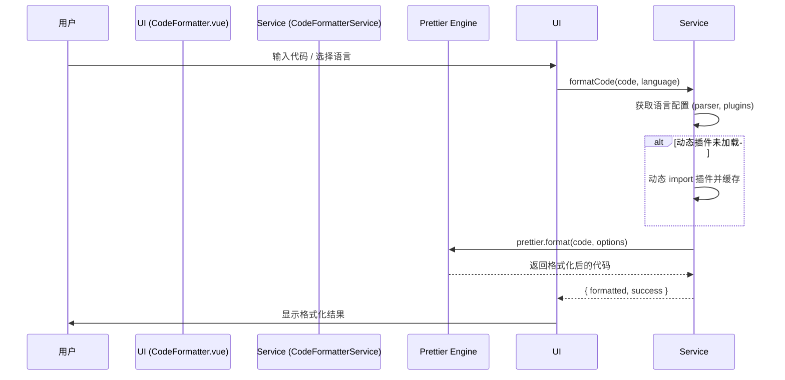

# Code Formatter: 架构与开发者指南

本文档旨在解析 Code Formatter 工具的内部架构、设计理念和数据流，为后续开发提供清晰的指引。

## 1. 核心概念

Code Formatter 是一个基于 Prettier 的多语言代码格式化工具，旨在提供高效、可扩展的格式化服务。

### 1.1. 混合插件加载策略 (Hybrid Plugin Loading)

为了平衡功能完整性与初始加载性能，采用 **静态 + 动态** 混合加载策略。

- **静态导入**: 覆盖前端常用语言（JS/TS/HTML/CSS/Markdown）的插件被内置到应用初始 bundle 中，确保核心功能即开即用。
- **动态导入**: 非常用语言（如 PHP, XML）的插件在首次使用时才被动态加载，并进行缓存。
- **核心优势**:
  - **性能提升**: 显著减少初始 bundle 体积，加快应用启动速度。
  - **按需加载**: 在不影响用户体验的前提下，实现了功能的按需加载。

### 1.2. 启发式语言自动检测 (Heuristic Language Detection)

内置一个基于代码特征的轻量级、启发式语言检测算法，用于在用户未指定语言时提供智能推荐。

- **检测逻辑**:
  - **JSON**: 检查是否以 `{` 或 `[` 开头，并尝试 `JSON.parse`。
  - **HTML/XML**: 检查是否包含 `<!DOCTYPE>` 或 `<?xml>` 等特征标签。
  - **TypeScript**: 检查是否包含 `interface`, `type`, `: string` 等 TS 独有语法。
  - **默认**: 若以上均不匹配，则默认为 `javascript`。
- **局限性**: 准确率有限，主要用于常见场景的快速识别。

## 2. 架构概览

采用经典的 **UI 与服务分离**的设计模式。

- **View (`CodeFormatter.vue`)**: 负责 UI 渲染和用户交互，如代码输入、语言选择等。
- **Service (`CodeFormatterService`)**: 封装了所有与 Prettier 相关的核心逻辑，包括插件管理、语言配置和格式化API。
- **Engine (`prettier/standalone`)**: 底层的代码格式化引擎。

## 3. 数据流：格式化一段代码

## 4. 核心逻辑

- **语言配置系统**: 通过 `getLanguageConfig` 方法集中管理每种语言所需的 Prettier 解析器和插件。
- **错误处理**: 对插件加载失败、代码格式化失败和语言不支持等情况进行捕获，确保工具在任何情况下都不会中断，而是返回原始代码并提供友好提示。
- **服务注册**: 通过 `serviceRegistry` 将 `CodeFormatterService` 注册为全局服务，供其他工具（如 LLM Chat）直接调用。

## 5. 未来展望

- **改进语言检测**: 集成更成熟的第三方语言检测库，提高自动识别的准确率。
- **插件兼容性**: 持续跟进上游插件更新，解决潜在的模块格式兼容性问题。
