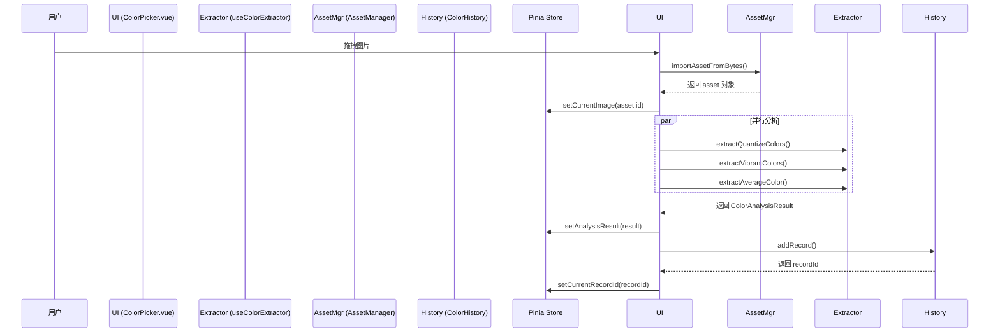

# Color Picker: 架构与开发者指南

本文档旨在解析 Color Picker 工具的内部架构、设计理念和数据流，为后续开发提供清晰的指引。

## 1. 核心概念

Color Picker 是一个智能图片颜色分析工具，旨在为设计师和开发者提供强大、灵活的配色提取方案。

### 1.1. 多算法并行分析 (Multi-algorithm Parallel Analysis)

为了提供多维度的颜色洞察，工具集成了三种业界主流的颜色提取算法，并并行执行以提升性能。

- **Quantize (Color Thief)**: 提取图片中数量最多的主色调和调色板，适合获取最具代表性的颜色。
- **Vibrant (Node Vibrant)**: 提取适合 UI 设计的协调配色方案（如 `Vibrant`, `Muted`, `DarkVibrant` 等），强调颜色的和谐与美感。
- **Average (Fast Average Color)**: 计算整张图片的平均颜色，适合快速获取整体色调或生成背景色。

### 1.2. 资产管理集成 (Asset Management Integration)

所有处理的图片都通过全局 `useAssetManager` 进行管理，而非在工具内部单独存储。

- **核心优势**:
  - **统一存储**: 实现跨工具的资产复用。
  - **自动去重**: 基于文件哈希值，确保相同图片只在系统中存储一次。
  - **持久化**: 资产信息被持久化，便于后续访问。

### 1.3. 持久化历史记录 (Persistent History)

每一次颜色分析的结果都会被自动保存为一条历史记录，与对应的资产ID关联。

- **自动保存**: 当用户通过手动取色等方式修改调色板时，相关历史记录会通过防抖机制自动更新。
- **数据恢复**: 用户下次打开应用或查看历史图片时，可以立刻恢复之前的分析结果和手动调整。

## 2. 架构概览

- **State (Pinia Store)**: 集中管理当前图片、分析结果、手动调色板和用户配置等状态。
- **View (`ColorPicker.vue`)**: 负责 UI 渲染，包括图片展示、历史记录列表、调色板显示和交互。
- **Logic (`useColorExtractor`)**: 一个独立的 Composable，封装了三种颜色提取算法的调用逻辑。
- **Data (`ColorHistory`)**: 封装了与 `Dexie.js` (IndexedDB) 相关的历史记录增删改查操作。

## 3. 数据流：分析一张新图片

## 4. 核心逻辑

- **手动取色**:
  - **EyeDropper API**: 优先使用浏览器原生的 `EyeDropper` API，提供系统级取色体验。
  - **Canvas 回退**: 在不支持 `EyeDropper` 的浏览器中，通过 Canvas 的 `getImageData` 实现点击取色。
- **配置持久化**: 用户的偏好设置（如默认算法、颜色格式）会通过 `useConfigManager` 保存。

## 5. 未来展望

- **新增算法**: 集成更多先进的颜色分析算法，如 K-Means 聚类。
- **调色板工具**: 增加更多调色板管理功能，如锁定颜色、生成邻近色/互补色等。
