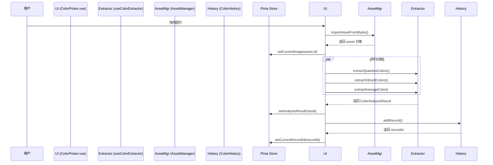

# Color Picker: 架构与开发者指南

本文档旨在解析 Color Picker 工具的内部架构、设计理念和数据流，为后续开发提供清晰的指引。

## 1. 核心概念

Color Picker 是一个智能图片颜色分析工具，旨在为设计师和开发者提供强大、灵活的配色提取方案。

### 1.1. 多算法并行分析 (Multi-algorithm Parallel Analysis)

为了提供多维度的颜色洞察，工具集成了三种业界主流的颜色提取算法，并并行执行以提升性能。

- **Quantize (Color Thief)**: 提取图片中数量最多的主色调和调色板，适合获取最具代表性的颜色。
- **Vibrant (Node Vibrant)**: 提取适合 UI 设计的协调配色方案（如 `Vibrant`, `Muted`, `DarkVibrant` 等），强调颜色的和谐与美感。
- **Average (Fast Average Color)**: 计算整张图片的平均颜色，适合快速获取整体色调或生成背景色。

### 1.2. 资产管理集成 (Asset Management Integration)

所有处理的图片都通过全局 `useAssetManager` 进行管理，而非在工具内部单独存储。

- **核心优势**:
  - **统一存储**: 实现跨工具的资产复用。
  - **自动去重**: 基于文件哈希值，确保相同图片只在系统中存储一次。
  - **持久化**: 资产信息被持久化，便于后续访问。

### 1.3. 持久化历史记录 (Persistent History)

每一次颜色分析的结果都会被自动保存为一条历史记录，与对应的资产ID关联。

- **自动保存**: 当用户通过手动取色等方式修改调色板时，相关历史记录会通过防抖机制自动更新。
- **数据恢复**: 用户下次打开应用或查看历史图片时，可以立刻恢复之前的分析结果和手动调整。

## 2. 架构概览

- **State (Pinia Store)**: 集中管理当前图片、分析结果、手动调色板和用户配置等状态。
- **View (`ColorPicker.vue`)**: 负责 UI 渲染，包括图片展示、历史记录列表、调色板显示和交互。
- **Logic (`useColorExtractor`)**: 一个独立的 Composable，封装了三种颜色提取算法的调用逻辑。
- **Data (`ColorHistory`)**: 封装了与 `Dexie.js` (IndexedDB) 相关的历史记录增删改查操作。

## 3. 数据流：分析一张新图片

```mermaid
sequenceDiagram
    participant User as 用户
    participant UI (ColorPicker.vue)
    participant Extractor (useColorExtractor)
    participant AssetMgr (AssetManager)
    participant History (ColorHistory)
    participant Store as Pinia Store

    User->>UI: 拖拽图片
    UI->>AssetMgr: importAssetFromBytes()
    AssetMgr-->>UI: 返回 asset 对象
    UI->>Store: setCurrentImage(asset.id)

    par 并行分析
        UI->>Extractor: extractQuantizeColors()
        UI->>Extractor: extractVibrantColors()
        UI->>Extractor: extractAverageColor()
    end

    Extractor-->>UI: 返回 ColorAnalysisResult
    UI->>Store: setAnalysisResult(result)
    UI->>History: addRecord()
    History-->>UI: 返回 recordId
    UI->>Store: setCurrentRecordId(recordId)
```

## 4. 核心逻辑

- **手动取色**:
  - **EyeDropper API**: 优先使用浏览器原生的 `EyeDropper` API，提供系统级取色体验。
  - **Canvas 回退**: 在不支持 `EyeDropper` 的浏览器中，通过 Canvas 的 `getImageData` 实现点击取色。
- **配置持久化**: 用户的偏好设置（如默认算法、颜色格式）会通过 `useConfigManager` 保存。

### 批量图片颜色分析

- `BatchColorOrganizer.vue` 调用 `color_picker_analyze_images` 前先等待进度监听注册完成；按任务 ID 隔离事件，按路径索引增量更新结果。离开页面时请求取消任务并释放监听。
- Rust 命令采用 `async` + `tokio::task::spawn_blocking`，避免同步 command 等待 Rayon 计算时阻塞 Tauri 主线程。图像解码、SVG 渲染和颜色采样均在后台执行。
- 所有批量分析任务共享独立 Rayon 线程池：工作线程数以 `analysis_worker_count` 为准（当前为可用逻辑 CPU 数的 3/4，最少 1、最多 16）。为 WebView 和其他工具保留调度余量，并限制同时解码原图的数量；这不是严格的内存用量或解码器内部线程数上限。
- 首张结果立即发出，后续在有结果完成时以 100 ms 间隔合并进度；每个批次包含上次发送以来的全部结果。计数与事件发送在同一锁内串行化，避免并行完成导致进度倒退。任务结束（包括取消）时补发尾批，且只发送一次 `done`。
- 取消为协作式：已开始的单张图片解码会继续完成，尚未开始的图片跳过并在最终响应中标为可重试失败。终态进度只统计实际处理的图片，不把跳过项填充为 100%。

### 批量分类与筛选（前端派生）

- 数据链路为扫描 → 基础分析 → 前端分类 → 筛选/分组 → 归档/报告。`color_picker_analyze_images` 仅接收 `taskId` 和 `paths`，结果与进度返回路径、状态、平均色、亮度和错误；Rust 不接收分类阈值、不返回色系或亮度等级。
- `batchColorOrganizer.ts` 将 `BatchAnalysisItem` 与 `BatchImageItem` 分离。`useBatchClassification` 按平均色缓存 H/S 圆盘二维坐标，由当前色系点位与亮度阈值派生分类。原始列表使用浅响应，每个进度批次结束后统一通知，避免逐字段更新引发全列表重复分类。调整分类配置不触发扫描、解码或分析 IPC；流式、最终和重试结果统一进入基础数据层。
- `colorFamilyPoints.ts` 管理 `ColorFamilyPoint`（稳定 ID、名称、色相和饱和度）。色相 360° 归一化为 0°；映射为 `x = S·cos(H)`、`y = S·sin(H)` 后按欧氏距离最近点分类，等距按稳定 ID 决定。距离小于 `1e-6` 的重合点禁止保存；灰色为普通点，没有优先级或明度特殊规则。非空点集总有归属，空点集归入固定“未分类”。常用九色和基础七色预设的彩色点使用 S=50%，灰色点位于圆心，使灰色分区在各彩色点方向的边界为 S=25%。点位展示色由 H/S 按固定 HSL 明度 50% 派生，亮度阈值独立使用分析返回的相对亮度。
- `ColorFamilyPointsEditor.vue` 在设置栏内展开圆盘与全部点位编辑行，亮度阈值位于色系配置上方；每个点位的色标、名称、H/S 和删除操作紧凑排列为单行。亮度与 H/S 复用 `ScrubNumberInput.vue`，支持横向拖拽、Shift 精细调节、点击/Enter 输入及方向键调节；色系拖拽预览后松手提交，取消恢复原值。预设选择和边界开关使用主题化 Element Plus 组件，支持选中联动、命名、增删及常用九色/基础七色预设。圆盘右侧为 0°，顺时针递增；Canvas 底图以 S² 渲染饱和度，让中心呈低饱和灰色、外缘保持满饱和；该曲线仅影响背景预览，不改变线性的点位坐标、数值、色标和分类。SVG 用半平面裁剪得到的最近点分区并应用圆形裁剪。拖动只改草稿，松手一次提交；越界钳制到圆周，Escape/指针取消恢复。名称/数值 Enter 或失焦验证后生效，非法草稿不写入配置。添加支持圆盘点击或键盘 Enter/空格；切换预设覆盖未保存修改前在选择器旁确认。名称同时用于归档目录，前后端拒绝路径穿越、Windows 非法字符及设备名。
- 筛选和分组按色系 ID，名称只负责显示/归档；色系删除时清理失效筛选 ID。勾选单独以路径 Set 管理，分类投影通过只读 getter 提供选中状态，勾选本身不重建分组。配置或筛选变化后移除不可见勾选，再次可见不恢复。
- 归档提交使用当前分类生成请求快照，预检通过版本号丢弃过期异步响应。执行时禁用归档设置；CSV/JSON 导出全部条目及当前分类，不局限于筛选结果。
- 批量配置 `batch-organizer-config.json` 使用 `3.0.0` 格式的 `colorPoints`，复用 ConfigManager 防抖保存且加载完成前不写回。损坏点集整体回退默认，显式空数组保留。批量页尚未发布，不提供旧配置迁移或预设自动匹配。亮度与色系各自保存自定义预设集合和所选引用，当前编辑值独立保存；调整不隐式覆盖预设。内置只读，可另存；自定义允许原 ID 覆盖或删除，删除保留当前配置并解除绑定。名称去空格后非空且同类不重名，无效预设记录跳过。显式预设写入等待成功后关闭气泡；配置写入串行化，取消较早的待执行防抖保存，防止旧快照覆盖新预设。点位持久化，分析数据和勾选仅在当前会话保留；不影响单图分析。

### 亮度点数与预设管理

- 亮度阈值为 1–4 个分界点，统一排序、限制在 0.01–0.99 且间距至少 0.01。增加时分割最宽区间，等宽优先较暗区间；删除保留其他点。分档边界值归较亮档。
- 内置亮度预设：两档明暗 [0.5]、三档均分 [0.33, 0.67]、四档均分 [0.25, 0.5, 0.75]、五档均分 [0.2, 0.4, 0.6, 0.8]（默认）。2/3/4/5 档分别命名为「偏暗、明亮」「偏暗、中等、明亮」「极暗、偏暗、偏亮、明亮」「极暗、偏暗、中等、偏亮、明亮」。筛选选项随点数更新并清理失效筛选，归档和报告复用当前分类，无需重新分析。
- 两处复用 ClassificationPresetToolbar：分组选择器、紧凑图标操作、下拉框内固定占位的修改图标（悬停及无障碍描述说明未覆盖状态），就近名称输入与覆盖/删除确认气泡。支持名称建议、重复校验、输入法组合保护、Escape 取消和焦点恢复；非法色系草稿不进入预设。加载完成前不写回，未保存到预设的调整重开仍保留。重置按钮恢复当前所选内置或自定义预设的独立快照，确认后丢弃当前调整及非法草稿，不覆盖预设；无预设或未修改时禁用。预设操作区固定四按钮槽位，内置不可用操作不渲染但保留空间；色系添加提示以重叠网格预留两种文案高度，避免状态变化挤动相邻控件。

### 预设与亮度点数验收（2026-09-08）

- 相关 Vitest 验证分档边界、点数限制、独立预设快照、非法草稿、中文输入法回车、取消/删除焦点恢复、配置重载和防抖保存顺序；未添加旧配置兼容测试。
- 使用独立数据目录及独立 WebView2 用户目录启动真实 debug Tauri，通过 CDP 走查 720px 窄窗口、明暗主题、长名称、分组选择、就近气泡和输入焦点；修正圆盘 SVG 样式影响工具栏图标及嵌套 Tooltip 导致气泡锚点失效的问题。
- 真实 IPC 扫描/分析蓝色 SVG 后，将源文件暂移出目录，仍可将亮度由「偏暗」改为「中等」并将色系改为「海蓝」；恢复源文件后通过页面成功归档到「海蓝/中等/blue.svg」。真实指针拖动跨越另一分界点后保持排序并正确重分类。
- 窗口内已验证自定义预设另存、覆盖、删除后保留当前值及焦点恢复，页面重载恢复预设与独立当前阈值。上述为真实 WebView 验收，不记作 WDIO 自动化通过。

### 点位编辑验收（2026-09-07）

- 相关 Vitest 覆盖最近点几何、配置校验、拖动提交/取消、非法草稿、预设与归档快照；前端类型检查和 Vite 生产构建验证导入及样式编译。
- 独立真实 Tauri WebView 已走查明暗主题、720px 窄窗口和鼠标拖动，并通过真实扫描/分析验证：源文件暂不可用时仍可改名和移动点位重新分组，重合点拒绝生效，恢复源文件后按新色系名称成功复制归档。
- 现有 `color-picker-classification.spec.ts` 已迁移为内联编辑，但 WDIO 运行器在当前本机环境报告 `Tauri core.invoke not available after 5s timeout`，最终超时，未计作自动 E2E 通过；上述真实窗口检查通过独立 WebView 调试连接完成，不使用浏览器 mock 替代 IPC。

## 5. 未来展望

- **新增算法**: 集成更多先进的颜色分析算法，如 K-Means 聚类。
- **调色板工具**: 增加更多调色板管理功能，如锁定颜色、生成邻近色/互补色等。
