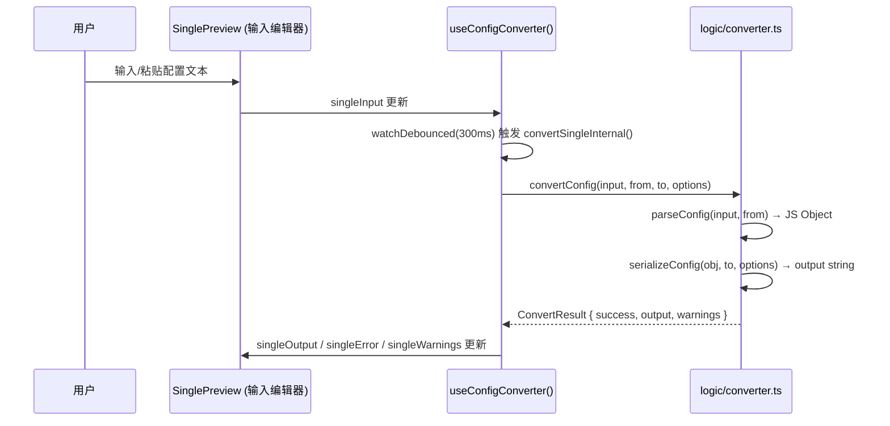
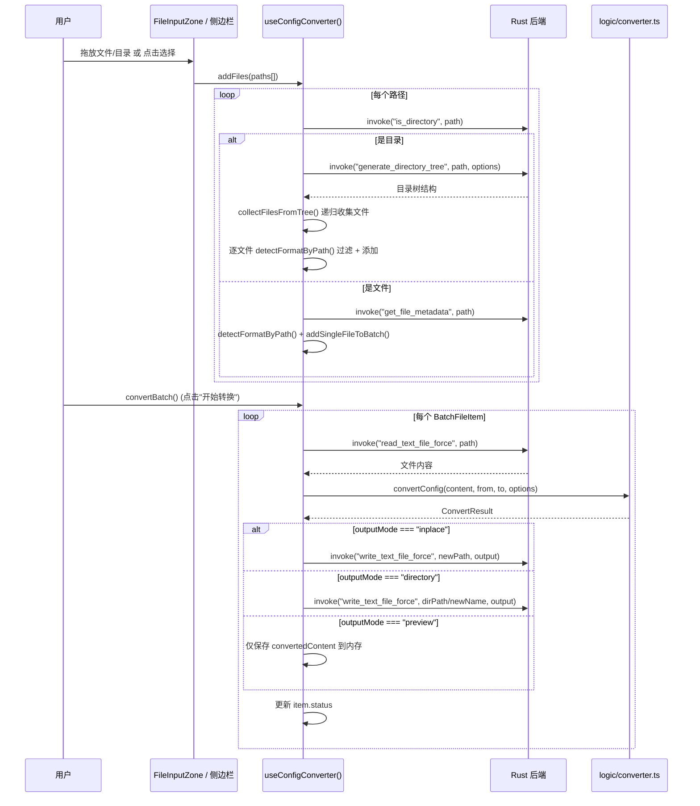

# Config Converter: 架构与开发者指南

> 更新日期：2026.5.24

本文档解析配置转换器工具的内部架构、数据流和关键设计决策，为后续开发提供清晰指引。

## 1. 核心概念

Config Converter 是一个配置文件格式互转工具，支持 JSON、YAML、TOML、INI、XML、.env 六种格式之间的任意双向转换。其核心设计思想是 **"Parse → JS Object → Serialize" 三阶段管道**，通过统一的中间表示（JS 对象）实现 N×N 格式互转，同时提供单文件实时预览和批量文件处理两种工作模式。

### 1.1. 支持的格式

| 格式 | 解析库            | 序列化库              | 特点                                    |
| ---- | ----------------- | --------------------- | --------------------------------------- |
| JSON | 原生 `JSON.parse` | 原生 `JSON.stringify` | 完整支持嵌套结构                        |
| YAML | `js-yaml`         | `js-yaml`             | 支持多文档、锚点引用                    |
| TOML | `smol-toml`       | `smol-toml`           | 轻量级 TOML 解析器                      |
| INI  | `ini`             | `ini`                 | 仅支持两层结构（Section → Key → Value） |
| XML  | `fast-xml-parser` | `fast-xml-parser`     | 支持属性、文本节点                      |
| .env | 自实现            | 自实现                | 扁平键值对，支持引号和注释              |

## 2. 目录结构

```
src/tools/config-converter/
├── ConfigConverter.vue                  # 主布局：工具栏 + 单文件/批量双模式
├── config-converter.registry.ts         # 工具注册（ToolConfig）
├── types.ts                             # 类型定义
├── ARCHITECTURE.md                      # 本文档
├── components/
│   ├── FormatToolbar.vue                # 顶部工具栏（模式切换 + 格式选择 + 高级选项 + 批量配置）
│   ├── SinglePreview.vue                # 单文件双栏编辑器（输入 + 输出 + 错误/警告面板）
│   ├── FileInputZone.vue                # 批量模式空状态拖放区（文件/目录选择）
│   └── BatchFileList.vue                # 批量文件列表（表格 + 状态 + 预览弹窗）
├── composables/
│   └── useConfigConverter.ts            # 核心状态管理与业务逻辑编排
└── logic/
    ├── converter.ts                     # 转换入口（parse → serialize 管道）
    ├── detect.ts                        # 格式自动检测（路径优先 + 内容嗅探）
    ├── parsers.ts                       # 统一解析入口（6 种格式 → JS 对象）
    └── serializers.ts                   # 统一序列化入口（JS 对象 → 6 种格式）
```

## 3. 架构概览

```
┌──────────────────────────────────────────────────────────────────┐
│                          Vue 前端                                │
│                                                                  │
│  ┌──────────────────────────────────────────────────────────┐    │
│  │                    FormatToolbar                         │    │
│  │  模式切换 | 格式选择 | 高级选项 | 批量输出配置           │    │
│  └──────────────────────────┬───────────────────────────────┘    │
│                             │                                    │
│  ┌──────────────────────────┴───────────────────────────────┐    │
│  │               useConfigConverter()                       │    │
│  │  单文件状态 / 批量状态 / 自动转换 / 文件管理             │    │
│  └────────┬─────────────────────────────────┬───────────────┘    │
│           │                                 │                    │
│  ┌────────┴────────┐              ┌─────────┴──────────────┐     │
│  │  SinglePreview  │              │  FileInputZone         │     │
│  │  (双栏编辑器)   │              │  + BatchFileList       │     │
│  │  CodeMirror×2   │              │  (表格 + 预览弹窗)     │     │
│  └─────────────────┘              └────────────┬───────────┘     │
│                                                │                 │
├────────────────────────────────────────────────┼─────────────────┤
│                        Tauri IPC               │                 │
├────────────────────────────────────────────────┼─────────────────┤
│                        Rust 后端               │                 │
│  ┌─────────────────────────────────────────────┴──────────────┐  │
│  │  is_directory / generate_directory_tree / get_file_metadata│  │
│  │  read_text_file_force / write_text_file_force              │  │
│  │  (复用已有通用命令，无专属后端模块)                        │  │
│  └────────────────────────────────────────────────────────────┘  │
└──────────────────────────────────────────────────────────────────┘
```

## 4. 数据流

### 4.1. 单文件实时转换



**关键设计**：

- 使用 `useDebounceFn(300ms)` 防抖，避免每次按键都触发转换
- `watch` 同时监听输入内容、源格式、目标格式和选项变化
- 转换失败时保留原始输入在输出区，并显示错误面板

### 4.2. 批量转换流程



### 4.3. 格式自动检测流程

```mermaid
flowchart TD
    A["输入: filePath + content"] --> B{"路径扩展名匹配?"}
    B -->|是| C["返回对应格式"]
    B -->|否| D{"内容嗅探"}
    D --> E{"以 &lt; 开头?"}
    E -->|是| F["XML"]
    D --> G{"以 &#123; 或 &#91; 开头?"}
    G -->|是| H["尝试 JSON.parse"]
    H -->|成功| I["JSON"]
    D --> J{"包含 TOML 特征?"}
    J -->|是| K["尝试 TOML parse"]
    K -->|成功| L["TOML"]
    D --> M{"包含 INI Section?"}
    M -->|是| N["尝试 INI parse"]
    N -->|成功| O["INI"]
    D --> P{"匹配 ENV 模式?"}
    P -->|是| Q["ENV"]
    D --> R{"包含 YAML 键值对?"}
    R -->|是| S["尝试 YAML parse"]
    S -->|成功| T["YAML"]
    D --> U["回退: JSON"]
```



**检测优先级**：路径扩展名 > XML（`<` 开头）> JSON（`{`/`[` 开头）> TOML > INI > .env > YAML > 默认 JSON

## 5. 逻辑层详解

### 5.1. 转换管道：`converter.ts`

核心函数 `convertConfig()` 实现两步管道：

1. **Parse**：调用 `parseConfig(input, fromFormat)` 将文本解析为 JS 对象
2. **Serialize**：调用 `serializeConfig(obj, toFormat, options, warnings)` 将对象序列化为目标格式

失败时返回 `{ success: false, output: originalInput, error }` 结构，确保 UI 层可以优雅降级。

### 5.2. 解析器：`parsers.ts`

| 格式 | 实现细节                                                                      |
| ---- | ----------------------------------------------------------------------------- |
| JSON | 直接 `JSON.parse`，支持标准 JSON                                              |
| YAML | `js-yaml.load()`，要求结果为对象/数组                                         |
| TOML | `smol-toml.parse()`，轻量高性能                                               |
| INI  | `ini.parse()`，自动处理 Section 层级                                          |
| XML  | `XMLParser` 配置：保留属性（`@_` 前缀）、文本节点（`#text`）、自动类型推断    |
| .env | 自实现：逐行解析，支持 `#` 注释、双引号转义（`\n`）、单引号原样、行尾注释剥离 |

### 5.3. 序列化器：`serializers.ts`

| 格式 | 实现细节                                                        |
| ---- | --------------------------------------------------------------- |
| JSON | `JSON.stringify(obj, null, indent)`，缩进可配置                 |
| YAML | `js-yaml.dump()`，禁用折行和引用锚点                            |
| TOML | `smol-toml.stringify()`，直接输出                               |
| INI  | 自定义预处理 + `ini.stringify()`，深层嵌套自动展平              |
| XML  | `XMLBuilder` 配置：格式化输出、自定义根节点名、`<?xml?>` 声明头 |
| .env | 自实现：展平嵌套对象、键名大写化、特殊字符双引号包裹            |

**有损转换处理**：

INI 和 .env 是扁平格式，无法原生表达嵌套结构。序列化器通过 `flattenObject()` 辅助函数自动展平，并收集警告信息：

- 嵌套对象 → 用分隔符连接键名（如 `database_host`）
- 数组 → 转为逗号分隔字符串

### 5.4. 格式检测：`detect.ts`

提供三个层级的检测函数：

- `detectFormatByPath(filePath)` — 纯路径扩展名匹配，支持 `.json`, `.yaml`, `.yml`, `.toml`, `.ini`, `.cfg`, `.conf`, `.xml`, `.env`, `.properties` 等
- `sniffFormatByContent(content)` — 内容嗅探，按优先级逐一尝试解析
- `detectFormat(filePath, content)` — 综合入口，路径优先，内容兜底

## 6. 前端详解

### 6.1. 核心 Composable：`useConfigConverter()`

职责：双模式状态管理 + 自动转换触发 + 批量文件操作编排。

**关键设计**：

- **双模式隔离**：`single*` 和 `batch*` 状态完全独立，切换模式不丢失数据
- **自动转换**：`watch` + `useDebounceFn(300ms)` 监听所有影响转换的参数
- **批量目标同步**：`watch(batchTo)` 变化时自动更新所有列表项的 `targetFormat` 并重置状态
- **去重添加**：`addSingleFileToBatch()` 通过路径去重，避免重复添加
- **格式过滤**：批量添加目录时，自动过滤掉 `detectFormatByPath` 返回 `unknown` 的文件
- **目录递归**：调用 Rust 的 `generate_directory_tree` 命令获取目录树，前端递归收集文件节点

### 6.2. 工具栏：`FormatToolbar.vue`

功能分区：

- **左侧**：模式切换（单文件/批量）+ 格式选择 + 高级选项 Popover
- **右侧**（仅批量模式）：扫描深度 + 隐藏文件开关 + 输出方式 + 开始转换按钮

高级选项通过 `el-popover` 展示，包含：JSON/YAML 缩进、INI 分隔符、XML 根节点名和格式化开关。

### 6.3. 单文件预览：`SinglePreview.vue`

- **双栏布局**：左栏输入（可编辑 CodeMirror）+ 右栏输出（只读 CodeMirror）
- **语法高亮**：根据当前格式自动切换 CodeMirror 语言模式
- **快捷操作**：粘贴（从剪贴板）、清空、复制输出、发送到聊天
- **错误/警告面板**：绝对定位在输出编辑器底部，不占用编辑空间

### 6.4. 批量文件列表：`BatchFileList.vue`

- **表格展示**：文件名（带图标）、源格式、目标格式、大小、状态、操作
- **状态流转**：`pending` → `converting` → `success` / `error`
- **预览弹窗**：成功转换的文件可点击预览，使用 `BaseDialog` + `RichCodeEditor`
- **文件图标**：复用 `FileIcon` 组件自动匹配

### 6.5. 文件输入区：`FileInputZone.vue`

- **拖放支持**：通过 `useFileDrop` composable 实现，支持文件和目录
- **拖拽状态**：`isDraggingOver` 控制视觉反馈（边框高亮）
- **双入口**：选择文件（带格式过滤器）+ 选择目录

## 7. 依赖关系

### 7.1. 新增依赖

| 包名              | 版本   | 用途                 |
| ----------------- | ------ | -------------------- |
| `fast-xml-parser` | ^5.8.0 | XML 解析与构建       |
| `ini`             | ^7.0.0 | INI 格式解析与序列化 |
| `smol-toml`       | ^1.6.1 | 轻量级 TOML 解析器   |
| `@types/ini`      | ^4.1.1 | INI 库的类型定义     |

### 7.2. 复用的项目依赖

| 包名      | 用途                          |
| --------- | ----------------------------- |
| `js-yaml` | YAML 解析与序列化（项目已有） |

### 7.3. 复用的 Tauri 命令

| 命令                      | 用途                     |
| ------------------------- | ------------------------ |
| `is_directory`            | 判断路径是否为目录       |
| `generate_directory_tree` | 高性能并行目录树生成     |
| `get_file_metadata`       | 获取文件元数据（大小等） |
| `read_text_file_force`    | 读取文本文件内容         |
| `write_text_file_force`   | 写入文本文件内容         |

## 8. 类型系统

| 类型             | 用途                                                                        |
| ---------------- | --------------------------------------------------------------------------- |
| `ConfigFormat`   | 支持的格式联合类型：`"json" \| "yaml" \| "toml" \| "ini" \| "xml" \| "env"` |
| `ConvertOptions` | 转换选项（缩进、分隔符、XML 根节点名等）                                    |
| `ConvertResult`  | 转换结果（成功/失败 + 输出 + 错误 + 警告）                                  |
| `BatchFileItem`  | 批量文件条目（路径、格式、状态、转换内容）                                  |
| `ScanOptions`    | 目录扫描选项（深度、隐藏文件）                                              |

## 9. 设计决策

### 9.1. 为什么是纯前端转换？

配置文件通常体积小（< 1MB），解析和序列化的计算量不大。纯前端实现的优势：

- 单文件模式可实现 **实时预览**（300ms 防抖即可）
- 无需 IPC 往返，响应更快
- 逻辑层（`logic/`）可独立测试，不依赖 Tauri 环境

### 9.2. 为什么批量模式需要 Rust？

批量模式涉及文件系统操作（目录遍历、文件读写），这些必须通过 Tauri IPC 调用 Rust 后端。但转换逻辑本身仍在前端执行，Rust 仅负责 I/O。

### 9.3. 有损转换的处理策略

INI 和 .env 是扁平格式，无法无损表达嵌套结构。设计选择：

- **不阻断转换**：自动展平并生成警告，而非直接报错
- **警告可见**：通过 `warnings[]` 数组收集所有有损操作，UI 层展示给用户
- **可逆性**：展平后的键名保留了层级信息（如 `database_host`），用户可手动调整

### 9.4. 格式检测的保守策略

内容嗅探采用"尝试解析"策略而非纯正则匹配，确保检测结果的准确性。每种格式的嗅探都包裹在 `try...catch` 中，失败则继续尝试下一种格式。

## 10. 与其他工具的关系

| 工具             | 关系                                                                                   |
| ---------------- | -------------------------------------------------------------------------------------- |
| `json-formatter` | 定位不同：json-formatter 专注 JSON 的格式化/压缩/校验；config-converter 专注跨格式转换 |
| `code-formatter` | 互补：code-formatter 处理代码格式化；config-converter 处理配置格式互转                 |
| `text-diff`      | 可配合使用：转换前后的内容可通过 text-diff 对比差异                                    |

## 11. 未来展望

- **格式扩展**：支持 HCL (Terraform)、Properties (Java)、HOCON 等格式
- **转换预设**：保存常用的格式+选项组合为预设
- **批量重命名规则**：支持自定义输出文件名模板
- **Agent 服务注册**：暴露 `convertConfig` 能力给 LLM 工具调用
- **Schema 验证**：转换后可选验证目标格式的 Schema 合规性
