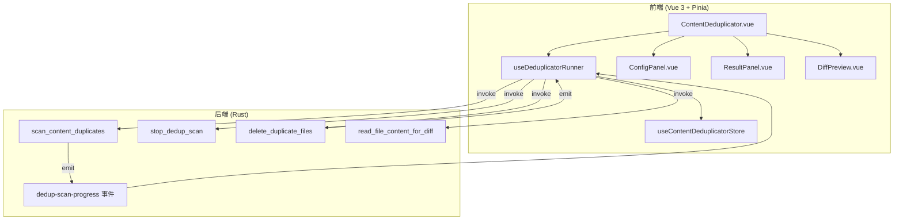
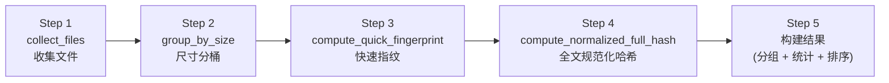

# 内容查重工具 (Content Deduplicator) 架构文档

## 1. 概述

内容查重工具用于扫描指定目录中的重复/高度相似文本文件，识别精确副本和仅存在格式化差异（空白、标点、大小写）的规范化副本。内核完全由 Rust 实现，前端通过 Tauri `invoke` 调用并接收进度事件。

## 2. 系统架构



### 2.1 层级职责

| 层级       | 文件                                             | 职责                                         |
| ---------- | ------------------------------------------------ | -------------------------------------------- |
| **UI 层**  | `ContentDeduplicator.vue`、`components/`         | 用户交互、布局编排                           |
| **状态层** | `stores/store.ts` (Pinia)                        | 配置、结果、选中状态、筛选排序               |
| **逻辑层** | `composables/useDeduplicatorRunner.ts`           | 封装 Tauri 命令调用与事件监听                |
| **引擎层** | `src-tauri/src/commands/content_deduplicator.rs` | 文件扫描、规范化、哈希、相似度判断、安全删除 |

## 3. 核心算法：五阶段扫描漏斗

后端 [`scan_content_duplicates`](src-tauri/src/commands/content_deduplicator.rs:553) 使用**漏斗式逐级过滤**策略，每层减少候选文件数量以降低计算开销：



### 3.1 Step 1：收集文件 (`collect_files`)

- **遍历引擎**：使用 [`ignore::WalkBuilder`](https://docs.rs/ignore) 递归遍历目录，默认不跟随符号链接。
- **文本检测**：读取每个文件的前 512 字节，通过 [`content_inspector::inspect()`](https://docs.rs/content_inspector) 判断是否为文本文件。二进制文件直接跳过。
- **过滤器**：
  - 空文件（0 字节）跳过
  - 超过 `maxFileSizeMb`（默认 50MB）的文件跳过
  - 若配置了扩展名白名单，仅收集匹配扩展名的文件
- **进度上报**：每收集 50 个文件，emit `dedup-scan-progress { stage: "collecting" }` 事件。
- **输出**：`Vec<CollectedFile>`（路径、名称、大小、修改时间、扩展名）。

> **注意**：`SimilarityConfig.ignorePatterns`（如 `["node_modules", ".git", ...]`）在代码中虽然创建了 `OverrideBuilder`，但**未实际应用到 WalkBuilder**——当前自定义忽略模式不生效，仅依赖目录中已有的 `.gitignore` 文件。

### 3.2 Step 2：尺寸分桶 (`group_by_size`)

- **目的**：智能跳过孤立文件——如果某个文件的大小无法与目录中任何其他文件匹配，直接排除，避免无效计算。
- **小文件分离**：大小 < `suspiciousSizeLimit`（默认 3KB）的文件被归入 `small_files` 集合并走单独通道（跳过 Step 3，直接 Step 4）。
- **普通文件分桶**：
  1. 按文件大小升序排列。
  2. 贪心分桶：遍历排序后的文件，若当前文件与桶内第一个文件的大小差异 ≤ `sizeDiffThreshold`（默认 5%），则加入该桶；否则创建新桶。
  3. 仅保留包含 **≥2 个文件** 的桶（孤立文件被丢弃）。

**示例**：若阈值设为 5%，文件大小分别为 1000、1020、1040、2000 字节，则前三者归为一桶，2000 字节的文件作为孤立文件被丢弃。

### 3.3 Step 3：快速指纹 (`compute_quick_fingerprint`)

- **仅适用于普通文件桶**（小文件跳过此步骤）。
- 对每个桶内的文件，提取**前 4KB + 后 4KB**（若文件 ≤ 4KB 则只取全文）。
- 跳过 UTF-8 BOM (`EF BB BF`) 后，应用规范化选项，计算 **BLAKE3 哈希**作为快速指纹。
- 按指纹分组，仅保留包含 ≥2 个文件的组——具备相同指纹的文件才有必要进入全文比对。

### 3.4 Step 4：全文规范化哈希 (`compute_normalized_full_hash`)

- 对通过快速指纹过滤的文件，进行**流式全文读取**（64KB 缓冲区，不会将整个文件加载到内存）。
- 同时计算两个哈希：
  - **`raw_hash`**：原始文件内容的 BLAKE3 哈希（用于判断是否为精确副本）
  - **`norm_hash`**：规范化后内容的 BLAKE3 哈希（用于判断是否为规范化副本）
- 第一块数据会跳过 BOM，后续数据直接处理。
- 按 `norm_hash` 分组，≥2 个文件的组即为一个重复组。

### 3.5 Step 5：构建结果

1. 生成 `DuplicateGroup`，确定每个组的 `representativeFile`（修改时间最新的文件）。
2. 判断 `matchType`：
   - 所有成员的 `raw_hash` 一致 → `"exact"`（精确匹配，二进制相同）
   - `raw_hash` 不同但 `norm_hash` 一致 → `"normalized"`（规范化匹配，内容相同但格式不同）
3. 按 `totalWastedBytes` 降序排列结果。
4. 计算 `DedupStatistics` 并返回。

## 4. 规范化算法详解

核心函数 [`normalize_bytes`](src-tauri/src/commands/content_deduplicator.rs:201) 按以下优先级逐字节处理：

| 步骤        | 条件                       | 操作                                                                                                                  |
| ----------- | -------------------------- | --------------------------------------------------------------------------------------------------------------------- |
| 1. 跳过空白 | `ignoreWhitespace = true`  | 移除 `空格`、`\t`、`\r`；若 `preserveLineBreaks = false`，一并移除 `\n`                                               |
| 2. 统一换行 | `ignoreWhitespace = false` | 仍会移除 `\r`（统一 `\r\n` → `\n`）                                                                                   |
| 3. 跳过标点 | `ignorePunctuation = true` | 使用 [`u8::is_ascii_punctuation()`](https://doc.rust-lang.org/std/primitive.u8.html#method.is_ascii_punctuation) 过滤 |
| 4. 大小写   | `caseSensitive = false`    | ASCII 字母转为小写                                                                                                    |

**BOM 处理**：[`skip_bom`](src-tauri/src/commands/content_deduplicator.rs:241) 仅在每个文件的第一块数据（`is_first_chunk`）中执行，跳过 UTF-8 BOM (`0xEF 0xBB 0xBF`)。

**与前端预设的映射**：

| 预设       | ignoreWhitespace | ignorePunctuation | caseSensitive | preserveLineBreaks |
| ---------- | :--------------: | :---------------: | :-----------: | :----------------: |
| `relaxed`  |        ✅        |        ✅         |     false     |       false        |
| `strict`   |        ✅        |        ❌         |     true      |       false        |
| `code`     |        ❌        |        ❌         |     true      |      **true**      |
| `document` |        ✅        |        ❌         |     false     |       false        |

## 5. 小文件优化

大小 < `suspiciousSizeLimit`（默认 3072 字节 = 3KB）的文件享受快速通道：

- **跳过尺寸分桶**（Step 2）：不再需要尺寸匹配。
- **跳过快速指纹**（Step 3）：小文件哈希计算成本低，直接全文处理。
- 生成的重复组标记 `metadata.isSuspicious = true`，帮助前端区分标识。

## 6. 匹配类型说明

| matchType      | 判定条件                           | 含义                                |
| -------------- | ---------------------------------- | ----------------------------------- |
| `"exact"`      | 所有成员 `raw_hash` 完全一致       | 二进制完全相同的文件（拷贝/硬链接） |
| `"normalized"` | `raw_hash` 不同但 `norm_hash` 一致 | 仅存在空白/标点/大小写差异的文件    |
| `"fuzzy"`      | **（尚未实现）**                   | 相似度低于 100% 的文件匹配          |

> **实现状态**：当前版本 `matchType` 仅返回 `"exact"` 和 `"normalized"`。`SimilarityConfig.minSimilarity` 字段标记为 `#[allow(dead_code)]`，`SimilarFile.similarity` 固定为 `1.0`，`diffSummary` 固定为 `None`。模糊匹配功能留待后续版本实现。

## 7. 取消机制

[`DedupScanCancellation`](src-tauri/src/commands/content_deduplicator.rs:17) 基于 `Arc<AtomicBool>` 实现线程安全的取消信号：

- **检查点**：在每一层漏斗的关键循环入口处均检查 `cancellation.is_cancelled()`，检查间隔最密为**每 20 个文件**（小文件处理）、每 50 个文件（收集阶段）。
- **复位**：每次调用 `scan_content_duplicates` 时自动调用 `cancellation.reset()`。
- **Tauri 管理**：作为 `State<'_, DedupScanCancellation>` 注入，由 Tauri 框架管理生命周期。

## 8. 删除安全机制

[`delete_duplicate_files`](src-tauri/src/commands/content_deduplicator.rs:919) 采用保守策略：

1. **回收站删除**：通过 [`trash::delete()`](https://crates.io/crates/trash) 将文件移入系统回收站，而非物理删除。
2. **逐个处理**：每个文件独立删除，单个失败不影响其余——通过 `errors` 数组报告失败详情（路径 + 原因）。
3. **进度反馈**：每删除 5 个文件 emit 一次 `dedup-delete-progress` 事件。
4. **前端同步**：删除成功后，前端 `useDeduplicatorRunner.deleteSelected()` 会从 `result.groups` 中移除成功删除的文件路径（解析错误消息中的路径前缀），并重新计算统计信息。

## 9. Tauri 命令参考

| 命令                         | 参数                                       | 返回值                | 说明                           |
| ---------------------------- | ------------------------------------------ | --------------------- | ------------------------------ |
| `scan_content_duplicates`    | `path: String`, `config: SimilarityConfig` | `DedupAnalysisResult` | 启动五阶段扫描漏斗             |
| `stop_dedup_scan`            | 无                                         | `()`                  | 设置取消标志位                 |
| `delete_duplicate_files`     | `paths: Vec<String>`                       | `DedupDeleteResult`   | 逐文件移入回收站               |
| `read_file_content_for_diff` | `path: String`, `maxSizeKb?: u64`          | `String`              | 读取文本内容（默认限制 512KB） |

### 事件

| 事件名                  | 载荷类型                                                               | 触发频率                                                         |
| ----------------------- | ---------------------------------------------------------------------- | ---------------------------------------------------------------- |
| `dedup-scan-progress`   | `DedupScanProgress { stage, stageProgress, foundGroups, currentFile }` | 阶段切换时 + 每 50 个文件（collecting）/ 每 20 个文件（hashing） |
| `dedup-delete-progress` | `DedupDeleteProgress { current, total, currentFile }`                  | 每 5 个文件                                                      |

## 10. 技术栈与依赖 (Rust)

| Crate                                                             | 用途                                   |
| ----------------------------------------------------------------- | -------------------------------------- |
| [`blake3`](https://crates.io/crates/blake3)                       | 高速加密哈希（用于文件指纹和全文哈希） |
| [`content_inspector`](https://crates.io/crates/content_inspector) | 检测文件是否为二进制                   |
| [`ignore`](https://crates.io/crates/ignore)                       | 目录遍历（支持 `.gitignore` 规则）     |
| [`trash`](https://crates.io/crates/trash)                         | 跨平台回收站操作                       |

## 11. 已知局限与待办

| 项目               | 状态      | 说明                                                                                        |
| ------------------ | --------- | ------------------------------------------------------------------------------------------- |
| 模糊匹配 (`fuzzy`) | ❌ 未实现 | `minSimilarity` / `preset` 字段为 dead_code，`similarity` 固定 1.0，`diffSummary` 固定 None |
| 自定义忽略模式     | ⚠️ 未生效 | `OverrideBuilder` 创建但未绑定到 `WalkBuilder`，`ignorePatterns` 配置被忽略                 |
| 大文件内存         | ⚠️ 风险   | 全文哈希使用 64KB 缓冲区流式读取，但 `read_file_content_for_diff` 会将整个文件加载到内存    |

## 12. 目录结构

```text
src/tools/content-deduplicator/
├── components/
│   ├── ConfigPanel.vue              # 扫描路径选择、预设切换、自定义参数
│   ├── ResultPanel.vue              # 结果列表、筛选排序、批量选择、删除操作
│   └── DiffPreview.vue              # 双窗格文件差异对比弹窗
├── composables/
│   └── useDeduplicatorRunner.ts     # Tauri invoke 封装 + 事件监听
├── config/
│   └── presets.ts                   # 四个预设定义 (relaxed/strict/code/document)
├── stores/
│   └── store.ts                     # Pinia Store — 配置、结果、选中状态、筛选排序逻辑
├── types.ts                         # 与 Rust 结构一一对应的 TS 类型
├── contentDeduplicator.registry.ts  # 工具注册 + Agent 可调用接口
├── ContentDeduplicator.vue          # 工具主入口组件
└── ARCHITECTURE.md                  # 本文件

src-tauri/src/commands/
└── content_deduplicator.rs          # Rust 后端：扫描漏斗、规范化、哈希、删除
```
