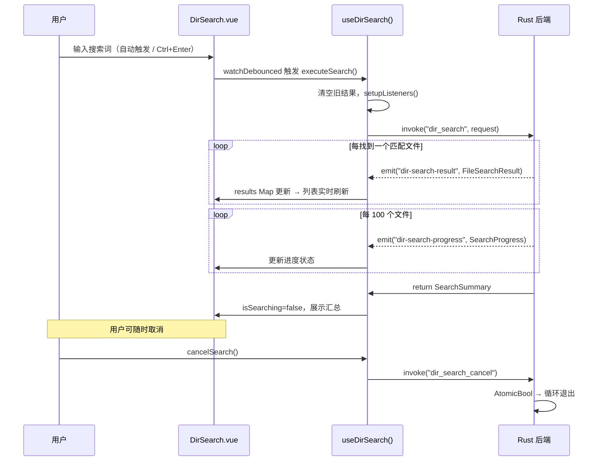
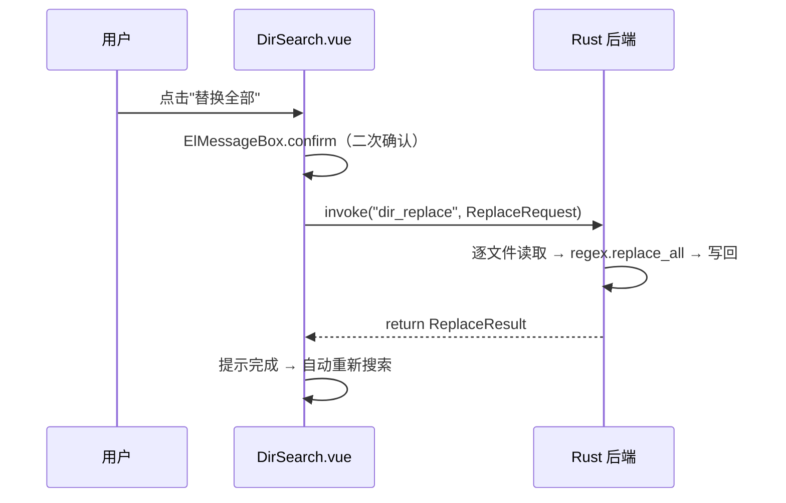
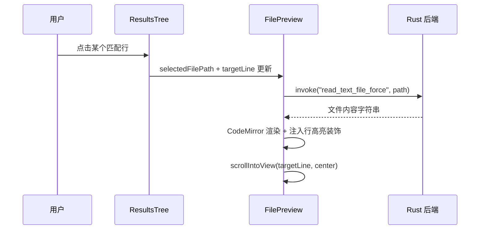

# Dir Search: 架构与开发者指南

本文档解析目录搜索工具的内部架构、数据流和关键设计决策，为后续开发提供清晰指引。

## 1. 核心概念

Dir Search 是一个轻量级的目录内容搜索与替换工具，定位为"给定目录范围内的文件内容搜索"。其核心设计思想是 **Rust 后端负责高性能流式搜索，前端负责实时渲染与交互式浏览**。

## 2. 目录结构

```
src/tools/dir-search/
├── DirSearch.vue                        # 主布局：顶部目录栏 + 左右分栏
├── dir-search.registry.ts               # 工具注册（ToolConfig）
├── types.ts                             # 前端类型定义
├── components/
│   ├── DirectoryBar.vue                 # 顶部目录输入栏（拖放 + 对话框选择）
│   ├── SearchPanel.vue                  # 左栏容器（标题栏按钮组 + SearchInput + ResultsTree）
│   ├── SearchInput.vue                  # 搜索/替换输入区 + 模式切换 + 过滤器 + 折叠设置
│   ├── ResultsTree.vue                  # 搜索结果（列表/树形双视图 + 上下文块渲染）
│   ├── ResultItem.vue                   # 单条匹配结果行（高亮 + 悬停操作 + Tooltip）
│   ├── FilePreview.vue                  # 右栏文件预览（CodeMirror + 行高亮）
│   ├── ContextMenu.vue                  # 通用右键菜单组件
│   ├── ContextBlockView.vue             # 上下文块渲染组件
│   ├── DirectoryTreeView.vue            # 树形目录视图组件
│   └── DirectoryTreeNode.vue            # 树形目录递归节点组件
└── composables/
    ├── useDirSearch.ts                  # 核心搜索逻辑编排（批量事件 + 消除 + 历史）
    ├── useDirSearchUiState.ts           # UI 状态持久化（面板、视图、历史、设置）
    ├── useInputHistory.ts               # 键盘历史回溯逻辑（可复用）
    ├── useContextMenu.ts                # 右键菜单状态管理
    └── useContextBlocks.ts              # 上下文行合并去重算法
```

**Rust 后端**：`src-tauri/src/commands/dir_search.rs`

## 3. 架构概览

```
┌────────────────────────────────────────────────────────────┐
│                       Vue 前端                             │
│                                                            │
│  ┌─────────────┐  ┌──────────────┐  ┌───────────────────┐  │
│  │DirectoryBar │  │ SearchPanel  │  │   FilePreview     │  │
│  │(目录选择)   │  │ ┌SearchInput │  │ (RichCodeEditor)  │  │
│  │             │  │ └ResultsTree │  │ + 行高亮 + 编辑   │  │
│  └──────┬──────┘  └──────┬───────┘  └────────┬──────────┘  │
│         │                │                   │             │
│  ┌──────┴────────────────┴───────────────────┴──────────┐  │
│  │                  useDirSearch()                      │  │
│  │  搜索参数 / 结果状态 / 事件监听 / 自动搜索节流       │  │
│  └────────────────────────┬─────────────────────────────┘  │
│                           │ invoke() + listen()            │
├───────────────────────────┼────────────────────────────────┤
│                      Tauri IPC                             │
├───────────────────────────┼────────────────────────────────┤
│                       Rust 后端                            │
│  ┌────────────────────────┴─────────────────────────────┐  │
│  │              dir_search.rs                           │  │
│  │  ┌───────────┐  ┌────────┐  ┌────────────┐           │  │
│  │  │ ignore    │  │ regex  │  │encoding_rs │           │  │
│  │  │(遍历+glob │  │(匹配)  │  │(GBK解码)   │           │  │
│  │  │+gitignore)│  │        │  │            │           │  │
│  │  └───────────┘  └────────┘  └────────────┘           │  │
│  └──────────────────────────────────────────────────────┘  │
└────────────────────────────────────────────────────────────┘
```

## 4. 数据流

### 4.1. 搜索流程（流式事件架构）



### 4.2. 替换流程



### 4.3. 文件预览流程



## 5. Rust 后端详解

### 5.1. Tauri 命令清单

| 命令                  | 功能                   | 返回/事件                                                                      |
| --------------------- | ---------------------- | ------------------------------------------------------------------------------ |
| `dir_search`          | 流式搜索目录内容       | 返回 `SearchSummary`；过程中 emit `dir-search-result` 和 `dir-search-progress` |
| `dir_search_cancel`   | 取消正在进行的搜索     | `Ok(())`                                                                       |
| `dir_replace`         | 批量替换文件内容       | 返回 `ReplaceResult`                                                           |
| `dir_replace_preview` | 替换预览（不修改文件） | 返回 `Vec<FileSearchResult>`                                                   |

### 5.2. 核心机制

**取消机制**：使用 `AtomicBool` + Tauri `State` 管理。搜索循环每处理一个文件前检查标志位，确保毫秒级响应取消请求。

**文件遍历**：`ignore::WalkBuilder` 提供：

- 自动尊重 `.gitignore` 规则（可配置关闭）
- Glob 过滤（include/exclude 通过 `OverrideBuilder` 实现）
- 隐藏文件搜索支持

**二进制检测**：读取文件前 8KB，检查是否包含 NULL 字节。包含则跳过。

**编码处理**：`decode_to_string()` 函数实现 UTF-8 → GBK 的 fallback 链，处理 BOM 头。

**偏移量转换**：Rust regex 返回字节偏移，通过 `line[..mat.start()].chars().count()` 转换为 char 索引，适配前端 JS 字符串操作。

**重叠合并**：同一行多个匹配项可能重叠，使用排序 + 区间合并算法处理。

### 5.3. 性能策略

| 关注点     | 策略                                                                 |
| ---------- | -------------------------------------------------------------------- |
| 大目录遍历 | `WalkBuilder.build_parallel()` 多线程并行遍历，充分利用多核          |
| IPC 批处理 | 每 20ms 或每 50 个结果批量 emit，避免高频单条事件导致前端重渲染      |
| 海量结果   | `max_results` 上限（默认 10,000，可配置为 0 表示无限制），达到后停止 |
| 大文件     | 单文件 5MB 上限，超过跳过                                            |
| 内存       | 流式处理，逐文件读取，不同时加载所有文件                             |
| 取消响应   | `AtomicBool` 每文件检查，传入并行闭包确保毫秒级响应                  |
| 进度上报   | 每 200ms 汇报一次进度，避免事件风暴                                  |
| 前端渲染   | 2 万条结果无需虚拟滚动，Vue 处理简单 DOM 元素性能充足                |

## 6. 前端详解

### 6.1. 核心 Composable：`useDirSearch()`

职责：搜索状态管理 + Tauri IPC 编排 + 自动搜索触发。

**关键设计**：

- **自动搜索**：使用 `watchDebounced`（300ms）监听所有搜索参数变化，输入即搜索
- **批量事件处理**：监听 `dir-search-result-batch` 事件，一次性将批次中所有结果写入 Map
- **事件生命周期**：每次搜索前 `setupListeners()`，搜索结束后 `cleanupListeners()`
- **结果存储**：`Map<filePath, FileSearchResult>`，支持按文件路径快速查找
- **自动展开**：前 20 个匹配文件自动展开，后续折叠
- **消除操作**：支持 `dismissFile` / `dismissMatch` 从结果中移除条目

### 6.2. UI 状态持久化：`useDirSearchUiState()`

通过 `createConfigManager` 将以下状态保存到 AppData：

- 面板宽度（`panelWidth`，默认 360px）
- 面板折叠状态（`isPanelCollapsed`）
- 上次搜索目录（`lastRootPath`，下次打开自动恢复）
- 视图模式（`viewMode`，列表/树形）
- 搜索上限（`maxResults`，默认 10000，0 = 无限制）
- 上下文行设置（`contextLinesEnabled` + `contextLinesCount`）
- 高级设置折叠状态（`showAdvancedSettings`）
- 历史记录（搜索词 / 替换词 / 目录 / 包含 glob / 排除 glob）

### 6.3. 文件预览：`FilePreview.vue`

核心特性：

- **可编辑**：使用 `RichCodeEditor`（CodeMirror 引擎），支持直接编辑文件内容
- **保存**：Ctrl+S 保存修改，通过 `write_text_file_force` 写回磁盘
- **脏状态检测**：对比编辑内容与原始内容，显示修改指示器
- **匹配行高亮**：通过 CodeMirror `StateField` + `Decoration` 实现两层高亮：
  - 浅色背景：所有匹配行（`cm-highlight-match-line`）
  - 深色背景：当前聚焦行（`cm-highlight-target-line`）
- **自动滚动**：点击匹配项时 `scrollIntoView` 到目标行居中显示
- **语言推断**：根据文件扩展名自动设置语法高亮语言

### 6.4. 结果交互

- **悬停操作**：文件节点和匹配项悬停时显示操作按钮（消除、单项替换）
- **右键菜单**：文件级（全部替换 / 消除 / 排除类型 / 复制路径 / 资源管理器显示）和匹配项级（替换 / 消除 / 复制）
- **视图切换**：列表模式（按文件平铺分组）和树形模式（按目录层级展开）
- **上下文行**：可选内联展示匹配行上下文，相邻匹配自动合并去重
- **Tooltip 预览**：悬停 500ms 显示匹配行完整内容（仅在行被截断时）
- **键盘历史**：所有输入框支持 ArrowUp/Down 回溯历史记录

### 6.5. 布局交互

- **可拖拽分栏**：左栏宽度 280~600px 可拖拽调整
- **可折叠面板**：左栏可完全折叠，右栏占满
- **目录拖放**：`DirectoryBar` 支持拖放目录路径（通过 `useFileDrop`）
- **快捷键**：Ctrl+Enter 执行搜索/替换
- **折叠设置区域**：高级搜索选项（自动展开、搜索上限、上下文行）收纳在可折叠面板中

## 7. 类型系统

前后端类型完全对齐（Rust 使用 `#[serde(rename_all = "camelCase")]`）：

| 类型                | 用途                                                   |
| ------------------- | ------------------------------------------------------ |
| `SearchRequest`     | 搜索请求参数（含 `contextLines`、`maxResults`）        |
| `SearchMatch`       | 单个匹配项（行号 + 行内容 + char 偏移 + 可选上下文行） |
| `FileSearchResult`  | 单文件搜索结果（绝对路径 + 相对路径 + 匹配列表）       |
| `SearchResultBatch` | IPC 批量事件载荷（`results: FileSearchResult[]`）      |
| `SearchProgress`    | 搜索进度事件                                           |
| `SearchSummary`     | 搜索完成汇总（文件数 + 匹配数 + 耗时 + 是否取消）      |
| `ReplaceRequest`    | 替换请求                                               |
| `ReplaceResult`     | 替换结果（成功/失败文件数 + 错误详情）                 |
| `HighlightPart`     | 前端高亮渲染用的文本片段                               |
| `ContextBlock`      | 上下文块（合并后的连续行区域）                         |
| `ContextLine`       | 上下文块内的单行（含匹配信息或纯上下文标记）           |
| `DirectoryNode`     | 树形视图的目录节点                                     |
| `ViewMode`          | 视图模式（`'list' \| 'tree'`）                         |

## 8. 与其他工具的关系

| 工具                | 关系                                                                                    |
| ------------------- | --------------------------------------------------------------------------------------- |
| `regex-applier`     | 定位不同：regex-applier 专注规则预设 + 单文本替换；dir-search 专注跨目录搜索 + 交互浏览 |
| `directory-janitor` | 共享"目录扫描 + 事件流 + 取消"的架构模式，但不共享代码                                  |
| `directory-tree`    | 同为目录级工具，但 tree 关注结构可视化，search 关注内容搜索                             |

## 9. 未来展望

- **预设保存**：保存常用搜索配置
- **Agent 服务注册**：暴露搜索能力给 LLM（`ToolRegistry` 接口）

### 已评估并放弃的方案

- **虚拟滚动**：经实测，2 万条结果在 Vue 中渲染简单 DOM 元素不会出现滚动卡顿，虚拟滚动的复杂度收益比不划算，不予引入。
