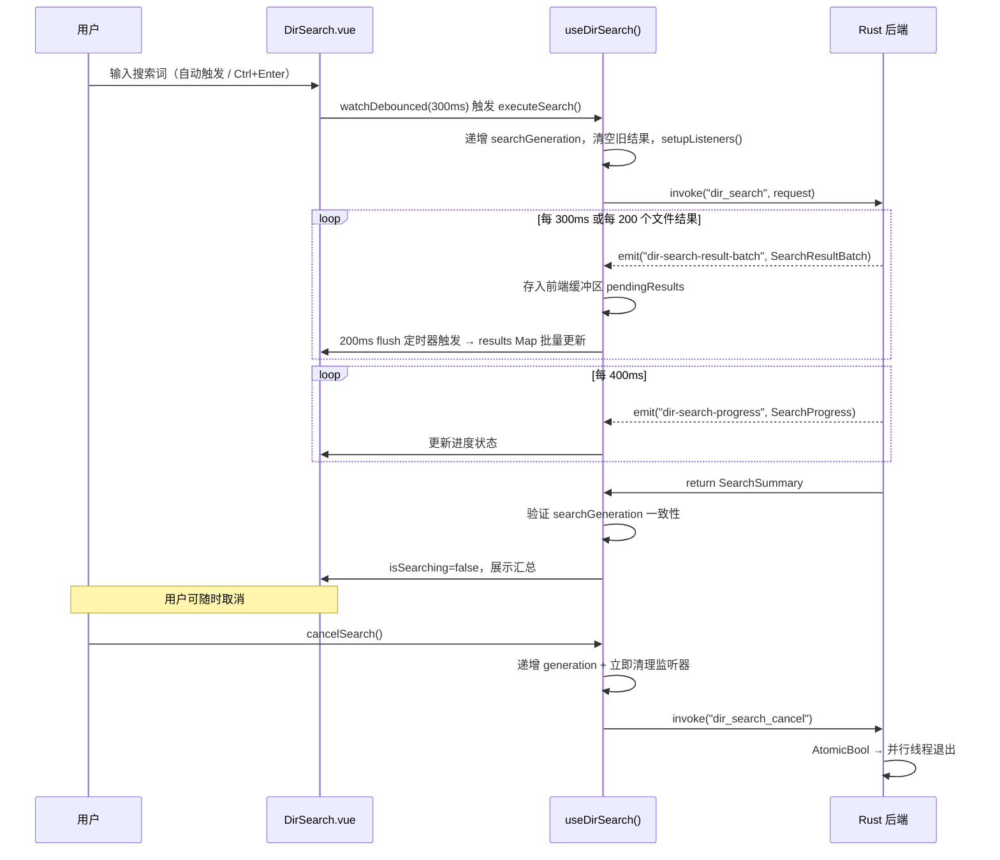
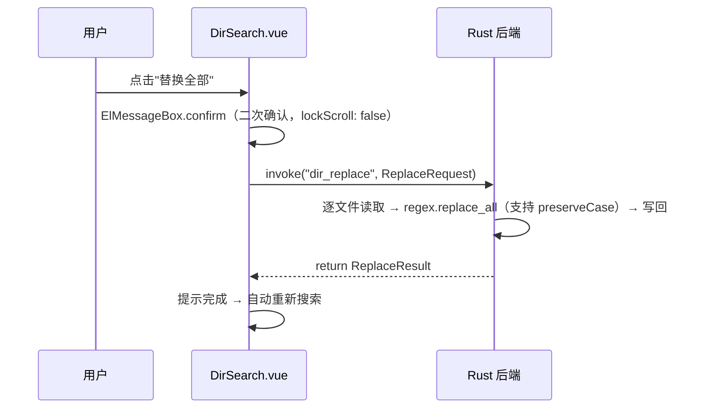
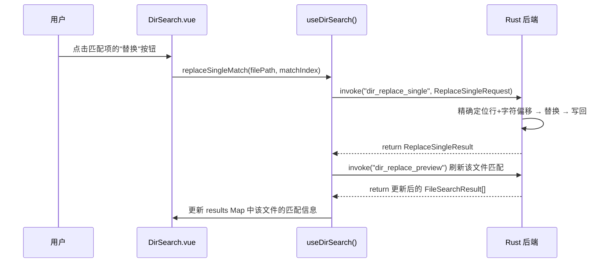
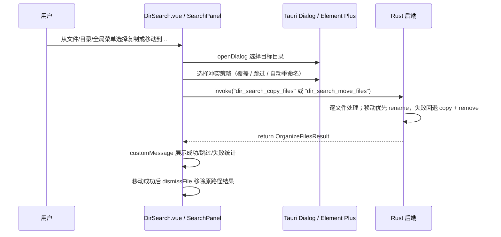
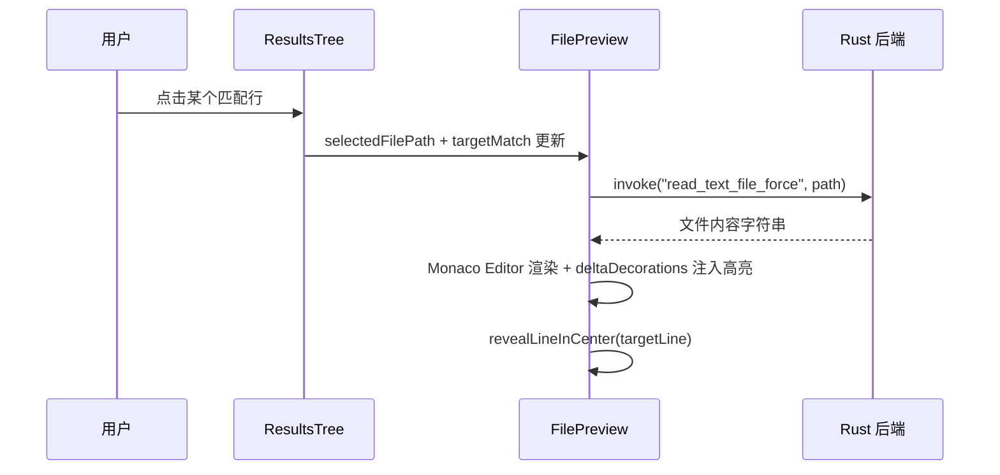

# Dir Search: 架构与开发者指南

> 更新日期： 2026-6-15

本文档解析目录搜索工具的内部架构、数据流和关键设计决策，为后续开发提供清晰指引。

## 1. 核心概念

Dir Search 是一个轻量级的目录内容搜索与替换工具，定位为"给定目录范围内的文件内容搜索"。其核心设计思想是 **Rust 后端负责高性能流式搜索，前端负责实时渲染与交互式浏览**。

## 2. 目录结构

```
src/tools/dir-search/
├── DirSearch.vue                        # 主布局：顶部目录栏 + 左右分栏
├── dir-search.registry.ts               # 工具注册（ToolConfig）
├── actions.ts                           # Agent 调用的搜索/替换动作层（非 Vue 响应式）
├── types.ts                             # 前端类型定义
├── ARCHITECTURE.md                      # 本文档
├── components/
│   ├── DirectoryBar.vue                 # 顶部目录输入栏（拖放 + 对话框选择）
│   ├── SearchPanel.vue                  # 左栏容器（标题栏按钮组 + SearchInput + ResultsTree）
│   ├── SearchInput.vue                  # 搜索/替换输入区 + 模式切换 + 过滤器 + 折叠设置
│   ├── ResultsTree.vue                  # 搜索结果（列表/树形双视图 + 上下文块渲染）
│   ├── ResultItem.vue                   # 单条匹配结果行（高亮 + 悬停操作 + Tooltip）
│   ├── FilePreview.vue                  # 右栏文件预览（Monaco Editor + 行高亮）
│   ├── ContextMenu.vue                  # 通用右键菜单组件
│   ├── ContextBlockView.vue             # 上下文块渲染组件
│   ├── DirectoryTreeView.vue            # 树形目录视图组件
│   └── DirectoryTreeNode.vue            # 树形目录递归节点组件
├── composables/
│   ├── useDirSearch.ts                  # 核心搜索逻辑编排（批量事件 + 消除 + 单项替换）
│   ├── useDirSearchContext.ts           # provide/inject 搜索上下文访问器
│   ├── useDirSearchUiState.ts           # UI 状态持久化（面板、视图、历史、设置）
│   ├── useInputHistory.ts               # 键盘历史回溯 + 自动保存逻辑（可复用）
│   ├── useContextMenu.ts                # 右键菜单状态管理
│   └── useContextBlocks.ts              # 上下文行合并去重算法
└── docs/Plan/                           # 修改计划文档（按需创建）
```

**Rust 后端**：`src-tauri/src/commands/dir_search.rs`

## 3. 架构概览

```
┌────────────────────────────────────────────────────────────┐
│                       Vue 前端                             │
│                                                            │
│  ┌─────────────┐  ┌──────────────┐  ┌───────────────────┐  │
│  │DirectoryBar │  │ SearchPanel  │  │   FilePreview     │  │
│  │(目录选择)   │  │ ┌SearchInput │  │ (Monaco Editor)   │  │
│  │             │  │ └ResultsTree │  │ + 行高亮 + 编辑   │  │
│  └──────┬──────┘  └──────┬───────┘  └────────┬──────────┘  │
│         │                │                   │             │
│  ┌──────┴────────────────┴───────────────────┴──────────┐  │
│  │                  useDirSearch()                      │  │
│  │  搜索参数 / 结果状态 / 事件监听 / 自动搜索节流       │  │
│  │  + 前端缓冲区 / 搜索代计数器 / 单项替换              │  │
│  └────────────────────────┬─────────────────────────────┘  │
│                           │ invoke() + listen()            │
├───────────────────────────┼────────────────────────────────┤
│                      Tauri IPC                             │
├───────────────────────────┼────────────────────────────────┤
│                       Rust 后端                            │
│  ┌────────────────────────┴─────────────────────────────┐  │
│  │                dir_search.rs                         │  │
│  │    ┌───────────┐  ┌────────┐  ┌────────────┐         │  │
│  │    │ ignore    │  │ regex  │  │encoding_rs │         │  │
│  │    │(并行遍历  │  │(匹配)  │  │(GBK解码)   │         │  │
│  │    │+glob      │  │        │  │            │         │  │
│  │    │+gitignore)│  │        │  │            │         │  │
│  │    └───────────┘  └────────┘  └────────────┘         │  │
│  │   ┌──────────────────────────────────────────┐       │  │
│  │   │ sync_channel(500) 背压 + AtomicBool 取消 │       │  │
│  │   └──────────────────────────────────────────┘       │  │
│  └──────────────────────────────────────────────────────┘  │
└────────────────────────────────────────────────────────────┘
```

## 4. 数据流

### 4.1. 搜索流程（流式事件架构）



### 4.2. 替换流程



### 4.2.1. 单项替换流程



### 4.3. 文件整理流程（复制/移动结果文件）



### 4.4. 文件预览流程



## 5. Rust 后端详解

### 5.1. Tauri 命令清单

| 命令                    | 功能                   | 返回/事件                                                                            |
| ----------------------- | ---------------------- | ------------------------------------------------------------------------------------ |
| `dir_search`            | 流式搜索目录内容       | 返回 `SearchSummary`；过程中 emit `dir-search-result-batch` 和 `dir-search-progress` |
| `dir_search_cancel`     | 取消正在进行的搜索     | `Ok(())`                                                                             |
| `dir_replace`           | 批量替换文件内容       | 返回 `ReplaceResult`                                                                 |
| `dir_replace_single`    | 精确替换单个匹配项     | 返回 `ReplaceSingleResult`                                                           |
| `dir_replace_preview`   | 替换预览（不修改文件） | 返回 `Vec<FileSearchResult>`                                                         |
| `dir_search_copy_files` | 复制搜索结果文件到目录 | 返回 `OrganizeFilesResult`                                                           |
| `dir_search_move_files` | 移动搜索结果文件到目录 | 返回 `OrganizeFilesResult`                                                           |

### 5.2. 核心机制

**取消机制**：使用 `AtomicBool` + Tauri `State` 管理。并行 walker 闭包每处理一个文件前检查标志位；主线程消费循环同样检查标志位，确保毫秒级响应取消请求。

**并行架构**：采用 "walker 线程 + 主线程消费" 模式：

- Walker 线程通过 `build_parallel()` 多线程并行遍历文件，搜索结果通过有界 `sync_channel(500)` 发送
- 主线程从 channel 消费结果，按时间/数量条件批量 emit 到前端
- 有界 channel 提供**背压机制**：当前端消费不及时，walker 线程自动阻塞等待，防止 IPC 积压导致 WebView 崩溃
- 取消时先 drop 接收端（rx），使 walker 线程的 `send()` 立即返回 Err 并退出，避免 join 等待

**文件遍历**：`ignore::WalkBuilder` 提供：

- 自动尊重搜索目录内的 `.gitignore` 规则（可配置关闭）
- 不向上查找父目录的 `.gitignore`（`parents(false)`）
- Glob 过滤（include/exclude 通过 `OverrideBuilder` 实现）
- 隐藏文件搜索支持（`hidden(false)`）

**二进制检测**：读取文件前 8KB（`8192` 字节），检查是否包含 NULL 字节。包含则跳过。

**编码处理**：`decode_to_string_owned()` 函数实现 UTF-8 → GBK 的 fallback 链，处理 UTF-8 BOM 头（`0xEF 0xBB 0xBF`），无 BOM UTF-8 文件走零拷贝转换。

**匹配器选择**：搜索使用 `FastMatcher`，纯文本且大小写敏感时走 `memchr::memmem` 快速路径；纯文本全词匹配在 memmem 命中后手动做 word boundary 检查；正则、不区分大小写等场景走 `regex` 引擎。替换仍使用 regex，因为需要 `replace_all` 与捕获组替换语义。

**偏移量转换**：Rust 匹配器返回字节偏移，ASCII 行直接复用字节偏移，非 ASCII 行增量转换为 char 索引，适配前端 JS 字符串操作。

**重叠合并**：同一行多个匹配项可能重叠，使用排序 + 区间合并算法处理。

**Preserve Case**：`preserve_case_convert()` 函数根据原始文本的大小写风格转换替换文本，识别模式优先级：全大写 → 全小写 → Title Case → 逐字符映射（对齐 VS Code 行为）。

**文件整理**：`OrganizeFilesRequest` 支持将结果文件复制/移动到目标目录，冲突策略为 `overwrite` / `skip` / `rename`。复制使用 `fs::copy`；移动优先 `fs::rename`，跨分区等 rename 失败时回退到 `copy + remove_file`；目标目录不存在时自动创建。

### 5.3. 性能策略

| 关注点       | 策略                                                                          |
| ------------ | ----------------------------------------------------------------------------- |
| 大目录遍历   | `WalkBuilder.build_parallel()` 多线程并行遍历，充分利用多核                   |
| 纯文本搜索   | 大小写敏感纯文本走 `memchr::memmem` 快速路径；其他模式走 regex 保持语义一致   |
| IPC 批处理   | 后端每 300ms 或每 200 个文件结果批量 emit，前端再以 200ms 定时器 flush 缓冲区 |
| 背压控制     | 有界 `sync_channel(500)` 限制内存，walker 满时自动阻塞                        |
| 海量结果     | `max_results` 上限（默认 10,000，可配置为 0 表示无限制），后端+前端双重防护   |
| 大文件       | 单文件 5MB 上限，超过跳过                                                     |
| 内存         | 流式处理，逐文件读取，不同时加载所有文件                                      |
| 取消响应     | `AtomicBool` 每文件检查 + drop rx 快速终止 walker 线程                        |
| 进度上报     | 每 400ms 汇报一次进度，避免事件风暴                                           |
| 前端渲染     | 2 万条结果无需虚拟滚动，Vue 处理简单 DOM 元素性能充足                         |
| 自动展开控制 | `autoExpandResults` 开关，大量结果时可关闭以提升渲染性能                      |

## 6. 前端详解

### 6.1. 核心 Composable：`useDirSearch()`

职责：搜索状态管理 + Tauri IPC 编排 + 自动搜索触发 + 单项替换。

**关键设计**：

- **自动搜索**：使用 `watchDebounced`（300ms）监听所有搜索参数变化（含 rootPath），输入即搜索
- **自动搜索门控**：`autoSearchReady` 标志位防止 UI 状态从持久化恢复时自动触发搜索，延迟 350ms（> debounce 300ms）后才启用
- **搜索代计数器**：`searchGeneration` 递增计数器解决并发竞态，确保旧搜索的 `finally` 不会破坏新搜索的状态
- **前端缓冲区**：`pendingResults` 数组 + 200ms `flushTimer` 定时器，将高频 batch 事件合并为低频响应式更新
- **批量事件处理**：监听 `dir-search-result-batch` 事件，先存入缓冲区，定时 flush 到 `shallowRef<Map>` 并 `triggerRef`
- **事件生命周期**：每次搜索前 `setupListeners()`，搜索结束后 `cleanupListeners()`（含 flush 残留缓冲）
- **结果存储**：`shallowRef<Map<filePath, FileSearchResult>>`，支持按文件路径快速查找
- **自动展开**：由 `autoExpandResults` 设置控制，默认全部展开新结果
- **消除操作**：支持 `dismissFile` / `dismissMatch` 从结果中移除条目
- **单项替换**：`replaceSingleMatch` 精确替换后自动调用 `refreshFileResults` 刷新该文件的匹配位置
- **前端上限防护**：flush 时检查 `maxResults`，超过上限停止添加新结果

### 6.1.1. Agent 动作层：`actions.ts`

`actions.ts` 抽离了不依赖 Vue 响应式系统的搜索/替换逻辑，供 `DirSearchRegistry` 暴露给 Agent 调用：

- **`searchDirectory()`**：监听 `dir-search-result-batch` 流式事件，同步收集结果，等待 `dir_search` 返回 `SearchSummary` 后格式化为 LLM 可读 Markdown 文本
- **`replaceInDirectory()`**：先用 `dir_search` 获取完整影响范围，再调用 `dir_replace` 执行批量替换，最后格式化替换统计
- **Glob 参数适配**：Agent 接口接收逗号分隔字符串，内部转换为 `SearchRequest` / `ReplaceRequest` 需要的数组
- **进度回调**：通过 `ToolContext.reportStatus()` 向调用方汇报搜索、格式化、替换阶段进度

### 6.1.2. 搜索上下文注入：`useDirSearchContext()`

`DirSearch.vue` 通过 `provide(DIR_SEARCH_CONTEXT_KEY, search)` 将 `useDirSearch()` 返回值提供给子组件。`SearchPanel`、`SearchInput`、`ResultsTree` 等组件通过 `useDirSearchContext()` 获取同一份搜索状态，避免多层 props 传递；如果在 `DirSearch.vue` 子树外使用会抛出明确错误。

### 6.2. UI 状态持久化：`useDirSearchUiState()`

通过 `createConfigManager` 将以下状态保存到 AppData（单例模式，整个工具共享）：

- 面板宽度（`panelWidth`，默认 360px）
- 面板折叠状态（`isPanelCollapsed`）
- 上次搜索目录（`lastRootPath`，下次打开自动恢复）
- 搜索输入状态（`isRegex`、`caseSensitive`、`wholeWord`、`includeGlobs`、`excludeGlobs`、`useGitignore`、`showReplace`、`preserveCase`）
- 视图模式（`viewMode`，列表/树形）
- 搜索上限（`maxResults`，默认 10000，0 = 无限制）
- 自动展开（`autoExpandResults`，默认 true，关闭可提升大量结果时的渲染性能）
- 上下文行设置（`contextLinesEnabled` + `contextLinesCount`）
- 高级设置折叠状态（`showAdvancedSettings`）
- 历史记录（搜索词 / 替换词 / 目录 / 包含 glob / 排除 glob）

**注意**：`pattern` 和 `replacement` 虽然持久化，但加载时强制清空，不恢复上次输入内容（交给历史记录处理）。

### 6.3. 文件预览：`FilePreview.vue`

核心特性：

- **可编辑**：使用 `RichCodeEditor`（Monaco 引擎，`editor-type="monaco"`），支持直接编辑文件内容
- **保存**：Ctrl+S 保存修改，通过 `write_text_file_force` 写回磁盘
- **脏状态检测**：对比编辑内容与原始内容，显示修改指示器（脉冲圆点）
- **匹配高亮**：通过 Monaco `deltaDecorations` API 实现三层装饰：
  - 整行浅色背景：所有匹配行（`monaco-highlight-match-line`）
  - 关键字文本高亮：所有匹配文本（`monaco-search-match-text`，橙色背景）
  - 当前聚焦行+文本：目标行深色背景（`monaco-highlight-target-line`）+ 活跃匹配文本（`monaco-search-match-text-active`，蓝色背景+边框）
- **Overview Ruler**：匹配位置在右侧滚动条缩略图中标记，便于快速定位
- **Minimap 标记**：匹配文本在缩略图中以颜色标记显示
- **自动滚动**：点击匹配项时 `revealLineInCenter` + `setSelection` 定位到目标行并选中匹配文本
- **语言推断**：根据文件扩展名和特殊文件名自动设置语法高亮语言
- **Monaco 选项**：启用缩略图、代码折叠、选中高亮、多文件出现高亮

### 6.4. 结果交互

- **悬停操作**：文件节点和匹配项悬停时显示操作按钮（消除、单项替换）
- **右键菜单**：
  - 文件级：全部替换 / 消除 / 排除类型 / 仅搜索此类型 / 复制文件名 / 复制路径 / 复制所有匹配 / 复制到 / 移动到 / 资源管理器显示
  - 匹配项级：替换 / 消除 / 复制匹配行
  - 目录级（树形视图）：消除目录 / 限制搜索到此目录 / 排除目录 / 递归展开 / 复制目录名 / 复制路径 / 复制所有匹配 / 复制目录结果文件到 / 移动目录结果文件到
  - 全局级：复制所有搜索结果 / 复制所有结果文件到 / 移动所有结果文件到
- **视图切换**：列表模式（按文件平铺分组）和树形模式（按目录层级展开）
- **上下文行**：可选内联展示匹配行上下文，相邻匹配自动合并去重
- **Tooltip 预览**：悬停 500ms 显示匹配行完整内容（仅在行被截断时）
- **键盘历史**：所有输入框支持 ArrowUp/Down 回溯历史记录
- **文件整理**：通过 Tauri 目录选择器选择目标目录，并用自定义 `ElMessageBox` 选择同名冲突策略（覆盖 / 跳过 / 自动重命名，`lockScroll: false`）

### 6.5. 历史记录系统：`useInputHistory()`

提供两个独立的 composable：

- **`useInputHistory()`**：键盘驱动的历史回溯状态机
  - 光标在首行 + ArrowUp → 切换到上一条历史
  - 光标在末行 + ArrowDown → 切换到下一条历史
  - Escape → 退出历史浏览，恢复原始输入
  - 其他按键 → 退出历史模式（允许在历史值基础上编辑）
- **`useAutoSaveHistory()`**：自动保存历史记录
  - 停止输入 2.5s 后，如果值不为空且与历史不重复，推入历史
  - 已存在的值不会重排顺序（防止自动搜索导致索引偏移）
- **`pushToHistory()`**：手动推入历史的工具函数，最大 20 条

### 6.6. 布局交互

- **可拖拽分栏**：左栏宽度 280~600px 可拖拽调整
- **可折叠面板**：左栏可完全折叠，右栏占满
- **目录拖放**：`DirectoryBar` 支持拖放目录路径（通过 `useFileDrop`）
- **快捷键**：Ctrl+Enter 执行搜索/替换
- **折叠设置区域**：高级搜索选项（自动展开、搜索上限、上下文行）收纳在可折叠面板中

## 7. 类型系统

前后端类型完全对齐（Rust 使用 `#[serde(rename_all = "camelCase")]`）：

| 类型                   | 用途                                                    |
| ---------------------- | ------------------------------------------------------- | --------- |
| `SearchRequest`        | 搜索请求参数（含 `contextLines`、`maxResults`）         |
| `SearchMatch`          | 单个匹配项（行号 + 行内容 + char 偏移 + 可选上下文行）  |
| `FileSearchResult`     | 单文件搜索结果（绝对路径 + 相对路径 + 匹配列表）        |
| `SearchResultBatch`    | IPC 批量事件载荷（`results: FileSearchResult[]`）       |
| `SearchProgress`       | 搜索进度事件（已扫描/已匹配/总匹配数/当前文件）         |
| `SearchSummary`        | 搜索完成汇总（文件数 + 匹配数 + 耗时 + 是否取消）       |
| `ReplaceRequest`       | 批量替换请求（含 `preserveCase`）                       |
| `ReplaceResult`        | 替换结果（成功/失败文件数 + 错误详情）                  |
| `ReplaceError`         | 替换错误详情（文件路径 + 错误信息）                     |
| `ReplaceSingleRequest` | 单项精确替换请求（文件路径 + 行号 + char 偏移）         |
| `ReplaceSingleResult`  | 单项替换结果（原始文本 + 替换后文本）                   |
| `OrganizeFilesRequest` | 复制/移动结果文件请求（文件列表 + 目标目录 + 冲突策略） |
| `OrganizeFilesResult`  | 复制/移动结果（成功/跳过/失败数量 + 成功路径 + 错误）   |
| `OrganizeFileError`    | 文件整理错误详情（文件路径 + 错误信息）                 |
| `TargetMatch`          | 前端预览定位用（行号 + 偏移 + 序列号强制触发 watch）    |
| `HighlightPart`        | 前端高亮渲染用的文本片段                                |
| `ContextBlock`         | 上下文块（合并后的连续行区域）                          |
| `ContextLine`          | 上下文块内的单行（含匹配信息或纯上下文标记）            |
| `DirectoryNode`        | 树形视图的目录节点（支持路径段合并显示）                |
| `ViewMode`             | 视图模式（`'list'                                       | 'tree'`） |

## 8. 与其他工具的关系

| 工具                | 关系                                                                                    |
| ------------------- | --------------------------------------------------------------------------------------- |
| `regex-applier`     | 定位不同：regex-applier 专注规则预设 + 单文本替换；dir-search 专注跨目录搜索 + 交互浏览 |
| `directory-janitor` | 共享"目录扫描 + 事件流 + 取消"的架构模式，但不共享代码                                  |
| `directory-tree`    | 同为目录级工具，但 tree 关注结构可视化，search 关注内容搜索                             |

## 9. 未来展望

- **预设保存**：保存常用搜索配置
- ~~**Agent 服务注册**~~：✅ 已实现（`DirSearchRegistry` 类，暴露 `searchDirectory` 和 `replaceInDirectory` 方法）

### 已评估并放弃的方案

- **虚拟滚动**：经实测，2 万条结果在 Vue 中渲染简单 DOM 元素不会出现滚动卡顿，虚拟滚动的复杂度收益比不划算，不予引入。
