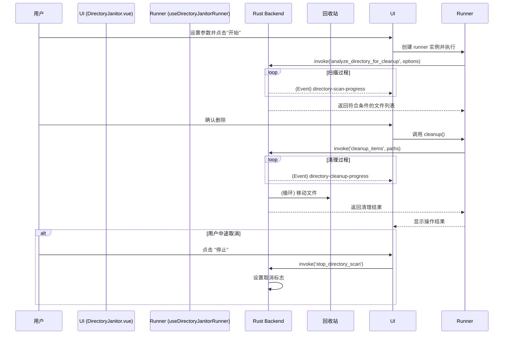

# Directory Janitor: 架构与开发者指南

本文档旨在解析 Directory Janitor 工具的内部架构、设计理念和数据流，为后续开发提供清晰的指引。

## 1. 核心概念

Directory Janitor 是一个目录清理工具，旨在通过高性能后端扫描和灵活的过滤规则，帮助用户安全、高效地管理磁盘空间。

### 1.1. Rust 后端驱动 (Rust-powered Engine)

所有核心的文件系统扫描和过滤操作都由 Rust 后端执行，以确保最佳性能和安全性。

- **调用方式**: 前端通过 Tauri `invoke` 调用 `analyze_directory_for_cleanup` 和 `cleanup_items` 等命令。
- **核心优势**:
  - **高性能**: Rust 在处理大规模文件系统遍历时远快于 Node.js。
  - **准确性**: 直接使用原生文件系统 API，确保过滤条件（如文件年龄、大小）的准确性。
  - **安全性**: 利用 Rust 的内存安全特性，减少潜在的执行风险。
  - **可控性**: 后端任务（扫描与清理）支持通过 `stop_directory_scan` 等命令随时取消，并通过 Tauri Event 向前端实时上报进度。

### 1.2. 灵活的过滤规则 (Flexible Filtering Rules)

支持多种过滤条件的任意组合，以适应复杂的清理场景。

- **支持的条件**:
  - **名称模式**: `namePattern` (Glob 格式, 如 `*.tmp`, `*.log`)
  - **文件年龄**: `minAgeDays` (文件最后修改时间距今的天数)
  - **文件大小**: `minSizeMB`
  - **目录深度**: `maxDepth`
- **组合逻辑**: 所有条件在 Rust 后端以 `AND` 逻辑组合执行。

### 1.3. 安全清理机制 (Safe Cleanup)

为了防止用户误删重要文件，工具采取了安全优先的删除策略。

- **移至回收站**: 所有被清理的文件都通过 `trash` crate **移至系统回收站**，而非永久删除，为用户提供了恢复的机会。
- **用户确认**: 在执行清理操作前，UI 层会明确提示用户将要删除的文件数量和总体积，并要求二次确认。

## 2. 架构概览

- **State/View (`DirectoryJanitor.vue`)**: 负责 UI 渲染、用户输入（目标目录、过滤规则）和结果展示。
- **Service (`DirectoryJanitorService`)**: 提供高级、无状态的 API（如 `scanDirectory`, `cleanupItems`），封装了与后端的交互逻辑。
- **Runner (`useDirectoryJanitorRunner`)**: 一个临时的、有状态的 Composable，用于管理单次扫描/清理任务的完整生命周期（初始化、执行、结果格式化、清理）。
- **Engine (Rust Backend)**: 负责执行实际的文件系统扫描和清理操作。

## 3. 数据流：执行一次“扫描并清理”

## 4. 核心逻辑

- **预设规则**: 内置了针对常见清理场景（如浏览器缓存、VSCode 历史任务）的预设规则，简化用户操作。
- **无状态服务**: `DirectoryJanitorService` 本身是无状态的，每次操作都会创建一个临时的 `runner` 实例，确保了操作的隔离性和可预测性。

## 5. 未来展望

- **系统文件保护**: 增加扫描黑名单，防止用户意外扫描系统保护目录。
- **符号链接处理**: 优化对符号链接的处理逻辑，避免误删。
