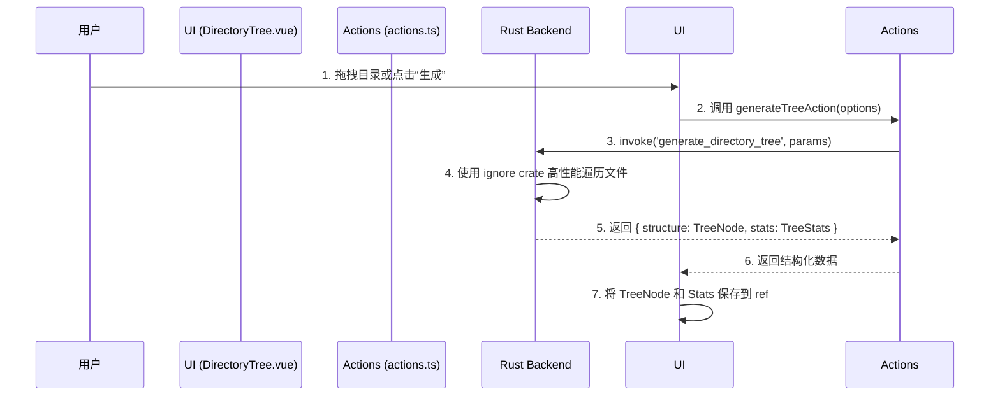
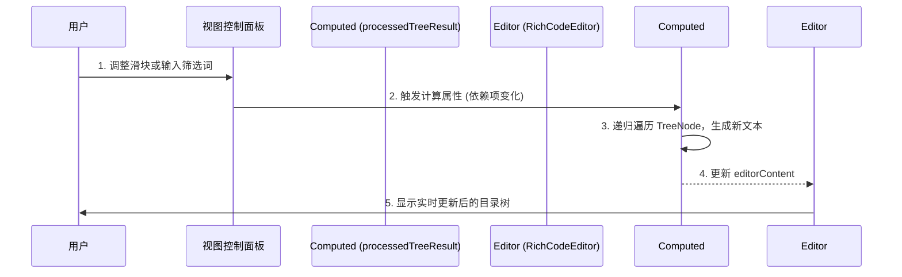

# Directory Tree: 架构与开发者指南

本文档旨在解析 Directory Tree 工具的内部架构、设计理念和数据流，为后续开发提供清晰的指引。

## 1. 核心概念

Directory Tree 是一个交互式的目录结构可视化工具。其核心设计思想是**后端负责高性能的数据抓取，前端负责灵活的动态渲染与交互**。

### 1.1. Rust 后端：高性能结构化数据生成

核心的目录遍历和初始过滤逻辑完全由 Rust 后端处理，以确保最佳性能和准确性。

-   **核心库**: 后端利用了 `ignore` crate (ripgrep 的核心引擎)，原生支持 `.gitignore` 规则，提供了极高的遍历效率。
-   **调用方式**: 前端通过 Tauri `invoke` 调用 `generate_directory_tree` 命令。
-   **输出**: 后端**不生成**最终的文本树。相反，它返回一个**结构化的 `TreeNode` 对象 (JSON)** 和统计信息。这为前端的动态交互奠定了基础。

    ```typescript
    // Rust 返回的核心数据结构
    interface TreeNode {
      name: string;
      path: string;
      is_dir: boolean;
      size: number;
      children: TreeNode[];
      error?: string;
    }
    ```

### 1.2. 前端：动态渲染与二次筛选

前端是所有交互和最终视觉呈现发生的地方。

-   **动态渲染**: `DirectoryTree.vue` 组件接收到后端的 `TreeNode` 结构化数据后，会通过一个递归函数 (`renderTreeRecursive`) 在**前端实时地**将数据渲染成文本格式的树状图。
-   **二次视图控制**: UI 上提供了一套“视图控制与筛选”面板。用户对这些控件（如“显示深度”、“排除内容”）的任何操作，都会**立即触发前端重新渲染**，而无需再次请求后端。这是通过 Vue 的计算属性 (`processedTreeResult`) 实现的，提供了流畅的实时筛选体验。
-   **富文本编辑器**: 生成的结果最终被呈现在 `RichCodeEditor` (CodeMirror) 中，为用户提供了语法高亮、行号以及便捷的编辑、复制和导出能力。

## 2. 架构概览

-   **View (`DirectoryTree.vue`)**: 负责 UI 渲染和用户交互。包含两个主要部分：
    1.  **配置面板**: 用于设置初始生成参数（目标路径、过滤规则、深度等）。
    2.  **结果面板**: 展示 `RichCodeEditor` 和“二次视图控制”面板，处理所有前端的实时交互。
-   **Actions (`actions.ts`)**: 充当业务逻辑层 (Service Layer)。它封装了所有核心操作，包括：
    -   调用 Rust 后端 (`generateTree`)。
    -   处理文件对话框 (`selectDirectory`, `exportToFile`)。
    -   管理配置的加载与保存 (`loadConfig`, `saveConfig`)。
-   **Store (`config.ts`)**: 负责定义核心数据结构 (`TreeNode`, `DirectoryTreeConfig`) 和与本地存储交互的持久化逻辑。
-   **Engine (Rust Backend)**: 职责单一且明确：高效地遍历文件系统，应用 `.gitignore` 和自定义规则，然后返回结构化的 `TreeNode` 数据。

## 3. 数据流

整个过程分为两个主要阶段：**数据生成**和**视图渲染**。

### 3.1. 阶段一：数据生成



### 3.2. 阶段二：前端动态视图渲染



## 4. 核心逻辑详解

-   **配置持久化**: 用户的偏好设置以及**最后一次成功生成的 `TreeNode` 结构**都会被保存在本地。当用户再次打开工具时，会直接恢复上次的视图，无需重新生成。
-   **关注点分离**: 后端专注于快速、准确地提供原始数据；前端专注于提供灵活、响应迅速的用户体验。这种分离使得各自的逻辑更纯粹，易于维护。
-   **前端渲染 (`renderTreeRecursive`)**: 这个函数是前端渲染的核心。它接收 `TreeNode` 和当前的视图选项（二次深度、排除模式等），然后递归地构建出最终的字符串数组，最后用 `\n` 连接成最终显示在编辑器中的内容。
-   **导出与复制**: “复制”和“导出”功能操作的是 `RichCodeEditor` 中当前显示的内容 (`editorContent`)，这意味着用户在编辑器中所做的任何手动修改都会被一并导出，提供了额外的灵活性。

## 5. 未来展望

-   **更多输出格式**: 由于前端已经拥有了完整的结构化数据 (`TreeNode`)，可以非常容易地扩展导出功能，支持 JSON、YAML 或 Mermaid 格式，而无需修改后端。
-   **高级前端筛选**: 可以在前端实现更复杂的筛选逻辑，例如基于文件大小、修改日期等进行筛选。
-   **虚拟化长列表**: 对于超大规模的目录结构，可以引入虚拟滚动技术来优化 `RichCodeEditor` 的渲染性能。
