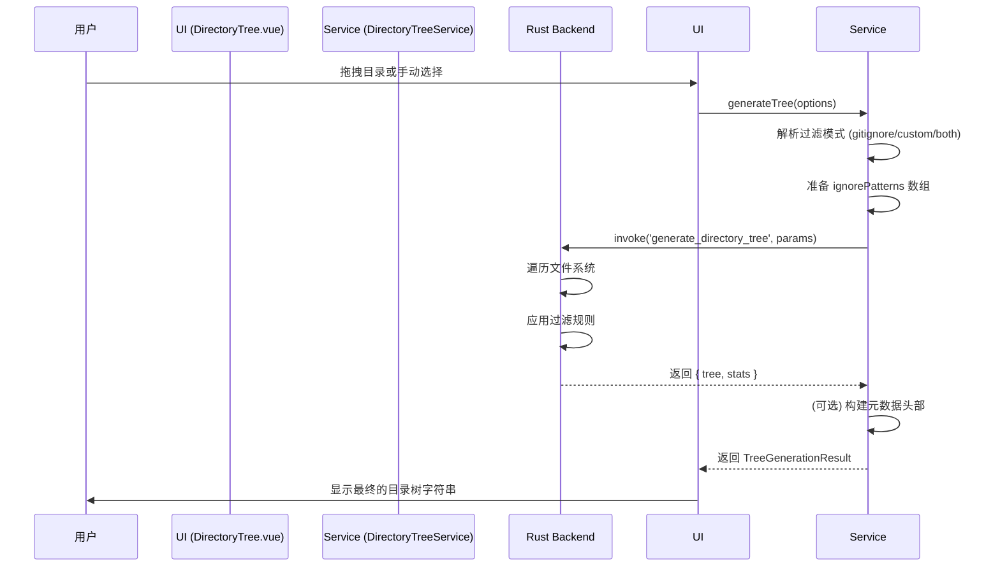

# Directory Tree: 架构与开发者指南

本文档旨在解析 Directory Tree 工具的内部架构、设计理念和数据流，为后续开发提供清晰的指引。

## 1. 核心概念

Directory Tree 是一个目录结构可视化工具，旨在通过高性能后端生成和智能过滤，提供专业、灵活的目录树状图。

### 1.1. Rust 后端生成 (Rust-powered Generation)

核心的目录遍历和树状图构建逻辑完全由 Rust 后端处理，以确保最佳性能。

- **调用方式**: 前端通过 Tauri `invoke` 调用 `generate_directory_tree` 命令。
- **核心优势**:
  - **性能**: Rust 在处理大规模文件系统遍历时远快于 Node.js。
  - **原生集成**: 直接使用操作系统的文件系统 API，并能正确处理各种边缘情况。
  - **安全性**: 所有文件操作都在 Tauri 的安全沙箱内执行。

### 1.2. 智能过滤系统 (Intelligent Filtering)

为了生成干净、有意义的目录树，工具集成了强大的过滤系统。

- **.gitignore 集成**: 支持自动查找并应用项目中的 `.gitignore` 规则，这是最常用的过滤方式。
- **自定义规则**: 允许用户提供自定义的 `glob` 模式列表进行过滤。
- **组合模式**: 支持同时应用 `.gitignore` 和自定义规则，实现最大灵活性。
- **实现方式**: 前端通过传递一个特殊标记 `__USE_GITIGNORE__` 来告知后端启用 `.gitignore` 模式。

## 2. 架构概览

- **View (`DirectoryTree.vue`)**: 负责 UI 渲染和用户交互，包括路径选择、参数配置和结果展示。
- **Service (`DirectoryTreeService`)**: 提供一个高级、无状态的 `generateTree` API，封装了所有与后端交互和参数处理的逻辑。
- **Engine (Rust Backend)**: 负责执行实际的目录遍历、规则过滤和 ASCII 树状图生成。

## 3. 数据流：生成一次目录树

## 4. 核心逻辑

- **深度控制**: 用户可以通过 UI 设置最大递归深度，`0` 在后端被解释为无限制。
- **元数据注入**: 可选在生成的树状图前添加一个 Markdown 头部，包含生成配置和文件统计信息，便于分享和归档。
- **配置持久化**: 用户的偏好设置（如过滤模式、深度、是否显示隐藏文件等）会自动保存，并在下次启动时恢复。
- **服务注册**: `DirectoryTreeService` 被注册为全局服务，允许其他工具（如 LLM Chat）直接调用其 `generateTree` 方法来获取目录结构。

## 5. 未来展望

- **更多输出格式**: 扩展后端能力，支持生成 JSON、HTML 或 Mermaid 格式的目录结构。
- **符号链接处理**: 增强后端对符号链接的检测和处理，防止无限循环。
