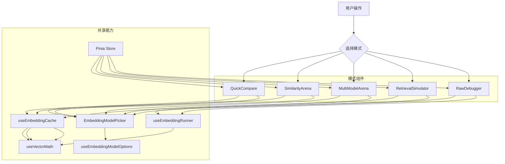

# Embedding 测试场架构文档

## 1. 概述

`Embedding 测试场` 是一个面向开发者的 Embedding 调试、评估与 RAG 阈值校准工具。它提供从极简 A/B 相似度对比，到 1:N 排行、多模型横向评估、检索模拟和原始向量调试的完整工作流。

### 核心价值

- **直观对比**：支持两个文本直接出分，也支持批量 1:N 语义排行。
- **多模型评估**：通过打分矩阵、排序一致性和阈值校准辅助 RAG 模型迁移。
- **透明调试**：可查看原始向量响应、维度、耗时和 Token 统计。
- **低成本复测**：按模型隔离的增量缓存减少重复 Embedding API 调用。

---

## 2. 目录结构

```text
embedding-playground/
├── components/
│   ├── EmbeddingModelPicker.vue  # Embedding 模型单选/多选控件
│   ├── QuickCompare.vue          # 极简 A vs B 对比
│   ├── SimilarityArena.vue       # 单模型 1:N 语义排行
│   ├── MultiModelArena.vue       # 多模型竞技场与阈值校准
│   ├── RetrievalSimulator.vue    # RAG 检索模拟
│   └── RawDebugger.vue           # 原始向量化调试
├── composables/
│   ├── useEmbeddingCache.ts      # 按模型隔离的增量缓存与请求封装
│   ├── useEmbeddingModelOptions.ts # Embedding 模型筛选与 combo 解析
│   ├── useEmbeddingRunner.ts     # API 调用封装与执行统计
│   └── useVectorMath.ts          # 向量数学工具集
├── store.ts                      # Pinia Store，共享文本与各模式独立模型状态
├── EmbeddingPlayground.vue       # 主入口，负责 5 标签页导航
├── embedding-playground.registry.ts
└── ARCHITECTURE.md
```

---

## 3. 五大模式

### 3.1 极简 A vs B (`QuickCompare.vue`)

- 输入文本 A 与文本 B，直接计算相似度。
- 支持单模型仪表盘展示，也支持多模型并排卡片对比。
- 复用 `anchorText` 和 `comparisonTexts[0]`，方便用户把 A/B 样本切到其他模式继续分析。

### 3.2 1:N 语义排行 (`SimilarityArena.vue`)

- 单模型模式，内部维护 `similarityProfile` / `similarityModelId`。
- 通过 `useEmbeddingCache` 只请求未命中的文本向量。
- 算法变化时基于已有向量重算分数，不重复请求 API。

### 3.3 多模型竞技场 (`MultiModelArena.vue`)

- 多选模型并行评估同一组 Anchor 与对比文本。
- 输出打分矩阵 Heatmap，用于观察不同模型的绝对分数分布。
- 输出各模型 Top 排序，用于观察召回顺序是否稳定。
- 阈值校准器使用百分位数对齐，将基准模型阈值映射为其他模型的推荐阈值。

### 3.4 检索模拟 (`RetrievalSimulator.vue`)

- 内部维护 `retrievalProfile` / `retrievalModelId`。
- 文档向量化使用 `RETRIEVAL_DOCUMENT`，查询向量化使用 `RETRIEVAL_QUERY`。
- 切换模型时会清空旧文档向量和查询缓存，避免跨模型 embedding 混用。
- Top-K 与相似度阈值都会参与结果过滤。

### 3.5 基础调试 (`RawDebugger.vue`)

- 内部维护 `rawProfile` / `rawModelId`。
- 支持自定义维度参数。
- 展示向量首尾预览、完整 JSON、维度、耗时和 Token 统计。

---

## 4. Store 设计

`store.ts` 不再维护全局 `selectedProfile` / `selectedModelId`。模型选择状态按模式拆分，避免切换标签页时互相覆盖：

- `quickCompareProfile` / `quickCompareModelId` / `quickCompareCombos`
- `similarityProfile` / `similarityModelId`
- `multiArenaCombos`
- `retrievalProfile` / `retrievalModelId`
- `rawProfile` / `rawModelId`

共享数据仍保留在 Store 中，包括 `anchorText`、`comparisonTexts`、`rawInput`、`searchQuery`、`similarityAlgorithm` 和检索知识库。

---

## 5. 计算与缓存

### 5.1 向量数学 (`useVectorMath.ts`)

支持四种算法：

- 余弦相似度
- 点积
- 欧氏距离
- 曼哈顿距离

距离类算法会通过 `1 / (1 + d)` 转换为“数值越大越相似”的展示分数。

### 5.2 增量缓存 (`useEmbeddingCache.ts`)

缓存结构为：

```text
Map<ModelCombo, Map<TextContent, EmbeddingVector>>
```

执行流程：

1. 根据模型 combo 获取独立缓存池。
2. 对当前文本去重并检查缓存命中。
3. 仅对未缓存文本调用 `callEmbeddingApi`。
4. 请求成功后写入缓存。
5. 按原始文本顺序组装向量结果返回给组件。

---

## 6. 数据流


