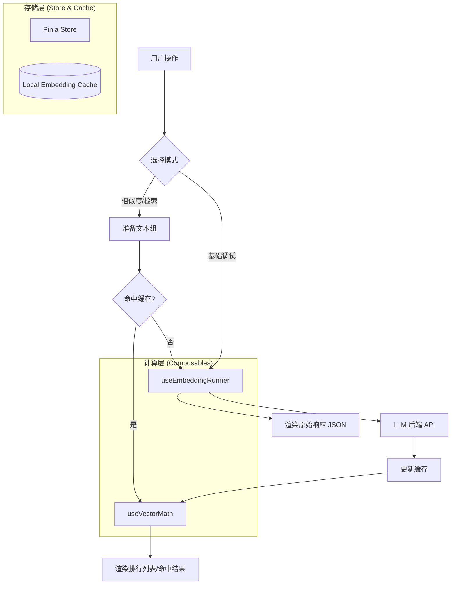

# Embedding 测试场架构文档

## 1. 概述

`Embedding 测试场` 是一个专为开发者设计的交互式工具，用于调试、评估和验证 LLM Embedding API。它解决了向量化模型在实际应用（如 RAG）中的“黑盒”问题，通过直观的对比和模拟环境，帮助开发者选择最适合其业务场景的模型和算法。

### 核心价值

- **透明化**: 直观查看原始向量数据及其维度。
- **效率**: 内置增量缓存机制，大幅降低重复测试的 API 成本和耗时。
- **原型验证**: 无需编写代码即可快速验证 RAG 召回效果。

---

## 2. 目录结构

```text
embedding-playground/
├── components/
│   ├── SimilarityArena.vue       # [核心] 语义相似度对比面板
│   ├── RetrievalSimulator.vue    # [核心] 检索模拟面板（RAG 原型）
│   └── RawDebugger.vue           # [工具] 基础向量化调试面板
├── composables/
│   ├── useEmbeddingRunner.ts     # API 调用封装与执行统计
│   └── useVectorMath.ts          # 向量数学工具集（相似度与距离算法）
├── store.ts                      # Pinia Store（持久化与共享状态管理）
├── EmbeddingPlayground.vue       # 主入口组件（布局与导航控制）
├── embeddingPlayground.registry.ts # 工具注册信息
└── ARCHITECTURE.md               # 本文档
```

---

## 3. 技术实现细节

### 3.1 向量数学引擎 (`useVectorMath.ts`)

支持四种主流的向量空间计算方法：

- **余弦相似度 (Cosine)**: 关注向量方向，忽略绝对模长，最常用的语义相似度指标。
- **点积 (Dot Product)**: 衡量向量在同一方向上的累积效应，适用于已归一化的向量。
- **欧氏距离 (Euclidean)**: 计算空间绝对距离（L2 范数）。
- **曼哈顿距离 (Manhattan)**: 计算坐标轴距离之和（L1 范数）。

> **直觉优化**: 为了统一 UI 表现，距离类算法（越小越优）在展示前会通过 `1 / (1 + d)` 转换为 `[0, 1]` 范围的相似度分数（越大越优）。

### 3.2 智能缓存策略

在 `SimilarityArena.vue` 中实现了二级缓存机制：

1. **模型隔离**: 缓存按 `modelId` 进行物理隔离，防止不同模型间的向量混用。
2. **增量请求**:
   - 每次对比时，系统会自动对比“当前文本组”与“缓存池”。
   - 仅对未命中的文本发起 API 请求。
   - 请求成功后自动合并新旧向量，确保响应速度随使用次数增加而提升。

### 3.3 布局设计规范

采用 **“左配置、右结果”** 的非对称双栏布局：

- **左侧 (Fixed 400px)**: 包含模型微调参数、输入编辑器、算法切换。
- **右侧 (Flex 1)**: 动态排行列表、可视化分数条、JSON 预览。
- **毛玻璃效果**: 深度集成项目 `theme-appearance` 系统，背景支持 `var(--ui-blur)` 适配。

---

## 4. 三大核心功能模块

### 4.1 相似度对比 (SimilarityArena)

- **场景**: 验证模型对近义词、相关概念的区分能力。
- **特性**:
  - 支持 1:N 批量对比。
  - 结果实时排行，根据分数自动切换颜色编码（绿/黄/红）。
  - 支持一键导出对比报告至剪贴板。

### 4.2 检索模拟 (RetrievalSimulator)

- **场景**: 模拟 RAG 系统的 `Retrieval` 阶段。
- **工作流**:
  1. **构建索引**: 手动添加文档片段，执行“一键向量化”。
  2. **查询召回**: 输入 Query，系统自动将其向量化并与本地文档库进行 Top-K 检索。
  3. **阈值过滤**: 支持滑动调整相似度阈值，过滤低相关度结果。

### 4.3 基础调试 (RawDebugger)

- **场景**: 接入新模型时的协议对接与性能测试。
- **特性**:
  - **自定义维度**: 支持 OpenAI `text-embedding-3` 等模型的可变维度参数。
  - **向量预览**: 自动提取向量首尾数值，快速感知数值分布。
  - **统计**: 实时显示 Tokens 消耗与网络耗时。

---

## 5. 数据流图



---

## 6. 依赖项说明

- **`@/llm-apis/embedding`**: 统一的 API 适配层，处理不同供应商的协议差异。
- **`RichCodeEditor`**: 提供 Markdown 输入和 JSON 结果的高亮显示。
- **`BaseDialog`**: 用于知识库片段的精细化编辑的弹窗。
- **`lucide-vue-next`**: 提供语义化的图标支持。

---

## 7. 后续演进方向

- [ ] 增加可视化向量空间分布图
- [ ] 支持 Rerank 模型的集成对比。
