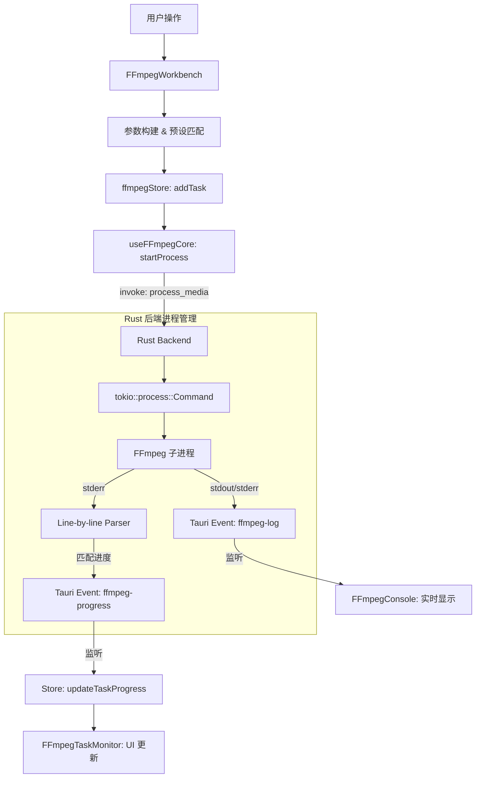

# FFmpeg 多媒体工作台架构文档

## 1. 概述

FFmpeg 多媒体工作台是 AIO Hub 中的核心音视频处理模块。它通过 Tauri 调用 Rust 后端，实现了对 FFmpeg 进程的高效管理、实时进度监听和多任务并行处理。该工具旨在为用户提供从简单预设转换到高级自定义参数配置的全方位多媒体处理方案。

## 2. 目录结构

```text
src/tools/ffmpeg-tools/
├── components/                 # UI 组件
│   ├── FFmpegWorkbench.vue     # 工作台主面板（文件导入、参数配置）
│   ├── FFmpegTaskMonitor.vue   # 任务监控（进度跟踪、状态管理）
│   ├── FFmpegSettings.vue      # 全局配置（二进制路径、并发控制）
│   ├── FFmpegParamsForm.vue    # 参数表单（音视频编码器、码率、分辨率等）
│   ├── FFmpegPresetManager.vue # 预设管理（内置预设与用户自定义快照）
│   ├── FFmpegConsole.vue       # 实时日志输出控制台
│   ├── MediaInfoPanel.vue      # 媒体元数据展示
│   └── MediaInfoDialog.vue     # 媒体信息详情弹窗
├── composables/
│   └── useFFmpegCore.ts        # 核心逻辑封装：调用 Rust 命令、监听全局事件
├── utils/
│   └── persistence.ts          # 持久化逻辑（配置/任务/预设的存储）
├── ffmpegStore.ts              # Pinia 状态中心：管理任务队列、配置和预设
├── types.ts                    # TypeScript 类型定义
├── FFmpegTool.vue              # 插件入口组件（Tab 导航容器）
└── ffmpegTools.registry.ts     # 工具注册定义

src-tauri/src/commands/
└── ffmpeg_processor.rs         # 后端实现
```

## 3. 核心架构与数据流

### 3.1 总体架构

系统采用 **前端驱动 + 后端执行** 的异步架构：

1.  **前端 (Vue 3)**: 负责 UI 交互、参数构建、任务状态维护。
2.  **后端 (Rust)**: 负责子进程生命周期管理、stderr 流式解析（进度提取）、系统信号处理。
3.  **通信层 (Tauri IPC)**: 通过 `invoke` 发起异步任务，通过 `Emit` 事件回传进度。

### 3.2 数据流向图



## 4. 后端实现细节 (Rust)

后端逻辑核心位于 `src-tauri/src/commands/ffmpeg_processor.rs`：

- **状态管理**: `FFmpegState` 使用 `Arc<Mutex<HashMap<String, Child>>>` 维护所有活跃的 FFmpeg 进程，确保可以通过 `task_id` 精确控制（如终止任务）。
- **进程启动**:
  - 使用 `tokio::process::Command` 异步启动。
  - 在 Windows 环境下设置 `CREATE_NO_WINDOW` 标志，防止弹出控制台窗口。
  - 自动处理输出目录创建和输入文件存在性检查。
- **进度解析引擎**:
  - 通过 `stderr` 管道实时捕获 FFmpeg 的输出。
  - 在一个独立的 `tokio::spawn` 协程中流式读取输出，解析 `time=`, `speed=`, `bitrate=` 等关键指标。
  - 结合前端传入的 `duration` 计算百分比进度。
- **元数据提取**:
  - `get_media_metadata`: 快速解析 `ffmpeg -i` 的 stderr 输出获取基础信息。
  - `get_full_media_info`: 调用 `ffprobe` 并解析其 JSON 输出，提供详细的流信息。
- **智能码率计算**: 支持根据用户设定的 `max_size_mb` 目标文件大小，结合视频时长自动计算所需的视频码率。

## 5. 状态管理 (Pinia)

`useFFmpegStore` 管理以下核心状态：

- **Tasks**: 响应式任务列表。
  - 状态机：`pending` -> `processing` -> (`completed` | `failed` | `cancelled`)。
  - 持久化：任务记录和日志通过 `persistence.ts` 存储在本地，支持应用重启后查看。
- **Config**:
  - 存储 FFmpeg/FFprobe 二进制路径。
  - 管理并发任务数限制。
- **Presets**:
  - 内置预设：针对常见场景（如微信、抖音、极致压缩）优化的参数。
  - 用户预设：支持将当前参数快照保存为自定义模板。

## 6. 处理模式与参数逻辑

| 模式           | 逻辑实现                                          | 应用场景                       |
| :------------- | :------------------------------------------------ | :----------------------------- |
| **视频重编码** | 指定 `-c:v` (如 libx264/libx265) 和 `-crf` 或码率 | 视频压缩、画质优化             |
| **流拷贝**     | 使用 `-c copy`                                    | 极速转换封装格式（不改变编码） |
| **音频提取**   | 使用 `-vn -c:a`                                   | 视频转 MP3/AAC/FLAC            |
| **自定义模式** | 允许用户直接输入原始命令行参数                    | 高级用户自定义需求             |

## 7. 关键特性

- 支持 `hwaccel auto` 开启硬件加速解码/编码（如 `nvenc`）。
- 毫秒级的进度更新和流式日志输出。
- 进程异常退出捕捉。
- 应用重启时自动清理旧任务状态（将 `processing` 标记为 `cancelled`）。
- 适配 AIO Hub 的毛玻璃外观系统，支持拖拽多文件批量导入。
