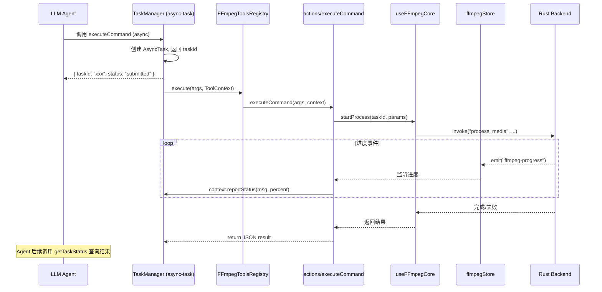

# FFmpeg Agent 方法设计方案

**状态**: RFC  
**日期**: 2025-05-18  
**作者**: 咕咕

## 1. 目标

为 FFmpeg 工具添加 Agent 可调用方法，使 LLM 能够：

1. 直接编排并执行任意 FFmpeg 命令
2. 执行多步管道（Pipeline）处理
3. 查询媒体文件信息

所有处理任务使用**异步任务模式**（`executionMode: "async"`），立即返回 taskId，Agent 通过 `tool-calling.getTaskStatus` 查询进度和结果。

## 2. 方法清单

| 方法              | 用途                 | 执行模式 | 可取消 |
| ----------------- | -------------------- | -------- | ------ |
| `executeCommand`  | 执行单条 FFmpeg 命令 | async    | ✅     |
| `executePipeline` | 执行多步串行管道     | async    | ✅     |
| `getMediaInfo`    | 获取媒体文件元数据   | sync     | -      |

## 3. 接口设计

### 3.1 `executeCommand` — 单命令执行

```typescript
interface ExecuteCommandArgs {
  /** 输入文件路径 */
  inputPath: string;
  /** 输出文件路径（可选，不填则在输入文件同目录自动生成） */
  outputPath?: string;
  /**
   * FFmpeg 参数数组（不含 ffmpeg 可执行文件名、不含 -i 输入、不含输出路径）
   * 例如: ["-c:v", "libx264", "-crf", "23", "-c:a", "aac", "-b:a", "128k"]
   */
  args: string[];
  /** 是否启用硬件加速（默认 true） */
  hwaccel?: boolean;
  /** 任务显示名称（可选，默认使用输出文件名） */
  taskName?: string;
}
```

**执行逻辑：**

1. 验证 `inputPath` 存在
2. 若未指定 `outputPath`，根据输入文件名 + `_processed` 后缀自动生成
3. 构建 `FFmpegParams`：`mode: "custom"`, `customArgs: args`
4. 调用 `store.addTask()` 创建任务
5. 调用 `useFFmpegCore().startProcess()` 启动处理
6. 通过 `ToolContext.reportStatus` 桥接 ffmpeg-progress 事件上报进度
7. 完成后返回结果 JSON

**返回值（JSON 字符串）：**

```json
{
  "success": true,
  "taskId": "xxx",
  "outputPath": "/path/to/output.mp4",
  "duration": "12.5秒",
  "message": "FFmpeg 处理完成"
}
```

### 3.2 `executePipeline` — 多步管道

```typescript
interface PipelineStep {
  /** 步骤名称（用于进度显示） */
  name: string;
  /**
   * 输入路径。
   * - 第一步：必须是实际文件路径
   * - 后续步骤：使用 "$prev" 表示上一步的输出
   */
  inputPath: string;
  /** 输出路径（可选，不填则自动生成临时文件） */
  outputPath?: string;
  /** 输出文件扩展名（当 outputPath 为空时用于确定格式，默认 "mp4"） */
  outputExt?: string;
  /** FFmpeg 参数数组 */
  args: string[];
  /** 是否启用硬件加速（默认 true） */
  hwaccel?: boolean;
}

interface ExecutePipelineArgs {
  /** 管道步骤列表（按顺序串行执行） */
  steps: PipelineStep[];
  /** 管道名称（可选） */
  pipelineName?: string;
  /** 是否在完成后清理中间文件（默认 true） */
  cleanupIntermediates?: boolean;
}
```

**执行逻辑：**

1. 验证第一步的 `inputPath` 存在
2. 逐步串行执行：
   - 解析 `$prev` 占位符为上一步输出路径
   - 中间步骤输出到系统临时目录
   - 最后一步输出到用户指定路径或输入文件同目录
3. 每步完成后上报进度：`step N/M: stepName`
4. 任何一步失败则中止，返回失败信息
5. 全部完成后，若 `cleanupIntermediates: true`，删除中间临时文件

**返回值（JSON 字符串）：**

```json
{
  "success": true,
  "pipelineName": "视频处理管道",
  "completedSteps": 3,
  "totalSteps": 3,
  "finalOutputPath": "/path/to/final.mp4",
  "duration": "45.2秒",
  "message": "管道处理完成：3/3 步骤成功"
}
```

### 3.3 `getMediaInfo` — 媒体信息查询

```typescript
interface GetMediaInfoArgs {
  /** 文件路径 */
  path: string;
  /** 是否返回详细流信息（默认 false，只返回摘要） */
  detailed?: boolean;
}
```

**执行逻辑：**

1. 调用 `useFFmpegCore().getMetadata()` 获取基础信息
2. 若 `detailed: true`，额外调用 `getFullMediaInfo()` 获取 ffprobe 详细数据
3. 格式化为人类可读的文本返回

**返回值（JSON 字符串）：**

```json
{
  "success": true,
  "path": "/path/to/video.mp4",
  "duration": "5:23",
  "resolution": "1920x1080",
  "fps": 30,
  "size": "256.5 MiB",
  "hasAudio": true,
  "format": "mp4",
  "streams": [
    { "type": "video", "codec": "h264", "bitrate": "5000kbps" },
    { "type": "audio", "codec": "aac", "bitrate": "128kbps", "channels": 2 }
  ]
}
```

## 4. 架构设计

### 4.1 文件结构

```
src/tools/ffmpeg-tools/
├── ffmpeg-tools.registry.ts   # 扩展：添加 getMetadata() + agent 方法路由
├── actions/
│   ├── index.ts               # 统一导出
│   ├── executeCommand.ts      # executeCommand 业务逻辑
│   ├── executePipeline.ts     # executePipeline 业务逻辑
│   └── getMediaInfo.ts        # getMediaInfo 业务逻辑
└── (现有文件不变)
```

### 4.2 数据流



### 4.3 进度桥接

关键设计点：FFmpeg 的进度通过 Tauri Event (`ffmpeg-progress`) 回传，而异步任务系统通过 `ToolContext.reportStatus()` 上报。需要在 actions 层做桥接：

```typescript
// actions/executeCommand.ts 中的核心逻辑
async function executeCommand(args: ExecuteCommandArgs, context: ToolContext): Promise<string> {
  // 1. 创建 ffmpeg 任务
  const task = store.addTask({ ... });

  // 2. 监听该任务的进度事件，桥接到 ToolContext
  const unwatch = watch(
    () => store.tasks.find(t => t.id === task.id)?.progress,
    (progress) => {
      if (progress) {
        context.reportStatus(
          `处理中: ${progress.percent.toFixed(1)}% | 速度: ${progress.speed}`,
          Math.floor(progress.percent)
        );
      }
    },
    { deep: true }
  );

  // 3. 执行并等待完成
  try {
    const result = await startProcess(task.id, params);
    return buildSuccess({ outputPath: result, ... });
  } catch (error) {
    return buildError(error.message);
  } finally {
    unwatch();
  }
}
```

## 5. Registry 元数据声明

```typescript
getMetadata(): ServiceMetadata {
  return {
    methods: [
      {
        name: "executeCommand",
        displayName: "执行 FFmpeg 命令",
        description: "执行单条 FFmpeg 命令。传入参数数组（不含 ffmpeg 本身、-i 和输出路径），系统自动拼接完整命令并执行。",
        agentCallable: true,
        executionMode: "async",
        asyncConfig: {
          hasProgress: true,
          cancellable: true,
          estimatedDuration: 60,
        },
        parameters: [ /* ... */ ],
        returnType: "Promise<string>",
      },
      {
        name: "executePipeline",
        displayName: "执行 FFmpeg 管道",
        description: "执行多步串行 FFmpeg 命令管道。每步可引用上一步输出（$prev），支持自动清理中间文件。",
        agentCallable: true,
        executionMode: "async",
        asyncConfig: {
          hasProgress: true,
          cancellable: true,
          estimatedDuration: 120,
        },
        parameters: [ /* ... */ ],
        returnType: "Promise<string>",
      },
      {
        name: "getMediaInfo",
        displayName: "获取媒体信息",
        description: "获取媒体文件的元数据（时长、分辨率、编码器、码率等）。",
        agentCallable: true,
        parameters: [ /* ... */ ],
        returnType: "Promise<string>",
      },
    ],
  };
}
```

## 6. 安全考量

| 风险     | 缓解措施                                                                    |
| -------- | --------------------------------------------------------------------------- |
| 命令注入 | `args` 是字符串数组而非拼接字符串，Rust 后端使用 `Command::args()` 逐个传参 |
| 路径穿越 | 验证 inputPath 存在且为文件（非目录）                                       |
| 资源耗尽 | 复用现有的 `maxConcurrentTasks` 并发限制                                    |
| 磁盘空间 | Pipeline 中间文件使用临时目录，完成后自动清理                               |
| 任务泄漏 | 异步任务系统自带超时和中断恢复机制                                          |

## 7. 不需要修改的部分

- **Rust 后端**：`custom` 模式 + `custom_args` 已完全支持任意参数传入
- **现有 UI**：Agent 方法与 UI 工作台互不干扰，共享同一个 Store
- **任务监控**：现有的 `FFmpegTaskMonitor` 组件自动展示所有任务（包括 Agent 创建的）

## 8. 实现步骤

1. 创建 `src/tools/ffmpeg-tools/actions/` 目录及三个 action 文件
2. 扩展 `ffmpeg-tools.registry.ts`：添加 `getMetadata()` + 方法路由
3. 实现进度桥接逻辑（watch store → reportStatus）
4. 实现 Pipeline 的临时文件管理和串行执行
5. 测试：通过 tool-calling-tester 验证 Agent 调用链路
