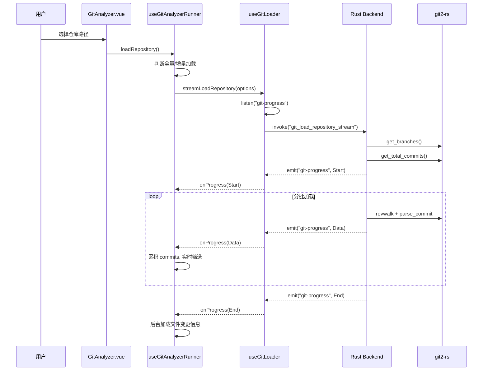

# Git Analyzer: 架构与开发者指南

本文档旨在解析 Git Analyzer 工具的内部架构、设计理念和数据流，为后续开发提供清晰的指引。

## 1. 核心概念

Git Analyzer 是一个高性能的 Git 仓库分析工具，其核心能力由 Rust 后端基于 `git2-rs` 库原生实现，旨在提供一个快速、功能丰富的 Git 数据查询服务。

### 1.1. 原生 `git2-rs` 驱动

与依赖系统 `git` 命令不同，本工具的核心功能完全建立在 `git2-rs` 库之上，这是一个 `libgit2` 的 Rust 绑定。

- **调用方式**: 所有核心 Git 数据查询（如日志遍历、分支获取、差异统计）都通过 `git2-rs` 的原生 API 在 Rust 后端执行。
- **核心优势**:
  - **高性能**: 直接读取 `.git` 目录的对象数据库，避免了启动外部进程的开销，速度极快。
  - **独立性**: 不依赖用户系统中安装的 `git` 版本，保证了行为的一致性。
  - **安全性**: 避免了拼接命令行字符串可能带来的注入风险。
- **混合策略**: 对于少数复杂或涉及工作区修改的操作（如 `cherry-pick`, `revert`），工具会回退到调用系统 `git` 命令，以简化实现。

### 1.2. 后端驱动与流式加载 (Backend-Driven & Streaming)

所有繁重的 Git 数据处理都在 Rust 后端完成，并通过流式事件将数据分批发送到前端。

- **核心原则**:
  - **后端计算**: 前端只负责发送请求和渲染数据，避免在浏览器中处理大规模数据集。
  - **流式响应**: 对于可能返回大量提交记录的请求，后端会通过 `git-progress` 事件分批次发送数据，前端可以即时渲染，极大地改善了大型仓库的加载体验。

## 2. 架构概览

### 2.1. 整体分层

```
┌─────────────────────────────────────────────────────────┐
│  View 层 (UI 展现)                                       │
│  GitAnalyzer.vue + 子组件 (ControlPanel, ListView, ...)   │
│ ├─────────────────────────────────────────────────────────┤
│ │  Action 层 (Agent 接口)                                  │
│ │  actions.ts (为 LLM 提供原子化查询能力)                   │
│ ├─────────────────────────────────────────────────────────┤
│ │  Logic / Composable 层 (业务逻辑)                         │
│ │  ┌──────────────────┐  ┌──────────────────┐             │
│ │  │ useGitAnalyzer   │  │ useGitAnalyzer   │             │
│ │  │ State (单例状态) │←─│ Runner (业务编排)│             │
│ │  └──────────────────┘  └────────┬─────────┘             │
│ │                                 │                        │
│ │  ┌──────────────┐  ┌───────────┴──────────┐             │
│ │  │ useGitLoader │  │ useGitProcessor      │             │
│ │  │ (数据获取)   │  │ (筛选/过滤/统计)     │             │
│ │  └──────┬───────┘  └────────────┬─────────┘             │
│ │         │                       │                        │
│ │  ┌──────┴───────┐  ┌────────────┴─────────┐             │
│ │  │ useCommit    │  │ useReportGenerator   │             │
│ │  │ Cache (缓存) │  │ (报告生成)           │             │
│ │  └──────────────┘  └────────────┬─────────┘             │
│ ├─────────────────────────────────┼───────────────────────┤
│ │  Formatter / Utils 层 (数据加工) │                       │
│ │  formatters.ts (积木式格式化)    │                       │
│ │  htmlGenerator.ts (HTML 渲染)    │                       │
│ ├─────────────────────────────────┴───────────────────────┤
│ │  Tauri IPC (invoke + event listener)                     │
│ ├─────────────────────────────────────────────────────────┤
│ │  Rust Backend (git_analyzer.rs)                          │
│ │  git2-rs / libgit2                                       │
│ └─────────────────────────────────────────────────────────┘
```

### 2.2. 前端模块职责

| 模块                | 文件                      | 职责                                                                          |
| ------------------- | ------------------------- | ----------------------------------------------------------------------------- |
| **Actions**         | `actions.ts`              | **Agent 调用入口**，提供原子化的仓库分析、作者查询、详情获取等 API            |
| **Formatters**      | `formatters.ts`           | **积木式格式化器**，统一 Agent 和手动导出的文本生成逻辑，包含统计计算         |
| **State**           | `useGitAnalyzerState.ts`  | 单例状态管理，所有共享状态（commits、filters、progress 等）定义在模块级别     |
| **Runner**          | `useGitAnalyzerRunner.ts` | 业务编排器，协调目录选择、分支加载、仓库加载（全量/增量）、筛选、文件信息获取 |
| **Loader**          | `useGitLoader.ts`         | 数据获取层，封装 Tauri invoke 调用和 `git-progress` 事件监听                  |
| **Processor**       | `useGitProcessor.ts`      | 纯函数，负责提交记录的筛选和过滤（关键词、作者、日期、类型）                  |
| **CommitCache**     | `useCommitCache.ts`       | 提交缓存服务，缓存带文件变更信息的提交数据，避免重复请求                      |
| **CommitDetail**    | `useCommitDetail.ts`      | 提交详情查看逻辑                                                              |
| **Charts**          | `useCharts.ts`            | 图表数据计算与配置                                                            |
| **ReportGenerator** | `useReportGenerator.ts`   | 导出报告生成，协调 `formatters` 和 `htmlGenerator`                            |

### 2.3. 后端命令

| 命令                          | 实现方式  | 说明                                    |
| ----------------------------- | --------- | --------------------------------------- |
| `git_load_repository_stream`  | git2-rs   | 流式全量加载，支持 `include_files` 参数 |
| `git_load_incremental_stream` | git2-rs   | 流式增量加载，支持 skip/limit           |
| `git_get_branches`            | git2-rs   | 获取分支列表                            |
| `git_get_branch_commits`      | git2-rs   | 获取指定分支的提交                      |
| `git_get_commit_detail`       | git2-rs   | 获取单个提交详情（含文件变更）          |
| `git_load_commits_with_files` | git2-rs   | 批量加载带文件变更信息的提交            |
| `git_cancel_load`             | -         | 通过 CancellationToken 终止流式加载     |
| `git_update_commit_message`   | git (CLI) | 修改最近一次提交消息（amend）           |
| `git_cherry_pick`             | git (CLI) | Cherry-pick 操作                        |
| `git_revert`                  | git (CLI) | Revert 操作                             |
| `git_format_log`              | git (CLI) | 自定义格式化日志输出                    |

## 3. 数据流

### 3.1. 流式加载仓库



### 3.2. 文件变更信息加载策略

文件变更信息的获取有两条路径，由 `includeFiles` 状态控制：

1. **流式携带（`includeFiles = true`）**: 在流式加载时，后端直接为每个 commit 解析文件变更信息（`parse_commit_optimized` 的 `include_files` 参数）。数据随 `git-progress` 事件一并到达前端，Runner 在 `data` 事件中直接存入 `commitCache`。加载完成后无需额外请求。
2. **后台补充（`includeFiles = false`，默认）**: 流式加载不携带文件信息以保证速度。加载完成后，Runner 自动调用 `loadCommitsWithFiles()` 通过 `git_load_commits_with_files` 命令一次性获取所有提交的文件变更，存入 `commitCache`。

导出模块（`ExportModule`）通过 `commitCache` 读取文件数据，并监听 `loadingFiles` 状态来自动刷新预览。

### 3.3. 增量加载判断

Runner 在 `loadRepository()` 中自动判断是否可以增量加载：

- **条件**: 同一仓库 + 同一分支 + 新 limit > 已加载数量（或新 limit 为 0 表示全部加载）
- **行为**: 使用 `streamIncrementalLoad` 从已加载位置（skip）开始继续加载，新数据追加到现有列表
- **否则**: 执行全量加载，清空现有数据重新开始

## 4. 核心逻辑

### 4.1. 多维度分析

- **仓库概览 (`git_load_repository_stream`)**: 流式获取分支和提交记录。
- **提交详情 (`git_get_commit_detail`)**: 获取单个提交的完整信息，包括文件变更和统计。
- **增量加载 (`git_load_incremental_stream`)**: 支持按需加载更多提交。

### 4.2. 启发式分支推断

通过 `get_commit_branches_optimized` 函数中的启发式规则，智能推断一个提交最可能隶属于哪个功能分支。优先级：功能分支 > 本地分支 > 远程分支 > 主干分支。

### 4.3. 原生差异统计

直接使用 `git2-rs` 的 `diff_tree_to_tree` API 计算每次提交的文件和代码行数变更，性能远高于解析命令行输出。

### 4.4. 筛选与过滤

`useGitProcessor` 提供纯函数式的筛选能力，支持：关键词搜索、作者过滤、日期范围、提交类型（feat/fix/chore 等）、正序/倒序。筛选在前端实时执行，不需要重新请求后端。

### 4.5. 导出报告与格式化

- **积木式格式化 (`formatters.ts`)**: 报告生成不再是面条代码，而是通过原子化的格式化函数（如 `commitItem`, `statistics`）拼装而成。这保证了 Agent 在对话中输出的内容与用户手动导出的报告在格式上高度一致。
- **多格式支持**: `useReportGenerator` 协调 `formatters` 生成文本内容，或调用 `htmlGenerator` 生成带样式的 HTML 报告。支持 Markdown / JSON / CSV / HTML / Text。

## 5. 未来展望

- **性能优化**: 针对超大型仓库（>100万次提交），可以进一步优化 `revwalk` 的遍历策略。
- **高级功能**: 探索使用 `git2-rs` 实现更高级的功能，如交互式 rebase、blame 等。
- **错误处理**: 完善 `git` 命令调用失败时的错误信息，为用户提供更清晰的修复指引。
