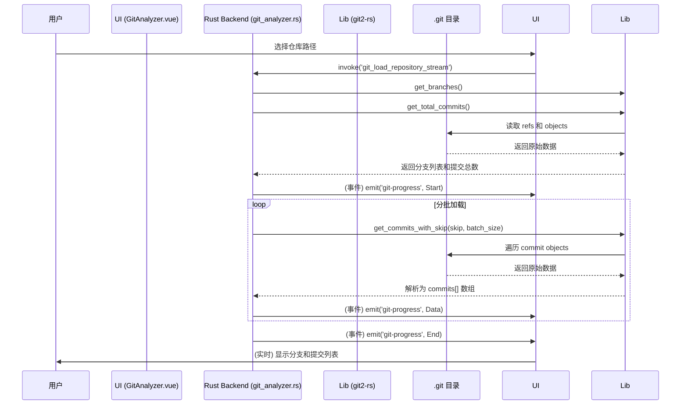

# Git Analyzer: 架构与开发者指南

本文档旨在解析 Git Analyzer 工具的内部架构、设计理念和数据流，为后续开发提供清晰的指引。

## 1. 核心概念

Git Analyzer 是一个高性能的 Git 仓库分析工具，其核心能力由 Rust 后端基于 `git2-rs` 库原生实现，旨在提供一个快速、功能丰富的 Git 数据查询服务。

### 1.1. 原生 `git2-rs` 驱动

与依赖系统 `git` 命令不同，本工具的核心功能完全建立在 `git2-rs` 库之上，这是一个 `libgit2` 的 Rust 绑定。

- **调用方式**: 所有核心 Git 数据查询（如日志遍历、分支获取、差异统计）都通过 `git2-rs` 的原生 API 在 Rust 后端执行。
- **核心优势**:
  - **高性能**: 直接读取 `.git` 目录的对象数据库，避免了启动外部进程的开销，速度极快。
  - **独立性**: 不依赖用户系统中安装的 `git` 版本，保证了行为的一致性。
  - **安全性**: 避免了拼接命令行字符串可能带来的注入风险。
- **混合策略**: 对于少数复杂或涉及工作区修改的操作（如 `cherry-pick`, `revert`），工具会回退到调用系统 `git` 命令，以简化实现。

### 1.2. 后端驱动与流式加载 (Backend-Driven & Streaming)

所有繁重的 Git 数据处理都在 Rust 后端完成，并通过流式事件将数据分批发送到前端。

- **核心原则**:
  - **后端计算**: 前端只负责发送请求和渲染数据，避免在浏览器中处理大规模数据集。
  - **流式响应**: 对于可能返回大量提交记录的请求，后端会通过 `git-progress` 事件分批次发送数据，前端可以即时渲染，极大地改善了大型仓库的加载体验。

## 2. 架构概览

- **View (`GitAnalyzer.vue`)**: 负责 UI 渲染和用户交互，调用 Tauri 命令并监听后端的进度事件。
- **Engine (Rust Backend)**: 封装在 `git_analyzer.rs` 中，提供一系列 Tauri 命令，负责执行所有 Git 操作并返回结构化数据。
- **Library (`git2-rs`)**: 底层的原生 Git 功能实现。

## 3. 数据流：流式分析一个仓库

## 4. 核心逻辑

- **多维度分析**: 后端服务提供了多种查询命令：
  - **仓库概览 (`git_load_repository_stream`)**: 流式获取分支和提交记录。
  - **提交详情 (`git_get_commit_detail`)**: 获取单个提交的完整信息，包括文件变更和统计。
  - **增量加载 (`git_load_incremental_stream`)**: 支持无限滚动，按需加载更多提交。
- **启发式分支推断**: 通过 `get_commit_branches` 函数中的启发式规则，智能推断一个提交最可能隶属于哪个功能分支。
- **原生差异统计**: 直接使用 `git2-rs` 的 `diff_tree_to_tree` API 计算每次提交的文件和代码行数变更，性能远高于解析命令行输出。

## 5. 未来展望

- **性能优化**: 针对超大型仓库（>100万次提交），可以进一步优化 `revwalk` 的遍历策略。
- **高级功能**: 探索使用 `git2-rs` 实现更高级的功能，如交互式 rebase、blame 等。
- **错误处理**: 完善 `git` 命令调用失败时的错误信息，为用户提供更清晰的修复指引。
