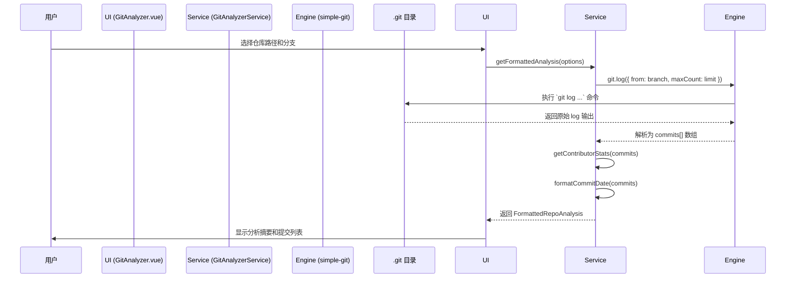

# Git Analyzer: 架构与开发者指南

本文档旨在解析 Git Analyzer 工具的内部架构、设计理念和数据流，为后续开发提供清晰的指引。

## 1. 核心概念

Git Analyzer 是一个 Git 仓库分析工具，旨在通过 `simple-git` 库提供一个轻量级、无状态的 Git 数据查询服务。

### 1.1. `simple-git` 驱动

工具的核心功能完全建立在 `simple-git` 库之上，它为执行 Git 命令提供了一个简洁、异步的 JavaScript 接口。

- **调用方式**: 所有 Git 操作（如 `git.log()`, `git.branchLocal()`）都通过 `simple-git` 实例执行。
- **核心优势**:
  - **抽象化**: 屏蔽了直接与 `git` 命令行工具交互的复杂性。
  - **安全性**: `simple-git` 提供了对参数的适当处理，减少了命令注入的风险。
  - **跨平台**: 在不同操作系统上提供一致的 API 体验。

### 1.2. 无状态服务层 (Stateless Service Layer)

`GitAnalyzerService` 被设计为一个完全无状态的服务。它不持有任何仓库数据，每次调用都会根据传入的路径和参数即时查询。

- **核心原则**:
  - **输入/输出**: 每个方法都接收完整的上下文（如 `repoPath`, `branch`），并返回处理后的结果。
  - **可预测性**: 同样的输入总是产生同样的输出，没有副作用。
  - **易于集成**: 其他工具可以轻松地调用服务方法，而无需关心其内部状态。

## 2. 架构概览

- **View (`GitAnalyzer.vue`)**: 负责 UI 渲染和用户交互，包括仓库路径选择、参数配置和结果展示。
- **Service (`GitAnalyzerService`)**: 提供高级、无状态的 API（如 `getFormattedAnalysis`, `getAuthorCommits`），封装了所有 `simple-git` 调用和数据处理逻辑。
- **Engine (`simple-git`)**: 底层的 Git 命令执行引擎。

## 3. 数据流：分析一个仓库

## 4. 核心逻辑

- **多维度分析**: 服务层提供了多种查询方法：
  - **仓库概览 (`getFormattedAnalysis`)**: 提供提交数、贡献者、时间跨度等宏观统计。
  - **作者查询 (`getAuthorCommits`)**: 查找特定作者的所有提交。
  - **提交详情 (`getCommitDetail`)**: 获取单个提交的完整信息（包括文件变更）。
- **贡献者统计**: 通过遍历提交记录，在内存中计算每个作者的提交数并进行排序。
- **灵活的日期格式化**: 支持将 Git 的 ISO 日期格式化为本地化时间、相对时间（如 "3天前"）或时间戳。

## 5. 未来展望

- **性能优化**: 针对超大型仓库（>10万次提交），考虑优化日志拉取策略，如分批获取。
- **新增统计维度**: 增加更丰富的分析维度，如提交活跃时间段分析、文件变更热力图等。
