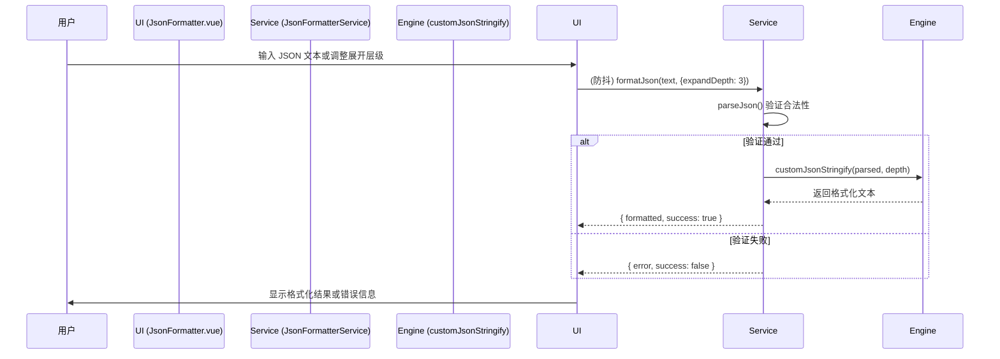

# JSON Formatter: 架构与开发者指南

本文档旨在解析 JSON Formatter 工具的内部架构、设计理念和数据流，为后续开发提供清晰的指引。

## 1. 核心概念

JSON Formatter 是一个简洁、高效的 JSON 格式化与验证工具，旨在提供比标准 `JSON.stringify` 更强大的可读性控制。

### 1.1. 可控展开层级 (Controllable Expansion Depth)

这是本工具的核心特性，它允许用户在信息密度和可读性之间找到最佳平衡点。

- **实现方式**: 通过一个自定义的递归序列化器 `customJsonStringify` 实现。
- **算法逻辑**:
  - 递归遍历 JSON 对象，同时维护一个 `currentDepth` 计数器。
  - 当 `currentDepth` 达到用户设定的 `expandDepth` 阈值时，该层级及其所有子节点将使用原生 `JSON.stringify` 进行 **紧凑格式** 输出。
  - 否则，手动构建带缩进和换行的 **展开格式** 输出。
- **核心优势**:
  - **避免信息过载**: 对于层级很深的复杂 JSON，可以只展开顶部的几层，避免满屏的括号。
  - **聚焦关键信息**: 帮助用户快速查看对象的主要结构，同时隐藏深层细节。

## 2. 架构概览

采用经典的 **UI 与服务分离**的设计模式。

- **View (`JsonFormatter.vue`)**: 负责 UI 渲染和用户交互，包括代码输入、参数配置（展开层级、缩进大小）和结果展示。
- **Service (`JsonFormatterService`)**: 封装了所有核心业务逻辑，提供 `parseJson` 和 `formatJson` 等纯函数 API。
- **Engine (`customJsonStringify`)**: 自定义的、可控制展开层级的 JSON 序列化算法。

## 3. 数据流：格式化一段 JSON

## 4. 核心逻辑

- **实时格式化**: 通过 `watch` 和 `debounce` (300ms) 实现，当用户输入或修改配置时，自动触发格式化，提供流畅的实时预览体验。
- **文件集成**: 支持拖拽 `.json` 和 `.txt` 文件，并能自动读取内容进行格式化。
- **错误处理**: 对无效的 JSON 格式进行 `try...catch`，在 UI 上显示友好的错误提示，而不是让程序崩溃。
- **服务注册**: `JsonFormatterService` 被注册为全局服务，允许其他工具（如 API Tester）直接调用其格式化能力。

## 5. 未来展望

- **新增格式化选项**: 增加更多格式化选项，如 `sortKeys`（按键排序）。
- **支持更多格式**: 扩展解析器以支持 `.jsonc` (带注释) 和 `.json5` 等更宽松的 JSON 变种。
