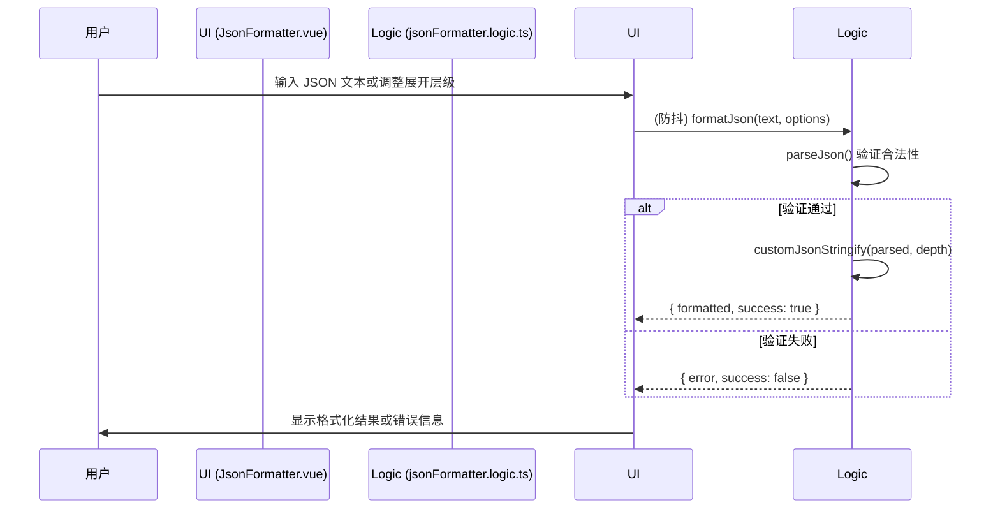
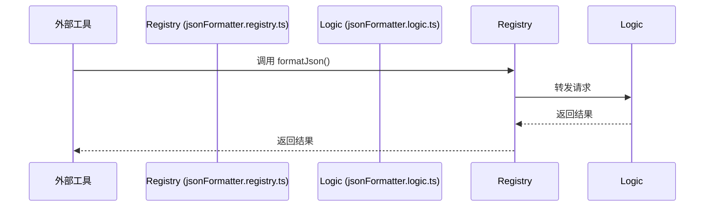

# JSON Formatter: 架构与开发者指南

本文档旨在解析 JSON Formatter 工具的内部架构、设计理念和数据流，为后续开发提供清晰的指引。

## 1. 核心概念

JSON Formatter 是一个简洁、高效的 JSON 格式化与验证工具，旨在提供比标准 `JSON.stringify` 更强大的可读性控制。

### 1.1. 可控展开层级 (Controllable Expansion Depth)

这是本工具的核心特性，它允许用户在信息密度和可读性之间找到最佳平衡点。

- **实现方式**: 通过 `jsonFormatter.logic.ts` 中的递归序列化器 `customJsonStringify` 实现。
- **算法逻辑**:
  - 递归遍历 JSON 对象，同时维护一个 `currentDepth` 计数器。
  - 当 `currentDepth` 达到用户设定的 `expandDepth` 阈值时，该层级及其所有子节点将使用原生 `JSON.stringify` 进行 **紧凑格式** 输出。
  - 否则，手动构建带缩进和换行的 **展开格式** 输出。
- **核心优势**:
  - **避免信息过载**: 对于层级很深的复杂 JSON，可以只展开顶部的几层，避免满屏的括号。
  - **聚焦关键信息**: 帮助用户快速查看对象的主要结构，同时隐藏深层细节。

## 2. 架构概览

采用 **逻辑与展现分离，接口与实现解耦** 的设计模式。

- **View (`JsonFormatter.vue`)**: 负责 UI 渲染和用户交互。它直接调用 `Logic` 模块的纯函数，不依赖插件系统的注册实例。
- **Logic (`jsonFormatter.logic.ts`)**: **核心逻辑层**。封装了 JSON 解析、格式化算法（Engine）和文件读取等所有业务逻辑。
- **Registry (`jsonFormatter.registry.ts`)**: **对外门面 (Facade)**。作为 AIO Hub 插件系统的注册接口，它仅持有一个轻量级的类，将请求转发给 `Logic` 模块，供其他插件或系统核心调用。

## 3. 数据流

### 3.1. 内部交互 (UI 驱动)

### 3.2. 外部集成 (插件系统)

## 4. 核心特性实现

- **实时格式化**: 通过 `debounce` (300ms) 包装逻辑调用，当用户输入或修改配置时触发，平衡性能与响应速度。
- **文件集成**: `Logic` 模块提供 `readFile` 异步方法，支持拖拽 `.json` 和 `.txt` 文件。
- **错误处理**: 统一使用项目规范的 `errorHandler`。在 `Logic` 层捕获解析异常并返回结构化的错误信息，由 `UI` 层负责展示。
- **解耦设计**: `JsonFormatter.vue` 与插件系统完全解耦，即使在没有注册器的情况下也能独立运行或进行单元测试。

## 5. 未来展望

- **新增格式化选项**: 增加更多格式化选项，如 `sortKeys`（按键排序）。
- **支持更多格式**: 扩展解析器以支持 `.jsonc` (带注释) 和 `.json5` 等更宽松的 JSON 变种。
