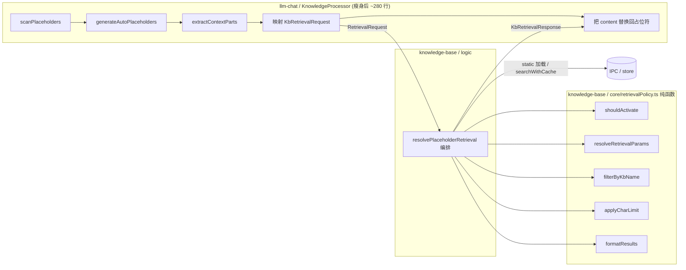

# 检索核心下沉计划：将 RAG 占位符检索逻辑从 llm-chat 迁入知识库

> 状态：Draft
> 范围：`llm-chat` 的 [`knowledge-processor.ts`](../../../llm-chat/core/context-processors/knowledge-processor.ts) 瘦身 + `knowledge-base` 新增可测试检索核心
> 目标读者：后续实施（code 模式）、单元测试与 UI 检索工作台开发者

## 1. 背景与动机

当前 RAG 被动召回的全部逻辑都堆在 chat 侧的 [`KnowledgeProcessor`](../../../llm-chat/core/context-processors/knowledge-processor.ts:98)（649 行），混合了四类抽象层级完全不同的职责：

| 职责类别          | 代表代码                                                                                                                                                                                                                                                                      | 是否该留 chat  |
| ----------------- | ----------------------------------------------------------------------------------------------------------------------------------------------------------------------------------------------------------------------------------------------------------------------------- | -------------- |
| 占位符语法解析    | [`KBPlaceholder`](../../../llm-chat/core/context-processors/knowledge-processor.ts:18)、[`parseKBParams()`](../../../llm-chat/core/context-processors/knowledge-processor.ts:53)、[`scanPlaceholders()`](../../../llm-chat/core/context-processors/knowledge-processor.ts:78) | ✅ 留 chat     |
| 查询文本提取      | [`extractContextParts()`](../../../llm-chat/core/context-processors/knowledge-processor.ts:404)                                                                                                                                                                               | ✅ 留 chat     |
| 消息装配/自动注入 | [`generateAutoPlaceholders()`](../../../llm-chat/core/context-processors/knowledge-processor.ts:467)                                                                                                                                                                          | ✅ 留 chat     |
| **检索策略**      | `shouldActivate` / `handleStaticMode` / `handleStaticAll` / kbIds 解析 / 参数 fallback / kbName 过滤 / 字数截断 / `formatResults`                                                                                                                                             | ❌ **下沉 kb** |

存在两个核心问题：

1. **封装破坏**：[`api.ts`](../../services/api.ts:4) 开头声明自己是知识库唯一访问入口、消费方禁止直接导入内部 store。但当前 [`handleStaticAll()`](../../../llm-chat/core/context-processors/knowledge-processor.ts:333) 直接 `import { useKnowledgeBaseStore }` 读 `kbStore.bases`，是跨模块违规访问。
2. **检索逻辑不可测**：激活判断、字数截断、结果格式化这些纯逻辑与消息树操作耦合在一个 Vue 上下文里，无法独立单测，也无法被未来的「UI 检索工作台」复用。

## 2. 目标

- **职责归位**：chat 只保留「占位符扫描 + 查询提取 + 消息装配」，检索策略全部迁入知识库。
- **可测试核心**：把检索策略拆成 `core/` 纯函数（无 IO，直接单测）+ `logic/` 编排（组合纯函数与 IPC/store）。
- **门面收口**：chat 通过 [`api.ts`](../../services/api.ts) 暴露的单一门面调用，传入完全中立的请求对象，不让知识库反向依赖 chat 类型。
- **为未来铺路**：UI 检索工作台可直接复用 `core/` 纯函数 + `logic/` 编排器做交互式调参与可视化。

## 3. 目标架构



分层落点：

- `core/retrievalPolicy.ts`（新增，纯函数）：激活判断、参数 fallback 解析、kbName 过滤、字数截断、结果格式化。零 IO、零 store 依赖，入参纯数据，可直接 `bun test`。
- `logic/placeholderRetrieval.ts`（新增，编排）：`resolvePlaceholderRetrieval()` 串联纯函数 + static 加载（合法读取本模块 store/storage）+ `searchWithCache` 向量检索。
- `services/api.ts`（修改）：重新导出 `resolvePlaceholderRetrieval` 作为对外门面。
- `types/`（新增）：`KbRetrievalRequest` / `KbRetrievalResponse` 中立请求响应类型。

## 4. 接口契约

请求对象完全中立——只含原始数字/字符串/纯文本数组，不引用 chat 的 `ProcessableMessage`、`ChatAgent`：

```typescript
// knowledge-base/types/retrieval.ts (新增)
export interface KbRetrievalRequest {
  // —— 占位符参数（chat 从 KBPlaceholder 映射）——
  kbName?: string;
  limit?: number;
  minScore?: number;
  mode: "always" | "gate" | "turn" | "static";
  modeParams?: string[];
  engineId?: string;

  // —— 查询文本（chat 从消息树提取）——
  userText: string;
  aiText: string;

  // —— 激活判断所需的中立上下文 ——
  turnCount: number; // 用户消息轮次（turn 模式）
  recentMessageTexts: string[]; // 最近消息纯文本（gate 模式扫描，保留含预设的原语义）

  // —— 检索配置（chat 从 knowledgeSettings 映射）——
  settings: {
    defaultEngineId?: string;
    defaultLimit?: number;
    defaultMinScore?: number;
    maxRecallChars?: number;
    enableCache?: boolean;
    gateScanDepth?: number;
    resultTemplate?: string;
    emptyText?: string;
  };

  // —— Agent 绑定的已启用知识库（chat 从 bindings 映射）——
  enabledBindings: Array<{ kbId: string; kbName: string }>;
}

export interface KbRetrievalResponse {
  activated: boolean; // false → chat 直接删除占位符
  content: string; // 已格式化好的注入文本（未激活时为空串）
  resultCount: number; // 供 chat 写日志
}
```

门面签名：

```typescript
// knowledge-base/services/api.ts (新增导出)
export async function resolvePlaceholderRetrieval(
  req: KbRetrievalRequest
): Promise<KbRetrievalResponse>;
```

设计要点：

- **激活逻辑等价迁移**：`turn` 仍是 `turnCount % interval === 0`；`gate` 仍扫描 `recentMessageTexts.slice(-gateScanDepth)` 是否命中关键词。语义不变，只是判断所需上下文由 chat 提取后传入。
- **static 合法化**：下沉后 `handleStaticMode`/`handleStaticAll` 在知识库模块内，直接用 store/storage 不再违规。
- **kbIds 解析归位**：从 `enabledBindings` + `kbName` 解析目标 kbId 列表的逻辑移入 `core/retrievalPolicy.ts` 的 `resolveRetrievalParams`。
