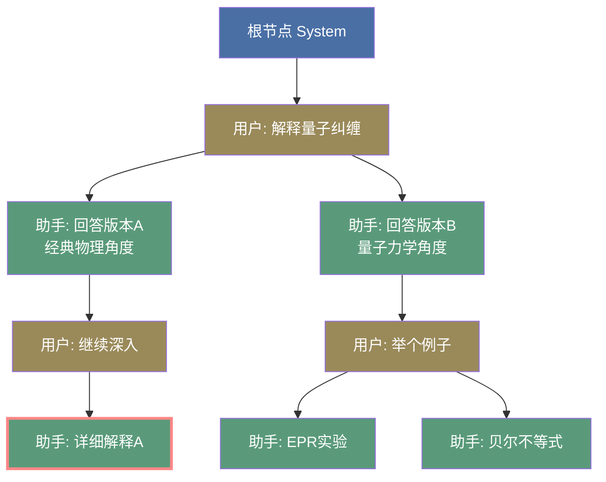
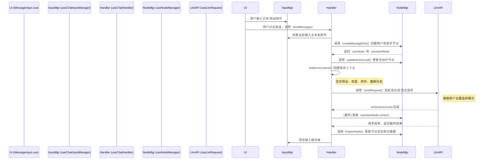

# LLM Chat: 架构与开发者指南 (v2)

本文档旨在深入解析 `llm-chat` 工具的内部架构、设计理念和数据流，为后续的开发和维护提供清晰的指引。

## 1. 核心概念

`llm-chat` 的核心设计围绕多个关键概念构建，这些概念共同实现了一个功能强大且可扩展的对话系统。

### 1.1. 树状对话历史 (Tree-based Conversation History)

与传统的线性对话列表不同，本模块的对话历史是一个**树形结构**。

- **基本单位**: 每一条消息都是一个 `ChatMessageNode` 对象。
- **树形关系**: 每个节点通过 `parentId` 和 `childrenIds` 属性建立父子关系。
- **核心优势**:
  - **非破坏性操作**: 重新生成 (Regenerate) 或编辑 (Edit) 不会覆盖旧消息，而是会创建新的兄弟节点或子节点，形成新的**分支 (Branch)**。
  - **多路径探索**: 用户可以轻松地在不同的对话分支之间切换，探索和比较模型的不同回答。
  - **完整的上下文追溯**: 保证了任何对话路径的上下文都是完整且可追溯的。
- **分支记忆**: 系统会通过 `lastSelectedChildId` 属性记住用户在每个父节点上的最后选择，当返回父分支时，会自动导航到用户上次查看的路径，优化了复杂分支场景下的导航体验。



**图解**:

- 蓝色节点是**根节点 (System)**，黄褐色节点是**用户消息**，绿色节点是**助手回答**。
- 从 `U1` 出发有两个分支（`A1a` 和 `A1b`），这是对同一个问题的两种不同回答。
- 红色边框的 `A2a` 是当前 **activeLeafId**，表示用户正在查看这条对话路径。
- 切换分支只需要将 `activeLeafId` 改为其他叶节点（如 `A2b1` 或 `A2b2`），UI 就会展示不同的对话历史。

### 1.2. 会话 (ChatSession)

`ChatSession` 是一个独立的对话容器，它封装了一棵完整的消息树和相关元数据。

- **`nodes`**: 一个以 `nodeId` 为键的字典，存储了该会话中所有的 `ChatMessageNode`。
- **`rootNodeId`**: 树的根节点 ID。
- **`activeLeafId`**: **极其重要的属性**。它指向当前对话分支的**叶子节点**，决定了UI上显示哪一条对话路径。
- **话题命名**: 支持基于 LLM 的自动或手动为会话生成标题，便于用户识别和管理。

### 1.3. 智能体 (ChatAgent)

`ChatAgent` 是一个可复用的、封装了特定配置的"对话角色"。它更像一个**配置预设**，而非一个独立的实体。

- **配置集合**: 它整合了 LLM Profile (API密钥等)、模型ID、预设消息串和模型参数。
- **与会话解耦**: 会话与智能体是松散耦合的。一个会话在创建时会关联一个智能体，但用户可以随时通过全局模型选择器更换模型。每条助手消息的元数据 (`metadata`) 中会记录生成它时所使用的智能体信息。
- **用户档案绑定**: 智能体可以绑定特定的用户档案 (`userProfileId`)，用于在上下文中插入用户身份信息。

### 1.4. 用户档案 (UserProfile)

用户档案是一个可复用的用户身份描述，用于在对话中插入用户的背景信息、角色设定等。

- **核心概念**: 包含用户的描述性文本，在构建 LLM 上下文时会被插入到对话中。
- **全局与智能体级别**: 既可以设置全局默认档案，也可以在智能体中绑定特定档案（优先级更高）。
- **灵活插入**: 通过预设消息中的 `user_profile` 占位符，可以精确控制档案内容的插入位置。

### 1.5. 附件系统 (Attachments)

附件系统允许用户在消息中添加文件，实现多模态对话。

- **基于 Asset 管理**: 使用统一的 Asset 管理系统进行文件存储和去重。
- **智能文件检测**: 除了扩展名，还使用文件魔数 (magic number) 进行内容检测，能更准确地识别文件类型。
- **多类型支持**:
  - **图片**: 支持多图预览切换。
  - **视频**: 支持视频文件预览。
  - **文本**: 纯文本文件会直接读取内容，而非转为 base64，提高效率。
  - **其他**: 对非预览类型的文件，采用紧凑的长条布局显示。
- **响应式布局**: 附件列表采用响应式网格布局，适配不同尺寸。

### 1.6. 全局输入管理 (Global Input Management)

- **`useChatInputManager`**: 这是一个全局单例 Composable，统一管理聊天输入框的状态（文本和附件）。
- **跨窗口同步**: 确保主窗口和分离窗口的输入内容实时同步。
- **草稿持久化**: 未发送的输入内容（包括附件）会自动保存到 `localStorage`，在应用重启后可以恢复，防止意外丢失。
- **外观服务**: 通过 `llmChat.service.ts` 提供一个轻量级的外观，为其他工具（如 Agent）提供一个稳定的编程接口来与输入框交互。

### 1.7. 上下文管理与截断 (Context Management)

- **显式控制**: 用户可以在智能体参数中精细配置上下文管理策略。
- **Token 限制**: 可设置上下文最大 Token 数。
- **智能截断**: 当上下文超出限制时，系统会从最新的消息开始，保留尽可能多的对话历史，并对被截断的旧消息保留部分字符作为摘要。
- **实时预览**: UI 会实时显示当前上下文的 Token 统计信息和使用率。

### 1.8. 高性能UI (Performant UI)

- **虚拟滚动**: 消息列表采用 `@tanstack/vue-virtual` 实现虚拟滚动，即使在有数千条消息的会话中也能保持流畅的滚动性能。
- **消息导航器**: 配备了消息导航器 (`MessageNavigator`)，提供滚动进度、消息计数、快速跳转（到顶部/底部）和新消息提示功能。

### 1.9. 上下文分析器 (Context Analyzer)

上下文分析器是一个强大的调试和优化工具，用于可视化和分析任意消息节点的完整 LLM 请求上下文。

- **核心功能**:
  - **完整上下文预览**: 重建指定消息节点实际发送给 LLM 时的完整请求上下文，包括预设消息、用户档案、对话历史和附件内容。
  - **智能体推断**: 自动从消息节点的元数据推断该消息使用的智能体配置，确保预览的上下文与实际发送时完全一致。
  - **多维度展示**: 提供三种视图模式，从不同角度理解上下文结构。

- **三大视图**:
  - **结构化视图 (`StructuredView`)**: 以结构化的方式展示消息列表，清晰呈现角色、内容和附件信息，便于理解对话流程。
  - **原始请求视图 (`RawRequestView`)**: 显示发送给 LLM API 的原始 JSON 请求体，用于调试和验证 API 调用格式。
  - **内容分析视图 (`AnalysisChartView`)**: 提供可视化的统计信息，包括：
    - 消息数量统计（按角色分类）
    - Token 使用量分析
    - 字符数统计
    - 附件类型分布

- **使用场景**:
  - 调试上下文截断问题
  - 优化 Token 使用效率
  - 验证预设消息和档案是否正确注入
  - 检查附件转换结果
  - 分析不同智能体配置的实际效果
  - 排查消息后处理规则的应用结果

- **技术实现**:
  - 通过 `useChatHandler.getLlmContextForPreview()` 获取预览数据
  - 返回 `ContextPreviewData` 类型，包含完整的消息列表和统计信息
  - 支持异步加载，带有友好的加载状态和错误提示

### 1.10. 宏系统 (Macro System)

宏系统是一个强大的动态内容生成引擎，它允许在智能体的预设消息、用户输入等任何地方嵌入可执行的占位符（如 `{{time}}` 或 `{{getvar::my_var}}`），在发送给 LLM 前将其动态解析和替换。

- **核心目的**: 实现动态提示词 (Dynamic Prompting)，减少模板重复，并为提示词注入简单的逻辑和状态。
- **统一语法**: 所有宏都遵循 `{{macro_name::arg1::arg2}}` 的格式，无参数宏则为 `{{macro_name}}`。
- **上下文驱动**: 宏的执行严重依赖于一个丰富的 `MacroContext` 对象，该对象提供了对当前会话、智能体、用户、变量等所有信息的访问。

### 1.11. 对话树图视图 (Conversation Tree Graph View)

对话树图视图是一个高度交互的可视化工具，旨在将对话的非线性树状结构直观地呈现给用户。它允许用户自由探索、导航和编辑复杂的对话分支。

```mermaid
graph TD
    subgraph "视图层 (View)"
        A[FlowTreeGraph.vue]
    end
    subgraph "逻辑层 (Logic)"
        B[useFlowTreeGraph.ts]
    end
    subgraph "渲染引擎 (Rendering)"
        C[@vue-flow/core]
    end
    subgraph "布局引擎 (Layout)"
        D[d3-force & d3-hierarchy]
    end

    A -- "调用 (Calls)" --> B
    B -- "准备节点/边 (Prepares Nodes/Edges)" --> C
    B -- "运行模拟 (Runs Simulation)" --> D
    D -- "计算位置 (Calculates Positions)" --> B
    C -- "渲染 (Renders)" --> A

    style A fill:#89a,color:#fff
    style B fill:#a89,color:#fff
    style C fill:#9a8,color:#fff
    style D fill:#99a,color:#fff
```

- **核心技术**: 采用 `Vue Flow` 进行前端渲染，后端则利用 `D3.js` (`d3-force` 和 `d3-hierarchy`) 作为布局引擎。这种混合方法结合了 Vue 的响应式能力和 D3 强大的物理模拟与布局算法。

- **双布局模式 (Dual Layout Modes)**:
  - **树状布局 (`tree`)**: 默认模式。使用 `d3-hierarchy` 生成一个确定性的、自上而下的树状结构。此模式布局稳定、清晰，适合概览整个对话结构。
  - **力导向布局 (`physics`)**: 动态模式。使用 `d3-force` 进行物理模拟，节点之间存在斥力，连线则像弹簧一样。此模式下，整个对话树像一个悬挂的风铃，根节点是锚点，分支会自然垂下。这种模式更生动，有助于感知分支的“重量”和分布。

- **核心逻辑 (`useFlowTreeGraph.ts`)**:
  - **数据转换**: 将 `ChatSession` 中的 `ChatMessageNode` 转换为 `Vue Flow` 需要的 `FlowNode`（节点）和 `FlowEdge`（边）。在转换过程中，会进行大量数据增强，例如：
    - 根据节点角色、激活状态、启用状态动态计算颜色。
    - 解析元数据，为节点添加头像、模型信息等副标题。
    - 截断长文本以生成内容预览。
  - **D3 模拟**: 在后台运行一个 `forceSimulation` (力模拟) 来持续计算节点位置。`tick` 事件会驱动 Vue 组件的位置更新，从而产生平滑的动画效果。
  - **尺寸感知布局**: 组件能够监听 `Vue Flow` 渲染出的节点的实际 DOM 尺寸，并将此信息反馈给 D3 模拟，D3 会重新“加热”模拟以调整布局，避免节点重叠。

- **丰富的交互功能**:
  - **分支切换**: 双击任意节点可快速将该节点设为 `activeLeafId`，切换到其所在的分支。
  - **拖拽**:
    - **单点拖拽**: 拖动单个节点。在 `physics` 模式下，释放后节点会像皮筋一样弹回。
    - **子树拖拽**: 按住修饰键 (如 `Shift`) 拖动节点，可以移动其整个子树分支。
  - **结构编辑 (嫁接与移动)**: 从一个节点的“输出点”拖拽连线到另一个节点的“输入点”，可以实现：
    - **移动节点**: 默认情况下，将被拖动的节点（连线终点）移动到目标节点（连线起点）下。
    - **嫁接子树**: 按住修饰键操作，则会将整个子树一并嫁接过去。
  - **上下文菜单**: 右键单击节点，可进行“设为当前分支”、“禁用/启用节点”、“剪掉分支”等快捷操作。
  - **详情弹窗**: 点击节点上的详情按钮，可以查看该节点的完整内容渲染和元数据。

- **开发者功能**:
  - **调试模式**: 提供一个 `debugMode`，开启后会在画布上叠加一个 SVG 层，实时可视化 D3 模拟的内部状态，包括节点边界、中心点、速度向量、连线强度等，极大地方便了布局算法的调试。

#### 三阶段执行管道 (Three-Phase Pipeline)

为了确保宏能够按预期的逻辑顺序执行（例如，先设置变量，再使用变量），宏处理器采用了一个确定性的三阶段管道：

1.  **阶段一: 预处理 (`PRE_PROCESS`)**: 此阶段主要处理**状态变更**的宏。例如 `{{setvar::x::10}}` 或 `{{incvar::x}}`。这些宏通常没有文本输出，而是修改 `MacroContext` 中的变量。
2.  **阶段二: 替换 (`SUBSTITUTE`)**: 此阶段处理**静态值**的替换。例如 `{{user}}`、`{{char}}` 或 `{{getvar::x}}`。它们从 `MacroContext` 中读取值并将其替换到文本中。
3.  **阶段三: 后处理 (`POST_PROCESS`)**: 此阶段执行所有剩余的**动态函数**宏。例如 `{{time}}`、`{{date}}` 或 `{{random::1-100}}`。这些宏在最后执行，以确保它们能获取到前两个阶段处理完毕后的最终上下文。

这种设计确保了行为的可预测性，并避免了因执行顺序不确定而导致的逻辑错误。

## 2. 架构概览

本模块遵循关注点分离的原则，将状态、逻辑和视图清晰地分开。

- **State (Pinia Stores & Singletons)**:
  - `useLlmChatStore`: 管理所有会话 (`sessions`)、当前会话ID (`currentSessionId`)。
  - `useAgentStore`: 管理所有可用的智能体 (`agents`)。
  - `useUserProfileStore`: 管理用户档案 (`profiles`)。
  - `useChatInputManager` (Singleton): 全局统一管理输入框的文本和附件状态。
  - `useLlmChatUiState` (Store): 集中管理并持久化UI状态，如参数编辑器的折叠状态。
- **Logic (Composables)**:
  - 位于 `composables/` 目录下，封装了所有核心业务逻辑。这是模块的大脑。
- **View (Vue Components)**:
  - 位于 `components/` 目录下，负责UI渲染和用户交互。`LlmChat.vue` 是主入口。
- **Service (Facade)**:
  - `llmChat.service.ts`: 提供一个轻量级的外观服务，封装内部实现，为外部工具提供稳定的交互接口。

## 3. 数据流：发送一条新消息



## 4. 核心逻辑 (Composables)

### 4.1. 树形对话管理

- **`useNodeManager`**: **树的底层操作者**。提供原子级别的节点操作功能（创建、删除、获取路径等）。
- **`useBranchManager`**: **用户的直接交互层**。基于 `useNodeManager`，提供面向用户操作的高级功能（切换分支、编辑消息、创建分支等）。

### 4.2. 对话处理核心

- **`useChatHandler`**: **对话流程的协调者**。负责处理 `sendMessage` 的完整逻辑，包括构建上下文、调用LLM API、处理响应和更新节点。此外，还提供 `getLlmContextForPreview()` 函数用于上下文分析器，该函数能够：
  - 重建任意消息节点的完整请求上下文
  - 自动从消息元数据推断使用的智能体配置
  - 返回包含消息列表和统计信息的 `ContextPreviewData`

### 4.3. 上下文构建与处理

- **`useChatContextBuilder`**: **上下文构建引擎**。负责从活动路径和智能体配置中构建发送给 LLM 的消息列表，包括：
  - 预设消息处理和占位符替换（`chat_history` 和 `user_profile`）
  - 用户档案内容注入
  - 附件转换为多模态内容
  - 上下文 Token 限制和智能截断
  - 调用后处理管道转换消息格式

- **`useMessageProcessor`**: **消息后处理管道**。实现可扩展的消息处理规则系统，用于在发送给 LLM 前转换消息格式。支持的规则包括：
  - `merge-system-to-head`: 合并所有 system 消息到列表头部
  - `merge-consecutive-roles`: 合并连续相同角色的消息
  - `ensure-alternating-roles`: 确保 user/assistant 角色交替（插入占位符）
  - `convert-system-to-user`: 将 system 角色转换为 user 角色

  **规则来源**：
  - 模型默认规则：在模型元数据中定义 (`defaultPostProcessingRules`)
  - 智能体自定义规则：在智能体参数中配置 (`contextPostProcessing.rules`)
  - 合并策略：智能体规则优先，模型规则作为补充

- **`useChatAssetProcessor`**: **附件处理器**。负责将 Asset 转换为 LLM 可接受的消息内容：
  - 等待资产导入完成
  - 图片转换为 base64
  - 智能文档格式选择（根据模型能力选择 `base64` 或 `openai_file` 格式）
  - 文本文件直接读取内容而非转为 base64
  - 获取文本附件内容用于 Token 计算

### 4.4. 附件与输入管理

- **`useAttachmentManager`**: **附件的完整管理者**。负责附件的添加、移除、验证、去重和状态追踪。
- **`useChatInputManager`**: **全局输入状态管理器**。处理输入框文本和附件的跨窗口同步与持久化。

### 4.5. 会话与工具

- **`useSessionManager`**: **会话的生命周期管理者**。负责会话的创建、加载、删除和持久化。
- **`useTopicNamer`**: **话题命名器**。封装了调用 LLM 为会话生成标题的逻辑。
- **`useModelSelectDialog`**: **全局模型选择器**。提供一个基于 Promise 的异步流程，让用户可以在任何地方触发模型选择。

### 4.6. 宏处理引擎

- **`useMacroProcessor`**: **宏引擎的业务层封装**。这是上层业务（如 `useChatHandler`）与宏系统交互的唯一入口。它负责：
  - 从 `agentStore` 和 `userProfileStore` 等地方收集信息。
  - 构建一个完整的 `MacroContext` 对象，聚合所有需要的数据。
  - 实例化并调用 `MacroProcessor` 来处理文本。
  - 提供了简洁的 `processMacros` 和 `processMacrosBatch` 接口。

- **`MacroProcessor`**: **宏执行的核心引擎**。它不关心上下文的来源，只负责接收文本和 `MacroContext`，然后执行：
  - 通过 `{{...}}` 正则表达式解析宏。
  - 按顺序执行三阶段处理管道。
  - 在每个阶段，从 `MacroRegistry` 获取对应阶段的宏定义并执行。
  - 提供宏验证和提取等静态工具方法。

- **`MacroRegistry`**: **宏定义的中心化管理器**（单例）。
  - 负责所有宏（内置宏和未来可能的自定义宏）的注册、存储和查询。
  - 每个宏定义 (`MacroDefinition`) 包含了其名称、类型、描述、执行阶段和执行函数。
  - 为 `MacroProcessor` 按阶段提供需要执行的宏列表。

- **`MacroContext`**: **宏执行的“燃料”**。一个接口，定义了宏执行期间可访问的所有数据。包括会话历史、智能体配置、用户档案内容、输入框文本以及会话级的局部变量。

## 5. 数据持久化

为了性能和数据安全，本模块采用**分离式存储策略**，将索引和数据文件分开存储。

- **会话存储 (`useChatStorageSeparated`)**:
  - **索引文件**: `sessions/index.json` 存储会话元信息列表和 `currentSessionId`。
  - **会话文件**: 每个会话的完整数据存储为 `sessions/session-[id].json`。
  - **加载过程**: 启动时先读索引以快速展示列表，点击会话时再异步加载完整数据。

- **智能体存储 (`useAgentStorageSeparated`)**:
  - **索引文件**: `agents-index.json` 存储所有智能体的元信息。
  - **智能体文件**: 每个智能体存储为 `agents/{agentId}.json`。

- **用户档案存储 (`useUserProfileStorage`)**:
  - 采用与智能体相同的分离式存储架构，包含索引文件 (`user-profiles-index.json`) 和独立的档案文件 (`user-profiles/{profileId}.json`)。

- **UI状态存储 (`useLlmChatUiState`)**:
  - 将UI相关的状态（如折叠面板的开关状态）集中管理，并持久化到本地存储，确保用户习惯得以保留。

## 6. 关键类型定义 (`types.ts`)

- **`ChatMessageNode`**: 树的基本构建块。
  - `id`, `parentId`, `childrenIds`: 定义树结构。
  - `role`, `content`, `status`: 消息基本信息。
  - `attachments`: `Asset[]`，支持多模态对话。
  - `isEnabled`: 布尔标记，用于在构建上下文时临时"禁用"某条消息。
  - `lastSelectedChildId`: 用于实现分支导航记忆。
  - `metadata`: 存储额外信息，如使用的模型、Token用量、错误信息等。

- **`ChatSession`**: 对话的容器。
  - `nodes`: `Record<string, ChatMessageNode>`，快速访问所有节点。
  - `activeLeafId`: 决定当前对话的"视图"，是分支切换的核心。

- **`ChatAgent`**: 可复用的配置模板。
  - `presetMessages`: 一个 `ChatMessageNode` 数组，定义了系统提示、角色扮演示例等。其中可包含 `type: 'chat_history'` 和 `type: 'user_profile'` 占位符节点。
  - `parameters`: LLM 参数配置，包含：
    - `contextManagement`: 上下文管理配置（启用状态、最大 Token 数、截断保留字符数）
    - `contextPostProcessing`: 后处理规则配置（`rules` 数组，每个规则包含 `type`、`enabled`、`separator` 等字段）

- **`ContextPostProcessRule`**: 后处理规则定义。
  - `type`: 规则类型（merge-system-to-head / merge-consecutive-roles / ensure-alternating-roles / convert-system-to-user）
  - `enabled`: 是否启用该规则
  - `separator`: 消息合并时使用的分隔符（可选，默认为 `\n\n---\n\n`）

- **`ContextPreviewData`**: 上下文预览数据类型，用于上下文分析器。
  - `messages`: LLM 格式的消息列表数组
  - `statistics`: 统计信息对象，包含：
    - `messageCount`: 消息总数
    - `totalCharCount`: 总字符数
    - `estimatedTokens`: 估计的 Token 数量
    - `messagesByRole`: 按角色分类的消息计数
    - `attachmentTypes`: 附件类型统计

## 7. 未来展望

`llm-chat` 的未来发展将深度依赖于整个 AIO Hub 的工具生态系统。通过 Function Calling 能力，聊天模块将不再是一个孤立的功能，而是成为整个应用的智能中枢，实现 AI 智能与人类创造力之间的平衡。
