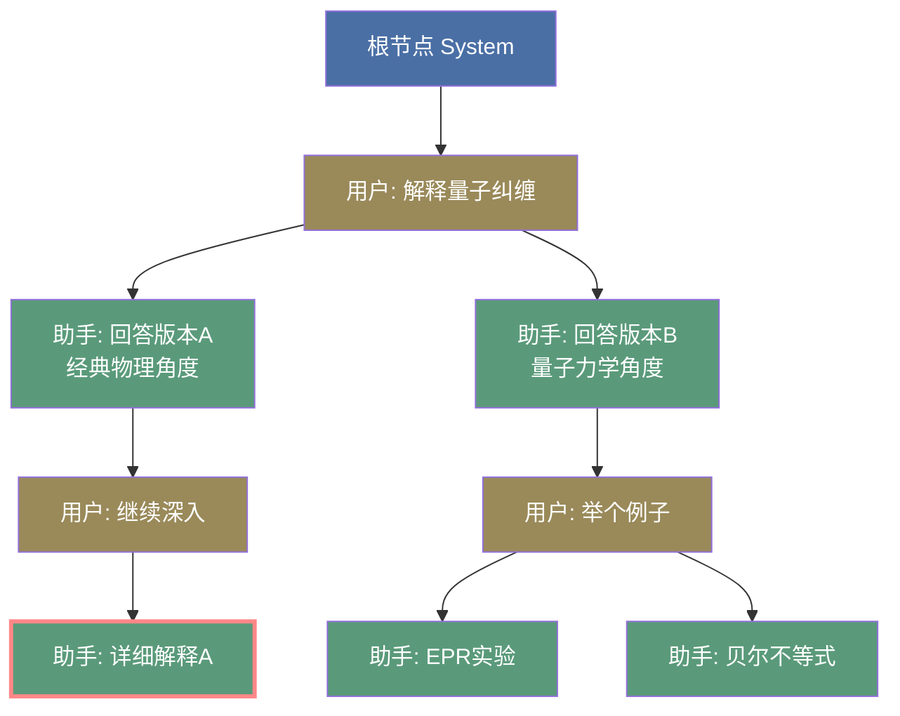
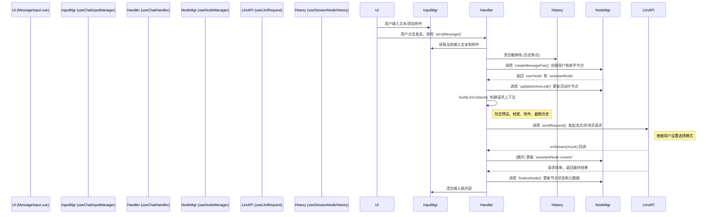

# LLM Chat: 架构与开发者指南 (v2.2)

本文档旨在深入解析 `llm-chat` 工具的内部架构、设计理念和数据流，为后续的开发和维护提供清晰的指引。

## 1. 核心概念

`llm-chat` 的核心设计围绕多个关键概念构建，这些概念共同实现了一个功能强大且可扩展的对话系统。

### 1.1. 树状对话历史 (Tree-based Conversation History)

与传统的线性对话列表不同，本模块的对话历史是一个**树形结构**。

- **基本单位**: 每一条消息都是一个 `ChatMessageNode` 对象。
- **树形关系**: 每个节点通过 `parentId` 和 `childrenIds` 属性建立父子关系。
- **核心优势**:
  - **非破坏性操作**: 重新生成 (Regenerate) 或编辑 (Edit) 不会覆盖旧消息，而是会创建新的兄弟节点或子节点，形成新的**分支 (Branch)**。
  - **多路径探索**: 用户可以轻松地在不同的对话分支之间切换，探索和比较模型的不同回答。
  - **完整的上下文追溯**: 保证了任何对话路径的上下文都是完整且可追溯的。
- **分支记忆**: 系统会通过 `lastSelectedChildId` 属性记住用户在每个父节点上的最后选择，当返回父分支时，会自动导航到用户上次查看的路径，优化了复杂分支场景下的导航体验。

**图解**:

- 蓝色节点是**根节点 (System)**，黄褐色节点是**用户消息**，绿色节点是**助手回答**。
- 从 `U1` 出发有两个分支（`A1a` 和 `A1b`），这是对同一个问题的两种不同回答。
- 红色边框的 `A2a` 是当前 **activeLeafId**，表示用户正在查看这条对话路径。
- 切换分支只需要将 `activeLeafId` 改为其他叶节点（如 `A2b1` 或 `A2b2`），UI 就会展示不同的对话历史。

### 1.2. 会话 (ChatSession)

`ChatSession` 是一个独立的对话容器，它封装了一棵完整的消息树和相关元数据。

- **`nodes`**: 一个以 `nodeId` 为键的字典，存储了该会话中所有的 `ChatMessageNode`。
- **`rootNodeId`**: 树的根节点 ID。
- **`activeLeafId`**: **极其重要的属性**。它指向当前对话分支的**叶子节点**，决定了UI上显示哪一条对话路径。
- **话题命名**: 支持基于 LLM 的自动或手动为会话生成标题，便于用户识别和管理。
- **撤销/重做栈**: 内部维护了 `history` 和 `historyIndex`，用于支持会话级别的撤销/重做操作。

### 1.3. 智能体 (ChatAgent)

`ChatAgent` 是一个可复用的、封装了特定配置的"对话角色"。它更像一个**配置预设**，而非一个独立的实体。

- **配置集合**: 它整合了 LLM Profile (API密钥等)、模型ID、预设消息串和模型参数。
- **与会话解耦**: 会话与智能体是松散耦合的。一个会话在创建时会关联一个智能体，但用户可以随时通过全局模型选择器更换模型。每条助手消息的元数据 (`metadata`) 中会记录生成它时所使用的智能体信息。
- **分类管理**: 新增了分类系统 (`category`)，和原有的标签并行，用于不同层次的筛选，管理和查找智能体更加高效。
- **显示名称**: 支持 `displayName`，允许在 UI 上使用更友好的昵称，而不影响内部 ID。
- **用户档案绑定**: 智能体可以绑定特定的用户档案 (`userProfileId`)，用于在上下文中插入用户身份信息。
- **预设消息显示**: 支持配置 `displayPresetCount`，控制在聊天界面中显示多少条预设消息（作为开场白）。
- **复制增强**: 复制智能体时，系统会自动处理其私有的头像文件（`appdata://` 协议），确保副本拥有独立的头像资产，避免引用冲突。

### 1.4. 用户档案 (UserProfile)

用户档案是一个可复用的用户身份描述，用于在对话中插入用户的背景信息、角色设定等。

- **核心概念**: 包含用户的描述性文本，在构建 LLM 上下文时会被插入到对话中。
- **全局与智能体级别**: 既可以设置全局默认档案，也可以在智能体中绑定特定档案（优先级更高）。
- **灵活插入**: 通过预设消息中的 `user_profile` 占位符，可以精确控制档案内容的插入位置。

### 1.5. 附件系统 (Attachments)

附件系统允许用户在消息中添加文件，实现多模态对话。

- **基于 Asset 管理**: 使用统一的 Asset 管理系统进行文件存储和去重。
- **智能文件检测**: 除了扩展名，还使用文件魔数 (magic number) 进行内容检测，能更准确地识别文件类型。
- **多类型支持**:
  - **图片**: 支持多图预览切换。
  - **视频**: 支持视频文件预览。
  - **文本**: 纯文本文件会直接读取内容，而非转为 base64，提高效率。
  - **文档**: 根据模型能力智能选择 `base64` 或 `openai_file` 格式。
  - **其他**: 对非预览类型的文件，采用紧凑的长条布局显示。
- **响应式布局**: 附件列表采用响应式网格布局，适配不同尺寸。

### 1.6. 全局输入管理 (Global Input Management)

- **`useChatInputManager`**: 这是一个全局单例 Composable，统一管理聊天输入框的状态（文本和附件）。
- **跨窗口同步**: 确保主窗口和分离窗口的输入内容实时同步。
- **草稿持久化**: 未发送的输入内容（包括附件）会自动保存到 `localStorage`，在应用重启后可以恢复，防止意外丢失。
- **外观服务**: 通过 `llmChat.registry.ts` 提供一个轻量级的外观，为其他工具（如 Agent）提供一个稳定的编程接口来与输入框交互。

### 1.7. 上下文管理与截断 (Context Management)

- **显式控制**: 用户可以在智能体参数中精细配置上下文管理策略。
- **Token 限制**: 可设置上下文最大 Token 数。
- **智能截断**: 当上下文超出限制时，系统会从最新的消息开始，保留尽可能多的对话历史，并对被截断的旧消息保留部分字符作为摘要。
- **实时预览**: UI 会实时显示当前上下文的 Token 统计信息和使用率。

### 1.8. 高性能UI (Performant UI)

- **虚拟滚动**: 消息列表采用 `@tanstack/vue-virtual` 实现虚拟滚动，即使在有数千条消息的会话中也能保持流畅的滚动性能。
- **消息导航器**: 配备了消息导航器 (`MessageNavigator`)，提供滚动进度、消息计数、快速跳转（到顶部/底部）和新消息提示功能。

### 1.9. 上下文分析器 (Context Analyzer)

上下文分析器是一个强大的调试和优化工具，用于可视化和分析任意消息节点的完整 LLM 请求上下文。

- **核心功能**:
  - **完整上下文预览**: 重建指定消息节点实际发送给 LLM 时的完整请求上下文。
  - **智能体推断**: 自动从消息节点的元数据推断该消息使用的智能体配置。
  - **多维度展示**: 提供结构化视图、原始请求视图和内容分析图表。

### 1.10. 宏系统 (Macro System)

宏系统是一个强大的动态内容生成引擎，它允许在智能体的预设消息、用户输入等任何地方嵌入可执行的占位符。

- **三阶段执行管道**:
  1.  **预处理 (`PRE_PROCESS`)**: 处理状态变更（如 `setvar`）。
  2.  **替换 (`SUBSTITUTE`)**: 处理静态值替换（如 `user`, `getvar`）。
  3.  **后处理 (`POST_PROCESS`)**: 执行动态函数（如 `time`, `random`）。

### 1.11. 对话树图视图 (Conversation Tree Graph View)

对话树图视图是一个高度交互的可视化工具，旨在将对话的非线性树状结构直观地呈现给用户。

- **核心技术**: 采用 `Vue Flow` 进行前端渲染，后端则利用 `D3.js` (`d3-force` 和 `d3-hierarchy`) 作为布局引擎。
- **双布局模式**: 支持确定性的**树状布局**和动态的**力导向布局**。
- **丰富的交互**: 支持分支切换、节点拖拽、子树嫁接、单点移动等高级操作。

### 1.12. 撤销/重做系统 (Undo/Redo System)

为了提供类似文本编辑器的流畅体验，系统实现了会话级别的撤销/重做功能。

- **混合存储策略**: 采用**快照 (Snapshot)** 与 **增量 (Delta)** 相结合的方式。
  - **Delta**: 对于轻量级操作（如编辑消息、切换分支），只记录变更的差异。
  - **Snapshot**: 定期或在复杂操作后记录完整的会话状态，作为“存档点”。
- **支持的操作**: 编辑消息、删除消息、切换分支、节点移动、分支嫁接、启用/禁用节点等。
- **历史断点**: 发送新消息或重新生成回复被视为“历史断点”，会清空当前的撤销栈，确保时间线的线性逻辑。

### 1.13. 跨窗口同步架构 (Cross-Window Synchronization)

本模块支持将聊天窗口分离为独立窗口，并保持状态的实时同步。

- **架构模式**: **主从架构 (Master-Slave)**。
  - **主窗口 (Main)**: 状态的唯一真实来源 (Source of Truth)，负责执行所有业务逻辑和 API 请求。
  - **分离窗口 (Detached)**: 主窗口的“投影”，只负责渲染和用户交互，不直接修改状态。
- **同步机制**:
  - **状态下行**: 主窗口通过 `useWindowSyncBus` 将 Store 的状态（会话、智能体、设置等）实时广播给所有分离窗口。
  - **操作上行**: 分离窗口的用户操作（如发送消息、切换分支）被封装为请求，通过 Bus 发送给主窗口。
  - **代理执行**: 主窗口接收请求，执行逻辑，状态更新后自动同步回分离窗口。

### 1.14. 高级上下文注入策略 (Context Injection Strategy)

为了提供类似 SillyTavern 的高级角色扮演体验，系统引入了一套声明式的消息注入机制。

- **核心理念**: 将预设消息的"内容"与"位置"解耦。
- **三种注入模式**:
  - **深度注入 (Depth)**: 将消息插入到距离对话历史末尾 N 层的位置（例如：始终在倒数第2条）。
  - **锚点注入 (Anchor)**: 将消息精准地插入到系统锚点（如 `chat_history`, `user_profile`）的前面或后面。
  - **顺序控制 (Order)**: 通过优先级数字，决定在同一点注入多条消息时的最终顺序。
- **系统锚点**:
  - `chat_history`: 实际对话历史的占位符。
  - `user_profile`: 用户档案的占位符。

### 1.15. SillyTavern 兼容性 (SillyTavern Compatibility)

为了利用社区丰富的角色资源，系统实现了对部分 SillyTavern 格式配置的导入兼容。

- **角色卡导入**: 支持解析 V2/V3 格式的角色卡（.json/.png），自动映射字段：
  - `description`, `personality`, `scenario`, `first_mes` -> 预设消息
  - `depth_prompt` -> 深度注入消息
  - `avatar` -> 智能体图标
- **预设文件导入**: 支持导入 ST 的 Context Preset (.json/.yaml)，自动解析 `prompt_order` 并转换为对应的注入策略。

### 1.16. 虚拟时间线 (Virtual Timeline)

为沉浸式角色扮演（RP）引入了独立于现实世界的时间维度。

- **双时钟系统**: 每个智能体可以拥有独立的虚拟时钟。
- **流速控制**: 支持设定虚拟时间相对于现实时间的流速（例如：现实1小时 = 游戏内1天）。
- **宏集成**: 系统的时间宏（如 `{{date}}`, `{{time}}`）会自动感知当前的虚拟时间配置，输出虚拟世界的时间。

### 1.17. 模型思考能力标准化 (Thinking Capability)

紧跟大模型技术趋势，系统将原本分散的推理 (`reasoning`) 能力统一重构为标准化的 `thinking` 能力体系。

- **统一配置**: 支持多种配置模式，包括简单的开关、预算（Budget，如 token 数量）和等级（Effort，如 low/high）。
- **广泛适配**: 已适配 Claude、Cohere、Gemini 以及 OpenAI 兼容接口的思考参数。
- **UI 动态渲染**: 参数编辑器会根据模型元数据中声明的能力，动态渲染出对应的思考预算滑块或等级选择器。

### 1.18. 核心对话交互 (Core Chat Interactions)

为了提升对话的灵活性和探索效率，系统提供了一系列高级交互功能。

- **临时模型切换**: 在发送消息时，允许用户临时指定一个不同于当前会话默认设置的模型。这对于快速对比不同模型在同一上下文中的表现非常有用，而无需修改智能体或全局配置。
- **从编辑创建分支 (Branch from Edit)**: 当用户编辑一条已发送的消息时，除了保存修改外，还可以选择"从当前内容创建新分支"。系统会自动将编辑后的内容作为一条新的用户消息，并基于此生成新的助手回复，从而创建一条全新的对话路径，便于探索"如果这么问会怎样？"的场景。

### 1.19. 正则管道系统 (Regex Pipeline System)

正则管道系统为消息内容提供了强大的动态清洗、格式转换和角色扮演增强能力。

- **三层数据结构**:
  - **Config**: 配置根对象，包含预设列表。
  - **Preset (预设/组)**: 规则的容器，支持按组管理和批量开关。
  - **Rule**: 最小执行单元，定义具体的正则匹配和替换逻辑。

- **三层配置体系**:
  - **Global (全局)**: 存储于 `ChatSettings.regexConfig`，对所有会话生效。
  - **Agent (智能体)**: 存储于 `ChatAgent.regexConfig`，针对特定智能体生效。
  - **User (用户档案)**: 存储于 `UserProfile.regexConfig`，针对特定用户档案生效。

- **Message-Bound 策略**: 采用"谁生的孩子谁负责"原则，每条消息优先使用其生成时的 Agent/User 配置进行处理，确保历史消息的数据完整性和一致性。

- **双管道处理**:
  - **Render Pipeline (渲染层)**: 在 `RichTextRenderer` 中执行，处理消息的显示内容。
  - **Request Pipeline (请求层)**: 在 `useChatContextBuilder` 中执行，处理发送给模型的 Prompt。

- **灵活的目标控制**:
  - **目标角色 (targetRoles)**: 支持按 `system`/`user`/`assistant` 多选过滤。
  - **深度范围 (depthRange)**: 支持限制规则只在特定深度的消息上生效。
  - **应用阶段 (applyTo)**: 可分别控制规则在渲染层和请求层的生效状态。

- **宏替换集成**: 支持三种宏替换模式：
  - `NONE`: 不进行宏替换。
  - `RAW`: 将宏替换为文本值后作为正则使用。
  - `ESCAPED`: 替换宏后对值进行正则转义（推荐用于动态匹配用户名等场景）。

- **捕获组后处理 (Trim Strings)**: 支持对正则捕获组的内容进行二次清理，移除不需要的前缀或标记。

- **SillyTavern 兼容**: 支持导入 SillyTavern 的正则脚本配置，自动转换为本系统格式。

## 2. 架构概览

本模块遵循关注点分离的原则，将状态、逻辑和视图清晰地分开。

- **State (Pinia Stores & Singletons)**:
  - `useLlmChatStore`: 核心业务状态（会话列表、当前会话、撤销栈）。
  - `useAgentStore`: 智能体配置状态。
  - `useUserProfileStore`: 用户档案状态。
  - `useChatInputManager`: 全局输入框状态（含附件）。
  - `useLlmChatUiState`: UI 状态（侧边栏折叠等）。
- **Logic (Composables)**:
  - `composables/` 目录下封装了所有核心业务逻辑。
- **View (Vue Components)**:
  - `components/` 目录下负责 UI 渲染。
- **Sync (Engine)**:
  - `useLlmChatSync`: 负责跨窗口的状态同步和操作代理。

## 3. 数据流：发送一条新消息

## 4. 核心逻辑 (Composables)

### 4.1. 树形对话管理

- **`useNodeManager`**: **树的底层操作者**。提供原子级别的节点操作功能（创建、删除、获取路径、嫁接子树、单点移动等）。
- **`useBranchManager`**: **用户的直接交互层**。基于 `useNodeManager`，提供面向用户操作的高级功能（切换分支、编辑消息、创建分支等）。

### 4.2. 对话处理核心

- **`useChatHandler`**: **对话流程的协调者**。负责处理 `sendMessage` 和 `regenerateFromNode` 的完整逻辑。
- **`useChatExecutor`**: **请求执行器**。封装了核心的 LLM 请求执行逻辑，包括调用 ContextBuilder、发送请求、处理流式响应。

### 4.3. 上下文构建与处理

- **`useChatContextBuilder`**: **上下文构建引擎**。负责从活动路径和智能体配置中构建发送给 LLM 的消息列表。
- **`useContextInjection`**: **注入策略处理器**。负责解析消息的注入策略（Depth/Anchor），并将它们精准地插入到上下文流的正确位置。
- **`useContextLimiter`**: **上下文截断器**。负责根据 Token 限制对上下文进行智能截断，保留关键信息。
- **`useContextPreview`**: **上下文预览器**。提供完整的上下文可视化分析，包括 Token 统计、注入位置和最终请求结构。
- **`useMessageProcessor`**: **消息后处理管道**。实现可扩展的消息处理规则系统（如合并 System 消息、确保角色交替）。
- **`useChatAssetProcessor`**: **附件处理器**。负责将 Asset 转换为 LLM 可接受的消息内容（Base64、OpenAI File 等）。

### 4.4. 正则管道处理

- **`useChatRegexResolver`**: **规则解析器**。负责为每条消息解析其对应的规则集，支持缓存优化。根据消息的 `metadata.agentId` 和 `userProfileId` 获取对应的配置，合并 Global、Agent、User 三层规则。
- **`useChatRegexPipeline`**: **管道执行器**。负责实际执行正则替换逻辑，包括宏预处理、规则过滤、排序和应用。
- **工具函数 (`chatRegexUtils.ts`)**:
  - `resolveRawRules`: 基础规则解析（不含深度过滤）。
  - `filterRulesByDepth`: 深度过滤。
  - `processRulesWithMacros`: 对规则进行宏替换预处理。
  - `applyRegexRules`: 应用规则列表到文本内容。

### 4.5. 附件与输入管理

- **`useAttachmentManager`**: **附件的完整管理者**。负责附件的添加、移除、验证、去重和状态追踪。
- **`useChatInputManager`**: **全局输入状态管理器**。处理输入框文本和附件的跨窗口同步与持久化。

### 4.6. 会话、工具与同步

- **`useSessionManager`**: **会话的生命周期管理者**。负责会话的创建、加载、删除和持久化。
- **`useLlmChatSync`**: **跨窗口同步引擎**。初始化状态同步引擎，注册操作代理处理器，确保多窗口协同工作。
- **`useTopicNamer`**: **话题命名器**。负责调用 LLM 为新会话自动生成简洁、有意义的标题。
- **`useModelSelectDialog`**: **全局模型选择器**。提供弹窗式的模型选择 UI。
- **`useAnchorRegistry`**: **锚点注册表**。管理上下文注入系统中可用的锚点列表（如 `chat_history`）。

### 4.7. 宏处理引擎

- **`useMacroProcessor`**: **宏引擎的业务层封装**。
- **`MacroProcessor`**: **宏执行的核心引擎**。
- **`MacroRegistry`**: **宏定义的中心化管理器**。

### 4.8. 历史记录管理

- **`useSessionNodeHistory`**: **撤销/重做管理器**。
  - 维护 `history` 栈和 `historyIndex`。
  - 实现 `recordHistory`（记录快照或增量）、`undo`、`redo` 和 `jumpToState`。
  - 处理复杂的节点关系恢复逻辑。

### 4.9. 导出管理

- **`useExportManager`**: **导出工具**。
  - `exportSessionAsMarkdown`: 导出当前活动路径。
  - `exportBranchAsMarkdown`: 导出指定分支。
  - `exportSessionAsMarkdownTree`: 以树状结构导出完整会话。
  - `exportBranchAsJson`: 导出分支为 JSON 数据。

## 5. 数据持久化

为了性能和数据安全，本模块采用**分离式存储策略**，将索引和数据文件分开存储。

- **会话存储 (`useChatStorageSeparated`)**:
  - **索引文件**: `sessions/index.json` 存储会话元信息列表和 `currentSessionId`。
  - **会话文件**: 每个会话的完整数据存储为 `sessions/session-[id].json`。
  - **加载过程**: 启动时先读索引以快速展示列表，点击会话时再异步加载完整数据。

- **智能体存储 (`useAgentStorageSeparated`)**:
  - **索引文件**: `agents-index.json` 存储所有智能体的元信息。
  - **智能体文件**: 每个智能体存储为 `agents/{agentId}.json`。

## 6. 关键类型定义 (`types.ts`)

- **`ChatMessageNode`**: 树的基本构建块。
  - `id`, `parentId`, `childrenIds`: 定义树结构。
  - `role`, `content`, `status`: 消息基本信息。
  - `attachments`: `Asset[]`，支持多模态对话。
  - `metadata`: 存储额外信息，包括：
    - `agentId`, `modelId`: 生成该消息的配置。
    - `usage`, `contentTokens`: Token 消耗统计。
    - `reasoningContent`: DeepSeek 等模型的推理过程内容。
    - `reasoningStartTime`, `reasoningEndTime`: 推理耗时统计。

- **`ChatSession`**: 对话的容器。
  - `nodes`: 消息节点字典。
  - `activeLeafId`: 当前活跃叶节点。
  - `history`: `HistoryEntry[]`，撤销/重做历史栈。

- **`HistoryEntry` & `HistoryDelta`**: 历史记录相关。
  - `HistoryActionTag`: 操作类型（如 `NODE_EDIT`, `BRANCH_GRAFT`）。
  - `HistoryDelta`: 记录具体的变更（创建、删除、更新、关系变化）。

- **`ChatAgent`**: 可复用的配置模板。
  - `presetMessages`: 预设消息序列。
  - `displayPresetCount`: 在聊天界面显示的预设消息数量。
  - `parameters`: (`LlmParameters`) 强大的 LLM 参数配置中心，其核心能力包括：
    - **基础参数**: 支持 `temperature`, `topP`, `maxTokens` 等标准采样参数。
    - **模型思考能力**: 通过 `thinkingEnabled` 和 `thinkingBudget` 等字段，标准化控制 Claude、Gemini 等新模型的原生思考/推理能力。
    - **厂商专属配置**: 支持 `safetySettings` (Gemini)、`claudeMetadata` (Claude) 等特定于模型提供商的精细化设置。
    - **自定义参数**: `custom` 字段允许用户透传任意非标准的 API 参数，提供了极高的灵活性。
    - **高级功能**: 内置 `responseFormat` (强制JSON输出)、`tools` (工具调用)、`contextPostProcessing` (上下文后处理管道) 等高级配置。
  - `category`: 智能体分类（如"编程", "角色扮演"）。
  - `virtualTimeConfig`: 虚拟时间配置（基准时间、流速）。
  - `llmThinkRules`: LLM 思考过程的解析规则。

- **`InjectionStrategy`**: 消息注入策略。
  - `depth`: 深度注入位置（距离末尾的消息数）。
  - `anchorTarget`: 锚点注入目标（如 `chat_history`）。
  - `anchorPosition`: 相对锚点的位置（`before` / `after`）。
  - `order`: 同位置多消息的排序权重。

- **`ChatRegexRule`**: 单条正则规则。
  - `regex`, `replacement`, `flags`: 核心正则配置。
  - `applyTo`: 应用阶段控制（`render` / `request`）。
  - `targetRoles`: 目标消息角色（`system` / `user` / `assistant`）。
  - `depthRange`: 消息深度范围限制。
  - `substitutionMode`: 宏替换模式（`NONE` / `RAW` / `ESCAPED`）。
  - `trimStrings`: 捕获组后处理字符串列表。

- **`ChatRegexPreset`**: 正则预设/规则组。
  - `name`, `description`, `author`, `version`: 元信息。
  - `enabled`: 预设级开关。
  - `rules`: 规则列表。
  - `priority`: 预设优先级（越小越先执行，默认 100）。

- **`ChatRegexConfig`**: 正则配置根对象。
  - `presets`: 预设列表，用于 Global、Agent、User 三层配置。

## 7. 未来展望

`llm-chat` 的未来发展将深度依赖于整个 AIO Hub 的工具生态系统。通过 Function Calling 能力，聊天模块将不再是一个孤立的功能，而是成为整个应用的智能中枢，实现 AI 智能与人类创造力之间的平衡。
