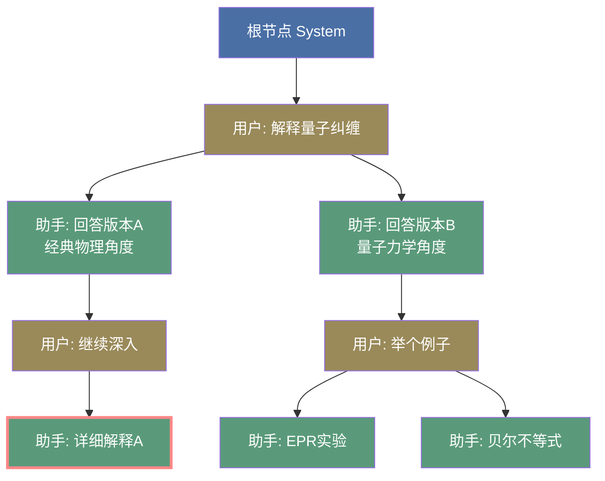
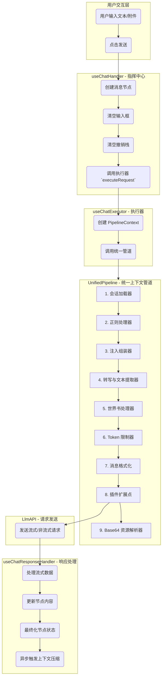

# LLM Chat: 架构与开发者指南 (v5)

本文档旨在深入解析 `llm-chat` 工具的内部架构、设计理念和数据流，为后续的开发和维护提供清晰的指引。

## 1. 核心概念 (Core Concepts)

`llm-chat` 的核心设计围绕多个关键概念构建，这些概念共同实现了一个功能强大且可扩展的对话系统。

### 1.1. 树状对话历史 (Tree-based Conversation History)

与传统的线性对话列表不同，本模块的对话历史是一个**树形结构**。

- **基本单位**: 每一条消息都是一个 `ChatMessageNode` 对象。
- **树形关系**: 每个节点通过 `parentId` 和 `childrenIds` 属性建立父子关系。
- **核心优势**:
  - **非破坏性操作**: 重新生成 (Regenerate) 或编辑 (Edit) 不会覆盖旧消息，而是会创建新的兄弟节点或子节点，形成新的**分支 (Branch)**。
  - **多路径探索**: 用户可以轻松地在不同的对话分支之间切换，探索和比较模型的不同回答。
  - **完整的上下文追溯**: 保证了任何对话路径的上下文都是完整且可追溯的。
- **分支记忆**: 系统会通过 `lastSelectedChildId` 属性记住用户在每个父节点上的最后选择，当返回父分支时，会自动导航到用户上次查看的路径，优化了复杂分支场景下的导航体验。

**图解**:

- 蓝色节点是**根节点 (System)**，黄褐色节点是**用户消息**，绿色节点是**助手回答**。
- 从 `U1` 出发有两个分支（`A1a` 和 `A1b`），这是对同一个问题的两种不同回答。
- 红色边框的 `A2a` 是当前 **activeLeafId**，表示用户正在查看这条对话路径。
- 切换分支只需要将 `activeLeafId` 改为其他叶节点（如 `A2b1` 或 `A2b2`），UI 就会展示不同的对话历史。

### 1.2. 会话 (ChatSession)

`ChatSession` 是一个独立的对话容器，它封装了一棵完整的消息树和相关元数据。

- **`nodes`**: 一个以 `nodeId` 为键的字典，存储了该会话中所有的 `ChatMessageNode`。
- **`rootNodeId`**: 树的根节点 ID。
- **`activeLeafId`**: **极其重要的属性**。它指向当前对话分支的**叶子节点**，决定了UI上显示哪一条对话路径。
- **话题命名**: 支持基于 LLM 的自动或手动为会话生成标题，便于用户识别和管理。
- **撤销/重做栈**: 内部维护了 `history` 和 `historyIndex`，用于支持会话级别的撤销/重做操作。

### 1.3. 智能体 (ChatAgent)

`ChatAgent` 是一个可复用的、封装了特定配置的"对话角色"。它更像一个**配置预设**，而非一个独立的实体。

- **配置集合**: 它整合了 LLM Profile (API密钥等)、模型ID、预设消息串和模型参数。
- **与会话解耦**: 会话与智能体是松散耦合的。一个会话在创建时会关联一个智能体，但用户可以随时通过全局模型选择器更换模型。每条助手消息的元数据 (`metadata`) 中会记录生成它时所使用的智能体信息。
- **分类管理**: 新增了分类系统 (`category`)，和原有的标签并行，用于不同层次的筛选，管理和查找智能体更加高效。
- **显示名称**: 支持 `displayName`，允许在 UI 上使用更友好的昵称，而不影响内部 ID。
- **消息名称**: 预设消息支持独立的 `name` 字段，用于在 UI 中标识消息用途（如 "开场白", "背景介绍"），提高编辑体验。
- **用户档案绑定**: 智能体可以绑定特定的用户档案 (`userProfileId`)，用于在上下文中插入用户身份信息。
- **预设消息显示**: 支持配置 `displayPresetCount`，控制在聊天界面中显示多少条预设消息（作为开场白）。
- **复制增强**: 复制智能体时，系统会自动处理其私有的头像文件（`appdata://` 协议），确保副本拥有独立的头像资产，避免引用冲突。
- **内置资产绑定**: 智能体可以携带专属的媒体资产（表情包、背景音乐、场景图等），这些资产的生命周期与智能体完全绑定。

### 1.4. 用户档案 (UserProfile)

用户档案是一个可复用的用户身份描述，用于在对话中插入用户的背景信息、角色设定等。

- **核心概念**: 包含用户的描述性文本，在构建 LLM 上下文时会被插入到对话中。
- **全局与智能体级别**: 既可以设置全局默认档案，也可以在智能体中绑定特定档案（优先级更高）。
- **灵活插入**: 通过预设消息中的 `user_profile` 占位符，可以精确控制档案内容的插入位置。

### 1.5. 附件系统 (Attachments)

附件系统允许用户在消息中添加文件，实现多模态对话。

- **基于 Asset 管理**: 使用统一的 Asset 管理系统进行文件存储和去重。
- **智能文件检测**: 除了扩展名，还使用文件魔数 (magic number) 进行内容检测，能更准确地识别文件类型。
- **多类型支持**:
  - **图片**: 支持多图预览切换。
  - **视频**: 支持视频文件预览。
  - **文本**: 纯文本文件会直接读取内容，而非转为 base64，提高效率。
  - **文档**: 根据模型能力智能选择 `base64` 或 `openai_file` 格式。
  - **其他**: 对非预览类型的文件，采用紧凑的长条布局显示。
- **转写协作**: 与独立的 `transcription` 工具深度集成。当模型不具备原生多模态能力时，系统可自动触发转写流程。
- **响应式布局**: 附件列表采用响应式网格布局，适配不同尺寸。

### 1.6. 上下文分析器 (Context Analyzer)

上下文分析器是一个强大的调试和优化工具，用于可视化和分析任意消息节点的完整 LLM 请求上下文。

- **核心功能**:
  - **完整上下文预览**: 重建指定消息节点实际发送给 LLM 时的完整请求上下文。
  - **智能体推断**: 自动从消息节点的元数据推断该消息使用的智能体配置。
  - **多维度展示**: 提供结构化视图、原始请求视图和内容分析图表。

### 1.7. 宏系统 (Macro System)

宏系统是一个强大的动态内容生成引擎，它允许在智能体的预设消息、用户输入等任何地方嵌入可执行的占位符。详细的宏定义与用法请参考：[MACRO.md](./macro-engine/MACRO.md)。

- **三阶段执行管道**:
  1.  **预处理 (`PRE_PROCESS`)**: 处理状态变更（如 `setvar`）。
  2.  **替换 (`SUBSTITUTE`)**: 处理静态值替换（如 `user`, `getvar`）。
  3.  **后处理 (`POST_PROCESS`)**: 执行动态函数（如 `time`, `random`）。

### 1.8. 撤销/重做系统 (Undo/Redo System)

为了提供类似文本编辑器的流畅体验，系统实现了会话级别的撤销/重做功能。

- **混合存储策略**: 采用**快照 (Snapshot)** 与 **增量 (Delta)** 相结合的方式。
  - **Delta**: 对于轻量级操作（如编辑消息、切换分支），只记录变更的差异。
  - **Snapshot**: 定期或在复杂操作后记录完整的会话状态，作为“存档点”。
- **支持的操作**: 编辑消息、删除消息、切换分支、节点移动、分支嫁接、启用/禁用节点等。
- **历史断点**: 发送新消息或重新生成回复被视为“历史断点”，会清空当前的撤销栈，确保时间线的线性逻辑。

### 1.9. SillyTavern 兼容性 (SillyTavern Compatibility)

为了利用社区丰富的角色资源，系统实现了对部分 SillyTavern 格式配置的导入兼容。

- **角色卡导入**: 支持解析 V2/V3 格式的角色卡（.json/.png），自动映射字段：
  - `description`, `personality`, `scenario`, `first_mes` -> 预设消息
  - `depth_prompt` -> 深度注入消息
  - `avatar` -> 智能体图标
- **预设文件导入**: 支持导入 ST 的 Context Preset (.json/.yaml)，自动解析 `prompt_order` 并转换为对应的注入策略。

### 1.10. 虚拟时间线 (Virtual Timeline)

为沉浸式角色扮演（RP）引入了独立于现实世界的时间维度。

- **双时钟系统**: 每个智能体可以拥有独立的虚拟时钟。
- **流速控制**: 支持设定虚拟时间相对于现实时间的流速（例如：现实1小时 = 游戏内1天）。
- **宏集成**: 系统的时间宏（如 `{{date}}`, `{{time}}`）会自动感知当前的虚拟时间配置，输出虚拟世界的时间。

### 1.11. 模型参数配置系统 (Model Parameter System)

为了应对日益复杂的模型能力差异，系统构建了一套分层、动态且高度可扩展的参数配置引擎，实现了从基础采样到高级推理的全方位控制。

- **分层配置架构**:
  - **基础参数 (Basic)**: 标准化的采样控制，如 `temperature`, `topP`, `maxTokens`。
  - **高级参数 (Advanced)**: 进阶控制选项，如 `frequencyPenalty`, `presencePenalty`, `seed`。
  - **思考能力 (Thinking)**: 标准化的推理能力控制体系。
    - **统一抽象**: 将不同厂商（Claude, Gemini, DeepSeek 等）的推理参数抽象为统一的 `thinkingEnabled` (开关)、`thinkingBudget` (预算) 和 `reasoningEffort` (等级)。
    - **智能适配**: 根据模型元数据 (`capabilities`) 自动渲染适配的 UI 控件（如滑块或下拉框）。
    - **参数联动**: 实现了 `thinkingBudget` 与 `maxTokens` 的自动联动逻辑，确保总 Token 上限始终能容纳推理预算。
  - **上下文管理 (Context Management)**:
    - **Token 限制**: 允许为特定模型设置独立的上下文长度上限 (`maxContextTokens`)。
    - **智能截断**: 配置截断策略，包括保留字符数 (`retainedCharacters`) 等。
    - **实时统计**: 集成 `ContextStatsCard`，实时计算并显示当前会话的上下文消耗与剩余空间。
  - **上下文压缩 (Context Compression)**: 压缩配置位于此处，允许按 Agent/Session 进行精细化控制。
  - **厂商专属配置 (Provider Specific)**:
    - **安全设置**: 针对 Gemini 等模型家族，动态加载安全过滤等级配置面板 (`SafetySettings`)。
  - **自定义参数 (Custom)**: 允许用户直接透传任意非标准 API 参数。其结构已统一为 `{ enabled: boolean, params: Record<string, any> }`，并提供 UI 开关，确保对新模型特性的零日支持。

- **动态能力适配**: 参数编辑器 (`ModelParametersEditor`) 会根据当前选中的模型 ID 和渠道类型，自动查询 `capabilities` 元数据，动态显示或隐藏不支持的参数组，通过数据驱动的方式解决了 UI 臃肿问题。

### 1.12. 知识库系统 (Knowledge Base / RAG)

系统集成了强大的 RAG (Retrieval-Augmented Generation) 能力，允许智能体访问外部知识库。

- **触发机制**: 通过在预设消息或用户输入中使用 `【kb::kbName::limit::minScore::mode::params】` 占位符触发。
- **激活模式**:
  - **Always**: 始终触发检索。
  - **Gate**: 关键词触发，仅当最近对话中出现指定关键词时激活。
  - **Turn**: 轮次触发，每隔 N 轮对话执行一次检索。
  - **Static**: 静态加载，直接注入指定的条目 ID 或整个库的内容。
- **智能检索策略**:
  - **上下文感知查询**: 自动提取最近 N 轮对话构建检索 Query。
  - **双引擎检索**: 支持向量检索 (Vector) 和关键词检索 (Keyword/Fulltext)，以及混合检索 (Hybrid)。
  - **语义缓存**: 实现会话级检索缓存，支持原始文本精确匹配和向量相似度匹配，显著降低 API 开销。
- **结果聚合与衰减**:
  - **向量投影**: 支持对历史查询向量进行加权平均，使检索更具上下文连贯性。
  - **时间衰减**: 对历史检索结果进行分值衰减并与当前结果聚合，确保持久记忆。

### 1.13. 搜索系统 (Search System)

为海量对话和智能体提供了毫秒级的全文检索能力。

- **多维搜索**: 支持对智能体（名称、预设消息等）和会话（标题、消息、推理内容）进行深度搜索。
- **匹配模式**: 提供 `Exact` (整体匹配)、`And` (包含全部词)、`Or` (包含任一词) 三种模式。
- **性能优化**: 采用 rust 后端模块索引驱动，前端配合防抖 (Debounce) 和 Loading 延迟策略，确保搜索体验极其流畅。

### 1.14. 翻译系统 (Translation System)

为了打破语言障碍，系统集成了原生的多语言翻译能力，支持消息内容和用户输入的一键翻译。

- **双向翻译**:
  - **输入翻译**: 支持将用户输入框中的文本一键翻译为目标语言。
  - **消息翻译**: 支持对助手或用户的历史消息进行翻译。
- **智能保护**: 翻译过程中会自动识别并保护 XML 标签（如 `<think>...</think>`），确保模型的思维链或结构化数据不被破坏。
- **显示模式**:
  - **原文 (Original)**: 仅显示原文。
  - **译文 (Translation)**: 仅显示译文。
  - **双语 (Both)**: 并排或上下对照显示原文和译文，方便校对。
- **独立配置**: 翻译功能拥有独立的模型配置、提示词模板和目标语言设置。

### 1.15. 上下文压缩 (Context Compression)

随着对话长度的增加，上下文窗口限制和 Token 成本成为主要瓶颈。上下文压缩系统通过智能摘要技术解决这一问题。

- **配置位置**: 压缩配置位于智能体的模型参数 (`LlmParameters.contextCompression`) 中，实现了按 Agent/Session 的精细化控制。
- **触发机制**:
  - **自动触发**: 当上下文 Token 数或消息条数超过 Agent 中设定的阈值时自动触发。
  - **对话后触发**: 支持在每次成功完成一次 LLM 请求后，异步检查并触发压缩，以优化下一次对话的性能。
  - **手动触发**: 用户可随时手动压缩当前对话。
- **非破坏性压缩**: 压缩操作会生成一个新的**压缩节点 (Compression Node)**，它包含了一段由 LLM 生成的摘要，并隐藏了被压缩的原始消息节点。
- **保护区**: 支持设置“最近 N 条消息不压缩”，确保最新的对话上下文保持完整细节。
- **可逆性**: 虽然压缩节点在构建 LLM 上下文时会替代原始消息，但原始消息节点并未被删除，用户可以随时展开查看或回滚。

### 1.16. 消息数据编辑器 (Message Data Editor)

为高级用户和开发者提供了一个强大的调试工具，允许直接查看和修改任意消息节点的底层 JSON 数据结构。

- **核心功能**: 提供一个基于 Monaco Editor 的 JSON 编辑界面，用于修改 `ChatMessageNode` 的所有属性。
- **安全更新**: 保存时会进行数据校验，确保不会破坏核心结构。
- **撤销支持**: 所有通过数据编辑器进行的修改都会被记录到撤销/重做历史中，操作可回滚。

### 1.17. 智能体资产 (Agent Assets)

为了增强智能体的表现力和沉浸感，系统支持智能体携带专属的私有媒体资产。

- **私有化存储**: 资产存储在智能体的专属目录下（`assets/`），确保数据的自包含性。在导出或共享智能体时，资产会随配置一同打包。
- **引用协议 (`agent-asset://`)**:
  - 采用自定义协议引用资产，格式为 `agent-asset://{group}/{id}.{ext}`。
  - 支持在消息流内通过 HTML 或 Markdown 标签（如 ``, `<audio>`, `<video>`）进行行内渲染。
- **资产分组**: 支持自定义分组（如 `stickers`, `bgm`, `scenes`），便于管理和 LLM 理解。
- **宏集成**: 通过 `{{assets}}` 宏向 LLM 注入可用资产列表及引用格式说明，使模型能够主动在回复中使用这些资产。
- **跨平台适配**: 渲染管线会自动将私有协议转换为 Tauri 的安全资源 URL，确保在不同操作系统下的正常显示。

### 1.18. 快捷操作 (Quick Actions)

快捷操作允许用户在输入框中通过点击按钮快速执行预定义的文本包装或指令发送。

- **类世界书管理**: 采用多级关联机制（全局、智能体、用户档案），支持按组管理。
- **模板化注入**: 支持 `{{input}}` 占位符，可将输入框选中的内容（或全文）包装进特定的 HTML 标签或指令中。
- **自动发送**: 支持配置点击后立即发送，提升操作效率。

### 1.19. 续写与补全功能 (Continue & Completion)

利用 LLM 的预测能力，系统提供了多场景的内容延续功能。

- **助手续写 (Assistant Continue)**: 当模型回复中断或需要深入时，利用 DeepSeek 的 `prefix` 或 Claude/Gemini 的 `prefill` 特性，让模型从现有文本末尾继续生成。
- **输入框补全 (Input Copilot)**: 在输入框内一键触发 AI 协助补全后续句子，支持流式回填。
- **灵感接力**: 允许 AI 站在用户视角继续书写 User 消息的内容，实现角色换位式的接话。

### 1.20. 导入、导出与迁移系统 (Import/Export & Migration)

确保用户数据的可流动性和系统的可维护性。

- **多格式支持**: 支持将会话、智能体、世界书、快捷操作导出为 JSON、Markdown 或 Zip 压缩包。
- **智能迁移**: `agentMigrationService` 负责处理不同版本间的配置结构差异，确保旧版 Agent 能够平滑升级到新架构。
- **资产打包**: 导出智能体时，会自动扫描并包含其引用的所有私有资产（头像、表情包等）。

### 1.21. 插件化设置系统 (Plugin Settings System)

为了保持核心逻辑的简洁并支持功能扩展，系统实现了一套声明式的设置注入机制。

- **动态注册**: 外部模块（如转写工具、搜索增强）可以通过 `usePluginSettings` 动态向聊天设置对话框中注入新的配置分区或配置项。
- **解耦交互**: 核心设置 UI 不需要预知所有可能的配置项，而是通过遍历注册中心自动渲染，实现了 UI 与业务插件的解耦。

### 1.22. 世界书系统 (Worldbook System)

世界书是一个基于关键词触发的动态背景知识库，专门用于增强角色扮演的连贯性。

- **多级关联**: 支持全局世界书和智能体私有世界书，满足通用设定与特定剧本的需求。
- **精准触发**: 采用高性能的关键词扫描算法，在构建上下文时实时匹配消息内容并注入关联条目。
- **管理界面**: 提供独立的世界书管理器，支持条目的分类、批量编辑和多格式导入。

## 2. 统一上下文管道系统 (Unified Context Pipeline System)

统一上下文管道是 `llm-chat` 处理 LLM 请求的核心引擎。它是一个单一、可配置、按优先级执行的处理器流水线，负责将复杂的会话树结构转换为 LLM API 可接受的线性消息列表。

### 2.1. 系统概述

- **单一数据流**: 所有处理步骤（加载、正则、注入、转写、截断、格式化、附件转换）都在同一个管道中按顺序执行，消除了以往分散处理带来的逻辑冲突。
- **元数据保留**: 在管道执行的大部分阶段，消息保持包含附件引用的"中间格式" (Intermediate Format)，直到最后一步才由资源解析器转换为最终的 Base64 或 URL 格式。这允许中间的处理器（如截断器）准确地计算 Token，而无需处理庞大的二进制数据。
- **灵活配置**: 所有处理器都实现了统一的 `ContextProcessor` 接口，支持独立的启用/禁用、优先级排序和错误处理。

### 2.2. 管道架构与流程

根据 `contextPipelineStore.ts` 的定义，默认的管道处理流程如下：

1.  **会话加载器 (`session-loader`)**
    - **职责**: 从 `ChatSession` 的树状结构中提取当前活跃路径（从 Root 到 ActiveLeaf），将其转换为线性的中间消息列表。
    - **输出**: 包含原始附件引用的消息列表。

2.  **正则处理器 (`regex-processor`)**
    - **职责**: 应用用户定义的正则替换规则，用于文本清洗、格式转换或角色扮演增强。
    - **策略**: 支持 Global/Agent/User 三层配置合并，支持宏替换。

3.  **注入组装器 (`injection-assembler`)**
    - **职责**: 处理复杂的上下文注入逻辑。
    - **操作**: 将预设消息（System Prompt, Character Card）、用户档案等插入到对话历史的指定位置（如深度注入、锚点注入）。

4.  **转写与文本提取器 (`transcription-processor`)**
    - **职责**: 处理多模态内容。
    - **操作**:
      - 自动读取文本文件附件的内容并注入消息体。
      - 对图片/音频/视频执行 OCR/ASR 转写（如果已配置且需要），将结果作为文本补充到上下文中。

5.  **世界书处理器 (`worldbook-processor`)**
    - **职责**: 扫描消息关键词并注入关联的世界书条目。
    - **操作**: 根据当前消息内容触发匹配，将条目内容注入上下文。

6.  **Token 限制器 (`token-limiter`)**
    - **职责**: 确保总上下文长度不超过模型限制。
    - **策略**: 智能预算分配。优先保留 System Prompt 和预设消息，然后从最旧的历史消息开始截断。支持保留被截断消息的头部摘要。

7.  **消息格式化器 (`message-format-processors`)**
    - **职责**: 调整消息结构以符合特定厂商的 API 要求。
    - **操作**: 合并连续的同角色消息，确保 System 消息在首位，处理角色交替约束。

8.  **资源解析器 (`asset-resolver`)**
    - **职责**: 管道的最后一步。
    - **操作**: 将所有剩余的 `Asset` 对象转换为 API 需要的格式（Base64 字符串或 `http://` 链接）。

### 2.3. 正则管道系统 (Regex Pipeline System)

正则管道为消息内容提供了强大的动态清洗和增强能力。

- **三层配置体系**:
  - **Global**: 对所有会话生效。
  - **Agent**: 针对特定智能体生效。
  - **User**: 针对特定用户档案生效。
- **配置绑定策略**: 系统支持两种绑定模式，可通过 `regexConfig.bindingMode` 配置：
  - **跟随消息配置 (message)**: 采用"配置快照绑定"原则，每条消息优先使用其生成时的 Agent/User 配置进行处理，确保历史消息的数据完整性和一致性。
  - **使用当前会话配置 (session)**: 所有消息使用当前会话的 Agent/User 配置，适用于需要统一应用最新规则的场景。
- **双管道集成**:
  - **Render Pipeline**: 在 UI 渲染层执行，改变消息的显示效果。
  - **Request Pipeline**: 在本上下文管道中执行，改变发送给模型的 Prompt。
- **灵活控制**: 支持按角色 (`targetRoles`)、深度 (`depthRange`) 和应用阶段 (`applyTo`) 进行精细过滤。
- **宏集成**: 支持在正则替换串中使用宏（如 `{{user}}`），并提供 `RAW` 和 `ESCAPED` 两种替换模式。

### 2.4. 转写与文本提取系统 (Transcription System)

转写系统旨在弥合多模态资产与纯文本模型之间的鸿沟。该系统现已从 `llm-chat` 核心逻辑中**剥离**，作为独立工具运行。

- **解耦协作**: `llm-chat` 通过 `transcriptionRegistry` 与外部转写工具交互。这使得转写功能可以被多个工具复用，且拥有独立的任务队列和配置。
- **智能策略 (Smart Strategy)**: 系统能感知当前对话模型的模态能力。
  - 若模型**不支持**视觉（如 deepseek-chat），系统会自动触发 OCR/Video-to-Text，将视觉内容转为文本描述发送给模型。
  - 若模型**支持**视觉（如 gpt-4o），系统则跳过转写，直接发送图片，节省成本。
- **强制转写阈值**: 支持配置 `forceTranscriptionAfter`，在长对话中，即使模型支持视觉，也可强制对旧消息的附件进行转写以节省 Token 或提高长上下文理解力。
- **文本提取**: 对于 `.txt`, `.md`, `.js` 等纯文本附件，系统会自动读取其内容并拼接到消息中，使模型能直接“阅读”文件。

### 2.5. 高级上下文注入策略 (Injection Strategy)

为了提供类似 SillyTavern 的高级角色扮演体验，注入组装器实现了一套声明式的消息注入机制。

- **核心理念**: 将预设消息的"内容"与"位置"解耦。
- **三种注入模式**:
  - **深度注入 (Depth)**: 将消息插入到距离对话历史末尾 N 层的位置（例如：始终在倒数第2条）。
  - **锚点注入 (Anchor)**: 将消息精准地插入到系统锚点（如 `chat_history`, `user_profile`）的前面或后面。
  - **顺序控制 (Order)**: 通过优先级数字，决定在同一点注入多条消息时的最终顺序。
- **系统锚点**:
  - `chat_history`: 实际对话历史的占位符。
  - `user_profile`: 用户档案的占位符。

### 2.6. 上下文截断与管理 (Context Management)

- **位置**: Token 限制器 (`token-limiter`) 位于注入组装器之后运行。这意味着它能感知到所有将被发送的消息（包括刚刚注入的预设和档案）。
- **智能截断算法**:
  1.  **预留预算**: 首先计算所有**必须保留**的消息（System Prompt, Injected Presets, User Profile）的 Token 占用。
  2.  **预算分配**: 用总 `maxContextTokens` 减去预留量，剩余空间全部分配给对话历史。
  3.  **历史滑动**: 从对话历史的最旧消息开始逐条移除，直到满足预算要求。
- **部分保留**: 支持配置 `retainedCharacters`，在截断长消息时，保留其开头的若干字符作为摘要，避免信息完全丢失。

## 3. 会话区域 UI 架构 (ChatArea)

`ChatArea` 是用户与 LLM 进行交互的核心界面，它集成了消息展示、输入管理、树状导航和多窗口同步等复杂功能。本节对应 `src/tools/llm-chat/components/ChatArea.vue` 及其子组件的架构设计。

### 3.1. 布局概览 (Layout Overview)

`ChatArea` 采用弹性布局设计，主要由以下几部分组成：

- **头部 (Header)**: 承载核心状态显示与控制（智能体/模型/用户档案/设置）。
- **主内容区 (Main Content)**: 包含消息展示区域（线性列表或树状图）和输入区域。
- **分离层 (Detached Layer)**: 处理窗口分离模式下的特殊样式（如壁纸、拖拽手柄）。

### 3.2. 头部区域 (Header)

头部不仅是信息展示栏，也是交互的入口：

- **智能体与模型信息**: 实时显示当前会话关联的智能体和模型。支持点击直接弹出编辑/选择对话框，实现快速切换。
- **用户档案信息**: 显示当前生效的用户档案（智能体绑定优先于全局默认），支持快速编辑。
- **视图切换器**: 允许用户在"线性视图"和"树状图视图"之间无缝切换。
- **拖拽控制**: 集成了 `ComponentHeader`，在分离模式下作为窗口拖拽手柄。

### 3.3. 消息列表与渲染 (Message List & Rendering)

消息列表是会话的核心展示组件，集成了高性能渲染和富文本处理能力。

- **虚拟滚动 (Virtual Scrolling)**:
  - 采用 `@tanstack/vue-virtual` 实现。
  - 即使在包含数千条消息的会话中，也能保持流畅的滚动和渲染性能。
  - 支持动态高度计算，适应不同长度的消息内容。

- **消息导航器 (MessageNavigator)**:
  - 悬浮于列表右下角的控件。
  - 提供当前滚动进度、消息总数显示。
  - 支持一键跳转至顶部/底部。
  - **新消息提示**: 当用户浏览历史消息时，若有新消息到达，会显示提示并支持一键跳转。

- **富文本渲染系统 (Rich Text Rendering System)**:
  - **流式友好**: 采用增量解析和更新策略，实现打字机般的流畅体验。
  - **零闪烁**: 通过精细的 Diff 算法和 Patch 系统，仅更新变化的部分，避免全量重绘。
  - **架构分层**:
    - **处理层 (Processor)**: 接收文本流，利用自研的 **V2 解析器** (CustomParser) 将其转换为 AST。
    - **状态层 (State)**: 维护 AST 结构，计算变更并生成 Patch 指令。
    - **视图层 (View)**: 基于 Vue 组件树递归渲染 AST。
  - **关键机制**:
    - **稳定区与待定区**: 区分已完成的语法块和流式传输中的未闭合标签，确保显示正确性。
    - **更新节流**: 配合 `requestAnimationFrame` 降低 CPU 负载。
  - **特色功能**: 代码块沙箱、Mermaid 图表渲染、动态 CSS 样式支持、可交互按钮（支持 LLM 输出 `<button>` 标签执行 `send`/`input`/`copy` 等安全操作）。

### 3.4. 对话树图视图 (Tree Graph View)

对话树图视图是一个高度交互的可视化工具，旨在将对话的非线性树状结构直观地呈现给用户。

- **核心技术**: 采用 `Vue Flow` 进行前端渲染，后端则利用 `D3.js` (`d3-force` 和 `d3-hierarchy`) 作为布局引擎。
- **双布局模式**: 支持确定性的**树状布局**和动态的**力导向布局**。
- **丰富的交互**: 支持分支切换、节点拖拽、子树嫁接、单点移动等高级操作。

### 3.5. 输入区域 (Input Area)

输入区域 (`MessageInput`) 是用户指令的入口，由全局单例管理。

- **`useChatInputManager`**: 这是一个全局单例 Composable，统一管理聊天输入框的状态（文本和附件）。
- **跨窗口同步**: 确保主窗口和分离窗口的输入内容实时同步。无论用户在哪个窗口输入，内容都会即时反映到所有关联窗口。
- **草稿持久化**: 未发送的输入内容（包括附件）会自动保存到 `localStorage`，在应用重启后可以恢复，防止意外丢失。
- **外观服务**: 通过 `llmChat.registry.ts` 提供一个轻量级的外观，为其他工具（如 Agent）提供一个稳定的编程接口来与输入框交互。
- **快捷操作集成**: 输入框工具栏集成了 `QuickActionSelector`，允许用户一键应用预设的文本模板。

### 3.6. 窗口分离与同步 (Detached Window & Sync)

`ChatArea` 支持被“拽出”成为独立的浮动窗口，以适应多任务场景。

- **架构模式**: **主从架构 (Master-Slave)**。
  - **主窗口 (Main)**: 状态的唯一真实来源 (Source of Truth)，负责执行所有业务逻辑和 API 请求。
  - **分离窗口 (Detached)**: 主窗口的“投影”，只负责渲染和用户交互，不直接修改状态。
- **同步机制**:
  - **状态下行**: 主窗口通过 `useWindowSyncBus` 将 Store 的状态（会话、智能体、设置等）实时广播给所有分离窗口。
  - **操作上行**: 分离窗口的用户操作（如发送消息、切换分支）被封装为请求，通过 Bus 发送给主窗口。
  - **代理执行**: 主窗口接收请求，执行逻辑，状态更新后自动同步回分离窗口。
- **UI 适配**: 分离模式下，`ChatArea` 会自动调整样式（如圆角、阴影、壁纸背景），并显示窗口调整手柄。

### 3.7. 核心交互 (Core Interactions)

为了提升对话的灵活性和探索效率，系统提供了一系列高级交互功能。

- **临时模型切换**: 在发送消息时，允许用户临时指定一个不同于当前会话默认设置的模型。这对于快速对比不同模型在同一上下文中的表现非常有用，而无需修改智能体或全局配置。
- **从编辑创建分支 (Branch from Edit)**: 当用户编辑一条已发送的消息时，除了保存修改外，还可以选择"从当前内容创建新分支"。系统会自动将编辑后的内容作为一条新的用户消息，并基于此生成新的助手回复，从而创建一条全新的对话路径，便于探索"如果这么问会怎样？"的场景。

## 4. 架构概览

本模块遵循关注点分离的原则，将状态、逻辑和视图清晰地分开。

- **State (Pinia Stores & Singletons)**:
  - `useLlmChatStore`: 核心业务状态（会话列表、当前会话、撤销栈）。
  - `useAgentStore`: 智能体配置状态。
  - `useUserProfileStore`: 用户档案状态。
  - `useChatInputManager`: 全局输入框状态（含附件）。
  - `useLlmChatUiState`: UI 状态（侧边栏折叠等）。
- **Logic (Composables)**:
  - `composables/` 目录下封装了所有核心业务逻辑。
- **View (Vue Components)**:
  - `components/` 目录下负责 UI 渲染。
  - `src/tools/rich-text-renderer/` 负责消息内容的富文本渲染。
- **Sync (Engine)**:
  - `useLlmChatSync`: 负责跨窗口的状态同步和操作代理。

## 5. 数据流：发送一条新消息 (统一管道架构)

## 6. 核心逻辑 (Composables)

### 6.1. 树形对话管理

- **`useNodeManager`**: **树的底层操作者**。提供原子级别的节点操作功能（创建、删除、获取路径、嫁接子树、单点移动等）。
- **`useBranchManager`**: **用户的直接交互层**。基于 `useNodeManager`，提供面向用户操作的高级功能（切换分支、编辑消息、创建分支等）。

### 6.2. 对话处理核心

- **`useChatHandler`**: **对话流程的协调者**。负责处理 `sendMessage` 和 `regenerateFromNode` 的完整逻辑，协调各子模块工作。
- **`useChatExecutor`**: **请求执行器**。封装了核心的 LLM 请求执行逻辑，包括调用统一上下文管道构建上下文、调用 LlmRequest 发送请求。
- **`useChatResponseHandler`**: **响应处理器**。专门负责处理流式数据更新（含节流逻辑）、节点状态终结、Base64 附件转换以及错误处理。

### 6.3. 上下文构建 (统一管道)

上下文构建由 **统一上下文管道** 的各个处理器协同完成。详情请参考 **第 2 章：统一上下文管道系统**。

- **`useContextPipelineStore`**: **管道的中央管理器**。负责注册、存储、排序和执行所有上下文处理器。
- **`useContextCompressor`**: **上下文压缩器**。负责检测压缩触发条件、调用 LLM 生成摘要、创建压缩节点并重构对话树。
- **`useContextPreview`**: **上下文预览器**。提供完整的上下文可视化分析，包括 Token 统计、注入位置和最终请求结构。

### 6.4. 正则管道处理

- **`useChatRegexResolver`**: **规则解析器**。负责为每条消息解析其对应的规则集，支持缓存优化。
- **`useChatRegexPipeline`**: **管道执行器**。负责实际执行正则替换逻辑，包括宏预处理、规则过滤、排序和应用。
- **工具函数 (`chatRegexUtils.ts`)**:
  - `resolveRawRules`: 基础规则解析（不含深度过滤）。
  - `filterRulesByDepth`: 深度过滤。
  - `processRulesWithMacros`: 对规则进行宏替换预处理。
  - `applyRegexRules`: 应用规则列表到文本内容。

### 6.5. 附件与输入管理

- **`useAttachmentManager`**: **附件的完整管理者**。负责附件的添加、移除、验证、去重和状态追踪。
- **`useChatInputManager`**: **全局输入状态管理器**。处理输入框文本和附件的跨窗口同步与持久化。
- **`useTranscriptionManager`**: **转写业务协调者**。
  - 它是对 `transcriptionRegistry` 的本地封装，处理 `llm-chat` 特有的转写逻辑。
  - **同步配置**: 负责将聊天设置中的转写偏好同步给全局转写引擎。
  - **自动触发**: 监听附件导入事件，根据策略自动发起转写任务。
  - **等待机制**: 实现 `ensureTranscriptions`，在发送消息前确保所有必要的转写任务已完成。

### 6.6. 会话、工具与同步

- **`useSessionManager`**: **会话的生命周期管理者**。负责会话的创建、加载、删除和持久化。
- **`useLlmChatSync`**: **跨窗口同步引擎**。初始化状态同步引擎，注册操作代理处理器，确保多窗口协同工作。
- **`useTopicNamer`**: **话题命名器**。负责调用 LLM 为新会话自动生成简洁、有意义的标题。
- **`useModelSelectDialog`**: **全局模型选择器**。提供弹窗式的模型选择 UI。
- **`useAnchorRegistry`**: **锚点注册表**。管理上下文注入系统中可用的锚点列表（如 `chat_history`）。

### 6.7. 宏处理引擎

- **`useMacroProcessor`**: **宏引擎的业务层封装**。
- **`MacroProcessor`**: **宏执行的核心引擎**。
- **`MacroRegistry`**: **宏定义的中心化管理器**。

### 6.8. 历史记录管理

- **`useSessionNodeHistory`**: **撤销/重做管理器**。
  - 维护 `history` 栈和 `historyIndex`。
  - 实现 `recordHistory`（记录快照或增量）、`undo`、`redo` 和 `jumpToState`。
  - 处理复杂的节点关系恢复逻辑。

### 6.9. 导出管理

- **`useExportManager`**: **导出工具**。
  - `exportSessionAsMarkdown`: 导出当前活动路径。
  - `exportBranchAsMarkdown`: 导出指定分支。
  - `exportSessionAsMarkdownTree`: 以树状结构导出完整会话。
  - `exportBranchAsJson`: 导出分支为 JSON 数据。

### 6.10. 翻译服务

- **`useTranslation`**: **翻译服务核心**。
  - 封装了文本翻译的 LLM 请求逻辑。
  - 处理 XML 标签保护（如 `<think>`）。
  - 管理翻译模型和提示词配置。

### 6.11. 渲染引擎集成

- **`RichTextRenderer`**: **渲染入口组件**。
  - 接收 `content` 流和 `streaming` 状态。
  - 内部实例化 `StreamProcessorV2` 进行 AST 构建。
  - 通过 `useMarkdownAst` 管理渲染状态和 Patch 应用。

## 7. 数据持久化

为了性能和数据安全，本模块采用**分离式存储策略**，将索引和数据文件分开存储。

- **会话存储 (`useChatStorageSeparated`)**:
  - **索引文件**: `sessions/index.json` 存储会话元信息列表和 `currentSessionId`。
  - **会话文件**: 每个会话的完整数据存储为 `sessions/session-[id].json`。
  - **加载过程**: 启动时先读索引以快速展示列表，点击会话时再异步加载完整数据。

- **智能体存储 (`useAgentStorageSeparated`)**:
  - **索引文件**: `agents-index.json` 存储所有智能体的元信息。
  - **智能体文件**: 每个智能体存储为 `agents/{agentId}.json`。

## 8. 关键类型定义 (`types.ts`)

- **`ChatMessageNode`**: 树的基本构建块。
  - `id`, `parentId`, `childrenIds`: 定义树结构。
  - `role`, `content`, `status`: 消息基本信息。
  - `attachments`: `Asset[]`，支持多模态对话。
  - `isEnabled`: 核心状态，标记节点内容是否参与上下文构建。
  - `modelMatch`: 按模型 ID 或渠道名称正则表达式过滤消息的生效范围。
  - `metadata`: 存储丰富元数据，包括：
    - `agentId`, `modelId`: 生成该消息的配置快照。
    - `usage`, `tokenCount`: 详细的 Token 消耗统计。
    - `reasoningContent`: 模型的推理链内容。
    - `performance`: 包含 `firstTokenTime` (TTFT)、`tokensPerSecond` (生成速度) 等性能指标。
    - `toolCallsRequested` / `toolCall`: 记录工具调用的请求列表与执行结果。
    - `translation`: 翻译缓存（内容、目标语言、双语显示模式）。
    - `continuation`: 续写相关的元数据（是否为续写生成、原始前缀等）。
    - `compression`: 压缩节点的详细统计（原始 Token 数、原始消息数、压缩配置快照）。

- **`ChatSession`**: 对话的容器。
  - `nodes`: 消息节点字典。
  - `activeLeafId`: 当前活跃叶节点。
  - `history`: `HistoryEntry[]`，撤销/重做历史栈。

- **`HistoryEntry` & `HistoryDelta`**: 历史记录相关。
  - `HistoryActionTag`: 操作类型（如 `NODE_EDIT`, `BRANCH_GRAFT`）。
  - `HistoryDelta`: 记录具体的变更（创建、删除、更新、关系变化）。

- **`ChatAgent`**: 可复用的配置模板。
  - `presetMessages`: 预设消息序列。
  - `displayPresetCount`: 在聊天界面显示的预设消息数量。
  - `parameters`: (`LlmParameters`) 强大的 LLM 参数配置中心。
  - `knowledgeSettings`: RAG 检索配置，包含检索深度、向量加权衰减、语义缓存开关等。
  - `toolCallConfig`: 工具调用策略（自动/手动模式、最大迭代次数、执行超时）。
  - `assets` & `assetGroups`: 智能体私有资产管理，支持 `agent-asset://` 协议引用。
  - `regexConfig`: 绑定的正则管道规则集。
  - `interactionConfig`: 交互偏好（如发送按钮是否强制创建分支）。
  - `worldbookIds` & `worldbookSettings`: 关联的世界书条目及扫描策略。
  - `category`: 智能体分类。
  - `virtualTimeConfig`: 虚拟时间配置（基准时间、流速）。
  - `llmThinkRules`: LLM 思考过程的解析规则。

- **`InjectionStrategy`**: 消息注入策略。
  - `type`: 策略类型（default, depth, advanced_depth, anchor）。
  - `depth`: 基础深度注入位置。
  - `depthConfig`: 高级深度语法，支持单点、多点及循环注入（如 `10~5`）。
  - `anchorTarget`: 锚点注入目标（如 `chat_history`, `user_profile`）。
  - `anchorPosition`: 相对锚点的位置（`before` / `after`）。
  - `order`: 同位置多消息的排序权重。

- **`ChatRegexRule`**: 单条正则规则。
  - `regex`, `replacement`, `flags`: 核心正则配置。
  - `applyTo`: 应用阶段控制（`render` / `request`）。
  - `targetRoles`: 目标消息角色（`system` / `user` / `assistant`）。
  - `depthRange`: 消息深度范围限制。
  - `substitutionMode`: 宏替换模式（`NONE` / `RAW` / `ESCAPED`）。
  - `trimStrings`: 捕获组后处理字符串列表。

- **`ChatRegexPreset`**: 正则预设/规则组。
  - `name`, `description`, `author`, `version`: 元信息。
  - `enabled`: 预设级开关。
  - `rules`: 规则列表。
  - `priority`: 预设优先级（越小越先执行，默认 100）。

- **`ChatRegexConfig`**: 正则配置根对象。
  - `presets`: 预设列表，用于 Global、Agent、User 三层配置。
  - `bindingMode`: 绑定模式 (`'message' | 'session'`)，控制规则配置的归属策略。
