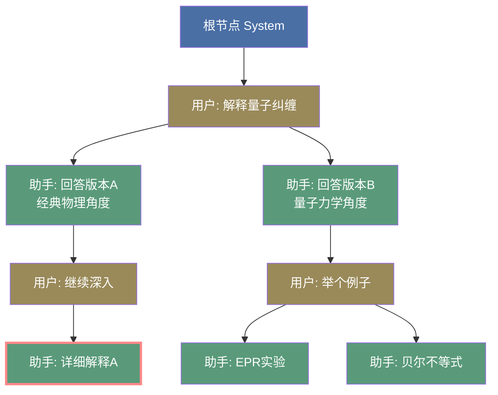
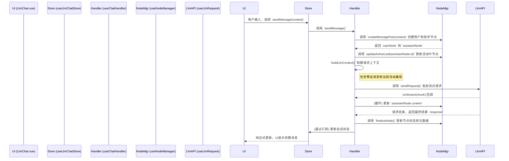

# LLM Chat: 架构与开发者指南

本文档旨在深入解析 `llm-chat` 工具的内部架构、设计理念和数据流，为后续的开发和维护提供清晰的指引。

## 1. 核心概念

`llm-chat` 的核心设计围绕三大概念构建：**树状对话历史**、**会话 (Session)** 和 **智能体 (Agent)**。

### 1.1. 树状对话历史 (Tree-based Conversation History)

与传统的线性对话列表不同，本模块的对话历史是一个**树形结构**。

- **基本单位**: 每一条消息都是一个 `ChatMessageNode` 对象。
- **树形关系**: 每个节点通过 `parentId` 和 `childrenIds` 属性建立父子关系。
- **核心优势**:
  - **非破坏性操作**: 重新生成 (Regenerate) 或编辑 (Edit) 不会覆盖旧消息，而是会创建新的兄弟节点或子节点，形成新的**分支 (Branch)**。
  - **多路径探索**: 用户可以轻松地在不同的对话分支之间切换，探索和比较模型的不同回答。
  - **完整的上下文追溯**: 保证了任何对话路径的上下文都是完整且可追溯的。



**图解**:
- 蓝色节点是**根节点 (System)**，黄褐色节点是**用户消息**，绿色节点是**助手回答**。
- 从 `U1` 出发有两个分支（`A1a` 和 `A1b`），这是对同一个问题的两种不同回答。
- 红色边框的 `A2a` 是当前 **activeLeafId**，表示用户正在查看这条对话路径。
- 切换分支只需要将 `activeLeafId` 改为其他叶节点（如 `A2b1` 或 `A2b2`），UI 就会展示不同的对话历史。

### 1.2. 会话 (ChatSession)

`ChatSession` 是一个独立的对话容器，它封装了一棵完整的消息树。

- **`nodes`**: 一个以 `nodeId` 为键的字典，存储了该会话中所有的 `ChatMessageNode`。
- **`rootNodeId`**: 树的根节点 ID。
- **`activeLeafId`**: **极其重要的属性**。它指向当前对话分支的**叶子节点**，决定了UI上显示哪一条对话路径。用户的任何新消息都会从 `activeLeafId` 指向的节点延续下去。

### 1.3. 智能体 (ChatAgent)

`ChatAgent` 是一个可复用的、封装了特定配置的"对话角色"。

- **配置集合**: 它整合了 LLM Profile (API密钥等)、模型ID、预设消息串和模型参数（如温度、最大Token数）。
- **与会话解耦**: 会话与智能体是松散耦合的。一个会话在创建时会关联一个智能体，但用户可以随时在全局切换智能体，这会影响**所有会话**的**后续**消息生成。每条助手消息的元数据 (`metadata`) 中会记录生成它时所使用的智能体信息。

#### 1.3.1. 预设消息串机制

与传统的单一 System Prompt 不同，`ChatAgent.presetMessages` 是一个完整的消息序列，支持更灵活的 Prompt Engineering：

- **多条消息**：可以包含多条 `system`、`user`、`assistant` 消息
- **Few-shot 示例**：通过预设的 user-assistant 对话对来引导模型风格
- **动态控制**：每条消息可独立启用/禁用（`isEnabled` 属性）

**历史消息占位符**：支持一个特殊的 `type: 'chat_history'` 节点，用于标记实际会话历史的插入位置。

```typescript
// 上下文构建逻辑（简化）
if (hasPlaceholder) {
  messages = [
    ...presetsBeforePlaceholder,  // 占位符前的预设
    ...sessionContext,             // 实际会话历史
    ...presetsAfterPlaceholder,    // 占位符后的预设
  ];
} else {
  messages = [...presets, ...sessionContext];
}
```

这允许实现诸如"后置指令"等高级用法，例如在实际对话后追加 system 消息来强化约束。详见 `AgentPresetEditor.vue` 和 `useChatHandler.ts` 中的实现。

## 2. 架构概览

本模块遵循关注点分离的原则，将状态、逻辑和视图清晰地分开。

- **State (Pinia Stores)**:
  - `useLlmChatStore` (`store.ts`): 管理所有会话 (`sessions`)、当前会话ID (`currentSessionId`) 以及全局加载状态 (`isSending`)。
  - `useAgentStore` (`agentStore.ts`): 管理所有可用的智能体 (`agents`)。
- **Logic (Composables)**:
  - 位于 `composables/` 目录下，封装了所有核心业务逻辑，如节点操作、分支管理、API请求等。这是模块的大脑。
- **View (Vue Components)**:
  - 位于 `components/` 目录下，负责UI渲染和用户交互。`LlmChat.vue` 是主入口，整合了各个子组件。

## 3. 数据流：发送一条新消息

通过 Mermaid 序列图可以清晰地看到发送消息的完整流程。



## 4. 核心逻辑 (Composables)

Composables 是 `llm-chat` 功能的核心，它们各司其职，共同构成了强大的树状对话管理系统。

- **`useNodeManager`**: **树的底层操作者**。它提供原子级别的、与业务无关的节点操作功能，如 `createNode`、`addNodeToSession`、`hardDeleteNode` (级联删除子树)、`getNodePath` 等。它只关心节点和它们之间的父子关系。

- **`useBranchManager`**: **用户的直接交互层**。它基于 `useNodeManager`，提供面向用户操作的高级功能。例如：
  - `switchToSiblingBranch`: 在不同分支间切换。
  - `editMessage`: 原地修改消息内容。
  - `createBranch`: 从现有消息创建新的分支。
  - `deleteMessage`: 调用 `hardDeleteNode` 删除整个分支。

- **`useChatHandler`**: **对话流程的协调者**。它负责处理 `sendMessage` 和 `regenerateFromNode` 的完整逻辑，包括：
  - 调用 `useNodeManager` 创建新节点。
  - 调用 `buildLlmContext` 准备发送给 API 的消息列表。
  - 调用 `useLlmRequest` 发起 API 请求并处理流式响应。
  - 在请求结束后更新节点状态。

- **`useSessionManager`**: **会话的生命周期管理者**。负责会话的创建、加载、删除和持久化。

- **`useAgentStorage` / `useChatStorage`**: **数据的持久化层**。负责将智能体和会话数据写入本地文件系统。

## 5. 数据持久化

为了性能和数据安全，本模块采用**分离式存储策略** (`useChatStorageSeparated`)。

- **索引文件**: 在 `sessions` 目录下有一个 `index.json` 文件，它存储了所有会话的元信息列表（如 `id`, `name`, `updatedAt`）和 `currentSessionId`。
- **会话文件**: 每个会话的完整数据（包含所有 `nodes`）被存储为一个独立的 `session-[id].json` 文件。
- **加载过程**: 应用启动时，首先读取 `index.json` 以快速展示会话列表，当用户点击某个会话时，再异步加载对应的 `session-[id].json` 文件。
- **保存过程**: 对会话的任何修改（如发送消息、切换分支）都会触发对相应 `session-[id].json` 文件的保存，并更新 `index.json` 中的 `updatedAt` 时间戳。

## 6. 关键类型定义 (`types.ts`)

- **`ChatMessageNode`**: 树的基本构建块。
  - `id`, `parentId`, `childrenIds`: 定义了树的结构。
  - `role`, `content`, `status`: 消息的基本信息。
  - `isEnabled`: 一个布尔标记，用于在构建 LLM 上下文时临时“禁用”或“启用”某条消息，是实现复杂上下文控制的关键。
  - `metadata`: 存储额外信息，如使用的模型、Token用量、错误信息等。

- **`ChatSession`**: 对话的容器。
  - `nodes`: `Record<string, ChatMessageNode>`，提供了对所有节点的快速随机访问。
  - `activeLeafId`: 决定了当前对话的“视图”，是实现分支切换的核心。

- **`ChatAgent`**: 可复用的配置模板。
  - `presetMessages`: 一个 `ChatMessageNode` 数组，定义了智能体的系统提示、角色扮演示例等。其中可以包含一个 `type: 'chat_history'` 的特殊节点，用于标记实际对话历史的插入位置，实现了更灵活的上下文构建。
