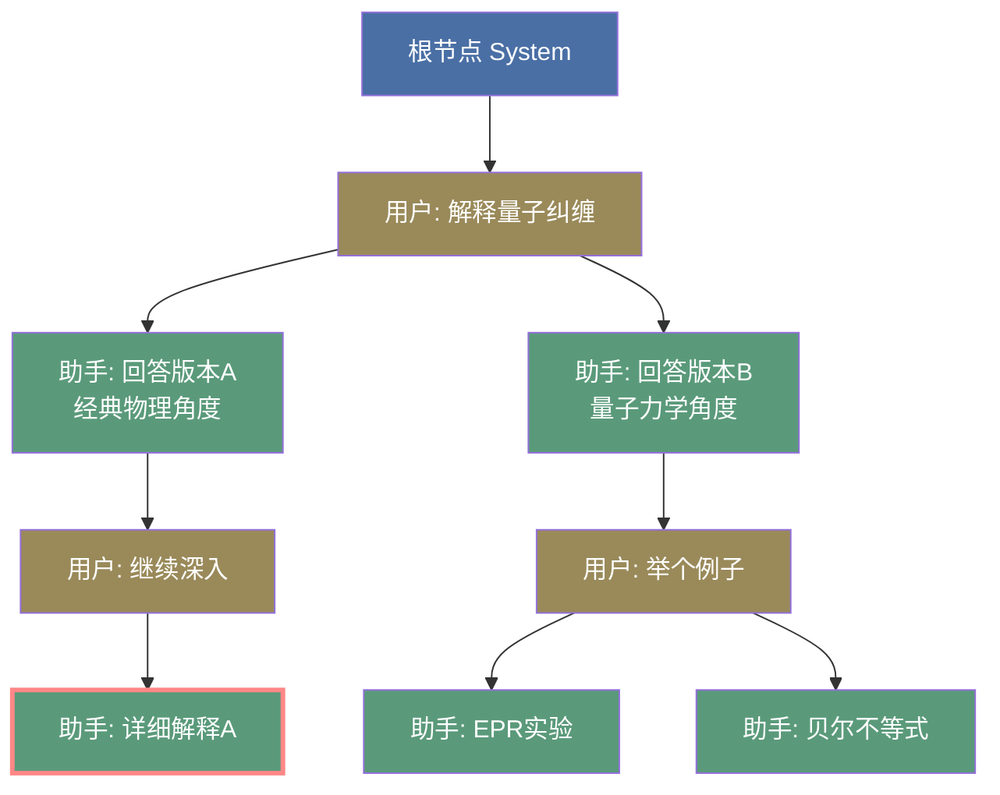
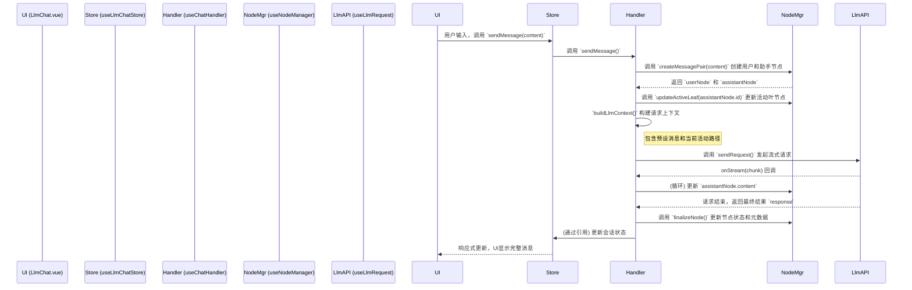

# LLM Chat: 架构与开发者指南

本文档旨在深入解析 `llm-chat` 工具的内部架构、设计理念和数据流，为后续的开发和维护提供清晰的指引。

## 1. 核心概念

`llm-chat` 的核心设计围绕三大概念构建：**树状对话历史**、**会话 (Session)** 和 **智能体 (Agent)**。

### 1.1. 树状对话历史 (Tree-based Conversation History)

与传统的线性对话列表不同，本模块的对话历史是一个**树形结构**。

- **基本单位**: 每一条消息都是一个 `ChatMessageNode` 对象。
- **树形关系**: 每个节点通过 `parentId` 和 `childrenIds` 属性建立父子关系。
- **核心优势**:
  - **非破坏性操作**: 重新生成 (Regenerate) 或编辑 (Edit) 不会覆盖旧消息，而是会创建新的兄弟节点或子节点，形成新的**分支 (Branch)**。
  - **多路径探索**: 用户可以轻松地在不同的对话分支之间切换，探索和比较模型的不同回答。
  - **完整的上下文追溯**: 保证了任何对话路径的上下文都是完整且可追溯的。



**图解**:

- 蓝色节点是**根节点 (System)**，黄褐色节点是**用户消息**，绿色节点是**助手回答**。
- 从 `U1` 出发有两个分支（`A1a` 和 `A1b`），这是对同一个问题的两种不同回答。
- 红色边框的 `A2a` 是当前 **activeLeafId**，表示用户正在查看这条对话路径。
- 切换分支只需要将 `activeLeafId` 改为其他叶节点（如 `A2b1` 或 `A2b2`），UI 就会展示不同的对话历史。

### 1.2. 会话 (ChatSession)

`ChatSession` 是一个独立的对话容器，它封装了一棵完整的消息树。

- **`nodes`**: 一个以 `nodeId` 为键的字典，存储了该会话中所有的 `ChatMessageNode`。
- **`rootNodeId`**: 树的根节点 ID。
- **`activeLeafId`**: **极其重要的属性**。它指向当前对话分支的**叶子节点**，决定了UI上显示哪一条对话路径。用户的任何新消息都会从 `activeLeafId` 指向的节点延续下去。

### 1.3. 智能体 (ChatAgent)

`ChatAgent` 是一个可复用的、封装了特定配置的"对话角色"。

- **配置集合**: 它整合了 LLM Profile (API密钥等)、模型ID、预设消息串和模型参数（如温度、最大Token数）。
- **与会话解耦**: 会话与智能体是松散耦合的。一个会话在创建时会关联一个智能体，但用户可以随时在全局切换智能体，这会影响**所有会话**的**后续**消息生成。每条助手消息的元数据 (`metadata`) 中会记录生成它时所使用的智能体信息。
- **用户档案绑定**: 智能体可以绑定特定的用户档案 (`userProfileId`)，用于在上下文中插入用户身份信息，实现个性化对话。

### 1.4. 用户档案 (UserProfile)

用户档案是一个可复用的用户身份描述，用于在对话中插入用户的背景信息、角色设定等。

- **核心概念**: 用户档案包含用户的描述性文本（如职业、兴趣、技能等），在构建 LLM 上下文时会被插入到对话中。
- **全局与智能体级别**: 既可以设置全局默认档案，也可以在智能体中绑定特定档案。智能体级别的绑定优先级更高。
- **灵活插入**: 通过预设消息中的 `user_profile` 占位符，可以精确控制档案内容的插入位置。
- **存储架构**: 采用与智能体相同的分离式存储策略，索引文件 + 独立档案文件。

### 1.5. 附件系统 (Attachments)

附件系统允许用户在消息中添加文件（图片、文档等），实现多模态对话。

- **基于 Asset 管理**: 使用统一的 Asset 管理系统进行文件存储和去重。
- **优化的加载流程**:
  - **立即预览**: 文件添加后立即显示预览（pending 状态）
  - **异步导入**: 在后台异步导入到存储系统，不阻塞 UI
  - **状态追踪**: 支持 pending、importing、complete、error 四种导入状态
- **智能去重**: 基于文件 SHA256 自动检测和移除重复文件。
- **多文件类型支持**: 支持图片、音频、视频、文档等多种文件类型。

#### 1.3.1. 预设消息串机制

与传统的单一 System Prompt 不同，`ChatAgent.presetMessages` 是一个完整的消息序列，支持更灵活的 Prompt Engineering：

- **多条消息**：可以包含多条 `system`、`user`、`assistant` 消息
- **Few-shot 示例**：通过预设的 user-assistant 对话对来引导模型风格
- **动态控制**：每条消息可独立启用/禁用（`isEnabled` 属性）

**特殊占位符类型**：

1. **`chat_history` 占位符**: 标记实际会话历史的插入位置
2. **`user_profile` 占位符**: 标记用户档案内容的插入位置

```typescript
// 上下文构建逻辑（简化）
const messages = [];

// 1. 处理预设消息（按顺序）
for (const preset of presets) {
  if (preset.type === "chat_history") {
    // 插入实际会话历史
    messages.push(...sessionContext);
  } else if (preset.type === "user_profile") {
    // 插入用户档案内容
    if (userProfile) {
      messages.push({
        role: "system",
        content: `# 用户档案\n\n${userProfile.content}`,
      });
    }
  } else {
    // 普通预设消息
    if (preset.isEnabled !== false) {
      messages.push(preset);
    }
  }
}

// 2. 如果没有 chat_history 占位符，追加会话历史
if (!hasHistoryPlaceholder) {
  messages.push(...sessionContext);
}
```

这允许实现诸如"后置指令"、"用户档案前置"等高级用法。详见 `AgentPresetEditor.vue` 和 `useChatHandler.ts` 中的实现。

## 2. 架构概览

本模块遵循关注点分离的原则，将状态、逻辑和视图清晰地分开。

- **State (Pinia Stores)**:
  - `useLlmChatStore` (`store.ts`): 管理所有会话 (`sessions`)、当前会话ID (`currentSessionId`) 以及全局加载状态 (`isSending`)。
  - `useAgentStore` (`agentStore.ts`): 管理所有可用的智能体 (`agents`)。
  - `useUserProfileStore` (`userProfileStore.ts`): 管理用户档案 (`profiles`) 和全局档案选择 (`globalProfileId`)。
- **Logic (Composables)**:
  - 位于 `composables/` 目录下，封装了所有核心业务逻辑，如节点操作、分支管理、API请求、附件管理等。这是模块的大脑。
  - `useAttachmentManager`: 专门负责消息附件的管理，提供文件添加、移除、验证等功能。
- **View (Vue Components)**:
  - 位于 `components/` 目录下，负责UI渲染和用户交互。`LlmChat.vue` 是主入口，整合了各个子组件。
  - `AttachmentCard.vue`: 附件卡片组件，用于展示和管理单个附件。

## 3. 数据流：发送一条新消息

通过 Mermaid 序列图可以清晰地看到发送消息的完整流程。



## 4. 核心逻辑 (Composables)

Composables 是 `llm-chat` 功能的核心，它们各司其职，共同构成了强大的树状对话管理系统。

### 4.1. 树形对话管理

- **`useNodeManager`**: **树的底层操作者**。它提供原子级别的、与业务无关的节点操作功能，如 `createNode`、`addNodeToSession`、`hardDeleteNode` (级联删除子树)、`getNodePath` 等。它只关心节点和它们之间的父子关系。

- **`useBranchManager`**: **用户的直接交互层**。它基于 `useNodeManager`，提供面向用户操作的高级功能。例如：
  - `switchToSiblingBranch`: 在不同分支间切换。
  - `editMessage`: 原地修改消息内容。
  - `createBranch`: 从现有消息创建新的分支。
  - `deleteMessage`: 调用 `hardDeleteNode` 删除整个分支。

- **`useChatHandler`**: **对话流程的协调者**。它负责处理 `sendMessage` 和 `regenerateFromNode` 的完整逻辑，包括：
  - 调用 `useNodeManager` 创建新节点。
  - 调用 `buildLlmContext` 准备发送给 API 的消息列表（包含附件处理和用户档案插入）。
  - 调用 `useLlmRequest` 发起 API 请求并处理流式响应。
  - 在请求结束后更新节点状态。

### 4.2. 附件管理

- **`useAttachmentManager`**: **附件的完整管理者**。提供附件的添加、移除、验证等功能：
  - **优化的添加流程**: 立即创建 pending 状态的 Asset 用于预览，异步导入到存储系统。
  - **智能去重**: 基于 SHA256 哈希值自动检测和移除重复文件。
  - **状态追踪**: 支持 `pending`、`importing`、`complete`、`error` 四种导入状态。
  - **文件验证**: 检查文件大小、类型、是否存在等。
  - **类型推断**: 自动推断文件的 MIME 类型和 Asset 类型（image/audio/video/document）。

### 4.3. 数据持久化

- **`useSessionManager`**: **会话的生命周期管理者**。负责会话的创建、加载、删除和持久化。

- **`useChatStorage` / `useChatStorageSeparated`**: **会话数据的持久化层**。负责将会话数据写入本地文件系统。

- **`useAgentStorage` / `useAgentStorageSeparated`**: **智能体数据的持久化层**。负责将智能体数据写入本地文件系统。

- **`useUserProfileStorage`**: **用户档案的持久化层**。采用与智能体相同的分离式存储策略：
  - 索引文件 (`user-profiles-index.json`) 存储档案元数据列表。
  - 每个档案独立存储为单独的 JSON 文件 (`user-profiles/{profileId}.json`)。
  - 支持单档案保存 (`persistProfile`) 和批量保存 (`saveProfiles`)。
  - 自动同步索引，发现新增或删除的档案文件。

## 5. 数据持久化

为了性能和数据安全，本模块采用**分离式存储策略**。

### 5.1. 会话存储 (`useChatStorageSeparated`)

- **索引文件**: 在 `sessions` 目录下有一个 `index.json` 文件，它存储了所有会话的元信息列表（如 `id`, `name`, `updatedAt`）和 `currentSessionId`。
- **会话文件**: 每个会话的完整数据（包含所有 `nodes`）被存储为一个独立的 `session-[id].json` 文件。
- **加载过程**: 应用启动时，首先读取 `index.json` 以快速展示会话列表，当用户点击某个会话时，再异步加载对应的 `session-[id].json` 文件。
- **保存过程**: 对会话的任何修改（如发送消息、切换分支）都会触发对相应 `session-[id].json` 文件的保存，并更新 `index.json` 中的 `updatedAt` 时间戳。

### 5.2. 智能体存储 (`useAgentStorageSeparated`)

- **索引文件**: `agents-index.json` 存储所有智能体的元信息列表。
- **智能体文件**: 每个智能体存储为独立的 `agents/{agentId}.json` 文件。
- **优势**: 修改单个智能体只需要写入该智能体的文件，不需要重写整个列表。

### 5.3. 用户档案存储 (`useUserProfileStorage`)

采用与智能体相同的分离式存储架构：

- **索引文件**: `user-profiles-index.json` 存储：
  - 所有档案的元信息列表（`id`、`name`、`icon`、`createdAt`、`lastUsedAt`、`enabled`）
  - 全局档案选择 (`globalProfileId`)
  - 版本号 (`version`)

- **档案文件**: 每个档案存储为独立的 `user-profiles/{profileId}.json` 文件，包含完整的档案数据。

- **智能同步**:
  - 启动时自动扫描档案目录，发现新增文件并加载元数据到索引。
  - 自动移除索引中已删除文件的记录。
  - 保持索引与文件系统的一致性。

- **优化的保存策略**:
  - 单档案保存 (`persistProfile`): 推荐方式，只写入修改的档案文件。
  - 批量保存 (`saveProfiles`): 用于初始化或大规模操作。
  - 内容比较：保存前检查内容是否真的改变，避免不必要的磁盘 I/O。

### 5.4. 附件存储

附件通过统一的 Asset 管理系统进行存储：

- **集中存储**: 所有附件存储在 `assets/` 目录下。
- **自动去重**: 基于 SHA256 哈希值进行去重，相同文件只存储一份。
- **缩略图**: 图片类型自动生成缩略图，存储在 `assets/thumbnails/` 目录。
- **元数据**: Asset 对象包含文件的所有元信息（大小、类型、MIME、路径等）。

## 6. 关键类型定义 (`types.ts`)

### 6.1. 核心消息类型

- **`MessageType`**: 消息类型枚举
  - `"message"`: 普通消息（默认）
  - `"chat_history"`: 历史消息占位符，标记实际会话消息的插入位置
  - `"user_profile"`: 用户档案占位符，标记用户档案内容的插入位置

- **`ChatMessageNode`**: 树的基本构建块
  - `id`, `parentId`, `childrenIds`: 定义了树的结构。
  - `role`, `content`, `status`: 消息的基本信息。
  - `attachments`: 附加到此消息的文件资产列表（`Asset[]`），支持多模态对话。
  - `isEnabled`: 一个布尔标记，用于在构建 LLM 上下文时临时"禁用"或"启用"某条消息，是实现复杂上下文控制的关键。
  - `type`: 消息类型（可选，默认为 `"message"`）。
  - `metadata`: 存储额外信息，如使用的模型、Token用量、错误信息、用户档案信息等：
    - `agentId`, `agentName`, `agentIcon`: 生成此消息时使用的智能体信息（快照）
    - `userProfileId`, `userProfileName`, `userProfileIcon`: 生成此消息时使用的用户档案信息（快照）
    - `profileId`, `modelId`, `modelName`: 使用的 LLM Profile 和模型信息
    - `usage`: Token 使用情况统计
    - `error`: 错误信息
    - `reasoningContent`: 推理内容（DeepSeek reasoning 模式）

### 6.2. 会话与智能体

- **`ChatSession`**: 对话的容器
  - `nodes`: `Record<string, ChatMessageNode>`，提供了对所有节点的快速随机访问。
  - `activeLeafId`: 决定了当前对话的"视图"，是实现分支切换的核心。
  - `displayAgentId`: 用于 UI 展示的智能体 ID（当前活动路径最新助手消息所使用的智能体）。
  - `parameterOverrides`: 会话级别的参数覆盖（可选），用于临时微调智能体的参数。

- **`ChatAgent`**: 可复用的配置模板
  - `profileId`, `modelId`: 使用的 LLM Profile 和模型。
  - `userProfileId`: 绑定的用户档案 ID（可选），如果设置则覆盖全局默认档案。
  - `presetMessages`: 一个 `ChatMessageNode` 数组，定义了智能体的系统提示、角色扮演示例等。其中可以包含：
    - `type: 'chat_history'` 节点：标记实际对话历史的插入位置
    - `type: 'user_profile'` 节点：标记用户档案内容的插入位置
  - `parameters`: LLM 参数配置（温度、最大 Token 等）。

### 6.3. 用户档案

- **`UserProfile`**: 用户身份描述
  - `id`: 档案的唯一标识符
  - `name`: 档案名称
  - `icon`: 档案图标（emoji 或图标路径）
  - `content`: 档案内容（描述性文本，如职业、技能、偏好等）
  - `enabled`: 是否启用（默认为 true），禁用的档案在选择列表中不显示
  - `createdAt`: 创建时间
  - `lastUsedAt`: 最后使用时间

### 6.4. 附件相关

附件基于统一的 `Asset` 类型（定义在 `@/types/asset-management.ts`）：

- **`Asset`**: 资产对象
  - `id`: 资产唯一标识符
  - `type`: 资产类型（image/audio/video/document/other）
  - `mimeType`: MIME 类型
  - `name`: 文件名
  - `path`: 存储路径（相对于 assets 目录）
  - `thumbnailPath`: 缩略图路径（可选）
  - `size`: 文件大小（字节）
  - `importStatus`: 导入状态（pending/importing/complete/error）
  - `originalPath`: 原始文件路径（仅在导入过程中使用）
  - `metadata`: 额外元数据（SHA256、尺寸、时长等）

## 7. 未来展望：与工具生态的融合

`llm-chat` 的未来发展将深度依赖于整个 AIO Hub 的工具生态系统。通过 `TODO.md` 中规划的**工具结构重构**和 **Function Calling** 能力，聊天模块将不再是一个孤立的功能，而是成为整个应用的智能中枢。

### 7.1. 设计原则

在实现工具调用时，将遵循以下核心原则：

- **工具的人性化优先**：所有可供 LLM 调用的工具，首先必须是为人类用户设计、易于直接操作的。这确保了工具的透明性和可用性，避免其沦为 AI 专用的“黑盒”。
- **离线可用性**：工具的设计将优先考虑离线运行的能力，确保在没有网络连接的情况下，核心功能依然可靠。
- **无缝融合**：工具调用的结果（如 API 测试返回的数据、Git 分析生成的图表）能以结构化的方式无缝地融入对话上下文，为用户提供更丰富、更动态的交互体验。

这种设计哲学旨在实现 AI 智能与人类创造力之间的平衡，让 `llm-chat` 成为一个真正强大且可信赖的助手。
