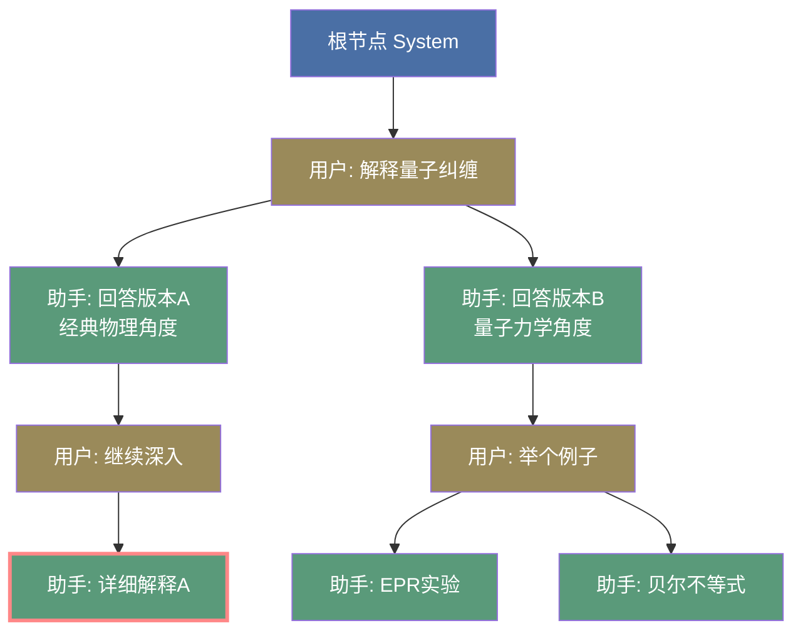

# LLM Chat: 架构与开发者指南

> 最后更新：2026-07-07

本文档是 `llm-chat` 工具的**架构概览**。每个章节只保留核心理念与定位，详细实现请参考 [`docs/architecture/`](./docs/architecture/) 下的专题文档。

## 目录

- [1. 核心概念](#1-核心概念-core-concepts)
- [2. 统一上下文管道系统](#2-统一上下文管道系统)
- [3. 会话区域 UI 架构 (ChatArea)](#3-会话区域-ui-架构-chatarea)
- [4. 架构概览](#4-架构概览)
- [5. 数据流：发送一条新消息](#5-数据流发送一条新消息)
- [6. 核心逻辑 (Composables)](#6-核心逻辑-composables)
- [7. 数据持久化](#7-数据持久化)
- [8. 关键类型定义](#8-关键类型定义)

---

## 1. 核心概念 (Core Concepts)

`llm-chat` 的核心设计围绕多个关键概念构建，这些概念共同实现了一个功能强大且可扩展的对话系统。

### 1.1. 树状对话历史 (Tree-based Conversation History)

与传统的线性对话列表不同，本模块的对话历史是一个**树形结构**。

- **基本单位**: 每一条消息都是一个 `ChatMessageNode` 对象。
- **树形关系**: 每个节点通过 `parentId` 和 `childrenIds` 属性建立父子关系。
- **核心优势**:
  - **非破坏性操作**: 重新生成 (Regenerate) 或编辑 (Edit) 不会覆盖旧消息，而是会创建新的兄弟节点或子节点，形成新的**分支 (Branch)**。
  - **多路径探索**: 用户可以轻松地在不同的对话分支之间切换，探索和比较模型的不同回答。
  - **完整的上下文追溯**: 保证了任何对话路径的上下文都是完整且可追溯的。
- **分支记忆**: 系统会通过 `lastSelectedChildId` 属性记住用户在每个父节点上的最后选择，当返回父分支时，会自动导航到用户上次查看的路径。

详见 [`conversation-tree-and-branching.md`](./docs/architecture/conversation-tree-and-branching.md) 与 [`branch-operations.md`](./docs/architecture/branch-operations.md)。

```mermaid
graph TD
    Root[根节点 System]

    Root --> U1[用户: 解释量子纠缠]
    U1 --> A1a[助手: 回答版本A<br/>经典物理角度]
    U1 --> A1b[助手: 回答版本B<br/>量子力学角度]

    A1a --> U2a[用户: 继续深入]
    U2a --> A2a[助手: 详细解释A]

    A1b --> U2b[用户: 举个例子]
    U2b --> A2b1[助手: EPR实验]
    U2b --> A2b2[助手: 贝尔不等式]

    style Root fill:#4a6fa5,color:#fff
    style U1 fill:#9a8a5a,color:#fff
    style U2a fill:#9a8a5a,color:#fff
    style U2b fill:#9a8a5a,color:#fff
    style A1a fill:#5a9a7a,color:#fff
    style A1b fill:#5a9a7a,color:#fff
    style A2a fill:#5a9a7a,color:#fff
    style A2b1 fill:#5a9a7a,color:#fff
    style A2b2 fill:#5a9a7a,color:#fff

    classDef activeLeaf stroke:#ff8787,stroke-width:3px
    class A2a activeLeaf
```

### 1.2. 会话与收藏夹 (ChatSessionIndex / ChatSessionDetail / Favorites)

会话数据采用**分离式存储策略**（详见 [`data-persistence.md`](./docs/architecture/data-persistence.md)），在类型层面由两个独立结构构成：

- **`ChatSessionIndex`（轻量索引）**: 仅包含会话的元信息，用于侧边栏列表的快速渲染，对应磁盘上的 `sessions-index.json`。
- **`ChatSessionDetail`（完整数据）**: 包含完整的消息树与运行时状态，按需异步加载，对应磁盘上的 `sessions/{sessionId}.json`。

索引层内置**收藏夹功能**：

- **高性能索引级操作**: 收藏状态变更（标记收藏、移入收藏夹）仅在轻量索引层完成，无需读写会话详情文件。`ChatSessionIndex` 包含 `isFavorite` 和 `favoriteFolderId` 字段，收藏夹元数据存储在 `sessions-index.json` 的 `favoriteFolders` 字段中。
- **分类整理**: 支持创建、重命名、删除收藏夹文件夹，以及将会话在文件夹之间拖拽移动。
- **拖拽排序**: 收藏夹文件夹本身支持通过 `vue-draggable-next` 拖拽排序，排序结果持久化到索引文件。
- **筛选联动**: `FilterPanel` 提供"收藏状态"筛选器（全部/仅收藏/未收藏），与搜索和排序功能协同工作。
- **跨窗口同步**: 收藏状态变更通过同步机制实时同步到分离窗口，保持多窗口一致性。

#### 1.2.1. 多会话架构与子管理器 (Multi-Session Sub-Managers)

系统采用多会话架构，支持多窗口 UI 并发操作与后台会话独立执行。核心状态管理（`llmChatStore`）采用职责聚合的设计模式，将复杂的会话控制委托给一组专职的子管理器（`sessionAccess`、`sessionRuntime`、`sessionHistory`、`sessionGeneration`、`sessionLifecycle`），并实现了会话级输入草稿隔离、生成状态只读化以及发送链路与 UI 状态的完全解耦。

详见 [`data-persistence.md`](./docs/architecture/data-persistence.md) 第 3 节与 [`key-types.md`](./docs/architecture/key-types.md)。

### 1.3. 智能体 (ChatAgent)

`ChatAgent` 是一个可复用的、封装了特定配置的"对话角色"。它更像一个**配置预设**，而非一个独立的实体。

- **配置集合**: 整合了 LLM Profile、模型 ID、预设消息串和模型参数。
- **与会话解耦**: 会话与智能体松散耦合，每条助手消息的元数据中记录生成它时所使用的智能体信息。
- **分类与标签**: 支持 `category` 分类系统与 `tags` 标签并行，用于多层次的筛选和管理。
- **私有资产绑定**: 智能体可以携带专属的媒体资产（表情包、背景音乐等），生命周期与智能体完全绑定，详见 [`agent-assets.md`](./docs/architecture/agent-assets.md)。
- **预设消息多模态附件**: 预设消息支持引用智能体资产作为多模态附件（图片、音频、视频等），通过 `PresetAttachmentRef` 声明附件引用关系，在发送时由 `preset-attachment-resolver` 解析为管道附件。编辑器提供 [`PresetAttachmentPicker`](./components/agent/editors/PresetAttachmentPicker.vue) 组件管理附件选择、缩略图预览与音视频试听；预设消息内容编辑使用 `RichCodeEditor` 的 Monaco 模式，并通过 `MacroSelector` / `VariableSelector` / `KBPlaceholderEditor` 进行按钮式插入，不再依赖旧版 CodeMirror 自动补全。导入导出系统会检测悬空附件引用并给出警告，Token 计算器支持按附件类型估算消耗。
- **思考规则、自定义样式、交互偏好**: 通过 `llmThinkRules` / `richTextStyleOptions` / `interactionConfig` 等字段实现高度定制化。

完整字段定义见 [`key-types.md`](./docs/architecture/key-types.md) 第 5 节。

### 1.4. 用户档案 (UserProfile)

用户档案是一个可复用的用户身份描述，用于在对话中插入用户的背景信息、角色设定等。

- **全局与智能体级别**: 既可以设置全局默认档案，也可以在智能体中绑定特定档案（优先级更高）。
- **灵活插入**: 通过预设消息中的 `user_profile` 占位符，可以精确控制档案内容的插入位置。

### 1.5. 附件系统与管道附件抽象层 (Attachments & PipelineAttachment)

附件系统允许用户在消息中添加文件，实现多模态对话。基于统一的 Asset 管理系统进行文件存储和去重，支持图片、视频、音频、文本、文档等多种类型。

为保持管道内部逻辑的清晰与独立，系统使用**管道附件抽象层**：

- **`PipelineAttachment` 类型**: 管道内部使用轻量级 `PipelineAttachment` 类型表示附件，独立于全局 `Asset` 类型，管道逻辑不直接依赖资产管理系统。
- **统一二进制读取**: [`getAttachmentBuffer()`](./core/context-utils/attachment-binary.ts) 工具函数统一处理 `inline`（Base64 内嵌）、`asset-library`（资产库引用）和 `agent-private`（智能体私有资产）三种数据源的二进制读取。
- **多源转换**: 提供 `fromAsset` / `toPipelineAttachment` 转换函数，实现 Asset 与 PipelineAttachment 之间的双向转换。

详见 [`attachment-system.md`](./docs/architecture/attachment-system.md)

### 1.6. 上下文分析器 (Context Analyzer)

上下文分析器是一个强大的调试和优化工具，用于可视化和分析任意消息节点的完整 LLM 请求上下文。

- **完整上下文预览**: 重建指定消息节点实际发送给 LLM 时的完整请求上下文。
- **智能体推断**: 自动从消息节点的元数据推断该消息使用的智能体配置。
- **多维度展示**: 提供结构化视图、原始请求视图和内容分析图表。

### 1.7. 宏系统 (Macro System)

宏系统是一个强大的动态内容生成引擎，它允许在智能体的预设消息、用户输入等任何地方嵌入可执行的占位符。详细的宏定义与用法请参考 [`MACRO.md`](./macro-engine/MACRO.md)。

- **三阶段执行管道**: `PRE_PROCESS` → `SUBSTITUTE` → `POST_PROCESS`。
- **9 大类内置宏**: `core` / `datetime` / `variables` / `functions` / `system` / `assets` / `tools` / `knowledge` / `cssVariables`。

### 1.8. 撤销/重做系统 (Undo/Redo System)

为了提供类似文本编辑器的流畅体验，系统实现了会话级别的撤销/重做功能，采用**快照 + 增量**的混合存储策略，支持编辑、删除、切换分支、节点移动、分支嫁接等多种操作。

详见 [`undo-redo-system.md`](./docs/architecture/undo-redo-system.md)。

### 1.9. SillyTavern 兼容性

为了利用社区丰富的角色资源，系统实现了对部分 SillyTavern 格式配置的导入兼容，支持解析 V2/V3 格式的角色卡（.json/.png）和预设文件（`prompt_order` → `injectionStrategy` 映射）。

详见 [`sillytavern-compatibility.md`](./docs/architecture/sillytavern-compatibility.md)。

### 1.10. 虚拟时间线 (Virtual Timeline)

为沉浸式角色扮演（RP）提供独立于现实世界的时间维度。

- **双时钟系统**: 每个智能体可以拥有独立的虚拟时钟。
- **流速控制**: 支持设定虚拟时间相对于现实时间的流速（例如：现实1小时 = 游戏内1天）。
- **宏集成**: 系统的时间宏（如 `{{date}}`, `{{time}}`）会自动感知当前的虚拟时间配置，输出虚拟世界的时间。

### 1.11. 模型参数配置系统 (Model Parameter System)

为了应对日益复杂的模型能力差异，系统构建了一套分层、动态且高度可扩展的参数配置引擎，实现了从基础采样、结构化输出、原生工具调用到多模态输出、思考能力、上下文后处理等全方位控制。

详见 [`model-parameter-system.md`](./docs/architecture/model-parameter-system.md)。

#### 1.11.1. 推理状态精确回放与空回复诊断 (Reasoning Artifacts & Diagnostics)

系统支持针对 DeepSeek、Gemini 和 OpenAI Responses 等提供商专属推理状态的精确回放机制（`LlmReasoningArtifact`），实现数据与展示的分离。同时，针对 API 响应成功但无可见文本的异常场景，集成空回复诊断系统（`emptyResponseDiagnostics`），通过启发式扫描检测隐藏文本并在消息元数据中进行友好展示。

详见 [`model-parameter-system.md`](./docs/architecture/model-parameter-system.md) 第 4、5 节。

### 1.12. 知识库系统 (Knowledge Base / RAG)

系统集成了一套面向"条目式记忆"的 RAG 能力（非文档分片），允许智能体按需调用一个或多个外部知识库。

- **占位符语法**: `【kb::kbName::limit::minScore::mode::modeParams::engineId】`（`kb` 与 `knowledge` 等价；除 `mode` 外所有段均可省略，缺省时回退到 Agent / 全局默认值）。
- **扫描范围**: 仅扫描 `sourceType !== 'session_history'` 的消息（预设、深度/锚点注入等），**对话历史不参与被动召回**——历史中的主动检索请走工具调用，定位则交给深度注入的预设。
- **激活模式**:
  - `always`：每次构建都激活。
  - `gate`：扫描最近 `gateScanDepth` 条历史，命中任一关键词才激活。
  - `turn`：按已发出的 user 消息计数取模，控制召回频率。
  - `static`：直接加载指定条目；`static::all` 可加载某个库（或全部库）的全部已启用条目，绕过检索器。
- **自动注入 (Auto Inject)**: 当 Agent 开启 `knowledgeBaseConfig.autoInjectIfMacroMissing` 时，未被手动占位符引用的 binding 会**按 binding 粒度自动注入**到 `context_head`（System 末尾，无 System 则插入独立 user 消息）或 `before_last_user` 位置；用户写一个无名 `【kb】` 即视为"全量接管"，跳过所有自动注入。
- **检索引擎**: `vector`（向量）/ `keyword`（关键词）/ `hybrid`（混合）三选一，优先级为 **宏参数 > Agent 默认 > 全局默认**。
- **向量空间融合查询**: 取最近 `contextWindow` 轮历史，**分别提取 user 和 AI 文本** → 分别 embed → 在向量空间按 `0.7 / 0.3` 加权平均得到查询向量；user 侧文本先经查询预处理管线（Markdown/HTML/占位符清洗 → `Intl.Segmenter` 分词 → 停用词过滤 → Tag 池 n-gram 匹配），关键词检索使用清洗后文本，向量检索使用融合向量。
- **后端 LRU 检索缓存**: 检索结果缓存位于 Rust 后端（[`kb_retrieval_cache_*`](src-tauri/src/knowledge/commands/retrieval_cache.rs:1) 系列命令），**全局共享**；缓存键由 `query + kbIds + tags + limit + minScore + engineId + modelId` 计算 SHA-256 得到，任一参数变化即失效。Embedding 向量缓存由 `vectorCacheManager` 独立管理。
- **结果约束**: 召回后按 `maxRecallChars` 累加截断（超出则丢弃后续），按 `resultTemplate` 渲染为最终注入文本，空结果回退到 `emptyText`。

### 1.13. 搜索系统 (Search System)

为海量对话和智能体提供了毫秒级的全文检索能力。前端通过 `useLlmSearch`，后端通过 Tauri command `search_llm_data_stream` **以流式通道（Channel）边搜边推送结果**，显著提升搜索响应速度。支持 `agent` / `session` / `all` 三种作用域和 `exact` / `and` / `or` 三种匹配模式。

- **流式取消**: 支持通过 `cancel_llm_chat_search` 命令取消正在进行的搜索，`useLlmSearch` 通过 `activeSearchRunId` 追踪运行状态，忽略已过期的搜索结果事件，避免连续快速输入时产生竞态条件。
- **结果数量控制**: 后端使用原子操作精确控制结果数量，搜索任务在达到用户配置的最大结果数后自动停止扫描，避免结果超限。

详见 [`search-system.md`](./docs/architecture/search-system.md)。

### 1.14. 翻译系统 (Translation System)

为了打破语言障碍，系统集成了原生的多语言翻译能力，支持消息内容和用户输入的一键翻译。

- **双向翻译**: 输入翻译 + 消息翻译。
- **智能保护**: 翻译过程中会自动识别并保护 XML 标签（如 `<think>...</think>`）。
- **显示模式**: 原文 / 译文 / 双语对照。
- **独立配置**: 翻译功能拥有独立的模型配置、提示词模板和目标语言设置。

### 1.15. 上下文压缩 (Context Compression)

随着对话长度的增加，上下文窗口限制和 Token 成本成为主要瓶颈。上下文压缩系统通过智能摘要技术解决这一问题。

- **非破坏性压缩**: 压缩操作会生成一个新的**压缩节点**，包含 LLM 生成的摘要，并隐藏被压缩的原始消息节点。
- **触发机制**: 由 `triggerMode`（`token` / `count` / `both`）与 `autoTrigger` 两个维度共同决定。
- **保护区**: 始终保留最近 N 条消息不被压缩。
- **可逆性**: 原始消息节点并未被删除，用户可以随时展开查看或回滚。

详见 [`context-compression.md`](./docs/architecture/context-compression.md)。

### 1.16. 消息数据编辑器 (Message Data Editor)

为高级用户和开发者提供了一个强大的调试工具，允许直接查看和修改任意消息节点的底层 JSON 数据结构。基于 Monaco 引擎，支持 JSON 语法校验、核心字段保护、专属撤销标签等。

详见 [`message-data-editor.md`](./docs/architecture/message-data-editor.md)。

### 1.17. 智能体资产 (Agent Assets)

为了增强智能体的表现力和沉浸感，系统支持智能体携带专属的私有媒体资产。

- **私有化存储**: 资产存储在智能体的专属目录下（`assets/`），确保数据的自包含性。
- **引用协议 (`agent-asset://`)**: 自定义协议，格式为 `agent-asset://{group}/{id}.{ext}`，支持 HTML / Markdown 行内渲染。
- **资产分组**: 支持自定义分组（如 `stickers`, `bgm`, `scenes`）。
- **宏集成**: 通过 `{{assets}}` 宏向 LLM 注入可用资产列表及引用格式说明。

详见 [`agent-assets.md`](./docs/architecture/agent-assets.md) 与 [`asset-macro-examples.md`](./docs/architecture/asset-macro-examples.md)。

### 1.18. 快捷操作 (Quick Actions)

快捷操作允许用户在输入框中通过点击按钮快速执行预定义的文本包装或指令发送。

- **类世界书管理**: 采用多级关联机制（全局、智能体、用户档案），支持按组管理。
- **模板化注入**: 支持 `{{input}}` 占位符，可将输入框选中的内容（或全文）包装进特定的 HTML 标签或指令中。
- **自动发送**: 支持配置点击后立即发送，提升操作效率。

### 1.19. 续写与补全功能 (Continue & Completion)

利用 LLM 的预测能力，系统提供了多场景的内容延续功能。

- **助手续写 (Assistant Continue)**: 利用 DeepSeek 的 `prefix` 或 Claude/Gemini 的 `prefill` 特性，让模型从现有文本末尾继续生成。
- **输入框补全 (Input Copilot)**: 在输入框内一键触发 AI 协助补全后续句子。
- **灵感接力**: 允许 AI 站在用户视角继续书写 User 消息的内容。

详见 [`continue-feature.md`](./docs/architecture/continue-feature.md)。

### 1.20. 导入、导出与迁移系统

确保用户数据的可流动性和系统的可维护性。

- **多格式支持**: 支持将会话、智能体、世界书、快捷操作导出为 JSON、Markdown 或 Zip 压缩包。
- **智能迁移**: `agentMigrationService` 负责处理不同版本间的配置结构差异，确保旧版 Agent 能够平滑升级到新架构。
- **资产打包**: 导出智能体时，会自动扫描并包含其引用的所有私有资产。

### 1.21. 工具调用系统 (Tool Calling System)

为了增强智能体的交互能力，系统实现了一套完整的工具调用流程。

- **分层审批策略**: `Auto`（自动批准已批准工具）/ `Manual`（所有调用均需手动批准）。
- **执行控制**: 支持 `parallelExecution` 和 `maxIterations` 防止模型陷入无限工具调用循环。
- **状态追踪**: 消息节点通过 `toolCallsRequested` 和 `toolCall` 元数据记录调用的参数、状态、耗时及结果。
- **VCP 协议支持**: 纯文本结构适用于所有能输出文本的模型，不挑 API 支持度。
- **角色兼容性**: 提供 `convertToolRoleToUser` 选项，将 `tool` 角色消息转换为 `user` 角色，以适配不支持原生工具角色的模型。

### 1.22. 技能系统集成 (Skill System Integration)

系统通过 `skill-manager` 模块提供对 Agent Skills 规范的支持，将外部 Skill 包作为一种特殊的工具能力注入到对话中。

- **渐进式披露 (Progressive Disclosure)**: 初始仅向 LLM 展示 Skill 的摘要，只有当模型决定调用该 Skill 时才返回完整指令。
- **工具桥接**: `SkillManagerProxy` 充当 Skill 能力与 `tool-calling` 系统之间的桥梁。
- **`skill_read_file` 资源感知工具**: 模型可以通过通用工具按需读取 Skill 目录内的具体文档或代码。

详见 [`skill-integration.md`](./docs/architecture/skill-integration.md)。

### 1.23. 性能监控与指标

系统实时收集并展示 LLM 请求的关键性能指标，帮助用户评估模型响应质量。

- **TTFT (Time to First Token)**: 记录从请求发送到接收到第一个 Token 的耗时。
- **TPS (Tokens Per Second)**: 计算生成过程中的平均速度。
- **Token 统计**: 区分 `promptTokens` 和 `completionTokens`，并提供本地估算功能。

### 1.24. 插件化设置系统

为了保持核心逻辑的简洁并支持功能扩展，系统实现了一套声明式的设置注入机制，外部模块可以动态向聊天设置对话框中注入新的配置分区或配置项。

详见 [`plugin-settings-system.md`](./docs/architecture/plugin-settings-system.md)。

### 1.25. 世界书系统 (Worldbook System)

世界书是一个基于关键词触发的动态背景知识库，专门用于增强角色扮演的连贯性。

- **多级关联**: 支持全局世界书和智能体私有世界书。
- **精准触发**: 采用高性能的关键词扫描算法，在构建上下文时实时匹配消息内容并注入关联条目。
- **管理界面**: 提供独立的世界书管理器，支持条目的分类、批量编辑和多格式导入。

### 1.26. 文件路径转附件 (File Path to Attachment Conversion)

为了方便用户处理包含本地资源的外部内容（如从 QQ、微信等聊天软件粘贴的消息记录），系统提供了一套智能的路径转换与渲染映射机制。

- **一键转换**: 输入框工具栏提供"路径转附件"功能，自动识别 `file://` 协议或本地绝对路径，并替换为 `【file::assetId】` 占位符。
- **渲染映射**: 消息渲染阶段自动将 `file://` 链接转换为安全资源 URL，绕过浏览器沙箱限制。

详见 [`qq-record-workflow.md`](./docs/architecture/qq-record-workflow.md) 与 [`llm-chat-placeholder-feature.md`](./docs/architecture/llm-chat-placeholder-feature.md)。

### 1.27. 会话变量系统 (Session Variable System)

会话变量系统是一套与宏引擎并行、面向"剧情数值/状态机"场景设计的轻量级状态管理机制。它允许在普通消息正文中通过 `<svar>` 自闭合 XML 标签直接声明状态变更，并支持沿对话历史**确定性回溯**变量状态。

详见 [`session-variable-system.md`](./docs/architecture/session-variable-system.md)。

### 1.28. 上下文后处理管道 (Context Post-Processing Pipeline)

上下文后处理管道是消息送达 LLM 之前的**最后一道格式适配层**，负责把统一上下文管道前段输出的线性消息列表整理成各家 Provider 都能接受的形态。内置 4 条子规则：合并 System 到头部、合并连续相同角色、转换 System → User、确保角色交替。

详见 [`context-post-processing.md`](./docs/architecture/context-post-processing.md)。

### 1.29. 图片压缩 (Image Compression)

图片压缩是发送图片附件给 LLM 之前的**用户侧可选优化层**，由 `LlmParameters.imageCompression` 配置驱动，在上下文管道末端的 `asset-resolver` 内执行。

详见 [`image-compression.md`](./docs/architecture/image-compression.md)。

---

## 2. 统一上下文管道系统

统一上下文管道是 `llm-chat` 处理 LLM 请求的核心引擎。它是一个单一、可配置、按优先级执行的处理器流水线，负责将复杂的会话树结构转换为 LLM API 可接受的线性消息列表。

### 2.1. 系统概述

- **单一数据流**: 所有处理步骤（加载、正则、注入、转写、截断、格式化、附件转换）都在同一个管道中按顺序执行，消除了以往分散处理带来的逻辑冲突。
- **元数据保留**: 在管道执行的大部分阶段，消息保持包含附件引用的"中间格式" (Intermediate Format)，直到最后一步才由资源解析器转换为最终的 Base64 或 URL 格式。
- **灵活配置**: 所有处理器都实现了统一的 `ContextProcessor` 接口，支持独立的启用/禁用、优先级排序和错误处理。

### 2.2. 管道执行顺序（11 个核心处理器）

| #   | Priority | 处理器           | 主要职责                                                                                         |
| --- | -------- | ---------------- | ------------------------------------------------------------------------------------------------ |
| 1   | 100      | 会话加载器       | 从会话树提取活跃路径，转换为线性中间消息列表                                                     |
| 2   | 110      | 异步任务处理器   | 扫描 `tool` 角色消息中的 `taskId`，从 `asyncTaskStore` 拉取最新状态                              |
| 3   | 200      | 正则处理器       | 按 Global → Agent → User 三层配置执行替换                                                        |
| 4   | 250      | 转写与文本提取器 | 处理音视频/文档附件，解析 `【file::assetId】` 占位符                                             |
| 5   | 300      | 世界书处理器     | SillyTavern 风格的关键词扫描与条目注入                                                           |
| 6   | 400      | 注入组装器       | 处理预设消息：宏 → 分类 → 深度/锚点注入 → 预设附件解析 → 与历史消息组装                          |
| 7   | 450      | 知识库处理器     | 处理 `【kb::…】` 占位符与 `knowledgeBaseConfig` 的自动注入                                       |
| 8   | 500      | 会话变量处理器   | 解析 `<svar>` 标签并替换 `$[path]` / `$[svars::format]`                                          |
| 9   | 600      | Token 限制器     | 智能预算分配，预设保底，历史从最旧开始截断                                                       |
| 10  | 800      | 消息格式化       | 统一调度 4 个子格式化规则（合并 System / 合并连续角色 / 转换 System / 确保交替）                 |
| 11  | 10000    | 资源解析器       | 基于 `PipelineAttachment`，通过 `getAttachmentBuffer()` 统一读取附件二进制数据并转为 API content |

完整的管道架构、各处理器细节、Token 截断算法、配置合并策略等详见 [`context-pipeline.md`](./docs/architecture/context-pipeline.md)。

### 2.3. 正则管道系统

正则管道为消息内容提供了强大的动态清洗和增强能力，采用 **Global → Agent → User** 三层配置体系，支持 `render`（渲染）/ `request`（请求）双管道集成，以及按角色、深度、应用阶段的精细过滤。

详见 [`chat-regex-pipeline.md`](./docs/architecture/chat-regex-pipeline.md)。

### 2.4. 转写与文本提取系统

转写系统旨在弥合多模态资产与纯文本模型之间的鸿沟。该系统作为独立工具运行，`llm-chat` 通过 `transcriptionRegistry` 与外部转写工具交互。

- **智能策略**: 根据当前对话模型的模态能力自动决定是否触发转写。
- **强制转写阈值**: 支持配置 `forceTranscriptionAfter`，在长对话中强制对旧消息的附件进行转写。
- **多模态转写模式**: 支持在 LLM 智能解析与 OCR 纯文字提取之间切换（如 PDF 转图片后调用 Smart OCR），并支持图片转写切换为本地 OCR 引擎模式（如 Tesseract/Native/Cloud/Plugin）作为视觉大模型（VLM）的平替方案。
- **附件卡片操作**: `AttachmentCard` 支持查看/编辑、重新生成、删除、取消转写，并根据"将作为文本发送 / 当前模型可直接处理"区分视觉状态；输入区附件列表提供一键转写未转写、智能转写未转写、强制重新转写所有（无视当前转写状态重新发起任务）和停止所有任务。

详见 [`attachment-system.md`](./docs/architecture/attachment-system.md) 第 3、5 节。

- **文本提取**: 对于 `.txt`, `.md`, `.js` 等纯文本附件，系统会自动读取其内容并拼接到消息中。

### 2.5. 高级上下文注入策略

为了提供类似 SillyTavern 的高级角色扮演体验，注入组装器实现了一套声明式的消息注入机制。

- **深度注入 (Depth)**: 将消息插入到距离对话历史末尾 N 层的位置。
- **锚点注入 (Anchor)**: 将消息精准地插入到系统锚点（如 `chat_history`, `user_profile`）的前面或后面。
- **顺序控制 (Order)**: 通过优先级数字，决定在同一点注入多条消息时的最终顺序。

### 2.6. 上下文截断与管理

Token 限制器位于注入组装器之后（priority 600）、消息格式化之前运行，能感知到所有将被发送的消息（包括刚刚注入的预设、档案、知识库片段、会话变量替换结果）。

- **「必须保留」判定**: 按 `sourceType` 区分，所有 `!== 'session_history'` 的消息均视为必须保留。
- **预算分配**: 预设消息全部保留 → 剩余空间分配给历史 → 从最新到最旧倒序遍历。
- **部分保留**: 通过 `retainedCharacters > 0` 支持长消息的「摘要式」保留。
- **统计输出**: 写入 `tokenLimiterStats` 供「上下文分析器」预览面板使用。

详见 [`context-pipeline.md`](./docs/architecture/context-pipeline.md) 第 4.5 节。

---

## 3. 会话区域 UI 架构 (ChatArea)

`ChatArea` 是用户与 LLM 进行交互的核心界面，它集成了消息展示、输入管理、树状导航和多窗口同步等复杂功能。

核心要素：

- **布局**: 采用 **Flex Column** 布局，头部悬浮（`position: absolute`），主内容区与输入框靠 Flex 自然分配空间。
- **消息列表**: 使用 **CSS 原生虚拟渲染**（`content-visibility: auto`），无需第三方虚拟滚动库即可流畅承载数千条消息。通过 `MutationObserver` 动态注入 `content-visibility` 样式，避免 CSS 优化器在生产构建时将其移除；在 keep-alive 切换时正确管理消息可见性观察器的生命周期，确保滚动定位稳定。
- **对话树图**: 基于 Vue Flow + D3.js 实现的可视化工具，支持三种布局模式（树状/物理/静态）与子树拖拽嫁接。性能设计要点：
  - **O(1) 路径判定**: 通过显式字段投影与预计算的 `activePathSet` 和 `nodeDepthMap`，路径判定和深度计算均为 O(1)。
  - **响应式瘦身**: 缓存节点正则扫描结果，移除 `data._node` 死负载，缩小响应式遍历范围。
  - **按需挂载与图级反缩放**: Menubar 和重对话框（`ExportBranchDialog`、`MessageDataEditor`）采用 `v-if` 条件渲染，仅在悬停或打开时挂载；反缩放计算由 `FlowTreeGraph` 图容器统一维护 CSS 变量 `--graph-menubar-scale`，各节点无需独立更新 inline style。
  - **D3 热路径**: Tick 回调及热路径使用 `Map` 索引，子树拖拽使用 `Set` 判定；HUD 隐藏时暂停 FPS 统计 RAF 循环；主题调色板变更前做等值比较，防止无效触发。
- **输入编辑**: 支持 **CodeMirror 6** 与**原生 textarea** 双引擎驱动。原生 `ChatTextareaEditor` 组件绕过 Chromium 149+ 在 contenteditable 元素上首次 IME 合成事件被静默抑制的问题，与 CodeMirror 接口完全对齐，用户可在设置中自由切换。详见 [`chromium-149-ime-bug.md`](../../../docs/architecture/chromium-149-ime-bug.md)。
- **输入草稿与拖放增强**: 支持跨会话的草稿剪切与粘贴（全局草稿剪贴板同步），以及 H5 原生文件拖放（`useFileDrop` 双信号融合去重，支持直接导入 File 对象）。
- **面板尺寸调整**: 采用通用的 `useResizable` 组合函数，支持四个方向的尺寸调整，自动管理鼠标事件、光标样式与面板宽度配置的持久化，统一各工具面板的拖拽行为。
- **富文本渲染**: 消息内容由 `src/tools/rich-text-renderer/` 负责，代码块展示固定使用 CodeMirror + `IntersectionObserver` 延迟初始化，旧的 Monaco/CodeMirror 双引擎代码块设置已移除。
- **窗口分离**: 支持被拽出成为独立的 Tauri 浮动窗口，采用**主从架构**通过 `useWindowSyncBus` 进行跨窗口同步。
- **气泡布局模式**: 支持在**卡片模式**和**气泡模式**之间无缝切换，通过 `BubbleLayoutConfig` 配置驱动。

详见 [`chat-area-ui.md`](./docs/architecture/chat-area-ui.md)。

---

## 4. 架构概览

本模块遵循关注点分离的原则，将状态、逻辑和视图清晰地分开。

- **State (Pinia Stores & Singletons)**:
  - `useLlmChatStore`: 核心业务状态 Facade，内部挂载并展开多个子管理器：
    - `sessionAccess`: 会话标识解析与 active path 计算。
    - `sessionRuntime`: 生成节点、`AbortController` 与发送队列管理。
    - `sessionHistory`: 会话级撤销/重做历史栈。
    - `sessionLifecycle`: 会话创建、删除、切换、收藏等生命周期管理。
  - `isCurrentSessionGenerating`: 确保生成状态指示器仅对当前会话生效，不受后台其他会话生成任务干扰。
  - `useAgentStore`: 智能体配置状态。
  - `useUserProfileStore`: 用户档案状态。
  - `useChatInputManager`: 会话级输入框草稿与附件状态管理。
  - `useLlmChatUiState`: UI 状态（侧边栏折叠等）。
- **Logic (Composables)**:
  - `composables/` 目录下封装了通用的核心业务逻辑。
  - 遵循**逻辑物理聚合**原则，特定组件的复杂逻辑（如树图）封装在组件目录下的 `composables/` 中。
  - **[`useStreamingMessageSources`](./composables/chat/useStreamingMessageSources.ts)**：管理独立的流式消息源，将流式内容的实时渲染通道与降频持久化通道解耦（详见第 5 节数据流）。
- **View (Vue Components)**:
  - `components/` 目录下负责 UI 渲染。
  - `src/tools/rich-text-renderer/` 负责消息内容的富文本渲染。
- **Sync (Engine)**:
  - `useLlmChatSync`: 负责跨窗口的状态同步和操作代理。

---

## 5. 数据流：发送一条新消息

```mermaid
graph TD
    subgraph A [用户交互层]
        direction LR
        A1(用户输入文本/附件) --> A2(点击发送)
    end

    subgraph B [useChatHandler - 指挥中心]
        B1(创建消息节点) --> B2(清空输入框)
        B2 --> B3(清空撤销栈)
        B3 --> B4(调用执行器 `executeRequest`)
    end

    subgraph C [useChatExecutor - 执行器]
        C1(创建 PipelineContext) --> C2(调用统一管道)
    end

    subgraph D [UnifiedPipeline - 统一上下文管道]
        direction TB
        D1[1. 会话加载器 100]
        D2[2. 异步任务处理器 110]
        D3[3. 正则处理器 200]
        D4[4. 转写与文本提取器 250]
        D5[5. 世界书处理器 300]
        D6[6. 注入组装器 400]
        D7[7. 知识库处理器 450]
        D8[8. 会话变量处理器 500]
        D9[9. Token 限制器 600]
        D10[10. 消息格式化 800]
        D11[11. 资源解析器 10000]

        D1 --> D2 --> D3 --> D4 --> D5 --> D6 --> D7 --> D8 --> D9 --> D10 --> D11
    end

    subgraph E [LlmAPI - 请求发送]
        E1(发送流式/非流式请求)
    end

    subgraph F [useChatResponseHandler - 响应处理]
        F1(处理流式数据) --> F2{是否为流式输出?}
        F2 -- 是 --> F3[\"实时渲染通道\n→ 写入 StreamSource 订阅器\"]
        F2 -- 是 --> F4[\"降频持久化通道\n→ 定时刷新到节点内容\"]
        F2 -- 否 --> F5[直接更新节点内容]
        F3 --> F6(最终化节点状态)
        F4 --> F6
        F5 --> F6
        F6 --> F7(完成并释放 StreamSource)
        F7 --> F8(异步触发上下文压缩)
    end

    A2 --> B1
    B4 --> C1
    C2 --> D
    D11 --> E1
    E1 --> F1
```

---

## 6. 核心逻辑 (Composables)

`llm-chat` 把核心业务逻辑封装在多个 Composables 中，遵循单一职责原则。主要职责域：

- **树形对话管理**: `useNodeManager`（底层操作）/ `useBranchManager`（用户交互层）。
- **对话处理核心**: `useChatHandler`（协调者）/ `useChatExecutor`（执行器入口）/ `useSingleNodeExecutor`（单次请求）/ `useToolCallOrchestrator`（工具调用编排）/ `useChatResponseHandler`（响应处理）/ `useStreamingMessageSources`（流式消息源管理，将实时渲染与持久化写入解耦）。
- **上下文构建**: `useContextPipelineStore`（管道管理）/ `useContextCompressor`（压缩器）/ `buildPreviewDataFromContext`（预览构建）。
- **附件与输入**: `useAttachmentManager` / `useChatInputManager` / `useTranscriptionManager`。
- **会话、工具与同步**: `useSessionManager` / `useLlmChatSync` / `useTopicNamer` / `useModelSelectDialog` / `useAnchorRegistry`。
- **宏处理引擎**: `MacroProcessor` / `MacroRegistry` / `initializeMacroEngine` / `createMacroContext` / `extractContextFromSession`（**注意：宏引擎以纯类形式提供，不存在 `useMacroProcessor` composable**）。
- **历史记录**: `useSessionNodeHistory`。
- **导出与翻译**: `useExportManager` / `useTranslation`。
- **渲染引擎集成**: `RichTextRenderer`（外部模块，详见 [`rich-text-renderer/ARCHITECTURE.md`](../rich-text-renderer/ARCHITECTURE.md)）。
- **树图逻辑**: `useFlowTreeGraph` / `useGraphD3Simulation` / `useGraphConnectionPreview` / `useGraphSubtreeDrag` / `graphContentUtils`。

每个模块的职责与实现细节详见 [`composables-reference.md`](./docs/architecture/composables-reference.md)。

---

## 7. 数据持久化

为了性能和数据安全，本模块采用**分离式存储策略**，将索引和数据文件分开存储。

- **会话存储**: `sessions-index.json`（索引，含收藏夹元数据 `favoriteFolders`）+ `sessions/{sessionId}.json`（完整数据）。收藏状态变更仅修改索引层，无需读写会话详情文件，确保高性能。
- **智能体存储**: `agents-index.json`（索引）+ `agents/{agentId}/`（独立目录，含 `agent.json` / 头像 / 私有 `assets/`）。
  - **手动刷新**: 支持通过 `refreshAgentFromFile` 从磁盘重新读取单个智能体并同步索引元数据，用户可在 UI 中选择从配置文件手动刷新，无需重启应用或等待自动扫描。

详细的目录结构、加载过程、历史迁移逻辑详见 [`data-persistence.md`](./docs/architecture/data-persistence.md)。

---

## 8. 关键类型定义

`llm-chat` 中最常被引用的核心类型：

- **`ChatMessageNode`**: 树的基本构建块（含 `id` / `parentId` / `childrenIds` / `role` / `content` / `status` / `attachments` / `isEnabled` / `injectionStrategy` / `metadata` 等）。
- **`ChatSessionIndex` / `ChatSessionDetail`**: 会话的轻量索引 / 完整数据。
- **`HistoryEntry` & `HistoryDelta`**: 撤销/重做的历史记录类型。
- **`ChatAgent`**: 可复用的智能体配置模板（含预设、参数、知识库、工具、私有资产、世界书、虚拟时间等多达 20+ 个字段）。
- **`InjectionStrategy`**: 消息注入策略（depth / advanced_depth / anchor 等）。
- **`PipelineAttachment`**: 管道内部轻量级附件表示，独立于全局 `Asset` 类型，通过 `getAttachmentBuffer()` 统一处理 inline / asset-library / agent-private 三种数据源。
- **`PresetAttachmentRef`**: 预设消息中的多模态附件引用结构，通过 `assetId` 引用 Agent 资产，在管道中由 `preset-attachment-resolver` 解析为 `PipelineAttachment`。
- **`ChatRegexRule` / `ChatRegexPreset` / `ChatRegexConfig`**: 正则管道相关类型。

每个类型的完整字段定义、元数据分组与使用场景详见 [`key-types.md`](./docs/architecture/key-types.md)。
