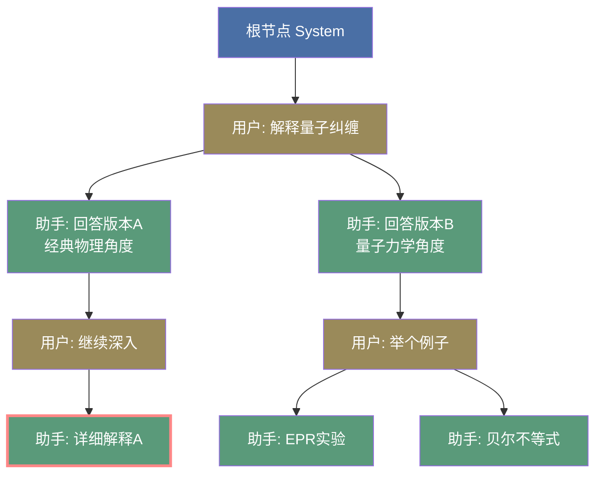
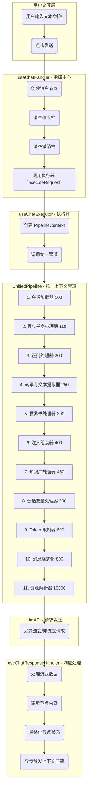

# LLM Chat: 架构与开发者指南 (v9)

> 最后更新：2026-6-1

本文档旨在深入解析 `llm-chat` 工具的内部架构、设计理念和数据流，为后续的开发和维护提供清晰的指引。

## 1. 核心概念 (Core Concepts)

`llm-chat` 的核心设计围绕多个关键概念构建，这些概念共同实现了一个功能强大且可扩展的对话系统。

### 1.1. 树状对话历史 (Tree-based Conversation History)

与传统的线性对话列表不同，本模块的对话历史是一个**树形结构**。

- **基本单位**: 每一条消息都是一个 `ChatMessageNode` 对象。
- **树形关系**: 每个节点通过 `parentId` 和 `childrenIds` 属性建立父子关系。
- **核心优势**:
  - **非破坏性操作**: 重新生成 (Regenerate) 或编辑 (Edit) 不会覆盖旧消息，而是会创建新的兄弟节点或子节点，形成新的**分支 (Branch)**。
  - **多路径探索**: 用户可以轻松地在不同的对话分支之间切换，探索和比较模型的不同回答。
  - **完整的上下文追溯**: 保证了任何对话路径的上下文都是完整且可追溯的。
- **分支记忆**: 系统会通过 `lastSelectedChildId` 属性记住用户在每个父节点上的最后选择，当返回父分支时，会自动导航到用户上次查看的路径，优化了复杂分支场景下的导航体验。


```mermaid
graph TD
    Root[根节点 System]

    Root --> U1[用户: 解释量子纠缠]
    U1 --> A1a[助手: 回答版本A<br/>经典物理角度]
    U1 --> A1b[助手: 回答版本B<br/>量子力学角度]

    A1a --> U2a[用户: 继续深入]
    U2a --> A2a[助手: 详细解释A]

    A1b --> U2b[用户: 举个例子]
    U2b --> A2b1[助手: EPR实验]
    U2b --> A2b2[助手: 贝尔不等式]

    style Root fill:#4a6fa5,color:#fff
    style U1 fill:#9a8a5a,color:#fff
    style U2a fill:#9a8a5a,color:#fff
    style U2b fill:#9a8a5a,color:#fff
    style A1a fill:#5a9a7a,color:#fff
    style A1b fill:#5a9a7a,color:#fff
    style A2a fill:#5a9a7a,color:#fff
    style A2b1 fill:#5a9a7a,color:#fff
    style A2b2 fill:#5a9a7a,color:#fff

    classDef activeLeaf stroke:#ff8787,stroke-width:3px
    class A2a activeLeaf
```

**图解**:

- 蓝色节点是**根节点 (System)**，黄褐色节点是**用户消息**，绿色节点是**助手回答**。
- 从 `U1` 出发有两个分支（`A1a` 和 `A1b`），这是对同一个问题的两种不同回答。
- 红色边框的 `A2a` 是当前 **activeLeafId**，表示用户正在查看这条对话路径。
- 切换分支只需要将 `activeLeafId` 改为其他叶节点（如 `A2b1` 或 `A2b2`），UI 就会展示不同的对话历史。

### 1.2. 会话 (ChatSessionIndex / ChatSessionDetail)

为配合第 7 章的**分离式存储策略**，会话在类型层面已**拆分为两个独立结构**（旧的统一 `ChatSession` 类型已不再存在）：

- **`ChatSessionIndex`（轻量索引，用于列表展示）**：仅包含会话的元信息（`id`、`name`、`displayAgentId`、`messageCount`、`createdAt`、`updatedAt`），用于侧边栏会话列表的快速渲染，对应磁盘上的 `sessions-index.json`。
- **`ChatSessionDetail`（完整数据，用于实际对话）**：包含完整的消息树与运行时状态，按需异步加载，对应磁盘上的 `sessions/{sessionId}.json`。其核心字段包括：
  - **`nodes`**: 以 `nodeId` 为键的字典，存储该会话中所有的 `ChatMessageNode`。
  - **`rootNodeId`**: 树的根节点 ID。
  - **`activeLeafId`**: **极其重要的属性**，指向当前对话分支的**叶子节点**，决定 UI 上显示哪一条对话路径。
  - **`parameterOverrides`**: 会话级的 LLM 参数覆盖（可选），用于临时微调智能体参数。
  - **`history` / `historyIndex`**: 撤销/重做历史栈及当前指针，用于会话级别的 undo/redo。
  - **`agentUsage`**: 会话中各智能体的使用次数统计（可选）。
- **话题命名**: 支持基于 LLM 的自动或手动为会话生成标题（写入 `ChatSessionIndex.name`），便于用户识别和管理。

### 1.3. 智能体 (ChatAgent)

`ChatAgent` 是一个可复用的、封装了特定配置的"对话角色"。它更像一个**配置预设**，而非一个独立的实体。

- **配置集合**: 它整合了 LLM Profile (API密钥等)、模型ID、预设消息串和模型参数。
- **与会话解耦**: 会话与智能体是松散耦合的。一个会话在创建时会关联一个智能体，但用户可以随时通过全局模型选择器更换模型。每条助手消息的元数据 (`metadata`) 中会记录生成它时所使用的智能体信息。
- **分类管理**: 支持了分类系统 (`category`)，和原有的标签并行，用于不同层次的筛选，管理和查找智能体更加高效。
- **显示名称**: 支持 `displayName`，允许在 UI 上使用更友好的昵称，而不影响内部 ID。
- **消息名称**: 预设消息支持独立的 `name` 字段，用于在 UI 中标识消息用途（如 "开场白", "背景介绍"），提高编辑体验。
- **用户档案绑定**: 智能体可以绑定特定的用户档案 (`userProfileId`)，用于在上下文中插入用户身份信息。
- **预设消息显示**: 支持配置 `displayPresetCount`，控制在聊天界面中显示多少条预设消息（作为开场白）。
- **复制增强**: 复制智能体时，系统会自动处理其私有的头像文件（`appdata://` 协议），确保副本拥有独立的头像资产，避免引用冲突。
- **内置资产绑定**: 智能体可以携带专属的媒体资产（表情包、背景音乐、场景图等），这些资产的生命周期与智能体完全绑定。
- **思考规则 (Think Rules)**: 支持配置 `llmThinkRules`，允许自定义如何识别和渲染模型输出中的思考过程（如 `<think>` 标签）。
- **自定义样式**: 允许通过 `richTextStyleOptions` 针对特定智能体定制 Markdown 渲染样式，增强沉浸感。
- **交互偏好**: 通过 `interactionConfig` 配置 UI 行为，例如发送按钮是否强制创建新分支、默认媒体音量等。

### 1.4. 用户档案 (UserProfile)

用户档案是一个可复用的用户身份描述，用于在对话中插入用户的背景信息、角色设定等。

- **核心概念**: 包含用户的描述性文本，在构建 LLM 上下文时会被插入到对话中。
- **全局与智能体级别**: 既可以设置全局默认档案，也可以在智能体中绑定特定档案（优先级更高）。
- **灵活插入**: 通过预设消息中的 `user_profile` 占位符，可以精确控制档案内容的插入位置。

### 1.5. 附件系统 (Attachments)

附件系统允许用户在消息中添加文件，实现多模态对话。

- **基于 Asset 管理**: 使用统一的 Asset 管理系统进行文件存储和去重。
- **智能文件检测 (File Type Detection)**:
  - **实现位置**: 全部在**前端**完成，由 [`src/utils/fileTypeDetector.ts`](../../utils/fileTypeDetector.ts) 提供 `detectFileType(path, fileName)` 入口，[`useAttachmentManager.handleFile()`](./composables/features/useAttachmentManager.ts:337) 在导入时调用。
  - **魔数检测**: 使用 [`file-type`](https://www.npmjs.com/package/file-type) 库的 `fileTypeFromBuffer`，通过 Tauri `@tauri-apps/plugin-fs` 的 `readFile` 读取文件前 **4100 字节**（库推荐最小值）做魔数识别。
  - **安全过滤**: 外部受限路径（不在 `com.mty.aiohub` 或 `AppData` 下的绝对路径）直接跳过魔数读取，避免触发 Tauri 的 `forbidden path` 错误。
  - **回退策略**: 魔数检测失败或返回 null 时，回退到扩展名映射表 [`MIME_TYPE_MAP`](../../utils/fileTypeDetector.ts:46)；再失败则使用 `application/octet-stream` 作为兜底 MIME 类型。
- **多类型支持与展示策略**:
  - **图片 (Image)**: 在 [`AttachmentCard.vue`](./components/AttachmentCard.vue:454) 中通过 `useImageViewer().show(imageUrls, currentIndex)` 触发全局图片查看器（基于 Viewer.js）。预览前会从 `allAssets` 过滤出所有 `type === 'image'` 的附件并按消息原始顺序构建 URL 列表，**多图预览的前/后按钮、缩略图条、键盘导航（←/→/Esc）、滚轮缩放等交互全部由 Viewer.js 内置提供**，本模块不再二次封装。
  - **视频 (Video)**: 通过 `useVideoViewer().previewVideo(asset, { poster })` 打开模态视频查看器（[`VideoViewer`](../../components/common/VideoViewer.vue) 内嵌 [`VideoPlayer`](../../components/common/VideoPlayer.vue)），支持倍速、画中画、截图、快捷键控制；缩略图作为 `poster` 传入以减少首帧延迟。
  - **音频 (Audio)**: 通过 `useAudioViewer().previewPlaylist(audioAssets, currentIndex)` 将同条消息内的所有音频组成播放列表，支持封面、波形与歌词。
  - **文本 (Text)**: 在 [`attachment-resolver.ts`](./core/context-utils/attachment-resolver.ts:43) 中，当 `asset.type === 'document' && isTextFile(name, mime)` 时调用 `assetManagerEngine.getAssetBinary` 取二进制，再用 [`smartDecode(buffer)`](../../utils/encoding.ts) 智能识别编码（UTF-8 / GBK / GB18030 / Big5 等，基于 BOM 与启发式判定），最终格式化为 `\n[文件: {name}]\n\`\`\`\n{textContent}\n\`\`\`\n` 后作为消息文本发送给 LLM；**全程不经过 Base64**，节省 Token 与编码开销。
  - **文档 (Document)**: 在 [`asset-resolver.ts:processDocumentAsset`](./core/context-processors/asset-resolver.ts:77) 中处理，格式选择**完全由模型 `capabilities.documentFormat` 决定**（`'base64' | 'openai_file'`），**与文件大小无关**：
    - `'base64'`：Claude / Gemini / 默认行为，输出 `{ type: 'document', source: { type: 'base64', media_type, data } }`。
    - `'openai_file'`：OpenAI Responses 协议（`file_url` / `file_id` / `file_data` 三种 source 形态），**当前实现尚未完全支持，运行时会打 warn 日志并临时回退到 base64**（见 [`asset-resolver.ts:111-114`](./core/context-processors/asset-resolver.ts:111)）。
    - **PDF 特殊路径**：当 `mimeType === 'application/pdf' && !capabilities.document && capabilities.vision` 时，asset-resolver 会现场调用 [`convertPdfToImages(buffer)`](../../utils/pdfUtils.ts) 把 PDF 转成图片序列发送，作为视觉降级方案。
  - **其他类型 (Other)**: AttachmentCard 通过计算属性 `isBarLayout = computed(() => !isImage)` 决定布局——**只要不是图片，全部走长条布局**（视频/音频/文档/未知类型都共用）。CSS 实现位于 [`AttachmentCard.vue`](./components/AttachmentCard.vue:1253) 的 `.attachment-card.is-bar-layout` 与 `.bar-layout-container`：横向 `display: flex` + 36×36 文件图标 + 文件名 + 元信息行（大小 / 扩展名 / Token / 转写状态），`min-width: 160px; max-width: 320px`。
- **转写协作**: 与独立的 `transcription` 工具深度集成。当模型不具备原生多模态能力时，系统可自动触发转写流程（详见第 2.4 节）。
- **响应式布局**: 见下方 1.5.1 子项。

#### 1.5.1 附件容器的响应式布局

附件列表的"响应式"采用最简方案——**纯 Flex 换行**，不使用 CSS Grid、也不使用 Container Query：

- **统一容器样式**: 所有挂载点（消息内容 / 输入框 / 编辑模式 / 树图节点 / 上下文分析器）共享同一套 `.attachments-list` 样式：`display: flex; flex-wrap: wrap; gap: 8~12px`（见 [`MessageContent.vue:1427`](./components/message/MessageContent.vue:1427)、[`MessageInputAttachments.vue:125`](./components/message-input/MessageInputAttachments.vue:125)、[`StructuredView.vue:1962`](./components/context-analyzer/StructuredView.vue:1962)）。
- **列数自适应规则**: **不存在显式的列数控制**。每个 [`AttachmentCard`](./components/AttachmentCard.vue) 按 `size` prop 渲染固定宽度（`small: 52px` / `medium: 80px` / `large: 120px` / `extra-large: 100%`），靠 `flex-wrap: wrap` 在父容器宽度变化时自然换行，因此"每行几个"完全由父容器的可用宽度与卡片宽度之比决定。
- **窄屏 / 分离窗口窄态**: **没有专门的单列回退媒体查询**，依赖 flex 自然换行 —— 当容器宽度小于一张卡片宽度时自动单列显示。长条布局额外通过 `min-width: 160px; max-width: 320px` 兜住极窄场景，避免文件名等元信息被压扁；图片卡片由于宽度固定，窄容器下天然单列。
- **气泡模式协同**: 截至当前实现，气泡模式（§3.8）与卡片模式**共用同一套 `.attachments-list` 样式**，没有在 CSS 层做差异化（即气泡内 vs 气泡外的附件网格行为一致），仅气泡外宽度更大时一行能排更多卡片，是布局算法的副作用而非显式策略。

### 1.6. 上下文分析器 (Context Analyzer)

上下文分析器是一个强大的调试和优化工具，用于可视化和分析任意消息节点的完整 LLM 请求上下文。

- **核心功能**:
  - **完整上下文预览**: 重建指定消息节点实际发送给 LLM 时的完整请求上下文。
  - **智能体推断**: 自动从消息节点的元数据推断该消息使用的智能体配置。
  - **多维度展示**: 提供结构化视图、原始请求视图和内容分析图表。

### 1.7. 宏系统 (Macro System)

宏系统是一个强大的动态内容生成引擎，它允许在智能体的预设消息、用户输入等任何地方嵌入可执行的占位符。详细的宏定义与用法请参考：[MACRO.md](./macro-engine/MACRO.md)。

- **三阶段执行管道**:
  1.  **预处理 (`PRE_PROCESS`)**: 处理状态变更（如 `setvar`）。
  2.  **替换 (`SUBSTITUTE`)**: 处理静态值替换（如 `user`, `getvar`）。
  3.  **后处理 (`POST_PROCESS`)**: 执行动态函数（如 `time`, `random`）。

- **内置宏分类**: 应用启动时由 [`initializeMacroEngine`](./macro-engine/index.ts) 一次性注册 **9 大类**内置宏到 `MacroRegistry`，UI（如宏选择器、预设消息编辑器）与各上下文处理器共享同一份注册表：
  1.  **`core`** ([`macros/core.ts`](./macro-engine/macros/core.ts)): 基础值替换与会话角色信息，包括用户/角色名、模型与配置元数据等。代表宏：`{{user}}`、`{{char}}` / `{{agent}}`、`{{persona}}`、`{{modelId}}`、`{{visual_guideline}}`。
  2.  **`datetime`** ([`macros/datetime.ts`](./macro-engine/macros/datetime.ts)): 时间与日期，支持虚拟时间、12/24 小时制、自定义 pattern、多语言以及古风中文/英文与大写汉字等多种形态。代表宏：`{{time}}`、`{{date}}`、`{{datetime_format::YYYY-MM-DD hh:mm:ss a}}`、`{{date_cn_ancient}}`、`{{shichen}}`。
  3.  **`variables`** ([`macros/variables.ts`](./macro-engine/macros/variables.ts)): 会话级（局部）与应用级（全局）变量的读、写与自增/自减能力，与第 2.2 节 `variable-processor` 处理的 `<svar>` 标签并存（前者面向宏管道，后者面向消息内联标签）。代表宏：`{{setvar::counter::0}}`、`{{getvar::counter}}`、`{{incvar::counter}}`、`{{setglobalvar::theme::dark}}`、`{{getglobalvar::theme}}`。
  4.  **`functions`** ([`macros/functions.ts`](./macro-engine/macros/functions.ts)): 通用功能性函数，包括随机选择、稳定 `pick`（基于会话内容哈希）、骰子表达式、随机整数、文本重复以及换行/`trim` 等格式化辅助。代表宏：`{{random::A::B::C}}`、`{{pick::A::B::C}}`、`{{roll::1d20}}`、`{{randomInt::1::100}}`、`{{repeat::Hi::3}}`。
  5.  **`system`** ([`macros/system.ts`](./macro-engine/macros/system.ts)): 通过 Tauri `plugin-os` 暴露的操作系统、架构、主机名与系统语言环境等运行时信息。代表宏：`{{os}}`、`{{osVersion}}`、`{{arch}}`、`{{platform}}`、`{{hostname}}`、`{{locale}}`。
  6.  **`assets`** ([`macros/assets.ts`](./macro-engine/macros/assets.ts)): 配合第 1.17 节智能体私有资产，按可选分组列出当前智能体可用资产及其 `agent-asset://{group}/{id}.{ext}` 引用格式说明，便于 LLM 主动使用表情包/BGM/场景图等资源。代表宏：`{{assets}}`、`{{assets::biaoqingbao}}`。
  7.  **`tools`** ([`macros/tools.ts`](./macro-engine/macros/tools.ts)): 与第 1.21 节工具调用系统对接，由 `toolDiscoveryService` 注入工具定义、协议使用说明与运行时上下文。代表宏：`{{tools}}`、`{{tool_usage}}`、`{{tool_context}}`。
  8.  **`knowledge`** ([`macros/knowledge.ts`](./macro-engine/macros/knowledge.ts)): 与第 1.12 节知识库系统对接，生成 `【kb::…】` 占位符供 `knowledge-processor` 解析检索，或直接列出当前智能体已绑定的知识库清单。代表宏：`{{kb}}`、`{{kb::myKB::5}}`、`{{kb_list}}`。
  9.  **`cssVariables`** ([`macros/cssVariables.ts`](./macro-engine/macros/cssVariables.ts)): 在浏览器/WebView 环境下实时读取 `documentElement` 上的 CSS 自定义属性当前值，便于在提示词或可视化输出指南中引用主题色等设计令牌。代表宏：`{{cssvar::--primary-color}}`、`{{cssvar::card-bg}}`。

### 1.8. 撤销/重做系统 (Undo/Redo System)

为了提供类似文本编辑器的流畅体验，系统实现了会话级别的撤销/重做功能。

- **混合存储策略**: 采用**快照 (Snapshot)** 与 **增量 (Delta)** 相结合的方式。
  - **Delta**: 对于轻量级操作（如编辑消息、切换分支），只记录变更的差异。
  - **Snapshot**: 定期或在复杂操作后记录完整的会话状态，作为“存档点”。
  - **触发阈值**: 由 [`useSessionNodeHistory.ts`](./composables/session/useSessionNodeHistory.ts:42) 中的常量控制 — `SNAPSHOT_COMPLEXITY_THRESHOLD = 30`（受影响节点数）与 `SNAPSHOT_INTERVAL = 15`（自上一次快照后的 Delta 数），任一超过即生成新快照。
  - **栈深限制**: `MAX_HISTORY_LENGTH = 50`，超长时优先清退首部的纯 Delta 条目，保留最早可达的快照锚点。
- **支持的操作**: 编辑消息、删除消息、切换分支、节点移动、分支嫁接、启用/禁用节点等（来源：[`useGraphActions.ts`](./composables/visualization/useGraphActions.ts:80) 调用 `recordHistory` 的全部 `HistoryActionTag`）。
- **历史断点（清空逻辑）**: 发送新消息、重新生成回复、续写（continueGeneration）被视为“历史断点”，会清空当前的撤销栈。具体实现位于 [`llmChatStore.ts`](./stores/llmChatStore.ts:886) 中：
  - **触发位置在 Store 层**: `sendMessage` / `regenerateFromNode` / `continueGeneration` 在 `await chatHandler.*()` 完成之后调用 `historyManager.clearHistory()`，并非 `useChatHandler` 自身触发。
  - **边界说明**:
    - ✅ 触发清空：`sendMessage`（[`llmChatStore.ts:886`](./stores/llmChatStore.ts:886)）、`regenerateFromNode`（[`llmChatStore.ts:1008`](./stores/llmChatStore.ts:1008)）、`continueGeneration`（[`llmChatStore.ts:928`](./stores/llmChatStore.ts:928)）。
    - ✅ 工具调用迭代（`useToolCallOrchestrator`）作为 `sendMessage` / `regenerateFromNode` 的内部循环，整轮完成后由外层触发**一次**清空，不会逐次清空。
    - ❌ **不触发清空**：`reparseNodeTools`（重新解析既有助手节点的工具调用，[`llmChatStore.ts:1274`](./stores/llmChatStore.ts:1274)）— 这是对已有节点的修补，不是新建对话轮次。
  - **清空时不保留任何旧快照**: `clearHistory()` 直接用当前 `session.nodes` 构造一个全新的 `INITIAL_STATE` 快照条目，`history = [initialEntry]`，`historyIndex = 0`。
  - **UI 同步**: `canUndo = historyIndex > 0`，`canRedo = historyIndex < history.length - 1`。清空后两者皆为 `false`，撤销/重做按钮通过 `computed` 自动禁用，无需手动同步状态。

### 1.9. SillyTavern 兼容性 (SillyTavern Compatibility)

为了利用社区丰富的角色资源，系统实现了对部分 SillyTavern 格式配置的导入兼容。

- **角色卡导入**: 支持解析 V2/V3 格式的角色卡（.json/.png），自动映射字段：
  - `description`, `personality`, `scenario`, `first_mes` -> 预设消息
  - `depth_prompt` -> 深度注入消息
  - `avatar` -> 智能体图标
- **预设文件导入 (`prompt_order` → `injectionStrategy`)**: 解析器位于 [`services/sillyTavernParser.ts`](./services/sillyTavernParser.ts)，入口为 [`parsePromptFile()`](./services/sillyTavernParser.ts:338) + 类型守卫 [`isPromptFile()`](./services/sillyTavernParser.ts:483)。
  - **支持格式**：当前实现只解析 **JSON 对象**（要求同时存在 `prompts: SillyTavernPrompt[]` 与 `prompt_order: PromptOrderItem[]` 两个数组字段），**不直接支持 YAML**——若用户传入 YAML 需在上游手动转换。
  - **`prompt_order` 切分策略**：以 `identifier === "chatHistory"` 为分界线 → `preHistoryOrder` 写入 `systemPrompts`、`postHistoryOrder` 写入 `injectionPrompts`；未出现在任何 `prompt_order` 项中的 `prompts` 被收集到 `unorderedPrompts` 并**默认禁用**（`isEnabled: false`），供用户在导入对话框中按需勾选。
  - **位置到 `InjectionStrategy` 的映射表**（由 [`convertInjectionStrategy()`](./services/sillyTavernParser.ts:492) 实现，**前置消息一律无注入策略**，按列表顺序排列）：

    | ST 字段优先级                  | 取值                | 映射结果（`InjectionStrategy`）                                          |
    | ------------------------------ | ------------------- | ------------------------------------------------------------------------ |
    | `injection_depth > 0` 优先生效 | 任意正整数          | `{ depth: N, order: 100 }`                                               |
    | `injection_position: 0`        | Main prompt         | `undefined`（不注入，按列表顺序排）                                      |
    | `injection_position: 1`        | Before chat history | `{ anchorTarget: "chat_history", anchorPosition: "before", order: 100 }` |
    | `injection_position: 2`        | After chat history  | `{ anchorTarget: "chat_history", anchorPosition: "after", order: 100 }`  |
    | `injection_position: 4`        | At depth            | `{ depth: injection_depth ?? 4, order: 100 }`                            |
    | 其它 / 未提供                  | —                   | `undefined`                                                              |

  - **字段降级与跳过策略**：
    - **`marker: true` 节点全部跳过**：ST 用于标识 `chatHistory` / `worldInfoBefore` / `worldInfoAfter` / `personaDescription` / `charDescription` 等占位锚点的虚拟 prompt 不映射为消息（其中 `chatHistory` 已作为分界标识被消费）。
    - **空内容跳过**：`prompt.content?.trim()` 为空的节点直接忽略。
    - **`prompt_order` 缺失时的回退**：未提供 `characterId` 时优先取 `prompt_order` 数组**最后一条**作为生效配置（"通常是当前激活的"），完全没有 `prompt_order` 时 `parsePromptFile` 返回全空结果并记录 `warn` 日志。
    - **角色 (`role`) 缺省 → `"system"`**；`enabled: false` 的项被映射为 `isEnabled: false`，保留结构但默认关闭。
  - **额外提取**：从根对象 `pick` 出 `temperature` / `top_p` / `top_k` / `top_a` / `min_p` / `repetition_penalty` / `presence_penalty` / `frequency_penalty` / `max_tokens` 作为模型参数返回，便于一并写入新 Agent 的 `parameters`。
  - **`stPromptName` 元数据关联（导入溯源）**：所有由 ST 解析产生的预设消息节点都会通过 [`createPresetMessage()`](./services/sillyTavernParser.ts:538) 在 `metadata.stPromptName` 写入对应 prompt 的 `name`，用于：
    1. **UI 展示**：[`STPresetImportDialog.vue`](./components/agent/assets/STPresetImportDialog.vue:141) 在导入预览中显示原始 ST 名称作为副标题；
    2. **角色卡 → Agent 迁移识别**：[`agentMigrationService`](./services/agentMigrationService.ts:220) 把 `stPromptName === "First Message"` 或匹配 `^Alternate Greeting\b` 的预设消息识别并迁移为独立的 `greetings` 列表，避免它们污染上下文装配链。

### 1.10. 虚拟时间线 (Virtual Timeline)

为沉浸式角色扮演（RP）引入了独立于现实世界的时间维度。

- **双时钟系统**: 每个智能体可以拥有独立的虚拟时钟。
- **流速控制**: 支持设定虚拟时间相对于现实时间的流速（例如：现实1小时 = 游戏内1天）。
- **宏集成**: 系统的时间宏（如 `{{date}}`, `{{time}}`）会自动感知当前的虚拟时间配置，输出虚拟世界的时间。

### 1.11. 模型参数配置系统 (Model Parameter System)

为了应对日益复杂的模型能力差异，系统构建了一套分层、动态且高度可扩展的参数配置引擎（核心类型定义见 [`types/llm.ts`](./types/llm.ts) 中的 `LlmParameters`），实现了从基础采样、结构化输出、原生工具调用到多模态输出与上下文后处理的全方位控制。

- **分层配置架构**:
  - **基础采样参数 (Basic Sampling)**: 标准化的采样控制，如 `temperature`、`maxTokens`、`topP`、`topK`、`frequencyPenalty`、`presencePenalty`、`seed`、`stop`（停止序列）。
  - **高级参数 (Advanced)**: 进阶控制选项，包括 `n`（响应数量）、`logprobs` / `topLogprobs`、`maxCompletionTokens`（替代 `maxTokens`，优先级更高）、`logitBias`（标记偏差）、`store`（蒸馏存储开关）、`user`（用户标识符）、`serviceTier`（服务层级 `auto`/`default`/`flex`）、`streamOptions`（流式选项，如 `includeUsage`）、`metadata`（请求级元数据键值对）。
  - **思考能力 (Thinking)**: 标准化的推理能力控制体系。
    - **统一抽象**: 将不同厂商（Claude, Gemini, DeepSeek 等）的推理参数抽象为统一的 `thinkingEnabled` (开关)、`thinkingBudget` (预算)、`reasoningEffort` (等级，主要用于 o 系列模型)，并通过 `includeThoughts`（Gemini）控制是否返回思考摘要。
    - **智能适配**: 根据模型元数据 (`capabilities`) 自动渲染适配的 UI 控件（如滑块或下拉框）。
    - **参数联动**: 实现了 `thinkingBudget` 与 `maxTokens` 的自动联动逻辑，确保总 Token 上限始终能容纳推理预算。
    - **思考解析**: 配合 `llmThinkRules`，系统可以精准提取并单独展示模型的推理过程，支持折叠和样式定制。
  - **结构化输出 (Response Format)**:
    - **`responseFormat`**: `{ type: 'text' | 'json_object' | 'json_schema', json_schema?: { name, schema, strict? } }`，用于约束模型输出为指定 JSON Schema 的结构化数据。
  - **原生工具调用 (Native Tool Calling)**:
    - **`tools`**: `Array<{ type: 'function', function: { name, description?, parameters?, strict? } }>`，向 LLM 声明可调用的函数列表。
    - **`toolChoice`**: `'none' | 'auto' | 'required' | { type: 'function', function: { name } }`，控制工具选择策略。
    - **`parallelToolCalls`**: `boolean`，是否允许模型在一次响应内并行返回多个工具调用。
    - **注意**: 此处的原生工具调用参数与第 1.21 节的"工具调用系统"协同工作；具体注入哪些工具由 `toolCallConfig` 与上下文管道中的工具宏决定。
  - **多模态输出 (Modalities)**:
    - **`modalities`**: `Array<'text' | 'audio'>`，声明模型本次响应应输出哪些模态。
    - **`audio`**: `{ voice, format }`，音频输出参数（voice 支持 `alloy`/`ash`/`ballad`/`coral`/`echo`/`fable`/`nova`/`onyx`/`sage`/`shimmer`；format 支持 `wav`/`mp3`/`flac`/`opus`/`pcm16`）。
    - **`prediction`**: `{ type: 'content', content: string | Array<{ type: 'text', text }> }`，预测输出配置（Predicted Outputs），用于加速可预测内容的生成。
  - **联网搜索 (Web Search)**:
    - **`webSearchEnabled`**: `boolean`，统一的联网搜索开关，各 Provider 自动适配。
    - **`webSearchOptions`**: OpenAI 高级配置，包含 `searchContextSize` (`'low' | 'medium' | 'high'`) 与 `userLocation`（含 `approximate.city/country/region/timezone`）。
  - **上下文管理 (Context Management)**:
    - **`contextManagement`**: `{ enabled, maxContextTokens, retainedCharacters? }`，允许为特定模型设置独立的上下文长度上限与截断时的头部保留字符数。
    - **实时统计**: 集成 `ContextStatsCard`，实时计算并显示当前会话的上下文消耗与剩余空间。
  - **上下文后处理管道 (Context Post-Processing)** ★:
    - **`contextPostProcessing`**: `{ rules: ContextPostProcessRule[] }`，对最终发送给 LLM 的消息列表执行格式转换的规则列表，按数组顺序依次执行。
    - **`ContextPostProcessRule`**: `{ type: string, enabled: boolean, [key]: any }`，`type` 对应注册到 `contextPipelineStore` 中的处理器 ID（如 `post:merge-system-to-head`、`post:merge-consecutive-roles`、`post:ensure-alternating-roles`、`post:convert-system-to-user`），允许处理器扩展自有配置项（如分隔符、用户占位符等）。
    - **协同关系**: 与第 2.2 节中 priority 800 的 `message-formatter` 配套使用，由各 Agent / 模型默认值合并决定具体启用哪些规则。
  - **图片压缩 (Image Compression)** ★:
    - **`imageCompression`**: `{ enabled, maxDimension?, format: 'original' | 'jpeg' | 'webp', quality }`，发送前对图片附件进行用户侧压缩与尺寸缩放，节省 Token 与带宽。`quality` 为 0.1~1.0 的有损质量参数（对 `original` 无效）。
  - **上下文压缩 (Context Compression)**: 压缩配置位于 `contextCompression` 字段（详见第 1.15 节），允许按 Agent/Session 进行精细化控制。
  - **厂商专属配置 (Provider Specific)**:
    - **Gemini**: `safetySettings` 数组，按 `HARM_CATEGORY_*` 维度配置安全过滤阈值（`BLOCK_NONE` / `BLOCK_ONLY_HIGH` / `BLOCK_MEDIUM_AND_ABOVE` / `BLOCK_LOW_AND_ABOVE` / `OFF` 等）。
    - **Claude**: `stopSequences`（Claude 专用停止序列数组）、`claudeMetadata`（`{ user_id? }`，附加在请求中的元数据）。
  - **自定义参数 (Custom)**: `custom: { enabled: boolean, params: Record<string, any> }`，允许用户直接透传任意非标准 API 参数，并提供 UI 开关，确保对新模型特性的零日支持。

- **显式启用列表 (Enabled Parameters)**: 通过 `enabledParameters: Array<keyof Omit<LlmParameters, 'custom'>>` 显式声明本次请求要发送的参数白名单。当存在此字段时，只有列入白名单的字段会被实际发送给 LLM API；不存在时回退到旧行为（发送所有非 `undefined` 的参数）。这避免了因隐式默认值污染请求体而引发的兼容性问题。

- **动态能力适配 (`ModelParametersEditor`)**: 编辑器位于 [`components/agent/parameters/ModelParametersEditor.vue`](./components/agent/parameters/ModelParametersEditor.vue)，由 [`config/parameter-config.ts`](./config/parameter-config.ts) 中的 `parameterConfigs` 表驱动，配合 [`ParameterItem.vue`](./components/agent/parameters/ParameterItem.vue) 渲染单条参数。核心适配规则：
  - **参数分组动态过滤**：每个参数携带 `group: "basic" | "advanced" | "special"` 与 `supportedKey` 字段，由 [`shouldShowParameter()`](./components/agent/parameters/ModelParametersEditor.vue:249) 与 `getSupportedParameters(providerType)` 联合裁剪——某 `supportedKey` 在该 Provider 上为 `false` 时整条参数隐藏，从而避免给不支持的 Provider 展示无用项。
  - **思考能力控件三态切换**：所有思考参数共享 `supportedKey: "thinking"`，最终控件类型完全由模型 `capabilities.thinkingConfigType` 决定（**不是简单的"滑块 vs 下拉"二选一**）：
    - `"switch"` → 仅显示 `thinkingEnabled` 开关，不暴露任何细粒度控件；
    - `"budget"` → 显示 `thinkingEnabled` 开关，并在 `thinkingEnabled === true` 时**追加显示 `thinkingBudget` 滑块**；
    - `"effort"` → 隐藏开关，显示 `reasoningEffort` 下拉，选项由 `capabilities.reasoningEffortOptions` **动态注入**（前面加一条 `"默认" → ""` 兜底，见 [`processedConfigs`](./components/agent/parameters/ModelParametersEditor.vue:218)）；
    - `"none"` 或缺省 → 整组思考参数都不显示；
    - `includeThoughts`（Gemini 思考摘要回传）单独走 `supportedKey: "thinkingConfig"` 检查 Provider 支持，与上述三态正交。
  - **`thinkingBudget` ↔ `maxTokens` 联动**：由 [`ModelParametersEditor.vue`](./components/agent/parameters/ModelParametersEditor.vue) 中三个独立的 `watch` 实现，常量 `THINKING_OUTPUT_BUFFER = 4096`（推理后留给最终回答的预算）：
    1. `watch(thinkingBudget)`：当 `budget + 4096 > maxTokens` 时，自动把 `maxTokens` 抬高到 `min(budget + 4096, maxTokensLimit)`，保证 Claude 等模型要求的 `max_tokens > budget_tokens`。
    2. `watch(maxTokens)`：当 `maxTokens - budget < 1024`（最小缓冲）时反向调低 `thinkingBudget = max(1024, maxTokens - 1024)`，避免推理预算挤掉所有输出空间。
    3. `watch(thinkingEnabled)`：开关从 false 切到 true 时执行一次初始检查，必要时把 `maxTokens` 抬到 `currentBudget + 4096`。
    - 三条 watch 都受 `capabilities.thinkingConfigType === "budget"` 守护，对 `switch` / `effort` 类型模型完全短路。
  - **`maxTokensLimit` 动态计算**：取 `tokenLimits?.output → contextLengthLimit → 131072` 三级回退，并通过 `overrides` 在 `ParameterItem` 上覆盖 `max` 属性；同时 `watch(contextLengthLimit)` 在上下文限制变小时自动把超限的 `maxTokens` / `contextManagement.maxContextTokens` 调回新上限。
  - **厂商专属配置的条件渲染**：
    - **Gemini `safetySettings`**: 由 [`showSafetySettings`](./components/agent/parameters/ModelParametersEditor.vue:409) 计算属性控制——`supportedParameters.safetySettings === true` 或 `getModelFamily(modelId, providerType) === "gemini"` 任一成立即显示 [`SafetySettingsPanel`](./components/agent/parameters/SafetySettingsPanel.vue)。
    - **Claude `stopSequences` / `claudeMetadata`**: 这两个参数**不走单独的厂商面板**，而是在 [`ALL_LLM_PARAMETER_KEYS`](./config/parameter-config.ts:11) 白名单中作为标准参数与 `temperature` 等并列；UI 显示与否完全由 `enabledParameters` 白名单和参数表的 `supportedKey` 共同决定，没有专门的"Claude 配置区"。
  - **`enabledParameters` 白名单 UI**: **没有独立的"启用列表编辑器"面板**，而是把启用/停用开关直接内嵌到每个 [`ParameterItem`](./components/agent/parameters/ParameterItem.vue) 的右上角 `el-switch`（受 `hideSwitch` 控制，少数固定项如 `maxContextTokens` 隐藏开关默认启用）。状态由 [`isParameterEnabled()`](./components/agent/parameters/ModelParametersEditor.vue:136) 与 [`toggleParameterEnabled()`](./components/agent/parameters/ModelParametersEditor.vue:143) 双向管理，开关切换会立刻把 key 加入 / 移出 `enabledParameters` 数组；最终发送给 LLM 时由 [`buildEffectiveParameters()`](./config/parameter-config.ts:406) 严格按白名单过滤。
  - **`enabledParameters` 智能初始化**: 首次加载或外部 `modelValue` 变化时，[`initLocalParams()`](./components/agent/parameters/ModelParametersEditor.vue:83) 会检测 `enabledParameters` 字段——不存在则取所有"已有非 undefined 值且不属于 custom"的 key 自动构造白名单，兼容旧版未带白名单的 Agent 配置，避免在升级后误把已设值的参数置为"未启用"。

### 1.12. 知识库系统 (Knowledge Base / RAG)

系统集成了强大的 RAG (Retrieval-Augmented Generation) 能力，允许智能体访问外部知识库。

- **触发机制**: 通过在预设消息或用户输入中使用 `【kb::kbName::limit::minScore::mode::params】` 占位符触发。
- **激活模式**:
  - **Always**: 始终触发检索。
  - **Gate**: 关键词触发，仅当最近对话中出现指定关键词时激活。
  - **Turn**: 轮次触发，每隔 N 轮对话执行一次检索。
  - **Static**: 静态加载，直接注入指定的条目 ID 或整个库的内容。
- **智能检索策略**:
  - **上下文感知查询**: 取最近 N 轮完整对话（User + AI + Tool）组合为检索查询。
  - **双引擎检索**: 支持向量检索 (Vector) 和关键词检索 (Keyword/Fulltext)，以及混合检索 (Hybrid)。
  - **精确文本缓存**: 实现会话级检索缓存，采用精确文本匹配策略（完全一致才命中），适用于同轮多占位符和重试场景。
- **每次独立检索**: 每次检索独立执行，不混入历史结果。分数阈值 (`minScore`) 作为主要截断依据，`limit` 仅为上限。

### 1.13. 搜索系统 (Search System)

为海量对话和智能体提供了毫秒级的全文检索能力，前端入口为 [`useLlmSearch`](./composables/chat/useLlmSearch.ts)，后端实现为 Tauri command [`search_llm_data`](../../../../src-tauri/src/commands/llmchat_search.rs:519)。

- **多维搜索 (Scope)**: 支持 `agent` / `session` / `all` 三种作用域。Agent 范围内可命中 `name` / `displayName` / `description` / `presetMessage` / `presetMessageName` 字段；Session 范围内可命中 `name` / `content`（消息正文）/ `reasoningContent`（推理内容）字段，每条结果最多返回 5 条节点匹配 / 3 条预设匹配，按匹配数量与更新时间降序排序。
- **匹配模式 (`matchMode`)**: 后端 [`SearchMatcher::build`](../../../../src-tauri/src/commands/llmchat_search.rs:105) 将查询字符串转换为三种内部结构：
  - **`exact`**（默认）: 把整个查询用 `regex::escape` 转义后作为**单个正则**进行整体匹配，适合带空格的精确短语。
  - **`and`**: 按 `split_whitespace()` 切词后为每个词构建独立 Regex，要求**全部 `is_match`** 才算命中；单个关键词时自动降级为 `exact`，避免无意义遍历。
  - **`or`**: 按 `split_whitespace()` 切词后拼成 `kw1|kw2|kw3` 形式的**单个正则**做任一匹配；单关键词同样降级为 `exact`。
- **中文分词与编码**:
  - **不做真正的分词**：所有模式都依赖 `split_whitespace()`，对没有空格的中文文本只能整体当作一个关键词处理；**不支持拼音匹配**。
  - **字符级偏移用 graphemes**：返回 `match_offsets` 时使用 [`unicode_segmentation`](https://crates.io/crates/unicode-segmentation) 的 `graphemes(true)` 计数，确保 emoji、CJK 字符簇与 JS 字符串的 `String.length` 对齐，前端 `formatMatchContext` 可直接做截断和高亮拼接。
  - **大小写不敏感 + 正则转义**：所有模式在 `RegexBuilder` 上统一开启 `case_insensitive(true)`，并对用户输入用 `regex::escape` 转义，保证 `.` / `*` / `?` 等正则元字符被当成普通字符匹配，杜绝注入风险。
- **后端实现：无索引的并发全表扫描**: **没有任何持久化索引结构**（不是倒排表、不是 Trie、不是 SQLite FTS）。每次搜索都走以下流程（见 [`llmchat_search.rs:289-514`](../../../../src-tauri/src/commands/llmchat_search.rs:289)）：
  1.  **walkdir** 递归遍历 `{appConfigDir}/llm-chat/agents/{id}/agent.json` 与 `{appConfigDir}/llm-chat/sessions/{id}.json` 收集所有文件路径。
  2.  通过 `tokio::join!` **并行**执行 `search_agents` 与 `search_sessions`（`scope = all` 时）。
  3.  `stream::iter(paths).buffer_unordered(50)` 以 **50 并发**异步读取每个文件，先用 `matcher.is_match(&content)` 做**全文预过滤**：原始字符串都不命中则直接跳过昂贵的 `serde_json` 反序列化，这是核心性能优化点。
  4.  命中文件用 `PartialAgent` / `PartialSession`（带 `#[serde(borrow)]` 零拷贝结构）解析后逐字段调用 `matcher.extract_context` 提取片段。
  - **索引刷新时机**: **不适用** —— 由于不存在索引，所以也没有刷新/重建机制，写入会话/智能体后立即可搜索；优势是零维护成本，缺点是单次搜索的最差耗时与磁盘数据量线性相关。
- **前端防抖与 Loading 延迟**: [`useLlmSearch`](./composables/chat/useLlmSearch.ts:83) 默认配置：
  - **`debounceMs = 300`**：通过 `useDebounceFn` 对搜索请求做防抖，连续输入只触发最后一次。
  - **`loadingDelayMs = 300`**：通过 `setTimeout` 延迟显示 loading 指示器，命中时长低于阈值时不展示 spinner，避免短查询闪烁。
  - 暴露 `isSearching`（内部状态，用于逻辑判断）与 `showLoadingIndicator`（带延迟的展示状态，UI 直接绑定）两套响应式状态，分别承担不同语义。
- **搜索结果高亮 (Highlight)**: **前后端协作完成**：
  - 后端 [`extract_context_with_regex`](../../../../src-tauri/src/commands/llmchat_search.rs:205) 在提取上下文片段时同时返回 `match_offsets: (start_char, end_char)[]` 字符索引数组（基于 grapheme 计数），并合并重叠区间。
  - 前端 [`formatMatchContext`](./composables/chat/useLlmSearch.ts:297) 据此构建 `HighlightPart[]` 数组（含 `text` 与 `isMatch` 标记），UI 层（如 `LlmChatSidebar` 的搜索结果项）用 `<mark>` 渲染高亮，并提供按字符数智能截断窗口（前缀 1/4 后缀 3/4）。
  - **同会话消息列表的搜索**（[`ChatSearchPanel.vue`](./components/search/ChatSearchPanel.vue)）是**另一套独立的纯前端搜索**，直接在内存中对当前会话的 `messages[]` 做 `toLowerCase().includes(query)`，与 Rust 后端搜索互不依赖；高亮通过简单的 `split(new RegExp(query, 'gi'))` + `<mark>` 实现。

### 1.14. 翻译系统 (Translation System)

为了打破语言障碍，系统集成了原生的多语言翻译能力，支持消息内容和用户输入的一键翻译。

- **双向翻译**:
  - **输入翻译**: 支持将用户输入框中的文本一键翻译为目标语言。
  - **消息翻译**: 支持对助手或用户的历史消息进行翻译。
- **智能保护**: 翻译过程中会自动识别并保护 XML 标签（如 `<think>...</think>`），确保模型的思维链或结构化数据不被破坏。
- **结果缓存**: 翻译结果存储在消息节点的 `metadata.translation` 中，支持持久化。
- **显示模式**:
  - **原文 (Original)**: 仅显示原文。
  - **译文 (Translation)**: 仅显示译文。
  - **双语 (Both)**: 并排或上下对照显示原文和译文，方便校对。
- **独立配置**: 翻译功能拥有独立的模型配置、提示词模板和目标语言设置。

### 1.15. 上下文压缩 (Context Compression)

随着对话长度的增加，上下文窗口限制和 Token 成本成为主要瓶颈。上下文压缩系统通过智能摘要技术解决这一问题。

- **配置位置**: 压缩配置位于智能体的模型参数 ([`LlmParameters.contextCompression`](./types/llm.ts:226)) 中，类型为 [`ContextCompressionConfig`](./types/llm.ts:376)，实现了按 Agent 的精细化控制。
- **动态开关**: 工具栏中的压缩按钮会根据当前智能体是否启用了压缩功能（`isContextCompressionEnabled`）动态决定其可用性。
- **触发机制**：由 `triggerMode` 与 `autoTrigger` 两个维度共同决定，**不再是简单的"自动/对话后/手动"三分法**。
  - **触发维度 ([`triggerMode`](./types/llm.ts:382))**：决定"用什么指标判断该不该压缩"，取值为 `"token" | "count" | "both"`，分别对应：
    - **`token`**（默认）：仅当当前活跃路径的总 Token 数超过 `tokenThreshold`（默认 80000）时判定为需要压缩。
    - **`count`**：仅当当前路径的有效消息条数超过 `countThreshold`（默认 50）时判定为需要压缩。
    - **`both`**：Token 或消息条数任一超阈值即判定为需要压缩（**OR 关系**，见 [`shouldCompress()`](./composables/features/useContextCompressor.ts:66)）。
    - **公共门槛**：所有模式都还要先满足 `minHistoryCount`（默认 15）这一最小历史条数门槛，否则直接早退（见 [`useContextCompressor.ts:52`](./composables/features/useContextCompressor.ts:52)）。
  - **自动触发开关 ([`autoTrigger`](./types/llm.ts:380))**：默认 `true`，决定"满足触发条件后是否自动执行"。设为 `false` 时即便阈值满足也不会自动压缩，仅保留手动入口。`useChatResponseHandler` 在每次助手消息完成后会异步调用 [`checkAndCompress()`](./composables/features/useContextCompressor.ts:421)，由该函数同时检查 `enabled` 与 `autoTrigger`。
  - **手动触发**: 用户可通过工具栏按钮调用 [`manualCompress()`](./composables/features/useContextCompressor.ts:450)，**忽略 `autoTrigger` 与 `triggerMode` 的阈值判断**，但仍受 `enabled` 与保护区数量限制约束。
- **非破坏性压缩**: 压缩操作会生成一个新的**压缩节点 (Compression Node)**，它包含了一段由 LLM 生成的摘要，并隐藏了被压缩的原始消息节点。
- **保护区**: 通过 `protectRecentCount`（默认 10）保留最近 N 条消息不被压缩；通过 `compressCount`（默认 20）控制单次压缩的最大消息条数，确保最新的对话上下文保持完整细节。
- **可逆性**: 虽然压缩节点在构建 LLM 上下文时会替代原始消息，但原始消息节点并未被删除，用户可以随时展开查看或回滚。

### 1.16. 消息数据编辑器 (Message Data Editor)

为高级用户和开发者提供了一个强大的调试工具，允许直接查看和修改任意消息节点的底层 JSON 数据结构。组件位于 [`components/message/MessageDataEditor.vue`](./components/message/MessageDataEditor.vue)，节点编辑入口通过 [`MessageMenubar`](./components/message/MessageMenubar.vue) 与树图模式下的 [`GraphNodeMenubar`](./components/conversation-tree-graph/flow/components/GraphNodeMenubar.vue) 共享。

- **核心功能**: 基于 [`RichCodeEditor`](../../components/common/RichCodeEditor.vue) 的 Monaco 引擎渲染 `JSON.stringify(node, null, 2)`，支持折叠、行号、查找替换；右上角提供"复制 JSON"按钮（通过 `useClipboard` 写入剪贴板），footer 为"取消 / 保存"。

- **数据校验（保存流程）**：[`handleSave()`](./components/message/MessageDataEditor.vue:107) 与 [`updateNodeData()`](./composables/visualization/useGraphActions.ts:45) 协同完成，**当前实现是"轻量结构保护 + JSON 语法校验"，没有字段级 schema 校验**：
  - **JSON 语法校验**：保存时先 `JSON.parse(jsonData)`，失败则把 `error.message` 写入 `parseError` 并在编辑器下方红色框展示，同时调用 `errorHandler.error()` 弹出 toast；解析成功才继续后续逻辑。
  - **没有字段级 schema 校验**：不会检查 `role` 是否为合法枚举值、`status` 是否在允许集合内、`metadata.usage.promptTokens` 是否为数字等，业务侧保存后由统一上下文管道自行容错；这是一项设计上的取舍——把"原始 JSON"语义保留给高级用户。
  - **核心字段保护（部分保存策略）**：[`updateNodeData()`](./composables/visualization/useGraphActions.ts:64) 在应用 `Object.assign(node, safeUpdates)` 前**强制剥离 `id` / `parentId` / `childrenIds`** 三个结构性字段，其它任何字段（包括 `metadata`、`role`、`content`、`attachments`、`isEnabled` 等）都允许整体覆盖；`updatedAt` 缺省时自动补当前时间。
  - **预设节点禁止编辑**：当 `nodeId.startsWith("preset-")` 时直接 `logger.warn` 并 return，编辑器层面也不应触发到这条路径——预设消息的编辑入口走 Agent 配置而非节点数据编辑器。
  - **变更检测**：保存前对比剥离了 `id / parentId / childrenIds / updatedAt` 的"可比较副本"，无变化时只提示"未检测到数据更改"，不进入历史栈，避免空 Delta 污染撤销栈。
  - **错误反馈位置**：JSON 语法错误显示在编辑器正下方的红色 `.error-message` 区块（含完整 `Error.message`）；保存阶段 `updateNodeData` 抛错则统一走 `errorHandler.error` 弹出顶部 toast。**没有针对具体字段的内联高亮/定位**，需要用户自行查看错误信息排错。

- **撤销支持**：编辑器修改最终通过 [`historyManager.recordHistory("NODE_DATA_UPDATE", deltas, ...)`](./composables/visualization/useGraphActions.ts:81) 写入会话级撤销栈：
  - **HistoryActionTag**：使用专属标签 `"NODE_DATA_UPDATE"`（定义在 [`types/history.ts:12`](./types/history.ts:12)），与普通的 `"NODE_EDIT"`（仅编辑 `content` / `attachments`）区分，便于撤销栈 UI 在历史列表中显示更精确的操作描述。
  - **记录方式：Delta（不是 Snapshot）**：写入一条 `HistoryDelta = { type: "update", payload: { nodeId, previousNodeState, finalNodeState } }`，两份状态都是 `JSON.parse(JSON.stringify(toRaw(node)))` 深拷贝快照——属于"带前后全量节点状态的细粒度 Delta"，不同于树形结构性操作（嫁接 / 移动）会产生多条 Delta 的批量记录。
  - **与树形操作撤销栈的合并策略**：**完全共用同一条 `historyManager` 栈，无特殊合并**——`NODE_DATA_UPDATE` 与 `NODE_EDIT` / `BRANCH_GRAFT` / `NODE_MOVE` 等所有 `HistoryActionTag` 平等地进入同一历史时间轴，受第 1.8 节统一的快照阈值（`SNAPSHOT_COMPLEXITY_THRESHOLD = 30` / `SNAPSHOT_INTERVAL = 15`）与 `MAX_HISTORY_LENGTH = 50` 栈深限制约束；撤销时直接走 Delta 反向应用 `previousNodeState`，不区分操作类型。
  - **副作用**: 保存成功后会调用 [`recalculateNodeTokens()`](./utils/chatTokenUtils.ts) 重新计算该节点的 Token 缓存（因为 `content` / `metadata` 都可能影响 Token 数），再通过 `sessionManager.persistSession` 落盘。

### 1.17. 智能体资产 (Agent Assets)

为了增强智能体的表现力和沉浸感，系统支持智能体携带专属的私有媒体资产。

- **私有化存储**: 资产存储在智能体的专属目录下（`assets/`），确保数据的自包含性。在导出或共享智能体时，资产会随配置一同打包。
- **引用协议 (`agent-asset://`)**:
  - 采用自定义协议引用资产，格式为 `agent-asset://{group}/{id}.{ext}`。
  - 支持在消息流内通过 HTML 或 Markdown 标签（如 ``, `<audio>`, `<video>`）进行行内渲染。
- **资产分组**: 支持自定义分组（如 `stickers`, `bgm`, `scenes`），便于管理和 LLM 理解。
- **宏集成**: 通过 `{{assets}}` 宏向 LLM 注入可用资产列表及引用格式说明，使模型能够主动在回复中使用这些资产。
- **跨平台适配**: 渲染管线会自动将私有协议转换为 Tauri 的安全资源 URL，确保在不同操作系统下的正常显示。

### 1.18. 快捷操作 (Quick Actions)

快捷操作允许用户在输入框中通过点击按钮快速执行预定义的文本包装或指令发送。

- **类世界书管理**: 采用多级关联机制（全局、智能体、用户档案），支持按组管理。
- **模板化注入**: 支持 `{{input}}` 占位符，可将输入框选中的内容（或全文）包装进特定的 HTML 标签或指令中。
- **自动发送**: 支持配置点击后立即发送，提升操作效率。

### 1.19. 续写与补全功能 (Continue & Completion)

利用 LLM 的预测能力，系统提供了多场景的内容延续功能。

- **助手续写 (Assistant Continue)**: 当模型回复中断或需要深入时，利用 DeepSeek 的 `prefix` 或 Claude/Gemini 的 `prefill` 特性，让模型从现有文本末尾继续生成。
- **输入框补全 (Input Copilot)**: 在输入框内一键触发 AI 协助补全后续句子，支持流式回填。
- **灵感接力**: 允许 AI 站在用户视角继续书写 User 消息的内容，实现角色换位式的接话。

### 1.20. 导入、导出与迁移系统 (Import/Export & Migration)

确保用户数据的可流动性和系统的可维护性。

- **多格式支持**: 支持将会话、智能体、世界书、快捷操作导出为 JSON、Markdown 或 Zip 压缩包。
- **智能迁移**: `agentMigrationService` 负责处理不同版本间的配置结构差异，确保旧版 Agent 能够平滑升级到新架构。
- **资产打包**: 导出智能体时，会自动扫描并包含其引用的所有私有资产（头像、表情包等）。

### 1.21. 工具调用系统 (Tool Calling System)

为了增强智能体的交互能力，系统实现了一套完整的工具调用流程。

- **分层审批策略**:
  - **Auto 模式**: 自动执行用户已批准的工具，或根据 Agent 的 `autoApproveTools` 列表静默执行。
  - **Manual 模式**: 所有工具调用均需用户在 UI 上点击批准。
- **执行控制**: 支持 `parallelExecution` (并行执行) 和自定义的 `maxIterations` (最大迭代次数)，防止模型陷入无限工具调用循环。
- **状态追踪**: 消息节点通过 `toolCallsRequested` 和 `toolCall` 元数据记录调用的参数、状态、耗时及结果。
- **显示优化**:
  - **内容清洗**: 自动移除工具结果中的冗余包围栏标记。
  - **JSON 格式化**: 智能识别并美化结果中的 JSON 数据，限制缩进深度以保持界面整洁。
- **异步任务集成**: 支持在工具消息中直接展示关联的异步任务状态（进度、错误等），并提供取消和重试操作。
- **VCP 协议支持**: 支持 `vcp` 协议，纯文本结构适用于所有能输出文本的模型，不挑API支持度。
- **角色兼容性**: 提供 `convertToolRoleToUser` 选项，将 `tool` 角色消息转换为 `user` 角色，以适配不支持原生工具角色的模型。

### 1.22. 技能系统集成 (Skill System Integration)

系统通过 `skill-manager` 模块引入了对 Agent Skills 规范的支持，将外部 Skill 包作为一种特殊的工具能力注入到对话中。

- **渐进式披露 (Progressive Disclosure)**: 遵循 [Agent Skills 规范](https://agentskills.io/llms.txt)。初始仅向 LLM 展示 Skill 的摘要（通过 `activate_<name>` 方法描述），只有当模型决定调用该 Skill 时，才会返回完整的 `SKILL.md` 指令、资源索引和宿主环境信息。
- **工具桥接**: `SkillManagerProxy` 充当了 Skill 能力与 `tool-calling` 系统之间的桥梁，动态生成工具定义并处理脚本执行请求。
- **`skill_read_file` 资源感知工具**: 模型可以通过通用工具按需读取 Skill 目录内的具体文档或代码，实现深度的上下文感知。
  - **工具定义注册位置**: 在 [`SkillManagerProxy.getMetadata()`](../skill-manager/services/SkillManagerProxy.ts:63) 中静态注册到 `methods` 数组，工具 ID 隶属于 `id: "skill:system"` 这个全局 `ToolRegistry`；参数为 `skill_id` + `path` 两个必填 string，返回 `Promise<string>` 文本内容。
  - **安全约束（路径白名单）**: **前端代码层无显式路径白名单校验**——`SkillManagerProxy` 仅做参数透传，所有路径合法性由底层 Rust 命令 `read_skill_resource` 把关（依赖 Tauri 文件系统沙箱与 Skill 目录的物理隔离）。如需在前端加强校验，可在 [`SkillService.readResource()`](../skill-manager/services/SkillService.ts) 内增加路径前缀检查。
  - **二进制 / 大文件处理**: **当前实现没有专门的二进制识别与大文件分段策略**——所有读取请求都直接调用 Rust 命令读取整个文件内容；二进制文件（如图片、音频）通常返回空字符串或乱码，需要 LLM 自行避免请求；超大文本文件可能造成响应延迟，建议工具描述明确"仅适用于文本类资源"。
  - **与 `agent-asset://` 协议的边界**: 两者**作用域完全独立**——`skill_read_file` 读取 **Skill 目录内的文档/代码**（位于 `{appConfigDir}/skill-manager/skills/{skill_id}/...`），主要供模型理解 Skill 用法；`agent-asset://` 协议读取 **Agent 私有的媒体资产**（位于 `{appConfigDir}/llm-chat/agents/{agent_id}/assets/...`，详见 §1.17），主要供消息内联渲染。两者不共享路径、不共享权限、不互相暴露。

### 1.23. 性能监控与指标 (Performance Metrics)

系统实时收集并展示 LLM 请求的关键性能指标，帮助用户评估模型响应质量。

- **TTFT (Time to First Token)**: 记录从请求发送到接收到第一个 Token 的耗时，反映模型首字响应速度。
- **TPS (Tokens Per Second)**: 计算生成过程中的平均速度，衡量模型吞吐量。
- **Token 统计**: 区分 `promptTokens` 和 `completionTokens`，并提供本地估算功能 (`contentTokens`)。

### 1.24. 插件化设置系统 (Plugin Settings System)

为了保持核心逻辑的简洁并支持功能扩展，系统实现了一套声明式的设置注入机制。注册中心实现位于 [`usePluginSettings`](./composables/settings/usePluginSettings.ts)。

- **动态注册**: 外部模块（如转写工具、搜索增强、技能管理）可以通过 `usePluginSettings` 动态向聊天设置对话框中注入新的配置分区或配置项。
- **注册中心的数据结构**: 模块级 `pluginSettingsSections = ref<SettingsSection[]>([])` 单例数组，**两级层级**：
  - **分区 (`SettingsSection`)**: `{ title, icon, items[] }`，标题作为唯一键；调用 [`registerSettingsSection(section)`](./composables/settings/usePluginSettings.ts:19) 时按 `title` 查重，已存在则**整体替换**（便于插件热更新配置）。
  - **项 (`SettingItem`)**: 单条设置项，通过 [`registerSettingItem(sectionTitle, item)`](./composables/settings/usePluginSettings.ts:38) 追加到指定分区，按 `id` 查重替换；目标分区不存在时会自动创建占位分区并打 warn 日志，提示插件应先注册分区。
- **动态渲染入口**: [`ChatSettingsDialog.vue`](./components/settings/ChatSettingsDialog.vue:156) 通过 `mergedSettingsConfig` computed 把静态 `settingsConfig` 与插件注册的 `pluginSections` 拼接为单一 `SettingsSection[]` 数组，再交给 [`SettingListRenderer`](../../components/common/SettingListRenderer.vue) 统一渲染，**核心 UI 完全感知不到插件的存在**。
- **排序规则**: **没有 `priority` 字段**，按**注册顺序追加**——静态分区永远在前，插件分区按 `register*` 调用顺序排在后面；同分区内的项也按调用顺序追加；同名重复注册会**替换原位置**而非追加。
- **反注册逻辑**: **当前实现没有 `unregisterSettingsSection` / `unregisterSettingItem` 方法**——插件一旦注册便常驻整个应用生命周期。这是有意取舍：① 聊天设置对话框是低频开启的场景，常驻注册项无性能损耗；② 避免插件卸载/重载导致设置项闪烁丢失；③ 重复注册同名分区会自动替换，等同于"更新"语义。如需真正销毁分区，需直接操作模块级 `pluginSettingsSections.value` 数组。
- **解耦交互**: 核心设置 UI 不需要预知所有可能的配置项，而是通过遍历注册中心自动渲染，实现了 UI 与业务插件的解耦。

### 1.25. 世界书系统 (Worldbook System)

世界书是一个基于关键词触发的动态背景知识库，专门用于增强角色扮演的连贯性。

- **多级关联**: 支持全局世界书和智能体私有世界书，满足通用设定与特定剧本的需求。
- **精准触发**: 采用高性能的关键词扫描算法，在构建上下文时实时匹配消息内容并注入关联条目。
- **管理界面**: 提供独立的世界书管理器，支持条目的分类、批量编辑和多格式导入。

### 1.26. 文件路径转附件 (File Path to Attachment Conversion)

为了方便用户处理包含本地资源的外部内容（如从 QQ、微信等聊天软件粘贴的消息记录），系统提供了一套智能的路径转换与渲染映射机制。

- **一键转换 (Input Conversion)**:
  - **识别**: 输入框工具栏提供了“路径转附件”功能，通过正则表达式自动识别文本中的 `file://` 协议或 Windows/Unix 本地绝对路径。
  - **资产化**: 识别出的路径会被自动调用 `attachmentManager` 导入为系统 `Asset`，并存储到应用的资产库中。
  - **占位符替换**: 转换成功后，输入框中的原始路径会被替换为 `【file::assetId】` 格式的占位符，实现了媒体资源与文本内容的结构化关联。
- **渲染映射 (Rendering Mapping)**:
  - **动态解析**: 在消息渲染阶段，`RichTextRenderer` 会调用 `resolveAsset` 钩子。
  - **协议转换**: `agentAssetUtils` 会扫描内容中的 `file://` 链接或占位符，并利用 Tauri 的 `convertFileSrc` 将其转换为安全资源 URL。
  - **显示保障**: 这一机制确保了即使是直接粘贴的带图消息，其中的本地图片也能在聊天界面中正常渲染，绕过了浏览器的安全沙箱限制。

### 1.27. 会话变量系统 (Session Variable System)

会话变量系统是一套与宏引擎并行、面向"剧情数值/状态机"场景设计的轻量级状态管理机制。它允许在普通消息正文中通过自闭合 XML 标签直接声明状态变更，由专门的 [`variable-processor`](./core/context-processors/variable-processor.ts)（priority 500）在上下文管道中解析，并把每条消息节点产生的变更与快照写入元数据，从而支持沿对话历史**确定性回溯**变量状态。该系统与宏引擎中的 `{{setvar}}` / `{{getvar}}` 局部变量是**两套互相独立的机制**：前者是消息级、持久化、可回放的快照模型，后者是宏管线内部一次性使用的临时 Map。

- **系统定位 (Positioning)**:
  - **配置入口**: 每个智能体在 [`ChatAgent.variableConfig`](./types/agent.ts) 字段中声明自己的变量集合，与宏引擎、世界书、知识库等并列为可选子系统。`VariableConfig.enabled` 关闭时整个处理器直接早退。
  - **作用域 (Scope)**: 变量值绑定到**消息节点元数据**，因此天然以"会话 + 树分支"为作用域 —— 不同会话、同会话不同分支之间的快照完全隔离，跟随 `lastSelectedChildId` 自动切换。
  - **回放能力 (Replay)**: 处理器从消息末尾倒查最近一个 `sessionVariableSnapshot` 作为起点，再向前重放所有 `<svar>` 标签，因此即便用户在树状历史中切换分支、删除消息、做 Regenerate，变量状态都能被一致地重建。

- **`<svar>` 标签语法 (Write Syntax)**:
  - **形式**: 形如 `<svar name="player.hp" op="-" value="10" />` 的自闭合标签，由 [`SVAR_REGEX`](./core/context-processors/variable-processor.ts:17) 与属性正则解析；`name` 与 `path` 是同义别名。
  - **支持的操作符**: 类型 [`VariableOperator`](./types/sessionVariable.ts:4) 定义为 `"=" | "+" | "-" | "*" | "/" | "set" | "add" | "sub"`，`op` 缺省时按 `=` 处理。
  - **值解析**: 字符串值会按 "JSON → 数字 → 原始字符串" 顺序尝试解析；数值类型在写入前会对照变量定义的 `min`/`max` 自动裁剪（边界处理位于 [`variable-processor.ts:146-149`](./core/context-processors/variable-processor.ts:146)）。
  - **可见性**: 标签本身**不会被移除**，会保留在消息内容中（UI 渲染层可以按需做样式化展示）。

- **`$[path]` 取值语法 (Read Syntax)**:
  - **基础替换**: [`REPLACE_REGEX`](./core/context-processors/variable-processor.ts:24) 形如 `$[player.hp]`，会被替换为当前快照中对应路径的字符串值；未命中时保留原始占位符不变。
  - **格式化导出**: `$[svars::json]`、`$[svars::table]`、`$[svars::list]` 由 [`formatVariables()`](./core/context-processors/variable-processor.ts:212) 实现，分别输出 JSON、Markdown 表格或无序列表，仅导出未设置 `hidden` 的变量，可直接嵌入提示词中作为"状态面板"。
  - **执行时机**: 替换在标签解析之后、同一处理器内完成，因此**同一条消息内先 `<svar>` 后 `$[path]`** 即可读到更新后的值。

- **数据结构 (Type Definitions)**：核心类型集中在 [`types/sessionVariable.ts`](./types/sessionVariable.ts)，关键字段如下。
  - **[`VariableConfig`](./types/sessionVariable.ts:42)**：智能体级配置容器。
    - `enabled: boolean` — 全局开关。
    - `definitions: VariableTreeNode[]` — 树形定义（支持分组）。
    - `customStyles?: string` — 可选的 UI 样式覆盖。
  - **[`VariableTreeNode`](./types/sessionVariable.ts:18)**：递归节点。
    - `key: string` / `type: "group" | "variable"` — 节点身份与类型。
    - `displayName?` / `description?` — UI 展示文案。
    - `children?: VariableTreeNode[]` — 仅 `group` 节点使用，构成嵌套结构。
    - `initialValue?: any` — 变量初始值（数值类字符串会自动转 `Number`，见 [`variable-processor.ts:48-56`](./core/context-processors/variable-processor.ts:48)）。
    - `min?` / `max?: number` — 数值边界，用于运算后的裁剪。
    - `hidden?: boolean` — 是否对 `$[svars::…]` 与 UI 隐藏。
  - **[`FlatVariableDefinition`](./types/sessionVariable.ts:54)**：运行时由 [`flattenDefinitions`](./utils/variableUtils.ts) 把树形结构压成 `path` 索引的扁平定义，供处理器快速查询初始值/边界。
  - **[`VariableChange`](./types/sessionVariable.ts:68)**：单次 `<svar>` 触发的变更记录（`path` / `op` / `opValue` / `oldValue` / `newValue`），用于审计与回放。
  - **[`SessionVariableSnapshot`](./types/sessionVariable.ts:85)**：写入消息元数据的快照，包含 `values: Record<string, any>`、`changes?: VariableChange[]` 与 `timestamp?`。

- **元数据与快照策略 (Snapshot Strategy)**：
  - **写入位置**：处理器把快照塞入 [`ChatMessageNode.metadata.sessionVariableSnapshot`](./types/message.ts:362)，与上下文压缩节点、虚拟时间线等其它元数据共存。
  - **增量更新**：只有"该条消息产生了变更"或"该条消息是压缩节点（`isCompressionNode`）"时才会写入新快照；后者作为强制锚点确保压缩前后的状态不丢失（见 [`variable-processor.ts:166-181`](./core/context-processors/variable-processor.ts:166)）。
  - **初始值兜底**：处理流程开始时会按定义初始化默认状态，再叠加最近快照与后续变更，保证未显式写过的变量也有合理初值。

- **与宏引擎 / UI 的关系 (Integration)**：
  - **与 `variables` 类宏的关系**：宏引擎中的 [`registerVariableMacros`](./macro-engine/macros/variables.ts:13) 仅在宏执行期间通过 `context.variables` Map 提供 `{{setvar}}` / `{{getvar}}` 等临时变量，作用域只到本次宏管线结束；它**不会**写入 `sessionVariableSnapshot`，与会话变量系统是平行而非派生关系。需要持久、可在树状历史中回放的状态时应使用 `<svar>` 而非宏。
  - **与 `injection-assembler` 的执行顺序**：`variable-processor`（priority 500）排在 `injection-assembler`（priority 400）之后，因此可以解析由预设/世界书注入到消息体里的 `<svar>` 标签，并把替换结果一并送给后续的 Token 限制器与格式化器。
  - **UI 展示**：上下文分析器内置 [`VariablesView.vue`](./components/context-analyzer/VariablesView.vue)，从 `ContextPreviewData.finalMessages` 末尾回溯最近的 `sessionVariableSnapshot`，以表格形式展示当前变量路径、值与类型，并标注快照时间戳。

### 1.28. 上下文后处理管道 (Context Post-Processing Pipeline)

上下文后处理管道是 `llm-chat` 在消息送达 LLM 之前的**最后一道格式适配层**，负责把统一上下文管道前段输出的线性消息列表整理成各家 Provider 都能接受的形态。它的存在源于一个现实问题：不同模型对 `role` 序列、`system` 角色的处理存在差异——Anthropic Claude 不接受 `system` 角色出现在消息流中、部分模型要求严格的 `user/assistant` 交替、还有些只能消费一条头部 `system`——直接把内部多 `system`、可能存在连续同角色的消息列表丢出去会导致 API 报错或行为退化。后处理管道用一组可独立开关的小规则解决这个问题，确保前置处理（预设注入、世界书、变量、压缩等）的设计自由度不被下游 Provider 的形态限制所约束。

- **定位与执行时机 (Positioning)**：
  - 后处理管道由统一的 [`messageFormatter`](./core/context-processors/message-format-processors.ts:263) 单一处理器承载，挂在标准管道 **priority 800** 的槽位上，定义见 [`message-format-processors.ts:263-410`](./core/context-processors/message-format-processors.ts:263)。
  - 此时上下文压缩（priority 600）、上下文窗口截断（priority 700）等已经完成，消息内容已经定型，后处理只负责"结构"层面的整形，不再修改消息文本本身（除合并时引入分隔符或插入占位符外）。
  - 与第 2.2 节 [`registerCoreProcessors`](./core/context-pipeline.ts:1) 默认注册的 `message-formatter` 是同一处理器，UI（如 Agent 设置 / Inspector）展示的 4 条子规则只是它内部按固定顺序调度的「子任务」，对外仍然只占用一个 ContextProcessor 槽位。

- **四条内置子规则 (Built-in Sub-Rules)**：

  | 子规则 ID                                                                                     | priority | 默认启用 | 行为                                                                                                                                                                                                                                                                                                                                               |
  | --------------------------------------------------------------------------------------------- | -------- | -------- | -------------------------------------------------------------------------------------------------------------------------------------------------------------------------------------------------------------------------------------------------------------------------------------------------------------------------------------------------- |
  | [`post:merge-system-to-head`](./core/context-processors/message-format-processors.ts:172)     | 810      | ✅       | 将分散在消息流中的所有 `system` 消息合并为一条，并固定放到列表最前面；多条之间使用 `separator`（默认 `\n\n---\n\n`）连接，合并出的消息标记为 `sourceType: "merged"` 并保留 `_mergedSources`、`_attachments` 以便追溯。仅在 system 条数 > 1 时实际触发，见 [`handleMergeSystemToHead`](./core/context-processors/message-format-processors.ts:44)。 |
  | [`post:merge-consecutive-roles`](./core/context-processors/message-format-processors.ts:191)  | 820      | ✅       | 合并连续同角色的消息（如两条相邻的 `user` 或 `assistant`），同样使用 `separator` 连接并写入 `_mergedSources`，解决 Claude 等模型拒绝连续同角色输入的问题，见 [`handleMergeConsecutiveRoles`](./core/context-processors/message-format-processors.ts:83)。                                                                                          |
  | [`post:convert-system-to-user`](./core/context-processors/message-format-processors.ts:210)   | 830      | ❌       | 将所有 `system` 消息整体改写为 `user` 角色，适用于完全不支持 `system` 角色的 Provider；只改 `role`，不动 `content`，见 [`handleConvertSystemToUser`](./core/context-processors/message-format-processors.ts:159)。                                                                                                                                 |
  | [`post:ensure-alternating-roles`](./core/context-processors/message-format-processors.ts:221) | 840      | ❌       | 强制 `user/assistant` 严格交替：遇到相邻同角色对时在中间插入对侧占位消息（默认 `user` 占位 `"继续"`、`assistant` 占位 `"好的"`，可通过 `userPlaceholder` / `assistantPlaceholder` 覆盖），见 [`handleEnsureAlternatingRoles`](./core/context-processors/message-format-processors.ts:135)。                                                        |

  这里的 `priority` 数字仅作为「UI 展示顺序 + 元数据排序」，实际运行时由 [`messageFormatter.execute`](./core/context-processors/message-format-processors.ts:269) 按 **「合并 system → 合并连续角色 → system→user → 强制交替」** 的固定顺序串联（见 [`message-format-processors.ts:355-388`](./core/context-processors/message-format-processors.ts:355)），不依赖优先级数值动态排序。

- **配置入口与数据结构 (Configuration)**：
  - 用户/Agent 配置入口为 [`LlmParameters.contextPostProcessing.rules`](./types/llm.ts:211)（详见 1.11 节），结构为 `ContextPostProcessRule[]`：
    ```ts
    interface ContextPostProcessRule {
      type: string; // 子规则 ID，如 "post:merge-system-to-head"
      enabled: boolean; // 是否启用
      [key: string]: any; // 子规则自定义字段：separator / userPlaceholder / assistantPlaceholder
    }
    ```
  - 每条子规则的可选字段由 [`AvailableFormatters`](./core/context-processors/message-format-processors.ts:252) 中各处理器的 `configFields` 声明，例如 `merge-*` 系列支持 `separator`，`ensure-alternating-roles` 支持两个占位符；缺省时回落到 [`DEFAULT_SEPARATOR`](./core/context-processors/message-format-processors.ts:19) 等常量。
  - 模型侧可通过 [`LlmModelInfo.defaultPostProcessingRules`](./types/llm.ts:1) 给出兼容默认值，并支持两种历史格式：纯 ID 数组（旧）会在运行时被自动升级为 `{ type, enabled: true }`，新格式则是完整的 `ContextPostProcessRule[]`，兼容逻辑见 [`message-format-processors.ts:310-328`](./core/context-processors/message-format-processors.ts:310)。

- **启用优先级合并 (Rule Merge Priority)**：
  - 合并实现集中在 [`messageFormatter.execute` 的 mergedRulesMap 构建段](./core/context-processors/message-format-processors.ts:330)：先以 `AvailableFormatters` 的 `defaultEnabled` 写入基线，再依次让模型 `defaultPostProcessingRules` 覆盖、最后让 Agent `parameters.contextPostProcessing.rules` 覆盖。
  - 由此得出确定的优先级链：**Agent `contextPostProcessing.rules` > 模型 `defaultPostProcessingRules` > 处理器自身 `defaultEnabled`**。同一 `type` 后写入者整条记录覆盖前者（包括 `enabled` 与 `separator` / 占位符等额外字段），因此调一条规则的占位符不会与启用状态分裂存储。
  - 是否实际执行某条子规则只看最终 map 中该 `type` 的 `enabled === true`（见 [`isEnabled`](./core/context-processors/message-format-processors.ts:351)），与是否传入额外字段无关。

- **与第 2.2 节统一管道的对应关系 (Pipeline Integration)**：
  - 在第 2.2 节描述的管道中，本节对应「priority 800：消息格式化」槽位，由 [`registerCoreProcessors`](./core/context-pipeline.ts:1) 注册的同一个 `messageFormatter` 实例承担。
  - 后处理管道运行在 token 限制器（priority 700）之后、最终交付给 LLM 适配层之前，因此**它不会再触发裁剪、压缩或注入**；如果想给 LLM 看到的最终结构再做一层观察，可通过 Inspector / Context Analyzer 抓取该处理器执行后的 `context.messages` 快照。
  - 在预览（`isPreviewMode`）场景中，`messageFormatter` 还会额外计算后处理前后的 Token / 字符差值并写入 `sharedData` 的 `postProcessingTokenDelta` / `postProcessingCharDelta`，供分析视图展示合并/占位插入带来的成本变化（见 [`message-format-processors.ts:390-407`](./core/context-processors/message-format-processors.ts:390)）。

### 1.29. 图片压缩 (Image Compression)

图片压缩是 `llm-chat` 在发送图片附件给 LLM 之前的**用户侧可选优化层**。它的存在源于现实痛点：原始相机或截图工具产出的图片往往动辄数千像素、几 MB 体积，直接 Base64 化后会显著拉高 vision 类请求的 Token 消耗与上行带宽，部分 Provider 还会对超大图片直接拒绝或自动降采样。该功能让用户按 Agent 维度自行决定"是否额外压缩、压到多大、用什么格式、保留多少质量"，与模型侧的硬性安全约束缩放（`capabilities.maxImageDimension`）协同但相互独立。

- **配置入口与数据结构 (Configuration)**：
  - 由 [`LlmParameters.imageCompression`](./types/llm.ts:232) 字段承载，结构为：
    ```ts
    imageCompression?: {
      enabled: boolean;             // 是否启用用户侧压缩
      maxDimension?: number;        // 目标最大尺寸（像素），未设置则按 4096 兜底
      format: "original" | "jpeg" | "webp"; // 输出格式
      quality: number;              // 0.1~1.0，仅对 jpeg/webp 有效
    }
    ```
  - UI 入口位于 Agent 参数编辑器 [`ModelParametersEditor.vue`](./components/agent/parameters/ModelParametersEditor.vue:741) 的"图片压缩"折叠面板，提供启用开关、最大尺寸滑块（256~8192，含 1024/2048/4096 快捷标签）、格式下拉与质量滑块；当 `format === 'original'` 时质量滑块自动隐藏，避免误配置。

- **触发时机与执行位置 (Execution)**：
  - 压缩**不在发送前的输入阶段**触发，而是位于统一上下文管道末端的 [`asset-resolver`](./core/context-processors/asset-resolver.ts:149)（priority 10000）内部，作为图片附件 Base64 化前的最后一步。这样可以确保经过会话加载、转写、注入、Token 限制器、消息格式化等所有处理后的最终消息列表中，残留的图片附件才会被真正压缩，避免对中间被截断或丢弃的附件做无意义的转码工作。
  - 具体执行函数为 [`processImageAsset`](./core/context-processors/asset-resolver.ts:17)，按以下两步顺序处理：
    1. **模型安全约束缩放**：先读取 `context.capabilities.maxImageDimension`，若图片任一边超出该阈值则用 [`resizeImage`](src/utils/imageProcessor.ts) 等比缩放到模型可接受范围。此步骤始终生效，不受用户开关控制。
    2. **用户压缩策略**：仅当 `agentConfig.parameters.imageCompression.enabled === true` 时执行（见 [`asset-resolver.ts:48-68`](./core/context-processors/asset-resolver.ts:48)），构造 `ResizeOptions` 后再次调用 `resizeImage` 完成缩放与格式转换。

- **各字段真实行为 (Field Semantics)**：
  - **`enabled`**：总开关。关闭时整个用户压缩分支被短路，图片仅保留模型安全约束缩放的结果。
  - **`maxDimension`**：作用于 `ResizeOptions` 的 `maxWidth` 与 `maxHeight`，等比缩放图片使长短边均不超过该值；**未设置（undefined）时代码使用 4096 作为兜底上限**（见 [`asset-resolver.ts:53-54`](./core/context-processors/asset-resolver.ts:53)），并非"不缩放"。如需真正保留原始尺寸，应将其设为足够大的值（如 8192）或保持 `enabled: false`。
  - **`format`**：
    - `"original"`：保持源文件原始格式（PNG/JPEG/WebP 等），仅做尺寸缩放，**不会传入 `quality`**，因此质量参数被忽略。
    - `"jpeg"` / `"webp"`：转码为有损格式，同时把 `quality` 一并传入 `resizeImage`。
  - **`quality`**：取值 0.1~1.0，UI 默认 0.85。仅在 `format !== "original"` 时生效；对 `original` 模式无效（代码层面根本不会写入 `resizeOpts.quality`）。

- **与项目 Base64 规范的一致性 (CSP Compliance)**：
  - 底层缩放与格式转换在 [`src/utils/imageProcessor.ts`](src/utils/imageProcessor.ts) 中实现，使用 `new Uint8Array(buffer)` + `new Blob([bytes])` 构造图片输入、`canvas.toBlob` 输出最终二进制，全程**不出现 `fetch(dataUrl)`**，符合第 4.2 节"Data URL 转换禁令"的 CSP 合规要求。
  - 最终通过 [`convertArrayBufferToBase64`](./core/context-processors/asset-resolver.ts:6) 一次性把压缩后的 `ArrayBuffer` 编码为 Base64 字符串注入 `LlmMessageContent.imageBase64`，下游 LLM 适配层（OpenAI / Claude / Gemini 等）按各自协议封装即可。

- **与上下文压缩、模型缩放的关系 (Relations)**：
  - **与模型安全缩放并存**：模型缩放是"必做的合规裁剪"，由 `capabilities.maxImageDimension` 自动驱动；用户压缩是"可选的体积优化"，由 Agent 参数决定，二者顺序执行不冲突。
  - **与第 1.15 节上下文压缩正交**：上下文压缩针对的是**消息文本与历史长度**，图片压缩针对的是**单张图片附件的字节数与像素尺寸**，两者作用域、触发链路、节省维度完全不同，不会互相影响。
  - **失败容错**：缩放失败时通过 `logger.warn` 记录但不抛错，自动回退到"当前最近一次成功的图片缓冲区"（即可能是模型缩放后的版本，或彻底未处理的原始图片），保证消息发送链路不被压缩异常打断（见 [`asset-resolver.ts:62-67`](./core/context-processors/asset-resolver.ts:62)）。

## 2. 统一上下文管道系统 (Unified Context Pipeline System)

统一上下文管道是 `llm-chat` 处理 LLM 请求的核心引擎。它是一个单一、可配置、按优先级执行的处理器流水线，负责将复杂的会话树结构转换为 LLM API 可接受的线性消息列表。

### 2.1. 系统概述

- **单一数据流**: 所有处理步骤（加载、正则、注入、转写、截断、格式化、附件转换）都在同一个管道中按顺序执行，消除了以往分散处理带来的逻辑冲突。
- **元数据保留**: 在管道执行的大部分阶段，消息保持包含附件引用的"中间格式" (Intermediate Format)，直到最后一步才由资源解析器转换为最终的 Base64 或 URL 格式。这允许中间的处理器（如截断器）准确地计算 Token，而无需处理庞大的二进制数据。
- **灵活配置**: 所有处理器都实现了统一的 `ContextProcessor` 接口，支持独立的启用/禁用、优先级排序和错误处理。

### 2.2. 管道架构与流程

管道执行顺序由各处理器的 `priority` 字段（数值越小越先执行）严格决定，注册入口为 [`core/context-processors/index.ts`](./core/context-processors/index.ts)。下表按真实代码中的 `priority` 升序列出全部 **11 个**主处理器：

| #   | Priority | 处理器 ID                     | 名称              | 主要职责                                                                                                                                                                                                                               |
| --- | -------- | ----------------------------- | ----------------- | -------------------------------------------------------------------------------------------------------------------------------------------------------------------------------------------------------------------------------------- |
| 1   | 100      | `primary:session-loader`      | 会话加载器        | 从 `ChatSession` 的树状结构中提取当前活跃路径（Root → ActiveLeaf），转换为线性的中间消息列表；保留原始附件引用，并按需进行 HTML→Markdown 转换以节约 Token。                                                                            |
| 2   | 110      | `async-task-processor`        | 异步任务处理器    | 扫描 `tool` 角色消息中的 `taskId`，从 `asyncTaskStore` 拉取最新状态（completed / running / failed 等），替换节点内容并把关联资产 ID 转交给下游 `asset-resolver`。                                                                      |
| 3   | 200      | `primary:regex-processor`     | 正则处理器        | 按 Global → Agent → User 三层配置合并出 `request` 阶段规则集，按角色与深度过滤后执行替换；解析与 UI 测试一致的 `parseRegexString` 语法。                                                                                               |
| 4   | 250      | `transcription-processor`     | 转写与文本提取器  | 处理音视频/文档附件：解析 `【file::assetId】` 占位符、按转写策略（智能 / 强制深度阈值）调用 `resolveAttachmentsBatch`，把文本结果替换或追加进消息体；**必须在 Token 限制器之前执行**。                                                 |
| 5   | 300      | `primary:worldbook-processor` | 世界书处理器      | 基于 SillyTavern 风格的扫描缓冲区匹配关键词（含常驻、延迟、冷却、Sticky、递归层级、Inclusion Group 组竞争），将激活条目按 `position` 注入到对应锚点附近。                                                                              |
| 6   | 400      | `primary:injection-assembler` | 注入组装器        | 处理预设消息：执行宏 → 按 `injectionStrategy` 分类（骨架 / 深度 / 锚点） → 应用深度注入与 `chat_history` 等锚点注入 → 与历史消息组装为最终消息列表；同时按 `toolCallConfig` 保底注入 `{{tools}}` 等工具宏。                            |
| 7   | 450      | `primary:knowledge-processor` | 知识库处理器      | 处理 `【kb::…】` 占位符与 `knowledgeBaseConfig` 的自动注入；支持 always / gate / turn / static 四种激活模式，采用向量空间融合（user 0.7 + AI 0.3）的混合检索，并对结果做精确文本缓存。                                                 |
| 8   | 500      | `primary:variable-processor`  | 会话变量处理器    | 解析消息中的 `<svar name="…" op="…" value="…" />` 标签，从最近快照恢复状态并逐条应用变更（含数值边界裁剪），把变更结果写回 `metadata.sessionVariableSnapshot`；同时替换 `$[path]` 与 `$[svars::format]` 等内置占位符。                 |
| 9   | 600      | `primary:token-limiter`       | Token 限制器      | 区分预设/历史消息后做智能预算分配：预设保底，历史从最旧开始截断；支持 `retainedCharacters` 头部摘要保留，并把统计结果写入 `sharedData.tokenLimiterStats` 供预览使用。                                                                  |
| 10  | 800      | `message-formatter`           | 消息格式化        | 统一调度 4 个子格式化规则（按子 priority 810 / 820 / 830 / 840 顺序执行）：合并 System 到头部、合并连续相同角色、转换 System → User、确保角色交替。规则启用状态按 `Agent 规则 > 模型 defaultPostProcessingRules > 处理器默认值` 合并。 |
| 11  | 10000    | `asset-resolver`              | Base64 资源解析器 | 管道末尾步骤：把每条消息 `_attachments` 中的 `image / document / audio / video` 资产读取并按需做模型安全缩放、用户压缩、PDF→图片序列等处理，最终转为 API 所需的 Base64 / 结构化 `content` 数组。                                       |

> **关于消息格式化 (priority 800)**：`message-formatter` 是单个 `ContextProcessor`，但内部按固定顺序调度 4 个子规则（`post:merge-system-to-head` 810、`post:merge-consecutive-roles` 820、`post:convert-system-to-user` 830、`post:ensure-alternating-roles` 840），子规则各自带 `defaultEnabled` 与可配置参数（如分隔符、占位符），不作为独立处理器注册到管道。

### 2.3. 正则管道系统 (Regex Pipeline System)

正则管道为消息内容提供了强大的动态清洗和增强能力。

- **三层配置体系**:
  - **Global**: 对所有会话生效。
  - **Agent**: 针对特定智能体生效。
  - **User**: 针对特定用户档案生效。
- **配置绑定策略**: 系统支持两种绑定模式，可通过 `regexConfig.bindingMode` 配置：
  - **跟随消息配置 (message)**: 采用"配置快照绑定"原则，每条消息优先使用其生成时的 Agent/User 配置进行处理，确保历史消息的数据完整性和一致性。
  - **使用当前会话配置 (session)**: 所有消息使用当前会话的 Agent/User 配置，适用于需要统一应用最新规则的场景。
- **双管道集成**:
  - **Render Pipeline**: 在 UI 渲染层执行，改变消息的显示效果。
  - **Request Pipeline**: 在本上下文管道中执行，改变发送给模型的 Prompt。
- **灵活控制**: 支持按角色 (`targetRoles`)、深度 (`depthRange`) 和应用阶段 (`applyTo`) 进行精细过滤。
- **宏集成**: 支持在正则替换串中使用宏（如 `{{user}}`），并提供 `RAW` 和 `ESCAPED` 两种替换模式。

### 2.4. 转写与文本提取系统 (Transcription System)

转写系统旨在弥合多模态资产与纯文本模型之间的鸿沟。该系统现已从 `llm-chat` 核心逻辑中**剥离**，作为独立工具运行。

- **解耦协作**: `llm-chat` 通过 `transcriptionRegistry` 与外部转写工具交互。这使得转写功能可以被多个工具复用，且拥有独立的任务队列和配置。
- **自动化控制**: 在工具栏设置中提供了“导入时自动转写”开关，允许用户控制文件导入后是否自动发起转写流程。
- **智能策略 (Smart Strategy)**: 系统能感知当前对话模型的模态能力。
  - 若模型**不支持**视觉（如 deepseek-chat），系统会自动触发 OCR/Video-to-Text，将视觉内容转为文本描述发送给模型。
  - 若模型**支持**视觉（如 gpt-4o），系统则跳过转写，直接发送图片，节省成本。
- **强制转写阈值**: 支持配置 `forceTranscriptionAfter`，在长对话中，即使模型支持视觉，也可强制对旧消息的附件进行转写以节省 Token 或提高长上下文理解力。
- **文本提取**: 对于 `.txt`, `.md`, `.js` 等纯文本附件，系统会自动读取其内容并拼接到消息中，使模型能直接“阅读”文件。

### 2.5. 高级上下文注入策略 (Injection Strategy)

为了提供类似 SillyTavern 的高级角色扮演体验，注入组装器实现了一套声明式的消息注入机制。

- **核心理念**: 将预设消息的"内容"与"位置"解耦。
- **三种注入模式**:
  - **深度注入 (Depth)**: 将消息插入到距离对话历史末尾 N 层的位置（例如：始终在倒数第2条）。
  - **锚点注入 (Anchor)**: 将消息精准地插入到系统锚点（如 `chat_history`, `user_profile`）的前面或后面。
  - **顺序控制 (Order)**: 通过优先级数字，决定在同一点注入多条消息时的最终顺序。
- **系统锚点**:
  - `chat_history`: 实际对话历史的占位符。
  - `user_profile`: 用户档案的占位符。

### 2.6. 上下文截断与管理 (Context Management)

- **位置**: Token 限制器 ([`token-limiter.ts`](./core/context-processors/token-limiter.ts)) 位于注入组装器之后（`priority: 600`）、消息格式化之前运行。这意味着它能感知到所有将被发送的消息（包括刚刚注入的预设、档案、知识库片段、会话变量替换结果）。
- **智能截断算法**（[`token-limiter.ts:64-176`](./core/context-processors/token-limiter.ts:64)）:
  1.  **「必须保留」判定标准**: 按 `message.sourceType` 区分 —— **所有 `sourceType !== 'session_history'` 的消息均视为「预设/必须保留」**，包括 System Prompt、注入的预设、用户档案、世界书条目、知识库结果、压缩节点摘要等；只有 `sourceType === 'session_history'` 的消息才参与截断。代码中**不存在「锚点深度」概念** —— 锚点机制属于注入组装阶段（`injection-assembler`），与截断器解耦。
  2.  **预算分配**: 先累加所有预设消息的 Token 得到 `presetTokens`，然后 `availableForHistory = maxContextTokens - presetTokens`，剩余空间全部分配给历史消息。
  3.  **预算超出的极端处理**: 当 `availableForHistory <= 0`（即预设消息本身就超过总预算）时，**预设消息仍然全部保留**（不会反向截断预设），历史消息被**完全清空**，并记录一条 `warn` 级别日志。这一策略保证了预设/系统提示的完整性优先级最高。
  4.  **历史滑动方向**: **从最新到最旧倒序遍历**（`for (let i = historyMessages.length - 1; i >= 0; i--)`），保留尽量靠近当前轮次的消息，丢弃最早的消息。**不做 user/assistant 成对保留** —— 每条消息独立计算预算，可能出现孤立的 assistant 回复（缺少对应的 user 提问），由模型/上层自行兼容。
  5.  **工具调用消息链（tool 角色）**: 代码层面**不存在 tool 整链保护策略**，`tool` 角色的消息与普通 user/assistant 消息一样按 `sourceType` 区分截断。工具调用上下文若来源于历史节点（`session_history`），同样可能被中段截断；若是当轮工具调用产生（仍在 pathToUserNode 内），通常因位置靠后而自然保留。
- **部分保留 (retainedCharacters)**: 当一条历史消息整体放不下、但仍有部分预算时，若配置了 `retainedCharacters > 0` 且消息内容为纯文本，会截取其开头 N 个字符并追加 `\n...(已截断)` 后尝试放入，作为对长消息的「摘要式」保留，避免信息完全丢失。
- **统计输出**: 截断完成后会向 `context.sharedData` 写入 `tokenLimiterStats`（含 `originalHistoryCount` / `finalHistoryCount` / `truncatedCount` / `presetTokens` / `historyTokens` / `savedTokens` / `savedChars` 等字段），供「上下文分析器」预览面板使用。

## 3. 会话区域 UI 架构 (ChatArea)

`ChatArea` 是用户与 LLM 进行交互的核心界面，它集成了消息展示、输入管理、树状导航和多窗口同步等复杂功能。本节对应 `src/tools/llm-chat/components/ChatArea.vue` 及其子组件的架构设计。

### 3.1. 布局概览 (Layout Overview)

`ChatArea` 采用 **Flex Column** 布局（[`ChatArea.vue:1014`](./components/ChatArea.vue:1014) `.chat-area-container { display: flex; flex-direction: column; height: 100% }`），**不使用 CSS Grid**。容器内有三个并列子结构：

- **CSS 实现**: 容器 `.chat-area-container` 是垂直 Flex 容器，并附加 `contain: size layout style` + `overscroll-behavior: none` 实现渲染隔离与滚动链阻断。`tabindex="0"` 用于接收键盘导航事件（如 `ArrowUp` / `ArrowDown` 触发消息滚动）。
- **头部 (`.chat-header`)**: **使用 `position: absolute; top: 0; z-index: 10`**——头部是悬浮在容器最顶部的层，**不参与 Flex 文档流的高度分配**。`min-height: 64px`，并通过 `mask-image: linear-gradient(to bottom, black 60%, transparent 100%)` 让底部 40% 高度向下虚化淡出（[`ChatArea.vue:1069`](./components/ChatArea.vue:1069)），与下方消息列表形成"消息从头部下方淡入"的视觉效果。
- **主内容区 (`.main-content` → `.chat-content`)**: 占据剩余空间（`flex: 1; min-height: 0`），内部又是 `flex-direction: column`，按顺序排列三个子元素：
  - **消息列表容器 (`.message-list-wrapper`)**: `flex: 1 1 0%; height: 0; overflow: hidden`，关键是同时使用 `flex-basis: 0%` 和 `height: 0` 强制让浏览器把剩余空间分配给它，同时不会因内容增长撑大父容器（这是 Flex 滚动容器的标准做法）。内部根据 `viewMode` 渲染 `MessageList` 或 `FlowTreeGraph`。顶部还通过 `::before` 伪元素叠加一道 60px 高度的渐变遮罩（避免 mask 与 backdrop-filter 冲突，[`ChatArea.vue:1280`](./components/ChatArea.vue:1280)）。
  - **工具调用确认栏 (`ToolCallingApprovalBar`)**: `flex-shrink: 0` 自然占位。
  - **输入框 (`.chat-message-input`)**: 显式 `flex-shrink: 0`（[`ChatArea.vue:1392`](./components/ChatArea.vue:1392)），**关键防止被消息列表挤压消失**——这是处理"输入框区域不能被压缩"这一硬约束的核心方式。
- **分离层 (Detached Layer)**: 通过 `.chat-area-container.detached-mode` class 注入（容器根元素的条件 class），样式调整集中在三处：① 容器本身（[`ChatArea.vue:1027-1036`](./components/ChatArea.vue:1027)）增加 `margin: 32px` / `height: calc(100% - 64px)` / `border-radius: 16px` / 双层 box-shadow / `--detached-base-bg` 背景；② 可选壁纸层 `.detached-wallpaper`（[`ChatArea.vue:1039-1053`](./components/ChatArea.vue:1039)），由 `settings.uiPreferences.showWallpaperInDetachedMode` 控制 v-if 显示，`position: absolute` 铺满容器，`z-index: 0` 垫在所有内容下面，背景图与透明度由 CSS 变量 `--wallpaper-url` / `--wallpaper-opacity` 驱动；③ 头部 `chat-header` 整体启用 `-webkit-app-region: drag` 让用户可拖动 OS 窗口（[`ChatArea.vue:1078`](./components/ChatArea.vue:1078)），头部内的可交互子元素（`.detachable-handle` / `.agent-model-info`）再用 `no-drag` 抠出可点击区。④ 右下角浮动一个 `.window-resize-indicator` 调整窗口大小手柄（仅 detached 模式下 v-if 渲染）。

### 3.2. 头部区域 (Header)

头部是信息展示与交互的混合入口，**实现见 [`ChatArea.vue:758-894`](./components/ChatArea.vue:758)**：

- **`ComponentHeader` 在分离/内嵌模式的差异**:
  - **内嵌模式 (`!isDetached`)**: 仅在 `settings.uiPreferences.enableDetachableHandle === true` 时渲染（[`ChatArea.vue:762`](./components/ChatArea.vue:762)）；传入 `drag-mode="detach"`，鼠标按下触发 `handleDragStart` 调用 [`useDetachable.startDetaching(config)`](../../composables/useDetachable.ts) 启动"拖拽分离会话"，把 ChatArea 拖出成独立 Tauri 悬浮窗。`config` 中的窗口尺寸与手柄偏移会基于整个 `.chat-area-container` 而非 ComponentHeader 自身重新计算（[`ChatArea.vue:181-191`](./components/ChatArea.vue:181)），以确保拖出窗口的初始位置与视觉一致。
  - **分离模式 (`isDetached`)**: 始终渲染；传入 `drag-mode="window"`，此时 ComponentHeader 自身不再处理分离逻辑，而是配合容器级 `-webkit-app-region: drag` 让整个头部区域作为 OS 原生窗口拖动条；右上角"右键菜单 → 分离"功能通过 `@detach="handleDetach"` 事件触发 [`begin_detach_session` + `finalize_detach_session`](./components/ChatArea.vue:484) 走 Tauri 命令式分离。
- **左侧 `.agent-model-info`（智能体 + 模型）**:
  - **智能体点击 / 长按**: 点击触发 [`handleAgentInfoClick`](./components/ChatArea.vue:372) → `handleEditAgent(tab?, section?)` → 打开 [`EditAgentDialog`](./components/agent/management/EditAgentDialog.vue)（[`ChatArea.vue:974`](./components/ChatArea.vue:974)）；长按 500ms 触发 [`onLongPress`](./components/ChatArea.vue:344) → 弹出 [`QuickAgentSwitch`](./components/agent/selectors/QuickAgentSwitch.vue) 列出所有智能体快捷切换。两个手势用 `isLongPressConsumed` 标记互斥（长按后松手的 click 事件被 `e.preventDefault() + e.stopImmediatePropagation()` 拦截，[`ChatArea.vue:372-382`](./components/ChatArea.vue:372)）。
  - **模型点击**: 触发 [`handleSelectModel`](./components/ChatArea.vue:238) → `useModelSelectDialog().open()` 弹出**全局模型选择器**（不是 EditAgentDialog 的"模型"标签页，是 `@/composables/useModelSelectDialog` 提供的独立 Dialog），选择后直接 `agentStore.updateAgent(agentId, { profileId, modelId })` 写回当前智能体；分离窗口下走 `bus.requestAction("llm-chat:update-agent")` 上行到主窗口执行。
  - **模型失效降级**: 当 `currentModel` 找不到时（profile 被删 / model id 改了），显示 `AlertCircle` 警告图标 + "未选择模型"占位文案 + 黄色虚线边框（`.model-info.model-invalid` 样式 [`ChatArea.vue:1156-1165`](./components/ChatArea.vue:1156)），点击同样进入模型选择器但提示"模型未选择或已失效，点击重新选择"。
- **右侧 `.header-actions`（用户档案 + 视图切换 + 搜索 + 设置）**:
  - **用户档案点击**: 触发 [`handleEditUserProfile`](./components/ChatArea.vue:327) → 打开 [`EditUserProfileDialog`](./components/user-profile/EditUserProfileDialog.vue)（[`ChatArea.vue:987`](./components/ChatArea.vue:987)），显示的是 `getEffectiveProfile(agent.userProfileId)` 计算出的"智能体绑定优先于全局默认"的生效档案。
  - **视图切换器 (`ViewModeSwitcher`) 的持久化字段**: 状态字段为 [`LlmChatUiState.viewMode: "linear" | "force-graph"`](./composables/ui/useLlmChatUiState.ts:45)，持久化到 `{appConfigDir}/llm-chat/ui-state.json`，由 [`createConfigManager`](../../utils/configManager.ts) 管理，**防抖 300ms** 自动保存（[`useLlmChatUiState.ts:79`](./composables/ui/useLlmChatUiState.ts:79)），与侧边栏宽度、参数面板折叠态等 17 项 UI 偏好共用同一份 JSON。`viewMode === "linear"` 时渲染 `MessageList`，`"force-graph"` 时渲染 `FlowTreeGraph`。
  - **搜索按钮**: 切换 `showSearchPanel` 显示/隐藏 [`ChatSearchPanel`](./components/search/ChatSearchPanel.vue)（**纯前端搜索**当前会话消息，与第 1.13 节的 Rust 后端跨会话搜索不同），快捷键 `Ctrl+F` 全局触发（[`handleKeyDown:643`](./components/ChatArea.vue:643)），CodeMirror 编辑器内的 `Ctrl+F` 不被拦截（让编辑器自己的搜索面板处理）。
  - **设置按钮**: 打开 [`ChatSettingsDialog`](./components/settings/ChatSettingsDialog.vue) 全局聊天设置弹窗（[`ChatArea.vue:995`](./components/ChatArea.vue:995)）。
- **响应式收缩策略**: 通过 [`useElementSize(containerRef)`](./components/ChatArea.vue:80) 持续监测容器宽度，配合四个 computed 阈值控制文本显隐（[`ChatArea.vue:554-557`](./components/ChatArea.vue:554)）：`showViewModeText > 700px` / `showModelName > 560px` / `showProfileName > 300px` / `showAgentName > 200px`，依次让视图切换器文字、模型名、档案名、智能体名在窄屏下逐级隐藏，保住头像/图标/关键操作。视图切换器额外用 `flex-shrink: 10` 拿到极高收缩优先级，最先被压缩。
- **动态毛玻璃样式**: 头部 `:style="chatHeaderStyle"` 由 [`chatHeaderStyle` computed](./components/ChatArea.vue:562) 实时生成，**独立于全局 `--card-bg` 与 `--ui-blur`**——根据 `settings.uiPreferences.headerBackgroundOpacity`（默认 0.7）与 `headerBlurIntensity`（默认 12px）调用 [`getBlendedBackgroundColor("--card-bg-rgb", opacity)`](../../composables/useThemeAppearance.ts) 合成包含颜色叠加效果的背景色，再叠加 `backdrop-filter: blur(...)` 形成毛玻璃。这套独立配置允许用户为头部单独调透明度，与主题面板的整体毛玻璃强度解耦。

### 3.3. 消息列表与渲染 (Message List & Rendering)

消息列表是会话的核心展示组件，集成了高性能渲染和富文本处理能力。

- **CSS 原生虚拟渲染 (CSS Native Virtual Rendering)**:
  - 应用位置由 [`MessageList.vue`](./components/message/MessageList.vue:962) 通过 `:deep(.chat-message)` 选择器统一作用到所有消息根元素，启用 `content-visibility: auto !important` + `contain-intrinsic-size: auto 500px !important`，让浏览器跳过屏外消息的渲染，无需第三方虚拟滚动库即可流畅承载数千条消息。
  - **末尾消息回退方案**: [`.chat-message:last-child`](./components/message/MessageList.vue:968) 单独覆盖为 `content-visibility: visible !important`，确保底部锚定计算（`scrollHeight`）始终准确，防止流式输出过程中的滚动回弹。
  - **富文本层级独立优化**: rich-text-renderer 内部对块级 AST 节点（段落、标题、代码块、表格、Mermaid、思考块等，详见 `BLOCK_NODE_TYPES` 集合）也独立应用 `content-visibility: auto`，与消息层级形成双层渲染裁剪。
  - **滚动锚定控制**: [`.message-list`](./components/message/MessageList.vue:939) 设置 `overflow-anchor: none` 禁用浏览器默认滚动锚定，配合 `contain: size layout paint` 渲染隔离，避免程序化 `scrollTo` 与浏览器自动锚定产生对抗导致布局抖动。
  - **滚动位置保持（分支切换）**: 切换分支或编辑创建分支前，通过 [`captureSwitchingMessagePosition`](./components/message/MessageList.vue:606) 记录目标消息相对视口顶部的偏移量（`messageRect.top - containerRect.top`）；切换后由 [`restoreSwitchingMessagePosition`](./components/message/MessageList.vue:627) 沿 `nextTick → setTimeout 50ms → setTimeout 150ms` 三次重试恢复，对抗 DOM 异步更新和 `content-visibility` 渐进渲染带来的高度变化。
  - **底部锁定与 ResizeObserver**: 维护 `shouldStickToBottom` 意图标志，由 `ResizeObserver` 监听内容容器，**仅在内容增长时**自动跟随到底部，缩小（如删除消息）时不动以避免跳动。

- **消息导航器 (MessageNavigator)** ([`MessageNavigator.vue`](./components/message/MessageNavigator.vue)):
  - 悬浮于列表左侧的悬浮控件，鼠标进入或靠近时展开，离开后自动半透明收起。
  - 通过 `@vueuse/core` 的 [`useScroll`](./components/message/MessageNavigator.vue:38) 监听 `arrivedState`（top/bottom 偏移 50px 视为已到达），驱动「跳顶部 / 上一条 / 下一条 / 跳底部」四个按钮的可用状态。
  - 显示 `currentIndex / messageCount` 的当前可见消息计数，索引由父组件 [`MessageList`](./components/message/MessageList.vue:435) 基于"视口中心命中"算法计算并向下传入。
  - **新消息提示判定**: **不是基于滚动距离阈值**，而是由父组件传入的 `hasNewMessages` prop（由业务层根据新消息到达事件决定）+ `arrivedState.bottom === true` 自动清除两条线协作。当 `hasNewMessages && canScrollDown` 时，在「下一条」与「跳底部」按钮上叠加 `new-message-dot` 红点徽章；用户滚动触底（50px 阈值）后自动 emit `seen-new-messages` 让父组件清除标记。

- **富文本渲染系统 (Rich Text Rendering System)**:
  - **流式友好**: 采用增量解析和更新策略，实现打字机般的流畅体验。
  - **零闪烁**: 通过精细的 Diff 算法和 Patch 系统，仅更新变化的部分，避免全量重绘。
  - **架构分层**:
    - **处理层 (Processor)**: 接收文本流，利用自研的 **V2 解析器** (CustomParser) 将其转换为 AST。
    - **状态层 (State)**: 维护 AST 结构，计算变更并生成 Patch 指令。
    - **视图层 (View)**: 基于 Vue 组件树递归渲染 AST。
  - **稳定区与待定区策略**（详见 [rich-text-renderer ARCHITECTURE.md §3.1](../rich-text-renderer/ARCHITECTURE.md)）：
    - 由 [`StreamProcessorV2`](../rich-text-renderer/core/StreamProcessorV2.ts) 的 `splitByBlockBoundary` 按"最近一个安全空行"切出稳定区与待定区；稳定区做增量 diff，待定区每次全量重解析。
    - 通过 `markNodesStatus(nodes, "stable" | "pending")` 递归把状态写入每个节点的 `meta.status`，渲染层据此控制特定节点的动画 / 交互：
      - `llm_think` 节点：`isThinking = (status === "pending")`，控制思考中动画与折叠交互。
      - `vcp_tool` 节点：`isPending = (status === "pending" && !closed)`，控制工具执行中状态条。
    - 从 pending → stable 时由 `finalizePendingNodes` 自动清除 `isThinking` / `isPending`，让节点呈现「已完成」形态。
  - **更新节流**: 由 `useMarkdownAst` 的混合 `setTimeout` + `requestAnimationFrame` 批处理策略实现，默认 `throttleMs = 80`，可与 `StreamController` 的流式平滑化协同降低 CPU 负载。
  - **特色功能**: 代码块沙箱（Monaco / CodeMirror 双引擎 + IntersectionObserver 延迟初始化）、Mermaid 图表渲染、动态 CSS 样式与作用域隔离（`StyleNode` + `cssUtils`）、CDN 资源本地化、可交互按钮等。
  - **可交互按钮安全策略 (`<button>` 白名单)**: 由 [`ActionButtonNode.vue`](../rich-text-renderer/components/nodes/ActionButtonNode.vue) 实现，对 LLM 输出的 `<button>` 标签做严格收敛：
    - **操作白名单**: 仅允许 `action="send" | "input" | "copy"` 三种，其它取值不会触发任何行为（类型层面已收窄为这三种）。
    - **内容长度限制**: 单次操作内容硬上限 5000 字符，超出自动截断并弹出 `customMessage.warning` 提示。
    - **控制字符过滤**: 通过正则 `/[\x00-\x08\x0b\x0c\x0e-\x1f]/g` 移除不可见控制字符，仅保留换行（`\n` / `\r`）与制表符（`\t`）。
    - **内联样式安全过滤**: `style` 属性按分号切分后，禁止 `position` / `z-index` / `top` / `left` / `right` / `bottom` 等可能脱离文档流的属性，最后强制追加 `position: relative; z-index: 1;` 兜底，杜绝按钮覆盖主应用 UI 的可能。
    - **send 操作分支策略**: 当 Agent 配置 `interactionConfig.sendButtonCreateBranch = true` 且当前消息节点存在时，自动以当前消息为父节点创建新分支发送，否则走默认续接流程。
    - **服务解耦**: 通过 `toolRegistryManager.getRegistry<LlmChatRegistry>("llm-chat")` 间接获取聊天服务，避免按钮组件直接依赖 store 内部实现。

### 3.4. 对话树图视图 (Tree Graph View)

对话树图视图是一个高度交互的可视化工具，旨在将对话的非线性树状结构直观地呈现给用户。核心组件为 [`FlowTreeGraph.vue`](./components/conversation-tree-graph/flow/FlowTreeGraph.vue)。

- **Vue Flow 与 D3 的集成边界**:
  - **Vue Flow** 完全负责**节点与边的 DOM 渲染**（通过 `<VueFlow :nodes :edges>` 接收响应式数据）、视口缩放/平移控制、`@connect` / `@node-drag-*` / `@node-context-menu` 等交互事件分发；自定义节点通过 `#node-custom` 插槽绑定 [`GraphNode`](./components/conversation-tree-graph/flow/components/GraphNode.vue)，自定义连接线通过 `#connection-line` 插槽绑定 [`CustomConnectionLine`](./components/conversation-tree-graph/flow/components/CustomConnectionLine.vue)。
  - **D3** 在 [`useGraphD3Simulation`](./components/conversation-tree-graph/flow/composables/useGraphD3Simulation.ts) 内充当**纯布局引擎**：`tree` 模式调用 `d3-hierarchy.tree()` 计算确定性坐标；`physics` 模式由 `d3-force` 持续运行（`forceManyBody` / `forceCenter` / `forceLink` / `forceCollide`），通过 `simulation.on("tick")` 把 D3 节点的 `(x, y)` 映射回 Vue Flow 的 `node.position`，**D3 不接触 DOM**，仅负责坐标计算。
- **三种布局模式与切换 UI 入口**: 由 [`useGraphLayoutMode`](./components/conversation-tree-graph/flow/composables/useGraphLayoutMode.ts) 管理 `layoutMode: "tree" | "physics" | "static"`，配合 HUD 角标（`TREE` / `PHYSICS` / `STATIC`）展示当前模式：
  - **`tree`**: 动态树状布局，每次节点变化都重新跑 `d3-hierarchy.tree()` 重新计算所有节点位置。
  - **`physics`**: 实时力导向仿真，节点持续受力，用户拖动后会重新平衡。
  - **`static`**: 静态固定布局，节点位置完全由用户拖拽决定，不会自动重排。
  - **切换入口**: ① 浮动控制栏左上角的"布局模式"按钮，三态循环（tree → physics → static → tree）；② 视图设置弹窗中的 `defaultLayoutMode` 下拉，控制初始模式。
- **子树拖拽嫁接的预览交互**: 由 [`useGraphConnectionPreview`](./components/conversation-tree-graph/flow/composables/useGraphConnectionPreview.ts) 与 [`useGraphSubtreeDrag`](./components/conversation-tree-graph/flow/composables/useGraphSubtreeDrag.ts) 协同实现：
  - **连线预览**: 用户从源节点拖出连线时，`ConnectionPreviewState` 记录 `isConnecting / sourceNodeId / targetNodeId / isTargetValid / isGrafting`；`CustomConnectionLine` 根据 `isTargetValid` 染色（合法绿色 / 非法红色 / 嫁接虚线），目标节点通过 `is-target` + `is-target-valid` props 显示高亮边框。
  - **五条连接有效性规则**: ① 不能连到自己；② 不能连到子孙节点（避免循环）；③ 不能连到当前父节点（无意义操作）；④ 不能连到 root 节点（无法嫁接到根）；⑤ 修饰键决定操作模式 —— 默认连接 = 嫁接整棵子树（`graftBranch`），按住 `Shift` = 仅移动单节点（`moveNode`）。
- **节点内"思考块剥离"**: 由 [`graphContentUtils`](./components/conversation-tree-graph/flow/composables/graphContentUtils.ts) 提供三个工具函数：
  - **`THINK_TAG_NAMES = ["think", "guguthink", "thinking"]`**：识别三种思考块标签。
  - **`stripThinkingBlocks(content)`**: 用正则 `/<(think|guguthink|thinking)[^>]*>[\s\S]*?<\/\1>/gi` 移除所有思考块，让节点卡片显示纯净的回复内容。
  - **`extractThinkingPreview(content, maxLength)`**: 提取第一个思考块的前 N 个字符作为悬停预览。
  - **`hasThinkingContent(content)`**: 检测是否包含思考块，用于决定是否在节点卡片上显示"🧠 思考"角标。

### 3.5. 输入区域 (Input Area)

输入区域 (`MessageInput`) 是用户指令的入口，由全局单例 [`useChatInputManager`](./composables/input/useChatInputManager.ts) 管理。

- **全局单例的初始化时机**: 通过 [`getOrCreateInstance("ChatInputManager", ...)`](./composables/input/useChatInputManager.ts:18) 实现**进程级单例**，**首次调用 `useChatInputManager()` 时才懒创建**（不在应用启动时主动初始化），由首个调用方（通常是 `ChatArea` 或 `MessageInput` 组件的 `setup`）触发；后续主窗口、分离窗口、Agent 编辑器等任意调用方都拿到同一个实例，确保跨组件状态一致。
- **草稿持久化的 Key 与作用域**: 使用单一全局 Key [`STORAGE_KEY = "llm-chat-input-draft"`](./composables/input/useChatInputManager.ts:46)，**作用域为全局而非按会话**——切换会话不会切换草稿，所有会话共用同一份草稿。持久化结构 `ChatInputDraft` 包含 `text` / `attachments` / `temporaryModel` / `continuationModel` / `timestamp`，文本变化通过 `watch` 自动序列化写入 `localStorage`；这与"按会话隔离"的设计是有意取舍——便于跨会话粘贴未完成的草稿，但缺点是切换会话前需要手动清空或发送。
- **跨窗口同步**: 通过 `registerSyncSource` 把 `inputText` / `attachments` / `temporaryModel` / `continuationModel` 注册到 [`useStateSyncEngine`](../../composables/useStateSyncEngine.ts)，本地修改自动通过 `useWindowSyncBus` 广播到所有窗口；远端状态变更时设置 `isApplyingSyncState` 标记避免循环回写。
- **QuickActionSelector 在工具栏的位置**: **不在主输入框工具栏内**——`QuickActionSelector` 组件被复用于 ① Agent 编辑器的"快捷操作"绑定项（[`PersonalitySection.vue`](./components/agent/agent-editor/sections/PersonalitySection.vue)）、② 全局聊天设置中的"全局关联快捷操作"项（[`settingsConfig.ts`](./components/settings/settingsConfig.ts)）。在工具栏（[`MessageInputToolbar.vue`](./components/message-input/MessageInputToolbar.vue)）中的入口是不同的呈现形式：① 顶部 `.quick-actions-bar` 平铺栏，按 Agent / Profile / Global 三层合并的 `activeActionSets` 平铺显示所有已激活的快捷操作按钮（支持按组分行展示，由 `groupQuickActionsBySet` 开关控制）；② "更多工具菜单"下拉中的"管理快捷操作"入口打开 `QuickActionManagerDialog`。**无折叠/收起策略**，全部按钮始终展示，依赖 `flex-wrap` 自然换行适配窄屏。
- **外观服务**: 通过 `llmChat.registry.ts` 提供一个轻量级的外观，为其他工具（如 Agent）提供一个稳定的编程接口来与输入框交互。

### 3.6. 窗口分离与同步 (Detached Window & Sync)

`ChatArea` 支持被"拽出"成为独立的浮动窗口，以适应多任务场景。核心通信层为 [`useWindowSyncBus`](../../composables/useWindowSyncBus.ts)（全局单例），LLM Chat 业务侧的同步引擎为 [`useLlmChatSync`](./composables/chat/useLlmChatSync.ts)。

- **架构模式**: **主从架构 (Master-Slave)**。主窗口是状态的唯一真实来源，分离窗口只负责渲染与用户交互。
- **`useWindowSyncBus` 的事件分类**: Bus 内部注册 **8 种 `WindowMessageType`**（定义在 [`types/window-sync.ts`](../../types/window-sync.ts)），严格分为两类：
  - **状态广播类**: `handshake`（握手）/ `state-sync`（单字段状态同步）/ `state-sync-batch`（批量状态同步）/ `request-initial-state`（请求初始状态）/ `heartbeat`（心跳）/ `disconnect`（断开通知）—— 单向通知，不期待响应。
  - **操作请求类**: `action-request`（操作请求）/ `action-response`（操作响应）—— 成对出现，分离窗口的"上行操作"通过这对消息走完整请求/响应链路。
- **操作上行的请求格式与超时**:
  - **请求格式**: [`requestAction<TParams, TResult>(action, params)`](../../composables/useWindowSyncBus.ts:592) 自动生成 `requestId`（`${windowLabel}-${timestamp}-${random}`）唯一标识；`ActionRequestPayload = { action, requestId, params }` 包装后通过 `tauriEmit("window-sync-message", ...)` 广播。
  - **超时处理**: 调用方收到 `Promise`，**硬编码 10 秒超时**（[`useWindowSyncBus.ts:610-611`](../../composables/useWindowSyncBus.ts:610)）；主窗口收到请求后调用对应 `actionHandler(params)` 处理，结果通过 `action-response` 携带 `requestId` 回传；调用方根据 `requestId` 匹配 Promise 并 `resolve(result)`，超时则 `reject(new Error("操作请求超时: ${action}"))`。
  - **典型上行操作**: `llm-chat:send-message` / `llm-chat:create-branch` / `llm-chat:update-agent` / `llm-chat:open-agent-settings` / `llm-chat:open-quick-action-manager` 等。
- **窗口关闭时的资源清理**:
  - **业务层清理**: [`useLlmChatSync`](./composables/chat/useLlmChatSync.ts) 通过 `onUnmounted` 钩子清理所有注册的同步引擎（`stateEngines.forEach(e => e.cleanup())`）；额外提供 `hasDownstreamWindows` computed，当下游窗口数量归零时自动调用 `cleanup()` 释放未使用的引擎，避免常驻无意义订阅。
  - **总线层清理**: `WindowSyncBus.cleanup()` 停止心跳定时器（`clearInterval(heartbeatInterval)`）、清空所有 `messageHandlers` / `actionHandlers` / `connectionHandlers` / `initialStateRequestHandlers`、调用 `eventUnlisteners.forEach(fn => fn())` 注销所有 Tauri 事件监听器；连接状态映射 `connectedWindows` 重置为空。
  - **会话状态回收**: 由于状态仅在主窗口持久化，分离窗口关闭不会丢失任何对话数据；分离窗口本地仅缓存广播来的 Store 快照，关闭即销毁。
- **UI 适配**: 分离模式下，`ChatArea` 会自动调整样式（如圆角、阴影、壁纸背景），并显示窗口调整手柄（详见 §3.1 分离层样式描述）。

### 3.7. 核心交互 (Core Interactions)

为了提升对话的灵活性和探索效率，系统提供了一系列高级交互功能。

- **临时模型切换 (Temporary Model Switch)**:
  - **覆盖范围**: **仅作用于本次发送 / 本次重新生成 / 本次工具重解析**，**不会**修改 Agent 配置或会话默认模型。底层通过 `useChatInputManager.temporaryModel` (`Ref<ModelIdentifier | null>`) 承载，在 [`useChatHandler`](./composables/chat/useChatHandler.ts:118)、[`useChatExecutor`](./composables/chat/useChatExecutor.ts:298)、[`MessageMenubar`](./components/message/MessageMenubar.vue:169) 等多处统一作为 `options.temporaryModel` 注入，临时覆盖 `agentConfig.profileId` / `agentConfig.modelId`。
  - **粘性持续**: `temporaryModel` 一旦设置会**持续保留到用户主动清除**（点击工具栏 X 按钮触发 `clearTemporaryModel`），不会在单次发送后自动重置；这是有意设计——支持"连续多轮用 GPT-4 临时验证"的工作流。同时 `temporaryModel` 也被持久化到 `ChatInputDraft` 并跨窗口同步（详见 §3.5）。
  - **UI 反馈**: 工具栏右侧通过 [`temporary-model-indicator`](./components/message-input/MessageInputToolbar.vue:854) 胶囊标签展示 `@图标 + 模型名 + X 清除按钮`，悬停 Tooltip 显示完整 `渠道名 · 模型名`；标签使用 `rgba(--el-color-primary-rgb, 0.1)` 主题色背景与边框（与续写模型的橙色 `--el-color-warning` 区分）。Token 预览（[`useChatInputTokenPreview`](./composables/input/useChatInputTokenPreview.ts)）也会优先使用 `temporaryModel.modelId` 计算预览 Token 数。**没有专门的 Toast 提示**——状态由胶囊标签持续可视化，避免重复打扰用户。
- **从编辑创建分支 (Branch from Edit)**:
  - **入口**: 用户编辑消息后，编辑器底部"保存到新分支"按钮触发 [`save-to-branch`](./components/message/MessageList.vue:851) 事件，最终调用 `store.createBranchFromEdit(msgId, newContent, attachments)`。
  - **实现路径**: **不复用 `useBranchManager.createBranch`**（后者仅创建空白分支节点）。实际由 [`useGraphActions.createBranchFromEdit`](./composables/visualization/useGraphActions.ts:515) 内部调用 [`useNodeManager.createBranchFromEdit`](./composables/session/useNodeManager.ts:1075) 完成——后者会**保留源节点角色**（user 编辑得到 user 分支，assistant 编辑得到 assistant 分支）+ **直接附带新内容与附件**（无需事后再调 `editMessage`），等同于 "createBranch + editMessage" 的原子化合并版本。
  - **历史与持久化**: 写入历史栈使用专属 `BRANCH_CREATE_FROM_EDIT` 标签，与普通 `BRANCH_CREATE` 区分；新节点写入后调用 `nodeManager.updateActiveLeaf` 切换为活跃叶节点，并自动重算 Token + 持久化。

### 3.8. 气泡布局模式 (Bubble Layout Mode)

为了同时满足"知识型工作流"和"沉浸式聊天"等多种使用场景，消息列表支持在 **卡片模式 (Card)** 和 **气泡模式 (Bubble)** 之间无缝切换。该能力由 `BubbleLayoutConfig` 配置驱动，并通过 CSS 变量 + `data-*` 属性实现，**完全不影响**默认卡片模式的渲染路径，确保零回归。

- **双布局模式**:
  - **卡片模式 (Card)**: 默认行为，所有消息（含工具调用、压缩节点）保持全宽展示，适合代码审阅、长文档分析等专业场景。
  - **气泡模式 (Bubble)**: 经典 IM 风格，按角色对齐并限制宽度，适合角色扮演、自然对话场景。

- **多维度对齐策略**:
  - **用户 / 助手对齐**: `userAlign` 与 `assistantAlign` 可独立配置 (`left` / `right`)，自由组合出 ChatGPT 经典布局、镜像布局或同侧布局。
  - **系统 / 压缩消息**: `systemAlign` 支持 `center`（旁白式）或 `left`，作为剧情/系统提示的统一锚点。
  - **工具消息粘附**: `toolAttachment` 提供 `follow-prev`（智能跟随上一条同链消息对齐）或 `center`（独立旁白）两种策略，让工具链调用既能视觉聚合又能突显。

- **宽度双兜底机制**:
  - **百分比 (`maxWidthPercent`)**: 相对消息列表容器，适配不同窗口尺寸。
  - **像素上限 (`maxWidthPx`)**: 作为大屏幕下的硬上限，避免气泡过宽影响阅读节奏。
  - 系统消息独立的 `systemMaxWidthPercent` 支持居中场景下的差异化宽度。

- **头像显示与位置 (`uiPreferences.showAvatar` + `avatarPlacement`)**:
  - **全局开关**: 顶层 `uiPreferences.showAvatar` 控制是否显示头像（卡片模式和气泡模式都生效），关闭后所有消息均隐藏头像。
  - **`inside`**: 头像在气泡内部（沿用 `MessageHeader` 行为）。
  - **`outside`**: 经典 IM 风格，头像独立于气泡渲染在左右两侧，由 `MessageExternalAvatar` 组件承载。该模式下会自动扣除头像列宽度，避免气泡压到头像横坐标。
  - 外置模式下，`avatarSize` 与 `avatarGap` 提供精细的尺寸与间距控制；粘附消息和居中消息会渲染透明占位以保持气泡对齐基线。

- **头部信息分离 (`headerPlacement`)**:
  - **`inside`**: 名字、模型信息、时间戳在气泡内部（默认）。
  - **`outside`**: IM 经典布局，头部信息抽离到气泡上方，气泡内只剩纯净的消息内容，通过 `headerGap` 控制垂直间距。
  - 仅对 user / assistant 普通消息生效，工具调用与压缩节点保留各自装饰条。

- **双侧信息错位布局**（CSS 实现）: 气泡模式下，**底部 Token 信息** (`message-meta`) 跟随消息方向对齐（信息粘附气泡），而**操作栏** (`menubar-wrapper`) 对齐到对面方向。CSS 选择器位于 [`MessageList.vue:1218-1266`](./components/message/MessageList.vue:1218)：
  - `data-align="left"` 的 `.message-meta` 使用 `flex-direction: column; align-items: flex-start; text-align: left`；同行的 `.menubar-wrapper` 反向 `justify-content: flex-end; padding-right: 12px`（操作栏靠右）。
  - `data-align="right"` 的 `.message-meta` 使用 `align-items: flex-end; text-align: right`；同行的 `.menubar-wrapper` 反向 `justify-content: flex-start; padding-left: 12px`（操作栏靠左）。
  - **典型效果**: 助手气泡（left-align）→ Token 信息靠左、操作栏靠右；用户气泡（right-align）→ Token 信息靠右、操作栏靠左，避免窄气泡下两块信息相互遮挡。

- **镜像化适配**（`row-reverse` 应用范围）: 右对齐场景下，系统对以下三个具体位置自动应用 `row-reverse`，确保所有元素都贴向气泡右侧边界：
  - **消息头部** (`.message-header:not(.external-header)`): `flex-direction: row-reverse` + `.header-left` 也 `row-reverse`；同时反转 `.header-right` 的 `margin-left: auto` 为 `margin-right: auto`，并把 `.message-info` 改为 `align-items: flex-end; text-align: right`，保证名字行右对齐（[`MessageList.vue:1166-1197`](./components/message/MessageList.vue:1166)）。
  - **工具调用** (`.tool-call-message`): 整条 `flex-direction: row-reverse` 让装饰条 `.tool-bar` 贴到气泡右侧；内部 `.tool-header` + `.tool-header .header-left` 也跟随 `row-reverse`（[`MessageList.vue:1199-1216`](./components/message/MessageList.vue:1199)）。
  - **错误提示** (`.message-meta .error-info`): 内部按钮与文本通过 `flex-direction: row-reverse` + `text-align: right` 镜像（[`MessageList.vue:1243-1248`](./components/message/MessageList.vue:1243)）。
  - **特例**: 外置 header (`.external-header`) 使用 column 布局（名字在上、操作在下），**不应用 row-reverse**——否则会被错误翻转为 column-reverse；改为通过 `align-self: flex-end` 控制对齐。

- **样式驱动架构**（`bubbleLayoutVars` 字段映射表）: [`MessageList.vue:206-217`](./components/message/MessageList.vue:206) 的 `bubbleLayoutVars` computed 把 `BubbleLayoutConfig` 的 7 个字段一一映射为 CSS 自定义属性：

  | CSS 变量                     | 来自配置字段            | 默认值  | 作用域                                     |
  | ---------------------------- | ----------------------- | ------- | ------------------------------------------ |
  | `--bubble-max-width-percent` | `maxWidthPercent`       | `75%`   | 普通气泡的百分比宽度上限                   |
  | `--bubble-max-width-px`      | `maxWidthPx`            | `720px` | 普通气泡的像素宽度上限（与百分比取 `min`） |
  | `--system-max-width-percent` | `systemMaxWidthPercent` | `60%`   | System / Compression 消息独立的居中宽度    |
  | `--avatar-outside-size`      | `avatarSize`            | `36px`  | 外置头像尺寸，同时用于扣减气泡最大宽度     |
  | `--avatar-outside-gap`       | `avatarGap`             | `8px`   | 外置头像与气泡的水平间距                   |
  | `--header-outside-gap`       | `headerGap`             | `4px`   | 外置 header 与气泡的垂直间距               |
  | `--bubble-radius`            | `borderRadius`          | `12px`  | 气泡圆角，覆盖消息组件内置的 `8px`         |

  通过 `mode-card` / `mode-bubble` / `avatar-outside` / `header-outside` 等 class 与 `data-align` / `data-role` / `data-avatar-placement` 等 data 属性组合，**纯 CSS 即可驱动所有变体**，无需 JS 侵入消息组件内部。

- **信息密度搭配**（5 个独立开关的真实生效路径）: 气泡模式可与"界面偏好"中的多个独立信息显示开关组合使用，构建出从 **"工程态"** 到 **"纯净聊天态"** 的连续光谱。所有开关定义于 [`ChatSettings.uiPreferences`](./types/settings.ts)，由 `useChatSettings` 提供响应式读取：

  | 开关                      | 默认 | 控制范围                                                 |
  | ------------------------- | ---- | -------------------------------------------------------- |
  | `showTimestamp`           | ✅   | 消息头部时间戳显示                                       |
  | `showTokenCount`          | ✅   | 消息级 Token 统计（位于 `message-meta` 底部信息区）      |
  | `showTokenCountForBlocks` | ✅   | 块级 Token 统计（代码块、工具调用展开后的子项 Token 数） |
  | `showModelInfo`           | ✅   | 助手消息头部的模型来源标识（`渠道名 · 模型名`）          |
  | `showPerformanceMetrics`  | ❌   | TTFT（首字延迟）与 TPS（生成速度）等性能指标             |

  以上 5 个开关**互相独立**，可任意组合；额外还有 `showAvatar`（全局头像开关，参见前述"头像显示与位置"）配合使用。**典型配置**: 关闭上述全部开关 + 启用气泡模式 + 外置头像 + 隐藏头部（`headerPlacement: outside` 或缩小 header）→ 得到接近原生 IM 软件的极简聊天界面，适合沉浸式角色扮演场景。

## 4. 架构概览

本模块遵循关注点分离的原则，将状态、逻辑和视图清晰地分开。

- **State (Pinia Stores & Singletons)**:
  - `useLlmChatStore`: 核心业务状态（会话列表、当前会话、撤销栈）。
  - `isCurrentSessionGenerating` : 确保生成状态指示器仅对当前会话生效，不受后台其他会话生成任务干扰。
  - `useAgentStore`: 智能体配置状态。
  - `useUserProfileStore`: 用户档案状态。
  - `useChatInputManager`: 全局输入框状态（含附件）。
  - `useLlmChatUiState`: UI 状态（侧边栏折叠等）。
- **Logic (Composables)**:
  - `composables/` 目录下封装了通用的核心业务逻辑。
  - 遵循**逻辑物理聚合**原则，特定组件的复杂逻辑（如树图）封装在组件目录下的 `composables/` 中。
- **View (Vue Components)**:
  - `components/` 目录下负责 UI 渲染。
  - `src/tools/rich-text-renderer/` 负责消息内容的富文本渲染。
- **Sync (Engine)**:
  - `useLlmChatSync`: 负责跨窗口的状态同步和操作代理。

## 5. 数据流：发送一条新消息 (统一管道架构)


```mermaid
graph TD
    subgraph A [用户交互层]
        direction LR
        A1(用户输入文本/附件) --> A2(点击发送)
    end

    subgraph B [useChatHandler - 指挥中心]
        B1(创建消息节点) --> B2(清空输入框)
        B2 --> B3(清空撤销栈)
        B3 --> B4(调用执行器 `executeRequest`)
    end

    subgraph C [useChatExecutor - 执行器]
        C1(创建 PipelineContext) --> C2(调用统一管道)
    end

    subgraph D [UnifiedPipeline - 统一上下文管道]
        direction TB
        D1[1. 会话加载器 100]
        D2[2. 异步任务处理器 110]
        D3[3. 正则处理器 200]
        D4[4. 转写与文本提取器 250]
        D5[5. 世界书处理器 300]
        D6[6. 注入组装器 400]
        D7[7. 知识库处理器 450]
        D8[8. 会话变量处理器 500]
        D9[9. Token 限制器 600]
        D10[10. 消息格式化 800]
        D11[11. 资源解析器 10000]

        D1 --> D2 --> D3 --> D4 --> D5 --> D6 --> D7 --> D8 --> D9 --> D10 --> D11
    end

    subgraph E [LlmAPI - 请求发送]
        E1(发送流式/非流式请求)
    end

    subgraph F [useChatResponseHandler - 响应处理]
        F1(处理流式数据) --> F2(更新节点内容)
        F2 --> F3(最终化节点状态)
        F3 --> F4(异步触发上下文压缩)
    end

    A2 --> B1
    B4 --> C1
    C2 --> D
    D11 --> E1
    E1 --> F1
```

## 6. 核心逻辑 (Composables)

### 6.1. 树形对话管理

- **`useNodeManager`**: **树的底层操作者**。提供原子级别的节点操作功能（创建、删除、获取路径、嫁接子树、单点移动等）。
- **`useBranchManager`**: **用户的直接交互层**。基于 `useNodeManager`，提供面向用户操作的高级功能（切换分支、编辑消息、创建分支等）。

### 6.2. 对话处理核心

- **`useChatHandler`** ([`composables/chat/useChatHandler.ts`](./composables/chat/useChatHandler.ts)): **对话流程的协调者**。负责处理 `sendMessage` 和 `regenerateFromNode` 的完整逻辑，协调各子模块（消息节点构建、宏预处理、待发送虚拟节点、撤销栈管理等）协同工作，最终把请求委托给执行器层。
- **`useChatExecutor`** ([`composables/chat/useChatExecutor.ts`](./composables/chat/useChatExecutor.ts)): **请求执行器入口**。承担"用户消息 → 助手响应"的整体流程，根据是否启用工具调用决定走 `useToolCallOrchestrator`（带工具调用循环）还是直接走 `useSingleNodeExecutor`（单轮请求），并负责续写、重生成等场景的入口分发。
- **`useSingleNodeExecutor`** ([`composables/chat/useSingleNodeExecutor.ts`](./composables/chat/useSingleNodeExecutor.ts)): **单次 LLM 请求执行器**。负责为一个助手节点构造 `PipelineContext`、执行统一上下文管道、调用 `useLlmRequest.sendRequest` 发送请求（含流式回调、推理流、流式预览图）、根据重试设置执行指数/线性退避、最后调用 `useChatResponseHandler` 完成节点终结与异步触发上下文压缩。
- **`useToolCallOrchestrator`** ([`composables/chat/useToolCallOrchestrator.ts`](./composables/chat/useToolCallOrchestrator.ts)): **工具调用编排器**。在 `useSingleNodeExecutor` 之上叠加多轮工具调用循环：检测助手回复中的工具请求 → 创建独立的 `tool` 角色节点 → 通过 `useToolCalling` 走审批 / 执行流程 → 将工具结果格式化后挂回会话树 → 自动创建下一个助手节点继续迭代，直到达到 `maxIterations`、所有请求被拒绝、或命中 `isSilent` 静默标记。同时提供 `reparseAndOrchestrate` 用于在不重新请求 LLM 的前提下重新解析现有节点中的工具调用。
- **`useChatResponseHandler`** ([`composables/chat/useChatResponseHandler.ts`](./composables/chat/useChatResponseHandler.ts)): **响应处理器**。专门负责处理流式数据更新（含节流逻辑）、节点状态终结、Base64 附件转换以及错误处理。

### 6.3. 上下文构建 (统一管道)

上下文构建由 **统一上下文管道** 的各个处理器协同完成。详情请参考 **第 2 章：统一上下文管道系统**。

- **`useContextPipelineStore`** ([`stores/contextPipelineStore.ts`](./stores/contextPipelineStore.ts)): **管道的中央管理器**（Pinia Store）。负责注册、存储、排序和执行所有上下文处理器。
- **`useContextCompressor`** ([`composables/features/useContextCompressor.ts`](./composables/features/useContextCompressor.ts)): **上下文压缩器**。负责检测压缩触发条件、调用 LLM 生成摘要、创建压缩节点并重构对话树。
- **`buildPreviewDataFromContext`** ([`core/context-utils/preview-builder.ts`](./core/context-utils/preview-builder.ts)): **上下文预览构建器**。在管道执行完毕后，基于 `PipelineContext` 构建用于 UI 展示的 `ContextPreviewData`，包括分段消息列表（预设 / 历史）、Token 统计、世界书激活条目、附件 Token 计算与截断统计等，供上下文分析器（第 1.6 节）等 UI 消费。

### 6.4. 正则管道处理

正则管道在请求阶段的处理逻辑已统一并入上下文管道处理器，不再通过独立的 composable 暴露给业务层。

- **`regexProcessor`** ([`core/context-processors/regex-processor.ts`](./core/context-processors/regex-processor.ts)): **正则管道处理器**。作为 `ContextProcessor` 注册到统一上下文管道（id 为 `primary:regex-processor`，priority 200）。内部完成 Global → Agent → User 三层 `ChatRegexConfig` 的合并、按预设 `priority` 和规则 `order` 排序、按消息角色 (`targetRoles`) 与深度 (`depthRange`) 过滤，并使用 `parseRegexString` 解析与 UI 测试一致的正则语法后对每条消息执行替换。处理结果与日志统一写回 `PipelineContext`。
- **工具函数 ([`utils/chatRegexUtils.ts`](./utils/chatRegexUtils.ts))**: 为 `regexProcessor`、渲染阶段以及正则管理 UI 提供共享的纯函数能力，主要导出包括：
  - `resolveRawRules` / `collectRulesForPipeline`: 从多个 `ChatRegexConfig` 中按阶段收集已启用规则并完成排序。
  - `filterRulesByRole` / `filterRulesByDepth`: 按消息角色与深度过滤规则。
  - `resolveRulesForMessage`: 一次性完成「收集 + 角色过滤 + 深度过滤」的复合解析。
  - `processRulesWithMacros`: 在应用前对规则的 `replacement` 等字段进行宏预处理。
  - `applyRegexRules`: 将一组规则按顺序应用到文本内容上，返回替换后的结果。
  - `parseRegexString`: 解析形如 `/pattern/flags` 的字符串，统一前端正则语法。
  - `executeReplacementScript` / `scanScriptForRisks` / `clearScriptCache`: 脚本式替换的执行、风险扫描与缓存控制。
  - `convertSillyTavernScriptToRule` / `convertFromSillyTavern` / `convertSillyTavernArrayToPreset` / `convertMultipleFromSillyTavern` / `checkPresetHasScript`: SillyTavern 正则脚本与本工程 `ChatRegexRule` / `ChatRegexPreset` 之间的互转和检查。

### 6.5. 附件与输入管理

- **`useAttachmentManager`**: **附件的完整管理者**。负责附件的添加、移除、验证、去重和状态追踪。
- **`useChatInputManager`**: **全局输入状态管理器**。处理输入框文本和附件的跨窗口同步与持久化。
- **`useTranscriptionManager`**: **转写业务协调者**。
  - 它是对 `transcriptionRegistry` 的本地封装，处理 `llm-chat` 特有的转写逻辑。
  - **同步配置**: 负责将聊天设置中的转写偏好同步给全局转写引擎。
  - **自动触发**: 监听附件导入事件，根据策略自动发起转写任务。
  - **等待机制**: 实现 `ensureTranscriptions`，在发送消息前确保所有必要的转写任务已完成。

### 6.6. 会话、工具与同步

- **`useSessionManager`**: **会话的生命周期管理者**。负责会话的创建、加载、删除和持久化。
- **`useLlmChatSync`**: **跨窗口同步引擎**。初始化状态同步引擎，注册操作代理处理器，确保多窗口协同工作。
- **`useTopicNamer`**: **话题命名器**。负责调用 LLM 为新会话自动生成简洁、有意义的标题。
- **`useModelSelectDialog`**: **全局模型选择器**。提供弹窗式的模型选择 UI。
- **`useAnchorRegistry`**: **锚点注册表**。管理上下文注入系统中可用的锚点列表（如 `chat_history`）。

### 6.7. 宏处理引擎

宏引擎以纯类 + 纯函数形式提供，**不存在 `useMacroProcessor` 这一 composable 包装**，业务侧（如 [`useChatHandler.ts`](./composables/chat/useChatHandler.ts)、[`injection-assembler.ts`](./core/context-processors/injection-assembler.ts)、[`useMessageInputActions.ts`](./composables/input/useMessageInputActions.ts) 等）直接 `new MacroProcessor()` 使用。所有公共能力统一从 [`macro-engine/index.ts`](./macro-engine/index.ts) 导出。

- **`MacroProcessor`** ([`macro-engine/MacroProcessor.ts`](./macro-engine/MacroProcessor.ts)): **宏执行的核心引擎**。按 `PRE_PROCESS → SUBSTITUTE → POST_PROCESS` 三阶段处理文本中的 `{{...}}` 占位符，支持参数解析、上下文传递与执行结果统计；同时提供静态方法 `extractMacros` / `executeDirectly` / `getContextFreeMacros` / `isContextFree`，用于在不构建完整管道的情况下做轻量调用与校验。
- **`MacroRegistry`** ([`macro-engine/MacroRegistry.ts`](./macro-engine/MacroRegistry.ts)): **宏定义的中心化管理器**（单例）。负责注册、注销、查询所有内置与扩展宏的 `MacroDefinition`，并提供 `getInstance()` / `getAllMacros()` / `getMacro()` 等接口供 UI（如 `MacroSelector`、`PresetMessageEditor`）和处理器消费。
- **`initializeMacroEngine`** ([`macro-engine/index.ts`](./macro-engine/index.ts)): **宏引擎全局初始化函数**。在应用层（[`LlmChat.vue`](./LlmChat.vue) 的 `onMounted`）调用一次，会清空注册表并依次注册 9 类内置宏：`core` / `datetime` / `variables` / `functions` / `system` / `assets` / `tools` / `knowledge` / `cssVariables`；UI 组件在 registry 为空时也会按需触发它，保证宏列表始终可用。
- **`createMacroContext`** ([`macro-engine/MacroContext.ts`](./macro-engine/MacroContext.ts)): **基础宏上下文构造器**。根据 `userName`、`charName`、`agent`、`userProfile`、`modelId`、`modelName`、`profileId`、`providerType`、`timestamp` 等可选选项构建初始 `MacroContext`，初始化空的 `variables` / `globalVariables` Map，供 `MacroProcessor.process()` 使用。
- **`extractContextFromSession`** ([`macro-engine/MacroContext.ts`](./macro-engine/MacroContext.ts)): **会话级上下文增量提取器**。基于 `ChatSessionIndex` + `ChatSessionDetail` 沿 `activeLeafId`（或指定 `targetNodeId`）回溯活跃路径上启用的节点，提取 `lastMessage` / `lastUserMessage` / `lastCharMessage` 等会话语义字段，并把 `index` / `detail` / `agent` / `userProfileObj` 一起返回为 `Partial<MacroContext>`，由调用方与 `createMacroContext` 的基础上下文合并后使用。

### 6.8. 历史记录管理

- **`useSessionNodeHistory`**: **撤销/重做管理器**。
  - 维护 `history` 栈和 `historyIndex`。
  - 实现 `recordHistory`（记录快照或增量）、`undo`、`redo` 和 `jumpToState`。
  - 处理复杂的节点关系恢复逻辑。

### 6.9. 导出管理

- **`useExportManager`**: **导出工具**。
  - `exportSessionAsMarkdown`: 导出当前活动路径。
  - `exportBranchAsMarkdown`: 导出指定分支。
  - `exportSessionAsMarkdownTree`: 以树状结构导出完整会话。
  - `exportBranchAsJson`: 导出分支为 JSON 数据。

### 6.10. 翻译服务

- **`useTranslation`**: **翻译服务核心**。
  - 封装了文本翻译的 LLM 请求逻辑。
  - 处理 XML 标签保护（如 `<think>`）。
  - 管理翻译模型和提示词配置。

### 6.11. 渲染引擎集成

富文本渲染引擎是一个**独立模块** [`src/tools/rich-text-renderer/`](../rich-text-renderer/)，详细内部架构见其自带的 [`ARCHITECTURE.md`](../rich-text-renderer/ARCHITECTURE.md)。本节聚焦 `llm-chat` 侧的**集成契约**：入口组件的 props、AST/Patch 类型来源、流式更新节流策略，以及代码块 / Mermaid / StyleNode 等关键节点的隔离机制。

- **`RichTextRenderer`** ([`RichTextRenderer.vue`](../rich-text-renderer/RichTextRenderer.vue)): **渲染入口组件**。同时支持「静态 content + isStreaming」与「订阅 streamSource」两种数据接入方式，关键 props 按用途分为以下几组：
  - **内容输入**：`content?: string`（静态文本，默认与流式互斥）、`streamSource?: StreamSource`（可订阅的流数据源，存在时优先于 content）、`isStreaming?: boolean`（流式标记，控制思考块闭合、待定区呈现等行为，默认 false）。
  - **解析与样式**：`version: RendererVersion`（默认 `V2_CUSTOM_PARSER`）、`llmThinkRules: LlmThinkRule[]`（识别 `<think>` / `<thinking>` 等思考标签的规则集，默认含 `standard-think`）、`styleOptions: RichTextRendererStyleOptions`（一组 CSS 变量映射，会被合成到 `cssVariables` 并作为根元素 style）、`regexRules: ChatRegexRule[]`（渲染阶段正则规则，在解析前对 content / buffer 应用 [`applyRegexRules`](../utils/chatRegexUtils.ts)）。
  - **资产与协议**：`resolveAsset?: (content: string) => string`（资产路径解析钩子，AST 模式下只对纯渲染器全局生效，AST 模式由 `ImageNode` 等具体节点按需调用以避免对 `agent-asset://` 链接的二次编码）、`allowDangerousHtml?: boolean`（是否允许危险 HTML 标签）、`allowExternalScripts?: boolean`（是否允许加载外部脚本/样式）、`enableCdnLocalizer?: boolean`（CDN 资源本地化）。
  - **节流与性能**：`throttleMs?: number`（默认 80ms，传递给 `useMarkdownAst` 作为 patch flush 间隔上限）、`throttleEnabled?: boolean`（默认 true，关闭后 patch 立即应用，仍受 rAF 调度约束）、`smoothingEnabled?: boolean`（默认 true，启用 `StreamController` 对流式 chunk 做"打字机平滑"输出）、`safetyGuardEnabled?: boolean`（默认 true，启用解析器与 AST 状态的硬上限保护）、`verboseLogging?: boolean`（默认 false，启用后会刷屏打印解析/patch 调试日志）。
  - **节点行为**：`defaultRenderHtml?: boolean`（自动预览完整 HTML 页面 / SVG）、`seamlessMode?: boolean`（HTML 预览无边框模式）、`defaultCodeBlockExpanded?: boolean`（代码块默认展开）、`defaultToolCallCollapsed?: boolean`（VCP 工具调用默认折叠）、`codeEditorEngine?: "monaco" | "codemirror"`（代码块底层引擎，默认 `codemirror`）、`shouldFreeze?: boolean`（HTML 预览冻结，配合长会话节流）、`showTokenCount?: boolean`（在代码块头部展示 Token 数）、`enableEnterAnimation?: boolean`（节点进入动画）、`generationMeta?: any`（携带 modelId 等信息供 Token 估算使用）。

- **AST 节点与 Patch 指令的类型来源**：渲染器维护两套独立的类型族，分别用于「解析中间产物」与「渲染状态树」，需要区分以避免混淆。
  - **Token 类型**（[`parser/types.ts`](../rich-text-renderer/parser/types.ts)）：`CustomParser` 内部的 25+ 种联合 Token（如 `text` / `newline` / `html_open` / `html_close` / `strong_delimiter` / `triple_delimiter` / `code_fence` / `katex_block` / `vcp_tool` / `vcp_role` / `vcp_daily_note` 等），**仅用于解析阶段**，外部不接触。
  - **AST 节点类型**（[`types.ts` 的 `AstNode` 联合类型](../rich-text-renderer/types.ts:374)）：是 patch / diff / 渲染层共同消费的稳定结构，包含 30+ 种节点。按类别划分：
    - **内联节点**：`text` / `strong` / `em` / `strikethrough` / `quote` / `inline_code` / `link` / `html_inline` / `hard_break` / `generic_html` / `katex_inline`。
    - **基础块级节点**：`paragraph` / `heading` / `code_block` / `mermaid` / `list` / `list_item` / `image` / `video` / `audio` / `blockquote` / `alert` / `hr` / `html_block` / `table` / `table_row` / `table_cell` / `katex_block`。
    - **专属扩展节点**：`llm_think`（LLM 思考块）、`action_button`（可交互按钮）、`session_variable`（`<svar>` 标签可视化）、`vcp_tool`（VCP 工具调用块）、`vcp_role`（VCP 角色分割块）、`vcp_daily_note`（VCP 日记块）。
  - **Patch 指令类型**（[`types.ts` 的 `Patch` 联合类型](../rich-text-renderer/types.ts:588)）：[`useMarkdownAst.applyPatches`](../rich-text-renderer/composables/useMarkdownAst.ts:289) 可识别的 8 种指令——`text-append`（追加文本，会被自动合并）、`set-prop`（设置节点属性）、`replace-node`（整体替换单个节点）、`insert-after` / `insert-before`（在指定节点前后插入新节点，支持递归到子节点查找）、`remove-node`（删除节点）、`replace-children-range`（替换指定父节点的子节点区段）、`replace-root`（替换整个根节点列表）。

- **流式更新节流策略 ([`useMarkdownAst`](../rich-text-renderer/composables/useMarkdownAst.ts))**：
  - **核心调度循环基于 `requestAnimationFrame`** 实现，由 [`throttleTick`](../rich-text-renderer/composables/useMarkdownAst.ts:362) 在每帧检查 `performance.now() - lastFlushTime` 是否达到 `throttleMs`（默认 32ms，`RichTextRenderer` 传入 80ms）；未到时间则 `requestAnimationFrame(throttleTick)` 继续等下一帧，到时间或禁用节流时立即 `flushPatches()`。代码中保留的 `timeoutHandle` 字段是历史兼容残留，**实际调度只走 rAF**，不存在真正的"setTimeout + rAF 混合"实现。
  - **三道安全护栏**保证极端场景下不卡死：
    - `MAX_QUEUE_SIZE = 1000`：[`enqueuePatch`](../rich-text-renderer/composables/useMarkdownAst.ts:403) 入队后若队列超过 1000 条立即同步 flush，避免单帧批处理过载。
    - `MAX_RAF_RETRIES = 1000`：单次未触达节流间隔的 rAF 重试上限，超出后强制 flush，防止"rAF 持续 < 16ms 节流间隔却跑不满"的死循环。
    - `MAX_TOTAL_NODES = 10_000_000`：每次 flush 后检查 `nodeMap.size`，触发上限调用 [`emergencyShutdown()`](../rich-text-renderer/composables/useMarkdownAst.ts:435) 进入降级，清空队列与 rAF 句柄，停止接受新 patch（但保留已渲染内容）。
  - **`text-append` 合并优化**：flush 前 [`coalesceTextAppends`](../rich-text-renderer/composables/useMarkdownAst.ts:60) 会把连续命中同一节点 ID 的 text-append 指令合成一条，减少递归遍历次数。
  - **不可变更新**：[`applySinglePatch`](../rich-text-renderer/composables/useMarkdownAst.ts:101) 全部走 `nodes.map(...)` + 浅拷贝路径，引用未变的子树直接复用，触发 `shallowRef` 比较跳过即可阻止下游 Vue 组件重渲染。
  - **`dispose()`** 在 `onBeforeUnmount` 时主动清空 `ast.value` / `nodeMap` / 队列，缓解 WebView2 长会话内存压力。

- **稳定区与待定区切分** 由 [`StreamProcessorV2`](../rich-text-renderer/core/StreamProcessorV2.ts) 的 `splitByBlockBoundary` 完成，并通过 `markNodesStatus(nodes, "stable" | "pending")` 写入 `node.meta.status`；具体协议与节点级状态（`llm_think.isThinking`、`vcp_tool.isPending`）已在第 3.3 节"消息列表与渲染 / 稳定区与待定区策略"小节详述，本节不再展开。

- **关键节点的隔离与沙箱机制**：富文本渲染器允许 LLM 输出动态 HTML / 样式 / 图表 / 代码 / 交互按钮，这些能力都通过独立的节点组件做收敛，避免污染宿主应用：
  - **代码块 HTML 预览沙箱** ([`CodeBlockNode.vue`](../rich-text-renderer/components/nodes/CodeBlockNode.vue) → [`HtmlInteractiveViewer.vue`](../rich-text-renderer/components/HtmlInteractiveViewer.vue))：HTML / SVG 代码块的"预览模式"通过**真实 `<iframe sandbox="allow-scripts allow-same-origin allow-forms allow-popups allow-modals">`** 装载，**不使用 Shadow DOM**。`sandbox` 属性的组合允许脚本与表单交互，同时由浏览器维持文档边界，阻止预览页面修改主应用 DOM、读取 cookie 等敏感资源；iframe 的运行时错误会被宿主捕获并在工具栏显示 `iframeErrors` 列表。
  - **代码编辑器双引擎与延迟初始化** ([`MonacoSourceViewer.vue`](../rich-text-renderer/components/nodes/code-block/MonacoSourceViewer.vue) / [`CodeMirrorSourceViewer.vue`](../rich-text-renderer/components/nodes/code-block/CodeMirrorSourceViewer.vue))：按 `codeEditorEngine` prop 二选一加载，编辑器本身在组件进入视口后通过 `IntersectionObserver` 延迟创建实例，避免长会话中所有代码块同时实例化的内存峰值。
  - **Mermaid 延迟加载** ([`MermaidNode.vue`](../rich-text-renderer/components/nodes/MermaidNode.vue))：通过 `onMounted` 内的 `await import("mermaid")` **动态分包导入**，Mermaid 主模块仅在首个图表节点挂载时才被网络/磁盘加载并执行 `initialize`，常规消息列表不会引入这份较重的依赖。同时配合"流式状态自动剥离末尾未完成行"、"渲染失败自动调用 `fixMermaidCode` 二次尝试"、以及 `lastRenderId` 并发标识，保证流式期不会反复抛错。
  - **动态 CSS 作用域隔离** ([`StyleNode.vue`](../rich-text-renderer/components/nodes/StyleNode.vue) + [`cssUtils.scopeCss`](../rich-text-renderer/utils/cssUtils.ts:12))：把 LLM 输出的 `<style>` 内容通过隐藏锚点 `<span id="style-scope-xxxx">` 加缀为 `#style-scope-xxxx ~ {sel}, #style-scope-xxxx ~ * {sel}` 形式，让样式只命中该锚点之后的兄弟节点；同时对 `:root` / `html` / `body` 选择器进行重定向到容器、`@keyframes` / `@font-face` 内部跳过加缀、检测到孤立 `fadeIn` keyframes 时自动补一条 `animation: fadeIn 0.8s ease-out both;` 防漏接。这是**"软隔离"**——浏览器层面没有 Shadow DOM 边界，但通过选择器加缀让样式不会轻易逃逸到宿主 UI。
  - **可交互按钮安全收敛** ([`ActionButtonNode.vue`](../rich-text-renderer/components/nodes/ActionButtonNode.vue))：详见第 3.3 节"可交互按钮安全策略"，本节不再展开，仅强调其通过 `toolRegistryManager.getRegistry<LlmChatRegistry>("llm-chat")` 间接调用聊天服务，**完全不直接依赖 store 内部实现**，符合渲染器与业务解耦原则。

### 6.12. 对话树图逻辑 (Tree Graph Logic)

- **`useFlowTreeGraph`**: **树图逻辑入口 (Facade)**。整合物理引擎、交互行为和数据转换，对外提供统一接口。
- **`useGraphD3Simulation`**: **物理仿真核心**。基于 D3.js 实现高性能的节点布局计算，支持自定义重力场。
- **`useGraphConnectionPreview`**: **连线交互引擎**。负责节点间的嫁接（Graft）与移动（Move）逻辑及实时预览。
- **`useGraphSubtreeDrag`**: **批量拖拽处理器**。支持带修饰键的子树整体拖拽位移计算。
- **`graphContentUtils`**: **内容解析工具**。处理树图节点内的思考块剥离、角色头像解析等纯逻辑。

## 7. 数据持久化

为了性能和数据安全，本模块采用**分离式存储策略**，将索引和数据文件分开存储。所有持久化文件统一存放在应用配置目录下的 `llm-chat/` 子目录中（即 `{appConfigDir}/llm-chat/`），由 [`useChatStorageSeparated()`](./composables/storage/useChatStorageSeparated.ts) 与 [`useAgentStorageSeparated()`](./composables/storage/useAgentStorageSeparated.ts) 分别管理会话与智能体。

- **会话存储 ([`useChatStorageSeparated`](./composables/storage/useChatStorageSeparated.ts))**:
  - **索引文件**: `llm-chat/sessions-index.json`，存储 `currentSessionId` 与会话元信息列表（`ChatSessionIndex[]`），通过 `createConfigManager` 管理读写与版本。
  - **会话文件**: 每个会话的完整数据存储为 `llm-chat/sessions/{sessionId}.json`（直接以 `sessionId` 作为文件名，无 `session-` 前缀）。
  - **目录结构**:
    ```
    {appConfigDir}/llm-chat/
    ├── sessions-index.json        # 会话索引（含 currentSessionId）
    └── sessions/
        ├── {sessionId-1}.json     # 单会话完整数据
        ├── {sessionId-2}.json
        └── ...
    ```
  - **加载过程**: 启动时先读索引以快速展示列表，点击会话时再通过 `loadSession(sessionId)` 异步加载完整数据；索引会在加载时按需扫描 `sessions/` 目录自愈，自动补全新增或清理已删除的会话项。

- **智能体存储 ([`useAgentStorageSeparated`](./composables/storage/useAgentStorageSeparated.ts))**:
  - **索引文件**: `llm-chat/agents-index.json`，存储 `currentAgentId` 与智能体元信息列表（含 `id` / `name` / `icon` / `category` / `tags` 等），同样由 `createConfigManager` 管理。
  - **智能体目录**: 每个智能体在 `llm-chat/agents/{agentId}/` 下拥有**独立的目录**（而非单个 JSON 文件），用于承载配置、头像和私有资产，保证 Agent 的自包含性。
    - `agent.json`: 智能体完整配置（`ChatAgent` 结构）。
    - 头像文件（如 `avatar-{timestamp}.{ext}`、历史头像等图片）：直接平铺在目录根部，由 `agent.icon` / `avatarHistory` 引用相对文件名。
    - `assets/`: 智能体私有资产子目录（表情包、BGM、场景图等），通过 `agent-asset://{group}/{id}.{ext}` 协议引用，详见第 1.17 节。
  - **目录结构**:
    ```
    {appConfigDir}/llm-chat/
    ├── agents-index.json          # 智能体索引（含 currentAgentId）
    └── agents/
        ├── {agentId-1}/
        │   ├── agent.json         # 智能体配置
        │   ├── avatar-xxx.png     # 头像（直接放在目录根）
        │   └── assets/            # 私有资产子目录
        │       ├── biaoqingbao/
        │       └── bgm/
        ├── {agentId-2}/
        │   └── ...
        └── ...
    ```
  - **历史迁移**: 加载索引时会自动检测旧版 `agents/{agentId}.json` 单文件结构，将其升级为 `agents/{agentId}/agent.json` 目录结构，并把 `appdata://` 形式的头像迁移为智能体目录内的相对文件名。

## 8. 关键类型定义 (`types.ts`)

- **`ChatMessageNode`**: 树的基本构建块。
  - `id`, `parentId`, `childrenIds`: 定义树结构。
  - `role`, `content`, `status`: 消息基本信息。
  - `attachments`: `Asset[]`，支持多模态对话。
  - `isEnabled`: 核心状态，标记节点内容是否参与上下文构建。
  - `injectionStrategy`: 注入策略，支持高级深度配置 (`depthConfig`)。
  - `modelMatch`: 按模型 ID 或渠道名称正则表达式过滤消息的生效范围。
  - `metadata`: 存储丰富元数据（完整字段定义见 [`types/message.ts`](./types/message.ts)），核心分组如下：
    - **配置快照**：`agentId` / `agentName` / `agentDisplayName` / `agentIcon`、`userProfileId` / `userProfileName` / `userProfileDisplayName` / `userProfileIcon`、`profileId` / `profileName` / `profileDisplayName` / `providerType`、`modelId` / `modelName` / `modelDisplayName`。
    - **Token 统计**：`usage`（`promptTokens` / `completionTokens` / `totalTokens`）、`contentTokens`（本地计算的单条文本 + 附件 Token 数）、`tokenCount`、`tokenCountEstimated`、`lastCalcHash`（Token 计算缓存键）。
    - **推理与性能**：`reasoningContent`、`reasoningStartTime` / `reasoningEndTime`、`requestStartTime` / `requestEndTime`、`firstTokenTime`（TTFT）、`tokensPerSecond`（TPS）。
    - **请求快照**：`requestParameters`（实际生效的 LLM 参数快照，含 `toolCallingEnabled` 等）、`virtualTimeConfig`（虚拟时间基准与流速快照）、`stPromptName`（SillyTavern 预设导入时的原始名称）。
    - **预设与开局**：`isPresetDisplay`（是否为预设消息的显示副本）、`isGreeting`（是否为开局消息节点）、`greetingId`（来源开局消息 ID）、`greetingLive`（是否仍跟随 Agent 配置同步，固化后置 false）、`pendingInputOriginal`（虚拟待发送节点上保存的宏展开前的原始输入，不持久化）。
    - **工具调用**：`toolCallsRequested`（助手节点上的工具请求列表）、`toolCall`（单工具调用结果）、`toolCalls`（多工具调用结果数组），状态机覆盖 `pending / awaiting_approval / executing / completed / denied / error / success`。
    - **翻译**：`translation`（`content` / `targetLang` / `modelIdentifier` / `timestamp` / `visible` / `displayMode`）。
    - **续写与重新解析**：`isContinuationPrefix`（续写前缀节点）、`isContinuation`（续写生成结果）、`continuationPrefix`（原始前缀内容）、`isReparse`（是否由"重新解析工具"流程产生）、`isSilent`（静默模式标记，执行完后不再继续工具循环）、`isCancelled`（工具执行是否被取消）。
    - **压缩节点**：`isCompressionNode`、`compressedNodeIds`（被该节点替代的原始消息列表）、`compressionTimestamp`、`originalTokenCount` / `originalMessageCount`、`compressionConfig`（`triggerMode` / `thresholds` / `summaryRole` 快照）。
    - **会话变量**：`sessionVariableSnapshot`（[`SessionVariableSnapshot`](./types/sessionVariable.ts:85)，由第 1.27 节 `variable-processor` 写入的最近变量快照与变更列表）。
    - **流式预览与其它**：`partialImagePreviews`（图像生成模型在流式阶段返回的中间帧 Base64 数组）、`isTruncated`（消息是否被截断）、`error`（错误信息）、`summarizedFrom`（摘要节点引用的原始节点列表）。

- **`ChatSessionIndex`**: 会话的**轻量索引**（用于列表展示），对应 `sessions-index.json` 中的条目。
  - `id`: 会话唯一标识符。
  - `name`: 会话标题。
  - `displayAgentId`: 用于 UI 展示的智能体 ID（当前活动路径最新助手消息所使用的智能体，可为空）。
  - `messageCount`: 缓存的有效消息总数（排除根节点和未固化开场白），用于列表性能优化。
  - `createdAt` / `updatedAt`: 创建与最后更新时间戳。

- **`ChatSessionDetail`**: 会话的**完整数据**（按需异步加载），对应 `sessions/{sessionId}.json`。
  - `id`: 与索引中的 `id` 对应。
  - `updatedAt`: 最后更新时间戳（用于同步校验）。
  - `nodes`: `Record<string, ChatMessageNode>`，消息节点字典。
  - `rootNodeId`: 根节点 ID。
  - `activeLeafId`: 当前活跃叶节点 ID。
  - `parameterOverrides`: `Partial<LlmParameters>`，会话级参数覆盖（可选）。
  - `history`: `HistoryEntry[]`，撤销/重做历史栈。
  - `historyIndex`: 当前在历史记录中的索引。
  - `agentUsage`: `Record<string, number>`，会话中各智能体的使用次数统计（可选）。

- **`HistoryEntry` & `HistoryDelta`**: 历史记录相关。
  - `HistoryActionTag`: 操作类型（如 `NODE_EDIT`, `BRANCH_GRAFT`）。
  - `HistoryDelta`: 记录具体的变更（创建、删除、更新、关系变化）。

- **`ChatAgent`**: 可复用的配置模板（继承自 `AgentBaseConfig`，并追加 `id` / `profileId` / `modelId` / `userProfileId` / `createdAt` / `lastUsedAt` 等运行时字段）。
  - `presetMessages`: 预设消息序列。
  - `greetings`: (`GreetingMessage[]`) 独立的开局消息列表。**不参与 `presetMessages` 的上下文装配**，创建会话时会被实例化为根节点的真实子节点，多个开局天然形成兄弟分支。
  - `displayPresetCount`: 在聊天界面显示的预设消息数量。
  - `parameters`: (`LlmParameters`) 强大的 LLM 参数配置中心。
  - `knowledgeSettings`: (`AgentKnowledgeSettings`) RAG 检索的全局参数配置，包含召回上限、分数阈值、上下文窗口（轮数）、精确文本缓存开关等。
  - `knowledgeBaseConfig`: (`AgentKnowledgeBaseConfig`) 知识库**关联配置**，与 `knowledgeSettings` 不同：管理具体绑定的知识库列表 (`bindings`)、每个 KB 的激活模式覆盖、分组 (`groups`)，以及宏缺失时的自动注入开关与位置 (`context_head` / `before_last_user`)。
  - `toolCallConfig`: 工具调用策略（自动/手动模式、最大迭代次数、并行执行等）。
  - `extensionConfig`: (`AgentExtensionConfig`) Agent 扩展插件配置，控制扩展整体开关、单个插件启停 (`extensionToggles`) 及新发现插件的默认启用行为。
  - `assets` & `assetGroups`: 智能体私有资产管理，支持 `agent-asset://` 协议引用。
  - `regexConfig`: 绑定的正则管道规则集。
  - `interactionConfig`: 交互偏好（如发送按钮是否强制创建分支、媒体音量等）。
  - `worldbookIds` & `worldbookSettings`: 关联的世界书条目及扫描策略。
  - `quickActionSetIds`: (`string[]`) 关联的快捷操作组 ID 列表（与第 1.18 节"快捷操作"配套）。
  - `category`: 智能体分类。
  - `tags`: (`string[]`) 筛选标签，用于在 UI 中进行分组和筛选，与 `category` 并行存在以支持多层次的智能体组织。
  - `virtualTimeConfig`: 虚拟时间配置（基准时间、流速）。
  - `llmThinkRules`: LLM 思考过程的解析规则。
  - `richTextStyleOptions`: 智能体专属的 Markdown 渲染样式。
  - `variableConfig`: (`VariableConfig`) 会话变量配置，与第 2.2 节的 `variable-processor` 配套，定义可被 `<svar>` 标签解析与操作的变量集合及其元信息（类型、默认值、数值边界等）。
  - `defaultToolCallCollapsed`: UI 中工具调用消息块是否默认折叠的偏好开关。
  - `visualGuideline`: 视觉化输出指南，用于在上下文中指导 LLM 如何使用 HTML/CSS/JS 进行可视化输出。
  - `avatarHistory`: (`string[]`，仅 `ChatAgent` 运行时字段) 历史头像的相对文件名列表，由系统自动维护，供头像选择器快速展示历史选项。

- **`InjectionStrategy`**: 消息注入策略。
  - `type`: 策略类型（default, depth, advanced_depth, anchor）。
  - `depth`: 基础深度注入位置。
  - `depthConfig`: 高级深度语法，支持单点、多点及循环注入（如 `10~5`）。
  - `anchorTarget`: 锚点注入目标（如 `chat_history`, `user_profile`）。
  - `anchorPosition`: 相对锚点的位置（`before` / `after`）。
  - `order`: 同位置多消息的排序权重。

- **`ChatRegexRule`**: 单条正则规则。
  - `regex`, `replacement`, `flags`: 核心正则配置。
  - `applyTo`: 应用阶段控制（`render` / `request`）。
  - `targetRoles`: 目标消息角色（`system` / `user` / `assistant`）。
  - `depthRange`: 消息深度范围限制。
  - `substitutionMode`: 宏替换模式（`NONE` / `RAW` / `ESCAPED`）。
  - `trimStrings`: 捕获组后处理字符串列表。

- **`ChatRegexPreset`**: 正则预设/规则组。
  - `name`, `description`, `author`, `version`: 元信息。
  - `enabled`: 预设级开关。
  - `rules`: 规则列表。
  - `priority`: 预设优先级（越小越先执行，默认 100）。

- **`ChatRegexConfig`**: 正则配置根对象。
  - `presets`: 预设列表，用于 Global、Agent、User 三层配置。
  - `bindingMode`: 绑定模式 (`'message' | 'session'`)，控制规则配置的归属策略。

