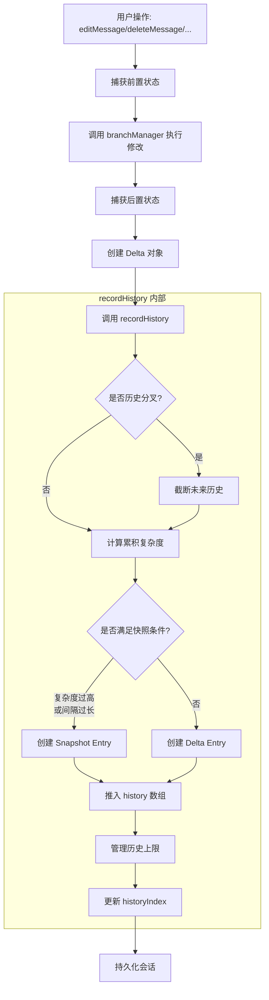
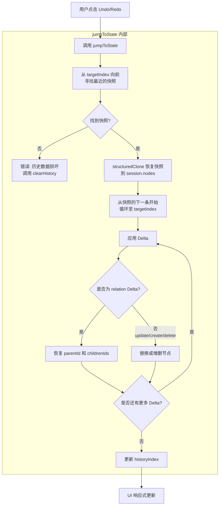
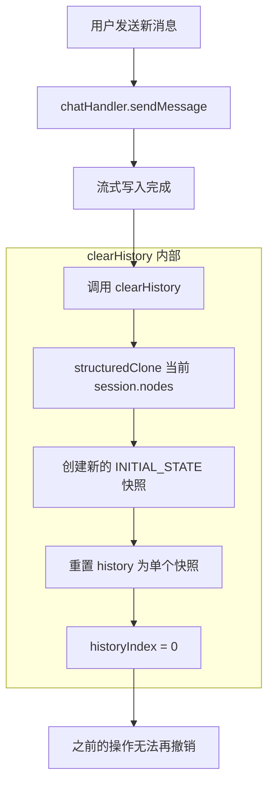

# 设计文档：LLM Chat 树视图撤销/重做系统（精简版）

## 1. 概述与核心目标

本系统为 LLM Chat 的**树形会话图编辑操作**提供撤销/重做功能。它专注于解决一个明确的痛点：用户在手动调整树结构时（如删除、移动、嫁接节点）可能会误操作，需要一个可靠的后悔机制。

**核心目标**：

- 允许用户撤销或重做对已有节点树的**手动编辑操作**
- 性能优先：避免深拷贝整个 `session.nodes` 对象
- 设计简洁：将新内容生成（如发送消息）排除在外，作为历史的"断点"

**非目标**：

- 不处理流式写入中的消息撤销（新消息生成会清空历史）
- 不提供跨会话的撤销/重做
- 不持久化历史记录（刷新后重置）

---

## 2. 设计边界与原则

### 2.1. 操作分类

| 类别           | 操作                                                                                           | 行为           |
| -------------- | ---------------------------------------------------------------------------------------------- | -------------- |
| **可撤销操作** | `deleteMessage`, `editMessage`, `toggleNodeEnabled`, `graftBranch`, `moveNode`, `createBranch` | 记录到历史堆栈 |
| **历史断点**   | `sendMessage`, `regenerateFromNode`                                                            | 清空历史堆栈   |

**核心逻辑**：

- 用户执行 `deleteMessage` 后，可以撤销。
- 但如果之后发送了新消息，历史被清空，之前的删除操作无法再撤销。
- 这样避免了异步生成与撤销操作之间的复杂竞态问题，也符合用户的直觉：新消息是一个"新的起点"。

### 2.2. 设计原则

1. **精准范围**：只管树结构的编辑，不管内容的生成。
2. **增量存储**：大部分操作只记录变化量（Delta），而非完整快照。
3. **智能快照**：当 Delta 累积复杂度过高时，自动创建快照作为"检查点"。
4. **关系优先**：树形结构的核心是父子关系（`parentId`, `childrenIds`），Delta 必须精确记录关系的变化。
5. **故障保险**：如果遇到任何无法处理的情况（如状态不一致），宁愿清空历史，也不能让用户撤销到错误的状态。

---

## 3. 技术架构

### 3.1. 架构图

```
┌───────────────────────────────────────────────┐
│  Vue Component (TreeGraph, MessageCard)      │
│  - 用户操作（删除、编辑、嫁接...）           │
└────────────────┬──────────────────────────────┘
                 │ 调用 Action
                 ▼
┌───────────────────────────────────────────────┐
│  useLlmChatStore (Pinia Setup Store)         │
│  - deleteMessage(), editMessage(), ...        │
│  - 执行操作后调用 recordHistory()             │
│  - sendMessage() 后调用 clearHistory()        │
└────────────────┬──────────────────────────────┘
                 │ 调用 Composable
                 ▼
┌───────────────────────────────────────────────┐
│  useSessionNodeHistory (Composable)          │
│  - recordHistory(actionTag, deltas)           │
│  - undo() / redo()                            │
│  - clearHistory()                             │
│  - _jumpToState(targetIndex)                  │
└────────────────┬──────────────────────────────┘
                 │ 操作数据
                 ▼
┌───────────────────────────────────────────────┐
│  ChatSession.history (Array<HistoryEntry>)   │
│  - 快照 (Snapshot) 或 增量 (Delta)            │
└───────────────────────────────────────────────┘
```

### 3.2. 职责划分

- **Vue Component**：响应用户交互，调用 Store 的 Action。
- **useLlmChatStore**：执行业务逻辑，捕获前后状态，调用 Composable 记录历史。
- **useSessionNodeHistory**：封装历史管理的所有逻辑，对外暴露 `undo()`, `redo()`, `recordHistory()`, `clearHistory()` 等方法。
- **ChatSession.history**：存储历史记录的数据结构。

---

## 4. 数据结构

### 4.1. 核心类型定义

```typescript
/**
 * 定义可被记录的操作类型
 */
export type HistoryActionTag =
  | "INITIAL_STATE"       // 初始状态（空历史）
  | "NODE_EDIT"           // 编辑节点内容/附件
  | "NODE_DELETE"         // 删除单个节点
  | "NODES_DELETE"        // 批量删除（如删除分支）
  | "NODE_TOGGLE_ENABLED" // 切换节点启用状态
  | "NODE_MOVE"           // 移动单个节点
  | "BRANCH_GRAFT"        // 嫁接整个分支
  | "BRANCH_CREATE";      // 复制分支

/**
 * 节点关系变化的记录
 * 用于精确恢复 parentId 和 childrenIds 的变化
 */
export interface NodeRelationChange {
  nodeId: string;
  oldParentId: string | null;
  newParentId: string | null;
  // 记录父节点的 childrenIds 变化
  affectedParents?: {
    [parentId: string]: {
      oldChildren: string[];
      newChildren: string[];
    };
  };
}

/**
 * 增量变化（Delta）的类型
 */
export type HistoryDelta =
  | {
      type: "create";
      {
        node: ChatMessageNode;
        relationChange: NodeRelationChange;
      };
    }
  | {
      type: "delete";
      {
        deletedNode: ChatMessageNode;
        relationChange: NodeRelationChange;
      };
    }
  | {
      type: "update";
      {
        nodeId: string;
        previousNodeState: ChatMessageNode;
        finalNodeState: ChatMessageNode;
      };
    }
  | {
      type: "relation";
      {
        changes: NodeRelationChange[];
      };
    };

/**
 * 历史上下文（用于生成摘要或调试）
 */
export interface HistoryContext {
  targetNodeId?: string;
  sourceNodeId?: string;
  destinationNodeId?: string;
  affectedNodeCount?: number;
}

/**
 * 历史记录条目（使用可辨识联合类型）
 */
export type HistoryEntry = {
  HistoryActionTag;
  timestamp: number;
  context: HistoryContext;
} & (
  | {
      isSnapshot: true;
      snapshot: Record<string, ChatMessageNode>;
    }
  | {
      isSnapshot: false;
      deltas: HistoryDelta[];
    }
);

/**
 * 更新 ChatSession 接口
 */
export interface ChatSession {
  // ... 现有属性 ...
  history: HistoryEntry[];
  historyIndex: number;
}
```

**关键设计**：

- `NodeRelationChange`：这是核心。它记录了节点关系的变化，确保撤销时能精确恢复 `parentId` 和 `childrenIds`。
- `HistoryDelta` 增加了 `relation` 类型：用于只改变关系、不改变内容的操作（如 `moveNode`）。
- `affectedParents`：记录父节点的 `childrenIds` 变化，确保撤销时能恢复父节点的子节点列表。

---

## 5. 核心逻辑 (useSessionNodeHistory Composable)

### 5.1. 常量

```typescript
const MAX_HISTORY_LENGTH = 50; // 精简版历史长度可以适当减少
const SNAPSHOT_COMPLEXITY_THRESHOLD = 30; // 累计影响节点数超过30个时创建快照
const SNAPSHOT_INTERVAL = 15; // 每15次操作也创建一次快照
```

### 5.2. 核心方法

#### 5.2.1. `recordHistory(actionTag, deltas, context)`

```typescript
function recordHistory(
  HistoryActionTag,
  deltas: HistoryDelta[],
  context: HistoryContext = {}
): void {
  const session = sessionRef.value;
  if (!session) return;

  // 1. 处理历史分叉：截断未来
  if (session.historyIndex < session.history.length - 1) {
    session.history = session.history.slice(0, session.historyIndex + 1);
  }

  // 2. 计算累积复杂度
  let affectedNodesCount = 0;
  let deltasSinceLastSnapshot = 0;

  // 从当前索引向前查找最近的快照
  for (let i = session.historyIndex; i >= 0; i--) {
    const entry = session.history[i];
    if (entry.isSnapshot) break;

    deltasSinceLastSnapshot++;
    if (!entry.isSnapshot) {
      affectedNodesCount += entry.deltas.reduce((count, delta) => {
        if (delta.type === "create" || delta.type === "delete") return count + 1;
        if (delta.type === "update") return count + 1;
        if (delta.type === "relation") return count + delta.payload.changes.length;
        return count;
      }, 0);
    }
  }

  // 当前操作涉及的节点数
  const currentAffectedCount = deltas.reduce((count, delta) => {
    if (delta.type === "create" || delta.type === "delete") return count + 1;
    if (delta.type === "update") return count + 1;
    if (delta.type === "relation") return count + delta.payload.changes.length;
    return count;
  }, 0);

  affectedNodesCount += currentAffectedCount;

  // 3. 决定创建快照还是增量
  const shouldCreateSnapshot =
    session.history.length === 0 || // 首次操作
    affectedNodesCount > SNAPSHOT_COMPLEXITY_THRESHOLD || // 复杂度过高
    deltasSinceLastSnapshot >= SNAPSHOT_INTERVAL; // 间隔次数过多

  const newEntry: HistoryEntry = shouldCreateSnapshot
    ? {
        isSnapshot: true,
        snapshot: structuredClone(session.nodes),
        actionTag,
        timestamp: Date.now(),
        context: { ...context, affectedNodeCount: currentAffectedCount },
      }
    : {
        isSnapshot: false,
        deltas,
        actionTag,
        timestamp: Date.now(),
        context: { ...context, affectedNodeCount: currentAffectedCount },
      };

  // 4. 推入堆栈
  session.history.push(newEntry);

  // 5. 管理上限
  if (session.history.length > MAX_HISTORY_LENGTH) {
    // 移除最旧的记录，但保留至少一个快照
    let removedCount = 0;
    while (session.history.length > MAX_HISTORY_LENGTH && removedCount < 5) {
      const firstEntry = session.history[0];
      if (firstEntry.isSnapshot && session.history.length > 1) {
        // 如果第一个是快照且有其他记录，可以移除
        session.history.shift();
        removedCount++;
      } else if (!firstEntry.isSnapshot) {
        // 如果第一个不是快照，可以移除
        session.history.shift();
        removedCount++;
      } else {
        // 只剩一个快照了，停止移除
        break;
      }
    }
  }

  // 6. 更新指针
  session.historyIndex = session.history.length - 1;
}
```

#### 5.2.2. `jumpToState(targetIndex)`

```typescript
function jumpToState(targetIndex: number): void {
  const session = sessionRef.value;
  if (!session || targetIndex < 0 || targetIndex >= session.history.length) {
    logger.warn("无效的历史索引", { targetIndex });
    return;
  }

  // 1. 寻找锚点快照
  let snapshotIndex = targetIndex;
  while (snapshotIndex >= 0) {
    if (session.history[snapshotIndex].isSnapshot) break;
    snapshotIndex--;
  }

  if (snapshotIndex < 0) {
    logger.error("找不到锚点快照，历史数据可能损坏");
    // 故障保险：清空历史
    clearHistory();
    return;
  }

  // 2. 恢复快照
  const snapshotEntry = session.history[snapshotIndex] as HistoryEntry & {
    isSnapshot: true;
  };
  session.nodes = structuredClone(snapshotEntry.snapshot);

  // 3. 正向重放 Delta
  for (let i = snapshotIndex + 1; i <= targetIndex; i++) {
    const entry = session.history[i];
    if (entry.isSnapshot) {
      // 如果中间又遇到快照，直接用快照替换
      session.nodes = structuredClone(entry.snapshot);
    } else {
      // 应用 Delta
      for (const delta of entry.deltas) {
        applyDelta(session, delta, "forward");
      }
    }
  }

  // 4. 更新指针
  session.historyIndex = targetIndex;

  logger.info("状态跳转完成", {
    targetIndex,
    snapshotIndex,
    currentNodeCount: Object.keys(session.nodes).length,
  });
}
```

#### 5.2.3. `applyDelta(session, delta, direction)`

```typescript
function applyDelta(
  session: ChatSession,
  delta: HistoryDelta,
  direction: "forward" | "backward"
): void {
  if (delta.type === "create") {
    if (direction === "forward") {
      // 正向：创建节点
      session.nodes[delta.payload.node.id] = structuredClone(delta.payload.node);
      // 恢复父子关系
      applyRelationChange(session, delta.payload.relationChange, "forward");
    } else {
      // 反向：删除节点
      delete session.nodes[delta.payload.node.id];
      applyRelationChange(session, delta.payload.relationChange, "backward");
    }
  } else if (delta.type === "delete") {
    if (direction === "forward") {
      // 正向：删除节点
      delete session.nodes[delta.payload.deletedNode.id];
      applyRelationChange(session, delta.payload.relationChange, "forward");
    } else {
      // 反向：恢复节点
      session.nodes[delta.payload.deletedNode.id] = structuredClone(delta.payload.deletedNode);
      applyRelationChange(session, delta.payload.relationChange, "backward");
    }
  } else if (delta.type === "update") {
    if (direction === "forward") {
      session.nodes[delta.payload.nodeId] = structuredClone(delta.payload.finalNodeState);
    } else {
      session.nodes[delta.payload.nodeId] = structuredClone(delta.payload.previousNodeState);
    }
  } else if (delta.type === "relation") {
    // 纯关系变更
    for (const change of delta.payload.changes) {
      applyRelationChange(session, change, direction);
    }
  }
}
```

#### 5.2.4. `applyRelationChange(session, change, direction)`

```typescript
function applyRelationChange(
  session: ChatSession,
  change: NodeRelationChange,
  direction: "forward" | "backward"
): void {
  const node = session.nodes[change.nodeId];
  if (!node) return;

  // 恢复节点的 parentId
  if (direction === "forward") {
    node.parentId = change.newParentId;
  } else {
    node.parentId = change.oldParentId;
  }

  // 恢复受影响父节点的 childrenIds
  if (change.affectedParents) {
    for (const [parentId, childrenChange] of Object.entries(change.affectedParents)) {
      const parentNode = session.nodes[parentId];
      if (!parentNode) continue;

      if (direction === "forward") {
        parentNode.childrenIds = [...childrenChange.newChildren];
      } else {
        parentNode.childrenIds = [...childrenChange.oldChildren];
      }
    }
  }
}
```

#### 5.2.5. `clearHistory()`

```typescript
function clearHistory(): void {
  const session = sessionRef.value;
  if (!session) return;

  // 创建一个当前状态的快照作为新的历史起点
  session.history = [
    {
      isSnapshot: true,
      snapshot: structuredClone(session.nodes),
      'INITIAL_STATE',
      timestamp: Date.now(),
      context: {},
    },
  ];
  session.historyIndex = 0;

  logger.info('历史堆栈已清空');
}
```

#### 5.2.6. `undo()` 和 `redo()`

```typescript
function undo(): void {
  const session = sessionRef.value;
  if (!session || session.historyIndex <= 0) return;

  jumpToState(session.historyIndex - 1);
}

function redo(): void {
  const session = sessionRef.value;
  if (!session || session.historyIndex >= session.history.length - 1) return;

  jumpToState(session.historyIndex + 1);
}
```

### 5.3. 暴露的 API

```typescript
return {
  undo,
  redo,
  recordHistory,
  clearHistory,
  canUndo: computed(() => (sessionRef.value?.historyIndex ?? 0) > 0),
  canRedo: computed(
    () => (sessionRef.value?.historyIndex ?? -1) < (sessionRef.value?.history.length ?? 0) - 1
  ),
  historyStack: computed(() => sessionRef.value?.history ?? []),
};
```

---

## 6. 与 Store 的集成

### 6.1. Setup Store 示例

```typescript
// store.ts
export const useLlmChatStore = defineStore('llmChat', () => {
  const sessions = ref<ChatSession[]>([]);
  const currentSessionId = ref<string | null>(null);

  const currentSession = computed((): ChatSession | null => {
    if (!currentSessionId.value) return null;
    return sessions.value.find((s) => s.id === currentSessionId.value) || null;
  });

  // 实例化历史管理 Composable
  const { undo, redo, recordHistory, clearHistory, canUndo, canRedo } =
    useSessionNodeHistory(currentSession);

  // ==================== Actions ====================

  /**
   * 编辑消息
   */
  async function editMessage(
    nodeId: string,
    newContent: string,
    attachments?: Asset[]
  ): Promise<void> {
    const session = currentSession.value;
    if (!session) return;

    // 1. 捕获前置状态
    const previousNodeState = structuredClone(session.nodes[nodeId]);

    // 2. 执行操作
    const branchManager = useBranchManager();
    const success = branchManager.editMessage(session, nodeId, newContent, attachments);

    if (success) {
      // 3. 捕获后置状态
      const finalNodeState = structuredClone(session.nodes[nodeId]);

      // 4. 记录变化
      const delta: HistoryDelta = {
        type: 'update',
        { nodeId, previousNodeState, finalNodeState },
      };
      recordHistory('NODE_EDIT', [delta], { targetNodeId: nodeId });

      // 5. 持久化
      sessionManager.persistSession(session, currentSessionId.value);
    }
  }

  /**
   * 删除消息
   */
  function deleteMessage(nodeId: string): void {
    const session = currentSession.value;
    if (!session) return;

    const branchManager = useBranchManager();

    // 1. 捕获前置状态（获取将被删除的节点列表）
    const { success, deletedNodes } = branchManager.deleteMessage(session, nodeId);

    if (success && deletedNodes.length > 0) {
      // 2. 记录变化
      const deltas: HistoryDelta[] = deletedNodes.map((node) => ({
        type: 'delete',
        {
          deletedNode: node,
          relationChange: extractRelationChange(session, node, 'delete'),
        },
      }));

      recordHistory('NODES_DELETE', deltas, {
        targetNodeId: nodeId,
        affectedNodeCount: deletedNodes.length,
      });

      // 3. 持久化
      sessionManager.persistSession(session, currentSessionId.value);
    }
  }

  /**
   * 嫁接分支
   */
  function graftBranch(nodeId: string, newParentId: string): void {
    const session = currentSession.value;
    if (!session) return;

    // 1. 捕获前置状态
    const relationChanges = captureRelationChangesForGraft(session, nodeId, newParentId);

    // 2. 执行操作
    const branchManager = useBranchManager();
    const success = branchManager.graftBranch(session, nodeId, newParentId);

    if (success) {
      // 3. 记录变化
      const delta: HistoryDelta = {
        type: 'relation',
        { changes: relationChanges },
      };

      recordHistory('BRANCH_GRAFT', [delta], {
        targetNodeId: nodeId,
        destinationNodeId: newParentId,
      });

      // 4. 持久化
      sessionManager.persistSession(session, currentSessionId.value);
    }
  }

  /**
   * 发送消息（历史断点）
   */
  async function sendMessage(content: string, attachments?: Asset[]): Promise<void> {
    const session = currentSession.value;
    if (!session) throw new Error('No active session');

    try {
      const chatHandler = useChatHandler();
      await chatHandler.sendMessage(
        session,
        content,
        currentActivePath.value,
        abortControllers,
        generatingNodes,
        attachments
      );

      // ★ 清空历史堆栈（历史断点）
      clearHistory();

      sessionManager.persistSession(session, currentSessionId.value);
    } catch (error) {
      throw error;
    } finally {
      if (generatingNodes.size === 0) {
        isSending.value = false;
      }
    }
  }

  /**
   * 重新生成（历史断点）
   */
  async function regenerateFromNode(nodeId: string): Promise<void> {
    const session = currentSession.value;
    if (!session) return;

    try {
      const chatHandler = useChatHandler();
      await chatHandler.regenerateFromNode(
        session,
        nodeId,
        currentActivePath.value,
        abortControllers,
        generatingNodes
      );

      // ★ 清空历史堆栈（历史断点）
      clearHistory();

      sessionManager.persistSession(session, currentSessionId.value);
    } catch (error) {
      throw error;
    } finally {
      if (generatingNodes.size === 0) {
        isSending.value = false;
      }
    }
  }

  // ==================== 暴露 API ====================
  return {
    sessions,
    currentSessionId,
    currentSession,
    editMessage,
    deleteMessage,
    graftBranch,
    sendMessage,
    regenerateFromNode,
    undo,
    redo,
    canUndo,
    canRedo,
  };
});
```

### 6.2. 辅助函数

```typescript
/**
 * 提取节点关系变化（用于 delete）
 */
function extractRelationChange(
  session: ChatSession,
  node: ChatMessageNode,
  operation: "delete"
): NodeRelationChange {
  const oldParentId = node.parentId;
  const newParentId = null; // 删除操作，新父节点为 null

  const affectedParents: NodeRelationChange["affectedParents"] = {};

  if (oldParentId) {
    const oldParent = session.nodes[oldParentId];
    if (oldParent) {
      affectedParents[oldParentId] = {
        oldChildren: [...oldParent.childrenIds],
        newChildren: oldParent.childrenIds.filter((id) => id !== node.id),
      };
    }
  }

  return {
    nodeId: node.id,
    oldParentId,
    newParentId,
    affectedParents,
  };
}

/**
 * 捕获嫁接操作的关系变化（批量）
 */
function captureRelationChangesForGraft(
  session: ChatSession,
  nodeId: string,
  newParentId: string
): NodeRelationChange[] {
  const node = session.nodes[nodeId];
  if (!node) return [];

  const oldParentId = node.parentId;
  const affectedParents: NodeRelationChange["affectedParents"] = {};

  // 记录旧父节点的 childrenIds 变化
  if (oldParentId) {
    const oldParent = session.nodes[oldParentId];
    if (oldParent) {
      affectedParents[oldParentId] = {
        oldChildren: [...oldParent.childrenIds],
        newChildren: oldParent.childrenIds.filter((id) => id !== nodeId),
      };
    }
  }

  // 记录新父节点的 childrenIds 变化
  const newParent = session.nodes[newParentId];
  if (newParent) {
    affectedParents[newParentId] = {
      oldChildren: [...newParent.childrenIds],
      newChildren: [...newParent.childrenIds, nodeId],
    };
  }

  return [
    {
      nodeId,
      oldParentId,
      newParentId,
      affectedParents,
    },
  ];
}
```

---

## 7. 流程图

### 7.1. 记录历史流程



### 7.2. 状态恢复流程



### 7.3. 历史清空流程



---

## 8. 实现步骤

### 8.1. 第一阶段：基础框架（优先级：高）

1. **创建 `useSessionNodeHistory` Composable**
   - 实现 `recordHistory`, `undo`, `redo`, `clearHistory`
   - 实现 `jumpToState` 和 `applyDelta`
   - 编写单元测试，验证快照和增量切换的正确性

2. **更新 ChatSession 类型**
   - 添加 `history: HistoryEntry[]` 和 `historyIndex: number` 字段
   - 确保初始化时创建一个空的初始快照

3. **集成到 Store**
   - 将 `useLlmChatStore` 改为 Setup Store
   - 实例化 `useSessionNodeHistory`
   - 在 `sendMessage` 和 `regenerateFromNode` 中调用 `clearHistory()`

### 8.2. 第二阶段：核心操作集成（优先级：高）

1. **实现 `editMessage` 的历史记录**
   - 捕获前后状态
   - 调用 `recordHistory('NODE_EDIT', [delta])`

2. **实现 `deleteMessage` 的历史记录**
   - 修改 `branchManager.deleteMessage` 使其返回 `{ success, deletedNodes }`
   - 为每个删除的节点创建 `delete` 类型的 Delta
   - 记录关系变化（`NodeRelationChange`）

3. **实现 `toggleNodeEnabled` 的历史记录**
   - 使用 `update` 类型的 Delta
   - 记录前后的 `isEnabled` 状态

### 8.3. 第三阶段：复杂操作（优先级：中）

1. **实现 `graftBranch` 的历史记录**
   - 捕获关系变化（使用 `captureRelationChangesForGraft`）
   - 使用 `relation` 类型的 Delta

2. **实现 `moveNode` 的历史记录**
   - 类似 `graftBranch`，但只涉及单个节点

3. **实现 `createBranch` 的历史记录**
   - 使用 `create` 类型的 Delta

### 8.4. 第四阶段：UI 集成（优先级：中）

1. **在树视图中添加 Undo/Redo 按钮**
   - 调用 `store.undo()` 和 `store.redo()`
   - 绑定 `canUndo` 和 `canRedo` 控制按钮禁用状态

2. **键盘快捷键**
   - `Ctrl+Z` / `Cmd+Z` → Undo
   - `Ctrl+Shift+Z` / `Cmd+Shift+Z` → Redo

3. **历史记录面板（可选）**
   - 显示 `historyStack`
   - 允许用户点击跳转到任意历史状态

### 8.5. 第五阶段：优化与测试（优先级：低）

1. **性能测试**
   - 测试在包含 500+ 节点的会话中执行 Undo/Redo 的耗时
   - 如果 `structuredClone` 成为瓶颈，考虑使用浅拷贝 + 写时复制（COW）策略

2. **边缘情况处理**
   - 测试并修复撤销到中间状态后切换会话的情况
   - 测试并修复历史堆栈超过上限时的表现

3. **日志与调试**
   - 在 `recordHistory` 和 `jumpToState` 中添加详细的日志
   - 提供一个调试模式，可以在控制台输出当前的历史堆栈

---

## 9. 边缘情况与注意事项

### 9.1. 预设消息的处理

- **问题**：预设消息（`nodeId.startsWith('preset-')`）不在 `session.nodes` 中，如何处理？
- **方案**：预设消息不参与撤销/重做。对预设消息的编辑直接反向保存到 Agent 配置，不记录历史。

### 9.2. 会话切换

- **问题**：用户在会话 A 中撤销了几步，然后切换到会话 B，再切回会话 A，是否保留撤销状态？
- **方案**：保留。每个会话的 `history` 和 `historyIndex` 是独立的，切换会话时不影响历史状态。

### 9.3. 内存限制

- **问题**：50 条历史记录 × 每条可能包含大快照 = 可能数百 MB 内存
- **方案**：
  - 在 `MAX_HISTORY_LENGTH` 管理中，优先移除增量记录，保留快照。
  - 如果内存依然不足，可以引入"软限制"（如总内存占用 < 50MB），动态调整 `MAX_HISTORY_LENGTH`。

### 9.4. 持久化

- **问题**：历史记录是否需要持久化？
- **方案**：**不需要**。历史记录是临时的、会话级的。刷新后清空历史是合理的，用户可以重新开始。这也避免了持久化大量历史数据的开销。

### 9.5. 活动叶节点的同步

- **问题**：撤销一个删除操作后，`session.activeLeafId` 是否需要更新？
- **方案**：
  - 如果撤销后原来的 `activeLeafId` 依然存在，保持不变。
  - 如果不存在（例如被删除了），则在 `jumpToState` 之后调用 `BranchNavigator.ensureValidActiveLeaf(session)` 来修复。

---

## 10. 总结

这份精简版设计通过明确的边界划分（树编辑 vs. 新内容生成）和智能的存储策略（快照 + 增量 + 复杂度阈值），在保证功能完备的同时，避免了过度设计的陷阱。

**核心优势**：

1. **简洁**：不处理异步生成，逻辑清晰。
2. **高效**：增量存储，避免频繁深拷贝。
3. **健壮**：关系优先，确保撤销后树结构一致。
4. **可控**：历史断点机制，避免状态失控。
