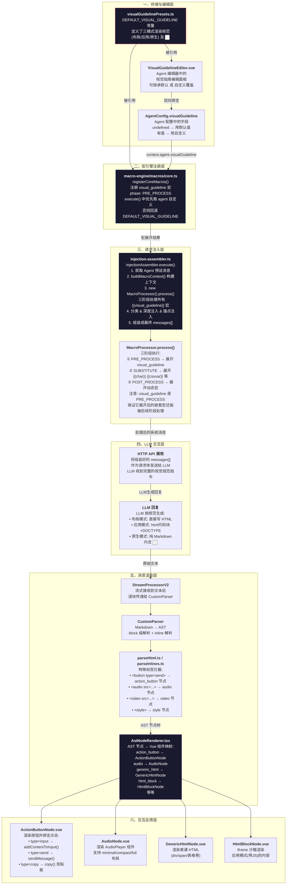

# `visualGuidelinePresets.ts` 数据流全链路分析

> 更新日期： 2026年5月7日

## 链路总览



## 链路关键阶段详解

### 阶段 1: 宏定义 → 文本注入

在 [`macro-engine/macros/core.ts`](src/tools/llm-chat/macro-engine/macros/core.ts:256) 中，`{{visual_guideline}}` 被定义为 **PRE_PROCESS** 阶段宏（priority=10），优先级最高。执行时优先取 Agent 自定义的 `visualGuideline`，否则用 [`visualGuidelinePresets.ts`](src/tools/llm-chat/config/visualGuidelinePresets.ts:6) 的 [`DEFAULT_VISUAL_GUIDELINE`](src/tools/llm-chat/config/visualGuidelinePresets.ts:6)。

这个宏被放在 PRE_PROCESS 阶段是关键设计——它展开后文本中可能包含 `{{char}}`、`{{cssvar::*}}` 等嵌套宏，这些会在后续 SUBSTITUTE / POST_PROCESS 阶段继续被解析。

### 阶段 2: 请求组装

[`injection-assembler.ts`](src/tools/llm-chat/core/context-processors/injection-assembler.ts:400) 在构建 LLM 请求时：

1. 通过 `buildMacroContext()` 构建上下文（包含 agent、model、profile 等信息）
2. 创建 `MacroProcessor` 实例，遍历所有激活的预设消息
3. 对每个包含 `{{` 的预设消息执行 `processMacros()` → `processor.process()`
4. 三阶段执行后，`{{visual_guideline}}` 被替换为完整的视觉规范文本

### 阶段 3: LLM 回复解析

LLM 根据视觉规范生成回复后，由 `rich-text-renderer` 工具解析渲染：

**Markdown → Token → AST 流程：**

| 输入示例                                   | Token 化                                                                  | AST 节点                                                           | 渲染组件                          |
| :----------------------------------------- | :------------------------------------------------------------------------ | :----------------------------------------------------------------- | :-------------------------------- |
| `<Button type="send" value="发送"/>`       | `html_open{tagName:button,attrs:{type:send,value:发送},selfClosing:true}` | `action_button{props:{action:"send",label:"发送",content:"发送"}}` | `ActionButtonNode.vue`            |
| `<audio src="file.mp3" layout="compact"/>` | `html_open{tagName:audio,attrs:{src:file.mp3,layout:compact}}`            | `audio{props:{src:"file.mp3",layout:"compact"}}`                   | `AudioNode.vue`                   |
| `<div style="...">内容</div>`              | `html_open` → 收集内部tokens → `html_close`                               | `generic_html{tagName:"div",children:[...]}`                       | `GenericHtmlNode.vue`             |
| `html\n<!DOCTYPE html>...\n`               | `code_fence{language:"html"}` → 检测 `<!DOCTYPE html>`                    | `html_block{props:{content:"..."}}`                                | `HtmlBlockNode.vue`（iframe沙箱） |

**关键拦截代码：**

- [`parseInlines.ts:79-106`](src/tools/rich-text-renderer/parser/inline/parseInlines.ts:79) — 拦截 `<audio>` / `<video>` 标签直接生成专有 AST 节点
- [`parseInlines.ts:108-162`](src/tools/rich-text-renderer/parser/inline/parseInlines.ts:108) — 拦截 `<button type="send|input|copy">` 生成 `action_button` 节点
- [`parseHtmlInline.ts:37-93`](src/tools/rich-text-renderer/parser/inline/parseHtmlInline.ts:37) — HTML 块内的同逻辑拦截（给 `parseHtmlContent` 用）
- [`AstNodeRenderer.tsx:179-187`](src/tools/rich-text-renderer/components/AstNodeRenderer.tsx:179) — 渲染器层面额外拦截 `generic_html` 中的 `video`/`audio`/`style` 标签

### 阶段 4: 交互反馈闭环

**Button 点击 → 聊天服务：**

```
ActionButtonNode.handleClick()
  → toolRegistryManager.getRegistry("llm-chat")
  → type=input: addContentToInput(content)
  → type=send: sendMessage(content, options)
  → type=copy: useClipboard.copy()
```

值得注意的是 `send` 类型支持分支功能——通过 `inject("agentInteractionConfig")` 获取配置，如果 `sendButtonCreateBranch` 为 true，则以当前消息为 `parentId` 创建新分支发送。

## 核心设计决策总结

| 决策                                  | 原因                                                          |
| :------------------------------------ | :------------------------------------------------------------ |
| 宏阶段设为 PRE_PROCESS                | 保证展开后嵌套的 `{{char}}`、`{{cssvar::*}}` 能被后续阶段处理 |
| 宏优先级 priority=10                  | 在所有 VALUE 宏（priority=50~200）之前执行                    |
| Agent 可自定义 visualGuideline        | 不同角色可用不同视觉风格指令；传 `undefined` 则继承系统默认   |
| `<Button>` 只拦截白名单 action        | 安全性：非 send/input/copy 的 `<button>` 当普通 HTML 渲染     |
| 代码块 + `<!DOCTYPE html>` → 应用模式 | iframe 沙箱隔离 JS 执行，防止影响主应用                       |
