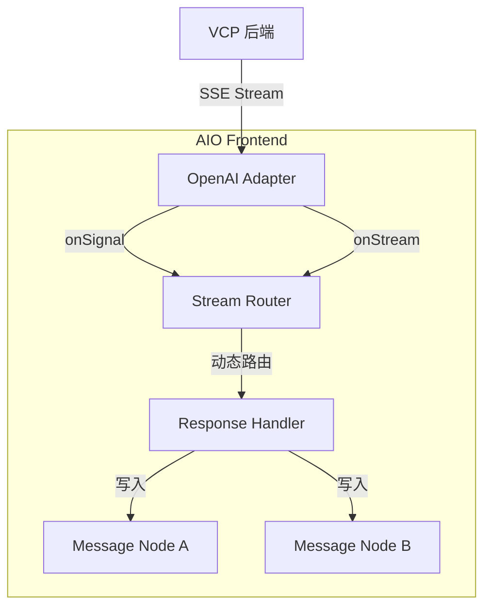

# VCP 流式消息切分实施计划

## 📋 概述

**目标**：在 AIO 前端实现对 VCP 后端发送的"协议外信号"的支持，使得在单个 SSE 连接中，能够根据后端信号动态切分消息节点，实现"流中接力"机制。

**核心思路**：通过在适配器和执行器之间插入一个"流式路由层"，实现物理流的连续性与逻辑节点的离散性的完美结合。

**状态**：`Draft` - 待审批

**创建时间**：2026-03-10

---

## 🎯 核心目标

1. **信号透传**：适配器能够识别并转发 VCP 的协议外信号（如 `vcp_action: "message_split"`）
2. **动态节点切换**：在不中断 SSE 连接的情况下，动态创建新的消息节点并切换写入目标
3. **架构解耦**：通过独立的路由器 Composable 实现职责分离，避免 `useChatExecutor` 过度膨胀
4. **向后兼容**：对非 VCP 渠道保持完全透明，不影响现有功能

---

## 🏗️ 架构设计

### 1. 整体数据流



### 2. 核心组件职责

#### 2.1 适配器层 (`src/llm-apis/adapters/openai/chat.ts`)

- **职责**：解析 SSE 数据块，区分"文本内容"和"协议外信号"
- **改动**：在 `parseSSEStream` 中增加信号嗅探逻辑
- **输出**：
  - `onStream(chunk: string)` - 文本内容
  - `onSignal(signal: any)` - 协议外信号（新增）

#### 2.2 流式路由器 (`src/tools/llm-chat/composables/chat/useStreamRouter.ts`)

- **职责**：维护"当前写入目标节点 ID"，根据信号动态切换
- **核心状态**：`currentNodeId: Ref<string>`
- **核心方法**：
  - `handleStream(chunk: string)` - 将文本路由到当前节点
  - `handleSignal(signal: any)` - 处理信号并切换节点
  - `getCurrentNodeId()` - 获取当前节点 ID

#### 2.3 执行器层 (`src/tools/llm-chat/composables/chat/useChatExecutor.ts`)

- **职责**：初始化路由器，提供节点创建回调
- **改动**：在 `executeRequest` 中集成路由器
- **保持**：核心请求逻辑不变，只增加路由器集成代码

---

## 📝 详细实施步骤

### Phase 1: 类型定义与接口扩展

#### 1.1 扩展 `LlmRequestOptions` 接口

**文件**：`src/llm-apis/common.ts`

```typescript
export interface LlmRequestOptions {
  // ... 现有字段

  /**
   * 协议外信号回调（用于 VCP 等自定义协议）
   * @param signal 信号对象，通常包含 vcp_action 等字段
   */
  onSignal?: (signal: any) => void;
}
```

#### 1.2 定义路由器接口

**文件**：`src/tools/llm-chat/composables/chat/useStreamRouter.ts`（新建）

```typescript
/**
 * 流式路由器配置选项
 */
export interface StreamRouterOptions {
  /** 初始写入目标节点 ID */
  initialNodeId: string;

  /** 文本块处理回调 */
  onChunk: (nodeId: string, chunk: string, isReasoning?: boolean) => void;

  /**
   * 节点切换回调
   * @param signal 触发切换的信号
   * @param currentNodeId 当前节点 ID
   * @returns 新节点 ID
   */
  onSplit: (signal: any, currentNodeId: string) => Promise<string> | string;

  /** 是否启用路由（用于非 VCP 渠道的透传模式） */
  enabled?: boolean;
}

/**
 * 流式路由器返回值
 */
export interface StreamRouter {
  /** 处理文本流 */
  handleStream: (chunk: string, isReasoning?: boolean) => void;

  /** 处理协议外信号 */
  handleSignal: (signal: any) => Promise<void>;

  /** 获取当前写入目标节点 ID */
  getCurrentNodeId: () => string;

  /** 手动切换节点（用于测试或特殊场景） */
  switchNode: (newNodeId: string) => void;
}
```

---

### Phase 2: 适配器层改造

#### 2.1 修改 OpenAI 适配器

**文件**：`src/llm-apis/adapters/openai/chat.ts`

**改动点**：在 `callOpenAiChatApi` 函数的 SSE 解析逻辑中增加信号嗅探

```typescript
// 伪代码示例
parseSSEStream(response.body, {
  onData: (data) => {
    // 尝试解析为 JSON
    const json = tryParseJSON(data);

    // 检测协议外信号
    if (json?.vcp_action) {
      logger.debug("检测到 VCP 协议外信号", { signal: json });
      options.onSignal?.(json);
      return; // 不继续处理为文本
    }

    // 原有的文本提取逻辑
    const text = extractTextFromChunk(data);
    if (text) {
      options.onStream?.(text);
    }
  },
});
```

**注意事项**：

- 信号检测应在文本提取之前
- 信号不应被当作文本内容处理
- 需要保持对标准 OpenAI 协议的兼容性

---

### Phase 3: 流式路由器实现

#### 3.1 创建路由器 Composable

**文件**：`src/tools/llm-chat/composables/chat/useStreamRouter.ts`（新建）

**核心实现**：

```typescript
import { ref } from "vue";
import { createModuleLogger } from "@/utils/logger";

const logger = createModuleLogger("llm-chat/stream-router");

export function useStreamRouter(options: StreamRouterOptions): StreamRouter {
  const currentNodeId = ref(options.initialNodeId);
  const isEnabled = options.enabled ?? true;

  const handleStream = (chunk: string, isReasoning = false) => {
    if (!isEnabled) {
      // 透传模式：直接使用初始节点
      options.onChunk(options.initialNodeId, chunk, isReasoning);
      return;
    }

    // 路由模式：使用当前节点
    options.onChunk(currentNodeId.value, chunk, isReasoning);
  };

  const handleSignal = async (signal: any) => {
    if (!isEnabled) {
      logger.debug("路由器未启用，忽略信号", { signal });
      return;
    }

    if (signal.vcp_action === "message_split") {
      logger.info("🔀 检测到消息切分信号，准备切换节点", {
        currentNodeId: currentNodeId.value,
        signal,
      });

      try {
        const newNodeId = await options.onSplit(signal, currentNodeId.value);
        currentNodeId.value = newNodeId;

        logger.info("✅ 节点切换完成", {
          oldNodeId: currentNodeId.value,
          newNodeId,
        });
      } catch (error) {
        logger.error("节点切换失败", error, { signal });
      }
    } else {
      logger.debug("收到未知信号类型", { signal });
    }
  };

  const getCurrentNodeId = () => currentNodeId.value;

  const switchNode = (newNodeId: string) => {
    logger.debug("手动切换节点", {
      oldNodeId: currentNodeId.value,
      newNodeId,
    });
    currentNodeId.value = newNodeId;
  };

  return {
    handleStream,
    handleSignal,
    getCurrentNodeId,
    switchNode,
  };
}
```

---

### Phase 4: 执行器集成

#### 4.1 修改 `useChatExecutor.ts`

**文件**：`src/tools/llm-chat/composables/chat/useChatExecutor.ts`

**改动位置**：`executeRequest` 函数内部，`sendRequest` 调用之前

**集成代码**：

```typescript
// 在 executeRequest 函数中，sendRequest 调用之前

// 1. 判断是否为 VCP 渠道（已有逻辑，复用即可）
const isVcpChannel = /* ... 现有判断逻辑 ... */;

// 2. 初始化流式路由器
const streamRouter = useStreamRouter({
  initialNodeId: currentAssistantNode.id,
  enabled: isVcpChannel, // 只在 VCP 渠道启用

  onChunk: (nodeId, chunk, isReasoning) => {
    handleStreamUpdate(session, nodeId, chunk, isReasoning || false);
  },

  onSplit: async (signal, currentNodeId) => {
    logger.info("🔄 执行节点切分逻辑", { signal, currentNodeId });

    // 1. 结束当前节点
    const currentNode = session.nodes[currentNodeId];
    if (currentNode) {
      currentNode.status = "complete";
      // 可选：记录切分元数据
      currentNode.metadata = {
        ...currentNode.metadata,
        splitByVcp: true,
        splitSignal: signal,
      };
    }

    // 2. 从生成集合中移除旧节点
    generatingNodes.delete(currentNodeId);

    // 3. 创建新的接力节点
    const newAssistantNode: ChatMessageNode = {
      id: `assistant-${Date.now()}-${Math.random().toString(36).substring(2, 9)}`,
      parentId: currentNodeId,
      childrenIds: [],
      role: "assistant",
      content: "",
      status: "generating",
      timestamp: new Date().toISOString(),
      metadata: {
        agentId: executionAgent.id,
        // 继承前一个节点的元数据
        ...currentNode?.metadata,
        // 重置性能指标
        firstTokenTime: undefined,
        requestStartTime: Date.now(),
        requestEndTime: undefined,
        usage: undefined,
        contentTokens: undefined,
        // 标记为接力节点
        isRelayNode: true,
        relayFromNodeId: currentNodeId,
      },
    };

    // 4. 更新会话树结构
    session.nodes[newAssistantNode.id] = newAssistantNode;
    if (currentNode) {
      currentNode.childrenIds.push(newAssistantNode.id);
    }

    // 5. 维护状态集合
    generatingNodes.add(newAssistantNode.id);
    abortControllers.set(newAssistantNode.id, abortController);

    // 6. 更新活跃叶节点
    const nodeManager = useNodeManager();
    nodeManager.updateActiveLeaf(session, newAssistantNode.id);

    // 7. 立即持久化
    const sessionManager = useSessionManager();
    sessionManager.persistSession(session, session.id);

    // 8. 更新当前助手节点引用（用于后续的 finalizeNode 等操作）
    currentAssistantNode = newAssistantNode;

    return newAssistantNode.id;
  },
});

// 3. 修改 sendRequest 调用
await sendRequest({
  // ... 现有参数
  onStream: settings.value.uiPreferences.isStreaming
    ? (chunk: string) => {
        hasReceivedStreamData = true;
        streamRouter.handleStream(chunk, false);
      }
    : undefined,
  onReasoningStream: settings.value.uiPreferences.isStreaming
    ? (chunk: string) => {
        hasReceivedStreamData = true;
        streamRouter.handleStream(chunk, true);
      }
    : undefined,
  // 新增：信号处理
  onSignal: isVcpChannel
    ? (signal: any) => {
        streamRouter.handleSignal(signal);
      }
    : undefined,
});
```

**关键点**：

- 只在 VCP 渠道启用路由器
- 路由器的 `onSplit` 回调中完成所有节点创建和状态维护逻辑
- 需要更新 `currentAssistantNode` 引用，确保后续的 `finalizeNode` 等操作作用于正确的节点

---

### Phase 5: 清理与优化

#### 5.1 清理 finally 块

**文件**：`src/tools/llm-chat/composables/chat/useChatExecutor.ts`

**问题**：原有的 `finally` 块只清理 `assistantNode.id`，但在流式接力场景下，最终节点可能是 `currentAssistantNode.id`

**修改**：

```typescript
finally {
  abortControllers.delete(assistantNode.id);
  generatingNodes.delete(assistantNode.id);

  // 清理可能的接力节点
  if (currentAssistantNode?.id && currentAssistantNode.id !== assistantNode.id) {
    abortControllers.delete(currentAssistantNode.id);
    generatingNodes.delete(currentAssistantNode.id);
  }
}
```

#### 5.2 工具调用逻辑兼容

**位置**：`executeRequest` 函数的工具调用处理部分

**注意**：在 VCP 渠道下，工具调用由后端处理，前端的内置工具解析逻辑应被禁用（已有 `isVcpChannel` 判断，无需额外改动）

---

## 📝 备注

- 本计划假设 VCP 后端已经实现了 `message_split` 信号的发送逻辑
- 如果后端信号格式有变化，前端需要同步调整
- 建议在实施前与后端团队确认信号的具体格式和时机

---

# 📝 VCP 流式消息切分实施报告

## 1. 核心目标

在 LLM 执行工具调用（Tool Call）时，通过在 SSE 流中植入“协议外信号”，引导前端（AIO）主动切分消息节点，并物理截断模型可能产生的“幻觉内容”。

## 2. 前端兼容性调研结论 (Vchat)

经过对 `VCPChat` 仓库的深度代码审计，结论如下：

- **兼容性：完美（无感）**
- **技术细节**：Vchat 的 SSE 解析器（[`vcpClient.js`](relative/modules/vcpClient.js)）与流渲染器（[`streamManager.js`](relative/modules/renderer/streamManager.js)）均使用了严谨的可选链（Optional Chaining）和空值检查。
- **表现**：当后端发送非标准 JSON 包（如 `message_split`）时，Vchat 会因为找不到 `choices` 字段而提取到空字符串，随后触发 `if (!textToAppend) return;` 逻辑。**信号包会被静默忽略，不会导致 UI 闪烁或报错。**

---

## 3. VCP 后端实施细节方案 (待执行)

**目标文件**：`modules/handlers/streamHandler.js` (VCP Server 侧)

### 3.1 植入分割信号

在解析出工具调用后，立即向 SSE 响应流中写入信号包。

```javascript
// 逻辑位置：ToolCallParser.parse(currentAIContentForLoop) 之后
if (toolCalls.length > 0) {
  if (!res.writableEnded && !res.destroyed) {
    const splitSignal = {
      vcp_action: "message_split",
      reason: "tool_call_detected",
      tool_count: toolCalls.length,
      timestamp: Date.now(),
    };
    res.write(`data: ${JSON.stringify(splitSignal)}\n\n`);
  }
}
```

### 3.2 幻觉物理截断 (逻辑清洗)

在将 `assistant` 内容推入下一轮迭代的上下文之前，必须截掉结束标记之后的所有内容，防止模型自编工具返回结果。

```javascript
const endMarker = "<<<[END_TOOL_REQUEST]>>>";
const endIndex = currentAIContentForLoop.lastIndexOf(endMarker);

if (endIndex !== -1) {
  // 物理截断：只保留到结束标记为止的内容
  currentAIContentForLoop = currentAIContentForLoop.substring(0, endIndex + endMarker.length);
}
```

---

## 4. 风险审计与建议

1.  **信号频率**：仅在 `toolCalls.length > 0` 时触发一次，避免对流带宽造成额外负担。
2.  **ID 协同**：建议在 `vcpInfo` 包中增加 `parent_message_id` 字段，方便 AIO 建立消息树。
3.  **状态同步**：确保在发送 `message_split` 后，后端的 `recursionDepth` 计数逻辑保持不变，仅改变前端的展示结构。

---

**文档版本**：v1.0  
**最后更新**：2026-03-10  
**负责人**：咕咕 (Kilo)


