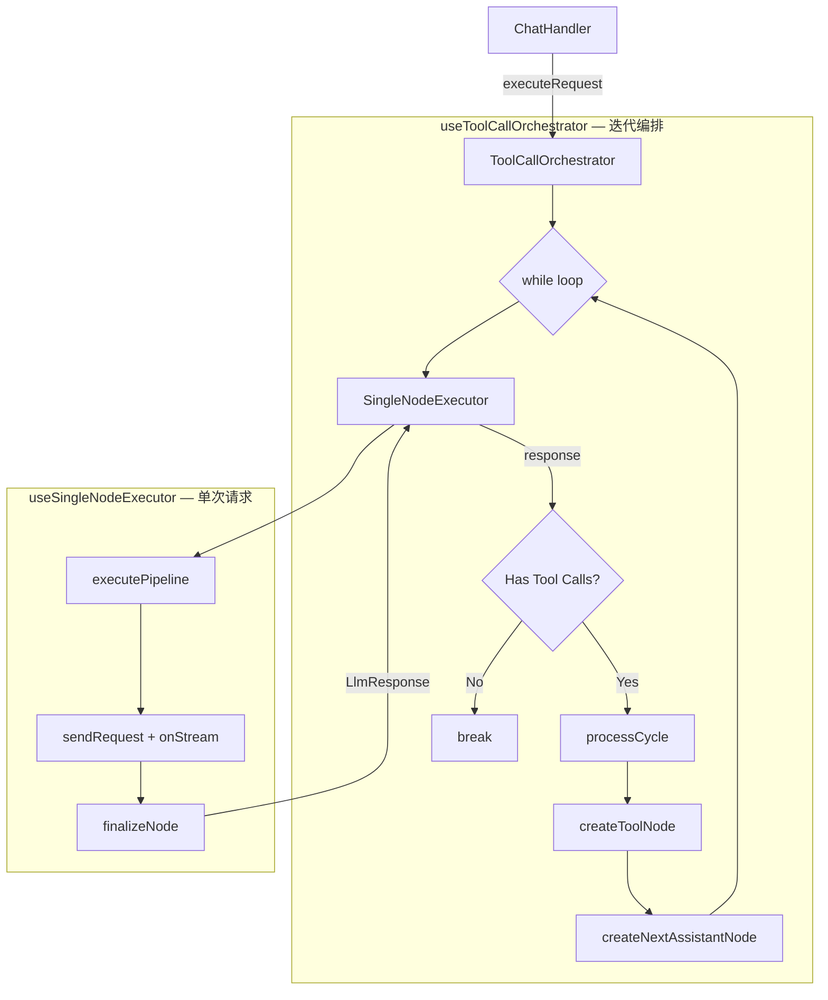
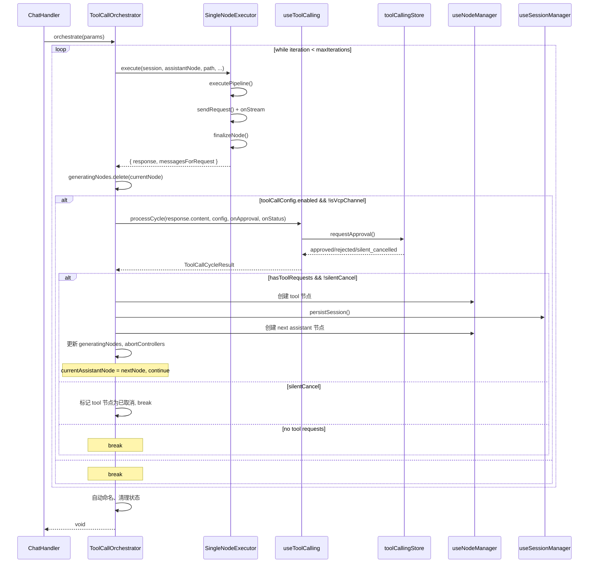

# 工具调用编排器重构方案

**状态**: Draft  
**日期**: 2026-03-16  
**涉及文件**: `composables/chat/useChatExecutor.ts`

---

## 1. 现状分析

### 1.1 当前结构

`useChatExecutor.ts` 的 `executeRequest` 函数承担了两个不同维度的职责，混合在同一个 `while` 循环中：

```
executeRequest()
  └── while (iterationCount < maxIterations)
        ├── [A] 构建上下文 Pipeline          ← 单次请求的事
        ├── [A] 发送 LLM 请求 + 流式处理     ← 单次请求的事
        ├── [A] finalizeNode                  ← 单次请求的事
        ├── [B] 检测工具调用                  ← 迭代编排的事
        ├── [B] 创建 tool 节点               ← 迭代编排的事
        ├── [B] 执行工具 (processCycle)       ← 迭代编排的事
        ├── [B] 创建下一轮 assistant 节点     ← 迭代编排的事
        └── [B] 更新路径 + continue/break     ← 迭代编排的事
```

**[A] 单次请求逻辑**：约 150 行，负责"这一轮"的 LLM 交互。  
**[B] 迭代编排逻辑**：约 165 行，负责"是否还有下一轮"的决策和节点转换。

### 1.2 问题

1. **认知负担重**：`while` 循环内部嵌套了 3 层 `if`，流式处理代码和节点创建代码交织在一起，很难一眼看出工具调用的状态机转换。
2. **节点维护分散**：`generatingNodes.add/delete` 和 `abortControllers.set/delete` 散落在循环各处，容易遗漏。
3. **可测试性差**：无法独立测试工具调用的迭代逻辑，必须 mock 整个请求流程。
4. **复用性低**：单次请求逻辑（Pipeline + Request）无法被其他场景（如"预览"）直接复用。

---

## 2. 目标架构

### 2.1 核心思路：大环套小环

```
ToolCallOrchestrator (大环 - 负责迭代)
  └── while (iteration)
        ├── SingleNodeExecutor (小环 - 负责单次请求)
        │     ├── 构建 Pipeline 上下文
        │     ├── 发送 LLM 请求
        │     ├── 处理流式更新
        │     └── finalizeNode → 返回 response
        │
        └── 检查 response 是否有工具调用
              ├── 有 → 执行工具 → 创建新节点 → continue
              └── 无 → break
```

**Orchestrator 包裹 Executor**：Orchestrator 是那个"知道是否需要下一轮"的人，Executor 只负责"这一轮做什么"。

### 2.2 架构图



### 2.3 时序图



---

## 3. 接口设计

### 3.1 `useSingleNodeExecutor`

**文件**: `composables/chat/useSingleNodeExecutor.ts`  
**职责**: 执行单次 LLM 请求的完整生命周期（Pipeline → Request → Finalize）。

```typescript
interface SingleNodeExecuteParams {
  session: ChatSession;
  assistantNode: ChatMessageNode;
  /** 到用户消息的完整路径 */
  pathToUserNode: ChatMessageNode[];
  isContinuation?: boolean;
  /** Agent 配置片段 */
  agentConfig: {
    profileId: string;
    modelId: string;
    parameters: LlmParameters;
  };
  /** 完整的执行 Agent 对象（含预设消息等） */
  executionAgent: ChatAgent;
  /** 生效的用户档案 */
  effectiveUserProfile: UserProfile | null;
  /** 用于取消请求 */
  abortController: AbortController;
}

interface SingleNodeExecuteResult {
  /** LLM 返回的原始响应（content, usage, reasoningContent 等） */
  response: any;
  /** 实际发送给 LLM 的消息列表（用于 token 验证） */
  messagesForRequest: Array<{ role: string; content: any; prefix?: boolean }>;
}

function useSingleNodeExecutor() {
  /**
   * 执行单次 LLM 请求
   *
   * 内部流程：
   * 1. 保存参数快照到节点 metadata
   * 2. 构建 Pipeline 上下文 + 执行 Pipeline
   * 3. 发送 LLM 请求（含流式处理和重试）
   * 4. validateAndFixUsage + finalizeNode
   * 5. checkAndCompress
   *
   * 不负责：工具调用检测、节点创建、迭代控制
   */
  const execute: (params: SingleNodeExecuteParams) => Promise<SingleNodeExecuteResult>;

  return { execute };
}
```

**关键设计决策**：

- `execute` 不操作 `generatingNodes` 和 `abortControllers`，这些由 Orchestrator 统一管理。
- `execute` 不关心工具调用，它只是忠实地执行一次请求并返回结果。
- Pipeline 构建（包括世界书加载、转写预处理等）仍然在 `execute` 内部，因为它是"这一轮请求"的上下文准备工作。

### 3.2 `useToolCallOrchestrator`

**文件**: `composables/chat/useToolCallOrchestrator.ts`
**职责**: 管理工具调用的多轮迭代，包裹 SingleNodeExecutor。

```typescript
interface OrchestrateParams {
  session: ChatSession;
  /** 初始的用户消息节点 */
  userNode: ChatMessageNode;
  /** 初始的助手响应节点 */
  assistantNode: ChatMessageNode;
  /** 到用户消息的完整路径 */
  pathToUserNode: ChatMessageNode[];
  isContinuation?: boolean;
  /** Agent 配置 */
  agentConfig: {
    profileId: string;
    modelId: string;
    parameters: LlmParameters;
  };
  /** 完整的执行 Agent 对象 */
  executionAgent: ChatAgent;
  /** 生效的用户档案 */
  effectiveUserProfile: UserProfile | null;
  /** 外部传入的状态集合（引用传递，Orchestrator 直接操作） */
  abortControllers: Map<string, AbortController>;
  generatingNodes: Set<string>;
  /** 是否为 VCP 渠道（禁用内置工具解析） */
  isVcpChannel: boolean;
}

function useToolCallOrchestrator() {
  /**
   * 编排完整的请求-工具调用循环
   *
   * 内部流程：
   * 1. 创建 AbortController，注册到 abortControllers
   * 2. while (iterationCount < maxIterations)
   *    a. 调用 SingleNodeExecutor.execute() 获取 response
   *    b. generatingNodes.delete(currentAssistantNode)
   *    c. 如果启用工具调用且非 VCP：
   *       - processCycle() 执行工具
   *       - 创建 tool 节点 + next assistant 节点
   *       - 更新路径，continue
   *    d. 否则 break
   * 3. 自动命名检查
   * 4. finally: 清理 abortControllers 和 generatingNodes
   */
  const orchestrate: (params: OrchestrateParams) => Promise<void>;

  return { orchestrate };
}
```

### 3.3 重构后的 `useChatExecutor`

重构后 `useChatExecutor` 变成一个薄层，负责：

1. 解析 Agent 配置和用户档案（现有的第 92-148 行）
2. 获取模型信息和 VCP 检测（现有的第 144-189 行）
3. 调用 `orchestrate()`
4. 暴露辅助函数（`processUserAttachments`, `calculateUserMessageTokens` 等，不变）

```typescript
// 重构后的 executeRequest 伪代码
const executeRequest = async (params: ExecuteRequestParams) => {
  // --- 配置解析（不变）---
  const agentConfigSnippet = ...;
  const executionAgent = ...;
  const effectiveUserProfile = ...;
  const model = ...;
  const isVcpChannel = ...;

  // --- 委托给 Orchestrator ---
  const { orchestrate } = useToolCallOrchestrator();
  await orchestrate({
    session: params.session,
    userNode: params.userNode,
    assistantNode: params.assistantNode,
    pathToUserNode: params.pathToUserNode,
    isContinuation: params.isContinuation,
    agentConfig: agentConfigSnippet,
    executionAgent,
    effectiveUserProfile,
    abortControllers: params.abortControllers,
    generatingNodes: params.generatingNodes,
    isVcpChannel,
  });
};
```

---

## 4. 状态管理方案

### 4.1 共享状态的传递策略

工具调用迭代涉及多个需要跨层共享的可变状态：

| 状态                     | 所有者       | 传递方式              | 说明                         |
| ------------------------ | ------------ | --------------------- | ---------------------------- |
| `generatingNodes`        | ChatHandler  | 引用传入 Orchestrator | Orchestrator 直接 add/delete |
| `abortControllers`       | ChatHandler  | 引用传入 Orchestrator | Orchestrator 直接 set/delete |
| `currentAssistantNode`   | Orchestrator | 内部变量              | 每轮迭代更新                 |
| `currentPathToUserNode`  | Orchestrator | 内部变量              | 每轮迭代追加                 |
| `abortController` (单个) | Orchestrator | 创建后传给 Executor   | 所有迭代共享同一个           |
| `session`                | ChatHandler  | 引用传入              | 所有层共享同一个响应式对象   |

### 4.2 关键约束

1. **`generatingNodes` 的生命周期**：
   - Orchestrator 在调用 `execute()` 前 `add(assistantNode.id)`
   - Executor 完成后，Orchestrator `delete(assistantNode.id)`
   - 如果创建了 tool 节点，Orchestrator `add(toolNode.id)` 然后在工具完成后 `delete(toolNode.id)`
   - finally 块中确保清理所有残留

2. **`abortController` 的共享**：
   - 整个迭代链共享同一个 AbortController（用户取消时应该终止整个链）
   - 但每个 assistant 节点都需要在 `abortControllers` Map 中注册，以便 UI 能按节点取消

3. **Session 的响应式**：
   - `session` 是 Pinia store 中的响应式对象，所有层直接操作同一个引用
   - 节点的创建和更新会自动触发 Vue 的响应式更新

---

## 5. 迁移路径

### Phase 1: 抽取 SingleNodeExecutor

从 `executeRequest` 的 while 循环内部，将以下代码提取到 `useSingleNodeExecutor.execute()`：

```
对应现有代码行号（useChatExecutor.ts）：
- 第 197-208 行：保存参数快照到节点 metadata
- 第 210-256 行：构建 Pipeline 上下文
- 第 258-296 行：转写预处理
- 第 299-301 行：执行 Pipeline
- 第 303-354 行：发送请求（含重试逻辑）
- 第 356-367 行：validateAndFixUsage + finalizeNode + checkAndCompress
```

**验证点**：抽取后，在 while 循环中调用 `execute()` 并获取 response，行为应与原来完全一致。

### Phase 2: 抽取 ToolCallOrchestrator

将以下代码提取到 `useToolCallOrchestrator.orchestrate()`：

```
对应现有代码行号：
- 第 174-177 行：迭代计数和 maxIterations
- 第 191-195 行：while 循环头部
- 第 369-534 行：工具调用处理逻辑（整块）
- 第 536 行：break
- 第 540-554 行：自动命名
- 第 556-569 行：错误处理和 finally 清理
```

**验证点**：`executeRequest` 变成配置解析 + 调用 `orchestrate()`，整体行为不变。

### Phase 3: 简化 useChatExecutor

`useChatExecutor` 只保留：

- `executeRequest`（薄层，解析配置后委托）
- `processUserAttachments`（不变）
- `calculateUserMessageTokens`（不变）
- `saveUserProfileSnapshot`（不变）
- `getContextForPreview`（不变）

---

## 6. 收益评估

| 维度                  | 重构前                                   | 重构后                                                       |
| --------------------- | ---------------------------------------- | ------------------------------------------------------------ |
| `executeRequest` 行数 | ~480 行                                  | ~60 行（配置解析 + 委托）                                    |
| while 循环认知负担    | 高（嵌套 3 层 if + 节点操作 + 流式处理） | Orchestrator: 中（清晰的状态机）<br>Executor: 低（线性流程） |
| 工具调用逻辑可测试性  | 需要 mock 整个请求流程                   | 可 mock Executor，独立测试 Orchestrator                      |
| 单次请求逻辑复用性    | 无                                       | Executor 可被预览、非工具调用场景复用                        |
| 状态管理清晰度        | generatingNodes 散落各处                 | Orchestrator 统一管控                                        |

---

## 7. 风险与注意事项

1. **`ensureNodesCreated` 的惰性创建**：当前工具节点是在"第一个工具开始执行时"才创建的（而非检测到工具请求时），这是 UX 优化。Orchestrator 需要保留这个行为。

2. **Pipeline 上下文的重复构建**：每轮迭代都会重新构建 Pipeline 上下文（因为路径变了）。这是正确的行为，但需要确保世界书等重量级数据不会被重复加载。

3. **`getContextForPreview` 的独立性**：这个函数目前也在 `useChatExecutor` 中，它有自己的 Pipeline 构建逻辑（与 `executeRequest` 高度相似但不完全相同）。未来可以考虑让它也复用 `SingleNodeExecutor` 的 Pipeline 构建部分，但这不在本次重构范围内。

4. **错误边界**：`try/catch` 的位置需要仔细考虑。Executor 内部的错误（如网络错误）应该向上抛给 Orchestrator，由 Orchestrator 统一调用 `handleNodeError`。

5. **VCP 渠道的特殊处理**：`isVcpChannel` 标志在 Orchestrator 层面就可以直接跳过工具调用逻辑，不需要传递给 Executor。
