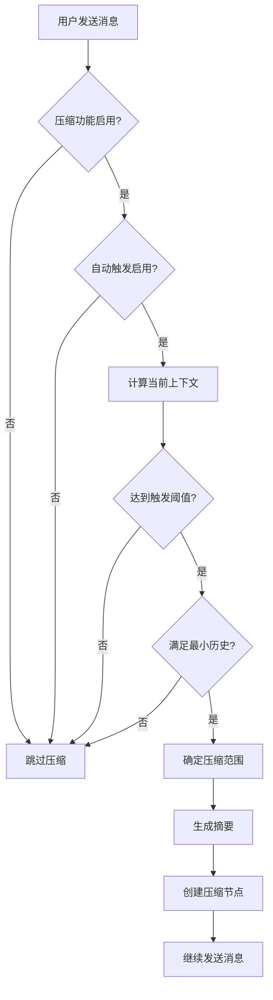
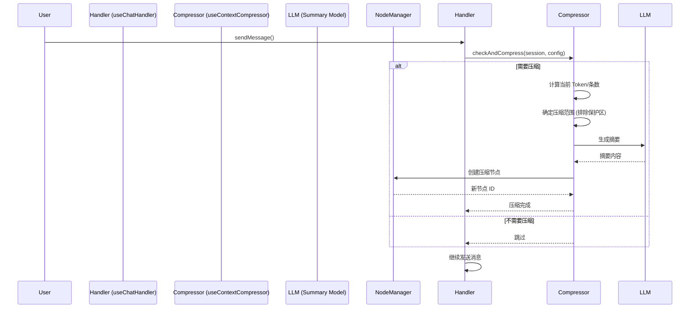

# LLM Chat: 上下文压缩功能设计

## 1. 设计原则

> **"非破坏性遮罩"** —— 压缩不是删除，而是将一组消息折叠为一个摘要节点，在需要时可以随时展开。

本设计的核心目标：

- **非破坏性**：原始消息保留在树中，只是被"遮罩"隐藏
- **即时切换**：通过启用/禁用压缩节点，可在详细历史与摘要视图间无缝切换
- **自动化与手动并存**：支持自动触发（基于阈值）和手动触发（用户主动压缩）
- **配置灵活**：支持全局默认配置和智能体级别的覆盖

## 2. 核心概念

### 2.1. 压缩节点 (Compression Node)

一个特殊的消息节点，它：

- 包含对一组历史消息的**摘要内容**
- 记录它所压缩的原始消息的 ID 列表
- 当节点**启用**时，它所压缩的原始消息在上下文构建和 UI 渲染中**自动隐藏**
- 当节点**禁用**时，原始消息恢复显示

### 2.2. 压缩策略 (Compression Strategy)

定义何时以及如何压缩上下文的规则集合：

- **触发条件**：基于 Token 数量、消息条数或两者结合
- **保护机制**：确保最近的 N 条消息不被压缩（保持短期记忆）
- **压缩范围**：每次压缩多少条消息
- **最小历史**：至少有多少条历史才触发压缩

### 2.3. 双层配置体系

| 层级           | 作用                         | 优先级 |
| -------------- | ---------------------------- | ------ |
| **全局设置**   | 提供默认配置，影响所有会话   | 低     |
| **智能体设置** | 覆盖全局配置，针对特定智能体 | 高     |

## 3. 配置结构

### 3.1. 全局配置 (`ChatSettings`)

```typescript
// 在 ChatSettings 中添加
contextCompression: {
  // 总开关
  enabled: boolean;

  // 自动触发开关
  autoTrigger: boolean;

  // 默认策略
  defaultStrategy: {
    triggerMode: 'token' | 'count' | 'both';  // 触发模式
    tokenThreshold: number;                   // Token 阈值 (默认: 80000)
    countThreshold: number;                   // 消息条数阈值 (默认: 50)
    protectRecentCount: number;               // 保护最近 N 条不被压缩 (默认: 10)
    compressCount: number;                    // 每次压缩多少条 (默认: 20)
    minHistoryCount: number;                  // 至少多少条历史才触发 (默认: 15)
  };

  // 摘要生成配置
  summaryRole: 'system' | 'assistant' | 'user';  // 摘要节点的角色
  summaryModel?: ModelIdentifier;                // 生成摘要的模型（可选，默认使用当前模型）
  summaryPrompt?: string;                        // 摘要提示词模板
}
```

### 3.2. 智能体配置 (`ChatAgent.parameters`)

```typescript
// 在 LlmParameters 中添加
contextCompression?: {
  enabled?: boolean;                    // 是否启用（覆盖全局）
  autoTrigger?: boolean;                // 自动触发开关（覆盖全局）

  // 策略覆盖（可选）
  triggerMode?: 'token' | 'count' | 'both';
  tokenThreshold?: number;
  countThreshold?: number;
  protectRecentCount?: number;
  compressCount?: number;
  minHistoryCount?: number;

  // 摘要生成覆盖（可选）
  summaryRole?: 'system' | 'assistant' | 'user';
  summaryModel?: ModelIdentifier;
  summaryPrompt?: string;
};
```

## 4. 触发机制

### 4.1. 自动触发

当 `autoTrigger` 为 `true` 时，在**发送消息前**自动检查：



**触发检查逻辑：**

```typescript
function shouldCompress(context): boolean {
  if (triggerMode === "token") {
    return totalTokens > tokenThreshold;
  }
  if (triggerMode === "count") {
    return messageCount > countThreshold;
  }
  if (triggerMode === "both") {
    return totalTokens > tokenThreshold || messageCount > countThreshold;
  }
  return false;
}
```

### 4.2. 手动触发

在消息输入框工具栏或消息菜单中添加"压缩上下文"按钮，用户可主动触发压缩。

**手动触发特点：**

- 忽略自动触发阈值
- 可指定压缩范围（默认：压缩所有符合条件的旧消息）
- 立即执行，无需等待发送消息

## 5. 数据结构

### 5.1. 消息节点扩展 (`ChatMessageNode.metadata`)

```typescript
// 扩展 src/tools/llm-chat/types/message.ts
metadata?: {
  // ... 现有字段

  /** 是否为压缩/摘要节点 */
  isCompressionNode?: boolean;

  /** 被此节点压缩/隐藏的节点 ID 列表 */
  compressedNodeIds?: string[];

  /** 压缩时间戳 */
  compressionTimestamp?: number;

  /** 压缩前的 Token 总数（用于统计） */
  originalTokenCount?: number;

  /** 压缩前的消息条数 */
  originalMessageCount?: number;

  /** 摘要生成配置快照 */
  compressionConfig?: {
    triggerMode: string;
    thresholds: Record<string, number>;
    summaryRole: string;
  };
};
```

### 5.2. 压缩节点示例

```json
{
  "id": "compression_abc123",
  "role": "system",
  "content": "【前文摘要】用户询问了量子纠缠的概念，助手从经典物理和量子力学两个角度进行了解释...",
  "isEnabled": true,
  "metadata": {
    "isCompressionNode": true,
    "compressedNodeIds": ["msg1", "msg2", "msg3", "msg4", "msg5"],
    "compressionTimestamp": 1733712000000,
    "originalTokenCount": 12500,
    "originalMessageCount": 5,
    "compressionConfig": {
      "triggerMode": "token",
      "thresholds": { "tokenThreshold": 80000 },
      "summaryRole": "system"
    }
  }
}
```

## 6. 执行流程

### 6.1. 压缩执行流程



### 6.2. 摘要生成流程

1. **收集被压缩的消息内容**：提取 `compressedNodeIds` 对应节点的完整内容（包括角色）
2. **构建摘要提示词**：使用配置的 `summaryPrompt` 模板，将被压缩内容作为输入
3. **调用 LLM 生成摘要**：使用指定的 `summaryModel` 或当前模型
4. **创建压缩节点**：使用生成的摘要内容，设置相关元数据

**默认摘要提示词：**

```
你的任务是创建一份详细的对话摘要，密切关注用户的明确请求和助手之前采取的行动。
这份摘要应全面捕捉核心信息、关键概念和重要决策，这些对于继续对话和支持任何持续任务至关重要。

摘要应结构如下：

## 上下文摘要

### 1. 对话概述
关于整个对话中讨论内容的高级概述。这应该写得让某人能够快速理解对话的主题和整体流程。

### 2. 当前焦点
详细描述在此请求之前正在讨论或处理的内容。特别注意对话中较新的消息和最近的交互。

### 3. 关键概念与主题
列出所有重要的概念、术语、方法论或主题，这些可能与继续此对话相关：
- [概念/主题 1]
- [概念/主题 2]
- [...]

### 4. 重要信息与资料
如果适用，记录对话中提及的重要信息、数据、引用或资源：
- [信息/资料 1]: [简要说明]
- [信息/资料 2]: [简要说明]
- [...]

### 5. 已解决与进行中的事项
记录迄今为止已解决的问题、已完成的任务，以及任何正在进行的讨论或工作。

### 6. 待处理事项与后续方向
概述所有待处理的请求、未完成的任务，以及对话可能的后续方向：
- [事项 1]: [详细说明和当前状态]
- [事项 2]: [详细说明和当前状态]
- [...]

---

以下是需要压缩的对话历史：

{被压缩的消息内容}

---

**输出要求：**
1. 使用中文输出
2. 保持客观中立，忠实于原始对话内容
3. 摘要应简洁但信息完整，不超过 3000 字
4. 对于任何待处理事项，请直接引用最近对话中的内容，确保任务之间上下文不会丢失信息
5. 仅输出摘要内容，不包括任何额外的评论或解释
```

## 7. 上下文构建与 UI 渲染

### 7.1. 上下文构建 (`useChatContextBuilder.ts`)

在构建 LLM 上下文时，需要过滤掉被压缩的节点：

```typescript
function buildLlmContext(activePath, agentConfig) {
  // 1. 收集所有启用的压缩节点
  const enabledCompressionNodes = activePath.filter(
    (node) => node.metadata?.isCompressionNode && node.isEnabled !== false
  );

  // 2. 构建隐藏节点 ID 集合
  const hiddenNodeIds = new Set();
  enabledCompressionNodes.forEach((node) => {
    (node.metadata.compressedNodeIds || []).forEach((id) => hiddenNodeIds.add(id));
  });

  // 3. 过滤 activePath，排除被隐藏的节点
  const filteredPath = activePath.filter((node) => !hiddenNodeIds.has(node.id));

  // 4. 使用 filteredPath 继续构建上下文
  // ... 原有逻辑
}
```

### 7.2. UI 渲染 (`MessageList.vue`)

在渲染消息列表时，应用相同的过滤逻辑：

```typescript
// 计算显示的消息列表
const displayMessages = computed(() => {
  const enabledCompressionNodes = props.messages.filter(
    (node) => node.metadata?.isCompressionNode && node.isEnabled !== false
  );

  const hiddenNodeIds = new Set();
  enabledCompressionNodes.forEach((node) => {
    (node.metadata.compressedNodeIds || []).forEach((id) => hiddenNodeIds.add(id));
  });

  return props.messages.filter((node) => !hiddenNodeIds.has(node.id));
});
```

### 7.3. 压缩节点的特殊渲染

压缩节点在 UI 上应有特殊样式：

- **视觉标记**：折叠图标 + "已压缩 N 条消息"标签
- **交互功能**：
  - 点击展开/折叠：临时显示被压缩的消息
  - 禁用/启用：切换压缩状态
  - 查看详情：显示压缩统计信息（原始 Token 数、消息数等）

## 8. 实现模块

### 8.1. 新增模块

| 模块                      | 职责                             | 依赖                               |
| ------------------------- | -------------------------------- | ---------------------------------- |
| `useContextCompressor.ts` | 压缩检测、摘要生成、节点创建     | `useNodeManager`, `useLlmRequest`  |
| `useCompressionConfig.ts` | 配置解析（合并全局与智能体配置） | `useChatSettings`, `useAgentStore` |

### 8.2. 修改模块

| 模块                       | 修改内容                             |
| -------------------------- | ------------------------------------ |
| `types/message.ts`         | 扩展 `metadata` 类型定义             |
| `types/llm.ts`             | 添加 `ContextCompressionConfig` 类型 |
| `types/ui.ts`              | 在 `ChatSettings` 中添加全局配置     |
| `useChatContextBuilder.ts` | 添加压缩节点过滤逻辑                 |
| `useChatHandler.ts`        | 在 `sendMessage` 前调用压缩检查      |
| `MessageList.vue`          | 实现 UI 过滤和特殊渲染               |
| `ChatMessage.vue`          | 压缩节点的特殊样式和交互             |

### 8.3. 配置 UI

| 界面                        | 修改内容                             |
| --------------------------- | ------------------------------------ |
| `settingsConfig.ts`         | 添加"上下文压缩"设置分组             |
| `ModelParametersEditor.vue` | 在智能体参数编辑器中添加压缩配置面板 |

## 9. UI 交互设计

### 9.1. 全局设置界面

在"设置"对话框中添加"上下文压缩"分组：

```
📦 上下文压缩
├── ✅ 启用上下文压缩功能
├── ✅ 自动触发压缩
├── 触发模式：● Token 阈值 ○ 消息条数 ○ 两者
├── Token 阈值：─────┤ 80000
├── 消息条数阈值：───┤ 50
├── 保护最近消息数：─┤ 10
├── 每次压缩条数：───┤ 20
├── 最小历史条数：───┤ 15
├── 摘要节点角色：───┤ System
└── 摘要模型：───────┤ [使用当前模型]
```

### 9.2. 智能体设置界面

在智能体参数编辑器中添加折叠面板：

```
🔽 上下文压缩（覆盖全局设置）
├── ✅ 启用压缩（覆盖全局）
├── ✅ 自动触发（覆盖全局）
├── 触发模式：───────┤ [继承全局]
├── Token 阈值：─────┤ [继承全局]
├── 消息条数阈值：───┤ [继承全局]
├── 保护最近消息数：─┤ [继承全局]
├── 每次压缩条数：───┤ [继承全局]
├── 最小历史条数：───┤ [继承全局]
├── 摘要节点角色：───┤ [继承全局]
└── 摘要模型：───────┤ [使用当前模型]
```

### 9.3. 消息工具栏

在消息输入框工具栏添加手动触发按钮：

```
[📝 输入消息...] [📎] [🖼️] [📦 压缩上下文] [发送]
```

点击"压缩上下文"按钮时：

1. 显示压缩范围选择器（默认：压缩所有符合条件的旧消息）
2. 执行压缩，显示进度
3. 完成后显示通知："已压缩 15 条消息，节省约 12K Token"

### 9.4. 压缩节点 UI

压缩节点在消息列表中的显示示例：

```
[📦 已压缩] 系统 · 刚刚
已压缩 5 条消息（原始 12.5K Token，压缩后 0.8K Token）
【前文摘要】用户询问了量子纠缠的概念，助手从经典物理和量子力学两个角度进行了解释...

[禁用压缩] [查看详情] [重新生成摘要]
```

## 10. 后续规划

### 10.1. 第一阶段（核心能力）

- [ ] 类型定义扩展
- [ ] 压缩逻辑实现 (`useContextCompressor`)
- [ ] 上下文构建过滤
- [ ] UI 隐藏逻辑

### 10.2. 第二阶段（配置与交互）

- [ ] 全局设置 UI
- [ ] 智能体设置 UI
- [ ] 手动触发按钮
- [ ] 压缩节点特殊渲染

### 10.3. 未来增强

- **增量压缩**：多次压缩形成压缩链
- **智能摘要**：根据对话类型优化摘要提示词
- **压缩质量评估**：评估摘要是否丢失关键信息
- **压缩节点编辑**：允许用户手动编辑摘要内容
- **批量操作**：一次性压缩多个会话

## 11. 注意事项

### 11.1. 性能考虑

- 压缩检测应轻量，避免影响发送消息的响应速度
- 摘要生成是异步操作，应有超时和错误处理
- UI 过滤逻辑应高效，避免重复计算

### 11.2. 数据一致性

- 压缩节点与被压缩节点的关系应始终保持一致
- 删除压缩节点时，被压缩节点应恢复显示
- 撤销/重做系统应支持压缩操作

### 11.3. 用户体验

- 自动压缩应有明确提示，告知用户发生了什么
- 压缩节点应提供足够的信息，让用户了解被压缩的内容
- 应提供简单的恢复机制（禁用压缩节点即可）

---

## 附录：与其他功能的关系

### 与上下文截断的关系

- **上下文截断**：直接丢弃超出 Token 限制的部分内容
- **上下文压缩**：保留内容但以摘要形式呈现
- **协同工作**：先尝试压缩，如果压缩后仍超出限制，再应用截断

### 与撤销/重做系统的关系

压缩操作应记录到撤销栈中，支持撤销压缩和恢复原始状态。

### 与跨窗口同步的关系

压缩状态应同步到所有窗口，确保主窗口和分离窗口显示一致。
