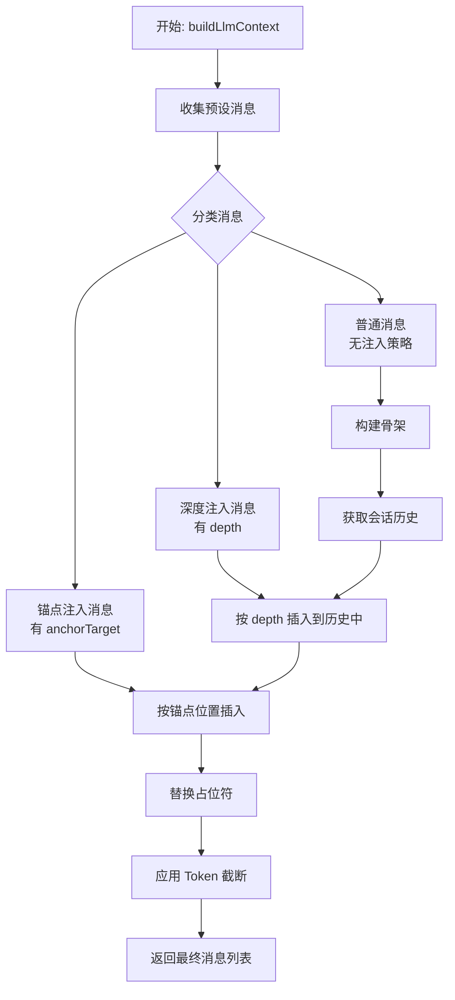

# LLM Chat: 上下文注入机制设计 (精简版)

## 1. 设计原则

> **"恰到好处"** —— 提供足够的灵活性来构建所需的上下文预设，但不追求成为第二个 SillyTavern。

本设计的核心目标：

- **简单直接**：直接在预设消息上配置注入策略，无需额外的抽象层
- **渐进增强**：新功能通过可选字段引入，不破坏现有行为
- **实用优先**：只实现真正有用的功能，砍掉过度设计的部分

### 1.1. 砍掉的部分

以下功能被认为是**过度设计**，不在本方案范围内：

| 砍掉的功能                 | 原因                                    |
| -------------------------- | --------------------------------------- |
| 消息模板 (MessageTemplate) | 过度抽象，直接用 ChatMessageNode 就够了 |
| 上下文配方 (ContextRecipe) | 复杂度太高，收益不明显                  |
| 模型过滤器 (modelFilter)   | 按模型差异化的需求很小众                |
| 高级模式双栏编辑器         | 模板库 + 配方工作台会让用户困惑         |
| 策略继承机制               | 积木层 -> 配方层的继承覆盖过于复杂      |

### 1.2. 保留的核心

| 保留的功能                   | 价值                                 |
| ---------------------------- | ------------------------------------ |
| 注入策略 (InjectionStrategy) | 控制消息在上下文中的位置，实用且必要 |
| 深度注入 (depth)             | 作者备注、角色提醒等场景             |
| 锚点注入 (anchor)            | 世界设定、知识库等场景               |
| 优先级排序 (order)           | 同位置多消息的排序                   |

## 2. 核心概念

### 2.1. 注入策略 (Injection Strategy)

为 `ChatMessageNode` 扩展可选的 `injectionStrategy` 字段：

```typescript
// 扩展 src/tools/llm-chat/types/message.ts

export interface InjectionStrategy {
  /**
   * 深度注入：相对于会话历史末尾的位置
   * - 0: 紧跟在最新消息之后（默认行为）
   * - N: 插入到倒数第 N 条消息之后
   *
   * 适用场景：作者备注、角色提醒等需要"靠近当前对话"的内容
   */
  depth?: number;

  /**
   * 锚点注入：相对于具名锚点的位置
   * 目标锚点的 ID，如 'chat_history', 'user_profile'
   */
  anchorTarget?: string;

  /**
   * 相对锚点的位置：'before' | 'after'
   */
  anchorPosition?: "before" | "after";

  /**
   * 插入顺序（优先级）
   * 在同一注入点的多个条目间的先后顺序。
   * 值越大越靠近新消息（对话末尾），值越小越靠近 System Prompt。
   * 默认为 100。
   */
  order?: number;
}

export interface ChatMessageNode {
  // ... 现有字段保持不变

  /**
   * 注入策略（可选）
   * 如果未定义，则按数组顺序排列（现有行为）
   */
  injectionStrategy?: InjectionStrategy;
}
```

### 2.2. 锚点系统 (Anchor System)

锚点是上下文流中的**具名插槽**，用于标记可注入的位置。锚点由**系统内置**或**插件注册**，用户在编辑消息时只能**选择**已注册的锚点作为注入目标，而**不能直接创建**新锚点。

**锚点来源：**

1. **系统内置锚点**（始终可用）：
   - `chat_history`: 会话历史的位置
   - `user_profile`: 用户档案的位置

2. **插件注册锚点**（未来扩展）：
   - 插件可通过 API 注册自定义锚点（如 `world_info`, `knowledge_base` 等）
   - 注册后的锚点会出现在消息编辑器的锚点选择列表中

**重要说明：**

- 锚点是程序架构层面的概念，代表上下文构建流程中的特定位置
- 用户在预设消息编辑界面**只能选择**已存在的锚点，不能自行定义
- 锚点的实际内容由对应的上下文构建器在运行时填充

### 2.3. 优先级规则

当多个注入策略同时存在时，按以下优先级处理：

1. **深度注入 (depth)** 优先级最高
2. **锚点注入 (anchorTarget)** 次之
3. **无策略** 按数组顺序排列

对于注入到相同位置的多个消息，根据 `order` 字段排序（值越大越靠后/越靠近新消息）。

## 3. 构建流程



### 3.1. 阶段一：消息分类

遍历预设消息，根据 `injectionStrategy` 将消息分为三类：

- **骨架消息**：无注入策略，按原顺序排列
- **深度注入消息**：有 `depth` 字段
- **锚点注入消息**：有 `anchorTarget` 字段

### 3.2. 阶段二：历史与深度注入

1. 获取当前活动路径的会话历史
2. 将深度注入消息按 `depth` 值插入到历史中

### 3.3. 阶段三：骨架填充与最终处理

1. 遍历骨架消息
2. 遇到锚点时，插入对应的锚点注入消息
3. 遇到 `chat_history` 占位符时，插入处理后的会话历史
4. 遇到 `user_profile` 占位符时，插入用户档案内容
5. 对完全组装后的消息列表，应用 Token 限制进行截断

## 4. 使用示例

### 4.1. 深度注入：作者备注

```typescript
// 在智能体预设中定义
{
  role: 'system',
  content: '[作者备注：保持角色一致性，不要打破第四面墙]',
  injectionStrategy: {
    depth: 2  // 插入到倒数第 2 条消息之后
  }
}
```

**效果**：无论对话进行到哪里，这条消息始终出现在最新消息往前数第 2 条的位置，确保模型在生成回复时能"看到"这个提醒。

### 4.2. 锚点注入：世界设定

```typescript
// 假设插件已注册 'world_info' 锚点
// 用户在预设消息编辑器中选择该锚点作为注入目标

{
  role: 'system',
  content: '世界观：这是一个蒸汽朋克世界...',
  injectionStrategy: {
    anchorTarget: 'world_info',  // 选择已注册的锚点
    anchorPosition: 'after',
    order: 100  // 优先级
  }
}
```

**效果**：世界设定消息会被插入到 `world_info` 锚点之后。锚点的实际位置由注册该锚点的插件或系统决定。

### 4.3. 多消息排序

```typescript
// 多条消息注入到同一锚点
[
  {
    role: "system",
    content: "世界观设定...",
    injectionStrategy: { anchorTarget: "world_info", anchorPosition: "after", order: 100 },
  },
  {
    role: "system",
    content: "角色性格设定...",
    injectionStrategy: { anchorTarget: "world_info", anchorPosition: "after", order: 200 },
  },
];
```

**效果**：order 值大的（角色性格）排在 order 值小的（世界观）后面。

## 5. 外部格式兼容

### 5.1. SillyTavern 角色卡导入

导入时将 ST 的世界书条目简化转换为预设消息：

| ST 字段                  | 转换目标                                            |
| ------------------------ | --------------------------------------------------- |
| `content`                | `ChatMessageNode.content`                           |
| `position: 4 (At Depth)` | `injectionStrategy.depth`                           |
| `position: 0/1`          | `injectionStrategy.anchorTarget` + `anchorPosition` |
| `order`                  | `injectionStrategy.order`                           |
| `key` (关键词)           | **暂不支持**，后续由知识库系统处理                  |

**注意**：世界书的关键词触发机制不在本设计范围内，将由后续的知识库系统统一处理。

## 6. UI/UX 设计

### 6.1. 单条消息编辑 (PresetMessageEditor)

在消息编辑弹窗中增加"注入策略"配置区：

**配置项设计：**

1. **注入模式 (Injection Mode)**
   - 类型：单选按钮组 (Radio Group)
   - 选项：
     - **跟随列表 (Default)**: 默认行为，位置由列表顺序决定
     - **深度注入 (Depth)**: 插入到会话历史的特定深度
     - **锚点注入 (Anchor)**: 吸附到特定的上下文锚点

2. **动态参数区**
   - **深度模式**：
     - `Depth`: 数字输入框，范围 0-99
     - 提示："0 = 紧跟最新消息，1 = 倒数第 1 条之后..."
   - **锚点模式**：
     - `Target`: 下拉选择框，列出可用锚点
     - `Position`: 单选 `Before` / `After`

3. **优先级 (Order)**
   - 数字输入框，默认 100
   - 仅在深度/锚点模式下显示

### 6.2. 预设列表展示 (AgentPresetEditor)

主列表保持线性排序，但对配置了注入策略的消息提供视觉反馈：

**视觉标记：**

- **策略标签**：在角色标签旁显示
  - 深度注入：`📍 Depth: N`
  - 锚点注入：`⚓ → [锚点ID]`
- **样式区分**：
  - 左侧边框颜色区分（如橙色表示深度注入，蓝色表示锚点注入）
  - 鼠标悬停显示 Tooltip 解释注入行为

### 6.3. 锚点选择器数据源

通过 `getAvailableAnchors()` 获取已注册的锚点列表：

1. **系统内置锚点**：`chat_history`, `user_profile`（始终可用）
2. **插件注册锚点**：由插件通过 API 注册的锚点（如 `world_info`, `knowledge_base` 等）

**注意**：用户在消息编辑界面只能从下拉列表中**选择**已注册的锚点，不能自行输入或创建新锚点。锚点的注册是程序层面的行为，不是用户界面操作。

## 7. 与现有架构的关系

本设计是对现有 `useChatContextBuilder` 的增强：

- **保持兼容**：无 `injectionStrategy` 的预设消息行为不变
- **渐进增强**：新功能通过可选字段引入
- **职责清晰**：
  - `useChatContextBuilder`: 上下文构建
  - `useMessageProcessor`: 消息后处理（合并、角色交替等）
  - `useChatAssetProcessor`: 附件处理

## 8. 后续规划

1. **知识库系统**（独立设计）：
   - 关键词触发
   - 语义检索 (RAG)
   - 动态上下文注入

2. **Agent 记忆**（独立设计）：
   - 长期记忆的存储与召回

3. **条件注入**（待评估）：
   - 基于对话状态的条件判断
   - 可能过于复杂，需要谨慎评估

---

## 附录：与原设计的对比

| 原设计                                   | 精简版                        | 变化原因           |
| ---------------------------------------- | ----------------------------- | ------------------ |
| MessageTemplate + ContextRecipe 双层抽象 | 直接在 ChatMessageNode 上配置 | 减少复杂度         |
| 模型过滤器 (modelFilter)                 | 移除                          | 需求小众，复杂度高 |
| 高级模式双栏编辑器                       | 移除                          | 用户体验差         |
| 策略继承机制                             | 移除                          | 过度设计           |
| 注入策略 (depth/anchor/order)            | **保留**                      | 核心功能           |
| 锚点系统                                 | **保留**                      | 实用功能           |
| ST 角色卡导入                            | **保留**                      | 兼容性需求         |

## 附录：酒馆导入兼容性检查

精简版上下文注入架构对 SillyTavern 格式的兼容性**良好** (约 90%)：

### ✅ 直接映射 (无需转换)

- 角色卡基础字段 (`name`, `description`, `first_mes`, `tags` 等)
- `depth_prompt` → `injectionStrategy.depth`
- `injection_depth` → `injectionStrategy.depth`

### ⚠️ 需要转换规则

1. **`injection_position`**: 枚举值 → `anchorTarget` + `anchorPosition`
2. **`prompt_order`**: 数组顺序 → 预设消息排序 + `disabled` 状态
3. **占位符**: `{{char}}`/`{{user}}` → 运行时变量替换
4. **锚点 ID**: `chatHistory` → `chat_history` (驼峰转下划线)

### ❌ 不支持 (设计如此)

- 世界书关键词触发 (`key`) - 由知识库系统处理
- `forbid_overrides` - 精简版无覆盖机制
- 多 `character_id` 配置 - 只导入默认配置

导入模块可以按此分析实现，核心注入策略完全兼容。
