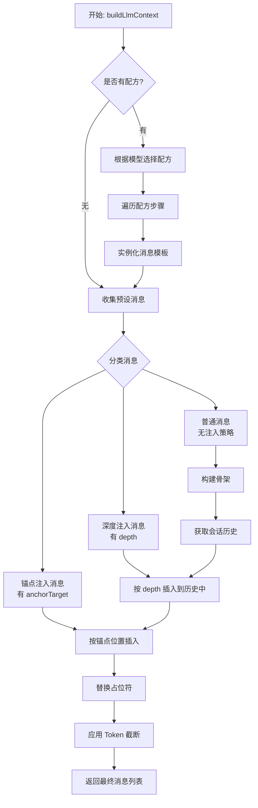

# LLM Chat: 上下文注入机制设计

## 1. 背景与目标

当前的 `useChatContextBuilder` 已经实现了基础的上下文构建功能，包括：

- 预设消息的前置/后置插入
- 用户档案 (`user_profile`) 占位符替换
- 会话历史 (`chat_history`) 占位符替换
- Token 限制与智能截断

本设计旨在增强上下文构建能力，支持更灵活的消息注入策略，为未来的知识库系统、Agent 记忆等高级功能奠定基础。

## 2. 核心概念

### 2.1. 注入策略 (Injection Strategy)

我们为 `ChatMessageNode` 扩展注入策略字段，使预设消息能够声明自己应该出现在上下文中的位置。

```typescript
// 扩展 src/tools/llm-chat/types/message.ts

export interface InjectionStrategy {
  /**
   * 深度注入：相对于会话历史末尾的位置
   * - 0: 紧跟在最新消息之后（默认行为）
   * - N: 插入到倒数第 N 条消息之后
   *
   * 适用场景：作者备注、角色提醒等需要"靠近当前对话"的内容
   */
  depth?: number;

  /**
   * 锚点注入：相对于具名锚点的位置
   * 目标锚点的 ID，如 'chat_history', 'user_profile'
   */
  anchorTarget?: string;

  /**
   * 相对锚点的位置：'before' | 'after'
   */
  anchorPosition?: "before" | "after";

  /**
   * 插入顺序（优先级）
   * 决定了在同一注入点（相同 depth 或相同 anchor）的多个条目间的先后顺序。
   * 数值越高，优先级越高，内容越靠前。默认为 100。
   */
  order?: number;
}

export interface ChatMessageNode {
  // ... 现有字段保持不变

  /**
   * 注入策略（可选）
   * 如果未定义，则按数组顺序排列（现有行为）
   */
  injectionStrategy?: InjectionStrategy;
}
```

### 2.2. 锚点系统 (Anchor System)

锚点是上下文流中的具名插槽，用于标记可注入的位置。

**内置锚点**（系统自动识别）：

- `chat_history`: 会话历史的位置
- `user_profile`: 用户档案的位置

**自定义锚点**（通过 `type: 'placeholder'` 定义）：

```typescript
{
  type: 'placeholder',
  id: 'world_info',  // 锚点名称
  role: 'system'
}
```

### 2.3. 锚点发现 (Anchor Discovery)

为了在 UI 编辑器中提供可用的锚点列表（例如，在下拉菜单中），系统应提供一个辅助函数来动态发现所有已定义的锚点。

**发现逻辑** (`getAvailableAnchors(messages: ChatMessageNode[])`):
1. **内置锚点**: 始终返回一个包含系统内置锚点（如 `'chat_history'`, `'user_profile'`）的基础列表。
2. **扫描自定义锚点**: 遍历当前的预设消息列表 (`messages`)，并提取所有 `type === 'placeholder'` 且具有 `id` 属性的节点。将这些 `id` 添加到列表中。

该机制确保了当用户定义一个新的自定义锚点时，它能够立刻在注入策略的配置界面中作为可选目标出现，提升了可用性。

### 2.4. 优先级规则

当多个注入策略同时存在时，按以下优先级处理：

1. **深度注入 (depth)** 优先级最高
2. **锚点注入 (anchorTarget)** 次之
3. **无策略** 按数组顺序排列

对于注入到相同位置（相同 `depth` 或相同 `anchorTarget`）的多个消息，将根据 `order` 字段进行排序。`order` 值越高的消息，位置越靠前（优先级越高）。如果 `order` 未定义或相同，则按它们在原始数组中的顺序排列。

### 2.5. 消息模板 (Message Template)

为了实现消息内容与组装逻辑的分离，我们引入"消息模板"的概念。消息模板是构成上下文的原子化"积木"，定义了一条消息的基础内容和元数据，但不关心它最终出现在哪里。

```typescript
/**
 * 消息模板：定义一条可复用消息的基础内容。
 */
export interface MessageTemplate {
  /**
   * 唯一标识符，用于被配方引用。
   */
  id: string;

  /**
   * 消息角色 (system, user, assistant)。
   * 对于特殊类型，如 'placeholder'，也在此定义。
   */
  role: ChatMessageRole | 'placeholder';

  /**
   * 默认内容。可以被配方步骤覆盖。
   */
  content?: string;

  /**
   * 消息类型，用于特殊处理。
   */
  type?: 'chat_history' | 'user_profile' | 'placeholder';

  /**
   * 默认注入策略。
   * 当配方步骤未指定策略时，使用此默认值。
   */
  defaultInjectionStrategy?: InjectionStrategy;
}
```

一个 Agent 的预设将包含一个 `messageTemplates` 数组，作为可供所有配方使用的"消息库"。

### 2.6. 上下文配方 (Context Recipe)

配方是上下文的"组装蓝图"。它定义了如何选择、排序和注入消息模板，以构建最终的上下文。一个 Agent 可以拥有多个配方，以适配不同的模型。

```typescript
/**
 * 上下文配方：定义了如何组装消息模板以构建最终上下文。
 */
export interface ContextRecipe {
  /**
   * 配方的唯一标识符。
   */
  id: string;

  /**
   * 模型过滤器：指定此配方适用于哪些模型。
   * - 'claude-*': 匹配所有 claude 模型
   * - 'gpt-4-turbo': 精确匹配
   * - '*': 默认或备用配方
   */
  modelFilter: string[];

  /**
   * 组装步骤：定义了消息的注入顺序和逻辑。
   */
  steps: RecipeStep[];
}

/**
 * 配方步骤：定义了单条消息的注入逻辑。
 */
export interface RecipeStep {
  /**
   * 要引用的消息模板 ID。
   */
  messageId: string;

  /**
   * 是否启用此步骤。
   */
  enabled: boolean;

  /**
   * 注入策略（可选）。
   */
  injectionStrategy?: InjectionStrategy;

  /**
   * 覆盖消息模板的默认值。
   */
  overrides?: {
    content?: string;
    role?: ChatMessageRole;
  };
}
```

**模型过滤器匹配规则**：
- **精确匹配**: `['gpt-4-turbo']` 仅匹配该特定 ID
- **通配符匹配**: `['claude-*']` 匹配所有以 `claude-` 开头的模型 ID
- **默认配方**: `['*']` 作为兜底，当没有其他配方匹配时使用

## 3. 构建流程



### 3.1. 阶段零：配方选择（可选）

如果 Agent 预设定义了 `contextRecipes`：

1. 根据当前使用的模型 ID，从 `contextRecipes` 列表中选择最匹配的配方
2. 匹配优先级：精确匹配 > 通配符匹配 > 默认配方 (`*`)
3. 遍历所选配方的 `steps`，对于每个 `enabled: true` 的步骤：
   - 根据 `messageId` 从 `messageTemplates` 中找到对应模板
   - 应用 `overrides` 覆盖默认值
   - 将 `injectionStrategy` 附加到实例化的消息上

### 3.2. 阶段一：消息分类

遍历预设消息（或配方实例化后的消息），根据 `injectionStrategy` 将消息分为三类：

- **骨架消息**：无注入策略，按原顺序排列
- **深度注入消息**：有 `depth` 字段
- **锚点注入消息**：有 `anchorTarget` 字段

### 3.3. 阶段二：历史与深度注入

1. 获取当前活动路径的会话历史
2. 将深度注入消息按 `depth` 值插入到历史中

### 3.4. 阶段三：骨架填充与最终处理

1. 遍历骨架消息
2. 遇到锚点时，插入对应的锚点注入消息
3. 遇到 `chat_history` 占位符时，插入处理后的会话历史
4. 遇到 `user_profile` 占位符时，插入用户档案内容
5. 对完全组装后的消息列表，应用 Token 限制进行截断

## 4. 使用示例

### 4.1. 深度注入：作者备注

```typescript
// 在智能体预设中定义
{
  role: 'system',
  content: '[作者备注：保持角色一致性，不要打破第四面墙]',
  injectionStrategy: {
    depth: 2  // 插入到倒数第 2 条消息之后
  }
}
```

### 4.2. 锚点注入：世界设定

```typescript
// 预设消息中定义锚点
[
  { role: 'system', content: '你是一个角色扮演助手。' },
  { type: 'placeholder', id: 'world_info', role: 'system' },
  { type: 'chat_history', role: 'user' }
]

// 世界设定消息
{
  role: 'system',
  content: '世界观：这是一个蒸汽朋克世界...',
  injectionStrategy: {
    anchorTarget: 'world_info',
    anchorPosition: 'after'
  }
}
```

### 4.3. 配方模式：按模型差异化

```typescript
// Agent 预设结构
const agentPreset = {
  // 消息模板库
  messageTemplates: [
    { id: 'system_prompt', role: 'system', content: '你是一个AI助手。' },
    { id: 'claude_cot', role: 'system', content: '<thinking>请先思考...</thinking>' },
    { id: 'gpt_cot', role: 'system', content: '请一步步思考这个问题。' },
    { id: 'chat_history', type: 'chat_history', role: 'user' },
    { id: 'world_info_anchor', type: 'placeholder', role: 'system' },
    { id: 'world_info', role: 'system', content: '世界观设定...' }
  ],

  // 上下文配方
  contextRecipes: [
    {
      id: 'claude-recipe',
      modelFilter: ['claude-*'],
      steps: [
        { messageId: 'system_prompt', enabled: true },
        { messageId: 'world_info_anchor', enabled: true },
        { messageId: 'chat_history', enabled: true },
        {
          messageId: 'claude_cot',
          enabled: true,
          injectionStrategy: { depth: 0 }
        },
        {
          messageId: 'world_info',
          enabled: true,
          injectionStrategy: { anchorTarget: 'world_info_anchor', anchorPosition: 'after' }
        }
      ]
    },
    {
      id: 'gpt-recipe',
      modelFilter: ['gpt-*'],
      steps: [
        { messageId: 'system_prompt', enabled: true },
        { messageId: 'world_info_anchor', enabled: true },
        { messageId: 'chat_history', enabled: true },
        {
          messageId: 'gpt_cot',  // 使用 GPT 风格的思维链
          enabled: true,
          injectionStrategy: { depth: 0 }
        },
        {
          messageId: 'world_info',
          enabled: true,
          injectionStrategy: { anchorTarget: 'world_info_anchor', anchorPosition: 'after' }
        }
      ]
    },
    {
      id: 'default-recipe',
      modelFilter: ['*'],
      steps: [
        // 默认配方不包含思维链引导
        { messageId: 'system_prompt', enabled: true },
        { messageId: 'world_info_anchor', enabled: true },
        { messageId: 'chat_history', enabled: true },
        {
          messageId: 'world_info',
          enabled: true,
          injectionStrategy: { anchorTarget: 'world_info_anchor', anchorPosition: 'after' }
        }
      ]
    }
  ]
};
```

## 5. 外部格式兼容

### 5.1. SillyTavern 角色卡导入

导入时将 ST 的世界书条目简化转换为预设消息：

| ST 字段                  | 转换目标                                            |
| ------------------------ | --------------------------------------------------- |
| `content`                | `ChatMessageNode.content`                           |
| `position: 4 (At Depth)` | `injectionStrategy.depth`                           |
| `position: 0/1`          | `injectionStrategy.anchorTarget` + `anchorPosition` |
| `order`                  | `injectionStrategy.order`                           |
| `key` (关键词)           | 暂不支持，后续由知识库系统处理                      |

**注意**：世界书的关键词触发机制不在本设计范围内，将由后续的知识库系统统一处理。

## 6. 与现有架构的关系

本设计是对现有 `useChatContextBuilder` 的增强，不改变其核心职责：

- **保持兼容**：无 `injectionStrategy` 的预设消息行为不变
- **渐进增强**：新功能通过可选字段引入
- **职责清晰**：
  - `useChatContextBuilder`: 上下文构建
  - `useMessageProcessor`: 消息后处理（合并、角色交替等）
  - `useChatAssetProcessor`: 附件处理

## 7. 后续规划

1. **知识库系统**：独立的知识检索与注入系统，支持：
   - 关键词触发
   - 语义检索 (RAG)
   - 动态上下文注入

2. **Agent 记忆**：长期记忆的存储与召回机制

3. **条件注入**：基于对话状态的条件判断（如消息数量、关键词匹配等）

## 8. UI/UX 设计

为了让用户能够直观地配置复杂的注入策略，我们需要在现有的预设编辑器基础上进行扩展。

### 8.1. 单条消息编辑 (PresetMessageEditor)

在消息编辑弹窗中增加"注入策略"配置区，位于"角色选择"和"内容编辑"之间。

**配置项设计：**

1.  **注入模式 (Injection Mode)**
    - 类型：单选按钮组 (Radio Group)
    - 选项：
        - **跟随列表 (Default)**: 默认行为。消息在上下文中的位置由其在预设列表中的顺序决定。
        - **深度注入 (Depth)**: 将消息插入到会话历史的特定深度。
        - **锚点注入 (Anchor)**: 将消息吸附到特定的上下文锚点附近。

2.  **动态参数区 (Dynamic Parameters)**
    - 根据选择的模式显示不同的参数控件：
    - **深度模式下**：
        - `Depth`: 数字输入框 (InputNumber)，范围 0-99。
        - 提示文案："0 表示紧跟在最新消息之后，1 表示倒数第 1 条消息之后..."
    - **锚点模式下**：
        - `Target`: 下拉选择框 (Select)，列出系统可用的锚点（如 `chat_history`, `user_profile`）。
        - `Position`: 单选按钮 (Radio)，选项为 `Before` / `After`。

### 8.2. 预设列表展示 (AgentPresetEditor)

主列表保持"所见即所得"的线性排序逻辑，但对于配置了特殊注入策略的消息，提供视觉反馈。

**视觉标记：**

- **策略标签**：在消息卡片的角色标签旁，增加额外的 Tag 显示注入信息。
    - 深度注入：显示 `Depth: N` (例如 `Depth: 0`)
    - 锚点注入：显示 `⚓ Anchor: [ID]` (例如 `⚓ chat_history`)
- **样式区分**：
    - 为配置了注入策略的消息卡片添加特殊的左侧边框颜色或角标，提示用户该消息在构建上下文时会"飞"到其他位置。
    - 鼠标悬停时显示 Tooltip解释具体的注入行为。

### 8.3. 锚点选择器数据源

锚点选择器的数据源应通过 `getAvailableAnchors` 动态获取，确保用户只能选择系统中已注册或定义有效的锚点。

- **内置锚点**：`chat_history`, `user_profile` (总是显示)
- **自定义锚点**：从当前预设列表中扫描 `type: 'placeholder'` 的消息 ID。

### 8.4. 积木化与配方编辑器 (高级模式)

为了管理消息模板和配方，我们需要引入"高级模式"。用户可以在预设编辑器顶部切换"简单模式"（当前视图）和"高级模式"。

**界面布局：双栏设计**

- **左侧：模板库 (Template Library)**
    - 展示所有可复用的 `MessageTemplate`。
    - **操作**：新建模板、编辑内容、删除模板。
    - **卡片信息**：显示模板 ID（关键）、角色图标、内容摘要。
    - **交互**：模板卡片作为**拖拽源 (Drag Source)**，可拖入右侧配方中。

- **右侧：配方工作台 (Recipe Workbench)**
    - **配方切换**：顶部使用 Tabs 切换不同的配方（例如 `Default`, `Claude-Optimized`, `GPT-4`）。
    - **配方设置**：
        - `Recipe ID`: 唯一标识。
        - `Model Filter`: 模型匹配规则输入（支持 Tag 输入，如 `claude-*`, `gpt-4`）。
    - **步骤列表 (Steps List)**：
        - 展示当前配方的组装步骤。
        - **拖拽排序**：调整步骤的执行/注入顺序。
        - **步骤卡片配置**：
            - **引用信息**：显示引用的模板 ID。
            - **启用开关**：快速 `enabled` 切换。
            - **覆盖配置 (Overrides)**：点击展开，配置该步骤特有的**注入策略**（复用 8.1 的配置组件）和**内容覆盖**。

**交互流程示例：**

1.  用户在左侧创建基础模板：`system_core`, `world_info`, `cot_trigger`。
2.  在右侧新建配方 `claude_recipe`，设置过滤器 `claude-*`。
3.  将左侧的 `system_core` 拖入右侧 -> 生成步骤 1。
4.  将 `cot_trigger` 拖入右侧 -> 生成步骤 2。
5.  在右侧点击步骤 2 的"配置"，设置注入策略为 `Depth: 0`（思维链引导需要紧跟对话）。

**数据兼容性：**

- **简单模式 -> 高级模式**：系统自动将当前的线性 `presetMessages` 转换为一组 `MessageTemplate`（自动生成 ID）和一个默认的 `ContextRecipe`。
- **高级模式 -> 简单模式**：简单模式作为**当前生效配方的可视化编辑器**。
    - **修改内容**：同步更新底层的 `MessageTemplate`。
    - **拖拽/修改注入**：同步更新当前 `ContextRecipe` 的 `steps` 配置。
    - **限制**：简单模式下无法切换配方或增删模板（需回高级模式），只能操作当前配方包含的消息。

### 8.5. 策略继承机制

为了平衡灵活性与易用性，注入策略采用**继承+覆盖**机制：

1.  **积木层 (Template)**：可以定义 `defaultInjectionStrategy`（例如作者备注默认为 `Depth: 1`）。
2.  **配方层 (Recipe)**：`RecipeStep` 可以定义 `injectionStrategy`。
    - 如果配方层未定义，则继承积木层的默认策略。
    - 如果配方层定义了，则**覆盖**积木层的策略。
3.  **UI 表现**：在配方编辑器中，如果策略是继承的，显示为灰色/默认状态；如果是覆盖的，显示为高亮/修改状态。
