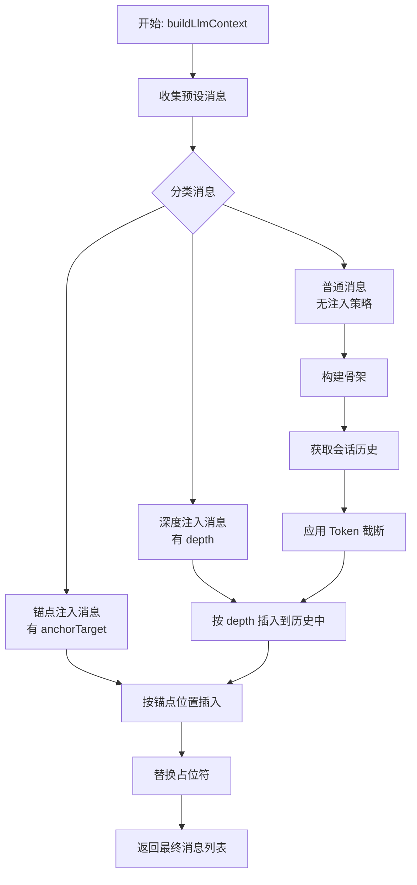

# LLM Chat: 上下文注入机制设计

## 1. 背景与目标

当前的 `useChatContextBuilder` 已经实现了基础的上下文构建功能，包括：

- 预设消息的前置/后置插入
- 用户档案 (`user_profile`) 占位符替换
- 会话历史 (`chat_history`) 占位符替换
- Token 限制与智能截断

本设计旨在增强上下文构建能力，支持更灵活的消息注入策略，为未来的知识库系统、Agent 记忆等高级功能奠定基础。

## 2. 核心概念

### 2.1. 注入策略 (Injection Strategy)

我们为 `ChatMessageNode` 扩展注入策略字段，使预设消息能够声明自己应该出现在上下文中的位置。

```typescript
// 扩展 src/tools/llm-chat/types/message.ts

export interface InjectionStrategy {
  /**
   * 深度注入：相对于会话历史末尾的位置
   * - 0: 紧跟在最新消息之后（默认行为）
   * - N: 插入到倒数第 N 条消息之后
   *
   * 适用场景：作者备注、角色提醒等需要"靠近当前对话"的内容
   */
  depth?: number;

  /**
   * 锚点注入：相对于具名锚点的位置
   * 目标锚点的 ID，如 'chat_history', 'user_profile'
   */
  anchorTarget?: string;

  /**
   * 相对锚点的位置：'before' | 'after'
   */
  anchorPosition?: "before" | "after";

  /**
   * 插入顺序（优先级）
   * 决定了在同一注入点（相同 depth 或相同 anchor）的多个条目间的先后顺序。
   * 数值越高，优先级越高，内容越靠前。默认为 100。
   */
  order?: number;
}

export interface ChatMessageNode {
  // ... 现有字段保持不变

  /**
   * 注入策略（可选）
   * 如果未定义，则按数组顺序排列（现有行为）
   */
  injectionStrategy?: InjectionStrategy;
}
```

### 2.2. 锚点系统 (Anchor System)

锚点是上下文流中的具名插槽，用于标记可注入的位置。

**内置锚点**（系统自动识别）：

- `chat_history`: 会话历史的位置
- `user_profile`: 用户档案的位置

**自定义锚点**（通过 `type: 'placeholder'` 定义）：

```typescript
{
  type: 'placeholder',
  id: 'world_info',  // 锚点名称
  role: 'system'
}
```

### 2.3. 锚点发现 (Anchor Discovery)

为了在 UI 编辑器中提供可用的锚点列表（例如，在下拉菜单中），系统应提供一个辅助函数来动态发现所有已定义的锚点。

**发现逻辑** (`getAvailableAnchors(messages: ChatMessageNode[])`):
1. **内置锚点**: 始终返回一个包含系统内置锚点（如 `'chat_history'`, `'user_profile'`）的基础列表。
2. **扫描自定义锚点**: 遍历当前的预设消息列表 (`messages`)，并提取所有 `type === 'placeholder'` 且具有 `id` 属性的节点。将这些 `id` 添加到列表中。

该机制确保了当用户定义一个新的自定义锚点时，它能够立刻在注入策略的配置界面中作为可选目标出现，提升了可用性。

### 2.4. 优先级规则

当多个注入策略同时存在时，按以下优先级处理：

1. **深度注入 (depth)** 优先级最高
2. **锚点注入 (anchorTarget)** 次之
3. **无策略** 按数组顺序排列

对于注入到相同位置（相同 `depth` 或相同 `anchorTarget`）的多个消息，将根据 `order` 字段进行排序。`order` 值越高的消息，位置越靠前（优先级越高）。如果 `order` 未定义或相同，则按它们在原始数组中的顺序排列。

## 3. 构建流程



### 3.1. 阶段一：消息分类

遍历 `presetMessages`，根据 `injectionStrategy` 将消息分为三类：

- **骨架消息**：无注入策略，按原顺序排列
- **深度注入消息**：有 `depth` 字段
- **锚点注入消息**：有 `anchorTarget` 字段

### 3.2. 阶段二：历史处理

1. 获取当前活动路径的会话历史
2. 应用 Token 限制进行截断
3. 将深度注入消息按 `depth` 值插入到历史中

### 3.3. 阶段三：骨架填充

1. 遍历骨架消息
2. 遇到锚点时，插入对应的锚点注入消息
3. 遇到 `chat_history` 占位符时，插入处理后的会话历史
4. 遇到 `user_profile` 占位符时，插入用户档案内容

## 4. 使用示例

### 4.1. 深度注入：作者备注

```typescript
// 在智能体预设中定义
{
  role: 'system',
  content: '[作者备注：保持角色一致性，不要打破第四面墙]',
  injectionStrategy: {
    depth: 2  // 插入到倒数第 2 条消息之后
  }
}
```

### 4.2. 锚点注入：世界设定

```typescript
// 预设消息中定义锚点
[
  { role: 'system', content: '你是一个角色扮演助手。' },
  { type: 'placeholder', id: 'world_info', role: 'system' },
  { type: 'chat_history', role: 'user' }
]

// 世界设定消息
{
  role: 'system',
  content: '世界观：这是一个蒸汽朋克世界...',
  injectionStrategy: {
    anchorTarget: 'world_info',
    anchorPosition: 'after'
  }
}
```

## 5. 外部格式兼容

### 5.1. SillyTavern 角色卡导入

导入时将 ST 的世界书条目简化转换为预设消息：

| ST 字段                  | 转换目标                                            |
| ------------------------ | --------------------------------------------------- |
| `content`                | `ChatMessageNode.content`                           |
| `position: 4 (At Depth)` | `injectionStrategy.depth`                           |
| `position: 0/1`          | `injectionStrategy.anchorTarget` + `anchorPosition` |
| `order`                  | `injectionStrategy.order`                           |
| `key` (关键词)           | 暂不支持，后续由知识库系统处理                      |

**注意**：世界书的关键词触发机制不在本设计范围内，将由后续的知识库系统统一处理。

## 6. 与现有架构的关系

本设计是对现有 `useChatContextBuilder` 的增强，不改变其核心职责：

- **保持兼容**：无 `injectionStrategy` 的预设消息行为不变
- **渐进增强**：新功能通过可选字段引入
- **职责清晰**：
  - `useChatContextBuilder`: 上下文构建
  - `useMessageProcessor`: 消息后处理（合并、角色交替等）
  - `useChatAssetProcessor`: 附件处理

## 7. 后续规划

1. **知识库系统**：独立的知识检索与注入系统，支持：
   - 关键词触发
   - 语义检索 (RAG)
   - 动态上下文注入

2. **Agent 记忆**：长期记忆的存储与召回机制

3. **条件注入**：基于对话状态的条件判断（如消息数量、关键词匹配等）
