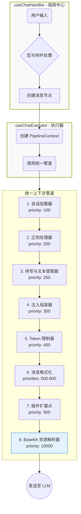

# LLM Chat 上下文管道架构 (Context Pipeline Architecture)

## 1. 设计概述

LLM Chat 的上下文构建采用 **统一管道架构 (Unified Pipeline Architecture)**，将复杂的上下文组装流程整合为一个单一、可配置的处理器流水线。

这种设计的核心理念是 **"单一数据流"** 模型：

1.  **统一管道**：所有处理步骤（加载、转换、截断、注入、后处理、附件转换）都在同一个管道中按优先级顺序执行。
2.  **保留元数据**：在管道执行过程中，消息保持"中间格式"，包含原始附件引用，直到最后一步才转换为最终发送格式。
3.  **灵活配置**：所有处理器都可配置、可排序、可启用/禁用，通过 `priority` 字段控制执行顺序。

## 2. 架构总览

### 2.1. 数据流向

以下 Mermaid 图展示了从用户输入到最终发送给 LLM 的完整流程（新架构）：



### 2.2. 核心概念

| 概念                        | 说明                                                                                                |
| :-------------------------- | :-------------------------------------------------------------------------------------------------- |
| **PipelineContext**         | 在管道中流动的统一数据载体，包含消息列表、元数据和共享黑板                                          |
| **ContextProcessor**        | 负责单一功能的模块化处理单元，可配置、可排序、可启用/禁用。支持通过 `configFields` 自动生成配置界面 |
| **Infrastructure Services** | 如 `MacroProcessor`，作为基础能力被处理器按需调用，而非管道步骤                                     |
| **中间格式消息**            | 在管道中流动的消息，保持附件引用格式，直到最后一步由 `asset-resolver` 转换为最终格式                |

## 3. 统一管道设计

统一管道负责将原始数据组装成最终发送给 LLM 的上下文。其内部执行严格遵循处理器的优先级顺序：

### 3.1. 执行顺序

1.  **加载会话历史**：加载会话历史，转换为中间格式消息（保留附件引用）。
2.  **正则处理**：**就地修改**消息内容，应用正则替换规则。
3.  **转写与文本提取**：对音频、视频、图片附件进行转写，并直接读取文本附件内容，将其插入消息内容，以便后续 Token 计算。
4.  **注入与组装**：将 Agent 预设消息分类为骨架、深度注入、锚点注入，然后与历史消息精密组装。
5.  **Token 限制**：对消息进行截断。**此步骤发生在转写和注入之后**，确保所有文本内容都纳入 Token 预算考量。中间格式消息带有类型标签，可精准识别并只截断历史消息。
6.  **消息格式化**：应用模型特定的格式化规则（合并 System 消息、合并连续角色等）。
7.  **插件扩展**：执行插件注册的自定义处理器。
8.  **Base64 资源解析**：**最后一步**，将剩余的二进制附件引用（如图片、PDF、音视频）转换为最终格式（如 base64 data URI）。

### 3.2. 内置处理器

以下是系统内置的核心处理器，按优先级排序：

| ID                        | 名称              | 职责                                                                           | 优先级  | 来源目录      |
| :------------------------ | :---------------- | :----------------------------------------------------------------------------- | :------ | :------------ |
| `session-loader`          | 会话加载器        | 加载会话历史为中间格式消息（保留附件引用）                                     | 100     | `primary/`    |
| `regex-processor`         | 正则处理器        | 对历史消息应用正则规则                                                         | 200     | `primary/`    |
| `transcription-processor` | 转写与文本提取器  | 对音频/视频/图片转写，及**读取文本附件内容**，插入消息以便 Token 计算          | 250     | `primary/`    |
| `injection-assembler`     | 注入组装器        | 处理预设、注入、宏，并与历史消息组装                                           | 300     | `primary/`    |
| `token-limiter`           | Token 限制器      | 根据预算截断历史消息（基于消息类型标签精准识别）                               | 400     | `primary/`    |
| `message-formatters`      | 消息格式化器组    | 包含一系列子处理器，负责合并System、合并连续角色、转换System、确保角色交替等。 | 500-800 | `processors/` |
| `asset-resolver`          | Base64 资源解析器 | **最后一步**：将剩余的二进制附件引用转换为最终发送格式（如 base64 data URI）   | 10000   | `new`         |

> **设计要点**：
>
> 1. 宏处理 (`macro`) 不是独立的管道处理器，而是被 `regex-processor` 和 `injection-assembler` 按需调用的基础能力。这确保了宏在正确的上下文中被解析。
> 2. `asset-resolver` 具有最高的优先级（10000），确保它在所有其他处理完成后最后执行，避免 base64 数据干扰其他处理步骤。
> 3. `transcription-processor` 优先级调整为 250，确保所有文本内容（包括转写和文件读取）在 Token 限制之前完成。

## 4. 中间格式消息与资产解析

### 4.1. 中间格式消息

在管道执行过程中，消息保持"中间格式"，其特点是：

```typescript
interface IntermediateMessage {
  role: "system" | "user" | "assistant";
  // 内容可以是纯文本，或包含附件引用的特殊结构
  content: string | IntermediateContent[];
  // 附件引用信息
  _attachments?: AssetReference[];
  // 其他元数据...
}

interface IntermediateContent {
  type: "text" | "asset_reference";
  // 对于 asset_reference，存储资产 ID 或路径
  assetId?: string;
  // 其他字段...
}
```

### 4.2. Base64 资源解析器 (`asset-resolver`)

`asset-resolver` 处理器的职责（仅处理二进制附件）：

1.  **识别附件引用**：扫描所有消息的 `content` 字段，找出剩余的 `asset_reference` 类型的片段（文本类型的附件已在 `transcription-processor` 中被消费）。
2.  **转换为最终格式**：根据模型能力和设置，将附件引用转换为：
    - 对于支持多模态的模型：转换为 `{ type: "image_url", image_url: { url: "data:image/..." } }` 格式
    - 对于文档/音视频：转换为 base64 编码的 document 格式 （我可以肯定这个AI写的做法是错误的，下次再改）
3.  **更新消息内容**：将转换后的内容替换回消息的 `content` 字段。
4.  **记录转换日志**：在 `PipelineContext.logs` 中记录转换详情。

### 4.3. 配置合并策略 (Agent 与模型的协同)

为了兼顾灵活性与一致性，处理器配置采用两级合并策略，遵循 **"Agent 优先，模型兜底"** 的原则。

**合并逻辑**:

在 `useChatExecutor` 执行管道之前，会进行以下合并：

1.  **加载模型配置**: 获取当前模型定义的默认处理器配置列表（包含启用状态和参数）。
2.  **加载 Agent 配置**: 获取当前 Agent 定义的处理器配置列表（包含启用状态和参数）。
3.  **执行合并**:
    - 如果某个处理器仅在模型配置中存在，则直接使用模型配置。
    - 如果某个处理器仅在 Agent 配置中存在，则直接使用 Agent 配置。
    - 如果某个处理器在两者中都存在（ID 相同），则**Agent 配置完全覆盖模型配置**。这是为了确保 Agent 的特定需求（如特定的 Prompt 风格）总是优先于模型的默认行为。

通过这种方式，模型可以携带一套"最佳实践"的默认处理器配置，而 Agent 依然拥有最终的决定权。

## 5. 接口定义

### 5.1. PipelineContext

```typescript
import type { ChatSession, UserProfile } from "../types";
import type { ProcessableMessage } from "../types/context";
import type { ModelCapabilities } from "@/types/llm-profiles";
import type { ChatAgent } from "@/tools/llm-chat/types/agent";

export interface PipelineContext {
  // --- 核心可变数据 ---
  /**
   * 当前正在构建的消息列表。
   * 处理器可以直接修改此数组（增删改）。
   */
  messages: ProcessableMessage[];

  // --- 只读元数据 ---
  readonly session: ChatSession;
  readonly userProfile?: UserProfile;
  readonly agentConfig: ChatAgent; // 完整的智能体配置
  readonly capabilities?: ModelCapabilities;
  readonly timestamp: number;

  // --- 共享黑板 (Shared Blackboard) ---
  /**
   * 用于处理器之间传递临时数据。
   * 例如：图像分析器提取的描述可以存放在这里，供后续的 Prompt 处理器读取。
   */
  sharedData: Map<string, any>;

  // --- 日志记录 ---
  /**
   * 处理器可以记录处理日志，用于调试和可视化展示。
   */
  logs: Array<{
    processorId: string;
    level: "info" | "warn" | "error";
    message: string;
    details?: any;
  }>;
}
```

### 5.2. ContextProcessor

```typescript
export interface ContextProcessor {
  /** 唯一标识符 (例如: 'session-loader') */
  id: string;

  /** 显示名称 (例如: '会话加载器') */
  name: string;

  /** 描述信息 */
  description: string;

  /**
   * 执行优先级 (数字越小越靠前)
   * 用于处理器的排序，核心处理器应有固定的优先级。
   */
  priority: number;

  /** 图标 (Lucide 图标名或 URL) */
  icon?: string;

  /** 是否为系统核心处理器 (不可删除，但可能允许禁用) */
  isCore?: boolean;

  /** 默认启用状态 */
  defaultEnabled?: boolean;

  /**
   * 核心执行逻辑
   * @param context 管道上下文
   */
  execute(context: PipelineContext): Promise<void>;

  /**
   * 配置组件 (可选)
   * 如果处理器有自定义配置，可以返回一个 Vue 组件名称
   */
  configComponent?: string;

  /**
   * 配置字段定义 (可选)
   * 用于自动生成简单的配置 UI，无需编写自定义组件
   */
  configFields?: ProcessorConfigField[];
}

export interface ProcessorConfigField {
  key: string;
  label: string;
  type?: "text" | "number" | "boolean" | "select";
  placeholder?: string;
  default?: any;
  options?: { label: string; value: any }[];
}
```

## 6. 存储与状态管理

使用一个统一的 Pinia Store 管理所有处理器，位于 `src/tools/llm-chat/stores/contextPipelineStore.ts`：

- **`useContextPipelineStore.ts`**：管理所有处理器的注册、排序、启用/禁用和执行调度。

## 7. 实施路线图

### Phase 1: 创建统一存储 (已完成)

1.  创建 `src/tools/llm-chat/stores/contextPipelineStore.ts`，合并 `primaryContextPipelineStore` 和 `postProcessingPipelineStore` 的逻辑。
2.  更新 `useChatExecutor` 以使用新的统一存储。

### Phase 2: 统一处理器目录 (已完成)

1.  将 `core/context-processors/primary/` 和 `core/context-processors/post/` 合并到 `core/context-processors/` 目录。
2.  更新所有处理器的导入路径。
3.  调整处理器的 `priority` 值，确保正确的执行顺序。

### Phase 3: 创建资产解析器 (已完成)

1.  创建 `core/context-processors/asset-resolver.ts` 处理器。
2.  实现附件引用到最终格式的转换逻辑。
3.  修改 `session-loader`，使其输出中间格式消息（保留附件引用）而非最终格式。

### Phase 4: 重构会话加载器 (已完成)

1.  修改 `session-loader.ts`，不再调用 `buildMessageContentForLlm`，而是输出包含附件引用的中间格式。
2.  更新 `ProcessableMessage` 类型定义以支持中间格式。

### Phase 5: 更新预览构建器 (已完成)

1.  修改 `preview-builder.ts`，使其能够正确处理中间格式消息。
2.  确保 Token 计算在资产解析前后都能正确工作。

### Phase 6: 清理旧存储 (已完成)

1.  移除 `primaryContextPipelineStore.ts` 和 `postProcessingPipelineStore.ts`。
2.  更新所有相关导入。

### Phase 7: 插件 API 更新 (进行中)

1.  更新插件 API，提供统一的 `registerProcessor` 方法。
2.  确保插件可以向后兼容。

### Phase 8: 核心算法与工具层重构 (已完成)

1.  **消除过度拆分**：将 `context-utils` 中的 `builder.ts`, `regex.ts`, `injection.ts`, `limiter.ts`, `message-processor.ts` 等文件逻辑合并回对应的核心处理器中。
2.  **提升内聚性**：确保每个处理器逻辑自包含，减少不必要的文件碎片。
3.  **优化 Token 计算**：在 `useChatExecutor` 中直接复用 `useTranscriptionManager` 进行 Token 预估，废弃重复的 `builder.ts` 逻辑。

## 8. 文件结构规划

```
src/tools/llm-chat/
├── core/
│   ├── context-utils/            # 辅助工具层 (精简后)
│   │   ├── index.ts              # 统一导出
│   │   ├── macro.ts              # 宏解析算法 (复用)
│   │   └── preview-builder.ts    # 预览数据构建器 (UI专用)
│   ├── context-processors/       # 【统一目录 - 核心处理器】
│   │   ├── index.ts              # 统一导出所有处理器
│   │   ├── session-loader.ts     # 会话加载器
│   │   ├── regex-processor.ts    # 正则处理器 (含核心算法)
│   │   ├── token-limiter.ts      # Token 限制器 (含核心算法)
│   │   ├── injection-assembler.ts # 注入组装器 (含核心算法)
│   │   ├── message-format-processors.ts # 消息格式化处理器组
│   │   ├── transcription-processor.ts # 转写与文本提取
│   │   └── asset-resolver.ts     # 资产解析器
├── types/
│   └── pipeline.ts               # PipelineContext, ContextProcessor 接口
├── stores/
│   └── contextPipelineStore.ts   # 【统一存储】
└── components/
    └── settings/
        └── PipelineConfig.vue    # 【统一配置界面】
```
