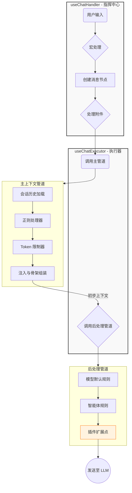

# LLM Chat 上下文管道架构 (Context Pipeline Architecture)

## 1. 设计概述

LLM Chat 的上下文构建采用 **双管道架构 (Dual-Pipeline Architecture)**，将复杂的上下文组装流程清晰地划分为两个阶段：**主上下文管道** 和 **后处理管道**。

这种设计的核心理念是 **"两级火箭"** 模型：

1.  **第一级 - 主上下文管道 (Primary Context Pipeline)**：负责将各种来源的数据（会话历史、预设、注入）通过一系列精密工序组装成初步的上下文消息列表。
2.  **第二级 - 后处理管道 (Post-processing Pipeline)**：对初步上下文进行最终调整（如应用模型特定规则），然后发送给 LLM。

## 2. 架构总览

### 2.1. 数据流向

以下 Mermaid 图展示了从用户输入到最终发送给 LLM 的完整流程：



### 2.2. 核心概念

| 概念                        | 说明                                                            |
| :-------------------------- | :-------------------------------------------------------------- |
| **PipelineContext**         | 在管道中流动的统一数据载体，包含消息列表、元数据和共享黑板      |
| **ContextProcessor**        | 负责单一功能的模块化处理单元，可配置、可排序、可启用/禁用       |
| **Infrastructure Services** | 如 `MacroProcessor`，作为基础能力被处理器按需调用，而非管道步骤 |

## 3. 主上下文管道

主上下文管道负责将原始数据组装成初步的上下文。其内部执行严格遵循以下顺序：

### 3.1. 执行顺序

1.  **加载与转换**：加载会话历史，并将每条消息（含附件）转换为多模态格式。
2.  **正则处理**：**就地修改**消息内容，应用正则替换规则。
3.  **Token 限制**：对历史消息进行截断。**此步骤发生在注入之前**，确保注入内容不会被截断。
4.  **注入与组装**：将 Agent 预设消息分类为骨架、深度注入、锚点注入，然后与截断后的历史消息精密组装。

### 3.2. 内置处理器

| ID                            | 名称         | 职责                                        | 核心算法来源                                     |
| :---------------------------- | :----------- | :------------------------------------------ | :----------------------------------------------- |
| `primary:session-loader`      | 会话加载器   | 加载并转换会话历史为 `ProcessableMessage[]` | `context-utils/builder`                          |
| `primary:regex-processor`     | 正则处理器   | 对历史消息应用正则规则                      | `context-utils/regex`                            |
| `primary:token-limiter`       | Token 限制器 | 根据预算截断历史消息                        | `context-utils/limiter`                          |
| `primary:injection-assembler` | 注入组装器   | 处理预设、注入、宏，并与历史消息组装        | `context-utils/injection`, `context-utils/macro` |

> **设计要点**：宏处理 (`macro`) 不是独立的管道处理器，而是被 `regex-processor` 和 `injection-assembler` 按需调用的基础能力。这确保了宏在正确的上下文中被解析。

## 4. 后处理管道

后处理管道对主管道输出的初步上下文进行最终调整，确保符合特定模型或智能体的要求。

### 4.1. 内置处理器

| ID                    | 名称         | 职责                       | 对应模块              |
| :-------------------- | :----------- | :------------------------- | :-------------------- |
| `post:model-defaults` | 模型默认规则 | 应用模型自带的后处理规则   | `useMessageProcessor` |
| `post:agent-rules`    | 智能体规则   | 应用智能体配置的后处理规则 | `useMessageProcessor` |

### 4.2. 插件扩展点

后处理管道提供 `post:plugin-slot` 扩展点，插件可以在此注入自定义处理逻辑。

## 5. 接口定义

### 5.1. PipelineContext

```typescript
import type { ChatSession, UserProfile } from "../types";
import type { ProcessableMessage } from "../types/context";
import type { ModelCapabilities } from "@/types/llm-profiles";

export interface PipelineContext {
  // --- 核心可变数据 ---
  /**
   * 当前正在构建的消息列表。
   * 处理器可以直接修改此数组（增删改）。
   */
  messages: ProcessableMessage[];

  // --- 只读元数据 ---
  readonly session: ChatSession;
  readonly userProfile?: UserProfile;
  readonly agentConfig: any; // 完整的智能体配置
  readonly capabilities?: ModelCapabilities;
  readonly timestamp: number;

  // --- 共享黑板 (Shared Blackboard) ---
  /**
   * 用于处理器之间传递临时数据。
   * 例如：图像分析器提取的描述可以存放在这里，供后续的 Prompt 处理器读取。
   */
  sharedData: Map<string, any>;

  // --- 日志记录 ---
  /**
   * 处理器可以记录处理日志，用于调试和可视化展示。
   */
  logs: Array<{
    processorId: string;
    level: "info" | "warn" | "error";
    message: string;
    details?: any;
  }>;
}
```

### 5.2. ContextProcessor

```typescript
export interface ContextProcessor {
  /** 唯一标识符 (例如: 'primary:regex-processor') */
  id: string;

  /** 显示名称 (例如: '正则处理器') */
  name: string;

  /** 描述信息 */
  description: string;

  /**
   * 执行优先级 (数字越小越靠前)
   * 用于处理器的排序，核心处理器应有固定的优先级。
   */
  priority: number;

  /** 图标 (Lucide 图标名或 URL) */
  icon?: string;

  /** 是否为系统核心处理器 (不可删除，但可能允许禁用) */
  isCore?: boolean;

  /** 默认启用状态 */
  defaultEnabled?: boolean;

  /**
   * 核心执行逻辑
   * @param context 管道上下文
   */
  execute(context: PipelineContext): Promise<void>;

  /**
   * 配置组件 (可选)
   * 如果处理器有自定义配置，可以返回一个 Vue 组件名称
   */
  configComponent?: string;
}
```

## 6. 存储与状态管理

使用两个独立的 Pinia Store 分别管理两个管道：

- **`usePrimaryContextPipelineStore`**：管理主上下文管道的处理器注册、排序、启用/禁用和执行调度。
- **`usePostProcessingPipelineStore`**：管理后处理管道的处理器注册、排序、启用/禁用和执行调度。

## 7. 实施路线图

### Phase 1: 基础架构

1.  定义 `PipelineContext` 和 `ContextProcessor` 接口。
2.  创建 `usePrimaryContextPipelineStore` 和 `usePostProcessingPipelineStore`。
3.  创建目录结构：
    - `src/tools/llm-chat/core/context-utils/` （核心算法工具函数）
    - `src/tools/llm-chat/core/context-processors/primary/`
    - `src/tools/llm-chat/core/context-processors/post/`

### Phase 2: 核心算法提取

将现有 composables 中的**无状态核心算法**提取到 `context-utils` 目录：

| 原 Composable             | 提取目标                     | 说明                     |
| :------------------------ | :--------------------------- | :----------------------- |
| `useMessageBuilder.ts`    | `context-utils/builder.ts`   | 消息构建与多模态转换算法 |
| `useChatRegexResolver.ts` | `context-utils/regex.ts`     | 正则匹配与替换算法       |
| `useContextLimiter.ts`    | `context-utils/limiter.ts`   | Token 计数与截断算法     |
| `useContextInjection.ts`  | `context-utils/injection.ts` | 注入点计算与消息组装算法 |
| `useMacroProcessor.ts`    | `context-utils/macro.ts`     | 宏解析与替换算法         |

> **设计原则**：`context-utils` 中的函数应为**纯函数**，不依赖 Vue 响应式系统或 Pinia Store。这使得它们易于测试且可在任何上下文中复用。

### Phase 3: 主上下文管道实现

1.  基于 `context-utils` 中的工具函数，实现四个主管道处理器。
2.  重构 `useChatExecutor`，使其直接调用 `primaryPipelineStore.executePipeline`。
3.  **移除 `useChatContextBuilder.ts`**：该文件的职责已被管道机制完全取代。

### Phase 4: 后处理管道实现

1.  将 `useMessageProcessor` 中的后处理逻辑拆分为独立的后处理处理器，并注册到全局注册表。
2.  重构 `useChatExecutor`，使其在调用主管道后，接着调用后处理管道。
3.  **移除 `useMessageProcessor.ts` 中的硬编码逻辑**：该文件将转变为注册表管理模块或被完全移除。

### Phase 5: UI 配置界面

1.  在 **设置 → 聊天设置** 中创建 "主上下文构建" 配置面板。
2.  该面板使用可拖拽组件管理处理器链，支持排序、启用/禁用。

#### 关于“请求后处理” (`ContextPostProcessing`) 的特别说明

与主上下文构建器不同，“请求后处理”步骤（例如合并连续角色、转换 System 消息等）具有**强逻辑关联性**和**固定的执行顺序**，不适合设计为可由用户自由排序的流水线。例如，“合并连续角色”应在“转换 System 为 User”之后执行，以处理可能出现的连续 User 消息。

此外，这些后处理规则通常与特定大语言模型（LLM）的能力高度相关（例如，某些模型不支持 `system` 角色）。因此，将其作为全局配置是不合适的。

**最终设计决策**：将“请求后处理”作为 **Agent** 或 **模型配置** 的一部分是更合理的设计。当前已在 Agent 参数设置中实现 (`src/tools/llm-chat/components/agent/parameters/PostProcessingPanel.vue`)，允许针对每个 Agent 进行独立的后处理配置，这符合预期的使用场景。因此，该功能**不应**在全局设置中创建。

### 架构优化：引入注册机制以提高扩展性

**当前问题**: 目前的后处理逻辑虽然功能正确，但在架构上存在不足。所有的后处理规则都**硬编码**在 `src/tools/llm-chat/composables/useMessageProcessor.ts` 中，通过一个 `switch` 语句进行分发。这导致系统缺乏扩展性，无法动态添加新的后处理规则（例如通过插件系统）。

**优化方向**:

1.  **建立注册机制**: 参照“主上下文构建器”的实现，为“请求后处理器”也建立一个全局的注册表。系统各部分（包括插件）都可以向该注册表注册新的处理器。
2.  **处理器定义**: 每个处理器应包含 `id`, `name`, `description`，以及一个执行函数 `(messages, options) = messages`。
3.  **动态 UI**: `PostProcessingPanel.vue` 组件应进行改造，不再使用静态的 `availableRules` 数组，而是从注册表中动态获取所有可用的后处理器，并渲染成列表。
4.  **保留配置层级**: 改造后，配置界面依然保留在 **Agent** 参数设置中。用户可以在此界面启用/禁用从注册表中获取的处理器，并根据 `priority` 属性进行默认排序，同时允许用户手动拖拽调整顺序（UI 中应提示默认推荐顺序和排序风险）。

通过此项重构，可以在保留 Agent 级别配置灵活性的同时，极大地提升后处理管道的可扩展性和可维护性。

### Phase 6: 插件集成

1.  插件 API 暴露两个注册函数：`registerPrimaryProcessor` 和 `registerPostProcessor`。
2.  支持插件将自定义处理器注入到任一管道的任意位置。

### Phase 7: 清理废弃代码

完成所有迁移后，移除以下已废弃的 composables：

- `useChatContextBuilder.ts` - 职责已被主管道取代
- `useMessageBuilder.ts` - 核心逻辑已迁移至 `context-utils/builder.ts`
- `useChatRegexResolver.ts` - 核心逻辑已迁移至 `context-utils/regex.ts`
- `useContextLimiter.ts` - 核心逻辑已迁移至 `context-utils/limiter.ts`
- `useContextInjection.ts` - 核心逻辑已迁移至 `context-utils/injection.ts`
- `useMacroProcessor.ts` - 核心逻辑已迁移至 `context-utils/macro.ts`
- `useMessageProcessor.ts` - 硬编码逻辑已拆分为独立处理器

## 8. 文件结构规划

```
src/tools/llm-chat/
├── core/
│   ├── context-utils/            # 【新增】核心算法工具函数层
│   │   ├── index.ts              # 统一导出
│   │   ├── builder.ts            # 消息构建算法 (来自 useMessageBuilder)
│   │   ├── regex.ts              # 正则处理算法 (来自 useChatRegexResolver)
│   │   ├── limiter.ts            # Token 截断算法 (来自 useContextLimiter)
│   │   ├── injection.ts          # 注入组装算法 (来自 useContextInjection)
│   │   └── macro.ts              # 宏解析算法 (来自 useMacroProcessor)
│   ├── context-processors/
│   │   ├── primary/
│   │   │   ├── index.ts
│   │   │   ├── session-loader.ts
│   │   │   ├── regex-processor.ts
│   │   │   ├── token-limiter.ts
│   │   │   └── injection-assembler.ts
│   │   └── post/
│   │       ├── index.ts
│   │       ├── model-defaults.ts
│   │       └── agent-rules.ts
│   └── pipeline/
│       ├── types.ts              # PipelineContext, ContextProcessor 接口
│       ├── primary-pipeline.ts   # 主管道执行逻辑
│       └── post-pipeline.ts      # 后处理管道执行逻辑
├── stores/
│   ├── primaryContextPipelineStore.ts
│   └── postProcessingPipelineStore.ts
└── components/
    └── settings/
        ├── PrimaryPipelineConfig.vue
        └── PostPipelineConfig.vue
```

## 9. 待废弃模块清单

以下 composables 将在重构完成后被移除，其核心逻辑将被迁移到新的架构中：

| 文件                       | 废弃原因                       | 迁移目标                            |
| :------------------------- | :----------------------------- | :---------------------------------- |
| `useChatContextBuilder.ts` | 职责被管道机制完全取代         | `useChatExecutor` + Pipeline Stores |
| `useMessageBuilder.ts`     | 核心算法提取为纯函数           | `core/context-utils/builder.ts`     |
| `useChatRegexResolver.ts`  | 核心算法提取为纯函数           | `core/context-utils/regex.ts`       |
| `useContextLimiter.ts`     | 核心算法提取为纯函数           | `core/context-utils/limiter.ts`     |
| `useContextInjection.ts`   | 核心算法提取为纯函数           | `core/context-utils/injection.ts`   |
| `useMacroProcessor.ts`     | 核心算法提取为纯函数           | `core/context-utils/macro.ts`       |
| `useMessageProcessor.ts`   | 硬编码逻辑拆分为可注册的处理器 | `core/context-processors/post/`     |

> **注意**：在迁移过程中，应确保所有对这些 composables 的引用都已更新为新的导入路径，避免遗留死代码。
