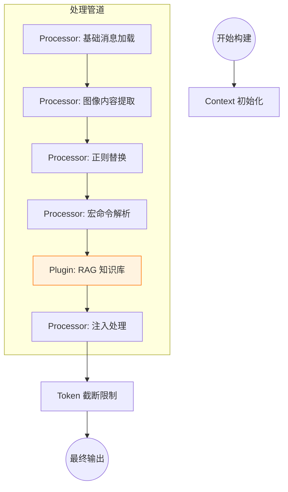

# LLM Chat 上下文管道架构 (Context Pipeline Architecture)

## 1. 核心目标

为了实现类似 "SillyTavern" 或其他高级 LLM 客户端的灵活上下文处理能力，我们将重构现有的 `useChatContextBuilder`，从硬编码的线性流程转变为 **模块化、可视化、可配置** 的管道架构。

**核心价值：**

1.  **可视化 (Visualization)**: 用户可以直观地看到消息处理的每一个步骤，理解数据是如何被加工的。
2.  **可排序 (Reorderable)**: 用户可以通过拖拽调整处理器的执行顺序（例如：决定是先进行正则替换还是先进行宏解析）。
3.  **可扩展 (Extensible)**: 插件可以注册自定义处理器（如 RAG 检索、图像分析、API 注入），无缝插入到流程的任意位置。
4.  **热插拔 (Hot-swappable)**: 用户可以随时启用或禁用某个处理器，而无需修改代码。

## 2. 架构设计

### 2.1 核心概念

系统由三个核心部分组成：

1.  **PipelineContext (上下文载体)**:
    在管道中流动的数据包。它不再只是简单的 `messages` 数组，而是包含更丰富信息的对象，作为所有处理器的输入和输出。

2.  **ContextProcessor (处理器)**:
    最小的功能单元。每个处理器负责对 Context 中的 `messages` 进行特定的修改（增删改查）。

3.  **PipelineManager (管道管理器)**:
    负责存储用户的配置（顺序、开关状态），并负责实例化和调度处理器。

### 2.2 数据流向



## 3. 接口定义

### 3.1 PipelineContext

```typescript
import type { ChatSession, UserProfile } from "../types";
import type { ProcessableMessage } from "../types/context";
import type { ModelCapabilities } from "@/types/llm-profiles";

export interface PipelineContext {
  // --- 核心可变数据 ---
  /**
   * 当前正在构建的消息列表。
   * 处理器可以直接修改此数组（增删改）。
   */
  messages: ProcessableMessage[];

  // --- 只读元数据 ---
  readonly session: ChatSession;
  readonly userProfile?: UserProfile;
  readonly agentConfig: any; // 完整的智能体配置
  readonly capabilities?: ModelCapabilities;
  readonly timestamp: number;

  // --- 共享黑板 (Shared Blackboard) ---
  /**
   * 用于处理器之间传递临时数据。
   * 例如：图像分析器提取的描述可以存放在这里，供后续的 Prompt 处理器读取。
   */
  sharedData: Map<string, any>;

  // --- 日志记录 ---
  /**
   * 处理器可以记录处理日志，用于调试和可视化展示。
   */
  logs: Array<{
    processorId: string;
    level: "info" | "warn" | "error";
    message: string;
    details?: any;
  }>;
}
```

### 3.2 ContextProcessor

```typescript
export interface ContextProcessor {
  /** 唯一标识符 (例如: 'core:regex-replacer') */
  id: string;

  /** 显示名称 (例如: '正则替换') */
  name: string;

  /** 描述信息 */
  description: string;

  /** 图标 (Lucide 图标名或 URL) */
  icon?: string;

  /** 是否为系统核心处理器 (不可删除，但可能允许禁用) */
  isCore?: boolean;

  /** 默认启用状态 */
  defaultEnabled?: boolean;

  /**
   * 核心执行逻辑
   * @param context 管道上下文
   */
  execute(context: PipelineContext): Promise<void>;

  /**
   * 配置组件 (可选)
   * 如果处理器有自定义配置，可以返回一个 Vue 组件名称
   */
  configComponent?: string;
}
```

## 4. 内置处理器规划

我们将现有的 `useChatContextBuilder` 逻辑拆解为以下标准处理器：

| ID                         | 名称         | 职责                                                           | 依赖模块               |
| :------------------------- | :----------- | :------------------------------------------------------------- | :--------------------- |
| `core:session-loader`      | 会话加载器   | 加载 Session History 和 Agent Presets，构建初始消息列表。      | `useMessageBuilder`    |
| `core:regex-processor`     | 正则处理器   | 应用聊天正则规则 (Chat Regex Rules)。                          | `useChatRegexResolver` |
| `core:macro-processor`     | 宏处理器     | 解析并替换消息中的 `{{macro}}`。                               | `useMacroProcessor`    |
| `core:injection-processor` | 注入处理器   | 处理深度注入 (Depth Injection) 和锚点注入 (Anchor Injection)。 | `useContextInjection`  |
| `core:token-limiter`       | Token 限制器 | 根据模型上下文窗口限制消息数量。通常作为管道的最后一步。       | `useContextLimiter`    |

## 5. 存储与状态管理 (Store)

我们需要一个新的 Pinia Store `useContextPipelineStore` 来管理管道状态。

**State:**

- `processors`: Map<string, ContextProcessor> (所有注册的处理器)
- `pipelineConfig`: Array<{ id: string; enabled: boolean; config?: any }> (用户配置的执行顺序和状态)

**Actions:**

- `registerProcessor(processor: ContextProcessor)`: 注册新能力
- `executePipeline(context: PipelineContext)`: 按配置顺序执行
- `moveProcessor(fromIndex, toIndex)`: 调整顺序
- `toggleProcessor(id)`: 启用/禁用

## 6. 配置策略 (Configuration Strategy)

为了保持系统的简洁性和稳定性，Pipeline 采用 **“全局唯一”** 策略。

- **全局配置**: Pipeline 的结构（处理器的顺序、启用状态）仅在 **全局设置 -> 聊天设置** 中配置。
- **智能体无关**: 所有智能体共用同一套处理流程。
- **差异化实现**: 智能体的个性化差异（如 Token 限制大小、正则规则内容）由各处理器在执行时动态读取当前智能体的 `parameters` 来实现，而不是通过修改 Pipeline 结构。

## 7. UI/UX 设计

在 **全局设置 -> 聊天设置** 中新增 **"上下文处理流 (Context Pipeline)"** 面板。

**交互设计：**

- **列表视图**: 使用拖拽组件 (如 `vuedraggable`) 展示当前启用的处理器链。
- **状态开关**: 每个条目右侧有一个 Switch 开关，用于快速启用/禁用。
- **配置入口**: 点击条目可展开或弹出配置面板（如果该处理器提供了 `configComponent`）。
- **执行反馈**: (高级功能) 在调试模式下，显示每个处理器执行后的消息数量变化或耗时。

## 8. 实施路线图

### Phase 1: 基础设施 (Infrastructure)

1.  定义 `PipelineContext` 和 `ContextProcessor` 接口。
2.  创建 `useContextPipelineStore`。
3.  实现 `executePipeline` 核心调度逻辑。

### Phase 2: 逻辑拆分 (Refactoring)

1.  创建 `src/tools/llm-chat/core/processors/` 目录。
2.  将 `useChatContextBuilder` 中的逻辑逐一提取为 Processor 类。
3.  修改 `useChatContextBuilder`，使其调用 `pipelineStore.executePipeline` 而不是硬编码逻辑。

### Phase 3: UI 实现 (UI Implementation)

1.  开发 `PipelineEditor` 组件 (支持拖拽排序)。
2.  集成到侧边栏或设置页面。

### Phase 4: 插件集成 (Plugin Integration)

1.  在插件 API 中暴露 `registerContextProcessor` 方法。
2.  验证外部插件（如 RAG 插件）能否成功注入流程。
