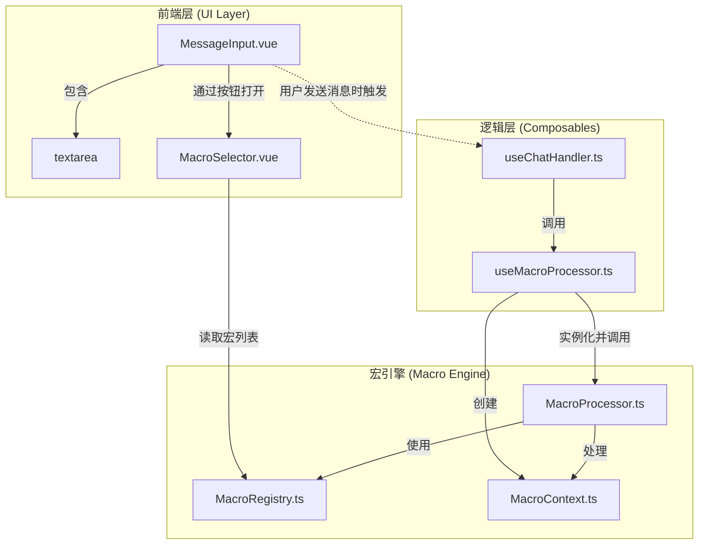

# LLM Chat 宏处理与高级输入系统设计

## 1. 概述

本文档详细介绍了 `llm-chat` 工具的功能核心：一个完备且可扩展的**宏处理系统**。该系统旨在通过动态文本生成，极大地增强用户与大型语言模型（LLM）的交互能力。

系统由两大组件构成：

- **后端宏处理引擎 (Macro Engine)**：负责解析和执行宏命令，采用分阶段管道化处理，确保宏逻辑的有序和精确执行。
- **前端高级输入框 (Advanced Input Box)**：基于 TipTap 和 Vue 构建，未来将提供把宏作为可交互“节点”的富文本编辑体验，提升用户创作和使用宏的效率。

## 2. 架构设计

### 2.1. 系统架构

系统整体架构清晰地划分了前端、逻辑层和后端宏引擎，确保了各部分职责单一且高效协作。



### 2.2. 核心设计

为保证系统的性能与稳定性，当前架构采用了一种务实且高效的设计方案：

- **前端输入**：核心输入框采用原生的 `<textarea>` 元素，以实现最佳性能和最广泛的兼容性。
- **宏的插入**：通过一个独立的 `MacroSelector.vue` 弹出组件，用户可以直观地浏览、搜索并选择宏，然后将其纯文本格式插入到输入框中。
- **处理时机**：宏的解析与执行发生在**后端处理阶段**。当用户点击发送后，由 `useChatHandler` -> `useMacroProcessor` -> `MacroProcessor` 的链式调用完成处理，避免了前端复杂计算带来的性能开销。
- **核心连接点**：`useMacroProcessor.ts` 是连接前端用户操作与后端宏引擎的关键桥梁，它负责在处理流程中构建和传递必要的上下文信息。

## 3. 后端：宏处理引擎

### 3.1. 分阶段执行管道

为确保宏命令执行的逻辑正确性和可预测性，引擎采用了三阶段管道设计：

1.  **阶段一：预处理** - 处理状态变更宏，如 `setvar`, `incvar` 等，为后续阶段准备环境。
2.  **阶段二：内容替换** - 替换上下文中的静态值，如 `{{user}}`, `{{char}}` 等。
3.  **阶段三：后处理** - 执行需要最终上下文的动态函数，如 `{{time}}`, `{{random}}` 等。

### 3.2. 文件结构

```
src/tools/llm-chat/macro-engine/
├── index.ts                 # 主入口
├── MacroProcessor.ts        # 核心处理器（实现三阶段管道）
├── MacroContext.ts          # 上下文定义
├── MacroRegistry.ts         # 宏注册中心
└── macros/
    ├── core.ts              # 核心宏
    ├── variables.ts         # 变量操作宏
    ├── datetime.ts          # 时间日期宏
    └── functions.ts         # 功能性宏
```

## 4. 前端：输入与交互实现

### 4.1. 组件构成

- **`MessageInput.vue`**: 核心输入组件，内部封装了标准的 HTML `<textarea>` 元素作为用户输入区。
- **`MacroSelector.vue`**: 一个弹出式（Popover）组件，通过点击输入框旁的“魔法棒”图标触发，用于展示和选择宏。
- **`useMacroProcessor.ts`**: 连接前后端的 Composable，在用户发送消息时，它会准备好上下文并调用宏引擎进行处理。

### 4.2. 工作流程

1.  用户在 `MessageInput.vue` 的 `<textarea>` 中输入文本。
2.  用户点击“魔法棒”图标，`MacroSelector.vue` 弹出。
3.  `MacroSelector` 从 `MacroRegistry` 中获取所有已注册的宏列表，并分类展示给用户。
4.  用户点击某个宏，`MessageInput.vue` 会将该宏的示例字符串（如 `{{user}}`）插入到 `<textarea>` 的光标位置。这个过程是纯文本操作，保证了响应速度。
5.  当用户点击发送按钮时，`useChatHandler` 调用 `useMacroProcessor`。
6.  `useMacroProcessor` 将完整的、包含宏的文本内容交给后端的 `MacroProcessor.ts` 进行解析和替换。
7.  最终处理完成的文本被发送给 LLM。

这种方式的优点是实现简单、快速，且性能开销极低，为用户提供了稳定可靠的基础功能。

## 5. 远景规划：高级输入框 (TipTap)

本章节探讨使用 TipTap 作为未来高级输入框的技术方案，以提供更丰富的交互体验。

### 5.1. 为何选择 TipTap?

- **现代技术栈**: 基于强大的 Prosemirror 构建，提供稳健的底层和高度的可扩展性。
- **Vue 生态集成**: 官方提供完善的 Vue 3 支持，其 `NodeView` 特性允许使用 Vue 组件渲染复杂节点，与项目技术栈高度契合。
- **“节点”优于“文本”**: 可将宏 (`{{macro}}`) 视为独立的“节点”，轻松实现交互式的“药丸 (Pill)”样式，而非普通文本。
- **强大扩展生态**: 拥有丰富的官方和社区扩展，可快速实现提及、占位符等高级功能。

### 5.2. 核心实现思路：宏作为自定义节点

将宏实现为一个自定义的 TipTap **Node Extension**。

1.  **定义 `MacroNode`**: 创建一个 `Node` 扩展，用于在文档结构中表示宏。其核心属性为 `atom: true`，确保宏作为一个不可分割的整体。
2.  **创建 `MacroNodeView.vue`**: 一个 Vue 组件，负责宏在编辑器中的具体外观和交互，如渲染成“药丸”样式、悬停显示描述、提供删除按钮等。
3.  **使用 `Suggestion` 扩展插入宏**: 利用 TipTap 的 `Suggestion` 扩展实现触发式插入。当用户输入 `{{` 时，弹出宏列表供选择，选中后在编辑器中插入一个 `MacroNode` 节点。

### 5.3. 序列化与集成

- **序列化 (Editor -> Text)**: 提交时，遍历 TipTap 文档树，将 `macro-node` 节点转换回 `{{macro}}` 纯文本格式，交由后端处理。
- **反序列化 (Text -> Editor)**: 加载时，解析文本中的宏字符串，并将其转换为编辑器能够渲染的 `macro-node` 节点。

## 6. 开发路线图

### 阶段一：宏引擎核心 (已完成)

- [x] 实现 `MacroProcessor` 的三阶段执行管道。
- [x] 实现 `MacroRegistry` 用于注册和查询宏。
- [x] 实现基础宏集合 (`core`, `datetime`, `variables`, `functions`)。
- [x] 在 `ContextAnalyzerDialog` 中添加了宏处理的调试功能。

### 阶段二：前端基础集成 (已完成)

- [x] 使用原生 `<textarea>` 作为输入框。
- [x] 创建 `MacroSelector.vue` 组件用于手动选择和插入宏。
- [x] 创建 `useMacroProcessor.ts` 作为连接前端和宏引擎的桥梁。

### 阶段三：高级宏与兼容性 (进行中)

- [ ] 实现与角色卡数据相关的宏 (`description`, `personality` 等)。
- [ ] 集成 Handlebars.js 或类似库，以支持 `{{#if}}` 等条件逻辑。
- [ ] 对照 TavernAI 等社区工具的宏列表进行兼容性测试和功能对齐。

### 阶段四：高级输入框 (TipTap) 集成 (待规划)

- [ ] **技术预研**: 调研 TipTap 自定义节点与 `Suggestion` 插件的最佳实践。
- [ ] **核心实现**: 定义 `MacroNode` 扩展和 `MacroNodeView.vue` 渲染组件。
- [ ] **交互实现**: 配置 `Suggestion` 插件，在输入 `{{` 时触发宏建议列表。
- [ ] **集成与替换**: 开发 `TiptapAdvancedInput.vue` 组件，并替换现有的输入框。

### 阶段五：测试、优化与文档 (待办)

- [ ] **测试**: 编写集成测试和性能测试用例。
- [ ] **UI/UX 优化**: 根据用户反馈优化宏选择器等组件的交互体验。
- [ ] **用户文档**: 在帮助中心详细介绍所有可用宏及其用法。

## 附录：宏参考手册

### 核心占位符

- `{{user}}`: 当前用户的名字。
- `{{char}}`: 当前角色的名字。
- `{{persona}}`: 当前智能体角色的描述。

### 酒馆角色卡数据 (提供酒馆导入兼容性)

**我们自己没有这些字段功能，将来在开发相关导入功能的时候另外处理**

- `{{description}}`: 角色描述。
- `{{personality}}`: 角色性格。
- `{{scenario}}`: 当前场景。
- `{{mesExamples}}`: 对话示例。

### 聊天上下文

- `{{lastMessage}}`: 聊天中的最后一条消息。
- `{{lastUserMessage}}`: 你发送的最后一条消息。
- `{{lastCharMessage}}`: 角色发送的最后一条消息。
- `{{input}}`: 当前在输入框中输入的文本。

### 实用工具

- `{{time}}`: 当前时间 (例如: 10:30 PM)。
- `{{date}}`: 当前日期 (例如: November 7, 2025)。
- `{{random::选项A::选项B::选项C}}`: 从提供的选项中随机选择一个。
- `{{pick::选项A::选项B}}`: 基于聊天内容，从选项中稳定地选择一个。
- `{{roll 1d20}}`: 掷一个20面的骰子。

### 变量操作

- `{{getvar::变量名}}`: 获取一个**当前对话**的局部变量的值。
- `{{setvar::变量名::值}}`: 设置一个局部变量。
- `{{incvar::变量名}}`: 将一个局部变量的值加一。
- `{{getglobalvar::...}}`, `{{setglobalvar::...}}`: 功能同上，但操作的是**全局**变量。

### 格式控制

- `{{newline}}`: 插入一个换行符。
- `{{trim}}`: 移除此宏所在位置之前和之后的所有空白与换行符。

### 高级模板逻辑

系统通过集成 [Handlebars.js](https://handlebarsjs.com/) 模板引擎来支持 `{{#if}}` 等高级条件和循环逻辑，以动态构建复杂的文本结构。
