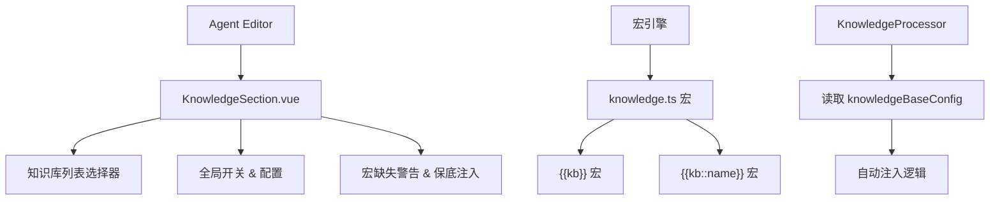

# 知识库配置 Section 重构计划

> **状态**: RFC  
> **关联 Issue**: #4 — 无法关联知识库  
> **日期**: 2025-05-16

---

## 1. 问题分析

### 1.1 现状

| 层面         | 现状                                                                                                        | 问题                               |
| ------------ | ----------------------------------------------------------------------------------------------------------- | ---------------------------------- |
| **类型定义** | `AgentBaseConfig.knowledgeSettings` 只有检索参数（引擎、召回数量、分数阈值等），没有"关联哪些知识库"的字段  | 缺少 `knowledgeBaseIds` 或等价字段 |
| **UI 入口**  | 知识库配置散落在"角色设定"tab 的折叠区域（`knowledge-advanced` 组），且只有参数调优，没有"选择知识库"的入口 | 用户找不到关联入口                 |
| **使用方式** | 必须在预设消息中手动插入 `【kb::知识库名::5::0.3::always】` 占位符                                          | 语法晦涩，普通用户无法上手         |
| **宏系统**   | 有 `{{assets}}` 宏列出资产，但没有对应的知识库宏                                                            | 缺少简化注入手段                   |

### 1.2 用户期望

参考工具调用（ToolCallingSection）的交互模式：

- 一个独立的 GUI 页面，带全局开关
- 可视化的知识库列表，每个可独立开关和配置
- 简单的宏（如 `{{kb}}`）自动注入检索结果
- 保底注入机制（宏缺失时自动注入）

---

## 2. 方案设计

### 2.1 整体架构



### 2.2 类型定义变更

在 `src/tools/llm-chat/types/agent.ts` 中新增：

```typescript
/**
 * 单个知识库的关联配置
 */
export interface AgentKnowledgeBaseBinding {
  /** 知识库 ID */
  kbId: string;
  /** 知识库名称 (冗余存储，用于显示和占位符匹配) */
  kbName: string;
  /** 是否启用 */
  enabled: boolean;
  /** 激活模式 (覆盖全局默认) */
  mode?: "always" | "gate" | "turn" | "static";
  /** 模式参数 */
  modeParams?: string[];
  /** 召回数量 (覆盖全局默认) */
  limit?: number;
  /** 最低分数 (覆盖全局默认) */
  minScore?: number;
  /** 分组标识 (用于 UI 分组展示) */
  group?: string;
}

/**
 * 知识库分组定义
 */
export interface KnowledgeBaseGroup {
  id: string;
  displayName: string;
  description?: string;
  icon?: string;
  sortOrder?: number;
}

/**
 * 知识库关联总配置
 */
export interface AgentKnowledgeBaseConfig {
  /** 全局开关 */
  enabled: boolean;
  /** 关联的知识库列表 */
  bindings: AgentKnowledgeBaseBinding[];
  /** 知识库分组 */
  groups?: KnowledgeBaseGroup[];
  /** 宏缺失时是否自动注入 */
  autoInjectIfMacroMissing?: boolean;
  /** 自动注入的位置:
   *  - 'context_head': 上下文最前方（system 之后，若无 system 则为消息列表最前）
   *  - 'before_last_user': 最后一条用户消息之前
   */
  autoInjectPosition?: "context_head" | "before_last_user";
}
```

在 `AgentBaseConfig` 中新增字段：

```typescript
export interface AgentBaseConfig {
  // ... 现有字段 ...

  /** 知识库关联配置 (新增) */
  knowledgeBaseConfig?: AgentKnowledgeBaseConfig;

  // knowledgeSettings 保留，作为检索参数的高级配置
}
```

默认值：

```typescript
export const DEFAULT_KB_CONFIG: AgentKnowledgeBaseConfig = {
  enabled: false,
  bindings: [],
  groups: [],
  autoInjectIfMacroMissing: true,
  autoInjectPosition: "context_head",
};
```

### 2.3 新增 UI Section

**文件**: `src/tools/llm-chat/components/agent/agent-editor/sections/KnowledgeSection.vue`

参考 `ToolCallingSection.vue` 的设计模式：

```
┌─────────────────────────────────────────────────┐
│ 知识库 (RAG)                          [开关]    │
├─────────────────────────────────────────────────┤
│ 提示: 关联知识库后，智能体可在对话中自动检索     │
│ 相关知识。通过 {{kb}} 宏注入检索结果。          │
│                                                 │
│ ⚠️ 提示词中未发现 {{kb}} 宏                     │
│    [立即开启保底注入]  [前往编辑提示词]          │
├─────────────────────────────────────────────────┤
│ ┌─ 全局配置 ─────────────────────────────────┐  │
│ │ 保底注入: [开关]   注入位置: [下拉]        │  │
│ └────────────────────────────────────────────┘  │
│                                                 │
│ ┌─ 已关联知识库 ─────────────────────────────┐  │
│ │ [搜索知识库...]                            │  │
│ │                                            │  │
│ │ ┌──────────────────────────────────────┐   │  │
│ │ │ 📚 通用知识库        5条  [开关] [⚙] │   │  │
│ │ │ 📖 角色设定库        12条 [开关] [⚙] │   │  │
│ │ │ 📝 FAQ 知识库        8条  [开关] [⚙] │   │  │
│ │ └──────────────────────────────────────┘   │  │
│ │                                            │  │
│ │ [+ 添加知识库]                             │  │
│ └────────────────────────────────────────────┘  │
└─────────────────────────────────────────────────┘
```

每个知识库项展开后的配置面板：

```
┌──────────────────────────────────────────────────┐
│ 📚 通用知识库                                     │
│ ─────────────────────────────────────────────── │
│ 激活模式: [总是检索 ▼]                           │
│ 召回数量: [5]  (留空使用全局默认)                 │
│ 最低分数: [0.30]  (留空使用全局默认)              │
│ 分组:     [default ▼]                            │
│                                                  │
│ 宏引用: {{kb::通用知识库}}                        │
└──────────────────────────────────────────────────┘
```

### 2.4 新增 `{{kb}}` 宏

**文件**: `src/tools/llm-chat/macro-engine/macros/knowledge.ts`

参考 `assets.ts` 的模式，注册以下宏：

| 宏                    | 说明                                      | 示例                |
| --------------------- | ----------------------------------------- | ------------------- |
| `{{kb}}`              | 触发所有已启用知识库的检索并注入结果      | `{{kb}}`            |
| `{{kb::name}}`        | 触发指定知识库的检索                      | `{{kb::FAQ知识库}}` |
| `{{kb::name::limit}}` | 指定知识库 + 自定义召回数量               | `{{kb::FAQ::10}}`   |
| `{{kb_list}}`         | 列出当前智能体关联的知识库（供 LLM 感知） | `{{kb_list}}`       |

**核心逻辑**：

- `{{kb}}` 宏在 SUBSTITUTE 阶段执行
- 读取 `context.agent.knowledgeBaseConfig.bindings` 获取已启用的知识库列表
- 生成对应的 `【kb::name::limit::minScore::mode】` 占位符序列
- 后续由 `KnowledgeProcessor` 统一处理实际检索

这样 `{{kb}}` 宏本质上是一个**占位符生成器**，将 GUI 配置转换为处理器可识别的占位符格式。

### 2.5 KnowledgeProcessor 适配

在 `knowledge-processor.ts` 中增加自动注入逻辑：

```typescript
// 在 execute() 方法开头增加：
// 如果没有找到任何 KB 占位符，但 knowledgeBaseConfig.enabled 且 autoInjectIfMacroMissing
// 则自动在指定位置注入占位符
if (placeholders.length === 0 && agentConfig.knowledgeBaseConfig?.enabled) {
  const kbConfig = agentConfig.knowledgeBaseConfig;
  if (kbConfig.autoInjectIfMacroMissing) {
    // 生成占位符并注入到指定位置
    const autoPlaceholders = this.generateAutoPlaceholders(kbConfig, messages);
    placeholders.push(...autoPlaceholders);
  }
}
```

### 2.6 Tab 配置变更

在 `agentEditConfig.ts` 中新增 tab：

```typescript
{
  id: "knowledge",
  label: "知识库",
  icon: BookOpen, // from lucide-vue-next
  items: [
    { id: "knowledgeBase", label: "知识库 (RAG)", keywords: "knowledge base RAG 知识库 检索" },
  ],
},
```

### 2.7 AgentEditor 集成

在 `AgentEditor.vue` 中：

1. 导入 `KnowledgeSection`
2. 在 `editor-content` 中添加 `<KnowledgeSection v-show="activeTab === 'knowledge'" />`

### 2.8 迁移策略

对于已有的使用 `【kb】` 占位符的智能体：

- **完全向后兼容**：`KnowledgeProcessor` 仍然识别手动编写的占位符
- 新的 `knowledgeBaseConfig` 是可选字段，不影响旧数据
- 可以在 UI 中提供"从占位符导入"的辅助功能（低优先级）

---

## 3. 实施步骤

### Phase 1: 类型与数据层 (基础)

1. 在 `types/agent.ts` 中新增 `AgentKnowledgeBaseBinding`、`KnowledgeBaseGroup`、`AgentKnowledgeBaseConfig` 接口
2. 在 `AgentBaseConfig` 中新增 `knowledgeBaseConfig` 字段
3. 新增 `DEFAULT_KB_CONFIG` 常量

### Phase 2: 宏引擎 (核心逻辑)

4. 创建 `macro-engine/macros/knowledge.ts`，注册 `kb` 和 `kb_list` 宏
5. 在宏引擎初始化时注册新宏

### Phase 3: 处理器适配

6. 修改 `KnowledgeProcessor`，增加自动注入逻辑
7. 支持从 `knowledgeBaseConfig.bindings` 读取配置

### Phase 4: UI Section (用户界面)

8. 创建 `KnowledgeSection.vue`
9. 创建 `KnowledgeBaseItem.vue`（单个知识库配置项组件）
10. 在 `agentEditConfig.ts` 中新增 tab
11. 在 `AgentEditor.vue` 中集成

### Phase 5: 知识库高级设置迁移

12. 将 `PersonalitySection` 中的 `knowledge-advanced` 折叠组移动到 `KnowledgeSection` 中
13. 保持 `knowledgeSettings` 字段不变，作为高级参数区域

---

## 4. 文件变更清单

| 文件                                                                               | 操作 | 说明                                 |
| ---------------------------------------------------------------------------------- | ---- | ------------------------------------ |
| `src/tools/llm-chat/types/agent.ts`                                                | 修改 | 新增类型定义和默认值                 |
| `src/tools/llm-chat/macro-engine/macros/knowledge.ts`                              | 新建 | `{{kb}}` 和 `{{kb_list}}` 宏         |
| `src/tools/llm-chat/core/context-processors/knowledge-processor.ts`                | 修改 | 自动注入逻辑                         |
| `src/tools/llm-chat/components/agent/agent-editor/sections/KnowledgeSection.vue`   | 新建 | 知识库配置 Section                   |
| `src/tools/llm-chat/components/agent/agent-editor/sections/KnowledgeBaseItem.vue`  | 新建 | 单个知识库配置项                     |
| `src/tools/llm-chat/components/agent/agent-editor/agentEditConfig.ts`              | 修改 | 新增 knowledge tab                   |
| `src/tools/llm-chat/components/agent/agent-editor/AgentEditor.vue`                 | 修改 | 集成 KnowledgeSection                |
| `src/tools/llm-chat/components/agent/agent-editor/sections/PersonalitySection.vue` | 修改 | 移除 kb\* 配置项（迁移到新 Section） |

---

## 5. 与现有系统的关系

```
┌─────────────────────────────────────────────────────────┐
│                    Agent 配置                             │
│                                                         │
│  knowledgeBaseConfig (新增)     knowledgeSettings (保留) │
│  ├─ enabled                    ├─ defaultEngineId       │
│  ├─ bindings[]                 ├─ defaultLimit          │
│  │   ├─ kbId                   ├─ defaultMinScore       │
│  │   ├─ kbName                 ├─ embeddingModelId      │
│  │   ├─ enabled                ├─ resultTemplate        │
│  │   ├─ mode                   ├─ aggregation{}         │
│  │   └─ limit/minScore         └─ ...                   │
│  ├─ groups[]                                            │
│  └─ autoInjectIfMacroMissing                            │
│                                                         │
│  "关联哪些库 + 怎么触发"        "检索参数怎么调"         │
└─────────────────────────────────────────────────────────┘
         │                              │
         ▼                              ▼
┌─────────────────┐          ┌─────────────────────┐
│  {{kb}} 宏      │          │  KnowledgeProcessor │
│  生成占位符     │ ───────▶ │  执行实际检索       │
└─────────────────┘          └─────────────────────┘
```

---

## 6. 设计决策说明

### Q: 为什么不直接复用 `knowledgeSettings` 加一个 `kbIds` 字段？

A: 职责分离。`knowledgeSettings` 是"检索引擎怎么工作"的参数（类似数据库连接池配置），而新的 `knowledgeBaseConfig` 是"关联哪些库、怎么触发"的业务配置（类似 ORM 的 entity 映射）。两者关注点不同，分开管理更清晰。

### Q: 为什么 `{{kb}}` 宏生成占位符而不是直接执行检索？

A: 复用现有的 `KnowledgeProcessor` 管道。处理器已经实现了完整的缓存、聚合、格式化逻辑，宏只需要负责"声明意图"，具体执行交给处理器。这也保持了手动占位符和自动宏的行为一致性。

### Q: 保底注入和 `{{kb}}` 宏的关系？

A:

- 用户在提示词中写了 `{{kb}}` → 宏引擎展开为占位符 → 处理器执行检索
- 用户没写任何宏 → 保底注入逻辑自动在指定位置插入占位符 → 处理器执行检索
- 用户手动写了 `【kb】` 占位符 → 处理器直接执行（向后兼容）

三条路径最终都汇聚到 `KnowledgeProcessor`。
