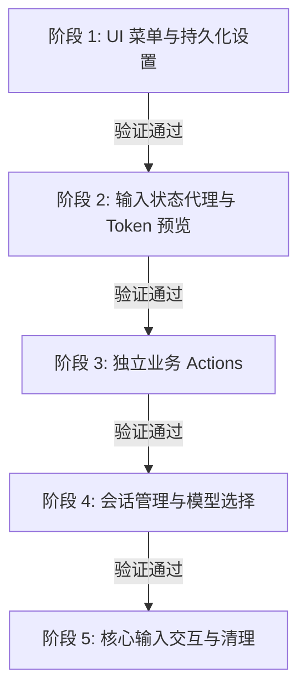

# MessageInputStore 渐进式重构计划：输入区 Pinia 状态管理重构

为了提升 [`llm-chat`](src/tools/llm-chat) 工具输入区的可维护性、降低组件间的耦合度，并彻底消除繁琐的 Props 钻接（Props Drilling）与事件冒泡（Emits Bubble），我们计划引入一个专用的 Pinia Store：[`messageInputStore.ts`](src/tools/llm-chat/stores/messageInputStore.ts)。

为了降低重构风险，避免一次性修改过多代码导致难以调试，本计划采用**渐进式迁移（Progressive Migration）**策略。整个重构分为 5 个独立阶段，每个阶段只迁移一小部分状态和逻辑，且每个阶段完成后均可独立编译、运行和验证。

---

## 1. 现状分析与痛点

目前，输入区的状态和逻辑分散在多个地方：

- **状态源**：[`useChatInputManager.ts`](src/tools/llm-chat/composables/input/useChatInputManager.ts)（管理文本、附件、临时模型等全局单例）。
- **Token 计算**：[`useChatInputTokenPreview.ts`](src/tools/llm-chat/composables/input/useChatInputTokenPreview.ts)。
- **交互逻辑**：[`useMessageInputActions.ts`](src/tools/llm-chat/composables/input/useMessageInputActions.ts)。
- **UI 状态**：分散在 [`MessageInput.vue`](src/tools/llm-chat/components/message-input/MessageInput.vue) 和 [`MessageInputToolbar.vue`](src/tools/llm-chat/components/message-input/MessageInputToolbar.vue) 中。

### 痛点：Props 钻接与 Emits 冒泡严重

[`MessageInputToolbar.vue`](src/tools/llm-chat/components/message-input/MessageInputToolbar.vue) 接收了多达 20 个 Props，触发了多达 22 个 Emits，其中大部分只是为了在父组件 [`MessageInput.vue`](src/tools/llm-chat/components/message-input/MessageInput.vue) 和子组件（如 [`ToolbarStatusCapsules.vue`](src/tools/llm-chat/components/message-input/toolbar/ToolbarStatusCapsules.vue)、[`ToolbarMoreMenu.vue`](src/tools/llm-chat/components/message-input/toolbar/ToolbarMoreMenu.vue) 或 [`ToolbarSettingsPopover.vue`](src/tools/llm-chat/components/message-input/toolbar/ToolbarSettingsPopover.vue)）之间进行转发。

---

## 2. 渐进式迁移步骤



#############
_注意：施工的过程可能会遇到计划未提及的状况，需要随机应变，并且把改动进度同步回文档_
#############

### 2.1. 阶段 1：UI 菜单可见性与持久化设置迁移

#### 目标

迁移输入区工具栏的持久化设置（`settings`）和各种弹出菜单的可见性状态，精简 [`ToolbarSettingsPopover.vue`](src/tools/llm-chat/components/message-input/toolbar/ToolbarSettingsPopover.vue) 的 Props。

#### 1. 创建 Store 骨架

新建 [`messageInputStore.ts`](src/tools/llm-chat/stores/messageInputStore.ts)，定义基础结构、持久化设置和 UI 菜单状态：

```typescript
import { defineStore } from "pinia";
import { ref, computed } from "vue";
import { useStorage } from "@vueuse/core";
import { createModuleLogger } from "@/utils/logger";
import { createModuleErrorHandler } from "@/utils/errorHandler";

export interface InputToolbarSettings {
  showTokenUsage: boolean;
  enableMacroParsing: boolean;
  extractBase64FromPaste: boolean;
  groupQuickActionsBySet: boolean;
}

const logger = createModuleLogger("messageInputStore");
const errorHandler = createModuleErrorHandler("messageInputStore");

export const useMessageInputStore = defineStore(
  "llm-chat-message-input",
  () => {
    // 1. UI 菜单可见性状态
    const macroSelectorVisible = ref(false);
    const sessionListVisible = ref(false);
    const toolSettingsVisible = ref(false);
    const moreMenuVisible = ref(false);
    const settingsVisible = ref(false);
    const canvasMenuOpen = ref(false);

    const anyMenuOpen = computed(
      () =>
        macroSelectorVisible.value ||
        sessionListVisible.value ||
        toolSettingsVisible.value ||
        moreMenuVisible.value ||
        settingsVisible.value ||
        canvasMenuOpen.value
    );

    // 2. 持久化设置
    const settings = useStorage<InputToolbarSettings>(
      "chat-input-settings",
      {
        showTokenUsage: true,
        enableMacroParsing: true,
        extractBase64FromPaste: true,
        groupQuickActionsBySet: false,
      },
      localStorage,
      { mergeDefaults: true }
    );

    return {
      macroSelectorVisible,
      sessionListVisible,
      toolSettingsVisible,
      moreMenuVisible,
      settingsVisible,
      canvasMenuOpen,
      anyMenuOpen,
      settings,
    };
  }
);
```

#### 2. 组件重构

- **[`ToolbarSettingsPopover.vue`](src/tools/llm-chat/components/message-input/toolbar/ToolbarSettingsPopover.vue)**：
  - 移除 `settings` Prop 和 `update:settings` Emit。
  - 直接从 `useMessageInputStore()` 读写 `store.settings`。
- **[`MessageInputToolbar.vue`](src/tools/llm-chat/components/message-input/MessageInputToolbar.vue)**：
  - 移除 `v-model:settings`、`v-model:macroSelectorVisible`、`v-model:anyMenuOpen` Props/Emits。
  - 内部直接使用 `store.macroSelectorVisible`、`store.sessionListVisible` 等。
- **[`MessageInput.vue`](src/tools/llm-chat/components/message-input/MessageInput.vue)**：
  - 移除本地的 `macroSelectorVisible`、`isAnyMenuOpen`、`inputSettings` 状态。
  - 分离窗口高度自适应逻辑中，直接 `watch(() => store.anyMenuOpen, ...)`。

#### 3. 验证点

- [x] 运行 `bun run check:frontend` 无类型错误。（2026-06-03 exit code 0）
- [x] 工具栏设置（如"显示 Token 估算"）开关状态可正常切换并持久化。
- [x] 弹出宏选择器、会话列表等菜单时，分离窗口高度能自适应展开/收起。

#### 4. 完工记录（实际施工差异）

- `messageInputStore.ts` 已创建，Store 骨架与计划一致。
- `ToolbarSettingsPopover.vue` 已移除 `settings` prop 和 `update:settings` emit，直接读写 `store.settings`；仅保留 `isDetached` prop（用于 popover 弹出方向）。
- `MessageInputToolbar.vue` 已移除 `v-model:settings`、`v-model:macroSelectorVisible`、`v-model:anyMenuOpen` 相关 Props/Emits，改用 `storeToRefs(inputStore)` 直接读写菜单可见性状态；同时补充了 `InputToolbarSettings` 的 re-export 以保持向后兼容。
- `MessageInput.vue` 的 `inputSettings` 改为 `storeToRefs(inputStore)` 读取，`anyMenuOpen` 的 watch 直接引用 `inputStore.anyMenuOpen`，无残留本地状态。

---

### 2.2. 阶段 2：输入状态代理与 Token 预览迁移

#### 目标

将输入文本、附件状态、临时模型、续写模型等输入状态，以及 Token 预览计算迁移至 Store，精简 [`ToolbarStatusCapsules.vue`](src/tools/llm-chat/components/message-input/toolbar/ToolbarStatusCapsules.vue) 的 Props。

#### 1. Store 变更

在 [`messageInputStore.ts`](src/tools/llm-chat/stores/messageInputStore.ts) 中引入 [`useChatInputManager`](src/tools/llm-chat/composables/input/useChatInputManager.ts) 和 [`useChatInputTokenPreview`](src/tools/llm-chat/composables/input/useChatInputTokenPreview.ts)：

```typescript
// 导入依赖
import { useChatInputManager } from "../composables/input/useChatInputManager";
import { useChatInputTokenPreview } from "../composables/input/useChatInputTokenPreview";
import { useLlmProfiles } from "@/composables/useLlmProfiles";

// 在 store 内部初始化
const inputManager = useChatInputManager();
const { getProfileById } = useLlmProfiles();

// 1. 代理 inputManager 状态
const inputText = inputManager.inputText;
const attachments = inputManager.attachments;
const isProcessingAttachments = inputManager.isProcessingAttachments;
const hasAttachments = inputManager.hasAttachments;
const temporaryModel = inputManager.temporaryModel;
const continuationModel = inputManager.continuationModel;

// 2. Token 预览计算
const {
  tokenCount,
  isCalculatingTokens,
  tokenEstimated,
  triggerCalculation: debouncedCalculateTokens,
} = useChatInputTokenPreview({ inputText, attachments, temporaryModel });

// 3. 模型 Info 计算属性 (Getters)
const temporaryModelInfo = computed(() => {
  if (!temporaryModel.value) return null;
  const profile = getProfileById(temporaryModel.value.profileId);
  const model = profile?.models.find(
    (m) => m.id === temporaryModel.value?.modelId
  );
  if (!profile || !model) return null;
  return { profileName: profile.name, modelName: model.name || model.id };
});

const continuationModelInfo = computed(() => {
  if (!continuationModel.value) return null;
  const profile = getProfileById(continuationModel.value.profileId);
  const model = profile?.models.find(
    (m) => m.id === continuationModel.value?.modelId
  );
  if (!profile || !model) return null;
  return { profileName: profile.name, modelName: model.name || model.id };
});
```

#### 2. 组件重构

- **[`ToolbarStatusCapsules.vue`](src/tools/llm-chat/components/message-input/toolbar/ToolbarStatusCapsules.vue)**：
  - 移除 `continuationModelInfo`、`temporaryModelInfo`、`showTokenUsage`、`contextStats`、`tokenCount`、`isCalculatingTokens`、`tokenEstimated` 等 Props。
  - 直接从 `store` 读取这些计算属性和状态。
- **[`MessageInputToolbar.vue`](src/tools/llm-chat/components/message-input/MessageInputToolbar.vue)**：
  - 移除上述状态对应的 Props 声明与转发。
- **[`MessageInput.vue`](src/tools/llm-chat/components/message-input/MessageInput.vue)**：
  - 移除本地的 `tokenCount`、`isCalculatingTokens`、`tokenEstimated` 等 `useChatInputTokenPreview` 实例化代码，改由直接从 Store 读取。

#### 3. 验证点

- [x] 运行 `bun run check:frontend` 无类型错误。（2026-06-03 exit code 0）
- [x] 输入框输入文本、拖入附件时，Token 数量能实时计算并正确显示。
- [-] 临时模型和续写模型选中后，状态胶囊能正确显示模型名称。

#### 4. 完工记录（实际施工差异）

- `messageInputStore.ts` 新增：`useChatInputManager` 代理（inputText、attachments、isProcessingAttachments、hasAttachments、temporaryModel、continuationModel）、`useChatInputTokenPreview` 实例（tokenCount、isCalculatingTokens、tokenEstimated、triggerCalculation）、`useLlmProfiles` 计算属性（temporaryModelInfo、continuationModelInfo）。
- `ToolbarStatusCapsules.vue` 移除 6 个 Props（continuationModelInfo、temporaryModelInfo、showTokenUsage、tokenCount、isCalculatingTokens、tokenEstimated），改直接读 `inputStore`；保留 isCanvasEnabled、canvasBindingInfo、hasCanvasPendingChanges、contextStats。
- `MessageInputToolbar.vue` 移除 Props：tokenCount、isCalculatingTokens、tokenEstimated、temporaryModel、continuationModel；移除本地 continuationModelInfo/temporaryModelInfo 计算属性；effectiveProfileId 改从 `inputStore.temporaryModel` 读取；传给 ToolbarMoreMenu 的 continuationModelInfo 改为 `inputStore.continuationModelInfo`；传给 ToolbarStatusCapsules 的已迁移 props 全部移除。
- `MessageInput.vue` 移除 `useChatInputTokenPreview` import 及实例化；`debouncedCalculateTokens` 参数改为 `inputStore.triggerCalculation`；传给 `MessageInputToolbar` 的 5 个 token/model 相关 props 全部移除。

---

### 2.3. 阶段 3：独立业务 Actions 迁移

#### 目标

迁移翻译、上下文压缩、路径转换、清理占位符等不依赖复杂 UI 交互的独立业务 Actions，精简 [`ToolbarMoreMenu.vue`](src/tools/llm-chat/components/message-input/toolbar/ToolbarMoreMenu.vue) 的 Emits。

#### 1. Store 变更

在 [`messageInputStore.ts`](src/tools/llm-chat/stores/messageInputStore.ts) 中引入业务 Composables 并实现 Actions：

```typescript
import { useTranslation } from "../composables/chat/useTranslation";
import { useContextCompressor } from "../composables/features/useContextCompressor";
import { useLlmChatStore } from "./llmChatStore";
import { customMessage } from "@/utils/customMessage";

const chatStore = useLlmChatStore();
const { translateText } = useTranslation();
const { manualCompress } = useContextCompressor();

const isTranslating = ref(false);
const isCompressing = ref(false);

// 1. 翻译输入
const handleTranslateInput = async (textareaRef: any) => {
  if (isTranslating.value) return;
  const text = inputText.value.trim();
  if (!text) return;

  isTranslating.value = true;
  const textarea = textareaRef.value;
  const { start, end } = textarea
    ? textarea.getSelectionRange()
    : { start: 0, end: 0 };
  const hasSelection = start !== end;
  const textToTranslate = hasSelection
    ? inputText.value.substring(start, end)
    : text; // 修正了原代码中对 trim 后文本做 substring 的 bug
  const targetLang = "English"; // 可从设置中读取

  try {
    const translatedText = await translateText(
      textToTranslate,
      undefined,
      undefined,
      targetLang
    );
    if (translatedText) {
      if (hasSelection) {
        textarea?.insertText(translatedText, start, end);
      } else {
        inputText.value = translatedText;
      }
      customMessage.success("翻译完成");
    }
  } finally {
    isTranslating.value = false;
  }
};

// 2. 压缩上下文
const handleCompressContext = async () => {
  if (isCompressing.value) return;
  const fullSession = chatStore.currentFullSession;
  if (!fullSession?.index || !fullSession?.detail) return;

  isCompressing.value = true;
  try {
    const result = await manualCompress(fullSession.index, fullSession.detail);
    if (result.success) {
      customMessage.success(
        `上下文压缩成功：已压缩 ${result.messageCount} 条消息`
      );
      debouncedCalculateTokens();
    } else {
      customMessage.info("没有可压缩的消息，或历史记录不足");
    }
  } catch (error) {
    errorHandler.error(error, "手动压缩失败");
  } finally {
    isCompressing.value = false;
  }
};

// 3. 路径转换与占位符清理
const handleConvertPaths = async () => {
  const result = await inputManager.convertPathsToAttachments();
  if (result.totalCount === 0) {
    customMessage.info("未在输入内容中检测到本地文件路径");
    return;
  }
  customMessage.success(`已成功转换 ${result.successCount} 个路径`);
};

const handleCleanupPlaceholders = () => {
  const { removedCount } = inputManager.cleanupInvalidPlaceholders();
  if (removedCount > 0) {
    customMessage.success(`已清理 ${removedCount} 个无效占位符`);
  } else {
    customMessage.info("未发现无效占位符");
  }
};
```

#### 2. 组件重构

- **[`ToolbarMoreMenu.vue`](src/tools/llm-chat/components/message-input/toolbar/ToolbarMoreMenu.vue)**：
  - 移除 `translate-input`、`compress-context`、`convert-paths`、`cleanup-placeholders` 等 Emits。
  - 直接调用 `store.handleTranslateInput`、`store.handleCompressContext` 等。
- **[`MessageInputToolbar.vue`](src/tools/llm-chat/components/message-input/MessageInputToolbar.vue)**：
  - 移除对应的 Emits 转发。
- **[`MessageInput.vue`](src/tools/llm-chat/components/message-input/MessageInput.vue)**：
  - 移除 `MessageInputToolbar` 上绑定的 `@translate-input`、`@compress-context` 等事件监听。

#### 3. 验证点

- [x] 运行 `bun run check:frontend` 无类型错误。（2026-06-03 exit code 0）
- [ ] 在"更多菜单"中点击"翻译输入"、"压缩上下文"、"转换路径"、"清理占位符"功能均能正常执行并给出提示。

#### 4. 完工记录（实际施工差异）

- `messageInputStore.ts` 新增：`useTranslation`、`useContextCompressor`、`useLlmChatStore` 依赖；`isTranslating`、`isCompressing` 状态；`registerTextareaRef`（由 `MessageInput.vue` 在 `onMounted` 时注册 textareaRef 供翻译使用）；`handleTranslateInput`、`handleCompressContext`、`handleConvertPaths`、`handleCleanupPlaceholders` actions。
- `ToolbarMoreMenu.vue` 移除 Props：`isTranslating`、`isCompressing`；移除 Emits：`translate-input`、`compress-context`、`convert-paths`、`cleanup-placeholders`；改为直接调用 `inputStore.handleTranslateInput()`、`inputStore.handleCompressContext()`、`inputStore.handleConvertPaths()`、`inputStore.handleCleanupPlaceholders()`。
- `MessageInputToolbar.vue` 移除 Emits：`translate-input`、`compress-context`、`convert-paths`、`cleanup-placeholders`；移除传递给 `ToolbarMoreMenu` 的 `is-translating`、`is-compressing` props 及对应 emit 转发。
- `MessageInput.vue` 移除解构：`isTranslatingInput`、`isCompressing`、`handleTranslateInput`、`handleCompressContext`、`handleCleanupPlaceholders`（均已迁移至 Store）；移除本地 `handleConvertPaths` 函数；`onMounted` 新增 `inputStore.registerTextareaRef(textareaRef)` 注册；移除传递给 `MessageInputToolbar` 的 `@translate-input`、`@compress-context`、`@convert-paths`、`@cleanup-placeholders` 事件绑定及 `:is-translating` prop；`:is-compressing` 改为读取 `inputStore.isCompressing`。

---

### 2.4. 阶段 4：会话管理与模型选择迁移

#### 目标

迁移切换会话、新建会话、选择临时模型、选择续写模型等涉及弹窗或跨窗口同步的 Actions。

#### 1. Store 变更

在 [`messageInputStore.ts`](src/tools/llm-chat/stores/messageInputStore.ts) 中引入窗口同步总线和模型选择弹窗：

```typescript
import { useWindowSyncBus } from "@/composables/useWindowSyncBus";
import { useModelSelectDialog } from "@/composables/useModelSelectDialog";
import { useAgentStore } from "./agentStore";

const bus = useWindowSyncBus();
const { open: openModelSelectDialog } = useModelSelectDialog();
const agentStore = useAgentStore();

const isDetached = ref(false);

// 1. 会话管理
const handleSwitchSession = (sessionId: string) => {
  if (isDetached.value) {
    bus.requestAction("llm-chat:switch-session", { sessionId });
  } else {
    chatStore.switchSession(sessionId);
  }
};

const handleNewSession = () => {
  const agentId = agentStore.currentAgentId || agentStore.defaultAgent?.id;
  if (!agentId) {
    customMessage.warning("没有可用的智能体来创建新会话");
    return;
  }
  if (isDetached.value) {
    bus.requestAction("llm-chat:create-session", { agentId });
  } else {
    chatStore.createSession(agentId);
  }
};

// 2. 模型选择
const handleSelectTemporaryModel = async () => {
  const currentSelection = getCurrentModelSelection(temporaryModel);
  const result = await openModelSelectDialog({
    current: currentSelection,
    initialCapabilities: { embedding: false, rerank: false },
  });
  if (result) {
    inputManager.setTemporaryModel({
      profileId: result.profile.id,
      modelId: result.model.id,
    });
  }
};

const handleSelectContinuationModel = async () => {
  if (isDetached.value) {
    bus.requestAction("llm-chat:select-continuation-model", {});
    customMessage.info("正在主窗口中打开模型选择弹窗...");
    return;
  }

  const currentSelection = getCurrentModelSelection(continuationModel);
  const result = await openModelSelectDialog({
    current: currentSelection,
    initialCapabilities: { embedding: false, rerank: false },
  });
  if (result) {
    inputManager.setContinuationModel({
      profileId: result.profile.id,
      modelId: result.model.id,
    });
  }
};
```

#### 2. 组件重构

- **[`MiniSessionList.vue`](src/tools/llm-chat/components/message-input/MiniSessionList.vue)**：
  - 移除 `switch` 和 `new-session` Emits。
  - 直接调用 `store.handleSwitchSession` 和 `store.handleNewSession`。
- **[`MessageInputToolbar.vue`](src/tools/llm-chat/components/message-input/MessageInputToolbar.vue)**：
  - 移除 `switch-session`、`new-session`、`select-temporary-model`、`select-continuation-model` 等 Emits。
- **[`MessageInput.vue`](src/tools/llm-chat/components/message-input/MessageInput.vue)**：
  - 移除对应的事件绑定。在 `onMounted` 中设置 `store.isDetached = props.isDetached || false`。

#### 3. 验证点

- [ ] 运行 `bun run check:frontend` 无类型错误。
- [ ] 点击会话列表中的会话能正常切换，点击新建会话能正常创建。
- [ ] 点击临时模型、续写模型按钮能正常弹出模型选择器，选中后能正确更新。

---

### 2.5. 阶段 5：核心输入交互与清理

#### 目标

迁移快捷操作、宏变量插入、智能补全等核心输入交互，重构 `provideChatContext`，彻底删除 [`useMessageInputActions.ts`](src/tools/llm-chat/composables/input/useMessageInputActions.ts)。

#### 1. 解决 autoSend 时的 `useChatContext` 注入问题

为了避免在 Store 中调用 `useChatContext()` 导致运行时崩溃，我们在 Store 中引入**回调注册机制**：

```typescript
// 在 messageInputStore.ts 中
let _sendCallback: (() => void) | null = null;
let _completeInputCallback: ((content: string, options?: any) => void) | null =
  null;

export const useMessageInputStore = defineStore(
  "llm-chat-message-input",
  () => {
    // ...
    const registerSendCallback = (fn: typeof _sendCallback) => {
      _sendCallback = fn;
    };

    const registerCompleteInputCallback = (
      fn: typeof _completeInputCallback
    ) => {
      _completeInputCallback = fn;
    };

    const triggerSend = () => {
      _sendCallback?.();
    };

    const handleCompleteInput = (content: string) => {
      const options = continuationModel.value
        ? {
            modelId: continuationModel.value.modelId,
            profileId: continuationModel.value.profileId,
          }
        : undefined;

      if (isDetached.value) {
        bus.requestAction("llm-chat:complete-input", { content, options });
      } else {
        _completeInputCallback?.(content, options);
      }
    };

    return {
      // ...
      registerSendCallback,
      registerCompleteInputCallback,
      triggerSend,
      handleCompleteInput,
    };
  }
);
```

在 `handleQuickAction` 的 `autoSend` 逻辑中，直接调用 `triggerSend()`：

```typescript
if (action.autoSend) {
  setTimeout(() => {
    triggerSend(); // ✅ 安全调用，不依赖 Vue inject
  }, 50);
}
```

#### 2. 组件重构

- **[`MessageInput.vue`](src/tools/llm-chat/components/message-input/MessageInput.vue)**：
  - 彻底移除 `useMessageInputActions` 依赖。
  - 在 `onMounted` 中注册回调：
    ```typescript
    store.registerSendCallback(() => {
      context.actions.send();
    });
    store.registerCompleteInputCallback((content, options) => {
      emit("complete-input", content, options);
    });
    ```
  - 在 `provideChatContext` 中实现 `send`、`abort`、`triggerAttachment`：

    ```typescript
    provideChatContext({
      state: {
        isSending: toRef(props, "isSending"),
        disabled: toRef(props, "disabled"),
      },
      actions: {
        send: async () => {
          const content = store.inputText.trim();
          if ((!content && !store.hasAttachments) || props.disabled) return;

          store.inputText = ""; // 清空输入
          // 执行实际发送 emit 或 bus.requestAction
        },
        abort: () => {
          // 执行中止逻辑
        },
        triggerAttachment: async () => {
          // 执行附件选择弹窗逻辑
        },
      },
    });
    ```

- **[`QuickActionsBar.vue`](src/tools/llm-chat/components/message-input/toolbar/QuickActionsBar.vue)**：
  - 移除 `execute-quick-action` Emit，直接调用 `store.handleQuickAction`。
- **[`MessageInputToolbar.vue`](src/tools/llm-chat/components/message-input/MessageInputToolbar.vue)**：
  - 移除 `insert`、`execute-quick-action`、`complete-input` 等所有剩余 Emits。
  - 彻底实现**零 Props，零 Emits**。

#### 3. 清理与删除

- 彻底删除 [`useMessageInputActions.ts`](src/tools/llm-chat/composables/input/useMessageInputActions.ts)。

#### 4. 验证点

- [ ] 运行 `bun run check:frontend` 无类型错误。
- [ ] 快捷操作平铺栏点击可正常执行，且配置了"自动发送"的快捷操作能安全触发发送。
- [ ] 宏变量点击可正常插入到光标所在位置。
- [ ] 智能补全功能正常。

---

## 3. 总结与优势

通过这种**渐进式迁移**方案：

1. **心智负担极低**：每次重构只关注一个特定的子功能（如"持久化设置"或"Token计算"），修改的文件极少。
2. **零运行时崩溃风险**：通过回调注册机制，彻底规避了 Pinia Store 中非法使用 `inject` 的隐患。
3. **持续集成与验证**：每个阶段都是一个完整的闭环，可以随时提交、测试，确保重构过程稳健、安全。
