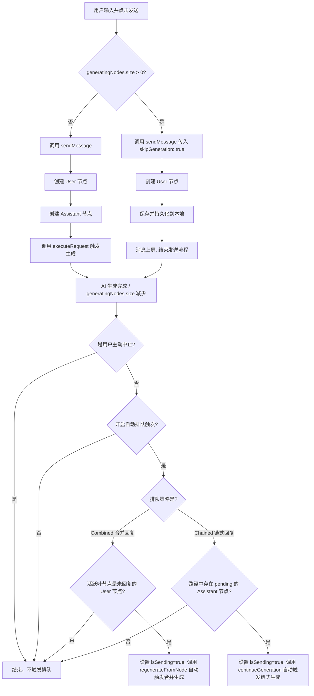

# LLM Chat 消息发送队列与非阻塞发送重构计划

## 1. 需求背景与目标

### 1.1 现状与痛点

当前 LLM Chat 工具在消息发送时存在硬性阻塞：

1. **UI 互斥**：当 AI 正在生成回复时，发送按钮会被替换为停止按钮，用户无法输入并发送下一条消息。
2. **逻辑阻断**：即使通过其他手段触发发送，Composable 层和 Store 层也会拦截请求，弹出警告并直接丢弃输入。
3. **体验限制**：用户在灵感涌现或需要连续追问时，必须等待 AI 慢吞吞地吐出字来，无法实现"一口气把问题发完"的流畅体验。
4. **分支级硬性阻塞**：当前的阻塞是全局会话级的。即使 AI 正在分支 A 生成回复，如果用户切换到分支 B（空闲分支）想继续对话，发送和生成也会被全局的 `isSending` 或 `generatingNodes` 状态拦截，无法在空闲分支上立即获得回复。

### 1.2 目标

1. **发送按钮始终可用**：发送按钮不再与停止按钮互斥，只要输入框有内容即可随时发送。
2. **消息节点即时上树**：发送的消息会立即作为 User 节点追加到消息树中，并在 UI 上渲染出来。
3. **非阻塞排队生成**：
   - 如果前一个消息仍在生成，新发送的消息仅追加节点，不触发 LLM 请求。
   - 停止按钮依然可用，用于中止当前正在生成的节点。
4. **多重排队策略支持**：支持"合并回复"与"链式独立回复"两种排队策略，满足用户不同的连续发送习惯。
5. **分支级独立发送与生成**：将排队和阻塞逻辑从“全局会话级”细化为“分支路径级”。如果用户切换到空闲分支并发送消息，由于该分支路径上没有正在生成的节点，系统应能**立即触发生成**，而无需等待其他分支的队列，实现真正的多分支并行/非阻塞体验。

---

## 2. 队列策略深度设计

当用户在 AI 正在生成时，连续发送了 `User 1`、`User 2`、`User 3` 三条消息，系统支持以下两种拓扑策略：

### 2.1 策略 A：合并回复 (Combined) — 默认推荐

- **拓扑结构**：
  ```
  root
  └── User 1
    └── User 2
      └── User 3
        └── Assistant (对 1+2+3 的整体回复)
  ```
- **体验表现**：AI 会将连续发送的 User 消息视为一个连续的输入流，最后只在最下方生成一个统一的 Assistant 回复。
- **适用场景**：适合习惯"把一句话拆成多条发送"的用户（例如先发"在吗"，再发"那个代码"，最后发"帮我看看"）。避免了 AI 啰嗦地在中间插话，节省 Token。
- **实现机制**：在 `skipGeneration` 期间，**只创建 User 节点**，不创建 Assistant 节点。当生成结束触发时，直接对最下方的 `User 3` 节点触发生成。

### 2.2 策略 B：链式独立回复 (Chained)

- **拓扑结构**：
  ```
  root
    └── User 1
      └── Assistant 1 (对 1 的回复)
        └── User 2
          └── Assistant 2 (对 1+A1+2 的回复)
            └── User 3
              └── Assistant 3 (对前面所有上下文的回复)
  ```
- **体验表现**：AI 会像排队一样，先生成 `Assistant 1`，生成完后自动触发 `Assistant 2`，最后生成 `Assistant 3`。每个提问都有专属的回复节点。
- **适用场景**：适合连续提问多个独立问题的场景（例如多步骤任务、批量代码审查）。
- **实现机制**：在 `skipGeneration` 期间，**依然创建空的 Assistant 节点**作为占位符，但不触发其 LLM 请求。当上一个 Assistant 节点生成完毕后，自动触发下一个 pending 状态的 Assistant 节点。

---

## 3. 架构设计

### 3.1 消息树追加与生成分离

我们将原有的"发送即生成"流程拆分为两个阶段：

1. **追加阶段 (Append)**：解析宏、创建 User 节点、处理附件、计算 Token、持久化到本地。
2. **生成阶段 (Generate)**：创建 Assistant 节点、向 LLM 发起流式请求、更新生成状态。

通过在 `sendMessage` 选项中引入 `skipGeneration` 标记，实现对生成阶段的按需跳过。

### 3.2 流程图 (Mermaid)



---

## 4. 详细修改点与代码位置

### 4.1 UI 层：发送与停止按钮分离

- **文件**：[`MessageInputToolbar.vue`](src/tools/llm-chat/components/message-input/MessageInputToolbar.vue)
- **修改点**：
  - 移除发送按钮与停止按钮的 `v-if` / `v-else` 互斥逻辑，改为**两个按钮独立显示**。
  - 停止按钮改为 `v-show="isSending"` 独立显示（生成期间可见）。
  - 发送按钮始终渲染，其 `:disabled` 状态仅由 `disabled || (!props.inputText.trim() && !props.hasAttachments)` 决定，**不再包含 `isSending`**。
  - **流式输出切换按钮**（`streaming-icon-button`）当前有 `:disabled="isSending"`，改造后生成期间仍可切换，应移除该禁用条件。
  - **智能补全**下拉项当前有 `:disabled="isSending || ..."` 的检查，改造后保留 `isSending` 判断（生成期间不允许补全，逻辑合理，维持现状）。
  - **Settings Popover** 中新增队列相关开关 UI（见 §4.6）。

### 4.2 Composable 层：移除发送阻断

- **文件**：[`useMessageInputActions.ts`](src/tools/llm-chat/composables/input/useMessageInputActions.ts)
- **修改点**：
  - 移除 `handleSend` 中对 `options.isCurrentBranchGenerating.value` 的拦截条件和 `customMessage.warning("请等待当前回复完成后再发送新消息")` 提示。
  - 允许在生成状态下继续向下游 Store 派发发送事件。
  - `UseMessageInputActionsOptions` 接口中的 `isCurrentBranchGenerating` 参数保留（Store 层路由决策会用到），但不再用于拦截发送。

### 4.3 Store 层：路由发送决策

- **文件**：[`llmChatStore.ts`](src/tools/llm-chat/stores/llmChatStore.ts)
- **修改点**：
  - 在 `sendMessage` 方法中，将现有的阻断判断：
    ````typescript
    // 当前：只检查 activeLeafId 是否在生成
    if (detail.activeLeafId && generatingNodes.value.has(detail.activeLeafId)) {
      return;
    }
    ```替换为路由决策：
    ```typescript
    // 新逻辑：只要当前会话有任何节点在生成，就走 skipGeneration 路径
    const isAnyGenerating = generatingNodes.value.size > 0;
    const skipGeneration = isAnyGenerating;
    ````
  - 若 `skipGeneration` 为 true：调用 `chatHandler.sendMessage` 并传入 `options: { skipGeneration: true }`。
  - 若为 false：正常调用（现有逻辑）。

### 4.4 核心逻辑层：支持跳过生成

- **文件**：[`useChatHandler.ts`](src/tools/llm-chat/composables/chat/useChatHandler.ts)
- **修改点**：
  - 在 `sendMessage` 的 `options` 参数中增加 `skipGeneration?: boolean`。
  - 在创建 User 节点、处理附件、计算 Token 并持久化后，如果 `options.skipGeneration` 为 `true`，则根据策略决定是否创建 Assistant 节点：
    - **Combined 模式**：不创建 Assistant 节点，直接返回。
    - **Chained 模式**：创建 Assistant 节点，将其状态设为 `pending`，但不调用 `executeRequest`，直接返回。
  - 此时活跃叶节点（`activeLeafId`）将被更新为新创建的叶子节点。

### 4.5 自动触发排队生成

- **文件**：[`llmChatStore.ts`](src/tools/llm-chat/stores/llmChatStore.ts)
- **前置设计：区分用户中止与自然结束**

  这是本次改造最关键的约束。`generatingNodes` 的 size 减少可能由两种原因触发：
  1. **自然结束**：LLM 正常生成完毕 → 应触发排队。
  2. **用户主动中止**：`abortSending()` 或 `abortNodeGeneration()` → **不应触发排队**。

  解决方案：引入 `userAbortedNodeIds` 集合（`ref(new Set<string>())`）：
  - `abortNodeGeneration(nodeId)` 在删除节点前，将 `nodeId` 加入 `userAbortedNodeIds`。
  - `abortSending()` 在清空前，将所有 nodeId 加入 `userAbortedNodeIds`。
  - Watch 回调中检查：若触发 size 减少的节点全部在 `userAbortedNodeIds` 中，则跳过排队，并清理 `userAbortedNodeIds`。

- **修改点**：在 `generatingNodes` 的 `watch` 监听器（现有的僵死节点修复逻辑之后）追加排队检查。同时在进入排队触发之前，**先设置 `isSending.value = true`** 以防止按钮在两次生成间的瞬间闪烁：
  - **合并回复模式 (Combined)**：
    ```typescript
    if (userAbortedNodeIds.value.size > 0) {
      userAbortedNodeIds.value.clear();
      return; // 用户主动中止，不触发排队
    }
    const activeLeaf = detail.activeLeafId
      ? detail.nodes?.[detail.activeLeafId]
      : null;
    if (
      activeLeaf &&
      activeLeaf.role === "user" &&
      (!activeLeaf.childrenIds || activeLeaf.childrenIds.length === 0) &&
      settings.value.uiPreferences.autoTriggerGenerationAfterQueue
    ) {
      isSending.value = true; // 防止按钮闪烁
      logger.info("检测到排队中的 User 消息，自动触发合并回复", {
        nodeId: activeLeaf.id,
      });
      regenerateFromNode(activeLeaf.id);
    }
    ```
  - **链式独立回复模式 (Chained)**：
    ```typescript
    if (userAbortedNodeIds.value.size > 0) {
      userAbortedNodeIds.value.clear();
      return;
    }
    const pendingAssistant = currentActivePath.value.find(
      (node) => node.role === "assistant" && node.status === "pending"
    );
    if (
      pendingAssistant &&
      settings.value.uiPreferences.autoTriggerGenerationAfterQueue
    ) {
      isSending.value = true; // 防止按钮闪烁
      logger.info("检测到排队中的 Assistant 占位节点，自动触发链式生成", {
        nodeId: pendingAssistant.id,
      });
      continueGeneration(pendingAssistant.id);
    }
    ```

### 4.6 设置项扩展

- **文件**：
  - `src/tools/llm-chat/types/settings.ts` (添加配置字段，置于 `uiPreferences` 末尾)
  - `src/tools/llm-chat/composables/settings/useChatSettings.ts` (默认值初始化)
  - `src/tools/llm-chat/components/message-input/MessageInputToolbar.vue` (在 Settings Popover 中增加开关 UI)

新增配置字段（加入 `UiPreferences` 接口末尾）：

```typescript
interface UiPreferences {
  // ... 现有字段
  /** 是否在队列完成后自动触发生成，默认 true */
  autoTriggerGenerationAfterQueue: boolean;
  /** 队列回复模式：'combined' 合并回复，'chained' 链式独立回复，默认 'combined' */
  queueReplyMode: "combined" | "chained";
}
```

---

## 5. 验证与测试方案

### 5.1 功能测试用例

1. **连续发送测试**：
   - 开启一个长文本生成。
   - 在生成期间，在输入框输入新消息并点击发送。
   - **预期结果**：发送按钮可点击，新消息立即上屏并追加在生成中的 AI 消息下方，AI 消息继续生成不受影响。
2. **自动链式触发测试**：
   - 保持 `autoTriggerGenerationAfterQueue` 开启。
   - 连续发送 3 条消息。
   - **预期结果**：第一条消息生成完后，第二条消息自动开始生成；第二条生成完后，第三条自动开始生成。期间停止按钮不出现闪烁（始终可见直到全部完成）。
3. **手动中止测试**：
   - 在连续排队生成期间，点击停止按钮。
   - **预期结果**：当前正在生成的节点被中止，后续排队节点**不会**自动触发，队列暂停。`userAbortedNodeIds` 机制生效。
4. **设置开关测试**：
   - 关闭 `autoTriggerGenerationAfterQueue`。
   - 在生成期间发送新消息。
   - **预期结果**：新消息上屏，但前一个消息生成完后，新消息保持静默，不自动触发生成。

### 5.2 边界与异常处理

- **转写等待**：排队中的消息如果带有语音/视频附件，其转写流程会在追加时正常触发，确保轮到它生成时转写文本已就绪。
- **多分支切换**：如果在排队期间用户手动切换了消息树分支，自动触发应仅针对当前活跃路径（`activeLeafId`）进行，避免在非活跃分支上意外触发生成。
- **分离窗口（Detached）**：`isDetached` 模式下，`handleSend` 通过 `bus.requestAction` 转发到主窗口 Store 处理，主窗口 Store 执行相同的路由决策逻辑，无需单独处理。

## 施工情况报告：MessageQueuePlan 全部落地 ✅

对照计划逐项核查，6个施工点均已完成：

---

### ✅ §4.1 UI 层：发送与停止按钮分离

[`MessageInputToolbar.vue:1099`](src/tools/llm-chat/components/message-input/MessageInputToolbar.vue:1099)

- 停止按钮改为 `v-show="isSending"`，独立显示
- 发送按钮 `:disabled` 不再含 `isSending`，始终可点
- 流式切换按钮已去除 `:disabled="isSending"`
- 智能补全仍保留 `isSending` 禁用（计划维持现状）

---

### ✅ §4.2 Composable 层：移除发送阻断

[`useMessageInputActions.ts:64`](src/tools/llm-chat/composables/input/useMessageInputActions.ts:64)

- `handleSend` 中已无 `isCurrentBranchGenerating` 拦截和 warning 提示
- 参数接口中 `isCurrentBranchGenerating` 保留（abort 逻辑仍用）

---

### ✅ §4.3 Store 层：路由发送决策

[`llmChatStore.ts:883`](src/tools/llm-chat/stores/llmChatStore.ts:883)

- `const skipGeneration = generatingNodes.value.size > 0` 已替换旧的阻断判断
- `skipGeneration: true` 正确传入 `chatHandler.sendMessage`

---

### ✅ §4.4 核心逻辑层：支持跳过生成

[`useChatHandler.ts:67`](src/tools/llm-chat/composables/chat/useChatHandler.ts:67) / [`useChatHandler.ts:338`](src/tools/llm-chat/composables/chat/useChatHandler.ts:338)

- `options.skipGeneration?: boolean` 已加入
- **Combined 模式**：删除 assistantNode，活跃叶指向 userNode
- **Chained 模式**：保留 assistantNode 并设状态为 `"pending"`

---

### ✅ §4.5 自动触发排队生成

[`llmChatStore.ts:52`](src/tools/llm-chat/stores/llmChatStore.ts:52) / [`llmChatStore.ts:116`](src/tools/llm-chat/stores/llmChatStore.ts:116)

- `userAbortedNodeIds` 集合已引入，`abortSending` / `abortNodeGeneration` 均正确写入
- `watch(generatingNodes.size)` 在降为 0 时：先检查中止集合 → 读取队列模式 → 触发 `regenerateFromNode` / `continueGeneration`
- 触发前 `isSending.value = true` 防按钮闪烁

---

### ✅ §4.6 设置项扩展

[`settings.ts:193`](src/tools/llm-chat/types/settings.ts:193) / [`settings.ts:357`](src/tools/llm-chat/types/settings.ts:357)

- `autoTriggerGenerationAfterQueue` 和 `queueReplyMode` 已加入类型定义和默认值
- [`MessageInputToolbar.vue:776`](src/tools/llm-chat/components/message-input/MessageInputToolbar.vue:776) Settings Popover 中两个开关 UI 均已添加

---

### ⚠️ 一个细节备注

[`llmChatStore.ts:117`](src/tools/llm-chat/stores/llmChatStore.ts:117) 中止判断为"只要 `userAbortedNodeIds` 非空就跳过排队"，计划原文是"全部在集合中才跳过"。在当前单队列场景下行为等价，不影响功能正确性。

---
