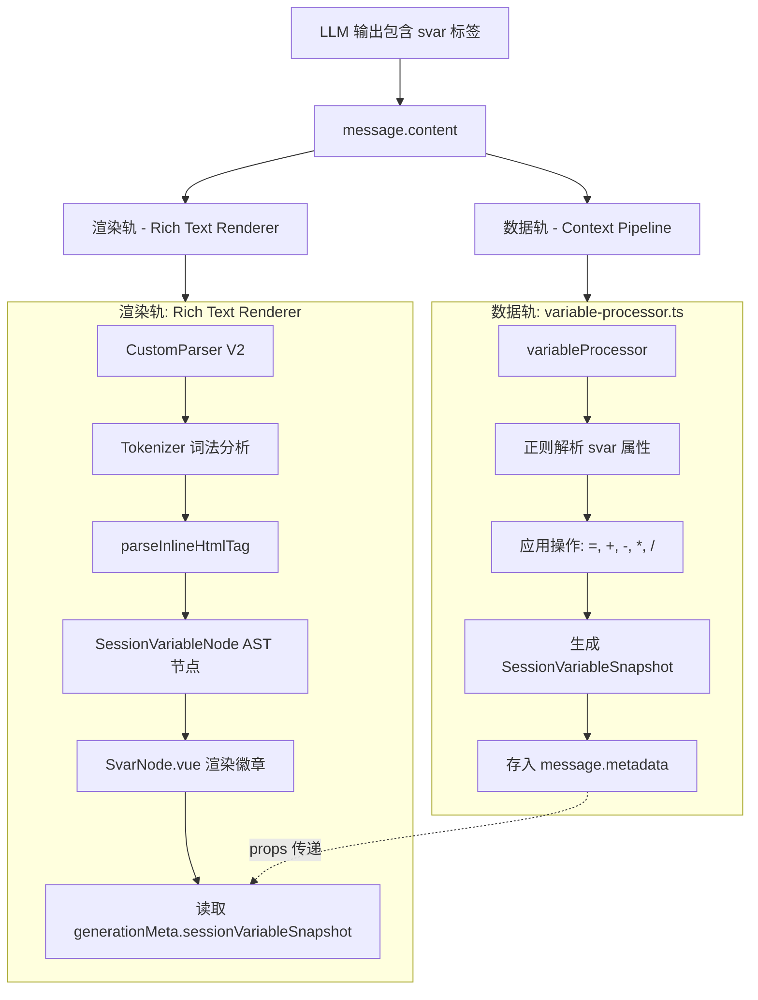

# LLM Chat 变量系统调查报告 (修订版)

> **状态**: `RFC` (Review)
> **前版问题**: 前版报告存在多处事实错误（文件路径错误、臆造不存在的模块），以及不恰当的架构耦合建议。本版基于实际代码调查重写。

## 0. 前版报告勘误

| 前版描述                                                        | 实际情况                                                                                                                                                                                                                                           |
| --------------------------------------------------------------- | -------------------------------------------------------------------------------------------------------------------------------------------------------------------------------------------------------------------------------------------------- |
| 引用 `src/tools/llm-chat/core/macro-engine/macros/variables.ts` | **路径不存在**。正确路径为 [`variables.ts`](../../macro-engine/macros/variables.ts) (`src/tools/llm-chat/macro-engine/macros/variables.ts`)                                                                                                        |
| 称 "MacroProcessor 仅支持扁平的正则替换"                        | 不准确。[`MacroProcessor`](../../macro-engine/MacroProcessor.ts) 实现了完整的三阶段管道 (`PRE_PROCESS` → `SUBSTITUTE` → `POST_PROCESS`)，支持参数解析和上下文传递。它确实不支持块级语法 (`{{if}}...{{/if}}`)，但"仅支持扁平正则替换"是误导性描述。 |
| 建议在世界书中增加变量触发 (Section 3.3)                        | **设计方向有误**。世界书是基于关键词/正则的知识注入系统，变量系统是结构化状态管理系统，两者定位不同，不应交织。详见 §4。                                                                                                                           |
| 称宏系统的变量宏与 variable-processor "脱节" (Section 3.4)      | 这不是 bug，而是**有意为之的设计**。两套变量系统的生命周期和用途完全不同，详见 §2。                                                                                                                                                                |

---

## 1. 系统定位

变量系统（Variable System）是 LLM Chat 的高级功能，旨在为智能体提供**跨消息持久化的结构化状态管理**。典型场景如 RPG 数值追踪（HP、好感度等），允许 LLM 通过特定标签修改状态值，并在后续对话中感知这些值。

---

## 2. 现有架构：两套变量系统

项目中存在**两套独立的变量机制**，各有明确的定位和生命周期：

### 2.1 宏变量 (Macro Variables) — 临时的 Prompt 构建工具

- **位置**: [`macro-engine/macros/variables.ts`](../../macro-engine/macros/variables.ts)
- **存储**: [`MacroContext.variables`](../../macro-engine/MacroContext.ts:37) (`Map<string, string | number>`)，以及 [`MacroContext.globalVariables`](../../macro-engine/MacroContext.ts:39)
- **语法**: `{{setvar::name::value}}`, `{{getvar::name}}`, `{{incvar::name}}`, `{{decvar::name}}`
- **生命周期**: **单次请求内**。每次构建 Prompt 时创建，请求完成后销毁。
- **执行时机**: 由 [`injection-assembler.ts`](../context-processors/injection-assembler.ts) 在组装预设消息时调用
- **用途**: 跨预设消息传递临时状态。例如：在排序靠前的预设中 `{{setvar::mode::combat}}`，后续预设中根据 `{{getvar::mode}}` 决定注入内容。

**关键约束**（已在 [`MACRO.md`](../../macro-engine/MACRO.md:97) 中明确记录）：

> 变量内容不会持久化到数据库。当回复生成后，这些临时变量就会被销毁，无法跨轮次使用。

### 2.2 会话变量 (Session Variables) — 持久化的游戏状态

- **位置**: [`variable-processor.ts`](../context-processors/variable-processor.ts)
- **类型定义**: [`sessionVariable.ts`](../../types/sessionVariable.ts)
- **存储**: 快照 ([`SessionVariableSnapshot`](../../types/sessionVariable.ts:77)) 存储在 `message.metadata.sessionVariableSnapshot` 中
- **写入语法**: `<svar name="path.to.var" op="+" value="10" />` — 由 LLM 在回复中生成
- **读取语法**: `$[path.to.var]` 或 `$[svars::table]` — 在 Prompt 中替换为当前值
- **生命周期**: **跨消息持久化**。快照随消息存储，支持增量回溯计算。
- **执行时机**: [`variableProcessor`](../context-processors/variable-processor.ts:22) 的优先级为 500，在注入组装 (400) 之后执行
- **用途**: RPG 风格的持久状态追踪（HP、好感度、金币等）

### 2.3 结论：两套系统不是 "脱节"，而是 "分层"

| 维度     | 宏变量          | 会话变量               |
| -------- | --------------- | ---------------------- |
| 生命周期 | 单次请求        | 跨对话持久             |
| 谁写入   | Prompt 模板作者 | LLM 在回复中           |
| 谁读取   | Prompt 模板内   | Prompt 模板 + UI       |
| 存储位置 | 内存 (Map)      | 消息元数据 (IndexedDB) |
| 主要用途 | Prompt 工程     | 游戏/叙事状态          |

这两套系统**不应合并**。但可以考虑在会话变量处理器中注入桥接能力（如将当前会话变量快照注入到宏上下文中，让宏也能读取持久变量），这是增强而非合并。

---

## 3. `<svar>` 双轨处理架构

`<svar>` 标签在系统中具有**双重身份**——它既是数据操作指令，也是 UI 装饰元素。标签被两个完全独立的系统分别解析和处理。

### 3.1 双轨处理流程



### 3.2 数据轨：[`variable-processor.ts`](../context-processors/variable-processor.ts)

- **触发时机**: 上下文管线 (Context Pipeline) 执行阶段，优先级 500
- **解析方式**: 正则 [`SVAR_REGEX`](../context-processors/variable-processor.ts:13) = `/<svar\s+([^>]*?)\/?>/g`
- **核心逻辑**:
  1. 遍历所有消息，用正则提取 `<svar>` 标签的 `name/op/value` 属性
  2. 对变量状态执行算术操作（`=`, `+`, `-`, `*`, `/`），带边界约束
  3. 生成 [`SessionVariableSnapshot`](../../types/sessionVariable.ts:77) 并存入 `message.metadata.sessionVariableSnapshot`
  4. 执行 `$[path.to.var]` 替换和 `$[svars::format]` 格式化
- **输出**: 快照数据（values + changes 列表）持久化到 IndexedDB

### 3.3 渲染轨：Rich Text Renderer

`<svar>` 标签在富文本渲染引擎中作为**一等 AST 公民**被完整处理：

#### 3.3.1 解析层

- **文件**: [`parseHtmlInline.ts`](../../../../rich-text-renderer/parser/inline/parseHtmlInline.ts:95)
- **逻辑**: 当词法分析器遇到 `<svar>` 的 `html_open` Token 时，特殊处理为 [`SessionVariableNode`](../../../../rich-text-renderer/types.ts:436) AST 节点
- **提取属性**: `name` (或 `path`)、`op`（默认 `=`）、`value`
- **注意**: 这里的解析是从 Token 流中进行的，与数据轨的正则解析完全独立

#### 3.3.2 渲染层

- **AST 注册**: 在 [`AstNodeRenderer.tsx`](../../../../rich-text-renderer/components/AstNodeRenderer.tsx:72) 中，`session_variable` 类型映射到 [`SvarNode.vue`](../../../../rich-text-renderer/components/nodes/SvarNode.vue)
- **渲染效果**: 内联徽章（badge），包含：
  - 左侧：变量名（主题色背景）
  - 右侧：数值变化（`旧值 → 新值`，或 `操作符 + 值`）
  - Tooltip：完整的变更详情（路径、操作、历史值）
- **数据来源**: 通过 `generationMeta.sessionVariableSnapshot` prop 获取快照数据中的 [`VariableChange`](../../types/sessionVariable.ts:60) 记录，精确匹配当前 `<svar>` 对应的变更条目

#### 3.3.3 样式定制

- **默认样式**: [`SvarNode.vue`](../../../../rich-text-renderer/components/nodes/SvarNode.vue:49) 内置了 scoped CSS（边框、圆角、hover 发光效果）
- **自定义覆盖**: 智能体配置中的 [`VariableConfig.customStyles`](../../types/sessionVariable.ts:40) 字段允许作者编写 CSS 覆盖 `.svar-badge` 等类名
- **注入机制**: [`LlmChat.vue`](../../LlmChat.vue:552) 通过 `<component is="style">` 全局注入智能体的 `customStyles`，这意味着 CSS 是**非隔离的全局注入**
- **编辑入口**: [`SessionVariableSection.vue`](../../components/agent/agent-editor/sections/SessionVariableSection.vue:44) 提供 textarea 编辑

### 3.4 消息级快照查看器

除了内联徽章，系统还在消息菜单栏提供了完整的快照查看入口：

- **触发**: [`MessageMenubar.vue`](../../components/message/MessageMenubar.vue:523) 中，当消息的 `metadata.sessionVariableSnapshot` 存在时，显示变量图标按钮
- **组件**: [`MessageVariableSnapshot.vue`](../../components/message/MessageVariableSnapshot.vue) 提供完整的变量状态面板：
  - 搜索过滤、仅看变更过滤
  - 变更项高亮（老值 → 新值 + 操作符徽章）
  - 全屏对话框查看（`BaseDialog`）
  - 路径一键复制
  - 快照时间戳

### 3.5 语法问题分析

**语法层面：**

1. **LLM 输出不稳定**: LLM 不擅长精确的 XML 属性格式。实际可能产生：
   - `<svar name="hp" op="+" value="10"></svar>`（配对标签，数据轨正则不匹配）
   - `<svar name='hp' op='+' value='10'/>`（单引号，数据轨正则可匹配）
   - `<svar name=hp op=+ value=10 />`（无引号，数据轨正则可匹配）
   - 属性乱序、多余空格等各种变体

2. **ATTR_REGEX 脆弱**: `[^"'\s>]+` 不支持值中包含空格的情况（即使被引号包裹），例如 `value="hello world"` 只会匹配到 `hello`。

3. **与 HTML/XML 内容冲突**: 如果对话涉及代码讨论，`<svar>` 可能被误触发。

4. **`$[...]` 替换符冲突风险**: `$[` 在某些模板语言、正则表达式中是有意义的字符序列，存在误触发可能。

**架构层面：**

5. **双轨解析不一致**: 数据轨使用正则解析，渲染轨使用 Tokenizer + AST 解析。两套解析器对同一标签的容错行为不同，可能导致数据轨成功处理但渲染轨无法显示（或反之）。

6. **`$[...]` 替换的幂等性**: [`variable-processor.ts`](../context-processors/variable-processor.ts:163) 在管线副本中执行 `$[...]` 替换。由于管线每次从原始数据无状态构建，替换本身不会污染原始 `message.content`，但需确保管线内不会对同一副本重复执行。

### 3.6 改进建议

**短期（兼容性修复）：**

- 增强 `SVAR_REGEX` 以同时匹配配对标签：`/<svar\s+([^>]*?)\/?>([\s\S]*?<\/svar>)?/g`
- 改进 `ATTR_REGEX` 以支持带空格的引号值：`/(\w+)=(?:"([^"]*)"|'([^']*)'|(\S+))/g`
- **统一解析器**: 考虑让数据轨复用渲染轨的 Tokenizer 解析结果，而非独立正则，减少解析不一致

**中期（语法简化）：**

- 考虑更 LLM 友好的语法，例如 JSON 块：

  ````
  ```svar
  {"hp": "+10", "gold": "-5", "mood": "=excited"}
  ```
  ````

  JSON 格式对 LLM 更自然，解析也更稳定。

- **`customStyles` 安全增强**: 将全局注入改为作用域注入（利用富文本渲染器已有的 `cssUtils.ts` CSS 作用域化能力），或至少增加基础安全过滤

**长期（协议化）：**

- 将变量修改视为一种"工具调用"，利用已有的 Tool Call 基础设施让 LLM 通过 function call 修改变量，而不是在文本中嵌入标签。这是最可靠的方案，但依赖 Tool Call 系统的成熟度。

---

## 4. 世界书与变量：为什么不应交织

前版报告建议"在世界书条目中增加 `condition` 字段，并在 `WorldbookProcessor` 中实现条件校验逻辑"。这违反了系统的职责边界。

### 4.1 世界书的定位

[`WorldbookProcessor`](../context-processors/worldbook-processor.ts:132) 是一个**基于文本匹配的知识注入系统**，与 SillyTavern 兼容。其激活条件完全基于：

- 关键词/正则匹配（主键 + 二级键 + 四种逻辑组合）
- 扫描深度 (Scan Depth)
- 持续激活 (Sticky) / 冷却 (Cooldown) / 延迟 (Delay)
- 概率 (Probability)
- 角色/标签过滤器
- 分组竞争 (Inclusion Groups)

这些机制全部是**文本/上下文驱动**的。世界书的核心价值在于"当对话提到某个关键词时，自动补充相关背景设定"——这是一种**被动的、无状态的**知识检索机制。

### 4.2 变量系统的定位

变量系统是**主动的、有状态的**数值管理。它追踪的是"游戏世界的当前状态"，而非"对话中出现了什么关键词"。

### 4.3 如果需要"根据变量值注入内容"

正确的做法是在**变量系统自身**中实现条件注入能力，而不是改造世界书。具体方式：

1. **方案 A — 条件宏 (推荐)**：在宏引擎中增加条件块语法，让 Prompt 模板自身具备条件判断：

   ```
   {{if::$[stats.hp]<20}}
   [系统提示：角色当前处于虚弱状态，描写应体现疲惫和痛苦]
   {{/if}}
   ```

   这完全在 Prompt 模板层面解决，不侵入世界书。

2. **方案 B — 变量驱动的注入处理器**：创建一个独立的 `VariableInjectionProcessor`，它读取变量配置中定义的"条件注入规则"（如：当 `hp < 20` 时注入 "虚弱描写"），独立于世界书运行。

3. **方案 C — Prompt 模板 + `$[svars::table]`**：用户已经可以通过在 System Prompt 中写 `$[svars::table]` 将变量状态告知 LLM，由 LLM 自己判断角色应该处于什么状态。这是最简单的方案，且不需要额外开发。

---

## 5. 现状评估汇总

### 5.1 已完成 ✅

| 模块         | 文件                                                                   | 状态                                                 |
| ------------ | ---------------------------------------------------------------------- | ---------------------------------------------------- |
| 类型定义     | [`sessionVariable.ts`](../../types/sessionVariable.ts)                 | 完整                                                 |
| 配置编辑器   | `VariableTreeEditor.vue`                                               | 基本可用                                             |
| 核心处理引擎 | [`variable-processor.ts`](../context-processors/variable-processor.ts) | 核心逻辑就绪（增量快照、标签解析、值替换、边界处理） |
| 展示组件     | `MessageVariableSnapshot.vue`                                          | 已开发                                               |
| 分析器视图   | `VariablesView.vue`                                                    | 已集成到上下文分析器                                 |

### 5.2 待解决 🔴

| 优先级       | 问题                    | 说明                                                                                                                                       |
| ------------ | ----------------------- | ------------------------------------------------------------------------------------------------------------------------------------------ |
| ~~CRITICAL~~ | ~~UI 集成缺失~~         | **已解决**。`MessageVariableSnapshot.vue` 已通过 `MessageMenubar.vue` 的 Popover 集成到消息流；`SvarNode.vue` 在渲染引擎中提供内联徽章展示 |
| **HIGH**     | `<svar>` 语法脆弱       | LLM 输出不稳定 + 正则解析不够健壮（见 §3.5）                                                                                               |
| **HIGH**     | 双轨解析不一致          | 数据轨（正则）和渲染轨（Tokenizer）对同一标签的解析行为不同，可能导致数据处理成功但 UI 无法显示（或反之）                                  |
| **MEDIUM**   | `customStyles` 全局注入 | 智能体的 `customStyles` 通过全局 `<style>` 注入，无作用域隔离，存在样式污染风险                                                            |
| **MEDIUM**   | 条件逻辑缺失            | 宏引擎不支持块级条件语法，无法根据变量值动态决定 Prompt 内容                                                                               |
| **MEDIUM**   | 变量注入依赖手动        | 需用户在 Prompt 中手动写 `$[svars::table]`，缺少自动注入开关                                                                               |
| **LOW**      | 类型校验缺失            | 编辑器中初始值输入无类型约束                                                                                                               |
| **LOW**      | 缺少实时监控            | 没有常驻面板查看当前变量状态                                                                                                               |

---

## 6. 建议的执行计划

### Phase 1：修复基础 — 统一双轨、增强健壮性

1. **~~集成 `MessageVariableSnapshot.vue` 到消息流~~** ✅ 已完成
   - `MessageMenubar.vue` 已集成 Popover 查看器
   - `SvarNode.vue` 已在渲染引擎中提供内联徽章
2. **统一双轨解析**
   - 考虑让数据轨复用渲染轨的 Tokenizer 解析结果，或至少统一解析规则
   - 增加配对标签支持：`/<svar\s+([^>]*?)\/?>([\s\S]*?<\/svar>)?/g`
   - 改进属性解析正则
3. **防止 `$[...]` 重复替换**
   - 确保替换操作的幂等性，或标记已替换的消息

### Phase 2：语法演进 — 提升 LLM 合作质量

1. **评估并实现更 LLM 友好的语法**（JSON 代码块 或 Tool Call）
2. **保持 `<svar>` 向后兼容**，同时支持新语法
3. **增加自动注入开关**：允许在 Agent 配置中勾选"自动将可见变量注入 System Prompt 末尾"

### Phase 3：条件能力 — 独立于世界书的分支逻辑

1. **在宏引擎中增加条件块支持**（`{{if::condition}}...{{/if}}`）
2. **实现条件求值器**：轻量沙箱，支持比较运算和变量引用
3. **可选：变量驱动注入处理器**（独立于世界书的条件注入机制）

### Phase 4：体验优化

1. 侧边栏/浮窗变量监控面板
2. 编辑器类型校验增强
3. 宏上下文桥接（让 `{{getvar}}` 也能读取持久会话变量的当前值）
