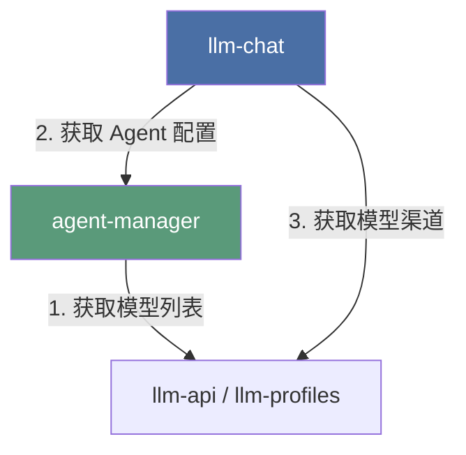

# LLM Chat: Agent 配置管理解耦及智能体大厅建设方案 (施工级图纸版)

> 最后更新：2026-07-08
> 状态：RFC (Request for Comments)
> 关联模块：`src/tools/agent-manager/` (待创建)

## 1. 核心设计哲学：工具高度自治与门户化

根据移动端 `mobile-agent-manager-plan.md` 的前沿探索，AIO Hub 的终极形态是**工具高度自治与微服务化**。
我们不应将 Agent 强行“全局化抬升”到全局 `src/stores`，也不应让它继续物理寄生在 `llm-chat` 内部。

相反，我们应该在桌面端**完全对齐移动端的架构苗头**，将它彻底剥离为**平级的独立工具**，并为它建设**完整的、有生命力的独立工具门户（Portal）**：

```
src/tools/
├── 📂 llm-chat/                 # [工具 A: 树状分支聊天运行时] (纯粹的消费方)
│   └── 聚焦于：会话树、消息流式收发、虚拟渲染、上下文管道构建
│
└── 📂 agent-manager/            # [工具 B: 智能体管理器] (独立工具门户)
    └── 聚焦于：智能体大厅、Agent 增删改查、导入导出、私有资产管理、世界书管理
```

### 依赖方向（单向依赖，无循环引用）



---

## 2. 门户（Portal）与自治界面设计

为了避免将解耦后的模块做成死板的“组件库”，我们必须为它建设完整的独立工具门户，并打通它与 `llm-chat` 之间的双向联动管道。

### 2.1. `agent-manager` (智能体大厅) 门户设计

`agent-manager` 不再只是一个配置后台，而是一个**“智能体大厅”**。

- **主页面路径**：`src/tools/agent-manager/AgentManager.vue`
- **界面布局与功能**：
  1.  **智能体网格/列表**：以卡片形式展示所有智能体，展示头像、名称、描述、标签和分类。
  2.  **搜索与过滤栏**：支持按名称、描述、标签、分类进行模糊搜索 and 筛选。
  3.  **全局操作区**：
      - **新建智能体**：点击打开 `EditAgentDialog.vue`。
      - **导入智能体**：支持本地 JSON 导入、VCP 预设导入、酒馆（SillyTavern）角色卡导入。
      - **批量导出**：支持勾选多个智能体进行批量打包导出。
  4.  **智能体卡片操作（核心联动点）**：
      - **【发起对话】（核心）**：点击后，自动调用 `toolsStore.openTool('llm-chat')`，并将 `llm-chat` 的当前智能体切换为该智能体，实现**“大厅选人 -> 自动开聊”**的无缝闭环！
      - **编辑**：就地打开编辑器。
      - **复制**：快速克隆一个新智能体。
      - **删除**：安全删除（带二次确认）。

### 2.2. 入口拆除与就地弹窗保留 (Settings)

为了在实现工具自治的同时，保证极致的 Lossless UX（零体验折损），我们对入口进行如下优化：

1.  **就地编辑体验**：在 `llm-chat` 内部，我们保留就地编辑的入口，但其实现组件直接从 `agent-manager` 导入：
    ```vue
    <!-- src/tools/llm-chat/components/ChatArea.vue -->
    <script setup lang="ts">
    import EditAgentDialog from "@/tools/agent-manager/components/management/EditAgentDialog.vue";
    </script>
    ```

---

## 3. 核心解耦机制与状态同步 (施工级细节)

为了实现无循环引用的单向依赖，同时保证极致的 Lossless UX（零体验折损），我们必须在代码层面解决以下三个核心耦合点：

### 3.1. 状态同步：`currentAgentId` 的优雅解耦

#### 现状与痛点

目前 `agentStore.ts` 深度依赖 `llm-chat` 内部的 `useLlmChatUiState` 来读写 `currentAgentId`。如果直接迁移，会导致 `agent-manager` 反向依赖 `llm-chat`，造成循环引用。

#### 施工方案 (状态保留在 Chat 侧，解耦联动)

为了保持 `agent-manager` 作为通用智能体管理器的纯净性，它**不应该感知任何聊天运行时的 UI 状态**。因此，`currentAgentId` 必须**彻底留在 `llm-chat` 内部**，而 `agentStore` 保持无状态。

1.  **状态保留**：`currentAgentId` 依然作为纯粹的聊天 UI 状态，保留在 `llm-chat` 的 `useLlmChatUiState.ts` 中。
2.  **单向按需加载**：`agentStore` 不再在初始化时读取 `currentAgentId`。它仅提供一个通用的按需加载接口：
    ```typescript
    // src/tools/agent-manager/stores/agentStore.ts
    // 仅提供纯粹的数据管理，不包含 currentAgentId 状态
    actions: {
      async loadAgentDetails(agentId: string) {
        // 按需加载特定智能体的完整配置与资产
      }
    }
    ```
    在 `llm-chat` 初始化或切换智能体时，由 `llm-chat` 主动调用此接口：
    ```typescript
    // src/tools/llm-chat/LlmChat.vue 或相关初始化逻辑
    watch(
      currentAgentId,
      async (newId) => {
        if (newId) {
          await agentStore.loadAgentDetails(newId);
        }
      },
      { immediate: true }
    );
    ```
3.  **删除联动解耦**：当 `agentStore` 删除了某个智能体时，它只负责纯粹的数据删除，不再直接修改 `currentAgentId`。由 `llm-chat` 侧通过监听（`watch`）来安全地处理状态回退：
    ```typescript
    // src/tools/llm-chat/composables/ui/useLlmChatUiState.ts
    // 监听智能体列表变化，如果当前选中的智能体被删除了，安全回退
    watch(
      () => agentStore.agents,
      (newAgents) => {
        if (
          currentAgentId.value &&
          !newAgents.some((a) => a.id === currentAgentId.value)
        ) {
          currentAgentId.value = newAgents[0]?.id || null;
        }
      }
    );
    ```
4.  **磁盘存储解耦**：`currentAgentId` 不再保存在 `agent-manager` 的 `agents-index.json` 中，而是作为 Chat 的 UI 偏好，直接持久化在 `llm-chat` 自身的 `ui-state.json` 中。

### 3.2. 问候语同步：反向依赖的优雅解耦

#### 现状与痛点

当智能体的 `greetings` 发生变化时，`agentStore.updateAgent` 会动态导入 `llmChatStore`、`greetingService` 和 `useSessionManager`，遍历所有会话并重建未固化的开局消息。这导致配置管理层深度耦合了聊天运行时。

#### 施工方案

1.  **职责剥离**：将问候语重建逻辑从 `agentStore.updateAgent` 中彻底移除。`agentStore` 只负责纯粹的配置持久化。
2.  **就地触发（活动会话）**：在 `llm-chat` 侧，当用户在聊天界面通过 `EditAgentDialog` 保存智能体时，在保存回调中显式触发当前活动会话的问候语重建：

    ```typescript
    // src/tools/llm-chat/components/ChatArea.vue
    const handleSaveAgent = async (updatedAgent: ChatAgent) => {
      await agentStore.updateAgent(updatedAgent.id, updatedAgent);

      // 仅在当前编辑的智能体是当前会话的智能体时，触发问候语同步
      if (updatedAgent.id === currentAgentId.value) {
        const { rebuildLiveGreetings } =
          await import("../services/greetingService");
        const { useLlmChatStore } = await import("../stores/llmChatStore");
        // 执行当前活动会话的问候语重建与会话持久化...
      }
    };
    ```

3.  **懒加载兜底（非活动会话）**：由于 `ChatArea.vue` 无法（也不应该）在后台遍历所有历史会话，对于非活动会话，采用**“被动兜底/懒加载”**策略：当用户切换到其他历史会话（加载消息流）时，动态检查当前未固化的开局消息与智能体最新的 `greetings` 是否一致，若不一致则就地动态重建。
4.  **收益**：`agent-manager` 彻底摆脱了对聊天运行时和会话管理器的依赖，实现了纯净的单向依赖。

### 3.3. 磁盘存储路径的无缝兼容与彻底自治

#### 现状与痛点

用户的智能体配置文件和头像资产已经保存在 `{appConfigDir}/llm-chat/agents/` 目录下。如果直接修改存储路径，会导致老用户数据“丢失”。但如果永远不改，就无法实现彻底的工具自治。

#### 施工方案

1.  **彻底自治**：在迁移后的 `useAgentStorage.ts` 中，将 `MODULE_NAME` 修改为 `"agent-manager"`，实现物理路径的彻底自治。
2.  **冷启动自动迁移**：通过 5.1 节设计的“冷启动自动检测与物理迁移”管道，在应用首次启动时，自动将旧路径数据安全迁移到新路径下。
3.  **前端复制路径更新**：同步更新 `agentStore.ts` 中 `duplicateAgent` 方法的硬编码路径，将 `llm-chat/agents` 相对路径更新为 `agent-manager/agents`。
4.  **Rust 后端同步修改**：修改 Rust 后端 `src-tauri/src/commands/agent_asset_manager.rs` 中的 `get_agent_assets_dir` and `delete_agent_asset`，将硬编码的 `"llm-chat"` 路径统一修改为 `"agent-manager"`，确保前后端读写路径完全一致。

---

## 4. Git 移动指令集 (Git Move Commands)

为了完美继承 Git 历史记录，**严禁直接复制文件**。必须在 Windows PowerShell 终端中按顺序执行以下 `git mv` 命令：

```powershell
# 1. 创建目标目录结构
New-Item -ItemType Directory -Force -Path "src/tools/agent-manager/stores"
New-Item -ItemType Directory -Force -Path "src/tools/agent-manager/composables/storage"
New-Item -ItemType Directory -Force -Path "src/tools/agent-manager/services"
New-Item -ItemType Directory -Force -Path "src/tools/agent-manager/utils"
New-Item -ItemType Directory -Force -Path "src/tools/agent-manager/types"
New-Item -ItemType Directory -Force -Path "src/tools/agent-manager/config"
New-Item -ItemType Directory -Force -Path "src/tools/agent-manager/components"

# 2. 使用 git mv 移动文件，保留 Git 历史
git mv "src/tools/llm-chat/stores/agentStore.ts" "src/tools/agent-manager/stores/agentStore.ts"
git mv "src/tools/llm-chat/composables/storage/useAgentStorageSeparated.ts" "src/tools/agent-manager/composables/storage/useAgentStorage.ts"
git mv "src/tools/llm-chat/services/agentManagementService.ts" "src/tools/agent-manager/services/agentManagementService.ts"
git mv "src/tools/llm-chat/services/agentImportService.ts" "src/tools/agent-manager/services/agentImportService.ts"
git mv "src/tools/llm-chat/services/agentExportService.ts" "src/tools/agent-manager/services/agentExportService.ts"
git mv "src/tools/llm-chat/services/agentMigrationService.ts" "src/tools/agent-manager/services/agentMigrationService.ts"
git mv "src/tools/llm-chat/services/vcpChatAgentImportService.ts" "src/tools/agent-manager/services/vcpChatAgentImportService.ts"
git mv "src/tools/llm-chat/services/agentAssetService.ts" "src/tools/agent-manager/services/agentAssetService.ts"
git mv "src/tools/llm-chat/utils/agentAssetUtils.ts" "src/tools/agent-manager/utils/agentAssetUtils.ts"
git mv "src/tools/llm-chat/types/agent.ts" "src/tools/agent-manager/types/agent.ts"
git mv "src/tools/llm-chat/types/agentImportExport.ts" "src/tools/agent-manager/types/agentImportExport.ts"
git mv "src/tools/llm-chat/config/defaultAgentTemplate.ts" "src/tools/agent-manager/config/defaultAgentTemplate.ts"

# 3. 移动整个组件目录
git mv "src/tools/llm-chat/components/agent" "src/tools/agent-manager/components/agent"
```

---

## 5. 数据迁移与历史兼容方案 (Data Migration & Compatibility)

To ensure that old users do not lose, damage, or break their historical agent configurations, custom avatars, etc. when upgrading to the decoupled version, we must design a rigorous data migration and path compatibility mechanism.

### 5.1. 迁移策略：渐进式物理迁移 (Progressive Migration)

虽然“保持原路径不变”是最省事的方案，但为了实现彻底的工具自治，数据最终应当归属于各自的工具目录下。我们采用**“冷启动自动检测与物理迁移”**的渐进式策略：

```
[旧路径] {appConfigDir}/llm-chat/agents/
   │
   ├── (冷启动检测：新路径无数据 && 旧路径有数据)
   │
   ▼
[备份] {appConfigDir}/backups/migration_backup_{timestamp}/  (安全第一，先行备份)
   │
   ├── (物理复制与校验)
   │
   ▼
[新路径] {appConfigDir}/agent-manager/agents/
```

#### 路径映射规范

| 数据类型             | 旧物理路径 (寄生在 `llm-chat`)           | 新物理路径 (独立自治)                  |
| :------------------- | :--------------------------------------- | :------------------------------------- |
| **智能体索引与配置** | `{appConfigDir}/llm-chat/agents/`        | `{appConfigDir}/agent-manager/agents/` |
| **智能体头像与资产** | `{appConfigDir}/llm-chat/agents/assets/` | `{appConfigDir}/agent-manager/assets/` |

---

### 5.2. 核心迁移算法与冷启动流程

在 `agent-manager` 的 `useAgentStorage.ts` 初始化（`load()`）时，自动触发以下迁移管道：

```typescript
// src/tools/agent-manager/composables/storage/useAgentStorage.ts
import {
  exists,
  mkdir,
  copyFile,
  remove,
  readDir,
} from "@tauri-apps/plugin-fs";
import { join, appConfigDir } from "@tauri-apps/api/path";

export async function triggerDataMigration() {
  const configDir = await appConfigDir();
  const oldPath = await join(configDir, "llm-chat", "agents");
  const newPath = await join(configDir, "agent-manager", "agents");

  // 1. 幂等性检查：如果新路径已经存在数据，说明已经迁移过，直接跳过
  if (await exists(newPath)) {
    const newFiles = await readDir(newPath);
    if (newFiles.length > 0) return; // 已有数据，无需迁移
  }

  // 2. 检测旧路径是否存在数据
  if (!(await exists(oldPath))) return; // 无旧数据，纯净新安装
  const oldFiles = await readDir(oldPath);
  if (oldFiles.length === 0) return;

  const logger = createModuleLogger("agent-migration");
  logger.info("检测到历史智能体数据，启动自动迁移管道...");

  const timestamp = Date.now();
  const backupPath = await join(
    configDir,
    "backups",
    `migration_backup_${timestamp}`
  );

  // 引入临时标记文件，确保迁移的原子性
  const progressFlagPath = await join(newPath, ".migration_in_progress");

  try {
    // 3. 安全备份：将旧数据完整复制到备份目录
    await mkdir(backupPath, { recursive: true });
    await deepCopyDirectory(oldPath, backupPath);
    logger.info("历史数据备份成功", { backupPath });

    // 4. 物理迁移：创建新目录并复制数据
    await mkdir(newPath, { recursive: true });
    // 写入临时标记文件，表示迁移正在进行中
    await writeTextFile(progressFlagPath, "in_progress");
    await deepCopyDirectory(oldPath, newPath);
    logger.info("数据物理迁移完成，开始完整性校验...");

    // 5. 完整性校验：对比新旧目录文件数量与大小
    const isVerified = await verifyMigration(oldPath, newPath);
    if (!isVerified) {
      throw new Error("迁移校验失败：文件数量或大小不一致");
    }

    // 校验通过，安全删除临时标记文件
    await remove(progressFlagPath);

    // 6. 清理旧路径（可选/延迟清理）：为了绝对安全，第一阶段仅重命名旧路径为 .bak，稳定运行一个版本后再物理删除
    const oldPathBak = `${oldPath}.migrated.bak`;
    await rename(oldPath, oldPathBak);
    logger.info("旧数据已安全归档", { oldPathBak });
  } catch (error) {
    logger.error("数据迁移失败，启动自动回滚！", error);
    // 异常回滚：如果新路径创建了一半，清理掉，防止残留脏数据
    if (await exists(newPath)) {
      await remove(newPath, { recursive: true });
    }
    // 提示用户，但不阻断程序启动（降级为使用空数据启动）
    customMessage.error(
      "历史数据迁移失败，已安全回滚。请在群里反馈、提交 Issue 或检查日志。"
    );
  }
}
```

---

### 5.3. 历史资产路径 of 动态适配 (Asset Path Resolver)

#### 真实机制：基于智能体目录的相对路径

在实际实现中，智能体头像在 `agent.json` 配置文件中，实际上是保存为**基于智能体目录的相对路径**（如 `avatar-123.png`），或者是 emoji（如 `✨`），或者是网络 URL。
只有在前端运行时，通过 `useResolvedAvatar.ts` 才会动态将其拼接为 `appdata://llm-chat/agents/${entity.id}/${icon}`。
在保存时，`useAgentStorageSeparated.ts` 会通过 `selfAssetPathPrefix`（即 `appdata://llm-chat/agents/${agent.id}/`）将完整的 `appdata://` 协议路径截断为相对文件名（如 `avatar-123.png`）再写入磁盘。

#### 解决方案：动态协议头解析与保存截断更新

由于保存在 `agent.json` 中的是相对路径（如 `avatar-123.png`），我们不需要对配置文件中的头像路径进行任何物理修改。我们只需要在解耦迁移时，同步更新协议头的解析与截断逻辑：

1. **动态解析器更新 (`useResolvedAvatar.ts`)**：
   将动态拼接的协议头从旧路径变更为新路径：
   - 智能体头像：从 `appdata://llm-chat/agents/${entity.id}/${icon}` 变更为 `appdata://agent-manager/agents/${entity.id}/${icon}`。

2. **保存截断逻辑更新 (`useAgentStorage.ts`)**：
   在保存配置文件时，截断前缀的逻辑也同步更新为新的前缀：
   - 智能体：`appdata://agent-manager/agents/${agent.id}/`

3. **智能体内部资产路径更新 (`agentAssetUtils.ts`)**：
   对于智能体内部引用的其他资产（如 `agent-asset://` 协议引用的图片、音频等），它们在 `agent.json` 中保存的也是相对路径（如 `assets/xxx.png`）。
   在 `agentAssetUtils.ts` 中，通过 `buildAgentAssetPath` 动态拼接为完整路径。解耦后，我们只需要将 `buildAgentAssetPath` 中的 `llm-chat/agents/` 变更为 `agent-manager/agents/` 即可：
   ```typescript
   export function buildAgentAssetPath(
     agentId: string,
     assetPath: string
   ): string | null {
     // ...
     return `${normalizedBase}${separator}agent-manager/agents/${agentId}/${normalizedAssetPath}`;
   }
   ```

通过这种“运行时动态拼接 + 保存时截断”的机制，保存在 `agent.json` 中的相对路径完全不需要任何修改，就能在新路径下无缝加载，实现 100% 安全、优雅的平滑过渡！
