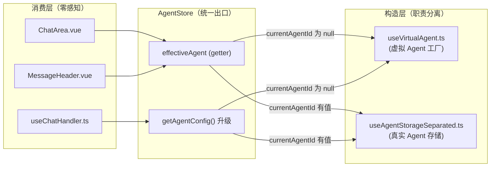
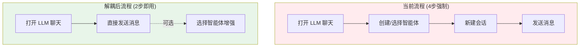

# Agent 与会话解耦实现方案

> **文档状态 (Status)**: `Implementing`
> **版本 (Version)**: 2.0
> **日期 (Date)**: 2026-05-09
> **负责模块**: `llm-chat`

---

## 1. 背景与问题

### 1.1 核心痛点

目前 `llm-chat` 的底层逻辑将"智能体 (Agent)"与"会话 (Session)"进行了强绑定，导致了以下问题：

1. **冷启动障碍**：新用户进入工具后，必须先经历"创建智能体"的繁琐流程，否则无法开启任何对话。
2. **发送逻辑僵化**：发送消息的代码中强制检查 `currentAgentId`，若为空则拒绝发送，不支持"纯模型对话"场景。
3. **状态无法重置**：用户一旦在侧边栏或切换器中选定了某个智能体，就无法再回到"无智能体"的基本助手模式，因为 UI 缺少"取消选择"的操作。
4. **UI 逻辑分裂**：头部 UI 存在硬编码判断，导致在某些状态下（如临时会话）即便选中了智能体也不显示，而消息列表却在渲染智能体的预设内容，造成用户困惑。
5. **配置隔离缺失**：基本助手模式需要一种比普通 Agent 更轻量、更直接的配置方式，用于控制基础开关和美化字段。

### 1.2 预期目标

1. **支持基本助手模式**：会话创建和消息发送不再强制依赖智能体。
2. **虚拟智能体回退**：当未选择智能体时，系统通过空对象模式提供一个完整的 `ChatAgent` 实例，对下游消费者完全透明。
3. **显式取消入口**：在智能体选择器中增加"取消选择（基本助手）"选项，允许用户随时重置状态。
4. **轻量级配置化**：为基本助手模式提供独立的配置弹窗，仅包含功能开关和美化字段。
5. **继承与转化**：支持将当前“基本助手”的配置（模型、参数、名称等）一键转化为正式的智能体。

### 1.3 V1 方案教训（已撤销）

V1 方案采用了"增量打补丁"策略，直接在 `ChatArea.vue`、`useChatHandler.ts` 等消费端散布 `if (!currentAgentId) { ... } else { ... }` 分支。问题：

- **逻辑碎片化**：每个用到 Agent 的地方都需要 `|| assistantConfig.value.xxx` 回退
- **违反开闭原则**：每增加一个 Agent 特性（如知识库），所有分支都要改
- **领域逻辑外溢**：虚拟 Agent 的构造逻辑被暴露在 Handler 中
- **维护成本高**：散弹式修改，改一处漏一处

---

## 2. 架构设计：空对象模式 (Null Object Pattern)

### 2.1 核心原则

**对于 AgentStore 的所有消费者来说，永远存在一个生效中的 Agent。**

差异被封装在 AgentStore 内部，下游不感知。



### 2.2 职责分层

| 层级       | 模块                                        | 职责                                                                                                                            |
| :--------- | :------------------------------------------ | :------------------------------------------------------------------------------------------------------------------------------ |
| **构造层** | `useVirtualAgent.ts`                        | 独立 composable。管理 `assistant.json` 持久化配置；实时构建符合 `ChatAgent` 接口的虚拟对象；提供虚拟 Agent 的 `getConfig()`     |
| **协调层** | `agentStore.ts`                             | Pinia Store。暴露 `effectiveAgent` getter（真实 or 虚拟）；升级 `selectAgent` 支持 `null`；升级 `getAgentConfig` 支持虚拟 Agent |
| **消费层** | `ChatArea.vue` / `useChatHandler.ts` / etc. | 只对接 `effectiveAgent` 和 `getAgentConfig`，**零分支判断**                                                                     |

---

## 3. 技术方案

### 3.1 构造层：`useVirtualAgent.ts`

> 路径：`src/tools/llm-chat/composables/agent/useVirtualAgent.ts`

这是整个方案的核心——一个独立的 composable，负责"基本助手"的全部逻辑。
类比 `useAgentStorageSeparated.ts` 负责真实 Agent 的存储，`useVirtualAgent` 负责虚拟 Agent 的构造与配置管理。

#### 3.1.1 配置持久化

使用 `createConfigManager` 管理 `assistant.json`：

```typescript
export interface BasicAssistantConfig {
  displayName: string; // 默认："助手"
  icon: string; // 默认："✨"
  toolCallEnabled: boolean; // 默认：false

  // ---- 模型选择持久化（用户手动切换后存入，用于覆盖初始化阶段的全局默认值）----
  profileId?: string; // 用户手动选中的服务商 ID（为空时回退到全局默认）
  modelId?: string; // 用户手动选中的模型 ID（为空时回退到全局默认）

  // ---- 参数配置持久化（可选，用户手动调整后存入）----
  parameters?: {
    temperature?: number;
    maxTokens?: number;
  };
}
```

- **存储位置**: `appDataDir/llm-chat/assistant.json`
- **加载时机**: 应用初始化时调用 `loadConfig()`
- **保存方式**: 修改时调用 `saveDebounced()`
- **与真实 Agent 的区别**: 真实 Agent 使用逐智能体文件持久化（`llm-chat/agents/{agentId}.json`）；基本助手使用单文件配置，结构更轻量，仅包含控制面板的开关与自定义选项

#### 3.1.2 虚拟 Agent 构造

暴露一个 `virtualAgent` 计算属性，实时构建符合 `ChatAgent` 接口的完整对象：

```typescript
const VIRTUAL_AGENT_ID = "__VIRTUAL_ASSISTANT__";

const virtualAgent = computed<ChatAgent>(() => ({
  // ---- 身份标识 ----
  id: VIRTUAL_AGENT_ID,
  name: config.value.displayName,
  displayName: config.value.displayName,
  icon: config.value.icon,
  description: "无角色预设，使用全局默认模型",

  // ---- 模型绑定 [持久化 > 全局默认 > 兜底] ----
  // 优先级1：用户手动选择并持久化的模型（存入 assistant.json）
  // 优先级2：全局默认模型（chatSettings.modelPreferences.defaultModel）
  // 优先级3：第一个可用 Profile 的第一个模型（开箱兜底）
  profileId: config.value.profileId || resolvedProfileId.value,
  modelId: config.value.modelId || resolvedModelId.value,

  // ---- 预设消息（仅包含历史记录锚点）----
  presetMessages: [
    {
      id: "virtual-anchor-history",
      parentId: null,
      childrenIds: [],
      role: "system",
      content: "",
      type: "chat_history",
      status: "complete",
      isEnabled: true,
      timestamp: getLocalISOString(),
    },
  ],

  // ---- 参数配置 ----
  parameters: {
    temperature: config.value.parameters?.temperature ?? 1,
    maxTokens: config.value.parameters?.maxTokens ?? 4096,
  },

  // ---- 工具调用配置 ----
  toolCallConfig: {
    ...DEFAULT_TOOL_CALL_CONFIG,
    enabled: config.value.toolCallEnabled,
    autoInjectIfMacroMissing: true,
  },

  // ---- 系统字段 ----
  createdAt: "1970-01-01T00:00:00.000Z", // 固定值，标记为虚拟
  version: 2,
}));
```

**模型解析优先级（三阶回退）**：

| 优先级    | 来源                                                         | 触发条件                         |
| :-------- | :----------------------------------------------------------- | :------------------------------- |
| 1（最高） | `assistant.json` 中的 `profileId`/`modelId`                  | **用户手动切换模型后自动持久化** |
| 2         | 全局默认模型（`chatSettings.modelPreferences.defaultModel`） | 持久化值为空或无效时             |
| 3（兜底） | 第一个可用 Profile 的第一个模型                              | 全局默认模型未设置或无效时       |

**重要区分**：优先级 2/3 仅在首次初始化或重置后生效，**一旦用户手动切换了模型**，优先级 1 就会接管并持久化到 `assistant.json`，后续打开工具时直接读取，不再走初始化流程。

#### 3.1.3 虚拟 Agent 的 `getConfig()`

提供与 `agentStore.getAgentConfig()` 签名一致的配置获取方法：

```typescript
function getVirtualAgentConfig(overrides?: { parameterOverrides?: Partial<LlmParameters> }): AgentConfigResult {
  const base = virtualAgent.value;
  return {
    profileId: base.profileId,
    modelId: base.modelId,
    presetMessages: base.presetMessages ?? [],
    parameters: mergeParameters(base.parameters, overrides?.parameterOverrides),
  };
}
```

#### 3.1.4 暴露接口

```typescript
export function useVirtualAgent() {
  return {
    // 配置管理
    config, // Ref<BasicAssistantConfig>
    isLoaded, // Ref<boolean>
    loadConfig, // () => Promise<void>
    updateConfig, // (updates: Partial<BasicAssistantConfig>) => void
    /** 重置全部持久化配置到出厂默认值：
     *  - displayName → "助手"
     *  - icon → "✨"
     *  - toolCallEnabled → false
     *  - profileId → undefined（回退全局默认）
     *  - modelId → undefined（回退全局默认）
     *  - parameters → undefined（回退默认参数）
     *  会触发 saveDebounced() 写入文件。
     *  UI 层面应调用 useChatHandler 的 handleResetVirtualAgent（如存在）
     *  或直接在配置弹窗中暴露重置按钮。 */
    resetConfig, // () => Promise<void>

    // 虚拟 Agent
    VIRTUAL_AGENT_ID,
    virtualAgent, // ComputedRef<ChatAgent>
    getVirtualAgentConfig, // (overrides?) => AgentConfigResult

    // 工具方法
    isVirtualAgent, // (id: string | null) => boolean
  };
}
```

### 3.2 协调层：`agentStore.ts` 升级

AgentStore 本身的改动**极小**，只需接入虚拟 Agent 的统一出口。

#### 3.2.1 `selectAgent` 支持 `null`

```typescript
async selectAgent(agentId: string | null): Promise<void> {
  const { currentAgentId } = useLlmChatUiState();

  if (agentId === null) {
    currentAgentId.value = null;
    logger.info("已进入基本助手模式");
    return;
  }

  // 原有逻辑不变...
}
```

#### 3.2.2 新增 `effectiveAgent` getter

```typescript
effectiveAgent(): ChatAgent | null {
  const { currentAgentId } = useLlmChatUiState();
  if (currentAgentId.value) {
    return this.getAgentById(currentAgentId.value) ?? null;
  }
  // 回退到虚拟 Agent
  const { virtualAgent } = useVirtualAgent();
  return virtualAgent.value;
}
```

#### 3.2.3 升级 `getAgentConfig`

```typescript
getAgentConfig(
  agentId: string | null,
  overrides?: { parameterOverrides?: Partial<LlmParameters> },
) {
  // 虚拟 Agent 路径
  if (!agentId || agentId === VIRTUAL_AGENT_ID) {
    const { getVirtualAgentConfig } = useVirtualAgent();
    return getVirtualAgentConfig(overrides);
  }

  // 原有真实 Agent 路径（完全不变）...
}
```

#### 3.2.4 新增 `updateAgent` 虚拟 ID 适配

让 `agentStore.updateAgent` 能够识别虚拟 Agent ID 并自动转发配置更新，消费层（如 `ChatArea.vue` 的 `handleSelectModel`）无需增加任何分支判断：

```typescript
updateAgent(agentId: string | null, updates: Partial<ChatAgent>): void {
  // 虚拟 Agent 路径：转发给 useVirtualAgent().updateConfig()
  if (!agentId || agentId === VIRTUAL_AGENT_ID) {
    const { updateConfig } = useVirtualAgent();
    const configUpdates: Partial<BasicAssistantConfig> = {};

    // 转发模型切换（核心新增：持久化 profileId/modelId）
    if (updates.profileId !== undefined) configUpdates.profileId = updates.profileId;
    if (updates.modelId !== undefined) configUpdates.modelId = updates.modelId;

    // 转发通用配置
    if (updates.displayName !== undefined) configUpdates.displayName = updates.displayName;
    if (updates.icon !== undefined) configUpdates.icon = updates.icon;
    if (updates.parameters !== undefined) configUpdates.parameters = updates.parameters;

    updateConfig(configUpdates);
    return;
  }

  // 原有真实 Agent 更新逻辑（完全不变）...
}
```

**转发规则**：仅转发 `BasicAssistantConfig` 接口中定义的字段，未定义的 Agent 专有字段（如 `presetMessages`、`toolCallConfig` 等）不会被错误地持久化到 `assistant.json` 中。

### 3.3 消费层变更（极少改动）

#### 3.3.1 `useChatHandler.ts`

**移除所有 `if (!agentStore.currentAgentId)` 守卫逻辑**，统一调用升级后的 API：

```typescript
// 之前（3处重复）：
if (!agentStore.currentAgentId) {
  throw new Error("请先选择一个智能体");
}
const agentConfig = agentStore.getAgentConfig(agentStore.currentAgentId, ...);

// 之后（统一为）：
const agentConfig = agentStore.getAgentConfig(agentStore.currentAgentId, ...);
if (!agentConfig) {
  throw new Error("无法获取模型配置：请先在设置中配置 AI 服务");
}
```

元数据快照也统一使用 `effectiveAgent`：

```typescript
const currentAgent = agentStore.effectiveAgent;
// 直接使用 currentAgent.name, currentAgent.icon 等，不需要判断
```

#### 3.3.2 `ChatArea.vue`

```typescript
// 之前：
const currentAgent = computed(() => {
  if (!finalCurrentAgentId.value) return null;
  return agentStore.getAgentById(finalCurrentAgentId.value);
});

// 之后：
const currentAgent = computed(() => agentStore.effectiveAgent);
// currentAgent 永远有值，模板中不再需要 v-if="currentAgent"
```

模板中保持 `v-if="currentAgent"` 作为安全防线即可（effectiveAgent 理论上永远非 null，但初始化阶段可能短暂为空）。

#### 3.3.3 `QuickAgentSwitch.vue` / `AgentListItem.vue` / `AgentsSidebar.vue`

在切换列表中增加"基本助手"选项，点击调用 `selectAgent(null)`。
侧边栏右键菜单增加"取消选择"操作。

### 3.4 基本助手配置弹窗

> 路径：`src/tools/llm-chat/components/settings/BasicAssistantSettingsDialog.vue`

轻量级配置界面，仅在基本助手模式下可见。

- **入口**：`ChatArea.vue` 头部，当 `isVirtualAgent(currentAgentId)` 为 true 时显示配置入口
- **配置项**：displayName、icon、toolCallEnabled
- **保存**：调用 `useVirtualAgent().updateConfig()`
- **重置按钮**：调用 `useVirtualAgent().resetConfig()`，一键清除所有持久化配置（包括模型选择、参数等）恢复到出厂默认状态。重置后模型选择会回退到三阶回退的优先级 2/3（全局默认模型 → 兜底），等效于全新安装后的体验

### 3.5 从基本助手继承配置创建智能体

> **功能追加**: 支持将当前基本助手的配置（模型、参数、名称等）一键转化为正式的智能体

#### 3.5.1 功能定位

用户可能在基本助手模式下已经完成了模型选择、参数调优、个性化命名等操作。如果用户觉得这个配置好用，想把它"固化"为一个真正的智能体以便后续添加 System Prompt 或知识库，需要一条平滑的升级路径。

#### 3.5.2 UI 交互设计

在 `CreateAgentDialog.vue` 的"自定义配置"区域增加"从当前助手继承"选项：

1. **入口位置**：`el-divider` 之后，"自定义配置"区域中。
2. **呈现方式**：一个带有当前虚拟 Agent 信息预览的卡片，显示当前的名称、图标、模型名称。
3. **触发条件**：仅在基本助手模式下（即 `currentAgentId` 为 `null` 时）可见。如果当前已选中真实 Agent，则隐藏该选项。
4. **交互流程**：
   - 点击卡片 → 触发 `create-from-virtual` 事件 → `AgentsSidebar.vue` 处理 → 打开 `EditAgentDialog` 并预填数据。

```vue
<!-- 在 CreateAgentDialog.vue 的"自定义配置"区域增加 -->
<template>
  <!-- ... 原有预设和空白创建部分 ... -->
  <el-divider />

  <div class="preset-section" v-if="showInheritOption">
    <h4>继承当前配置</h4>
    <p class="preset-section-desc">将当前基本助手的配置（模型、参数、名称）转化为一个正式的智能体。</p>
    <div class="inherit-card" @click="handleCreateFromVirtual">
      <Avatar
        :src="virtualAgentConfig.value?.icon || '✨'"
        :alt="virtualAgentConfig.value?.name || '助手'"
        :size="40"
        shape="square"
        :radius="6"
      />
      <div class="preset-info">
        <div class="preset-name">{{ virtualAgentConfig.value?.displayName || "助手" }}</div>
        <div class="preset-desc">继承当前模型和参数设置</div>
      </div>
      <el-icon class="arrow-icon"><ArrowRight /></el-icon>
    </div>
  </div>
</template>
```

#### 3.5.3 数据继承逻辑

在 `AgentsSidebar.vue` 中新增 `handleCreateFromVirtual` 方法：

```typescript
const handleCreateFromVirtual = () => {
  const { virtualAgent } = useVirtualAgent();
  const base = virtualAgent.value;

  // 如果没有启用中的虚拟 Agent（理论上不会），回退到空白创建
  if (base.id !== VIRTUAL_AGENT_ID) {
    handleCreateFromBlank();
    return;
  }

  editDialogMode.value = "create";
  editingAgent.value = null;

  // 继承虚拟 Agent 的核心可编辑字段
  editDialogInitialData.value = {
    name: base.name,
    displayName: base.displayName,
    icon: base.icon,
    profileId: base.profileId,
    modelId: base.modelId,
    // 深拷贝参数，避免引用共享
    parameters: base.parameters ? JSON.parse(JSON.stringify(base.parameters)) : { temperature: 1, maxTokens: 4096 },
    // 继承工具调用配置（保留用户开启/关闭的选择）
    toolCallConfig: base.toolCallConfig ? JSON.parse(JSON.stringify(base.toolCallConfig)) : undefined,
    // 虚拟 Agent 的 presetMessages 仅包含 chat_history 锚点，
    // 继承后可以让用户在编辑器中自由添加真正的 System Prompt
    presetMessages: JSON.parse(JSON.stringify(base.presetMessages)),
  };

  editDialogVisible.value = true;
};
```

**继承字段清单**：

| 字段             | 来源                                | 说明                                |
| :--------------- | :---------------------------------- | :---------------------------------- |
| `name`           | `virtualAgent.value.name`           | 即 `config.displayName`，默认"助手" |
| `displayName`    | `virtualAgent.value.displayName`    | 同上                                |
| `icon`           | `virtualAgent.value.icon`           | 默认"✨"                            |
| `profileId`      | `virtualAgent.value.profileId`      | 三阶回退后的最终值                  |
| `modelId`        | `virtualAgent.value.modelId`        | 三阶回退后的最终值                  |
| `parameters`     | `virtualAgent.value.parameters`     | Temperature/MaxTokens               |
| `toolCallConfig` | `virtualAgent.value.toolCallConfig` | 工具启用开关及配置                  |
| `presetMessages` | `virtualAgent.value.presetMessages` | 包含 chat_history 锚点              |

**不继承的字段**：`description`（自动留空让用户填写）、`category`、`tags`、`knowledgeSettings` 等可由用户后续自由定制的字段。

#### 3.5.4 使用场景示例

1. **基础调优 → 固化**：用户在基本助手模式下调好了 Temperature 和 MaxTokens，并打开了工具调用 → 点击"继承当前配置" → 在新 Dialog 中添加 System Prompt 并保存。
2. **模型选定 → 专业化**：用户选了特定的模型（如 Claude 3.5 Sonnet）并在基本助手模式下聊天 → 觉得不错 → 一键转化为正式智能体 → 后续添加知识库。
3. **从零到专业**：用户完全不理解"智能体"概念时先用基本助手 → 熟悉后通过继承入口自然过渡到智能体管理。

---

## 4. 执行计划

| 步骤  | 任务内容                             | 涉及文件                                                         | 改动量          |
| :---- | :----------------------------------- | :--------------------------------------------------------------- | :-------------- |
| **1** | 实现虚拟 Agent 构造 composable       | `composables/agent/useVirtualAgent.ts` (新建)                    | **核心新增**    |
| **2** | AgentStore 接入虚拟 Agent            | `stores/agentStore.ts`                                           | 小改 (~30行)    |
| **3** | Handler 移除守卫逻辑，统一使用新 API | `composables/chat/useChatHandler.ts`                             | 中改 (删减为主) |
| **4** | ChatArea 统一使用 effectiveAgent     | `components/ChatArea.vue`                                        | 小改 (~10行)    |
| **5** | 增加"基本助手"选择入口               | `QuickAgentSwitch.vue`, `AgentListItem.vue`, `AgentsSidebar.vue` | 小改            |
| **6** | 实现配置弹窗                         | `components/settings/BasicAssistantSettingsDialog.vue` (新建)    | 新增            |
| **7** | **实现从基本助手继承配置创建智能体** | `CreateAgentDialog.vue`, `AgentsSidebar.vue`                     | 小改            |

---

## 5. 风险评估

| 风险项           | 描述                                                 | 缓解措施                                                                     |
| :--------------- | :--------------------------------------------------- | :--------------------------------------------------------------------------- |
| **工具调用兼容** | 虚拟 Agent 的 `presetMessages` 中没有 `{{tools}}` 宏 | `toolCallConfig.autoInjectIfMacroMissing = true` 确保自动注入                |
| **上下文管道**   | 零预设场景下管道是否正常                             | 虚拟 Agent 保留 `chat_history` 锚点，管道不会空跑                            |
| **响应式更新**   | 全局默认模型变更后虚拟 Agent 是否跟随                | `virtualAgent` 是计算属性，依赖 `enabledProfiles` 和 `settings` 的响应式 ref |
| **持久化隔离**   | 虚拟 Agent 不应被"持久化"到文件系统                  | `VIRTUAL_AGENT_ID` 前缀明确标识，`persistAgent()` 中可加守卫                 |
| **分离窗口同步** | 基本助手模式在分离窗口中是否正常                     | `effectiveAgent` 基于响应式状态，窗口同步机制无需改动                        |

---

## 6. 用户流程体验影响评估

### 6.1 当前流程 vs 解耦后流程对比



| 维度               | 当前状态                            | 解耦后状态                  | 改善幅度 |
| :----------------- | :---------------------------------- | :-------------------------- | :------- |
| 最短操作步骤       | 4步（开工具→建Agent→建会话→发消息） | 2步（开工具→发消息）        | -50%     |
| 冷启动认知负荷     | 高（需理解"智能体"概念）            | 低（像普通聊天框一样）      | 显著降低 |
| 首次交互时间 (TTI) | ~20秒（从预设中选取并创建或自己写） | ~5秒（打开即用）            | -92%     |
| 状态灵活性         | 单向绑定（绑定后无法解除）          | 双向切换（可绑定 / 可重置） | 新增能力 |

### 6.2 总体评估结论

| 指标           | 评分                | 说明                                       |
| :------------- | :------------------ | :----------------------------------------- |
| 新用户上手体验 | ⭐⭐⭐⭐⭐          | 从"必须先学概念"到"开箱即用"，质变提升     |
| 现有用户影响   | ⭐⭐⭐⭐            | 不破坏现有 Agent 工作流，增加灵活性        |
| 架构侵入性     | ⭐⭐⭐⭐⭐          | 消费层几乎零改动，所有新逻辑封装在构造层   |
| 可维护性       | ⭐⭐⭐⭐⭐          | 未来新增 Agent 特性无需修改消费层          |
| 综合推荐度     | ✅ **强烈推荐实施** | 低风险高收益，核心痛点直接命中用户流失原因 |

**一句话总结**：V2 方案通过**空对象模式**将"基本助手"的全部复杂性封装在 `useVirtualAgent` 单一模块中，消费层（UI + Handler）实现零分支判断，是对 V1 散弹式修改的彻底否定。
